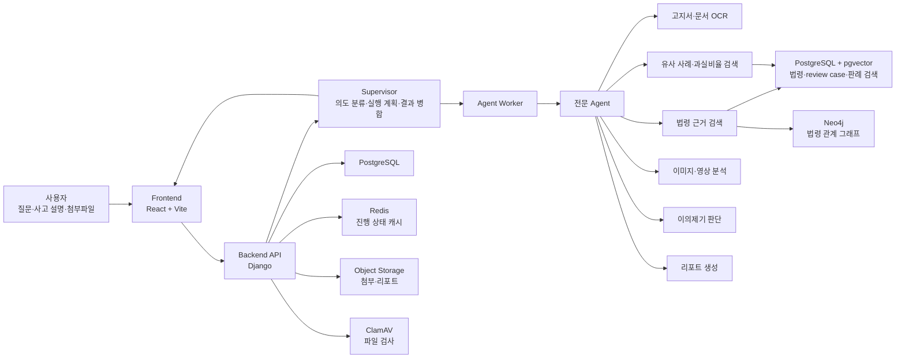

# 차분해(Traffic Dispute AI)

교통사고, 과태료·범칙금 고지서, 과실비율 분쟁 상황에서 사용자가 입력한 사고 경위와 첨부 자료를 바탕으로 쟁점·근거·다음 행동을 정리하는 AI 상담 서비스입니다.

> 이 서비스는 법률 자문이나 과실비율의 확정 판단을 대체하지 않습니다. 결과는 확인된 자료와 검색된 근거를 바탕으로 한 참고용 안내이며, 실제 이의제기·보험 분쟁·행정 절차 전에는 관련 기관 또는 전문가 확인이 필요합니다.

## 주요 기능

- 비회원 상담과 Google 로그인 기반 상담 이력 저장
- 사고 상황·보험사 주장·고지서 내용의 자연어 입력
- 고지서·사실확인원·보조 문서 첨부 및 파일 검사
- 과태료·범칙금 고지서 OCR 및 신뢰도 확인
- 교통사고 과실비율 쟁점 및 유사 사례 검색
- 법령·시행령·시행규칙·행정 기준 근거 검색
- 이의제기 가능성·기한·추가 필요 자료 안내
- 분석 결과 기반 이의신청·사고 분석 리포트 생성 및 다운로드
- 에이전트 실행 상태, 근거, 한계, 다음 행동의 구조화된 추적

## 서비스 흐름



## 멀티 에이전트 구성

Supervisor는 모든 판단을 단독 수행하지 않습니다. 사용자 요청을 분류하고 필요한 전문 Agent의 실행 계획을 만든 뒤, 결과와 근거를 검증하여 최종 응답을 병합합니다.

| Agent | 역할 |
| --- | --- |
| `fine_notice_analysis` | 과태료·범칙금 고지서 OCR, 추출값 및 신뢰도 확인 |
| `law_ground_search` | 법령·시행령·시행규칙·행정 기준 근거 검색 |
| `text_ml_case_search` | review case·과실비율 판례 기반 유사 사례 검색 |
| `vision_media_analysis` | 사고 이미지·영상 분석 |
| `attachment_document_classification` | 업로드 문서 목적·유형 분류 |
| `appeal_decision_flow` | 이의제기 기한·사유·위험도·추가 정보 판단 |
| `objection_report_generation` | 이의제기·사고 분석 리포트 초안 생성 |

일부 전문 흐름은 LangGraph 기반 상태 전이를 사용합니다. 예를 들어 이의제기 판단은 기한 확인 → 법령 확인 → 사유 확인 → 위험도·가능성 판단 → 사용자 안내 순서로 진행되며, 필수 정보가 부족하면 확정 결론 대신 추가 질문을 요청합니다.

## 기술 스택

| 구분 | 사용 기술 |
| --- | --- |
| Frontend | React 19, Vite 7 |
| Backend | Python 3.13, Django 6, Gunicorn |
| 인증 | Google OAuth 2.0 Authorization Code Flow, App JWT |
| AI 오케스트레이션 | Supervisor/Worker 구조, LangGraph |
| LLM·임베딩 | OpenAI 호환 API, `text-embedding-3-large` 등 환경변수 기반 설정 |
| 관계형·벡터 DB | PostgreSQL 16, pgvector, HNSW |
| 그래프 DB | Neo4j 5 |
| 캐시 | Redis 7 |
| 파일 보안 | ClamAV |
| 문서 처리 | PyMuPDF, pdfplumber, python-docx |
| 인프라 | Docker Compose, AWS EC2/RDS/ECR/S3/SSM, Terraform |
| 테스트 | Django Test, pytest |

## 저장소 구조

```text
.
├── app/
│   ├── web/                    # React/Vite 사용자 화면
│   ├── services/               # API·Supervisor·Agent 연결 서비스
│   ├── schemas/                # 화면·API DTO
│   └── api/                    # API entrypoint
├── backend/
│   ├── chatbot/                # Django API, 인증, 작업·파일·리포트 관리
│   └── config/                 # Django 설정
├── ai/
│   ├── agents/                 # 도메인별 전문 Agent
│   ├── supervisor/             # Supervisor 자산
│   ├── schemas/                # Agent result/evidence 계약
│   └── evaluation/             # 모델·출력 품질 검증
├── etl/
│   ├── legal/                  # 법령 수집·정제·임베딩·그래프 적재
│   ├── fault_cases/            # review case·과실비율 사례 파이프라인
│   ├── fine_rules/             # 과태료·범칙금 규칙 데이터
│   └── common/                 # source registry·ingestion 추적
├── storage/                    # DB schema·migration·RAG metadata
├── infra/
│   ├── terraform/              # 기본 인프라 정의
│   └── terraform-pilot/        # Pilot AWS 인프라 정의
├── deploy/
│   ├── aws-pilot/              # Pilot 배포·RAG seed·롤백 스크립트
│   └── runpod-vision/          # 외부 비전 런타임 배포 자산
├── docs/                       # 아키텍처·API·운영·리스크 문서
└── test/                       # 단위·통합·E2E·fixture·수동 시나리오
```

## 빠른 시작

### 1. 사전 요구사항

- Docker Desktop 및 Docker Compose
- Python 3.13 이상
- Node.js 22 이상
- Git

실제 Google 로그인, OpenAI 기반 임베딩·LLM, 외부 비전 분석을 사용하려면 별도 API 키와 환경변수 설정이 필요합니다.

### 2. 환경변수 설정

Windows PowerShell 기준:

```powershell
Copy-Item .env.example .env
```

`.env`에서 필요한 값을 설정합니다.

```dotenv
# 실제 Google 로그인 사용 시
GOOGLE_CLIENT_ID=
GOOGLE_CLIENT_SECRET=
GOOGLE_POPUP_REDIRECT_URI=http://127.0.0.1:5173
VITE_GOOGLE_CLIENT_ID=

# 실제 LLM/임베딩 사용 시
OPENAI_API_KEY=
SUPERVISOR_LLM_ENABLED=1
LEGAL_RAG_VECTOR_ENABLED=1

# 로컬 DB 기본값은 개발 환경에서만 사용합니다.
POSTGRES_PASSWORD=change-me
NEO4J_PASSWORD=change-me
```

> `.env`와 실제 API 키, DB 비밀번호, OAuth secret은 Git에 커밋하지 않습니다.

### 3. Docker Compose로 실행

```powershell
docker compose up --build
```

실행 후 접속 주소:

| 서비스 | 주소 |
| --- | --- |
| Frontend | <http://127.0.0.1:5173> |
| Backend API | <http://127.0.0.1:8000/api/health/> |
| Neo4j Browser | <http://127.0.0.1:7474> |
| PostgreSQL | `127.0.0.1:5432` |
| Redis | `127.0.0.1:6379` |

중지:

```powershell
docker compose down
```

데이터 볼륨까지 삭제하려면 다음 명령을 사용합니다. 이 명령은 로컬 DB·Neo4j·Redis 데이터를 삭제합니다.

```powershell
docker compose down -v
```

### 4. 로컬 개발 모드

의존성 설치:

```powershell
python -m pip install -r requirements.txt
npm --prefix app/web ci
```

백엔드, Agent Worker, 파일 검사 Worker, 프론트를 한 번에 실행합니다.

```powershell
.\dev-local.ps1
```

각 프로세스는 별도 PowerShell 창에서 실행됩니다.

| 프로세스 | 기본 포트·역할 |
| --- | --- |
| Django Backend | `8010` |
| Agent Worker | 분석 작업 실행 |
| File-scan Worker | 업로드 파일 검사 |
| Vite Frontend | `5173` |

## 데이터·RAG 파이프라인

### 검색 데이터

| 도메인 | 저장소 | 용도 |
| --- | --- | --- |
| 법령·시행령·시행규칙 | PostgreSQL + pgvector | 법령 근거 검색 |
| 법령 조문 관계 | Neo4j | 법령 간 관계 보강 |
| review case | PostgreSQL + pgvector | 유사 상담 사례 검색 |
| 과실비율 판례 | PostgreSQL + pgvector | 사고·과실비율 쟁점 검색 |

임베딩은 source hash와 ingestion run을 기준으로 관리하여, 변경되지 않은 원문을 불필요하게 재임베딩하지 않도록 설계했습니다.

RAG 데이터 적재 후 readiness를 확인합니다.

```powershell
python backend/manage.py verify_pgvector_rag_readiness --format json
python backend/manage.py verify_legal_graph_readiness --format json
```

운영 seed는 검증된 manifest를 기준으로 적재하며, 상세 절차는 아래 문서를 참고합니다.

- [`deploy/aws-pilot/README.ko.md`](deploy/aws-pilot/README.ko.md)
- [`etl/README.md`](etl/README.md)

## 주요 API

모든 API는 `/api/` 아래에 제공됩니다.

| Method | Endpoint | 설명 |
| --- | --- | --- |
| `GET` | `/api/health/` | 서비스 상태 확인 |
| `POST` | `/api/auth/guest-session/` | 비회원 상담 세션 생성 |
| `POST` | `/api/auth/google/code/` | Google Authorization Code 로그인 |
| `POST` | `/api/auth/refresh/` | App JWT 갱신 |
| `POST` | `/api/auth/logout/` | 현재 로그인 세션 해제 |
| `GET` | `/api/auth/me/` | 현재 사용자·세션 확인 |
| `POST` | `/api/chat/sessions/` | 상담 세션 생성 |
| `POST` | `/api/chat/messages/` | 상담 메시지 전송 |
| `GET`, `POST` | `/api/files/` | 첨부파일 조회·업로드 |
| `POST` | `/api/analysis/jobs/` | 분석 작업 생성 |
| `GET` | `/api/analysis/jobs/{job_id}/` | 분석 작업 상태 조회 |
| `GET` | `/api/analysis/results/{job_id}/` | 사용자 화면용 결과 조회 |
| `GET` | `/api/mypage/summary/` | 내 사건 요약 조회 |
| `POST` | `/api/reports/` | 리포트 생성 |
| `GET` | `/api/reports/{report_id}/download/` | 리포트 다운로드 |

보호된 API는 백엔드가 발급한 Bearer JWT와 활성 `auth_session`을 검증합니다. Google provider token은 신원 확인 후 저장하거나 클라이언트에 반환하지 않습니다.

## 테스트

전체 pytest 실행:

```powershell
python -m pytest
```

Django 앱 테스트:

```powershell
python backend/manage.py check
python backend/manage.py test chatbot
```

테스트 마커:

| 마커 | 의미 |
| --- | --- |
| `unit` | 외부 서비스 없이 실행 가능한 단위 테스트 |
| `integration` | 애플리케이션·저장소 경계를 넘는 통합 테스트 |
| `live` | 외부 API 또는 유료 API를 사용하는 테스트 |
| `aws` | 프로비저닝된 AWS 리소스를 사용하는 테스트 |

외부 API·AWS 테스트는 명시적 승인과 설정이 있을 때만 실행합니다.

## Pilot 배포

Pilot 배포는 Terraform, AWS SSM, ECR, S3, EC2/RDS를 사용하며 배포 스크립트는 fail-closed 방식으로 동작합니다.

일반적인 순서:

1. Terraform으로 Pilot 인프라를 준비합니다.
2. 검증된 RAG seed manifest를 생성·확인합니다.
3. 초기 RAG bootstrap을 격리 환경에서 실행합니다.
4. pgvector·Neo4j readiness를 확인합니다.
5. smoke test를 통과한 release만 promotion합니다.
6. 장애 시 애플리케이션 release를 이전 버전으로 롤백합니다.

배포·seed·롤백 세부 절차는 [`deploy/aws-pilot/README.ko.md`](deploy/aws-pilot/README.ko.md)를 참고합니다.

## 보안·개인정보 원칙

- 원본 개인정보, 원본 고지서, 원본 영상은 저장소에 커밋하지 않습니다.
- API key, OAuth client secret, DB password는 런타임 환경변수 또는 Secret Manager/SSM에서 관리합니다.
- 업로드 파일은 검사 Worker와 ClamAV를 거친 뒤 처리합니다.
- Redis는 짧은 TTL의 진행 상태 캐시에 사용하며, 업무 데이터의 기준 저장소는 PostgreSQL입니다.
- 이력 저장 정책은 사용자 원문·OCR 원문·Agent reasoning 전문을 무분별하게 보관하지 않는 방향으로 설계합니다.
- 리포트·첨부파일은 요청 사용자 소유권을 확인한 뒤 접근하도록 구성합니다.

## 관련 문서

- [`docs/README.md`](docs/README.md): 프로젝트 문서 인덱스
- [`docs/architecture/multi-agent-langgraph-flow.md`](docs/architecture/multi-agent-langgraph-flow.md): 멀티 에이전트·LangGraph 흐름
- [`backend/README.md`](backend/README.md): 인증, API, 백엔드 실행 방법
- [`etl/README.md`](etl/README.md): 법령·사례 RAG 파이프라인
- [`deploy/aws-pilot/README.ko.md`](deploy/aws-pilot/README.ko.md): Pilot 배포 운영 절차
- [`test/README.md`](test/README.md): 테스트 자산 구성

## 유의사항

- AI 분석 결과는 입력 자료와 검색 인덱스 상태에 영향을 받습니다.
- 법령·판례·행정 기준은 최신성 검증 및 원문 확인이 필요합니다.
- 과실비율, 이의제기 가능성, 처분 결과를 확정적으로 보장하지 않습니다.
- 운영 환경의 데이터 적재, 유료 LLM·임베딩 호출, AWS 배포는 비용과 변경 영향을 검토한 뒤 실행해야 합니다.
