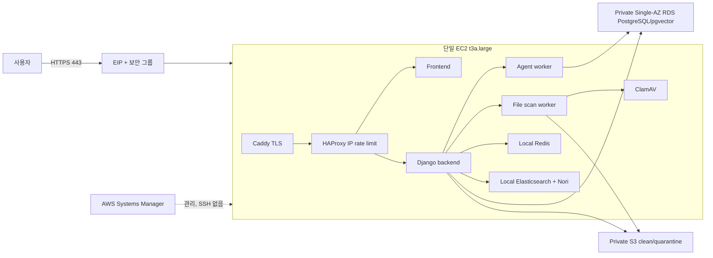

# SKN27 저비용 AWS 파일럿 배포 런북

이 경로는 적은 트래픽으로 실제 사용자 흐름을 검증하기 위한 파일럿이다. 기존
`infra/terraform`의 고가용성 구성을 수정하거나 대체하지 않는다. 파일럿에서 수치와
장애 패턴을 확인한 뒤에만 고가용성 구조로 승격한다.

## 1. 범위와 의도

파일럿은 다음 자원만 만든다.

- 퍼블릭 서브넷의 x86 EC2 1대(기본 `t3a.large`, 8 GiB)와 EIP 1개
- 서로 다른 두 AZ의 사설 DB 서브넷과 Single-AZ RDS PostgreSQL 16 1대
- 공개 차단·기본 암호화·수명주기를 적용한 clean/quarantine S3 버킷
- backend와 frontend ECR 저장소, 월 비용 AWS Budget
- 값이 아니라 **이름만** Terraform에서 관리하는 SSM 런타임 환경 파라미터

EC2 한 대에서 Caddy, HAProxy 요청률 제한기, 정적 frontend, Django backend,
agent worker, file scan worker, Redis, Nori Elasticsearch, ClamAV를 Docker Compose로
실행한다. RDS는 퍼블릭 IP가 없으며 EC2 보안 그룹에서 들어오는 5432만 허용한다.
SSH 22 포트는 열지 않고 모든 관리 명령은 SSM으로 실행한다.

다음 유료 관리형 구성은 파일럿에서 만들지 않는다: NAT Gateway, ALB,
ECS/Fargate, ElastiCache, OpenSearch, CloudFront, Kibana, Neo4j. 영상 분석 **DL**
에이전트도 배포하지 않는다. 현재 DL 기능은 사용자에게 노출하지 않아야 하며, 이
파일럿의 합격 범위는 Supervisor, 법률 검색, 텍스트 유사사례 검색, 리포팅과 Google
로그인까지다.

이 구조는 단일 장애점이 있는 파일럿이다. EC2 또는 AZ 장애를 견뎌야 하는 서비스의
최종 운영 구조로 간주하면 안 된다.



## 2. 요청 경로와 보안 경계

1. 인터넷 요청은 보안 그룹의 80/443으로만 Caddy에 들어온다.
2. Caddy가 TLS를 종료하고 `Origin`, `X-Requested-With`, `X-Forwarded-For`,
   `X-Forwarded-Proto`를 HAProxy에 전달한다. 외부에서 보낸 X-Forwarded-For는
   그대로 신뢰하지 않고 Caddy가 실제 TCP peer IP로 덮어쓴다.
3. HAProxy stick-table이 IP별 API 요청률을 10초당 60회로 제한하고, Google code
   교환은 별도 table에서 1분당 10회로 더 엄격하게 제한한다. 초과 요청은 429로
   돌려준다. 이 값은 `haproxy.cfg`에서 변경할 수 있다.
4. 회귀 테스트용 명시적 `/api/mock/` 경로는 운영 edge에서 404로 차단한다. DL을
   제외한 운영 Agent 호출은 canonical `/api/`와 실제 worker 경로만 사용한다.
5. Google code 교환에는 애플리케이션의 DB/cache 일일 quota가 한 번 더 적용된다.
   `GOOGLE_OAUTH_TRUSTED_PROXY_CIDRS=172.31.0.3/32`는 고정 Compose 네트워크의
   HAProxy peer 한 개만 신뢰한다. 이를 전체 Docker subnet이나 `0.0.0.0/0`으로
   넓히지 않는다.
6. HAProxy의 요청률 상태는 해당 컨테이너 메모리에 있으므로 재시작하면 초기화된다.
   여러 호스트로 확장하는 시점에는 ALB/WAF 또는 공유 rate-limit 계층을 다시 설계한다.

## 3. 사전 조건

- 결제와 MFA가 설정된 AWS 계정, `ap-northeast-2`에서 자원을 만들 권한
- Terraform 1.11 이상, AWS CLI v2, Docker, PowerShell 7.2 이상
- ECR push, EC2/SSM, RDS, Secrets Manager, S3, IAM, VPC, Budgets 권한
- 파일럿 도메인과 DNS 레코드를 수정할 권한
- Google Cloud OAuth Web client와 해당 client secret
- OpenAI API key와 사용량 상한. Supervisor smoke 1회도 유료 요청이다.
- 팀에서 합의한 월 Budget 금액과 경보 수신 이메일
- Terraform state를 둘 암호화·버전 관리·접근 제한 S3 backend. 혼자 잠깐
  검증하는 경우 외에는 로컬 state를 공유하지 않는다.

Google Console의 Authorized JavaScript origin과 redirect 관련 값은
`https://<APP_DOMAIN>`으로 일치시킨다. Caddy의 최초 인증서 발급 전에 EIP를 가리키는
DNS A 레코드가 전파되어야 하고, 80/443이 열려 있어야 한다.

## 4. 비용 가드레일

Terraform의 `budget_limit_usd`를 팀의 실제 월 상한으로 설정한다. Budget은 실제
비용이 상한의 **50%**, **80%**, **100%**를 넘을 때 이메일을 보낸다. Budget 알림은
자동 차단 장치가 아니므로 80% 알림을 받은 담당자가 즉시 Cost Explorer와 실행 자원을
검토해야 한다.

- NAT/ALB/ECS/관리형 Redis/관리형 OpenSearch를 만들지 않는다.
- RDS는 Single-AZ `db.t4g.micro`, gp3 20 GiB에서 시작하고 autoscaling 상한을
  50 GiB로 둔다. 부하 측정 없이 크기를 올리지 않는다.
- EC2는 ClamAV signature reload headroom 때문에 최소 `t3a.large`, 암호화 gp3 40 GiB로
  시작한다. `t3a.medium`은 acceptance에서 지원하지 않는다. 4 GiB swap은 순간 OOM을
  줄이는 안전판이지 지속적인 메모리 부족 해결책이 아니다.
- ClamAV에는 2 GiB limit를 주고 concurrent database reload를 끈다. 이 메모리 한도에서도
  `multilingual-e5-large` query embedding은 상주시키지 않으므로
  `LEGAL_RAG_VECTOR_ENABLED=0`이 기본이다. 실제 PostgreSQL lexical 법률 검색과
  pgvector seed 보존은 유지한다. 호환되는 외부 embedding 또는 더 큰 인스턴스를
  검증한 뒤에만 vector query를 켠다.
- S3 clean 객체는 기본 90일, quarantine 객체는 7일 뒤 만료한다. 실제 보존 의무가
  있으면 배포 전 정책과 법적 요구를 먼저 조정한다.
- ECR은 backend/Nori 합계 최근 10개, frontend 최근 5개 이미지만 유지한다.
- EIP는 EC2를 중지해도 과금될 수 있다. 장기 미사용이면 단순 중지가 아니라 이
  런북의 철거 절차를 수행한다.
- RDS 관리형 master credential 때문에 작은 Secrets Manager 비용이 추가된다. 대신
  DB 비밀번호를 Terraform 입력·출력·state에 넣지 않는다.
- OpenAI와 Google 외부 API 비용/quota는 AWS Budget에 포함되지 않는다. 각 공급자
  콘솔에서 별도 상한과 알림을 설정한다.
- `t3a.large` 24/7 비용은 기존 4 GiB 가정보다 높다. 파일럿은 짧은 **acceptance window**
  안에서 검증하고 즉시 EC2 stop 또는 전체 stop/destroy를 승인한다. EIP/RDS가 계속
  과금되므로 장기 중지는 완전한 비용 차단이 아니며 장기 미사용은 destroy가 원칙이다.
  비용을 줄이려고 검증된 8 GiB보다 인스턴스 타입을 하향하지 않는다. 허용 타입은 x86
  `t3a.large`, `t3.large`, `t3a.xlarge`, `t3.xlarge`이며 ARM과 nano/small/medium은 거절한다.

가격은 시점과 리전에 따라 변한다. 적용 직전 AWS Pricing Calculator와 실제 서비스
가격을 다시 확인하고, plan에 예상 밖의 NAT/ALB/ECS/OpenSearch 자원이 없는지 본다.

## 5. Terraform 준비와 검토

S3 native `use_lockfile`을 사용하므로 Terraform 1.11 이상이 필수다. 운영/CI에서는
검증된 1.15.8처럼 더 최신의 고정 버전을 사용한다.

```powershell
pwsh ../../deploy/aws-pilot/Initialize-StateBackend.ps1 `
  -StateBucket 'skn27-pilot-ACCOUNT_ID-tfstate' `
  -Region 'ap-northeast-2'
Set-Location infra/terraform-pilot
Copy-Item terraform.tfvars.example terraform.tfvars
Copy-Item backend.hcl.example backend.hcl
# backend.hcl의 bucket을 위에서 만든 전용 버킷으로 바꾼다.
# terraform.tfvars에서 budget_alert_email과 budget_limit_usd를 수정한다.
terraform init -backend-config=backend.hcl
terraform fmt -check
terraform validate
terraform plan -out pilot.tfplan
terraform show pilot.tfplan
```

plan에서 다음을 직접 확인한다.

- `aws_instance`는 1개이고 AMI architecture는 x86_64인가?
- EC2 ingress는 80/443뿐이며 SSH 22가 없는가?
- DB subnet 두 개는 서로 다른 AZ이고 RDS가 `publicly_accessible=false`,
  `multi_az=false`, 암호화, backup 7일, deletion protection인가?
- S3 두 버킷 모두 public access block, 암호화, lifecycle이 있는가?
- secret/password/token 값이 output에 없는가?
- Budget 이메일과 금액이 맞는가?

검토 승인 후 운영자가 별도 단계에서 `terraform apply pilot.tfplan`을 실행한다. 이
저장소 작업 자체는 apply를 자동 실행하지 않는다.

state 버킷은 이 파일럿 stack이 만들지 않는다. 같은 stack으로 state 버킷을 만들면
destroy/복구 시 순환 의존이 생기기 때문이다. bootstrap 스크립트는 S3 versioning,
AES256 encryption, public access block을 켜고, Terraform backend는 `use_lockfile=true`로
동시 실행을 막는다. state 버킷은 파일럿 철거 후에도 별도 보존·승인 절차로 삭제한다.

## 6. DNS와 Google 설정

적용 후 `terraform output public_ip`의 EIP로 `APP_DOMAIN` A 레코드를 만든다. DNS
전파를 확인한 다음 Google OAuth Web client에 다음을 등록한다.

- Authorized JavaScript origin: `https://<APP_DOMAIN>`
- 앱이 사용하는 popup redirect URI: `https://<APP_DOMAIN>`

HTTP, 다른 서브도메인, 포트가 섞이면 code 교환이 실패한다. frontend build의
`VITE_GOOGLE_CLIENT_ID`와 backend의 `GOOGLE_CLIENT_ID`는 같은 Web client여야 한다.

## 7. SSM 런타임 환경 준비

`runtime.env.example`을 저장소 밖의 접근 제한된 경로로 복사한다. `REPLACE_` 값은
각각 다른 충분히 긴 난수로 교체한다. 파일을 커밋하거나 채팅·이슈·CI 로그에 붙이지
않는다. `POSTGRES_*`, 버킷, ECR URL, region과 release 값은 배포 스크립트가 Terraform
출력과 별도 least-privilege app database secret에서 주입한다. RDS 관리형 master는
bootstrap/migration 정비 때만 임시 maintenance instance profile로 읽고, runtime role과
`.runtime.env`에는 절대 저장하지 않는다. 따라서 RDS managed master rotation이 일반 앱
재시작을 깨뜨리지 않는다. DB 정비용 psql client도 mutable tag를 쓰지 않는다.
`POSTGRES_MAINTENANCE_IMAGE_REF`에는 현재 지원 patch인
`postgres:16.14-alpine3.24@sha256:<검토한 64자리 소문자 digest>`를 넣어야 한다.

배포 스크립트는 완성된 env를 4 KiB 이하인지 검사한 뒤 SSM **Standard
SecureString**에 기록한다. Terraform은 파라미터 이름과 EC2의 `ssm:GetParameter`
권한만 관리하고 값은 state나 output에 넣지 않는다. EC2에서는 `--with-decryption`으로
가져와 권한 0600인 `.runtime.env`를 만든다. Docker Compose의 `format: raw`로
backend/worker에 전달하므로 비밀번호 안의 `$` 같은 문자를 재해석하지 않는다.
Caddy에는 domain/email만 담은 `.edge.env`, Elasticsearch에는 해당 비밀번호만 담은
`.elasticsearch.env`를 전달해 컨테이너별 secret 노출 범위를 줄인다. 이미지 주소와
release tag만 `.compose.env`에 분리한다.

## 8. 배포 순서

Terraform apply 뒤에는 DB 정비, 일반 배포, RAG one-shot 정비를 서로 다른 단계로
실행한다. 첫 배포나 migration이 있는 release는 먼저 maintenance workflow를 실행한다.
이 작업은 공통 host lock을 잡은 상태에서 runtime STS role을 확인하고 앱 컨테이너를 모두
정지한 다음 root-owned mode 0600
`/opt/skn27-pilot/maintenance/database-maintenance.active` marker를 만든다. 그 뒤에만 EC2
profile을 maintenance role로 바꾸며, maintenance STS role을 다시 확인한 후 RDS master로
migration과 app role grant를 수행한다. 원격 command가 terminal status에 도달한 것이
확인돼야 runtime profile을 복원하고 runtime STS role을 확인한 뒤 marker를 지운다. 컨테이너는
자동 재시작하지 않으며 다음 `Deploy-Pilot.ps1`만 시작한다. secret 원문과 SSM stdout/stderr는
출력하지 않고 임시 master/env 파일은 `shred -u` 후 제거한다.

timeout 뒤 cancel이 terminal status에 도달하지 않으면 maintenance profile과 marker를 그대로
유지해 fail-closed한다. 이 상태에서 marker만 수동 삭제하면 안 된다. 먼저 SSM command가 더 이상
실행 중이 아님을 확인하고 runtime instance profile로 복원한 뒤 EC2에서
`aws sts get-caller-identity`가 runtime role인지 확인한다. 마지막으로 공통 lock 아래에서 marker를
제거하고 정상 Deploy를 실행한다. Deploy/RAG/Rollback은 marker가 있으면 거절하고, Remove의 원격
stop은 경고 후 건너뛰되 비용 회수를 위한 Terraform destroy는 계속한다.

```powershell
$releaseTag = '20260714-01'
$cleanBucket = terraform -chdir=infra/terraform-pilot output -raw clean_bucket_name
$manifestSha256 = (Get-FileHash -Algorithm SHA256 -LiteralPath 'C:\approved\rag-seed-manifest.json').Hash.ToLowerInvariant()
$fineNoticeSmokeS3Uri = "s3://$cleanBucket/canonical/acceptance/sanitized-fine-notice.png"

pwsh ./deploy/aws-pilot/Maintain-PilotDatabase.ps1 `
  -RuntimeEnvFile 'C:\secure\skn27-pilot.runtime.env' `
  -ReleaseTag $releaseTag

# current가 없는 최초 배포 전용: public edge/worker 없이 내부 4개 service만 stage한다.
pwsh ./deploy/aws-pilot/Deploy-Pilot.ps1 `
  -RuntimeEnvFile 'C:\secure\skn27-pilot.runtime.env' `
  -ReleaseTag $releaseTag `
  -ExpectedRagSeedManifestSha256 $manifestSha256 `
  -StageForInitialRagBootstrap

pwsh ./deploy/aws-pilot/Load-Rag-Seed-Pilot.ps1 `
  -ReleaseTag $releaseTag `
  -RagSeedS3Uri "s3://$cleanBucket/_rag-seed/$releaseTag/" `
  -RagSeedManifestRelativePath 'rag-seed-manifest.json' `
  -RagSeedManifestSha256 $manifestSha256

# 이 시점에만 짧은 Google code를 발급해 지정 SecureString에 넣는다.
# 이미 build/push한 같은 tag를 final 검증하고 public current로 승격한다.
pwsh ./deploy/aws-pilot/Deploy-Pilot.ps1 `
  -RuntimeEnvFile 'C:\secure\skn27-pilot.runtime.env' `
  -ReleaseTag $releaseTag `
  -ExpectedRagSeedManifestSha256 $manifestSha256 `
  -FineNoticeSmokeS3Uri $fineNoticeSmokeS3Uri `
  -SkipBuild `
  -RequireGoogleLiveSmoke `
  -AllowPaidNonDlSmoke `
  -AllowPaidSupervisorSmoke
```

최초 배포가 순서대로 수행하는 작업은 다음과 같다.

1. 모든 통합 dependency와 exact public origin을 로컬에서 먼저 검사하고 Terraform output과
   app database secret으로 SSM env를 완성한다.
2. stage 호출이 backend, Google client id가 주입된 production frontend, Nori Elasticsearch
   이미지를 빌드하고 ECR에 push한다.
3. secret이 없는 Compose/Caddy/HAProxy bundle과 manifest를 clean S3 `_deploy/`에 올리고
   각각 SHA-256과 S3 VersionId를 고정한다.
4. stage는 `current`와 dangling symlink가 모두 없는지 먼저 확인한다. 같은 release의
   Redis/Elasticsearch/ClamAV/backend만 `--wait`로 시작하고 edge/frontend/workers는 시작하지
   않으며 symlink도 만들지 않는다. 실패하면 partial project와 stage marker를 제거한다.
5. loader는 명시한 release tag와 expected seed digest가 stage marker와 정확히 같은지 확인한
   뒤 seed를 적재하고 그 release에 mode 0444 completion marker를 남긴다.
6. 같은 tag의 final `-SkipBuild` 호출만 completion marker digest를 확인하고 모든 container,
   production readiness, sanitized fine-notice fixture를 쓰는 실제 non-DL 4-node
   job→persisted handoff→report, S3/Supervisor/Google/HTTP
   smoke를 수행한다. 최초 `current` 승격은 `-RequireGoogleLiveSmoke` 없이는 원격에서 거절한다.
7. 모두 통과한 release만 `/opt/skn27-pilot/current`로 표시한다. 실패하면 trap이 이전
   current의 Compose를 다시 올리고 symlink도 자동 복원한다.

`Rollback-Pilot.ps1`도 target Compose 시작 또는 readiness 실패 시 partial target을 먼저
내리고 이전 release Compose와 `current` symlink를 ERR trap으로 복원한다. SSM 대기는 기본
1800초이며 ClamAV 최초 180초 start period를 포함한다. timeout이면 cancel 후 terminal status를
확인하며 stdout/stderr 원문은 오류에 포함하지 않는다.

일반 배포에는 RAG 적재 옵션이 없다. 이 분리는 배포 재시도마다 destructive replacement가
반복되는 것을 막는다. `-SsmTimeoutSeconds`는 원격 작업 제한시간이며 timeout이면 command를
cancel한 뒤 `Cancelled`/`TimedOut` 같은 terminal status를 확인한다. ClamAV 최초 start를
자를 수 없도록 Deploy/DB/RAG/Rollback 모두 최소 600초보다 작게 설정할 수 없다.

배포 스크립트는 `smoke_non_dl_analysis_reporting_pipeline` 명령을 먼저 preflight하고,
배포 후 `--allow-paid-provider-call --require-real-agent-results
--require-persisted-handoff --require-report --fine-notice-fixture-s3-uri ...
--timeout-seconds 180`으로 실행한다. fixture URI는 Terraform이 만든 clean bucket의
`canonical/acceptance/` 아래에 있는 sanitized png/jpg/jpeg/webp/pdf 객체만 허용한다.
query, fragment, parent traversal, 다른 bucket/prefix는 SSM env 기록이나 유료 작업 전에
거절한다. private stage는 fixture와 유료 동의를 요구하거나 이 command를 실행하지 않는다.
예상치 못한 비용을 막기 위해
호출자는 매 배포에서 `-AllowPaidNonDlSmoke`를 명시해야 하며, 없으면 이미지 build나
클라우드 변경 전에 중단한다. 이 플래그는 최종 승인용 비-DL provider smoke 1회를
의도적으로 허용한다는 뜻이다. 별도로 실행되는 실제 Supervisor LLM smoke도
`-AllowPaidSupervisorSmoke`를 명시해야 하며, 두 플래그는 서로의 비용 동의를 대신하지
않는다. 여기서 "1회"는 smoke job 실행 횟수이며 내부 모델 API 요청 한 건을 뜻하지
않으므로, OpenAI 프로젝트 사용량 상한도 별도로 낮게 설정한다.
이 명령은 #173의 non-DL mock/heuristic 제거와 #193의 persisted handoff/reporting 변경을
통합한 브랜치에서 제공해야 한다. 두 변경과 운영 smoke 명령이 아직 없는 현재 AWS 단독
브랜치는 의도적으로 배포가 성공할 수 없는 **fail-closed** 상태다.

이 gate는 비용이 생기는 Terraform 조회/변경이나 Docker build보다 먼저 실행된다. #192의
`smoke_google_oauth_code.py`, #193의 non-DL end-to-end smoke, #198의 production RAG
load/manifest verify command가 모두 있어야 하고, #195 완료 증거로 TextML agent에서
`case_text_ml_heuristic_001` marker가 사라져야 한다. 어느 하나라도 빠진 AWS 단독 브랜치는
public production 배포를 시작하지 않는다.

Google 실제 authorization-code 교환은 #192 통합 gate다. 기본 배포는 설정만 검증한다.
짧은 수명의 code를 Terraform output의 SecureString 이름에 별도 기록하고 #192의
`smoke_google_oauth_code --require-exchange --verify-replay-rejection` 계약이 통합된 뒤에만
`-RequireGoogleLiveSmoke`를 사용한다. 이 switch는 `-SkipBuild`와만 허용되므로 image build와
private stage/RAG 적재를 먼저 끝내고 code는 final 호출 직전에 발급한다. 배포 스크립트는 code를 command line/로그에 넣지 않고
원격 shell의 `GOOGLE_OAUTH_SMOKE_CODE` 환경변수로만 Compose exec에 전달한 뒤 즉시 unset하며,
parameter 이름을 얻은 뒤 어느 단계에서 성공/실패하더라도 outer `finally`가 SecureString을 삭제한다.

이미지를 이미 push한 동일 태그로 remote 배포만 재시도할 때는 `-SkipBuild`를 쓸 수
있다. ECR 태그는 immutable이므로 같은 태그로 다른 이미지를 덮어쓰지 않는다.

## 9. 데이터와 RAG 적재 순서

Django migration과 pgvector extension을 먼저 완료한다. `Load-Rag-Seed-Pilot.ps1`가 별도
RAG seed S3 prefix를 임시 디렉터리로 복사하고 bundle의 manifest/hash/schema를 검증한 다음,
PostgreSQL 법률 chunk/embedding과 로컬 Elasticsearch의 다음 두 인덱스를 적재한다.

- `review_case_chunks_bm25_nori_v1`
- `precedent_fault_ratio_chunks_bm25_nori_v1`

```powershell
$cleanBucket = terraform -chdir=infra/terraform-pilot output -raw clean_bucket_name
$manifestSha256 = (Get-FileHash -Algorithm SHA256 -LiteralPath 'C:\approved\rag-seed-manifest.json').Hash.ToLowerInvariant()
pwsh ./deploy/aws-pilot/Load-Rag-Seed-Pilot.ps1 `
  -ReleaseTag '20260714-01' `
  -RagSeedS3Uri "s3://$cleanBucket/_rag-seed/20260714-01/" `
  -RagSeedManifestRelativePath 'rag-seed-manifest.json' `
  -RagSeedManifestSha256 $manifestSha256
```

loader는 `current`가 없는 최초 bootstrap 상태와 명시한 release의 stage marker/tag/digest를
검증한다. host `flock`으로 동시 적재를 차단하고 global 성공 digest 및 release별 completion
marker로 재실행을 resume-safe하게
만든다. seed directory는 root-owned 0555, 파일은 0444이며 backend에는 `:ro` mount로만
보인다. loader는
`--replace-legal --recreate-es`로 현재 manifest와 대상 저장소를 맞춘 뒤 law-ground
`--require-results`, TextML `--require-es --require-results`를 실행한다. Neo4j는 항상
꺼진 상태이며 `t3a.large`에서도 이 저비용 구성은 로컬 e5 vector query를 켜지 않는다.

## 10. 검증 기준

성공 판정에는 최소한 아래가 모두 필요하다.

- `GET /api/health/live/`와 `GET /api/health/ready/`가 200
- `check_production_readiness --fail-on-error`가 fail 없이 종료
- `smoke_object_storage --require-binary`가 실제 S3 쓰기/복사/삭제 통과
- `smoke_supervisor_llm --require-used --require-slot-state`가 실제 provider 사용
- Google popup에서 받은 code 1회 교환, 재사용 code 거절, 앱 JWT로 보호 API 호출
- agent worker와 file scan worker가 재시작 없이 작업을 처리
- ClamAV clean/EICAR 격리 테스트(실제 파일럿 데이터 투입 전)
- RAG 적재 후 law-ground와 TextML smoke가 실제 결과/ES 사용을 보고
- sanitized fine-notice S3 fixture로 fine_notice_analysis, appeal decision, law-ground,
  TextML case search 네 non-DL node가 모두 실제 결과를 남김
- 리포팅 전에 분석 결과와 handoff가 DB에 지속되고, 재시도 시 중복 유료 호출이 없음

SSM으로 추가 상태를 볼 때 secret을 출력하지 않는다.

```powershell
aws ssm send-command --document-name AWS-RunShellScript `
  --instance-ids (terraform -chdir=infra/terraform-pilot output -raw instance_id) `
  --parameters 'commands=["cd /opt/skn27-pilot/current && docker compose --project-name skn27-pilot --env-file .compose.env --env-file .production-compose.env -f docker-compose.pilot.yml ps"]'
```

## 11. 운영 관찰과 증설 기준

CloudWatch의 `instance_status` alarm과 기본 EC2/RDS 지표, AWS Billing을 매일 확인한다.
t3 CPU credit 고갈,
swap 지속 사용, Elasticsearch/ClamAV OOM, gp3 여유 20% 미만, RDS connection 포화,
worker backlog 증가를 기록한다. 메모리 부족이 일시적이지 않으면 먼저 불필요한 기능과
worker 동시성을 줄이고, 그래도 재현되면 측정 근거와 별도 비용 승인 후 `t3a.xlarge` 또는
ClamAV/Elasticsearch 분리를 검토한다.

다음 중 하나가 필요하면 파일럿을 종료하고 고가용성 설계로 전환한다: 무중단 배포,
다중 AZ 장애 허용, 수평 확장, 강한 DDoS/WAF, 다중 EC2 공유 rate-limit,
24시간 SLO, 대규모 영상 DL 처리.

## 12. 롤백

이전 release 디렉터리는 EC2에 남아 있다. 애플리케이션 문제가 있고 DB schema가 이전
코드와 호환될 때만 다음을 실행한다.

```powershell
pwsh ./deploy/aws-pilot/Rollback-Pilot.ps1 -ReleaseTag '20260713-02'
```

롤백은 컨테이너 이미지만 되돌리고 Django migration을 역실행하지 않는다. 비호환
migration이면 RDS snapshot 복구와 새 DB endpoint 전환 계획이 필요하다. 배포 전에
파괴적 migration이 있는지 반드시 리뷰하고 필요하면 수동 snapshot을 만든다.

## 13. 철거

철거는 clean/quarantine의 모든 객체와 버전, ECR 이미지, SSM env를 삭제하는 파괴적
작업이다. 필요한 보고서와 감사 자료를 별도 승인된 저장소로 내보내고 최종 snapshot
정책을 결정한다. 그 뒤 정확한 확인 문자열로 실행한다.

```powershell
pwsh ./deploy/aws-pilot/Remove-Pilot.ps1 `
  -Confirmation 'DESTROY skn27-pilot'
```

완전히 폐기 가능한 테스트 DB에서만 `-SkipFinalSnapshot`을 추가한다. 스크립트는
컨테이너를 멈추고 버킷/ECR/SSM을 비운 뒤 RDS deletion protection을 해제하고
Terraform destroy를 수행한다. 종료 후 RDS 최종 snapshot, EIP, S3, ECR, SSM,
Budget이 남지 않았는지 콘솔에서 확인하고 다음 청구서도 확인한다.

최종 snapshot 이름에는 Terraform이 유지하는 random suffix가 붙어 재생성 시 기존 이름과
충돌하지 않는다. `-SkipFinalSnapshot`은 disposable pilot이라는 명시적 승인일 뿐 기본값이
아니다. 첫 배포 실패로 current symlink가 없거나 SSM stop이 실패해도 스크립트는 경고 후
버킷/ECR 정리를 best-effort로 시도하고 마지막 `terraform destroy`까지 진행한다.

## 14. 알려진 제한

- 단일 EC2와 Single-AZ RDS라 가용성 보장이 없다.
- Caddy 기본 배포에는 native rate-limit이 없어 HAProxy를 명시적으로 둔다. AWS WAF는
  ALB/CloudFront가 없는 이 경로에 붙이지 않는다.
- DL 영상 에이전트는 제외되어 있다. DL 요청을 이 파일럿의 성공으로 오인하지 않는다.
- 대형 로컬 query embedding도 기본 비활성화다. vector 검색을 켤 때는 seed와 query
  embedding 모델이 동일한지, 메모리와 비용이 감당되는지 다시 검증한다.
- 로컬 Redis/Elasticsearch/ClamAV 데이터는 EC2 수명과 연결된다. 검색 인덱스는 seed로
  재구축 가능해야 하며 Redis는 정본 저장소가 아니다.
- S3 lifecycle 90일은 파일럿 비용 기준이다. 실제 법적 보존 기간을 대신하지 않는다.
- Budget, SSM, readiness는 안전장치이지만 사람의 plan 리뷰와 비용 대응을 대체하지 않는다.

## 15. 8 GiB 호스트·이미지·권한 운영 메모

Compose의 모든 service에는 합계 6 GiB 이하 memory limit과 json-file 10 MiB × 3개 log
rotation이 있다. 배포 전 `MemTotal`, `MemAvailable`, `docker system df`를 확인하며 성공 후
최근 3개 release 디렉터리의 tag를 `PROTECTED_RELEASE_TAGS`로 먼저 확정한다. 보호 집합이
비어 있으면 cleanup은 fail-closed한다. current와 직전 rollback tag/Nori tag는 보존하고,
그 밖의 이 프로젝트 이미지 tag만 명시적인 `docker image rm`으로 정리한다. 정기적으로
volume 사용량도 점검하고 RAG/ES는 seed로 재구축 가능하게 유지한다.

외부 Caddy 2.11.4, HAProxy 3.4.2 LTS, Redis, ClamAV, frontend Nginx 1.30.3,
Nori build의 Elasticsearch 8.19.17과 DB 정비용 PostgreSQL 16.14 alpine3.24는
`.runtime.env`의 `*_IMAGE_REF`에 반드시 `name@sha256:digest`를 넣는다. tag-only 값은
배포/정비 시작 전에 거절한다. 값은 release deployment manifest에도 provenance로 기록한다.
각 architecture digest를 검토해 다음처럼 기록한다.

```powershell
docker buildx imagetools inspect caddy:2.11.4-alpine
docker buildx imagetools inspect haproxy:3.4.2-alpine
docker buildx imagetools inspect nginx:1.30.3-alpine
docker buildx imagetools inspect docker.elastic.co/elasticsearch/elasticsearch:8.19.17
docker buildx imagetools inspect postgres:16.14-alpine3.24
# 승인된 결과를 예: caddy@sha256:<64-lowercase-hex> 형태로 runtime env에 기록
```

IMDS hop-limit 2는 Docker bridge 안의 backend/worker가 runtime EC2 role로 S3 clean 및
quarantine object를 처리해야 해서 유지한다. host의 persistent DOCKER-USER 정책은 고정 IP
`.5` backend, `.6` agent worker, `.7` file-scan worker만 metadata endpoint에 허용하고 나머지
Docker subnet을 거절한다. 배포마다 규칙을 재적용하고 allow/deny smoke를 모두 통과해야 한다.
비앱 컨테이너는 `cap_drop: ALL`과 `no-new-privileges`를 적용한다. 대신 IAM은 `canonical/*`의 runtime CRUD,
`_deploy/*`와 `_rag-seed/*`의 읽기를 분리하고 deploy/seed prefix의 Put/Delete를 explicit
Deny한다. runtime role은 RDS master secret을 읽을 수 없으며, maintenance profile은 앱을
내린 동안에만 연결한다.

허용된 세 app 컨테이너가 침해되면 runtime role 위험은 남는다. 더 강한 credential proxy 또는
ECS task role 분리는 후속 운영 설계다. Deploy/RAG/DB maintenance/Rollback/Remove의 원격 변경은
모두 `/var/lock/skn27-pilot-maintenance.lock`을 bounded wait로 공유한다. teardown은 30초 안에
lock을 못 얻으면 stop 실패를 경고하고 비용 회수를 위한 destroy를 best-effort로 계속한다.

## 16. 후속 릴리스의 격리 stage와 승격

최초 배포 이후에는 새 태그마다 다음 세 단계를 순서대로 수행한다. 릴리스 태그는 충돌 없는
소문자 영숫자/하이픈 형식이어야 하며, 이미 존재하는 릴리스 디렉터리와 현재 릴리스 태그는
재사용하거나 덮어쓸 수 없다.

```powershell
$releaseTag = '20260715-02'

# 1. current를 그대로 둔 채 새 이미지와 격리된 Redis/Elasticsearch만 stage한다.
pwsh ./deploy/aws-pilot/Deploy-Pilot.ps1 `
  -RuntimeEnvFile 'C:\secure\skn27-pilot.runtime.env' `
  -ReleaseTag $releaseTag `
  -ExpectedRagSeedManifestSha256 $manifestSha256 `
  -StageForReleaseUpdate

# 2. 정확히 같은 tag/digest의 격리 project에 seed를 적재하고 검증한다.
pwsh ./deploy/aws-pilot/Load-Rag-Seed-Pilot.ps1 `
  -ReleaseTag $releaseTag `
  -RagSeedS3Uri "s3://$cleanBucket/_rag-seed/$releaseTag/" `
  -RagSeedManifestRelativePath 'rag-seed-manifest.json' `
  -RagSeedManifestSha256 $manifestSha256

# 3. 같은 릴리스를 검증한 뒤 production project와 current를 승격한다.
pwsh ./deploy/aws-pilot/Deploy-Pilot.ps1 `
  -RuntimeEnvFile 'C:\secure\skn27-pilot.runtime.env' `
  -ReleaseTag $releaseTag `
  -ExpectedRagSeedManifestSha256 $manifestSha256 `
  -FineNoticeSmokeS3Uri $fineNoticeSmokeS3Uri `
  -SkipBuild `
  -AllowPaidNonDlSmoke `
  -AllowPaidSupervisorSmoke
```

update stage는 `skn27-stage-<ReleaseTag>`라는 bounded Compose project와 `172.30.0.0/24`
네트워크를 사용한다. 모든 고정 service IP도 이 subnet으로 함께 바뀐다. Redis,
Elasticsearch, ClamAV Docker volume 이름은 릴리스별로 고정되며 stage와 final/rollback이 같은
이름을 사용한다. stage와 loader는 production `skn27-pilot` project를 `up` 또는 `down`하지
않고 current symlink도 바꾸지 않는다. 실패 cleanup은 새 stage project, 새 릴리스 marker와
새 릴리스 Docker volume만 제거한다.

법률 pgvector 데이터는 비용을 줄이기 위해 별도 RDS를 만들지 않고 shared RDS에 적재한다.
따라서 이 부분은 host maintenance lock으로 직렬화되는 운영 maintenance다. AWS gate는 #198
production loader가 승인 manifest를 쓰기 직전에 다시 검증하고, 위임하는 legal loader 전체가
단일 `transaction.atomic` DB transaction으로 실행되어 실패 시 PostgreSQL 변경을 rollback하는
계약을 staged image 안에서 fail-closed로 확인한다. 이 보장은 PostgreSQL transaction에만
적용되며 PostgreSQL과 Elasticsearch 사이의 cross-system atomic transaction을 뜻하지 않는다.
final 승격은 정확한 release/digest completion marker를 확인한 뒤에만 stage project를 내리고
production project를 전환한다. readiness와 유료/실제 provider smoke가 모두 성공한 후에만
`current`를 원자적으로 교체하며, 실패하면 이전 release의 Compose와 릴리스별 volume을 다시
올린다.
