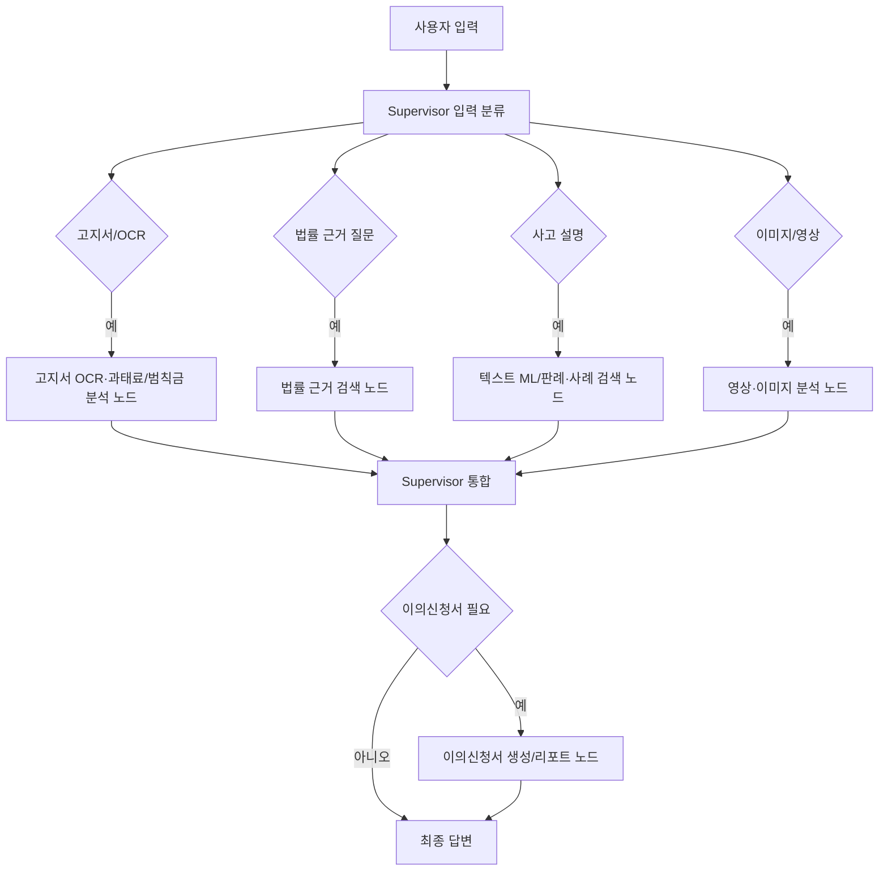

# 2026-06-19 이슈 코멘트 업데이트 및 구현 착수 회의 정리

| 항목 | 내용 |
|---|---|
| 작성일 | 2026-06-19 |
| 목적 | 오늘 회의에서 이슈별 업데이트 코멘트를 기준으로 결정할 항목을 정리하고, 다음 주 실제 구현 착수 기준을 맞춘다. |
| 기준 자료 | GitHub Issue 코멘트, `docs/wbs-owner-deliverable-plan.md`, `docs/260618_주간회의.md`, `docs/260618_이슈_완성도.md` |
| 작업 원칙 | 구현/문서 커밋은 회의 결정 후 진행한다. 오늘은 이슈 코멘트와 결정 항목 정리가 우선이다. |

## 1. 현재 확인 상태

GitHub Issue `#12`, `#13`, `#22`, `#23`, `#26`, `#28`, `#29`, `#30`, `#36`, `#40`에 금요일 전 체크리스트 코멘트가 업로드되어 있다.

| Issue | 제목 | 상태 | 코멘트 상태 | 회의에서 볼 핵심 |
|---|---|---|---|---|
| `#12` | `docs-mvp-screen-and-process-flows` | open | 업로드 완료 | 홈/챗봇/화면설계서 HTML, 벤치마킹 근거 |
| `#22` | `feat-agent-result-schema-and-rag-contract` | open | 업로드 완료 | Agent 공통 결과 schema, RAG evidence 계약 |
| `#23` | `feat-fine-notice-ocr-intake-flow` | open | 업로드 완료 | 고지서 OCR input/output schema |
| `#26` | `feat-fine-law-ground-search` | open | 업로드 완료 | 법률 근거 검색 노드 호출 필요성 및 호출 시점 |
| `#28` | `test-fine-mvp-sample-case-validation` | open | 업로드 완료 | 고지서 샘플 5~6개, 최소 2개 모델 비교 |
| `#29` | `feat-supervisor-chatbot-routing` | open | 업로드 완료 | LangGraph/Supervisor 분기 기준과 호출 순서 |
| `#30` | `feat-fault-ratio-ml-knowledge-base` | open | 업로드 완료 | 과실비율 ML/RAG 후보 모델, 입력/출력 |
| `#36` | `spike-vision-model-use-case-decision` | open | 업로드 완료 | 영상·이미지 분석 후보 모델, 이미지/영상 입출력 |
| `#13` | `docs-requirement-gap-and-risk-log` | open | 업로드 완료 | 미확정 항목을 `검증 필요`로 추적 |
| `#40` | `test-cross-mvp-integration-scenarios` | open | 업로드 완료 | Cross-MVP 통합 시나리오와 검증 기준 |

## 2. 오늘 회의 목표

오늘 회의의 목표는 구현을 바로 시작하는 것이 아니라, 다음 주 구현자가 추측하지 않도록 아래 항목을 확정 또는 `검증 필요`로 분류하는 것이다.

| 구분 | 오늘 정할 것 | 산출 방식 |
|---|---|---|
| 화면 흐름 | 홈, 로그인, 챗봇, 결과/리포트 진입 흐름 | `#12` 코멘트 기준으로 화면설계서 반영 범위 결정 |
| Agent 계약 | 공통 결과 필드와 Agent별 input/output 초안 | `#22`에 합의 내용 추가 |
| 고지서 분석 | OCR 필드, 누락 필드 처리, 샘플 검증 방식 | `#23`, `#28`에 반영 |
| 법률 근거 | 법률 근거 검색 노드 호출 필요성 및 호출 단계 | `#26`, `#29`에 반영 |
| Supervisor | LangGraph 분기 기준과 호출 순서 | `#29`에 반영 |
| ML/영상·이미지 분석 | 후보 모델, 입력, 출력, 대안, 한계 | `#30`, `#36`에 반영 |
| 리스크 | 미확정 모델/Agent/API/데이터 항목 | `#13`, `#40`에 `검증 필요`로 기록 |

## 3. 이슈별 회의 결정 체크리스트

### 3.1 `#12` 화면 흐름 및 화면설계서

| 결정 항목 | 선택지 | 회의 결과 |
|---|---|---|
| 홈 화면 범위 | 안내 중심 / 진단 시작 중심 / 챗봇 즉시 진입 | 회의에서 결정 |
| 로그인 후 진입 | 챗봇 화면 / 마이페이지 / 마지막 작업 화면 | 회의에서 결정 |
| HTML 산출물 수준 | 정적 HTML / 화면설계서 PDF만 / 프론트 앱 일부 구현 | 회의에서 결정 |
| 벤치마킹 근거 | 국내 교통 민원 / 해외 과태료 이의제기 / 타 도메인 triage | 회의에서 결정 |

다음 주 구현 착수 조건:
- 홈, 로그인, 챗봇, 결과 화면의 최소 진입 경로가 확정되어야 한다.
- 화면에서 API 미확정 항목은 dummy 상태 또는 `검증 필요`로 분리해야 한다.

### 3.2 `#22` Agent 결과 Schema

오늘 기준 공통 필드 후보는 아래 5개다.

```json
{
  "summary": "string",
  "structured_result": {},
  "evidence": [],
  "next_actions": [],
  "limitations": []
}
```

| 결정 항목 | 회의 결과 |
|---|---|
| Agent 식별값 사용 여부 | `fine`, `law`, `text_ml`, `precedent`, `vision`, `objection` 같은 코드값을 쓸지 회의에서 결정 |
| evidence metadata 필수 필드 | 회의에서 결정 |
| API 응답 envelope과 Agent 결과 envelope을 동일하게 둘지 여부 | 회의에서 결정 |
| 실패/부분 성공 상태값: `success`, `partial`, `failed` 사용 여부 | 회의에서 결정 |

다음 주 구현 착수 조건:
- 각 Agent가 반환할 최소 `structured_result` 필드가 정해져야 한다.
- Supervisor가 공통 필드만 보고도 최종 답변을 만들 수 있어야 한다.

### 3.3 `#23`, `#26`, `#28` 고지서 OCR/법률 근거/샘플 검증

| 결정 항목 | 회의 결과 |
|---|---|
| 고지서 샘플 5~6개 확보 담당 | 회의에서 결정 |
| 최소 2개 모델 비교 대상 | 회의에서 결정 |
| OCR 입력 필수 필드 | 회의에서 결정 |
| 법률 근거 검색 노드 호출 시점 | 회의에서 결정 |
| 일반 분석과 법률 근거 포함 분석 비교표 양식 | 회의에서 결정 |

권장 판단 기준:
- 단순 OCR 요약은 고지서 OCR·과태료/범칙금 분석 노드 중심으로 처리한다.
- 이의제기 가능성, 법령 근거, 이의신청서 초안 요청이 있으면 법률 근거 검색 노드 호출을 검토한다.
- OCR 필수 필드가 부족하면 법률 근거 검색 노드보다 추가 질문을 먼저 호출한다.

다음 주 구현 착수 조건:
- 고지서 샘플과 질문 세트가 있어야 한다.
- 법률 Agent가 필요한 케이스와 불필요한 케이스가 최소 1개씩 정리되어야 한다.

### 3.4 `#29` Supervisor/LangGraph 라우팅

| 결정 항목 | 회의 결과 |
|---|---|
| LangGraph를 실제 구현 도구로 사용할지 여부 | 회의에서 결정 |
| 고지서 OCR·과태료/범칙금 분석, 법률 근거 검색, 텍스트 ML/판례·사례 검색, 영상·이미지 분석, 이의신청서 생성 노드 호출 순서 | 회의에서 결정 |
| 추가 질문 노드를 별도 노드로 둘지 여부 | 회의에서 결정 |
| Agent 결과 충돌 시 우선순위 | 회의에서 결정 |

초안 기준 흐름:



다음 주 구현 착수 조건:
- 최소 MVP routing rule이 표로 확정되어야 한다.
- 각 노드가 받는 입력과 반환하는 결과가 `#22`와 맞아야 한다.

### 3.5 `#30`, `#36` ML/DL/영상·이미지 분석 후보

| Issue | 오늘 정할 것 | 주의 |
|---|---|---|
| `#30` | 텍스트 ML/RAG가 필요한 이유, 입력, 출력, 대안 | 과실비율 확정 수치 모델로 정의하지 않음 |
| `#36` | 영상·이미지 분석이 필요한 이유, 입력, 출력, 대안 | 사고 책임 단정 모델로 정의하지 않음 |

다음 주 구현 착수 조건:
- 모델 확정이 아니라 후보군과 검증 방법이 있어야 한다.
- 입력/출력 schema가 `#22`, `#29`, `#40`에 연결되어야 한다.

### 3.6 `#13`, `#40` 리스크 및 통합 검증

| 결정 항목 | 회의 결과 |
|---|---|
| `확정`, `초안`, `검증 필요`, `보류` 상태 기준 | 회의에서 결정 |
| Cross-MVP 통합 시나리오 우선순위 | 회의에서 결정 |
| API endpoint 후보를 어디까지 문서화할지 | 회의에서 결정 |
| guardrail 테스트를 이번 주에 포함할지 여부 | 회의에서 결정 |

다음 주 구현 착수 조건:
- 구현자가 볼 수 있는 통합 시나리오 3개 이상이 있어야 한다.
- 미확정 항목은 확정처럼 쓰지 않고 `검증 필요`로 남겨야 한다.

## 4. 다음 주 구현 착수 기준

다음 주부터 실제 구현을 시작하려면 최소한 아래 조건이 충족되어야 한다.

| 영역 | 착수 기준 |
|---|---|
| 화면 | 홈→로그인→챗봇→결과/리포트 진입 흐름 확정 |
| Schema | Agent 공통 결과 envelope 확정 |
| 고지서 OCR·과태료/범칙금 분석 | 고지서 필수 필드와 누락 필드 처리 기준 확정 |
| 법률 근거 검색 | 법률 근거 검색 노드 호출 조건과 법률 데이터 범위 확정 |
| Supervisor | MVP routing rule 확정 |
| ML/영상·이미지 분석 | 후보 모델과 입출력, 대안, 검증 방식 정리 |
| QA | 통합 시나리오와 리스크 로그 작성 |

## 5. 다음 주 작업 순서 제안

| 순서 | 작업 | 이유 |
|---|---|---|
| 1 | `#22` 공통 schema 확정 | 모든 Agent와 API의 기준점 |
| 2 | `#29` Supervisor routing rule 확정 | 화면과 Agent 연결 순서 결정 |
| 3 | `#23`, `#26`, `#28` 고지서 샘플 검증 | 고지서 OCR·과태료/범칙금 분석과 법률 근거 검색 MVP 품질 판단 |
| 4 | `#12` 화면설계/HTML 반영 | 사용자 흐름과 구현 UI 정렬 |
| 5 | `#30`, `#36` 모델 후보 POC 준비 | 모델 확정 전 비교 실험 |
| 6 | `#13`, `#40` 리스크/통합 QA 갱신 | 중간 발표 전 범위 통제 |

## 6. 회의 중 바로 업데이트할 코멘트 방식

각 이슈에는 이미 금요일 전 체크리스트 코멘트가 올라가 있으므로, 회의 중에는 해당 코멘트 아래에 다음 형식으로 업데이트한다.

```markdown
### 2026-06-19 회의 결정

- 결정:
- 보류:
- 검증 필요:
- 다음 액션:
- 담당:
- 완료 기준:
```

## 7. 오늘 회의 후 산출물

| 산출물 | 위치 또는 대상 | 상태 |
|---|---|---|
| 이슈별 체크리스트 코멘트 | GitHub Issues `#12`, `#13`, `#22`, `#23`, `#26`, `#28`, `#29`, `#30`, `#36`, `#40` | 업로드 완료 |
| 회의 결정 정리 문서 | `docs/meeting-summary-2026-06-19-issue-comment-update.md` | 작성 |
| 구현 착수용 세부 문서 | 각 이슈 브랜치 또는 문서 파일 | 회의 결정 후 진행 |
| 커밋/푸시 | 각 브랜치 | 회의 결정 후 진행 |
