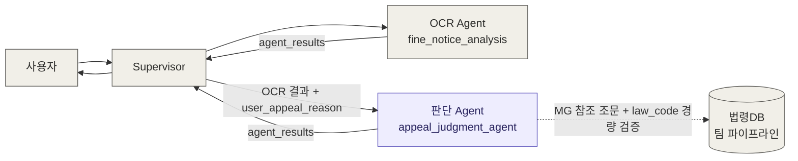
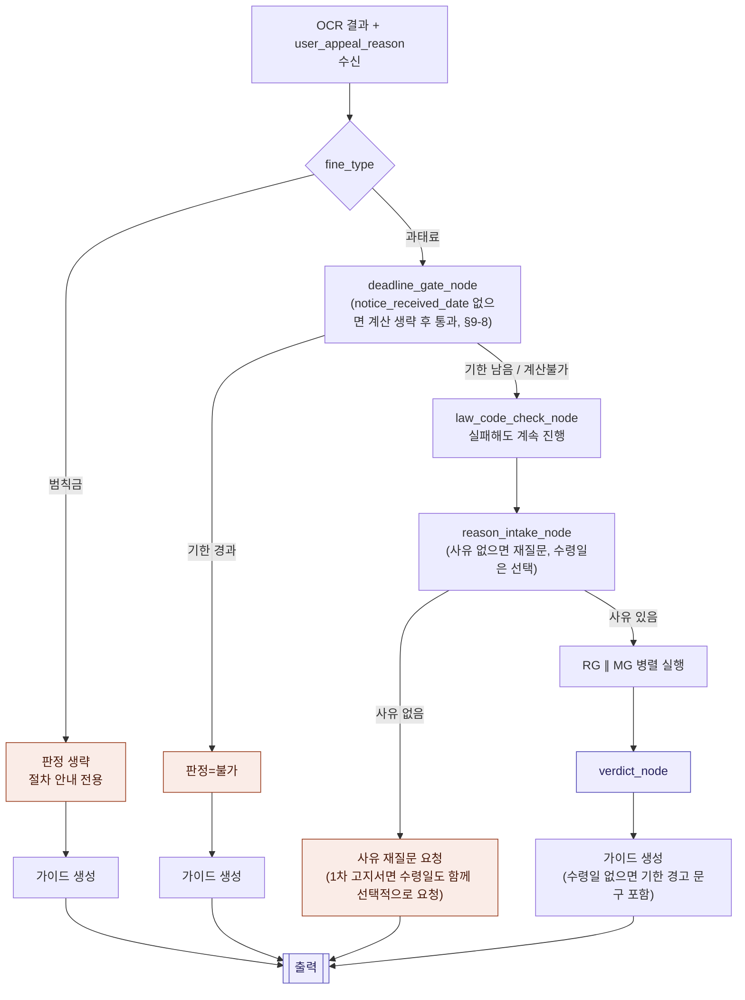

# 아키텍처 설계서
**과태료 이의가능성 판단 Agent** · Design Document 1/3

| 항목 | 값 |
|------|-----|
| 문서 번호 | ARCH-001 |
| 버전 | v4.3 |
| 작성일 | 2026-07-02 (최초 작성 2026-07-01) |
| 근거 문서 | DATA-002 (OCR Agent 데이터 모델 설계서 v3.0), 설계 정리 문서 v22, 법조문_참고자료_142조_14조.md, RG_MG_비교정리.md, `ai/agents/appeal_decision_flow/`(구현·테스트) |
| 변경 요약 | v2.0 → v3.0: law_code 검증을 경량 버전(`LDB_CHECK`, 하드블록 없음)으로 부분 복원. v2.0에서 "유지관리 부담"으로 든 근거가 law_code에는 잘못 적용됐음을 재확인 — 데이터가 이미 자동화된 파이프라인이라 유지비용이 사실상 0. 벌점/채널 관련 항목은 "제거"에서 "대기 상태(재검토 보류)"로 재분류. v3.0 → v3.1: 구현 착수 전 미결 사항 3건 추가 — (1) MVP 하드코딩 범위, (2) 시행규칙 제142조 적용범위(주정차 위반 한정) 재검토 필요, (3) 기한 기산일(수령일) 데이터 출처 미정의. §9 참고. v3.1 → v3.2: RG 리스크 트리거 카테고리에 "본인 운전 인정형"(3번째 패턴) 추가 필요성 발견 — 142조 인정사유 계열과 구조적으로 겹침. §9-4 참고. v3.2 → v3.3: "강함×위험" 조합이 "위험"이 아니라 "조건부 위험"(1호 성공 시 무위험, 실패 시 3호로 범칙금 전환)임을 명확화 — §9-4, §5-2 갱신. v3.3 → v3.4: 수령일 미결 사항(§9-3) 해소 — OCR Agent 실제 코드에 발송일 계열 필드가 없음을 확인, `notice_received_date`를 `user_appeal_reason`과 동일하게 Supervisor 공급 필드로 결정. v3.4 → v3.5: 카테고리 C(본인 운전 인정형) 표현 범위 확정 — "142조 문구"가 아니라 "본인 운전 전제 정황 진술"로 정의, RG 입력에 `notice_stage` 추가. §9-4 참고. v3.5 → v3.6: 142조 적용범위 미결 사항(§9-2) 해소 — 비주정차 위반은 질서위반행위규제법 제7조를 대체 참조, `law_code`로 위반유형 판별. §9 전체 항목 해소 완료. v3.6 → v3.7: 구현 착수 전 최종 검수 — `risk_trigger_category` 필드 신설(카테고리 A/B/C 혼합 매치 시 조건부 disclaimer 프레이밍 오류 방지), `law_code` 주석·API-004 근거문서 버전 표기 등 문서 정합성 정정. §9-5 참고. v3.7 → v3.8: 차량 도난 케이스 처리 추가 — MG 컨텍스트에 제160조4항1호 본문(도난) 포함, RG는 도난 표현을 카테고리 A보다 먼저 체크해 안전으로 분류. §9-6 참고. v3.8 → v3.9: 1차 고지서 경로 순서 오류 수정 — `DCHK`가 Supervisor 공급 필드(`notice_received_date`) 없이는 실행 불가능했던 순서 모순 해소. `law_code_check_node`·`reason_intake_node`를 `deadline_gate_node`보다 앞으로 재배치(1차 고지서 경로만). §9-7, §3, §4 참고. v3.9 → v4.0: 구현 착수 — §10 파일 구조 신설. `ai/agents/fine_notice_analysis/`의 파일당 단일 책임 패턴을 재사용해 12개 파일로 매핑, MVP 하드코딩 대상(`law_refs.py`)을 별도 모듈로 격리. v4.0 → v4.1: 구현 완료 후 설계 역반영 — §11 신설. RG 2단계 판단 필드를 `is_identity_related`+`category`에서 `category` 하나로 단순화(실제 API 테스트로 두 필드가 모순되는 응답을 낼 수 있음을 확인), LLM 호출 실패 시 폴백 정책 신설(RG→위험, MG→보류), 테스트 커버리지 위치 기록. v4.1 → v4.2: `notice_received_date` 하드 블로커 완화 — "승산만 궁금한" 사용자가 수령일 없이도 판정을 받을 수 있도록, 1차 고지서 경로에서도 수령일 부재를 `input_required`가 아니라 `guide_generation_node`의 비차단 경고로 전환. 이 전제 위에서 성립했던 §9-7의 1차 고지서 전용 노드 순서(v20)도 함께 되돌려 사전통지·1차 고지서 모두 `deadline_gate_node → law_code_check_node → reason_intake_node` 단일 순서로 재통일. §9-7, §9-8, §3, §4, §10, §11-4 참고. v4.2 → v4.3: v4.2 반영 후 테스트 스위트(`test/unit/`, `test/integration/`) 전면 갱신 및 재실행 — §11-3에 클래스별 검증 대상과 최근 실행 결과(94개 mock 테스트 전부 통과, 실제 GPT API 테스트 7개 중 1건의 회차 변동성 기록)를 정리해 추가. |

---

## 1. 개요

본 Agent(이하 `appeal_judgment_agent`)는 OCR Agent(`fine_notice_analysis`)가 Supervisor를 통해
전달한 고지서 분석 결과를 입력으로 받아, **과태료 이의가능성을 판정**하고 **진행 시 유의사항을
안내**한다. 범칙금은 이의신청서 생성이 서비스 범위 밖(법원행정 영역)이므로 판정 없이 절차 안내
경로로만 처리한다.

핵심 설계 원칙은 세 가지다.

1. **판정(merit)과 리스크(risk)는 별도 축으로 유지한다.** 사유가 법적으로 인정될 만한지(merit)와,
   그 사유가 신원노출로 이어질 위험이 있는지(risk)는 독립적인 문제이며, 하나의 점수로 합치면 판단
   근거가 불투명해지고 법률자문처럼 보일 위험이 커진다.
2. **가이드(안내)는 판정과 분리된 공용 산출물이다.** fine_type·판정 성공 여부와 무관하게 항상 동일한
   6종 가이드 템플릿이 나가며, 판정 결과 필드만 조건부로 채워진다.
3. **본 서비스의 산출물은 "완성된 이의신청서(문서)"까지다.** 문서가 어느 채널(우편/방문/온라인)로
   제출되는지는 산출물의 형태를 바꾸지 않으므로, 판정에 기여하지 않는 부가 검증·데이터 유지관리
   기능은 스코프에서 제외한다 (v2.0에서 이 원칙에 따라 세 가지 기능을 제거했다 — §5-4 참고).

---

## 2. 시스템 컨텍스트



- 본 Agent는 OCR Agent와 **단일 책임 원칙**으로 분리된다 — OCR·문서 분류는 OCR Agent, 법적 판단·
  안내는 본 Agent가 전담한다.
- 본 Agent는 사용자와 직접 대화하지 않는다. 부족한 입력(사유 미입력)이 있으면 Supervisor에
  `status`와 `next_actions`로 요청을 되돌리고, Supervisor가 사용자에게 재질문한다.
- **법령DB 연동은 두 가지 역할을 한다 (v3.0).** ① `MG`가 사용하는 고정 참조 조문(시행규칙 제142조,
  질서위반행위규제법 제14조 등)의 최신성 유지, ② `LDB_CHECK`를 통한 개별 고지서 `law_code`의 경량
  존재 여부 조회 (판정을 막지 않는 단일 조회, 실패해도 파이프라인 진행). 벌점 기준표(별표28) 조회는
  아직 대기 상태 — 법령DB가 별표를 파싱 가능한 구조화 텍스트로 주는지 미확인.

---

## 3. LangGraph 노드 구성 (v4.2)

**(v4.2) 실행 순서는 `notice_stage`와 무관하게 단일하다** — `deadline_gate_node` →
`law_code_check_node` → `reason_intake_node` 순서를 사전통지·1차 고지서 모두 동일하게 따른다.
v3.9(v20)에서는 `notice_received_date`가 없으면 `deadline_gate_node` 실행 자체가 불가능하다는
전제로 1차 고지서만 순서를 바꿨지만, `notice_received_date`를 하드 블로커에서 완화하면서
(§9-8) 그 전제가 사라져 순서를 다시 통일했다. §9-7·§9-8 참고.

| 노드명 | 역할 | 입력 의존 | 출력 |
|--------|------|----------|------|
| `fine_type_router` | `fine_type` 분기 (과태료/범칙금). 조건부 엣지로 구현, 별도 노드 아님 | `fine_type` | 다음 노드 라우팅 |
| `deadline_gate_node` | `notice_stage`별 기한 계산 + 기한도과 하드게이트. (v3.4) 1차 고지서 기산일은 `notice_received_date`(Supervisor 공급, §9-3) 사용. **(v4.2) `notice_received_date`가 없으면 `computed_deadline=None`·`deadline_passed=None`을 방어적으로 반환하고 기한도과 게이트를 통과시킨다 — 더 이상 하드 블로커가 아니다(§9-8)** | `notice_stage`, `opinion_deadline`, `notice_received_date`(선택) | `computed_deadline`, `deadline_passed` |
| `law_code_check_node` (`LDB_CHECK`) | (v3.0 복원) 자동화 파이프라인으로 `law_code` 단일 조회. 실패해도 파이프라인을 막지 않음. **⚠️ MVP: 팀 법령DB API 연동 전까지는 스텁 처리(§9-1)** | `law_code` | `law_code_verified` |
| `reason_intake_node` | `user_appeal_reason` 존재 확인 — 없으면 `input_required`로 재질문. **(v4.2) `notice_received_date`는 1차 고지서에서도 더 이상 하드 블로커가 아니다** — 사유가 있으면 수령일 부재만으로는 재질문하지 않고 통과시킨다. 다만 사유 재질문이 어차피 발생하는 경우엔 수령일도 함께(선택 사항으로) 물어 재호출 횟수를 아낀다(§9-8) | `user_appeal_reason`, (1차 고지서면 선택적으로) `notice_received_date` | 존재 여부, 없으면 조기종료 |
| `risk_classification_node` (RG) | 1단계 키워드 + 2단계 LLM, 재현율 우선. (v3.5) 트리거 카테고리 3개 확정 — 제3자 운전 주장/명시적 전환 요청/본인 운전 인정형(§9-4). (v3.7) 매치된 카테고리를 `risk_trigger_category`로 출력. (v3.8) 도난 표현은 카테고리 A보다 먼저 체크해 안전으로 분류(§9-6) | `user_appeal_reason`, `notice_stage` | `risk_flag`, `risk_trigger_category` |
| `merit_classification_node` (MG) | 고정 참조 법조문을 컨텍스트로 LLM 단일 호출. (v3.6) `notice_stage` × 위반유형(주정차/비주정차, `law_code`로 판별)에 따라 142조 또는 제7조를 선택 주입(§9-2). (v3.8) 주정차 위반에는 제160조4항1호 본문(도난 포함)도 함께 주입(§9-6) | `user_appeal_reason`, `notice_stage`, `law_code`, LDB 참조 조문 | `merit` |
| `verdict_node` (E) | RG × MG 조합 매트릭스로 최종 판정 통합 | `risk_flag`, `merit` | `overall_possibility`, `risk_flag` |
| `guide_generation_node` (G) | 6종 가이드 공용 템플릿 생성 (`law_code_verified`에 따라 ⑥ disclaimer 문구 조건부 변경. (v3.7) `risk_trigger_category`에 따라 조건부/무조건 위험 프레이밍 선택) | 위 전체 출력 | `guide` (①~⑥) |

### 노드 상태 변경 이력 (v1.0 → v3.0)

| 노드 | v1.0 | v2.0 | v3.0 | 비고 |
|---|---|---|---|---|
| `channel_lookup_node` (발부기관 판별) | 있음 | 제거 | 제거 유지 | 접수채널 안내가 단일 문구로 통합, 데이터가 지자체 수작업 리서치 대상이라 유지관리 부담 근거 유효 |
| `law_code_verification_node` (정규화→조회→하드블록) | 있음 | 제거 | **`law_code_check_node`로 경량 부활** | v2.0의 "유지관리 부담" 근거가 이 항목엔 잘못 적용됐음을 재확인 — 데이터가 자동화 파이프라인이라 비용이 사실상 0. 다만 하드블록(재확인 루프)은 되살리지 않음 |
| `zero_point_check_node` (`ZP`, 벌점 0점) | 없음 (v1.1에서 도입) | 제거 | **대기 상태 (미도입 유지)** | 법령DB API가 별표28을 파싱 가능한 구조화 텍스트로 주는지 미확인이라 재검토 보류 중. 유지관리 부담 문제가 아니라 기술적 미확인 사항 |

`law_code_verification_node`와 `zero_point_check_node`는 겉보기엔 같은 "v2.0에서 제거된 부가 기능"
처럼 보였지만, 재검토 결과 성격이 완전히 달랐다. 전자는 데이터 소스(법령DB, 자동화됨)가 명확해
경량 버전으로 즉시 복원 가능했고, 후자는 데이터 소스(법령DB의 별표 응답 형식)가 아직 불확실해
복원 여부를 판단할 수 없는 상태다. **"유지관리 부담"이라는 근거를 여러 기능에 뭉뚱그려 적용하면
안 되고, 항목마다 실제 데이터 소스를 확인해야 한다**는 게 이번 재검토의 교훈이다.

---

## 4. 그래프 흐름 (v4.2 — notice_stage 무관 단일 순서, 상세 도식은 설계 정리 문서 최신 버전이 정본)



(v4.2) 사전통지·1차 고지서 모두 같은 순서를 따른다. v20(§9-7, v3.9)에서 1차 고지서만 순서를
바꿨던 이유는 `notice_received_date` 없이는 `deadline_gate_node` 실행이 불가능하다는 전제
때문이었는데, §9-8에서 그 전제 자체를 없앴다(값이 없으면 `deadline_gate_node`가 방어적으로
`computed_deadline=None`을 반환하고 통과) — 그래서 v20의 순서 예외가 더 이상 필요 없어져
원래의 단일 순서로 되돌렸다.

---

## 5. 설계 원칙 상세

### 5-1. 판정(E)과 가이드(G)의 분리

`E`(verdict_node)는 과태료에서만 실행되고, 범칙금·기한도과 경로는 `E`를 건너뛰고 각자의 고정
상태값으로 `G`(guide_generation_node)에 진입한다. 가이드 6종(①~⑥)은 **fine_type과 무관하게 항상
전체 출력**되는 공용 템플릿이며, 판정 필드(`overall_possibility`)만 조건부로 채워진다.

### 5-2. RG와 MG의 구조적 비대칭

| | RG (리스크 게이트) | MG (인정사유 분류) |
|---|---|---|
| 구조 | 1단계 키워드 매칭 → 2단계 LLM | 고정 참조 조문 컨텍스트 기반 LLM 단일 호출 |
| 놓쳤을 때 위험도 | 높음 (실제 불이익 발생 가능) | 낮음 (`merit=보류`로 안전하게 수렴) |
| 설계 우선순위 | 재현율 우선, 애매하면 `risk=true` | 정확성·최신성 우선, 애매하면 `merit=보류` |

두 노드가 다른 구조를 갖는 이유는 **놓쳤을 때의 결과가 다르기 때문**이며, 이는 의도된 비대칭이다.

**⚠️ (v3.2) 다만 두 노드가 완전히 독립적이지는 않다는 게 드러났다.** MG가 인정하는 시행규칙
제142조 "부득이한 사유" 계열은 구조적으로 "본인이 운전하다가 이런 사정이 있었다"를 인정하는
진술이라, RG가 원래 잡던 위험 패턴(제3자 운전 주장/전환 요청)과 다른 세 번째 위험 패턴과
겹친다. 상세는 §9-4 참고.

### 5-3. notice_stage 포함 범위

서비스명은 "이의신청"이지만 `notice_stage=사전통지`(의견제출)도 판정 대상에 포함한다. 자진납부 20%
감경 기회가 살아있는 유일한 시점이며, RG의 근거 법조항도 의견제출·이의제기 두 단계를 함께 명시하고
있어 분리할 이유가 없다.

### 5-4. 스코프 축소 원칙 재검토 (v3.0) — 조건 2는 항목별로 실제 검증해야 한다

v2.0에서는 세 가지 부가 기능(law_code 검증, 벌점 화이트리스트, 발부기관 판별)이 아래 두 조건을 모두
만족한다고 보고 일괄 제거했다.

1. **판정 로직(`E`)의 입력으로 쓰이지 않는다** — merit·risk 어느 쪽도 이 데이터에 의존하지 않는다.
2. **지속적으로 변하는 외부 데이터를 우리가 유지관리해야 한다.**

**v3.0에서 재검토한 결과, law_code 검증은 조건 2를 만족하지 않는다는 게 드러났다.** law_code 데이터는
팀의 법령DB 파이프라인이 이미 자동으로 최신 상태를 유지해주므로, 추가 유지관리 비용이 사실상 0이다.
조건 1(판정에 안 쓰임)은 여전히 참이지만, **조건 1만으로는 완전 제거를 정당화할 수 없다** — 유지비용이
0에 가깝다면 판정에 안 쓰여도 문서 품질 목적으로 가볍게 검증할 가치가 있다. 그래서 v3.0에서는 하드
블록(재확인 루프) 없이 **경량 검증**으로 되살렸다.

발부기관 판별(지자체 시스템 확인은 수작업 리서치 필요)과 벌점 화이트리스트(법령DB 응답 형태 자체가
미확인)는 조건 2가 실제로 유효하거나 최소한 검증되지 않은 상태이므로, 제거·대기 상태를 유지한다.

**개정된 원칙**: "판정에 기여하는가"와 "유지관리 부담이 있는가"는 **별개로, 항목마다 각각 확인**해야
한다. 두 조건이 비슷해 보인다고 같은 결론으로 묶어서 적용하면 이번처럼 잘못된 제거가 나올 수 있다.

---

## 6. Supervisor 연동 계약

- **입력**: OCR Agent의 `agent_results["fine_notice_analysis"]["structured_result"]` 전체 +
  `user_appeal_reason`(Supervisor가 사용자에게 별도로 수집). v1.0에 있던
  `law_code_reverification_attempted` 플래그는 제거됨 (재확인 절차 자체가 없어짐).
- **출력**: `agent_results["appeal_judgment"]` 키로 동일한 envelope 포맷(`status`, `summary`,
  `structured_result`, `missing_fields`, `next_actions`)을 사용한다 — OCR Agent의 `make_envelope()`
  유틸을 그대로 재사용 가능.
- **재호출 조건**: `status`가 `input_required`일 때만 Supervisor가 사유를 채워 재호출한다 (v1.0에
  있던 `law_code_unverified` 재호출 경로는 제거됨). 상세 스키마는 03_API인터페이스_설계서 참고.

---

## 9. 미결 사항 (v3.1 도입 → v3.6 전체 해소, v3.7~v3.9 최종 검수 항목 추가, 2026-07-02) — 감사 추적용

### 9-1. MVP 하드코딩 범위

법령DB 파이프라인(팀 기존 시스템) 연동 전까지, 두 역할을 구분해서 하드코딩한다.

- **MG 참조 법조문 원문**(시행규칙 제142조, 질서위반행위규제법 제7·14·16·17·20조 등)은 개정
  빈도가 낮아 상수로 하드코딩해도 리스크가 작다 — §5-4의 "유지비용 0에 가까움" 논리와 같은 이유.
  실제 API 연동은 나중에 상수를 API 호출로 교체하면 된다.
- **`law_code_check_node`(LDB_CHECK)는 하드코딩이 부적절하다.** 임의의 `law_code`를 검증해야 하는
  역할이라, 하드코딩하려면 사실상 전체 법조항 목록이 필요해 "검증"의 의미가 없어진다. 실제 API
  연동 전까지는 **`law_code_verified`를 항상 `true`로 스텁 처리**하거나 노드 자체를 스킵하는 쪽을
  권장한다. 가짜 검증 로직을 만드는 것보다 "미구현"임을 명시하는 게 안전하다.

### 9-2. 시행규칙 제142조 적용범위 문제 — 해소됨 (위반유형별 참조법조문 분기)

`법조문_참고자료_142조_14조.md`에서 원문을 확인하는 과정에서 발견됨: 제142조는 도로교통법
**제160조 제3항**(법 제32조~제34조, 즉 **주정차·정차 위반**)에서 위임된 조항이다. 반면 `MG`는
위반유형과 무관하게 이 조문을 사전통지 단계의 고정 참조 조문으로 주입하고 있었다.

**결정 (v3.6)**: 비주정차 위반(과속·신호위반 등 무인단속)에는 **질서위반행위규제법 제7조**
("고의 또는 과실이 없는 질서위반행위는 과태료를 부과하지 아니한다")를 대체 참조로 쓴다. 제7조는
위반유형과 무관하게 모든 과태료(질서위반행위)에 보편 적용되는 일반 원칙이라 — 도로교통법에
해당 위반유형에 대한 특칙(142조 같은)이 없으면 이 일반법 조항이 보충 적용된다는 법 체계상 원리를
그대로 따른 것이다. 제7조는 이미 DATA-003 §9 법령DB 참조 조항 목록에 "MG 2차 참고"로 동기화
대상에 있었으나 실제 notice_stage 매핑표(§5)에는 연결이 안 돼 있었다 — 이번에 연결했다.

- **위반유형 판별**: 새 필드나 별도 분류 로직 없이, OCR이 이미 추출하는 `law_code`가 도로교통법
  제32~34조(주정차·정차 금지)에 해당하는지 정규식으로 매칭해 분기한다.
- 질서위반행위규제법 제14조(1차 고지서 단계 참조)는 위반유형과 무관하게 모든 과태료에 일반
  적용되므로 그대로 유지한다 — 비주정차 위반의 1차 고지서 단계는 "제7조 + 제14조" 조합이 된다.
- 상세 매핑표는 DATA-003 §5 참고.

### 9-3. 기한 계산 기산일(수령일) 데이터 출처 — 해소됨 (Supervisor 공급 필드로 결정)

§3·§6에서 1차 고지서 단계의 기산일로 쓰는 "고지서 수령일"이 State 스키마나 입력 페이로드에
정의돼 있지 않던 문제. `fine_notice_analysis`(OCR Agent)의 실제 코드(`ai/agents/fine_notice_analysis/state.py`)를
확인한 결과, 발송일 계열 필드도 전혀 없다는 게 확인됐다 — 즉 "발송일로 대체"조차 지금 당장은
OCR 쪽 스키마·추출 로직을 새로 추가해야 하는 일이라 즉시 해결 불가능하다.

**결정**: `notice_received_date`를 `user_appeal_reason`과 동일한 방식 — **Supervisor가 사용자에게
직접 물어 공급하는 필드**로 확정한다.

- OCR 결과에 없는 값은 Supervisor가 공급한다는 기존 원칙(`user_appeal_reason`이 선례)과 정확히
  같은 패턴이라 아키텍처 원칙을 새로 만들 필요가 없다.
- `reason_intake_node`가 사유와 함께 수령일도 같이 요청하도록 확장하면, 재호출 1회로 두 값을
  한 번에 받을 수 있다 (기존에도 사유 미입력 시 `input_required`로 재호출하던 흐름 그대로 사용).
- **장기 백로그(지금 결정 사항 아님)**: 고지서에는 보통 "발송연월일"이 인쇄돼 있으므로, OCR
  Agent 팀에 이 필드 추출을 요청해두면 나중에 사용자 질문 없이 자동 계산할 수 있다. 지금 당장
  구현을 막는 사안은 아니라 별도 이슈로만 남겨둔다.

DATA-003 State 스키마와 API-004 입력 페이로드에 `notice_received_date` 필드를 추가해야 한다
(각 문서 참고).

### 9-4. RG 리스크 트리거 카테고리 확장 — "본인 운전 인정형" (v3.2 발견)

`RG_MG_비교정리.md` 작성 중 발견됨: RG가 지금까지 잡던 위험 신호는 ① 제3자 운전 주장("다른
사람이 몰았다"), ② 범칙금 전환 명시적 요청, 두 가지뿐이었다. 그런데 `MG`가 인정사유로 판단하는
시행규칙 제142조 "부득이한 사유" 목록(응급환자 이송, 장애인 승하차 돕기 등)은 전부 "본인이
운전하다가 이런 사정이 있었다"는 걸 스스로 인정하는 진술이다 — 제3자를 지목하는 건 아니지만,
본인이 운전자였다는 사실 자체는 드러난다.

도로교통법 제160조제4항제3호("이의제기의 결과 위반행위를 한 운전자가 밝혀진 경우")는 그 경로가
제3자 지목이든 본인 자백이든 구분하지 않으므로, 논리적으로는 본인 자인도 같은 위험을 발생시킬
수 있다.

- **결론**: RG 트리거 카테고리를 3개로 확장한다 — ①②(기존) + ③ 본인 운전 인정형(신설). RG는
  여전히 텍스트만으로 자체 판단하므로 새 노드나 MG 의존성은 만들지 않는다 — RG·MG 병렬·독립
  구조는 유지한다.
- **파급 효과**: `merit=강함`(142조 해당) & `risk_flag=true` 조합이 예외가 아니라 142조 계열
  이의제기의 **기본 결과**가 된다.
- **(v3.2 후속 정리)** 142조(1호)와 제160조제4항제3호(운전자가 밝혀진 경우)는 서로 다른 독립
  근거다 — 1호가 인정되면 과태료 처분 자체가 불가(범칙금 전환 없음), 1호 주장이 받아들여지지
  않으면 이미 드러난 운전자 신원 때문에 3호가 적용돼 범칙금으로 전환될 수 있다. 즉 risk는
  **1호 주장이 실패했을 때만 실현**된다. 가이드 문구는 "표현을 다듬으라"가 아니라 "성공 시
  무위험 / 실패 시 범칙금 전환 위험"이라는 조건부 구조로 고지해야 한다 — 설계 정리 문서 v15의
  E 매트릭스 갱신 참고.
- **(v3.5 해소) 카테고리 C 표현 범위 확정**: 트리거 기준을 "142조 문구 매칭"이 아니라
  **"화자 본인이 위반 당시 운전자였음을 전제로 정황을 설명하는 진술 전반"**으로 정의한다.
  142조 문구로만 한정하면 1차 고지서 단계에서 쓰이는 질서위반행위규제법 제14조 정황요소
  (동기·목적·방법·결과, 태도, 연령·재산상태·환경) 기반 진술을 놓친다 — 14조 주장도 "제가
  이런 사정이었다"는 자기 진술이라 마찬가지로 운전자 신원을 드러내기 때문이다.

  | 단계 | 방식 |
  |---|---|
  | 1단계 키워드 | 142조 1~5호에 대응하는 구체적 시드 키워드 (예: 1호 "긴급 상황/범죄를 막으려고", 2호 "도로공사 중/교통정리를 돕다가", 3호 "응급환자/환자를 이송", 4호 "화재 현장/구조작업", 5호 "장애인 승하차") |
  | 2단계 LLM | `category` 판단 기준에 "본인이 위반 당시 운전자였음을 전제로 구체적 정황(부득이한 사유 또는 정상참작 요소)을 설명하는가"를 C 카테고리 조건으로 포함 (v3.10: 별도 `is_identity_related` 필드는 제거 — §11 참고) |

  142조 6호(포괄조항)와 14조 정황요소는 표현이 너무 다양해 키워드화가 불가능하므로 2단계 LLM
  판단에 위임한다.

- **(v3.5) RG도 `notice_stage`를 입력에 추가한다.** 142조(사전통지)·14조(1차 고지서)의 적용
  범위가 단계별로 다르므로, RG가 어떤 정황 진술 계열까지 카테고리 C로 볼지 판단하려면
  `notice_stage`가 필요하다. 이건 `MG`의 **출력**이 아니라 OCR이 제공하는 `notice_stage`
  **원본 필드**를 RG도 동일하게 읽는 것뿐이므로, RG·MG 병렬·독립 원칙은 유지된다 (§3 노드 표
  갱신).

**(v3.3 후속) "risk=true"를 "무조건 위험"으로 안내하면 안 된다.** 도로교통법 제160조제4항은
1호(부득이한 사유)와 3호(운전자가 밝혀진 경우)를 **서로 다른, 독립적인** 과태료 처분 불가
사유로 규정한다.

- 1호(=142조) 주장이 **받아들여지면** → 과태료 처분 자체가 불가. 범칙금 전환 없이 끝난다.
  `merit=강함`이 뜻하는 것도 이 가능성이 높다는 것.
- 1호 주장이 **받아들여지지 않으면** → 심사 과정에서 이미 운전자 신원은 드러난 상태이므로, 3호가
  적용돼 범칙금으로 전환될 수 있다.

즉 risk는 **1호 주장이 실패했을 때만 실현**되는 조건부 리스크다. 가이드 문구는 "이 사유를 쓰면
위험하다"가 아니라 "성공하면 과태료 자체가 면제되어 위험이 없지만, 실패하면 범칙금으로 전환될
수 있다"는 조건부 구조로 표현해야 정확하다. 상세는 설계 정리 문서 v15 참고.

### 9-5. 최종 검수 (v3.7, 2026-07-02) — 카테고리 혼합 매치 시 조건부 프레이밍 부정확 문제

구현 착수 전 마지막 전수 검토에서 발견됨. §9-4의 "성공 시 무위험/실패 시 전환 위험" 조건부
프레이밍은 카테고리 C(본인 운전 인정형) 전용이다. 그런데 사유 텍스트에 카테고리 A(제3자 운전
주장)나 B(명시적 전환 요청)가 **함께** 매치되는 혼합 사례(예: "다른 사람이 응급환자를 이송하다가
위반했다")에서는, 위험이 1호 실패를 전제하지 않고 곧바로 3호(제3자 특정)로 이어질 수 있어 조건부
프레이밍만으로는 부정확하다. 그런데 RG의 기존 출력(`risk_flag`, `risk_stage_matched`)은 어느
카테고리가 매치됐는지 구분하지 못했다.

**해결**: `risk_trigger_category` 필드를 RG 출력에 추가한다 — 1단계 키워드 매칭 시 매치된
카테고리(A/B/C)를, 2단계 LLM 매칭 시 LLM이 판단한 근거 카테고리를 기록한다. 여러 카테고리가
동시에 매치되면 A/B를 C보다 우선 기록한다 (A/B는 조건부 구조가 없는 직접적 위험이라 더
중요하게 다뤄야 함). `guide_generation_node`는 이 값을 보고 A 또는 B가 있으면 무조건 위험
경고를, C만 단독이면 조건부 구조 고지를 적용한다. 상세는 DATA-003 §4, §8 참고.

또한 이번 검수에서 다음 두 가지 문서 정합성 문제도 함께 발견해 수정했다.
- `law_code` 필드 주석(DATA-003 §3, API-004 §2)이 v3.6에서 추가된 "위반유형 판별 라우팅 신호"
  용도를 반영하지 못하고 있던 것을 수정.
- API-004 헤더의 "근거 문서" 버전 표기가 ARCH-001·DATA-003·설계 정리 문서의 실제 최신 버전과
  어긋나 있던 것을 동기화.

### 9-6. 차량 도난 케이스 처리 (v3.8, 2026-07-02)

"차를 도둑맞았는데 도둑이 운전하다가 위반했다"는 사유를 RG·MG가 어떻게 처리할지가 설계에
빠져 있었다는 게 드러났다.

**법적 근거**: 도로교통법 제160조제4항제1호는 "차를 도난당하였거나 그 밖의 부득이한 사유가
있는 경우"라고 규정한다. "도난"과 "부득이한 사유"가 병렬로 명시돼 있으므로, **도난은 142조의
6개 항목에 포함될 필요 없이 법률 본문에 이미 직접 규정된 별도 사유**다.

**MG 쪽 — 컨텍스트 누락**: 지금까지 MG는 142조 열거 목록만 주입했는데, 142조 어디에도 "도난"이
없다 (도난은 상위 조문인 제160조4항1호 본문에 있음). **해결**: MG 컨텍스트에 142조 목록뿐 아니라
제160조4항1호 본문도 함께 주입한다 (주정차 위반 케이스, DATA-003 §5 갱신). 비주정차 위반은
제7조("고의·과실 없음")가 도난까지 이미 포괄하므로 추가 조치 불필요.

**RG 쪽 — 카테고리 A 오분류**: "도둑이 운전했다"는 표면적으로 카테고리 A(제3자 운전 주장)
키워드에 걸릴 수 있지만, 성공(도난 입증)·실패(입증 못함) 어느 쪽이든 누구에게도 범칙금 전환
위험이 실현되지 않는다는 점에서 카테고리 A와 근본적으로 다르다 (카테고리 A는 성공/실패 무관하게
"밝혀진 특정 운전자"가 즉시 생기지만, 도난은 성공하면 아예 처분 불가로 끝나고 실패해도 특정된
운전자가 없어 3호가 적용될 근거 자체가 없다). **해결**: RG의 1단계 키워드 매칭에서 도난 관련
표현("도둑", "도난", "훔쳐서", "차를 도둑맞아" 등)을 카테고리 A보다 먼저, 최우선으로 체크한다.
매칭되면 카테고리 A로 넘어가지 않고 곧바로 `risk_flag=false`로 분류한다. 2단계 LLM 프롬프트에도
"이 진술이 도난·절도로 인한 것인가"를 먼저 확인해 해당하면 `category=null`로 응답하도록 예외
규칙을 추가한다. 상세는 설계 정리 문서 "차량 도난 케이스 처리 (v19)" 절, DATA-003 §5·§8 참고.

### 9-7. 1차 고지서 경로 순서 오류 수정 (v3.9, 2026-07-02) — ⚠️ v4.2에서 되돌림, §9-8 참고

`DCHK`(기한도과 판정)는 `CHK_REASON`(사유 존재 확인)보다 먼저 실행되는데, 1차 고지서의 `DCHK`는
`notice_received_date + 60일`을 계산해야 한다. 그런데 `notice_received_date`는
`user_appeal_reason`과 동일하게 **Supervisor가 사용자에게 물어서 공급하는 필드**로 확정했다
(§9-3) — 즉 최초 호출 시점엔 이 필드도 `None`일 수 있다.

**문제**: `notice_received_date`가 없으면 1차 고지서의 기한 계산·`DCHK`가 애초에 실행 불가능한데,
이 필드의 존재 여부를 확인하는 노드(`reason_intake_node`)는 `deadline_gate_node`보다 한참 뒤에
있었다. `DCHK`가 필요로 하는 값을 확인하는 게이트가 그보다 늦게 실행되는 순서 모순이었다.

**원인**: `DCHK`를 앞쪽에 둔 원래 의도는 "기한이 이미 지났으면 사유도 물어볼 필요 없이 조기
종료한다"는 최적화였다. 이건 `opinion_deadline`처럼 **OCR이 이미 제공하는 필드**만으로 계산
가능하다는 전제에서만 성립한다. §9-3에서 "1차 고지서 기산일은 Supervisor가 공급한다"고 결정할
때, 그 필드가 파이프라인 순서상 정확히 언제 필요한지는 재검토하지 않았다.

**해결**: 1차 고지서 경로만 순서를 바꾼다.

| 순서 | 사전통지 (기존 유지) | 1차 고지서 (v20 변경) |
|---|---|---|
| 1 | `deadline_gate_node` (OCR 필드만 필요) | `law_code_check_node` (`law_code`는 OCR 필드) |
| 2 | `law_code_check_node` | `reason_intake_node` (사유+수령일 둘 다 확인) |
| 3 | `reason_intake_node` | `deadline_gate_node` (필드 확보 후 계산) |

`law_code_check_node`가 1차 고지서 경로에서 맨 앞으로 온 이유는 `law_code`가 어차피 OCR
필드라 다른 값에 의존하지 않기 때문이다 — 덕분에 `input_required`로 돌아갈 때도
`law_code_verified`를 `partial_result`에 계속 포함할 수 있다 (다만 `computed_deadline`은 이
시점엔 계산 전이라 포함 못 함 — 사전통지 경로의 `input_required`와 다른 점).

**트레이드오프**: 1차 고지서 케이스는 이제 기한이 이미 지났어도 사유·수령일을 먼저 물어봐야
할 수 있다 (수령일 자체가 없으면 기한 경과 여부를 판단할 수 없으므로 불가피함). 재호출
횟수(최대 2회)는 그대로 유지된다 — 애초에 사유·수령일을 한 번에 같이 물어보기로 했었기 때문.
상세는 설계 정리 문서 "설계 포인트 (v20)" 절, DATA-003 §6·§7 참고.

**⚠️ 이 절의 결정은 v4.2에서 되돌려졌다 — §9-8 참고.** 이 절 자체는 "왜 한때 순서를 바꿨는지"에
대한 감사 추적으로 남겨둔다.

### 9-8. `notice_received_date` 하드 블로커 완화 및 §9-7 순서 되돌림 (v4.2, 2026-07-02)

**계기**: "그저 재미로 승산만 보고 싶어하는 사용자도 있을 수 있는데, 굳이 고지서 수령일까지
입력해야만 판정을 받을 수 있게 막아야 하나?"라는 질문. §9-7 시점에는 `notice_received_date`가
없으면 1차 고지서의 기한 계산 자체가 불가능하다는 이유로 `reason_intake_node`가 사유와 수령일을
**둘 다** 요구했는데, 다시 보니 이건 "법정 기한을 정확히 계산하기 위한 요구"이지 "판정
(merit/risk) 자체를 위한 요구"가 아니었다 — merit·risk 판단은 애초에 `notice_received_date`를
전혀 참조하지 않는다.

**결정**:
1. `notice_received_date`를 하드 블로커에서 **선택 필드 + 비차단 경고**로 완화한다.
   `reason_intake_node`는 `user_appeal_reason`이 있으면 수령일 부재만으로는 더 이상
   `input_required`로 막지 않고 통과시킨다. 사유 재질문이 어차피 발생하는 경우엔(사유가 없을
   때) 수령일도 함께 물어보되, 이건 "물어보는 김에 같이 묻는" 것일 뿐 필수 조건은 아니다.
2. `deadline_gate_node`는 이미 `notice_received_date`가 없을 때 `computed_deadline=None`·
   `deadline_passed=None`을 방어적으로 반환하도록 구현돼 있었다(구현 시점에 추가된 방어 코드) —
   덕분에 이번 완화는 이 노드를 수정할 필요 없이 `reason_intake_node`·`graph.py`만 바꾸면 됐다.
3. `guide_generation_node`가 `computed_deadline is None`인 경우를 감지해 "수령일을 몰라 법정
   이의제기 마감(수령일+60일, 질서위반행위규제법 제20조)을 계산할 수 없다"는 경고를 ①타임라인
   가이드에 포함한다. 고지서 인쇄 납부기한과 법정 이의제기 마감이 다른 값이라는 "핵심 함정"
   경고는 이 상황에서도 유지된다. `status`는 여전히 `success`이고, `missing_fields`에
   `notice_received_date`가 정보성으로만 포함된다(Supervisor가 원하면 추가 질문할 수 있게).
4. **§9-7 순서 되돌림**: `notice_received_date`가 하드 블로커가 아니게 되면서, §9-7이 1차
   고지서만 순서를 바꾼 근거(`notice_received_date` 없이는 `deadline_gate_node` 실행이 불가능)
   자체가 사라졌다. 사전통지·1차 고지서 모두 `deadline_gate_node → law_code_check_node →
   reason_intake_node` 단일 순서로 재통일한다(§3, §4 갱신).

**트레이드오프**: 1차 고지서 사용자가 수령일 없이 판정을 받으면, 실제 이의제기 시 법정 기한을
직접 확인해야 한다 — 이건 가이드 경고 문구로 고지하는 선에서 처리한다(문서·법률 자문이 아닌
정보 제공이므로 이 정도 책임 분리는 서비스 원칙(§1)과 부합).

상세는 DATA-003 §3·§6, API-004 §3, `ai/agents/appeal_decision_flow/reason_intake.py`,
`ai/agents/appeal_decision_flow/guide.py` 참고.

---

## 10. 파일 구조 (v3.9, 2026-07-02 신설)

`ai/agents/appeal_decision_flow/`에는 아직 `README.md`만 있고 구현 파일은 없다. 이미 완성된
`ai/agents/fine_notice_analysis/`(OCR Agent)가 파일당 단일 책임(state / 노드별 로직 / prompts /
utils / graph 조립)으로 나뉜 패턴을 그대로 재사용한다 — 두 에이전트가 같은 Supervisor 계약
(`make_envelope`, `agent_results` envelope)을 쓰므로 구조를 통일해두면 유지보수가 쉽다.

| 파일 | 매핑되는 노드/역할 | 비고 |
|---|---|---|
| `state.py` | `AppealJudgmentState` TypedDict + `JudgmentStatus`/`MeritLevel` 등 열거형 (DATA-003 §3) | OCR Agent의 `state.py`와 동일 패턴 |
| `law_refs.py` | MG·RG가 참조하는 법조문 원문 상수 — 시행규칙 제142조, 질서위반행위규제법 제7·14조, 도로교통법 제160조4항1호 본문 등 | **§9-1 MVP 하드코딩 대상**. 나중에 팀 법령DB API 연동 시 이 파일만 API 호출로 교체하면 되도록 별도 모듈로 격리 |
| `deadline.py` | `deadline_gate_node` — 사전통지/1차 고지서 두 경로 모두 동일 순서로 실행(§9-8, §3, §4). `notice_received_date`가 없으면 `computed_deadline=None`을 방어적으로 반환하고 통과 | 1차 고지서 경로에서 `notice_received_date`는 선택 필드 (DATA-003 §6, §9-8) |
| `law_code_check.py` | `law_code_check_node` (`LDB_CHECK`) | **MVP: `law_code_verified` 항상 `True` 스텁 처리 (§9-1)**, 실 API 연동 전까지 |
| `reason_intake.py` | `reason_intake_node` — `user_appeal_reason` 존재 확인. 없으면 재질문(1차 고지서면 `notice_received_date`도 선택적으로 함께 요청, §9-8) | `notice_received_date` 부재만으로는 재질문하지 않음 (§9-8) |
| `risk_gate.py` | `risk_classification_node` (RG) — 0단계 도난 예외(§9-6) → 1단계 키워드 A/B/C(§9-4) → 2단계 LLM, `risk_trigger_category` 산출(§9-5) | 카테고리 A/B/C 키워드 시드는 이 파일 또는 `keywords.py`로 분리 검토 |
| `merit_gate.py` | `merit_classification_node` (MG) — `notice_stage` × 위반유형(주정차/비주정차, `law_code` 정규식 판별) 별 참조 법조문 선택 → LLM 단일 호출(§9-2, §9-6) | `law_refs.py`의 상수를 컨텍스트로 주입 |
| `verdict.py` | `verdict_node` (E) — RG×MG 6칸 매트릭스, `risk_trigger_category`로 조건부/무조건 위험 프레이밍 분기(DATA-003 §4) | |
| `guide.py` | `guide_generation_node` (G) — ①~⑥ 가이드 템플릿 조립, `law_code_verified`·`risk_trigger_category` 기반 조건부 문구 | |
| `prompts.py` | RG 2단계 LLM 프롬프트, MG LLM 프롬프트 | OCR Agent의 `prompts.py`와 동일 패턴 |
| `utils.py` | `make_envelope`, `update_agent_results` 등 공용 헬퍼 | OCR Agent의 `utils.py`와 동일 (거의 그대로 재사용 가능) |
| `graph.py` | `StateGraph` 조립 — **(v4.2) notice_stage 무관 단일 순서**(deadline→law_code_check→reason_intake, §9-8) | v20(§9-7)의 notice_stage별 분기 라우팅은 v4.2에서 제거됨 |
| `__init__.py` | `graph` export | OCR Agent와 동일 (`from .graph import graph`) |

**(v4.1 해소)** RG 1단계 키워드 시드(도난/카테고리 A·B·C)는 별도 파일로 안 빼고 `risk_gate.py`에
모듈 상수로 인라인했다 — 노드 로직과 같은 파일에 있어야 어떤 키워드가 어떤 분기로 이어지는지
한눈에 보이고, 파일 개수도 늘리지 않아도 된다.

---

## 11. 구현 중 확정된 운영 정책 (v4.1~v4.2, 2026-07-02)

설계 단계에서 못 다룬 두 가지가 실제 코드 작성·실제 GPT API 검증 과정에서 확정됐다.

### 11-1. RG 2단계 판단 필드 단순화 — `is_identity_related` 제거

DATA-003 §8의 원래 설계는 RG 2단계 LLM이 `is_identity_related`(불리언)와 `category`(A/B/C/null)
를 각각 독립적으로 판단하게 했다. 실제 GPT API로 같은 사유("동생이 잠깐 몰고 나갔었습니다")를
6번 반복 호출해보니:

- `category`는 6번 모두 "A"로 일관됨
- `is_identity_related`는 True 2번, False 4번으로 무작위로 뒤집힘
- rationale 텍스트 자체가 자기모순인 경우도 있었음 (예: "신원 노출 위험이 없음"이라고 써놓고
  `is_identity_related=false`)

원인은 두 필드가 사실 하나의 판단인데(category가 정해지면 위험 여부는 논리적으로 자동 결정)
모델에게 중복으로 판단시킨 것이었다. **해결**: 프롬프트·State 스키마에서 `is_identity_related`
필드를 제거하고 `category` 하나만 판단하게 한다. `risk_flag`는 코드에서
`category is not None and confidence != "low"`로 유도한다. 상세는 DATA-003 §8 참고.

### 11-2. LLM 호출 실패 시 폴백 정책 (신설)

기존 설계는 "LLM이 응답은 했는데 애매한 경우"(confidence 처리)만 다뤘고, "LLM 호출 자체가
실패하는 경우"(네트워크 오류·레이트리밋·타임아웃 등)는 다루지 않았다 — 프로덕션에서는 반드시
마주치는 상황이라 방어 코드 없이는 `graph.invoke()` 전체가 예외로 죽는다.

**해결**: 이미 확립된 원칙(RG=재현율 우선, MG=애매하면 보류)을 "판단 실패" 상황까지 그대로
확장한다 — 새 상태값을 만들지 않는다.

| 노드 | 실패 시 폴백 | 근거 |
|---|---|---|
| `risk_classification_node` (RG) | `risk_flag=true` | 놓치면(false negative) 사용자가 실제 불이익을 당하는 안전 문제이므로, 판단 불가도 안전이 아니라 위험 쪽으로 |
| `merit_classification_node` (MG) | `merit="보류"` | 애매해도 안전 문제가 아니므로, 기존 "판단 유보" 의미에 자연스럽게 편입 |

같은 원칙으로, 모델이 정의된 값 밖의 응답(`confidence`가 "high"/"medium"/"low"가 아니거나
`merit`이 "강함"/"보류"/"낮음"이 아닌 경우)을 내도 RG는 위험 쪽, MG는 "보류"로 정규화한다.
상세는 DATA-003 §2-2, §8 참고.

### 11-3. 테스트 커버리지 및 실행 결과 (v4.3, 2026-07-02 갱신)

| 위치 | 범위 |
|---|---|
| `test/unit/test_appeal_decision_flow_nodes.py` | 노드별 단위 테스트 (GPT 목 처리) |
| `test/integration/test_appeal_decision_flow_graph.py` | 플로우차트 v4.2(단일 노드 순서) 전체 분기 (GPT 목 처리) |
| `test/test_appeal_decision_flow_real_llm.py` | 실제 GPT API로 프롬프트 품질 검증 (`OPENAI_API_KEY` 없으면 스킵) |

**최근 실행 결과 (v4.2 반영 후, 2026-07-02)**

```
test/unit/test_appeal_decision_flow_nodes.py            75 passed
test/integration/test_appeal_decision_flow_graph.py     19 passed
                                                          ── 94 passed (mock 처리, 결정론적)

test/test_appeal_decision_flow_real_llm.py                7 passed (실제 GPT API, OPENAI_API_KEY 필요)
```

`test/unit/`·`test/integration/`은 GPT 호출을 목(mock) 처리하므로 항상 결정론적으로 94개 전부
통과해야 한다. 클래스별 분포는 아래와 같다.

| 파일 | 테스트 클래스 | 개수 | 검증 대상 |
|---|---|---|---|
| unit | `TestDeadlineGateNode` | 8 | 기한 계산·기한도과 판정, 수령일/납부기한 없을 때 방어적 `None` 반환 (§9-8) |
| unit | `TestLawCodeCheckNode` | 3 | MVP 스텁 (`law_code_verified` 항상 `True`, §9-1) |
| unit | `TestReasonIntakeNode` | 11 | 사유·수령일 존재 확인, **(v4.2 갱신)** 수령일 단독 부재는 재질문 사유가 아님, `input_required`에도 `computed_deadline` 항상 포함 |
| unit | `TestLawRefs` | 11 | 주정차/비주정차 판별, notice_stage×위반유형별 MG 컨텍스트 선택 (§9-2, §9-6) |
| unit | `TestRiskClassificationNode` | 12 | 0단계 도난 예외 → 1단계 키워드 A/B/C → 2단계 LLM, 실패 시 위험 폴백 (§9-4, §9-6, §11-1, §11-2) |
| unit | `TestMeritClassificationNode` | 6 | LLM 단일 호출, 실패 시 "보류" 폴백, 값 정규화 (§11-2) |
| unit | `TestVerdictNode` | 2 | RG×MG 결과 통합, notice_stage별 `overall_possibility` 라벨 |
| unit | `TestGuideGenerationNode` | 22 | ①~⑥ 가이드 6칸 항상 완전 출력, RG×MG 6칸 매트릭스 톤(`_merit_risk_tone`), **(v4.2 신설)** 수령일 없을 때 타임라인 경고 문구 |
| integration | `TestFineTypeBranch` | 2 | 범칙금은 RG·MG·LLM 호출 없이 즉시 `not_applicable` |
| integration | `TestDeadlineGateBranch` | 3 | 사전통지·1차 고지서 기한도과 하드게이트, **(v4.2 갱신)** 기한도과로 `denied`되면 `law_code_check_node` 자체를 안 거쳐 `law_code_verified=None` |
| integration | `TestInputRequiredBranch` | 4 | **(v4.2 갱신)** `user_appeal_reason` 부재만 `input_required` 트리거, 수령일만 없으면 `success`+`missing_fields`로 진행 |
| integration | `TestSuccessBranch` | 5 | 도난/카테고리 A·B·C 조합별 정상 완료 경로, 비주정차 위반의 제7조 컨텍스트 주입 |
| integration | `TestParallelDispatch` | 2 | RG∥MG 정확히 1회씩 호출, 한쪽 노드 예외가 `graph.invoke()` 전체로 전파되는지 |
| integration | `TestGuideAlwaysComplete` | 3 | `not_applicable`/`denied`/`success` 전부에서 가이드 6종 완전 출력 |

**실제 GPT API 테스트(`test/test_appeal_decision_flow_real_llm.py`)의 알려진 변동성**: 이 7개는
mock이 아니라 실제 OpenAI 모델 응답을 검증하므로 완전히 결정론적이지 않다.
`TestRealTheftCase::test_도난_케이스는_merit강함_risk안전` 1건이 어느 실행 회차에서
`merit="보류"`(예상값 "강함") 응답을 받아 실패한 적이 있었으나, 재실행 시 정상적으로
`merit="강함"`을 반환하며 통과했다 — 코드 결함이 아니라 LLM 응답 자체의 회차별 변동(모델
샘플링 특성)이며, 이번 v4.2(`notice_received_date` 완화) 변경과는 무관하다 (도난 케이스 판단
로직인 `merit_gate.py`·`law_refs.py`는 이번 변경에서 건드리지 않았다). 이 테스트가 실패하면
재실행으로 재현되는지 먼저 확인하고, 재현되지 않으면 회차 변동으로 간주한다.

### 11-4. `notice_received_date` 하드 블로커 완화 (v4.2)

§9-8과 동일한 결정을 §11 관점(운영 정책)에서 요약한다 — 상세 근거·트레이드오프는 §9-8 참고.

- **정책**: `notice_received_date`는 필수 입력이 아니라 선택 입력이다. 없어도 merit·risk 판정과
  6종 가이드는 모두 정상적으로 산출되며, 다만 ①타임라인 가이드에 "법정 기한을 계산할 수
  없다"는 경고가 추가되고, 응답의 `missing_fields`에 정보성으로 포함된다.
- **판정 로직 무영향 확인**: `risk_classification_node`·`merit_classification_node` 어느 쪽도
  `notice_received_date`를 입력으로 참조하지 않는다 — 이 필드는 오직 `deadline_gate_node`의
  기한 계산에만 쓰이므로, 완화해도 판정 정확도에는 영향이 없다.
- **구조 단순화 동반**: 이 완화로 §9-7의 1차 고지서 전용 노드 순서(v20)가 불필요해져 함께
  되돌렸다(§9-8, §3, §4, §10) — "필드를 선택으로 바꾸는 김에 순서 예외까지 정리"한 것이 아니라,
  순서 예외의 **존재 근거 자체**가 이 완화로 사라졌기 때문에 되돌린 것이다.
