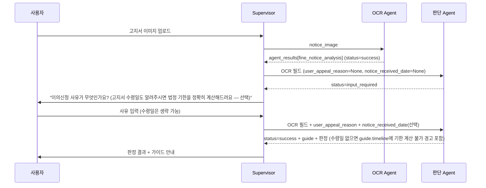

# API 인터페이스 설계서
**과태료 이의가능성 판단 Agent** · Design Document 3/3

| 항목 | 값 |
|------|-----|
| 문서 번호 | API-004 |
| 버전 | v3.6 |
| 작성일 | 2026-07-02 (최초 작성 2026-07-01) |
| 근거 문서 | ARCH-001 v4.2, DATA-003 v3.11, 설계 정리 문서 v22 |
| 변경 요약 | v2.0 → v3.0: 출력 페이로드에 `law_code_verified` 필드 복원 (경량 검증). 입력 페이로드·재호출 시나리오는 변경 없음 — `LDB_CHECK`는 Supervisor 왕복을 유발하지 않으므로 `law_code_reverification_attempted` 같은 재호출용 입력 필드는 되살아나지 않았다. v3.0 → v3.1: 입력 페이로드에 기한 기산일(수령일) 필드가 빠져있음을 미결 사항으로 표시 (ARCH-001 §9-3 참고). v3.1 → v3.2: 미결 사항 해소 — `notice_received_date`를 `user_appeal_reason`과 동일하게 Supervisor 공급 필드로 확정, 케이스 A·B 예시 페이로드 갱신. v3.2 → v3.3 (최종 검수): 근거 문서 버전 표기가 ARCH-001/DATA-003/설계 정리 문서 최신본과 어긋나 있던 것 동기화, `law_code` 주석에 위반유형 판별 용도 추가, 출력 페이로드에 `risk_trigger_category` 필드 추가. v3.3 → v3.4: 1차 고지서 경로 순서 오류 수정 반영 — `deadline_gate_node`가 필드 확인보다 먼저 실행될 수 없다는 문제 해소에 따라, 1차 고지서의 `input_required` 응답은 `computed_deadline`/`deadline_passed` 없이 `law_code_verified`만 포함하도록 출력 스키마 주석 정정. v3.4 → v3.5: 구현 중 발견 — §4 status×next_actions 표가 사전통지·1차 고지서를 한 행에 뭉뚱그려 "이의신청 사유"로만 안내하고 있었음. 사전통지는 법적으로 "의견제출"이라 별도 행으로 분리하고 문구를 "의견제출 사유"로 정정. v3.5 → v3.6: `notice_received_date`를 하드 블로커에서 선택 필드로 완화 — 1차 고지서도 `user_appeal_reason`만 있으면 `status=success`로 판정이 나가고, 수령일 부재는 `guide.timeline` 경고 문구 + 정보성 `missing_fields`로만 반영된다. §2 케이스 B, §3 출력 스키마, §4 status 표, §5 시퀀스 다이어그램 갱신. 상세는 ARCH-001 §9-8 참고. |

---

## 1. 개요

본 문서는 Supervisor가 `appeal_judgment_agent`를 호출할 때의 입력 페이로드, Agent가 반환하는
`agent_results` 출력 페이로드, 그리고 부족한 정보로 인한 재호출 시나리오를 정의한다. OCR
Agent(`fine_notice_analysis`)의 envelope 포맷(`make_envelope()`)을 그대로 재사용한다.

---

## 2. graph.invoke() 입력 페이로드 (v2.0에서 단순화, v3.0도 동일)

### 2-1. 케이스 A — 최초 호출 (OCR 완료 직후)

```python
{
    # OCR Agent structured_result에서 그대로 전달
    "fine_type":             "과태료",
    "notice_stage":          "1차 고지서",
    "violation_text":         "...",
    "opinion_deadline":       "2026-07-20",   # 인쇄된 납부기한
    "payment_deadline_2nd":   None,
    "issuing_authority":      "○○구청",       # 가이드에 그대로 노출만, 판별하지 않음
    "law_code":                "도로교통법 제17조 제1항",  # (v3.7) 용도 2가지: disclaimer 조건부 문구 +
                                                          # MG 위반유형(주정차/비주정차) 판별 라우팅 신호

    # Supervisor가 별도로 수집해 함께 전달 (OCR 결과에 없는 값)
    "user_appeal_reason": None,          # 아직 안 물어봤으면 None
    "notice_received_date": None,        # (v3.2) user_appeal_reason과 동일하게 Supervisor가 물어서 공급.
                                          # 1차 고지서 기산일(수령일+60일) 계산에 사용. 아직 안 물어봤으면 None
}
```

### 2-2. 케이스 B — `input_required` 이후 재호출 (사유 확보, 수령일은 선택)

```python
{
    # 케이스 A와 동일한 OCR 필드 반복 전달 (State 비영속 가정)
    "fine_type": "과태료", "notice_stage": "1차 고지서", ...,

    "user_appeal_reason": "표지판이 나뭇가지에 가려져 안 보였습니다",
    "notice_received_date": None,   # (v3.6) 선택 — 몰라도 판정은 success로 나가고,
                                     # guide.timeline에 법정 기한 계산 불가 경고만 붙는다
}
```

> **(v3.6) `notice_received_date`는 선택 필드다.** `reason_intake_node`는 `user_appeal_reason`
> 부재만으로 `input_required`를 반환한다 — 사유가 있으면 수령일이 없어도 그대로 통과시킨다.
> 사유 재질문이 어차피 발생하는 경우(케이스 A처럼 사유도 없을 때)엔 수령일도 함께(선택 사항으로)
> 물어 재호출 1회로 둘 다 받을 기회를 준다. 상세는 ARCH-001 §9-8 참고.

> **(v3.6에서 되돌림) v3.3(최종 검수)에서 있던 "1차 고지서 경로는 `input_required`가
> `law_code_check_node`보다 먼저 계산되지 않는다"는 제약은 사라졌다.** `notice_received_date`가
> 하드 블로커가 아니게 되면서 `deadline_gate_node`가 항상 `reason_intake_node`보다 먼저
> 실행되므로(ARCH-001 §9-8), 1차 고지서의 `input_required` 응답에도 사전통지와 동일하게
> `law_code_verified`·`computed_deadline`(수령일이 없으면 `None`)이 함께 포함된다 — §3 출력
> 스키마 참고.

> **v1.0 대비 변경**: `law_code_reverification_attempted` 필드와 그에 따른 "케이스 C(법조항 재확인
> 재호출)"가 v2.0에서 전부 제거됐다. law_code 검증 자체를 하지 않으므로 재확인 요청 시나리오가
> 존재하지 않는다. 이제 재호출 케이스는 사유 확보(케이스 B) 하나뿐이다.

---

## 3. agent_results 출력 페이로드 스키마 (v3.0)

```python
# agent_results["appeal_judgment"] 구조
{
    "node_name":  "과태료 이의가능성 판단 노드",
    "node_code":  "appeal_judgment",
    "status":     str,     # JudgmentStatus: success | denied | input_required | not_applicable
    "summary":    str,     # 1줄 요약
    "structured_result": {
        "judgment_status":       str,
        "fine_type":             str,
        "notice_stage":          str,

        # judgment_status == "success"일 때만 존재
        "overall_possibility":   str | None,   # "의견_제출시_인정가능" | "이의제기_인용가능"
        "merit":                 str | None,   # "강함" | "보류" | "낮음"
        "risk_flag":             bool | None,
        "risk_confidence":       float | None,
        "risk_trigger_category": str | None,  # (v3.7) "A_제3자운전주장" | "B_명시적전환요청" |
                                               # "C_본인운전인정형" | None — guide의 disclaimer가
                                               # 조건부/무조건 위험 프레이밍 중 뭘 쓸지 결정하는 데 사용

        # (v3.6) deadline_gate_node가 notice_stage 무관하게 항상 먼저 실행되므로 이 두 필드는
        # input_required 응답에도 함께 포함된다. computed_deadline은 1차 고지서에서
        # notice_received_date가 없으면 None — "계산 전이라 없음"이 아니라 "계산할 수 없어서 None"
        # (ARCH-001 §9-8)
        "computed_deadline":     str | None,   # YYYY-MM-DD
        "deadline_passed":       bool | None,
        "law_code_verified":     bool | None,  # (v3.0 복원) LDB_CHECK 결과, 실패해도 판정은 진행됨.
                                               # law_code는 OCR 필드라 두 경로 모두 항상 포함됨

        "guide": {
            "timeline":      str,   # ①
            "expectation":   str,   # ② (범칙금 전환 이익·불이익 비교표 포함)
            "channel":       str,   # ③ — "서면 원칙 + 관할 기관 직접 확인" 단일 문구
            "withdrawal":    str,   # ④
            "penalty_myth":  str,   # ⑤
            "disclaimer":    str,   # ⑥ (residual_risk_notice 항상 + law_code_verified에 따라 조건부 재확인 권고)
        },
    },
    "evidence":        [],
    "missing_fields":  list[str],
    "next_actions":    list[str],
    "limitations":     [],
}
```

### 출력 필드 변경 이력

- **v2.0에서 제거**: `law_code_valid`, `law_code_fail_stage`, `online_channel`, `channel_verified` —
  검증·판별 로직 자체가 삭제되며 함께 제거됐다. `issuing_authority`는 OCR 원본 값을 가이드에 그대로
  노출하는 용도로만 남아있고, 별도 판별·검증은 하지 않는다.
- **v3.0에서 복원**: `law_code_verified` (bool) — `law_code_valid`/`law_code_fail_stage`처럼 세분화된
  필드가 아니라 **단순 참/거짓 하나**로만 복원했다. 실패 원인(정규화 실패 vs 조회 실패)을 구분하던
  v1.0의 세밀함은 되살리지 않았다 — 어차피 판정을 막지 않고 disclaimer 문구만 바꾸는 용도라, 원인
  구분까지는 필요 없다고 판단.
- **v3.3에서 추가**: `risk_trigger_category` — 카테고리 A(제3자 운전 주장)·B(명시적 전환 요청)가
  카테고리 C(본인 운전 인정형)와 혼합 매치될 때, `guide.disclaimer`가 조건부 프레이밍("성공 시
  무위험/실패 시 전환 위험")을 잘못 적용하는 걸 막기 위한 필드다. A 또는 B가 매치되면 이 값이
  우선 기록되고, `guide_generation_node`는 이때 조건부 문구 대신 무조건 위험 경고를 쓴다.

---

## 4. status × next_actions 매핑 (v2.0에서 2개 상태 제거, v3.0도 동일)

| `judgment_status` | 트리거 조건 | `next_actions` |
|---|---|---|
| `"success"` | 전체 파이프라인 정상 완료 (1차 고지서는 수령일 없어도 성공 가능, `missing_fields`에 정보성으로만 표시) | `["판정 결과 및 가이드 사용자 안내"]` |
| `"denied"` | `deadline_passed=true` | `["기한 경과 안내, 타임라인 정보만 제공"]` |
| `"input_required"` (사전통지) | `user_appeal_reason`이 None | `["Supervisor가 사용자에게 의견제출 사유 질문 후 재호출"]` |
| `"input_required"` (1차 고지서) | `user_appeal_reason`이 None (**v3.6: `notice_received_date`만 없는 경우는 해당 없음 — success로 진행**) | `["Supervisor가 사용자에게 이의신청 사유 질문 후 재호출 (고지서 수령일도 함께 물으면 법정 기한을 정확히 계산 가능 — 선택 사항)"]` |
| `"not_applicable"` | `fine_type="범칙금"` | `["OCR 결과 기반 절차 안내만 제공 — 이의신청서 생성 불가"]` |

> **용어 구분**: 사전통지는 법적으로 "의견제출"(질서위반행위규제법 제16조)이지 "이의신청"이
> 아니다 — 정식 이의제기는 1차 고지서 단계부터다. Supervisor가 사용자에게 보내는 재질문
> 문구도 단계별로 정확한 절차명을 써야 혼동을 안 준다 (ARCH-001 §5-3).

> v1.0에 있던 `"law_code_unverified"`(재확인 1회 요청)와 `"unable_to_verify"`(재확인 실패, 판단
> 종료)는 law_code 하드블록 제거와 함께 삭제됐다.

---

## 5. Supervisor 연동 시나리오 (v2.0에서 단순화, v3.0도 동일)

### 5-1. 정상 흐름 (재질문 1회 포함, 1차 고지서 케이스)



> **(v3.6) 수령일 없이도 케이스 B에서 바로 success로 끝난다.** v3.2 시점에는 사유·수령일을
> "함께 확보"해야 재호출이 끝났지만, `notice_received_date`가 선택 필드로 완화되면서 사유만
> 있으면 재호출 1회로 success에 도달한다 — "승산만 궁금한" 사용자를 수령일 입력으로 막지 않기
> 위한 결정이다 (ARCH-001 §9-8).

> **(v3.2, 여전히 유효)** 사전통지·즉결심판 단계는 `opinion_deadline` 필드를 그대로 쓰므로
> `notice_received_date`가 애초에 필요 없다 — 재질문 여지는 1차 고지서 케이스에만 해당한다.

> **v1.0 대비 변경**: law_code 재확인 실패 시나리오(2차 호출 → `unable_to_verify` → 판단 종료)가
> v2.0에서 완전히 제거됐다. 이제 Agent 호출은 최대 2회(최초 + 사유 재질문)로 끝난다.

---

## 6. 에러/한계 처리 원칙 (v3.0)

- `overall_possibility`, `merit`, `risk_flag`는 법률자문이 아닌 참고용 판단이며, `guide.disclaimer`에
  이 사실과 관할 기관 확인 필요성을 항상 포함한다.
- **law_code는 `LDB_CHECK`로 경량 검증되지만, 실패해도 판정을 막지 않는다 (v3.0).**
  `law_code_verified=false`면 `guide.disclaimer`에 "이 조항이 확인되지 않았으니 고지서 원본과
  대조해 직접 확인하라"는 구체적 경고를, `true`면 가벼운 확인 문구를 포함한다. v9의 하드블록·
  재확인 루프는 되살리지 않았다 — Supervisor 왕복 없이 단일 조회 결과만 반영한다.
- **접수채널은 발부기관 구분 없이 단일 문구로 안내한다.** `guide.channel`은 항상 "서면(우편·방문)이
  원칙이며, 온라인 접수 가능 여부는 관할 기관에 직접 확인하라"는 내용을 포함하고, 특정 지자체를
  온라인 가능으로 단정하지 않는다.
- **벌점 관련 정확한 수치는 이파인 전환 미리보기로 위임한다.** `guide.expectation`(② 가이드)은 벌점
  유무에 따른 일반적 판단 기준(비교표)만 제공하고, 개별 위반 건의 정확한 벌점은 계산하지 않는다.
- **(v3.6) `notice_received_date` 부재는 에러가 아니라 정보 부족으로 취급한다.** 1차 고지서에서
  수령일 없이 판정이 나가면 `status`는 그대로 `success`이고, `guide.timeline`(① 가이드)에 "고지서
  수령일을 몰라 법정 이의제기 마감(수령일+60일, 질서위반행위규제법 제20조)을 계산할 수 없다"는
  경고와 함께 인쇄된 납부기한(`opinion_deadline`)이 법정 마감과 다른 값이라는 기존 "핵심 함정"
  경고를 함께 포함한다. `missing_fields`에는 `notice_received_date`가 정보성으로만 담긴다 —
  Supervisor의 재호출을 강제하지 않는다.
