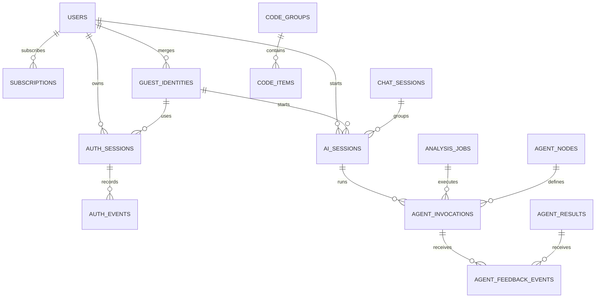

# Auth, Agent, Code 테이블 확장 ERD

| 항목 | 내용 |
|---|---|
| 작성일 | 2026-06-29 |
| 담당 | `hi20260204-maker` |
| 관련 이슈 | `#29`, `#56`, `#68` |
| 기준 migration | `backend/chatbot/migrations/0002_guestidentity_agentnodedefinition_aisession_and_more.py` |
| 목적 | 기존 MVP 저장 골격에 없던 사용자, Agent 실행, 코드 테이블, 사용량 제한 테이블을 운영 전환 후보로 추가한다. |

## 1. 왜 기존 ERD에 없었나

기존 ERD는 중간 발표 MVP에서 먼저 필요한 저장 경로를 빠르게 고정하기 위한
골격이었다. 그래서 `users`, `agent_nodes`, `code_groups` 같은 운영형 정규화
테이블을 바로 만들지 않고, 아래처럼 문자열과 JSON metadata로 대체했다.

| 빠져 있던 영역 | 기존 처리 | 한계 |
|---|---|---|
| 사용자 | `owner_id` 문자열 | 로그인 사용자, 비회원, 병합 정책을 명확히 구분하기 어렵다. |
| 비회원 | `guest_id` metadata 또는 header | 비회원 TTL, 병합 이력, rate limit 기준이 DB에서 분리되지 않는다. |
| Agent 정의 | OpenAPI `NodeCode`, mock registry | Agent 정의와 실제 호출 attempt를 DB에서 추적하기 어렵다. |
| Agent 호출 로그 | `agent_results.raw_output` 일부 metadata | retry, latency, token, cost, error를 결과와 분리해 보기 어렵다. |
| 코드값 | Django `TextChoices`, OpenAPI enum | 운영자가 바꿀 수 있는 코드값과 고정 schema enum이 섞인다. |
| quota | mock rate-limit response | 실제 subject별 사용량 제한과 비용 추적이 어렵다. |

이번 변경은 기존 테이블을 갈아엎지 않고, 위 빈칸을 보완하는 테이블을 추가한다.

## 2. 추가된 table

| DDD 영역 | Django model | PostgreSQL table | 역할 |
|---|---|---|---|
| Identity/Auth | `UserAccount` | `users` | 회원 사용자 기준 식별자 |
| Identity/Auth | `GuestIdentity` | `guest_identities` | 비회원 식별자와 회원 병합 후보 |
| Identity/Auth | `AuthSession` | `auth_sessions` | 로그인/비회원 인증 세션 |
| Identity/Auth | `AuthEvent` | `auth_events` | 로그인, 비회원 발급, 병합 등 인증 이벤트 |
| Subscription/Quota | `Subscription` | `subscriptions` | 무료/체험/구독 상태 |
| Subscription/Quota | `UsageQuota` | `usage_quotas` | subject별 사용량 제한 |
| Subscription/Quota | `UsageEvent` | `usage_events` | Agent 실행, 파일 업로드, report 생성 사용량 기록 |
| Code | `CodeGroup` | `code_groups` | 상태값/분류값 code group |
| Code | `CodeItem` | `code_items` | group별 code item |
| AI Orchestration | `AgentNodeDefinition` | `agent_nodes` | Agent node registry |
| AI Orchestration | `AiSession` | `ai_sessions` | 여러 job/retry를 묶는 논리적 AI 실행 단위 |
| AI Orchestration | `AgentInvocation` | `agent_invocations` | 개별 Agent 호출 attempt, latency, cost, error 추적 |
| AI Orchestration | `AgentFeedbackEvent` | `agent_feedback_events` | Agent 결과에 대한 사용자/운영 피드백 |

## 3. 확장 ERD

## 4. 기존 MVP 저장 골격과의 관계

이번 변경은 기존 `chat_sessions`, `analysis_jobs`, `agent_results`,
`analysis_display_results`, `reports`를 대체하지 않는다.

| 기존 table | 유지 이유 | 새 table과 연결 방향 |
|---|---|---|
| `chat_sessions` | 상담과 사건 흐름의 시작점 | `ai_sessions.session_id`, 기존 `owner_id` metadata와 연결 |
| `analysis_jobs` | Supervisor job 생명주기 | `agent_invocations.job_id`로 개별 Agent 호출 attempt 연결 |
| `agent_results` | Agent output envelope 저장 | `agent_feedback_events.agent_result_id`로 피드백 연결 |
| `analysis_display_results` | 화면 표시용 Supervisor snapshot | 이후 사용자 feedback, history event와 연결 |
| `reports` | report metadata와 다운로드 경계 | 이후 `report_download_events` 후보와 연결 |

## 5. 이번 변경에서 의도적으로 하지 않는 것

- 기존 `owner_id` 문자열을 즉시 FK로 바꾸지 않는다.
- 실제 JWT 인증 사용자 모델을 강제하지 않는다.
- 코드 테이블 초기 데이터를 확정하지 않는다.
- 구독 결제나 실제 과금 enforcement를 구현하지 않는다.
- 실제 외부 LLM/RAG/OCR 호출의 latency, token, cost 측정은 아직 연결하지 않는다.

## 6. 다음 구현 순서

1. `POST /api/auth/guest-session/`, `GET /api/auth/me/` 응답과
   `users`, `guest_identities`, `auth_sessions` 저장을 연결한다.
2. `owner_id`, `guest_id`, `auth_session_id`를 `chat_sessions.metadata`와 새
   auth table 기준으로 함께 확인한다.
3. `usage_quotas`, `usage_events`로 비회원/회원/구독 rate limit enforcement를
   시작한다.
4. 화면/운영에서 필요한 code group을 확정한 뒤 `code_groups`, `code_items`
   초기 데이터를 추가한다.

## 7. 2026-06-29 연결 업데이트

PR `#92` 후속 커밋에서 canonical `POST /api/analysis/jobs/` 저장 경계가
`agent_results`와 함께 `ai_sessions`, `agent_invocations`, `agent_nodes`까지
upsert하도록 연결되었다.

- `ai_sessions`는 하나의 `analysis_job` 실행을 논리 AI 실행 단위로 묶고,
  `auth_session_id`와 `chat_session_id`를 metadata에서 분리해 남긴다.
- `agent_invocations`는 각 node 실행 attempt의 status, evidence count,
  limitation count, execution mode, quota key를 저장한다.
- `agent_nodes`는 mock registry에서 넘어온 node metadata를 DB registry 후보로
  갱신한다.
- 반복해서 같은 `job_id`로 canonical analysis job을 저장해도 deterministic id를
  사용하므로 `agent_results`와 `agent_invocations`가 중복 증가하지 않는다.
