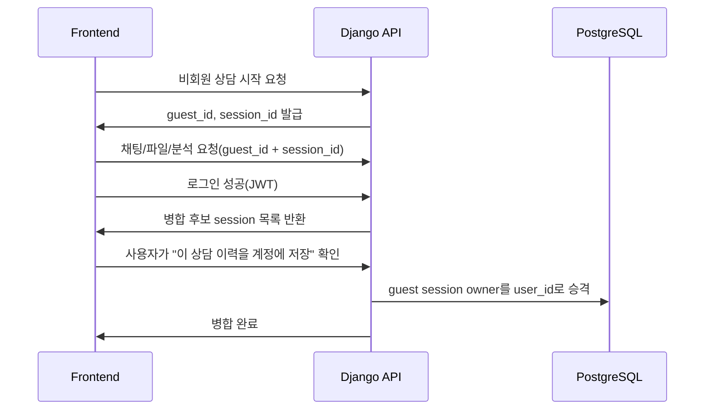
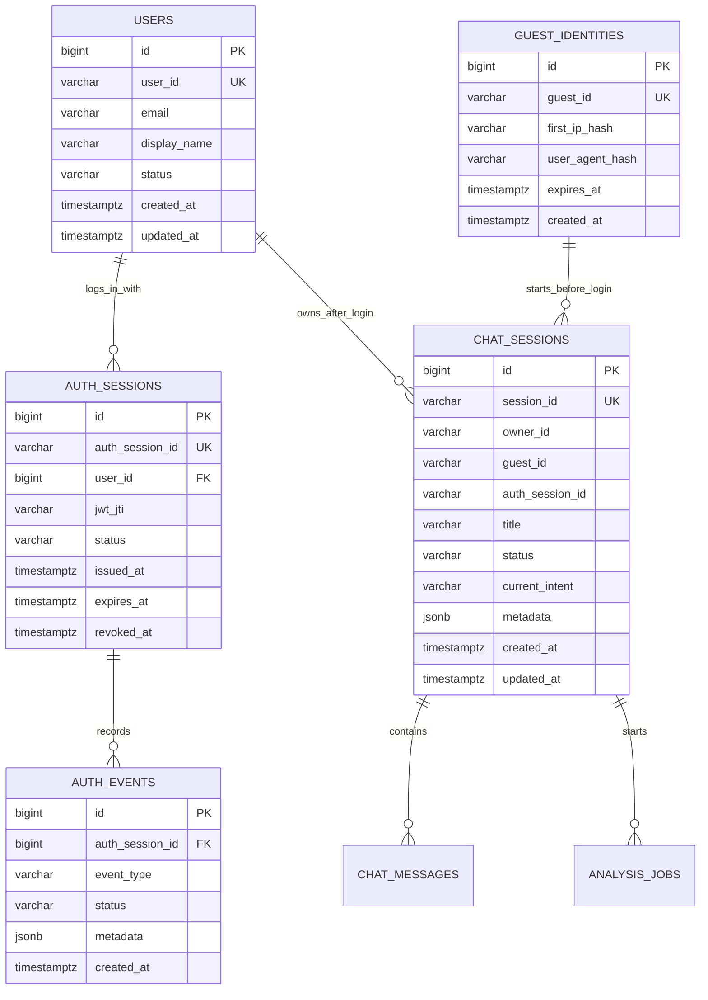

# 로그인, 비회원, 채팅 세션 분리 정책

| 항목 | 내용 |
|---|---|
| 작성일 | 2026-06-28 |
| 브랜치 | `hi20260204-auth-session-policy` |
| 상태 | 정책 확정안 v0, 구현 전 상세 히스토리 설계는 별도 컨펌 필요 |
| 관련 회의 메모 | 로그인 구현, 로그인 세션 아이디와 비회원 채팅 세션 아이디 구분, 비회원 rate limit, 회원, 히스토리 저장과 수집 |
| 관련 문서 | `docs/postgresql-erd-2026-06-28.md`, `backend/README.md`, `docs/pm-api-json-schema-spec-2026-06-23.md` |

## 1. 결론

로그인 상태, 비회원 사용자, 채팅/사건 흐름을 같은 `session_id`로 섞지 않는다.

MVP 이후 운영 전환 기준은 아래 네 가지 ID를 분리한다.

| 식별자 | 의미 | 예시 | 저장/전달 위치 |
|---|---|---|---|
| `user_id` | 로그인한 회원 계정 식별자 | `usr_01H...` | JWT claim, DB user table 후보 |
| `guest_id` | 비회원 브라우저/기기 식별자 | `gst_01H...` | 쿠키 또는 local storage, DB guest identity 후보 |
| `auth_session_id` | 로그인 유지와 토큰 회전 단위 | `auth_01H...` | JWT `jti` 또는 별도 auth session table |
| `session_id` | 상담방, 사건, 채팅 흐름 식별자 | `ses_01H...` | `chat_sessions.session_id` |

현재 코드와 문서는 이미 `session_id`를 채팅/분석/파일/리포트 연결에 사용하고 있으므로, 이 이름은 채팅/사건 흐름 전용으로 유지한다. 로그인 쪽에는 `auth_session_id`라는 별도 이름을 쓴다.

## 2. 왜 이렇게 나누는가

회의 메모의 핵심 의도는 "로그인 세션 아이디"와 "비회원으로 채팅을 쓰던 세션 아이디"를 구분하는 것이다.

이를 구분하지 않으면 다음 문제가 생긴다.

| 섞었을 때 문제 | 실제 위험 |
|---|---|
| 로그인 세션 만료와 채팅 사건 종료가 같은 의미가 됨 | 토큰 만료 때문에 사건 이력이 끊기거나, 반대로 사건이 남아 로그인 상태처럼 오해될 수 있음 |
| 비회원 상담 이력을 회원 계정에 자동 귀속하기 쉬움 | 민감 상담/교통 사건 자료를 사용자 확인 없이 계정에 붙이는 개인정보 리스크 |
| rate limit 기준이 흔들림 | 같은 상담방을 여러 사용자가 공유하거나, 한 사용자가 여러 사건을 만들 때 제한이 부정확해짐 |
| 히스토리 분석 기준이 흐려짐 | "누가", "어떤 사건에서", "어떤 인증 상태로", "무슨 Agent를 호출했는지"를 분리 분석하기 어려움 |

## 3. 기술 설명

### 3.1 JWT

JWT는 서버가 발급한 로그인 토큰이다. 프론트엔드는 API 요청마다 아래처럼 보낸다.

```http
Authorization: Bearer <access_token>
```

Django, RunPod worker, Agent gateway는 이 토큰의 서명과 만료 시간을 확인해 사용자를 식별한다.

JWT 안에는 최소한 아래 claim 후보를 둔다.

| Claim | 의미 | 필수성 |
|---|---|---|
| `sub` | 로그인 사용자 ID, 즉 `user_id` | 필수 |
| `jti` | 토큰 또는 로그인 세션 ID, 즉 `auth_session_id` 후보 | 필수 권장 |
| `exp` | 만료 시각 | 필수 |
| `iat` | 발급 시각 | 권장 |
| `scope` | 권한 범위 | 추후 구독제/관리자 권한에서 필요 |

현재 mock backend는 실제 JWT 서명 검증이 아니라 Bearer header 모양만 확인한다. 운영 전환 때 이 위치를 실제 JWT 검증으로 교체한다.

### 3.2 `auth_session_id`

`auth_session_id`는 "로그인 유지 상태"를 나타낸다. 같은 사용자가 PC와 모바일에서 로그인하면 `user_id`는 같아도 `auth_session_id`는 다를 수 있다.

이 값을 별도로 두면 다음이 가능하다.

- 특정 기기 로그아웃
- 만료 토큰 추적
- 이상 로그인 탐지
- Agent 호출 로그에서 어떤 로그인 세션으로 발생한 요청인지 추적

MVP에서는 JWT `jti`를 `auth_session_id`로 취급하고, 별도 DB table은 운영 전환 때 추가한다.

### 3.3 `guest_id`

`guest_id`는 비회원 사용자를 느슨하게 식별하는 값이다. 계정이 아니므로 민감 권한을 주면 안 된다.

비회원 사용 범위는 아래처럼 제한한다.

| 범위 | 비회원 허용 여부 | 이유 |
|---|---:|---|
| 일반 교통 질문 | 허용 | 서비스 진입 장벽을 낮춤 |
| 간단한 채팅 session 생성 | 허용 | 상담 흐름 체험 가능 |
| 파일 업로드 | 제한 또는 낮은 quota | 개인정보와 저장 비용 리스크 |
| 리포트 저장/다운로드 | 로그인 유도 | 장기 보관과 소유권 확인 필요 |
| 내 사건 목록 | 불가 | 계정 소유권 기반 기능 |

### 3.4 `session_id`

`session_id`는 지금 코드의 `chat_sessions.session_id`와 같은 의미로 유지한다. 이것은 로그인 세션이 아니라 하나의 상담/사건 흐름이다.

예를 들면 한 사용자가 아래처럼 여러 `session_id`를 가질 수 있다.

```text
user_id=usr_123
  session_id=ses_fine_notice_001
  session_id=ses_fault_ratio_002
  session_id=ses_law_question_003
```

## 4. 로그인 후 비회원 이력 병합

비회원으로 상담을 시작한 뒤 로그인했을 때는 자동 병합하지 않는다.

권장 UX는 아래 흐름이다.



자동 병합을 피하는 이유는 교통 사건 상담이 민감 정보를 포함할 수 있기 때문이다. 사용자가 명시적으로 동의한 session만 계정에 붙인다.

## 5. Rate Limit 정책

비회원과 회원의 제한 기준은 다르게 둔다.

| 대상 | Redis key 후보 | 제한 이유 |
|---|---|---|
| 비회원 채팅 | `rate_limit:guest:{guest_id}:chat_message` | 무료 남용 방지 |
| 회원 채팅 | `rate_limit:user:{user_id}:chat_message` | 구독제/회원 등급 확장 |
| 파일 업로드 | `rate_limit:ip:{ip}:file_upload` | 저장 비용과 악성 업로드 방지 |
| Agent 실행 | `rate_limit:subject:{subject_id}:agent_run` | 모델 비용과 RunPod 자원 보호 |

`subject_id`는 로그인 사용자는 `user:{user_id}`, 비회원은 `guest:{guest_id}`로 만든다.

MVP 기본값은 아직 확정하지 않는다. 실제 숫자 제한은 UX, 비용, 발표 범위를 보고 별도 컨펌한다.

## 6. 저장소 확장 후보

현재 ERD는 `chat_sessions.owner_id` 문자열 중심이다. 운영 전환을 위해 아래 확장을 후보로 둔다.



구현 선택지는 두 단계다.

| 단계 | 처리 |
|---|---|
| MVP | 기존 `owner_id`를 유지하고 `metadata.guest_id`, `metadata.auth_session_id`로 보조 저장 |
| 운영 전환 | `users`, `guest_identities`, `auth_sessions`, `auth_events` table 추가 |

MVP에서 바로 테이블을 늘릴 수도 있지만, 현재 저장소는 PostgreSQL foundation이 막 들어간 상태라 migration 범위를 작게 유지하는 편이 안전하다.

## 7. API 경계 후보

| Method | Path | 상태 | 목적 |
|---|---|---|---|
| `POST` | `/api/auth/guest-session/` | mock 구현 | 비회원 `guest_id` 발급 또는 갱신 |
| `POST` | `/api/auth/login/` | 검토 | 로그인 성공 후 JWT 발급 |
| `POST` | `/api/auth/refresh/` | 검토 | access token 갱신 |
| `POST` | `/api/auth/logout/` | 검토 | `auth_session_id` revoke |
| `POST` | `/api/auth/merge-guest-session/` | 검토 | 사용자가 승인한 비회원 상담 이력만 계정에 병합 |
| `GET` | `/api/auth/me/` | mock 구현 | 현재 사용자, guest, auth session 상태 확인 |

현재 mock backend에는 실제 로그인 발급/refresh/logout API가 없으므로, `login`, `refresh`, `logout`, `merge-guest-session`은 구현 확정이 아니라 다음 컨펌 후보로 둔다. `guest-session`, `me`는 정책 검증용 mock API로만 제공한다.

## 8. 히스토리 설계와의 관계

히스토리 저장은 별도 컨펌으로 분리한다. 다만 이번 정책에서 히스토리를 위한 최소 원칙은 확정한다.

모든 주요 이벤트는 아래 네 가지 축을 분리해서 기록할 수 있어야 한다.

| 축 | 필드 후보 |
|---|---|
| 누가 | `user_id`, `guest_id` |
| 어떤 로그인 상태로 | `auth_session_id`, `auth_state` |
| 어떤 상담/사건에서 | `session_id`, `job_id`, `report_id` |
| 무엇을 했는가 | `event_type`, `node_code`, `status`, `metadata` |

여기서 어떤 이벤트를 얼마나 자세히 저장할지는 다음 단계에서 직접 검토해야 한다. 특히 Agent reasoning, RAG source, 사용자 원문, OCR 결과는 개인정보와 비용 이슈가 있으므로 보관 정책을 별도로 정한다.

## 9. 구현 전 확인 필요

| 확인 항목 | 선택지 | 추천 |
|---|---|---|
| 비회원 파일 업로드 허용 | 금지, 제한 허용, 전면 허용 | 제한 허용 |
| 비회원 session TTL | 1일, 7일, 30일 | 7일 후보 |
| 로그인 후 병합 | 자동, 사용자 확인, 병합 없음 | 사용자 확인 |
| auth session 저장 | JWT `jti`만, DB table 추가 | MVP는 `jti`, 운영은 table |
| rate limit 숫자 | 낮음, 보통, 높음 | 비용 확인 후 별도 결정 |
| 히스토리 상세 이벤트 | 최소, 표준, 상세 | 다음 컨펌에서 직접 설계 |

## 10. 다음 작업 제안

다음 브랜치 또는 같은 브랜치의 후속 커밋에서 아래 순서로 진행한다.

1. `GET /api/auth/me/`와 `POST /api/auth/guest-session/` mock API를 프론트에서 연결해본다.
2. `ChatSession.metadata`에 `guest_id`, `auth_session_id`, `auth_state`를 저장하는 MVP 방식을 검토한다.
3. 로그인 후 guest session 병합 API의 request/response를 설계한다.
4. `docs/architecture/history-event-design-2026-06-28.md`의 히스토리 이벤트 저장 단계를 사용자 컨펌 후 구현한다.
