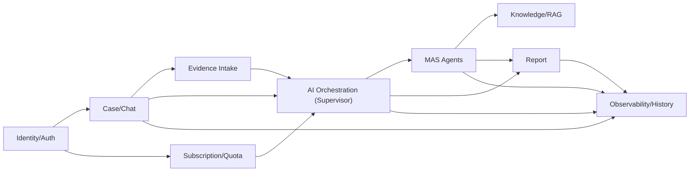

# DDD, MAS, history log roadmap

| 항목 | 내용 |
|---|---|
| 작성일 | 2026-06-29 |
| 작성자 | `hi20260204-maker` 실행 메모 |
| 기준 | `docs/postgresql-erd-2026-06-28.md`, `docs/architecture/history-event-design-2026-06-28.md`, `docs/architecture/service-protocol-persona-strategy-2026-06-29.md` |
| 목적 | 기존 ERD를 DDD bounded context 기준으로 재분류하고, MAS/Agent 실행과 history log management 순서를 확정한다. |

## 1. 용어 정리

DDD, MSA, MAS는 서로 다른 층위의 말이다.

| 용어 | 의미 | 우리 프로젝트 적용 |
|---|---|---|
| DDD | 도메인 책임을 bounded context로 나누는 설계 방식 | ERD와 코드를 `Identity`, `Case`, `AI Orchestration`, `History` 같은 책임 단위로 정리 |
| MSA | 각 bounded context를 별도 서비스/DB/배포 단위로 분리하는 운영 구조 | 지금은 하지 않는다. 먼저 modular monolith로 경계를 잡고 나중에 무거운 영역만 분리 |
| MAS | Multi-Agent System. 여러 Agent가 Supervisor 아래에서 협업하는 AI 실행 구조 | 현재 Supervisor, OCR/RAG/Vision/Report Agent 흐름에 해당 |

따라서 "ERD를 DDD 형식으로 변경한다"는 말은 테이블을 없애는 뜻이 아니다. 같은 ERD를 도메인 책임 기준으로 재배치해, 어떤 테이블이 어느 책임에 속하고 어떤 이벤트로 연결되는지 분명히 하는 것이다.

## 2. 권장 결론

지금 바로 MSA처럼 서비스를 쪼개지 않는다. 추천 구조는 아래다.

1. Django modular monolith 안에서 DDD bounded context를 문서와 모듈 경계로 먼저 고정한다.
2. Supervisor와 Agent 실행은 MAS 구조로 유지한다.
3. 모든 Agent 호출은 `agent_invocations` 후보와 `history_events` 후보로 추적 가능해야 한다.
4. 운영 전환 때 비용이 크거나 장애 격리가 필요한 영역만 MSA/worker로 분리한다.

분리 후보 우선순위는 `Evidence Processing`, `Knowledge/RAG`, `Report Generation`, `AI Orchestration Worker` 순서가 현실적이다.

## 3. Bounded context 재분류

| Bounded context | 현재 테이블/모델 | 다음 후보 | 책임 |
|---|---|---|---|
| Identity/Auth | `chat_sessions.owner_id` metadata, mock auth subject | `users`, `guest_identities`, `auth_sessions` | 회원, 비회원, 로그인 세션, guest merge |
| Subscription/Quota | 없음, mock rate-limit policy 응답 | `subscriptions`, `usage_quotas`, `usage_events` | 비회원/회원/구독 제한, 비용 제어 |
| Case/Chat | `chat_sessions`, `chat_messages` | `case_status_events` | 상담/사건 흐름, 내 사건 목록 |
| Evidence Intake | `uploaded_files` | `ocr_results`, `media_frames`, `evidence_items` | 업로드 파일, OCR/이미지 입력, privacy risk |
| AI Orchestration | `analysis_jobs`, `analysis_job_events`, `agent_results`, `analysis_display_results` | `ai_sessions`, `agent_invocations`, `agent_feedback_events` | Supervisor plan, Agent 호출, 결과 병합 |
| Knowledge/RAG | 현재 mock structured_result 안에만 존재 | `source_documents`, `rag_chunks`, `retrieval_events` | 법령/판례/사례 검색 근거 |
| Report | `reports` | `report_versions`, `report_download_events` | 이의신청서/분석 리포트, 저장/다운로드 |
| Observability/History | mock sidecar `history_event.v1` | `history_events`, `audit_log_events` | 애프터서비스, 운영 분석, 디버깅 |

## 4. Context map

## 5. MAS 실행 기준

MAS는 "Agent가 많다"가 아니라, 각 Agent의 책임과 입출력 계약이 분리되어 있고 Supervisor가 이를 조율한다는 뜻이다.

| 구성 | 책임 | 로그 기준 |
|---|---|---|
| Supervisor | 입력 분류, plan 생성, Agent 순서 결정, display DTO 병합 | `analysis_job_created`, `analysis_job_progressed`, `supervisor_merge_completed` |
| Input/OCR Agent | 고지서, 경위서, 이미지 입력 정리 | `agent_call_started/completed/partial/failed` |
| RAG Agent | 법령/판례/사례 근거 검색 | `retrieval_started/completed`, `evidence_count`, `source_refs` |
| Vision Agent | 사고 사진/영상 관찰 요약 | `media_analysis_started/completed`, `privacy_redaction_required` |
| Report Agent | 이의신청서/분석 리포트 생성 | `report_saved`, `report_generation_failed` |
| Validation Agent | Agent output envelope 검증 | `agent_result_validation_failed` |

Agent reasoning 전문은 기본 저장하지 않는다. 저장 가능한 것은 node, status, latency, token/cost 후보, evidence count, limitation count, retry count, error code, sanitized summary다.

## 6. History log management를 왜 먼저 넣는가

멘토 피드백의 핵심은 "서비스가 왜 그렇게 동작했는지 나중에 설명할 수 있어야 한다"는 것이다. 그래서 history는 화면 이력보다 넓다.

| 목적 | 필요한 로그 |
|---|---|
| 내 사건 진행도 복구 | `analysis_job_events`, `history_events`, `reports` |
| Agent 실패 디버깅 | `agent_call_failed`, `error_code`, `retryable`, `node_code` |
| 애프터서비스 | 이전 `display_result`, `limitations`, `pending_questions` |
| 비용 제어 | `usage_events`, `agent_invocations`, `quota_key` |
| 법률/근거 재현성 | `retrieval_events`, `source_refs`, `evidence_count` |
| 개인정보 보호 | `privacy.risk_level`, `contains_user_text`, `retention_policy` |

## 7. 로그 저장 강도

| 단계 | 저장 | 기본 입장 |
|---|---|---|
| 최소 | session/job/report 상태 | 화면 복구용 |
| 표준-라이트 | auth, chat, file, job, Agent, report 이벤트 요약 | MVP 기본 |
| 운영 | DB `history_events`, `agent_invocations`, `usage_events` | auth/권한/TTL 확정 후 |
| 상세 | 사용자 원문, OCR 원문, 모델 출력 전문 | 별도 동의/마스킹/보관 기간 없이는 금지 |

현재 구현은 표준-라이트 sidecar다. 다음 구현은 DB 전환 전이라도 event taxonomy와 필드명을 먼저 고정해야 한다.

## 8. 다음 구현 순서

| 순서 | 작업 | 산출물 |
|---:|---|---|
| 1 | DDD/MAS/history log roadmap 확정 | 이 문서, 관련 이슈 코멘트 |
| 2 | Auth/session/rate-limit MVP 경계 구현 | `guest_id`, `auth_session_id`, `session_id`, `owner_id`, quota key |
| 3 | AI session/Agent invocation logging 설계 | `ai_sessions`, `agent_invocations` 후보 ERD와 OpenAPI note |
| 4 | History event DB 전환 결정 | `history_events` table, TTL, 조회 권한, privacy policy |
| 5 | Supervisor 로그 연결 강화 | Agent call 시작/완료/실패/partial event를 job과 묶기 |
| 6 | Report/object storage 권한 연결 | report owner, download event, signed URL 후보 |

이 순서의 이유는 명확하다. AI 호출 수와 비용 정책을 정하려면 먼저 "누가, 어떤 사건에서, 어떤 Agent를, 어떤 권한/요금제 상태로 호출했는지"를 남길 수 있어야 한다.

## 9. ERD 변경 방식

현재 ERD를 한 번에 갈아엎지 않는다. 아래처럼 "현재 테이블 유지 + context 소유권 라벨링 + 다음 테이블 후보" 방식으로 진행한다.

| 현재 ERD | DDD 소유 context | 조치 |
|---|---|---|
| `chat_sessions` | Case/Chat, Identity/Auth 연결 | `owner_id`, `guest_id`, `auth_session_id` 정책 연결 |
| `chat_messages` | Case/Chat | 원문 보관 정책과 history 요약 분리 |
| `uploaded_files` | Evidence Intake | privacy risk, OCR/Vision handoff 유지 |
| `analysis_jobs` | AI Orchestration | `ai_session_id` 후보와 연결 |
| `analysis_job_events` | AI Orchestration, History | 진행도 이벤트와 history event 중복 기준 정리 |
| `agent_results` | AI Orchestration | `agent_invocation_id` 후보와 연결 |
| `analysis_display_results` | AI Orchestration, Case/Chat | 화면 복구 snapshot |
| `reports` | Report | owner 권한, download event 연결 |

## 10. 구현하지 말아야 할 것

- 사용자 원문 전체를 history metadata에 저장하지 않는다.
- Agent reasoning 전문을 디버깅 편의로 저장하지 않는다.
- MSA처럼 DB와 서비스를 성급히 분리하지 않는다.
- 모든 Agent를 동기로 묶어 UI request timeout에 걸리게 만들지 않는다.
- 구독제 숫자 제한을 비용 근거 없이 확정하지 않는다.

## 11. 다음 PR 기준

다음 PR은 아래 중 하나로 작게 끊는다.

| PR 후보 | 내용 |
|---|---|
| Auth/session/quota skeleton | `guest_id`, `auth_session_id`, quota key를 response/metadata에 일관되게 남김 |
| AI invocation log skeleton | Agent 호출 시작/완료/실패 이벤트를 구조화하고 테스트 추가 |
| History DB transition design | `history_events` migration 전 설계와 OpenAPI response 확정 |

현재 우선순위는 `Auth/session/quota skeleton`이다. 그 다음에 `AI invocation log skeleton`을 붙이면 history log management가 실제 운영 가능한 구조로 내려온다.
