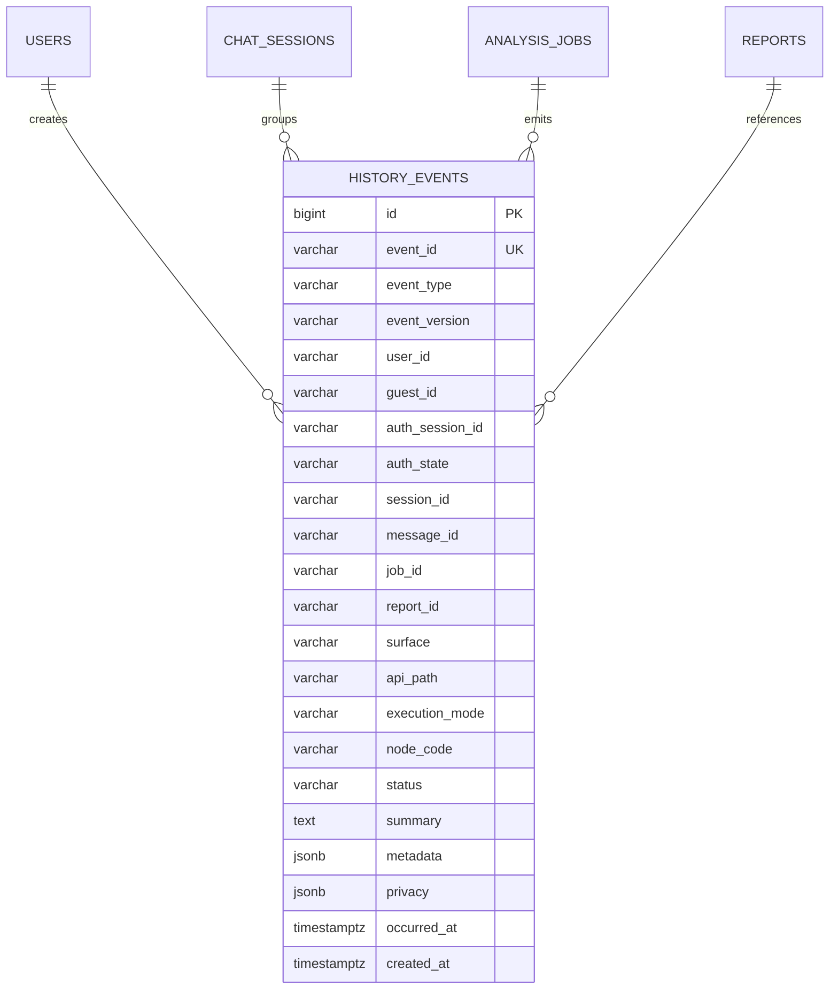
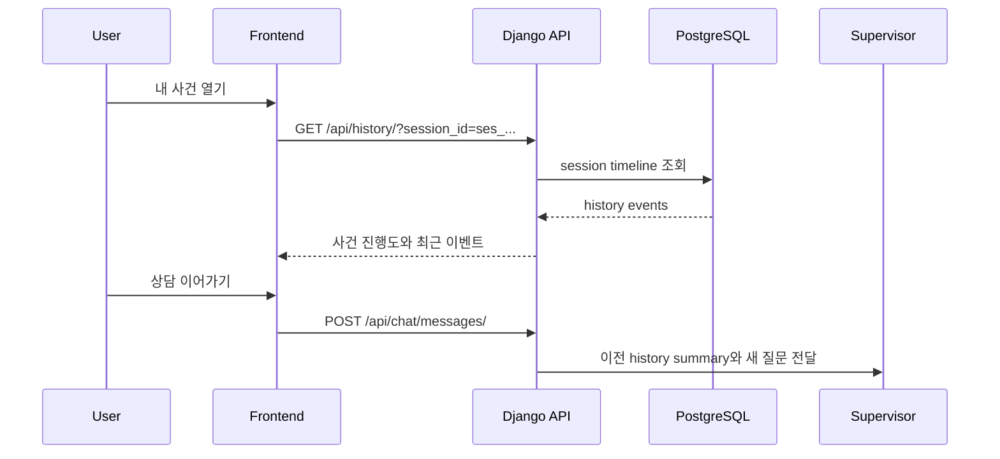

# 히스토리 이벤트 저장 설계 및 mock 구현

| 항목 | 내용 |
|---|---|
| 작성일 | 2026-06-28 |
| 설계 브랜치 | `hi20260204-auth-session-policy` |
| mock 구현 브랜치 | `hi20260204-history-event-mock` |
| 상태 | 표준-라이트 mock sidecar 구현, 보관 기간과 DB 전환은 사용자 컨펌 필요 |
| 선행 정책 | `docs/architecture/auth-session-policy-2026-06-28.md` |
| 목적 | 멘토 회의에서 강조된 히스토리 저장/수집을 향후 고도화, 디버깅, 애프터서비스에 쓸 수 있게 이벤트 단위로 설계 |

## 1. 결론

히스토리는 단순 채팅 로그가 아니라 "서비스 한 사이클에서 무슨 일이 일어났는지"를 재구성할 수 있는 이벤트 로그로 설계한다.

단, 사용자 원문, OCR 결과, Agent reasoning, RAG source 전문은 민감하거나 비용이 큰 데이터일 수 있으므로 기본 저장 대상에 바로 넣지 않는다. 저장 강도는 아래 3단계로 나눈다.

| 단계 | 의미 | 기본 입장 |
|---|---|---|
| 최소 | 화면 복구와 사건 상태 표시만 가능 | MVP 기본 |
| 표준-라이트 | 디버깅, Agent 실패 분석, 애프터서비스 가능. 단 원문과 reasoning 전문 제외 | MVP 구현 |
| 상세 | 모델 개선과 품질 분석까지 가능 | 별도 동의/마스킹/보관 기간 확정 후 |

## 2. 히스토리와 채팅 로그의 차이

| 구분 | 채팅 로그 | 히스토리 이벤트 |
|---|---|---|
| 목적 | 사용자가 본 대화 재현 | 서비스 처리 흐름, 상태, 실패 원인, Agent 호출 추적 |
| 단위 | 메시지 | 이벤트 |
| 예시 | "고지서 이의신청 가능해?" | `chat_message_created`, `analysis_job_started`, `agent_call_failed` |
| 민감도 | 사용자 원문 때문에 높음 | 이벤트 타입만 저장하면 낮게 유지 가능 |
| 사용처 | 대화 이력 화면 | 내 사건 진행도, 장애 분석, 애프터서비스, 모델 고도화 |

## 3. 이벤트 공통 envelope

모든 이벤트는 아래 구조를 기본으로 둔다.

```json
{
  "event_id": "evt_01H...",
  "event_type": "analysis_job_started",
  "event_version": "history_event.v1",
  "occurred_at": "2026-06-28T12:34:56+09:00",
  "actor": {
    "user_id": "usr_123",
    "guest_id": "gst_456",
    "auth_session_id": "auth_789",
    "auth_state": "authenticated"
  },
  "subject": {
    "session_id": "ses_abc",
    "message_id": "msg_def",
    "job_id": "job_ghi",
    "report_id": null
  },
  "source": {
    "surface": "web",
    "api_path": "/api/analysis/jobs/",
    "execution_mode": "mock",
    "node_code": null
  },
  "status": "success",
  "summary": "분석 job이 생성되었습니다.",
  "metadata": {},
  "privacy": {
    "risk_level": "low",
    "contains_user_text": false,
    "contains_file_uri": false,
    "contains_model_output": false,
    "retention_policy": "review_required"
  }
}
```

## 4. 필드 설명

| 필드 | 필수성 | 설명 |
|---|---|---|
| `event_id` | 필수 | 이벤트 고유 ID |
| `event_type` | 필수 | 이벤트 종류 |
| `event_version` | 필수 | schema 변경 추적 |
| `occurred_at` | 필수 | 이벤트 발생 시각 |
| `actor.user_id` | 조건부 | 로그인 사용자 |
| `actor.guest_id` | 조건부 | 비회원 또는 로그인 전 사용자 |
| `actor.auth_session_id` | 선택 | 로그인 유지/토큰 세션 |
| `actor.auth_state` | 필수 | `anonymous`, `guest`, `authenticated` |
| `subject.session_id` | 조건부 | 채팅/사건 흐름 |
| `subject.message_id` | 선택 | 메시지 이벤트 연결 |
| `subject.job_id` | 선택 | 분석 job 연결 |
| `subject.report_id` | 선택 | 리포트 연결 |
| `source.surface` | 필수 | web, api, worker, agent |
| `source.api_path` | 선택 | API 요청 경로 |
| `source.execution_mode` | 선택 | mock, sync, async_worker |
| `source.node_code` | 선택 | Agent/Supervisor node |
| `status` | 필수 | success, partial, failed, blocked 등 |
| `summary` | 필수 | 사람이 볼 수 있는 짧은 설명 |
| `metadata` | 선택 | 이벤트별 구조화 부가정보 |
| `privacy` | 필수 | 저장 민감도와 보관 정책 판단 |

## 5. 이벤트 타입 후보

### 5.1 Auth/Session

| event_type | 저장 이유 | 민감도 |
|---|---|---|
| `guest_session_created` | 비회원 상담 시작과 rate limit 기준 확인 | low |
| `auth_me_checked` | 현재 인증 상태 확인, 디버깅 | low |
| `login_succeeded` | 로그인 흐름 감사 | medium |
| `login_failed` | 보안/UX 분석 | medium |
| `auth_session_expired` | 토큰 만료 UX와 재로그인 분석 | low |
| `guest_merge_requested` | 비회원 이력 병합 전 사용자 의사 추적 | medium |
| `guest_merge_confirmed` | 계정 귀속 근거 | medium |
| `guest_merge_rejected` | 자동 병합 방지 근거 | low |

### 5.2 Chat/File

| event_type | 저장 이유 | 민감도 |
|---|---|---|
| `chat_session_created` | 내 사건 목록과 상담 흐름 시작 | low |
| `chat_message_created` | 메시지 흐름 추적 | medium 이상 |
| `attachment_registered` | 파일과 Agent handoff 연결 | medium |
| `attachment_rejected` | 파일 형식/크기/보안 이슈 확인 | medium |
| `attachment_resolution_failed` | 첨부 ID 누락/미해결 디버깅 | low |

### 5.3 Analysis/Agent

| event_type | 저장 이유 | 민감도 |
|---|---|---|
| `analysis_job_created` | 진행도와 내 사건 상태 시작 | low |
| `analysis_job_started` | worker/queue 연결 추적 | low |
| `analysis_job_progressed` | 현재 진행도 표시 | low |
| `analysis_job_completed` | 결과 조회 가능 상태 | low |
| `analysis_job_failed` | 실패 원인 분석 | medium |
| `agent_call_started` | Agent 호출 디버깅 | low |
| `agent_call_completed` | Agent 결과 도착 확인 | low |
| `agent_call_partial` | 추가 입력/근거 부족 분석 | medium |
| `agent_call_failed` | retry/timeout/adapter 오류 확인 | medium |
| `supervisor_merge_completed` | 화면 표시 DTO 생성 확인 | low |
| `agent_result_validation_failed` | schema guardrail 검증 | medium |

### 5.4 Report/After-service

| event_type | 저장 이유 | 민감도 |
|---|---|---|
| `report_saved` | 내 사건/저장 리포트 목록 | medium |
| `report_downloaded` | 사용자 액션 추적 | medium |
| `report_generation_failed` | 생성 실패 디버깅 | medium |
| `case_status_changed` | 내 사건 진행도 | low |
| `follow_up_question_created` | 애프터서비스 재상담 | medium |

## 6. 저장소 후보

### 6.1 MVP

MVP에서는 migration을 늘리지 않고 기존 JSON/모델을 활용한다.

| 저장 위치 | 용도 |
|---|---|
| `backend/media/mock_history_events` sidecar JSON | `history_event.v1` 표준-라이트 이벤트 저장 |
| `analysis_jobs.history` mock sidecar | 현재 mock job 진행도 |
| `analysis_job_events` | job 진행 이벤트 |
| `ChatSession.metadata.history_summary` 후보 | session 단위 요약 |
| `AgentResult.raw_output` | Agent adapter 원본 보관 후보, 상세 저장은 주의 |

현재 구현은 DB migration 없이 `MOCK_HISTORY_EVENT_ROOT` 환경변수로 저장 위치를 바꿀 수 있는 sidecar JSON을 사용한다. `GET /api/history/?session_id=...`와 `/api/mock/history/`에서 조회할 수 있다.

### 6.2 운영 전환 후보

운영 전환 시에는 범용 event table을 둔다.



인덱스 후보는 아래와 같다.

| 인덱스 | 목적 |
|---|---|
| `(session_id, occurred_at)` | 사건별 타임라인 |
| `(user_id, occurred_at)` | 회원 활동 이력 |
| `(guest_id, occurred_at)` | 비회원 rate limit/이력 |
| `(job_id, occurred_at)` | 분석 job 디버깅 |
| `(event_type, occurred_at)` | 운영 지표 |
| `(node_code, status)` | Agent 실패/부분성공 분석 |

## 7. 민감도 정책

| risk_level | 저장 가능 예 | 주의 |
|---|---|---|
| `low` | 상태 변경, node_code, status, timestamp | 기본 저장 가능 |
| `medium` | 파일 metadata, 실패 사유, 리포트 액션 | 보관 기간과 조회 권한 필요 |
| `high` | 사용자 원문, OCR 원문, 번호판/얼굴 포함 파일 URI | 기본 저장 금지 또는 마스킹/동의 필요 |
| `restricted` | Agent reasoning 전문, 법률 판단 초안 내부 추론 | 저장 금지 권장 |

Agent reasoning은 디버깅에 유용하지만, 사용자 개인정보와 모델 내부 추론이 섞일 수 있다. 기본 정책은 reasoning 전문을 저장하지 않고, 필요한 경우 `summary`, `error_code`, `missing_fields`, `evidence_refs`만 저장한다.

## 8. 애프터서비스 흐름

히스토리는 사용자가 나중에 다시 들어왔을 때 아래 흐름을 가능하게 해야 한다.



이때 Supervisor에 넘기는 것은 전체 원문 로그가 아니라 `history_summary`, `last_agent_results`, `pending_questions`, `limitations` 같은 요약이어야 한다.

## 9. 다음 컨펌 질문

아래 항목은 구현 전에 직접 선택해야 한다.

| 질문 | 선택지 | 추천 후보 |
|---|---|---|
| 기본 히스토리 단계 | 최소, 표준-라이트, 상세 | 표준-라이트로 mock 구현 |
| 사용자 원문 저장 | 저장 안 함, 제한 저장, 전체 저장 | 현재 저장 안 함 |
| OCR 원문 저장 | 저장 안 함, 마스킹 후 저장, 전체 저장 | 현재 저장 안 함 |
| Agent reasoning 저장 | 저장 안 함, 실패 시 요약만, 전체 저장 | 현재 전문 저장 안 함 |
| 비회원 히스토리 TTL | 1일, 7일, 30일 | 7일 후보 |
| 회원 히스토리 보관 | 3개월, 6개월, 직접 삭제 전까지 | 3개월 후보 |
| 이벤트 table 즉시 추가 | 지금 추가, MVP는 metadata로 보류 | MVP는 보류 |

## 10. 구현 순서 제안

1. 현재 mock API에 `history_event.v1` 생성 helper를 만든다. 구현됨.
2. `guest_session_created`, `auth_me_checked`, `chat_message_created`, `analysis_job_created`, `agent_call_completed/partial/failed`, `report_saved/downloaded` 이벤트를 남긴다. 구현됨.
3. `/api/history/` 조회 mock endpoint를 만든다. 구현됨.
4. 사용자 컨펌 후 TTL, 조회 권한, `history_events` table migration을 별도 브랜치에서 진행한다.
