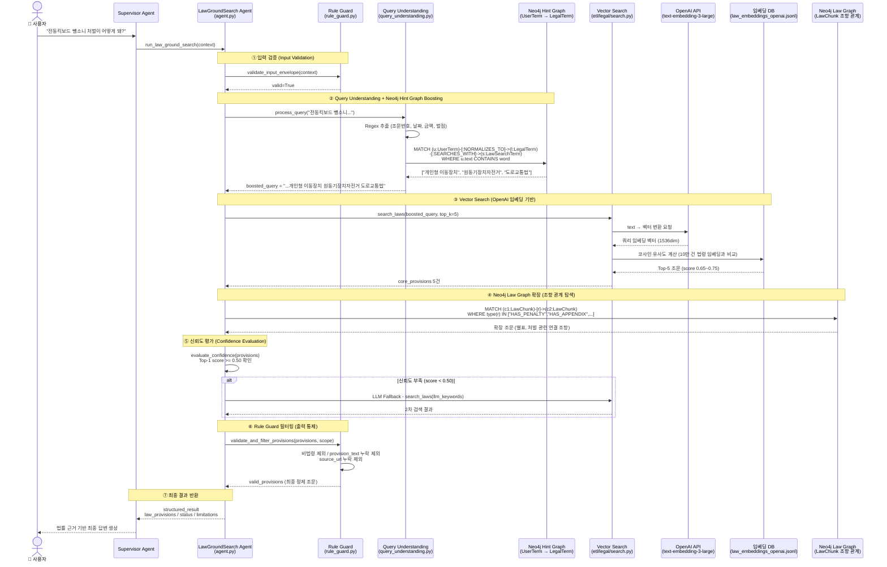
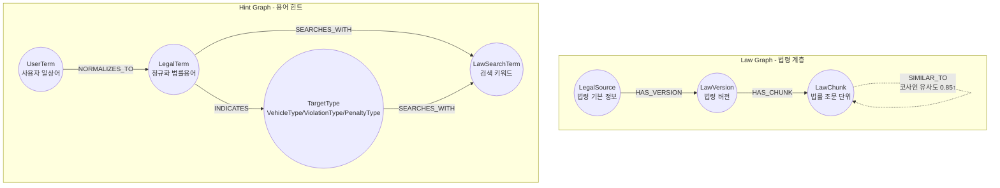

# 법률 에이전트(LawGroundSearch Agent) 아키텍처 요약

본 문서는 현재 구현된 코드를 바탕으로 법률 에이전트의 시퀀스 다이어그램, Neo4j 그래프 데이터베이스 구성, PostgreSQL(pgvector) 테이블 스키마를 모두 통합하여 정리한 문서입니다.

## 1. 시퀀스 다이어그램 (Sequence Diagram)

에이전트의 전체 동작 흐름을 보여주는 시퀀스 다이어그램입니다. 사용자 질의가 입력되면, 입력 검증, Neo4j를 통한 쿼리 부스팅, 벡터 DB 검색, Neo4j Law Graph를 통한 연관 조문 탐색, 그리고 최종 신뢰도 평가를 거쳐 답변을 생성합니다.

---

## 2. Neo4j 그래프 데이터베이스 구성

`etl/legal/export_neo4j.py`의 구현에 따른 법률 데이터 및 용어 사전(Hint Graph)의 노드와 관계 스키마입니다.

### 2.1 그래프 모델 (Graph Model)

### 2.2 주요 노드(Nodes)
| 라벨(Label) | 설명 | 주요 속성(Properties) |
|---|---|---|
| `LegalSource` | 법령/출처 기본 정보 | `source_id` (Unique) |
| `LawVersion` | 법령의 특정 버전 정보 | `source_version_id` (Unique) |
| `LawChunk` | 세분화된 법률 조문 단위 | `chunk_id` (Unique) |
| `UserTerm` | 사용자가 입력하는 일상어/약어 | `text` (Unique) |
| `LegalTerm` | 정규화된 법률 공식 용어 | `text` (Unique), `code`, `term_type` |
| `LawSearchTerm` | 검색 부스팅에 사용되는 키워드 | `text` (Unique) |
| `VehicleType` | 차량 종류 타겟 라벨 | `code` (Unique), `name`, `term_type` |
| `ViolationType` | 위반 유형 타겟 라벨 | `code` (Unique), `name`, `term_type` |
| `PenaltyType` | 처벌 유형 타겟 라벨 | `code` (Unique), `name`, `term_type` |

### 2.3 Neo4j 도입 목적 및 활용 시나리오

1. **법령의 계층 및 연관 관계 탐색 (Law Graph)**
   - **컨텍스트 확장**: 벡터 검색을 통해 찾아낸 단일 법률 조문만으로는 구체적인 처벌 규정이나 예외 조항(별표, 시행령 등)을 파악하기 어려운 경우가 많습니다. Neo4j는 조문 간의 참조, 위임, 처벌 관계(`RELATED_TO`)를 그래프로 미리 엮어두어, 검색된 조항과 연관된 필수 조항을 즉시 확장하여 LLM에게 제공할 수 있습니다.
   - **유사 조문 클러스터링**: 임베딩 코사인 유사도가 0.85 이상인 조문들을 `SIMILAR_TO` 관계로 묶어두어, 내용이 비슷한 타 법령이나 과거 조항을 쉽게 비교 및 추적할 수 있습니다.

2. **일상어를 법률 용어로 매핑 (Hint Graph)**
   - **어휘 불일치(Vocabulary Mismatch) 해결**: 사용자가 "전동킥보드 뺑소니"라는 일상어를 입력했을 때, 실제 법령 텍스트에는 해당 단어가 존재하지 않아 단순 벡터 검색으로는 관련 조항을 찾지 못할 수 있습니다.
   - **정규화 및 쿼리 부스팅(Query Boosting)**: Hint Graph는 사용자 질의어(`UserTerm`)를 "개인형 이동장치", "도주치상"과 같은 공식 법률 용어(`LegalTerm`)로 자동 매핑(정규화)해 줍니다. 그리고 이에 대응되는 최적의 검색 키워드(`LawSearchTerm`)를 추출하여 벡터 검색 시 부스팅을 적용함으로써, 법률 도메인 특유의 어휘 장벽을 낮추고 검색 정확도를 획기적으로 높입니다.

---

## 3. PostgreSQL (pgvector) 테이블 스키마

`etl/legal/export_sql.py`의 구현에 따른 벡터 DB(RDBMS) 스키마입니다. 법령 텍스트와 벡터 임베딩을 저장하여 하이브리드 검색을 지원합니다.

### 3.1 `law_chunks` 테이블 (조문 메타데이터 및 텍스트)

개별 법률 조문의 텍스트 및 메타데이터를 저장하는 핵심 테이블입니다. 검색을 위한 정규화 텍스트와 필터링 속성 등을 포함합니다.

| 컬럼명 | 데이터 타입 | 설명 |
|---|---|---|
| `chunk_id` | `VARCHAR(255)` | **[PK]** 조문을 식별하는 고유 ID |
| `source_id` | `VARCHAR(100)` | 법령 출처 고유 ID (예: 국가법령센터 ID) |
| `source_name` | `VARCHAR(255)` | 법령의 이름 (예: 도로교통법) |
| `source_type` | `VARCHAR(50)` | 출처의 유형 (법률, 시행령, 시행규칙 등) |
| `chunk_type` | `VARCHAR(50)` | 조문의 구조적 유형 (조, 항, 호, 목 등) |
| `article_no` | `VARCHAR(50)` | 조 번호 (해당되는 경우) |
| `appendix_no` | `VARCHAR(50)` | 별표 번호 (해당되는 경우) |
| `form_no` | `VARCHAR(50)` | 서식 번호 (해당되는 경우) |
| `provision_text` | `TEXT` | 사용자에게 제공될 조문 원문 텍스트 |
| `normalized_text` | `TEXT` | 검색 정확도를 높이기 위해 정규화/전처리된 텍스트 |
| `source_url` | `TEXT` | 국가법령센터 등 원본 링크 URL |
| `enforce_date` | `DATE` | 해당 조문의 시행 시작일 |
| `expire_date` | `DATE` | 해당 조문의 효력 만료일 (폐지된 경우) |
| `is_searchable` | `BOOLEAN` | 기본 검색 노출 여부 제어 플래그 (Default: `TRUE`) |
| `domain_tags` | `TEXT[]` | 다중 도메인 검색 필터링을 위한 배열 구조 (GIN 인덱스 적용됨) |
| `created_at` | `TIMESTAMP` | 레코드 생성 일시 |

### 3.2 `law_embeddings` 테이블 (임베딩 벡터)

`pgvector` 확장을 활용하여 `law_chunks`의 벡터 임베딩 값을 저장하는 테이블입니다. 코사인 유사도 연산을 가속하기 위한 HNSW 인덱스가 걸려있습니다.

| 컬럼명 | 데이터 타입 | 설명 |
|---|---|---|
| `chunk_id` | `VARCHAR(255)` | **[PK/FK]** `law_chunks`를 참조하는 식별자 (ON DELETE CASCADE) |
| `embedding_vector` | `vector(DIM)` | 텍스트 임베딩 모델(예: 1536차원)이 추출한 벡터 배열 |
| `embedding_provider` | `VARCHAR(50)` | 임베딩 생성 모델 정보 (예: `text-embedding-3-large`) |

> **인덱스 전략 (Indexes)**:
> - `law_chunks.domain_tags` 컬럼에 배열 검색 성능 향상을 위해 **GIN 인덱스** 생성.
> - `law_chunks` 테이블의 시계열 검색을 위해 `(enforce_date, expire_date)` 인덱스 생성.
> - `law_embeddings.embedding_vector` 컬럼에 코사인 유사도(`vector_cosine_ops`) 기반의 **HNSW 알고리즘 인덱스** 적용.
