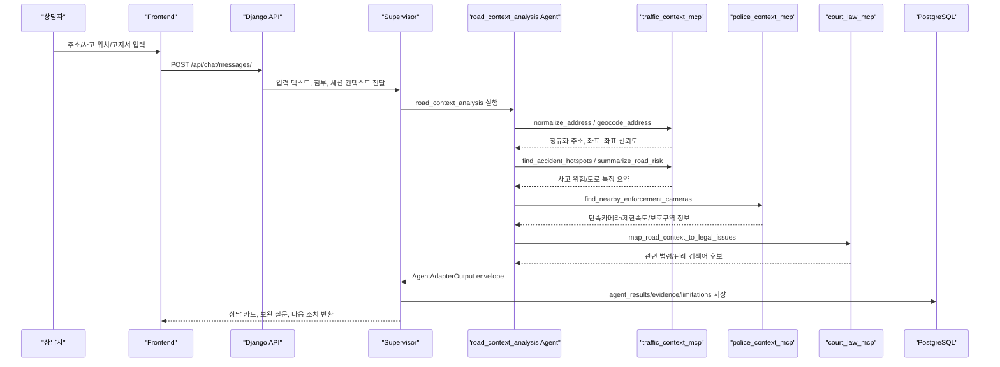

# Road/Traffic Context MCP 도입 제안서 - 2026-07-02

## 1. 목적

상담자가 사고 위치나 고지서에 적힌 주소를 입력했을 때, 해당 도로의 구조적 특징과 공개 가능한 교통 위험 맥락을 조회해 상담 품질을 높이기 위한 MCP 서버 도입을 제안한다.

현재 프로젝트는 고지서 분석, 사고 설명 기반 사례 검색, 법률 근거 검색, 이의신청서 생성 흐름을 Agent 단위로 분리하고 있다. 여기에 주소 기반 도로 컨텍스트가 추가되면 다음 질문에 더 구체적으로 답할 수 있다.

- 해당 위치가 어린이보호구역, 제한속도 30km/h 구간, 단속카메라 인접 구간인지
- 과속, 신호위반, 불법주정차, 버스전용차로 위반 등 어떤 단속 유형이 문제 될 수 있는지
- 사고 지점 주변에 사고다발지역 또는 보행자/자전거/어린이 사고 위험 맥락이 있는지
- 사용자가 주장하는 사고 경위가 도로 환경과 모순되거나 보완 증거가 필요한지
- 이의신청서나 상담 리포트에서 어떤 객관 자료를 근거로 제시할 수 있는지

이 제안의 핵심은 개인의 실제 범칙금/과태료 납부 이력 조회가 아니다. 개인정보나 차량번호 기반 행정처분 내역은 공개 API로 조회할 수 없고, 상담 서비스가 직접 조회 대상으로 삼는 것도 부적절하다. 본 기능은 공개 데이터와 공공 API를 통해 도로 환경, 단속 장비, 사고 위험 지표, 법령/판례 근거 후보를 조회하는 보조 근거 시스템이다.

## 2. 왜 MCP로 분리해야 하는가

외부 공공 API는 인증키, 응답 포맷, 호출 제한, 데이터 갱신 주기, 제공 범위가 자주 달라진다. 이를 개별 Agent 내부에 직접 구현하면 Agent가 외부 API 상세와 강하게 결합되고, 이후 API 교체나 mock 테스트가 어려워진다.

MCP로 분리하면 다음 장점이 있다.

| 구분 | MCP 적용 효과 |
|---|---|
| API 변경 대응 | VWorld, 공공데이터포털, TAAS, 법령/판례 API 변경을 MCP 서버 내부에서 흡수 |
| Agent 단순화 | Agent는 `summarize_road_risk` 같은 도메인 tool만 호출하고 외부 API 세부 파라미터를 몰라도 됨 |
| 테스트 용이성 | API key 없이 mock MCP 응답으로 Agent contract 테스트 가능 |
| 보안 | API key를 MCP 서버 환경변수에 격리하고 프론트엔드/LLM 응답에 노출하지 않음 |
| 근거 추적 | MCP tool 결과에 source, retrieved_at, data_revision, limitation을 표준화해 evidence로 저장 |
| 확장성 | 경찰 API, 대법원/판례 API, 도로 정보 API를 같은 방식으로 추가 가능 |

## 3. 제안 아키텍처



## 4. 신규 Agent: `road_context_analysis`

### 4.1 역할

`road_context_analysis`는 사용자 입력에서 사고 위치를 식별하고, MCP tool을 통해 도로/단속/사고 위험 정보를 수집한 뒤 기존 Agent들이 사용할 수 있는 표준 결과를 만든다.

### 4.2 Agent registry 제안

```json
{
  "order": 35,
  "node_name": "도로 환경·교통 위험 분석 노드",
  "node_code": "road_context_analysis",
  "node_type": "agent",
  "owner": "hi20260204-maker",
  "description": "주소 또는 사고 위치를 기반으로 도로 특징, 단속 장비, 보호구역, 사고다발 위험 맥락을 조회해 상담 근거를 만든다.",
  "required_inputs": ["address|accident_location_text|coordinates"],
  "produces": [
    "normalized_location",
    "road_profile",
    "enforcement_context",
    "accident_hotspot_context",
    "road_risk_summary",
    "counseling_points"
  ],
  "handoff_to": [
    "text_ml_case_search",
    "law_ground_search",
    "objection_report_generation",
    "agent_result_validation"
  ],
  "status": "mock_contract_ready"
}
```

### 4.3 Agent 출력 예시

```json
{
  "node_name": "도로 환경·교통 위험 분석 노드",
  "node_code": "road_context_analysis",
  "node_type": "agent",
  "owner": "hi20260204-maker",
  "status": "success",
  "summary": "입력 주소 주변에 제한속도 30km/h 단속 장비와 보호구역 후보가 확인되었습니다.",
  "structured_result": {
    "normalized_location": {
      "input_text": "서울특별시 강남구 봉은사로 524",
      "normalized_address": "서울특별시 강남구 봉은사로 524",
      "lat": 37.0,
      "lng": 127.0,
      "coordinate_system": "EPSG:4326",
      "confidence": 0.91
    },
    "road_profile": {
      "road_name": "봉은사로",
      "road_type": "시도",
      "road_features": ["교차로 인접", "도심 간선도로"],
      "speed_limits": [30, 50],
      "protection_zones": ["어린이보호구역 후보"]
    },
    "enforcement_context": [
      {
        "source_type": "public_enforcement_camera",
        "distance_m": 180,
        "enforcement_type": "speed_or_signal",
        "speed_limit": 30,
        "protection_zone": "어린이보호구역",
        "source_name": "전국무인교통단속카메라표준데이터"
      }
    ],
    "accident_hotspot_context": [],
    "road_risk_summary": {
      "risk_level": "medium",
      "risk_reasons": [
        "제한속도 30km/h 단속 장비 인접",
        "보호구역 후보",
        "교차로 또는 횡단보도 인접 가능성"
      ],
      "confidence": 0.72
    },
    "counseling_points": [
      "과속 여부를 단정하지 말고 고지서의 위반 시각, 제한속도, 촬영 장비 위치를 함께 확인해야 한다.",
      "보호구역 여부가 사실이면 과태료/범칙금 가중 가능성과 표지판 시인성 주장을 분리해 검토한다."
    ]
  },
  "evidence": [
    {
      "source_type": "geocoder",
      "title": "VWorld 주소 좌표 변환",
      "source_reference": "https://www.vworld.kr/dev/v4dv_geocoderguide2_s001.do",
      "metadata": {
        "provider": "VWorld",
        "crs": "EPSG:4326",
        "retrieved_at": "2026-07-02T00:00:00+09:00"
      },
      "confidence": 0.91
    },
    {
      "source_type": "public_data",
      "title": "전국무인교통단속카메라표준데이터",
      "source_reference": "https://www.data.go.kr/data/15028200/standard.do",
      "metadata": {
        "provider": "경찰청/지방자치단체",
        "revision_note": "공공데이터포털 기준 갱신주기 반기",
        "retrieved_at": "2026-07-02T00:00:00+09:00"
      },
      "confidence": 0.78
    }
  ],
  "next_actions": [
    "고지서 원문 제한속도/위반시각과 도로 컨텍스트 대조",
    "표지판·신호등·단속카메라 위치가 보이는 현장 사진 요청",
    "law_ground_search에 보호구역/속도위반 법령 쿼리 전달"
  ],
  "limitations": [
    "공개 데이터 기반 위험 맥락이며 개인별 범칙금 또는 과태료 납부 이력은 조회하지 않는다.",
    "좌표 변환 결과와 단속카메라 위치 데이터는 제공기관 갱신 시점에 따라 실제 현장과 차이가 있을 수 있다.",
    "VWorld 지오코딩 결과는 서비스 약관에 따라 실시간 조회 중심으로 사용하고 영구 저장을 제한한다."
  ]
}
```

## 5. MCP 서버 구성

### 5.1 `traffic_context_mcp`

도로/주소/사고위험 정보를 담당하는 MCP 서버다.

#### Tool 목록

| Tool | 입력 | 출력 | 용도 |
|---|---|---|---|
| `normalize_address` | `address` | 정규화 주소, 주소 후보 목록 | 사용자가 입력한 불완전 주소 보정 |
| `geocode_address` | `address`, `address_type` | 위도/경도, 좌표계, 신뢰도 | 주소를 좌표로 변환 |
| `reverse_geocode` | `lat`, `lng` | 도로명주소/지번주소 후보 | 좌표 기반 사건 위치 보정 |
| `find_accident_hotspots` | `lat`, `lng`, `radius_m`, `accident_type` | 사고다발지역 후보 | 주변 사고 위험 맥락 조회 |
| `summarize_road_risk` | `address` 또는 `lat/lng`, `accident_context` | 도로 위험 요약 | 상담용 통합 요약 |

#### 사용 API 후보

| API/데이터 | 제공자 | 사용 목적 | 비고 |
|---|---|---|---|
| VWorld Geocoder API | VWorld 디지털트윈국토 | 주소 -> 좌표 변환, 좌표계 EPSG:4326 응답 | 공식 문서상 주소 좌표 변환 지원, 일일 요청 제한과 저장 제한 확인 필요 |
| 주소정보누리집 도로명주소 API | 행정안전부/주소정보 | 주소 검색, 도로명주소 정규화 | VWorld 호출 전 주소 후보 정제에 사용 |
| TAAS 교통사고분석시스템 | 도로교통공단 | 사고다발지역, 사고 유형별 위험 맥락 | API 접근 조건과 제공 범위 확인 후 적용 |

### 5.2 `police_context_mcp`

경찰청 및 지자체 교통단속 공개 데이터를 담당하는 MCP 서버다.

#### Tool 목록

| Tool | 입력 | 출력 | 용도 |
|---|---|---|---|
| `find_nearby_enforcement_cameras` | `lat`, `lng`, `radius_m` | 주변 단속카메라 목록 | 속도/신호/통행위반 위험 맥락 |
| `lookup_camera_by_road_name` | `road_name`, `sido`, `sigungu` | 도로명 기반 단속 장비 후보 | 주소 좌표가 불확실할 때 fallback |
| `classify_enforcement_risk` | `camera_records`, `road_context` | 위반 유형별 리스크 요약 | 상담 문장 생성용 |
| `map_violation_to_public_context` | `violation_text`, `location` | 위반 유형, 관련 공개 데이터 | 고지서 문구와 도로 환경 연결 |

#### 사용 API/데이터 후보

| API/데이터 | 제공자 | 사용 목적 | 공개 범위 |
|---|---|---|---|
| 전국무인교통단속카메라표준데이터 | 경찰청, 지방자치단체 | 단속카메라 위치, 단속구분, 제한속도, 보호구역구분 조회 | 고정식 무인교통단속카메라 공개 데이터 |
| 지방자치단체 개별 단속카메라 데이터 | 각 지자체 | 전국 표준데이터 갱신 지연 보완 | 지역별 갱신일 다름 |

공개 데이터의 제공 항목은 다음을 포함한다.

- 무인교통단속카메라 관리번호
- 시도명, 시군구명
- 도로종류, 도로노선번호, 도로노선명, 도로노선방향
- 소재지 도로명주소, 소재지 지번주소
- 위도, 경도
- 설치장소
- 단속구분
- 제한속도
- 단속구간위치구분, 과속단속구간길이
- 보호구역구분
- 설치연도
- 관리기관명, 관리기관전화번호
- 데이터기준일자

#### 명시적 제외 범위

다음 항목은 MCP 기능 범위에서 제외한다.

- 차량번호 기반 실제 과태료/범칙금 조회
- 개인의 납부 이력, 체납 여부, 처분번호 조회
- 비공개 수사/행정처분 데이터 조회
- 실시간 단속 여부 단정

### 5.3 `court_law_mcp`

기존 `law_ground_search` Agent를 보완하는 법령/판례 MCP 서버다. 기존 문서에서 언급된 "경찰 API, 대법원 API는 MCP 관점으로 정리" 요구를 이 서버와 `police_context_mcp`로 분리해 반영한다.

#### Tool 목록

| Tool | 입력 | 출력 | 용도 |
|---|---|---|---|
| `search_traffic_laws` | `query`, `law_name`, `violation_type` | 법령 조항 후보 | 도로교통법/시행령/시행규칙 검색 |
| `get_law_article_detail` | `law_id`, `article` | 조문 상세 | 이의신청 근거 인용 |
| `search_precedents` | `query`, `issue_tags` | 판례 후보 | 유사 쟁점 판례 검색 |
| `get_precedent_detail` | `case_id` | 판례 상세/요지 | 법률 근거 보강 |
| `map_road_context_to_legal_issues` | `road_context`, `violation_text` | 법령/판례 검색어 후보 | 도로 컨텍스트를 법률 쿼리로 변환 |

#### 사용 API/데이터 후보

| API/데이터 | 제공자 | 사용 목적 | 비고 |
|---|---|---|---|
| 국가법령정보센터 Open API | 법제처 | 도로교통법, 시행령, 시행규칙, 행정규칙 조회 | 프로젝트 `.env.example`에 `LAW_GO_KR_OC`가 이미 존재 |
| 국가법령정보센터 판례 검색 | 법제처 | 공개 판례 검색 후보 | 실제 제공 범위와 응답 포맷 확인 필요 |
| 대법원 종합법률정보/판례 데이터 | 대법원 | 판례 원문 또는 판례 요지 후보 | 공식 API/사용 승인 가능 범위 확인 필요 |
| 내부 법률 RAG | 프로젝트 PostgreSQL/pgvector | 수집済 법령/사례의 안정적 검색 | 외부 API 장애 시 fallback |

대법원 API는 MCP 관점에서 "직접 연결을 전제로 한 하드코딩"이 아니라 "판례 provider 중 하나"로 둔다. 공식 API 사용 승인이나 접근 방식이 확정되지 않아도 `court_law_mcp`의 tool contract는 유지하고, 초기에는 국가법령정보센터/내부 RAG를 provider로 사용한다. 이후 대법원 판례 API 접근이 확정되면 provider adapter만 추가한다.

## 6. 기존 Agent와의 연결

### 6.1 `text_ml_case_search`와 연결

도로 컨텍스트는 사고 유형 분류의 보조 입력으로 사용한다.

예시:

- 신호 없는 교차로 + 시야 제한 도로 -> 선진입, 일시정지, 서행 의무 쟁점 강화
- 어린이보호구역 + 횡단보도 인접 -> 보행자 보호의무, 제한속도 쟁점 강화
- 버스전용차로 단속 인접 -> 차로 위반 또는 진로변경 쟁점 후보 추가

### 6.2 `law_ground_search`와 연결

`road_context_analysis` 결과에서 법률 검색어를 생성한다.

예시:

```json
{
  "law_query_hints": [
    "도로교통법 어린이보호구역 제한속도",
    "도로교통법 신호위반 무인단속",
    "도로교통법 보행자 보호의무 횡단보도",
    "과태료 부과 표지판 시인성"
  ]
}
```

### 6.3 `objection_report_generation`과 연결

이의신청서/상담 리포트에는 단정 표현 대신 공개 데이터 기반의 확인 포인트를 넣는다.

예시 문장:

> 입력 주소 기준 반경 300m 내 제한속도 30km/h 단속 장비와 보호구역 후보가 확인됩니다. 다만 실제 위반 성립 여부는 고지서의 촬영 위치, 위반 시각, 현장 표지판, 차량 진행 방향을 함께 확인해야 합니다.

## 7. 데이터 저장 정책

외부 API 결과는 모두 같은 방식으로 저장하지 않는다. 출처별 약관과 개인정보 가능성을 분리한다.

| 데이터 | 저장 정책 | 이유 |
|---|---|---|
| 사용자 입력 주소 원문 | 기존 상담 데이터 정책에 따름 | 사용자 사건 컨텍스트 |
| VWorld 지오코딩 결과 좌표 | 원칙적으로 실시간 사용, 영구 저장 제한 검토 | VWorld 문서상 별도 저장 제한 문구 존재 |
| 단속카메라 공개 데이터 | 데이터기준일자와 함께 캐시 가능 | 공공데이터포털 공개 표준데이터 |
| 사고다발지역 요약 | source/retrieved_at 포함해 캐시 가능 여부 검토 | 제공기관 조건 확인 필요 |
| 법령 조문 | 내부 RAG/법령 DB 저장 가능 | 기존 법률 RAG 범위와 연계 |
| 판례 원문/요지 | 제공처 조건에 따라 저장 범위 결정 | 저작권/이용조건 확인 필요 |
| 개인 범칙금/과태료 내역 | 저장/조회하지 않음 | 개인정보 및 비공개 행정정보 |

## 8. 환경변수 제안

```dotenv
# Road / traffic context MCP
TRAFFIC_CONTEXT_MCP_ENABLED=0
TRAFFIC_CONTEXT_MCP_URL=http://traffic-context-mcp:8011
TRAFFIC_CONTEXT_MCP_TIMEOUT_SECONDS=8
TRAFFIC_CONTEXT_MCP_CACHE_TTL_SECONDS=86400

# VWorld
VWORLD_API_KEY=
VWORLD_GEOCODER_BASE_URL=https://api.vworld.kr/req/address
VWORLD_GEOCODER_CRS=EPSG:4326

# Juso / address normalization
JUSO_API_KEY=
JUSO_ADDRESS_SEARCH_BASE_URL=https://business.juso.go.kr/addrlink/addrLinkApi.do

# Public data
DATA_GO_KR_SERVICE_KEY=
TRAFFIC_CAMERA_DATASET_ID=15028200

# TAAS / Koroad
TAAS_API_KEY=
TAAS_BASE_URL=

# Police context MCP
POLICE_CONTEXT_MCP_ENABLED=0
POLICE_CONTEXT_MCP_URL=http://police-context-mcp:8012
POLICE_CONTEXT_MCP_TIMEOUT_SECONDS=8

# Court / law MCP
COURT_LAW_MCP_ENABLED=0
COURT_LAW_MCP_URL=http://court-law-mcp:8013
COURT_LAW_MCP_TIMEOUT_SECONDS=10
LAW_GO_KR_OC=
SCOURT_API_KEY=
SCOURT_BASE_URL=
```

`LAW_GO_KR_OC`는 이미 `.env.example`에 존재하므로, 법령 MCP는 기존 환경변수와 충돌하지 않게 확장한다.

## 9. 구현 단계

### Phase 1: 계약/Mock 우선

- `road_context_analysis` node registry 추가
- `AgentAdapterOutput` 예시 fixture 추가
- `traffic_context_mcp` mock 서버 추가
- API key 없이도 테스트 가능한 deterministic 응답 제공
- `test_agent_node_service.py`에 신규 node contract 테스트 추가

완료 기준:

- `GET /api/agents/nodes/`에 `road_context_analysis`가 노출된다.
- `POST /api/agents/nodes/run/`에서 mock envelope가 기존 validator를 통과한다.
- `road_context_analysis` 결과가 `evidence`, `limitations`, `next_actions`를 포함한다.

### Phase 2: 주소/단속카메라 실 데이터 연결

- VWorld Geocoder API 연동
- 주소정보누리집 주소 정규화 연동
- 공공데이터포털 무인교통단속카메라 데이터 연동 또는 로컬 캐시 loader 구현
- 반경 검색 및 거리 계산 구현

완료 기준:

- 주소 입력 시 좌표와 주변 단속카메라 후보를 반환한다.
- 단속카메라 결과에 데이터기준일자, 제공기관, 단속구분, 제한속도, 보호구역구분이 포함된다.
- API 장애 시 `status=partial`과 명확한 limitation을 반환한다.

### Phase 3: TAAS/사고위험 연결

- TAAS API 또는 사고다발지역 데이터 접근 방식 확정
- 보행자/어린이/자전거/야간 사고 등 위험 유형별 요약 추가
- 사고 유형과 도로 위험 컨텍스트의 상관 쟁점 정리

완료 기준:

- 사고 위치 주변 사고다발지역 또는 위험 유형 후보를 반환한다.
- 근거가 없을 때도 "사고다발 확인 불가"를 명확히 표시한다.

### Phase 4: 경찰/대법원 MCP 관점 통합

- `police_context_mcp`를 단속 공개데이터 provider로 분리
- `court_law_mcp`에서 국가법령정보센터/내부 RAG provider 우선 연결
- 대법원 판례 API 또는 판례 데이터 provider 접근 방식 확정 후 adapter 추가
- Supervisor가 도로 컨텍스트 기반 법률 쿼리를 `law_ground_search`에 전달

완료 기준:

- 도로 컨텍스트가 법률 검색어 후보로 변환된다.
- 법률/판례 결과는 source reference와 limitation을 포함한다.
- 대법원 provider가 미확정이어도 MCP contract는 유지되고 fallback provider가 동작한다.

## 10. PR 범위 제안

이번 설계 PR에 포함할 범위:

- Road/Traffic Context MCP 도입 필요성 문서화
- 사용 API 후보와 provider 전략 정리
- `road_context_analysis` Agent contract 초안 제시
- 경찰 API, 대법원/판례 API의 MCP provider 관점 정리
- 구현 단계, 보안/저장 정책, 제외 범위 명시

이번 설계 PR에서 제외할 범위:

- 서비스 코드 변경
- Agent registry 추가
- MCP 서버 구현
- `.env.example` 환경변수 추가
- VWorld/TAAS/공공데이터포털 실 API 호출
- 운영용 캐시/배치 적재
- 대법원 API 실 연동
- 프론트엔드 지도 UI
- 개인 범칙금/과태료 조회 기능

## 11. 상세 구현 설계

이 섹션은 설계 PR 승인 후 바로 구현 티켓으로 분리할 수 있도록 구현 단위를 정의한다. 현재 서비스 코드에는 반영하지 않고, 컨펌 이후 Phase 1부터 순차 적용한다.

### 11.1 구현 원칙

- MVP는 `traffic_context_mcp` 1개 서버로 시작한다.
- 경찰/대법원 기능은 초기부터 별도 서버로 쪼개지 않고 provider interface로 먼저 둔다.
- 외부 API key 없이도 deterministic mock 응답으로 Agent contract 테스트가 가능해야 한다.
- Agent output은 기존 `AgentAdapterOutput` envelope를 그대로 사용한다.
- 개인 범칙금/과태료 납부 이력 조회는 기능 범위에서 제외한다.
- 외부 API 장애나 provider 미확정 상태는 `status=partial`과 `limitations`로 표현한다.

### 11.2 1차 디렉터리 구조

```text
mcp_servers/
  traffic_context/
    __init__.py
    server.py
    tools.py
    schemas.py
    distance.py
    settings.py
    providers/
      __init__.py
      base.py
      mock.py
      vworld.py
      juso.py
      public_traffic_camera.py
      taas.py
      court_law.py
    fixtures/
      road_context_sample.json
      enforcement_cameras_sample.json
```

1차 구현에서는 `providers/mock.py`를 기본 provider로 사용한다. `vworld.py`, `juso.py`, `public_traffic_camera.py`, `taas.py`, `court_law.py`는 interface와 오류 계약을 먼저 만들고, 실제 API 호출은 승인 후 단계적으로 연결한다.

### 11.3 MCP server contract

초기 서버 이름은 `traffic_context_mcp`로 한다.

```python
from mcp.server.fastmcp import FastMCP

mcp = FastMCP("traffic_context_mcp")
```

제공 tool:

| Tool | Phase | 입력 | 출력 | 실패 시 동작 |
|---|---|---|---|---|
| `normalize_address` | 1 | `address: str` | 주소 후보, 정규화 주소 | 후보 없음 + limitation |
| `geocode_address` | 1 | `address: str` | lat/lng, crs, confidence | `status=partial` |
| `find_nearby_enforcement_cameras` | 1 | `lat`, `lng`, `radius_m` | 주변 단속카메라 목록 | 빈 목록 + source limitation |
| `summarize_road_context` | 1 | `address` 또는 `lat/lng`, `accident_context` | 통합 도로 위험 요약 | 가능한 provider 결과만 병합 |
| `find_accident_hotspots` | 2 | `lat`, `lng`, `radius_m`, `accident_type` | 사고다발지역 후보 | TAAS 미연결 limitation |
| `map_road_context_to_legal_issues` | 2 | `road_context`, `violation_text` | 법령/판례 검색어 후보 | 내부 rule fallback |

### 11.4 MCP response schema

모든 tool은 공통 wrapper를 사용한다.

```json
{
  "contract_version": "traffic_context_mcp.v1",
  "status": "success",
  "data": {},
  "evidence": [],
  "limitations": [],
  "retrieved_at": "2026-07-03T00:00:00+09:00",
  "provider_status": {
    "mock": "success",
    "vworld": "disabled",
    "public_traffic_camera": "disabled",
    "taas": "disabled"
  }
}
```

`status` 값:

- `success`: 핵심 provider 결과가 충분한 경우
- `partial`: 일부 provider 실패 또는 미연결이지만 상담 보조 결과를 만들 수 있는 경우
- `failed`: 주소/좌표 등 핵심 입력이 없어 결과를 만들 수 없는 경우

### 11.5 Provider interface

Provider는 외부 API별 구현 차이를 감춘다.

```python
class AddressProvider:
    def normalize_address(self, address: str) -> dict:
        ...

    def geocode_address(self, address: str) -> dict:
        ...


class EnforcementProvider:
    def find_nearby_cameras(self, lat: float, lng: float, radius_m: int) -> list[dict]:
        ...


class AccidentHotspotProvider:
    def find_hotspots(self, lat: float, lng: float, radius_m: int, accident_type: str | None) -> list[dict]:
        ...


class CourtLawProvider:
    def map_road_context_to_legal_issues(self, road_context: dict, violation_text: str | None) -> list[str]:
        ...
```

Provider별 책임:

| Provider | 1차 동작 | 실연동 시점 |
|---|---|---|
| `MockProvider` | fixture 기반 deterministic 응답 | Phase 1 |
| `VWorldProvider` | interface + disabled response | Phase 2 |
| `JusoProvider` | interface + disabled response | Phase 2 |
| `PublicTrafficCameraProvider` | fixture/CSV loader 우선 | Phase 2 |
| `TAASProvider` | disabled response | Phase 3 |
| `CourtLawProvider` | rule 기반 법률 쿼리 후보 | Phase 4 |

### 11.6 Django/Agent adapter 설계

서비스 코드 반영 시점에는 `road_context_analysis` Agent를 추가한다.

```text
app/services/agent_node_service.py
  - NODE_REGISTRY에 road_context_analysis 추가
  - _structured_result_for_node에 mock road context 결과 추가
  - _evidence_for_node에 public_data/geocoder evidence 추가
  - _next_actions_for_node에 현장사진/고지서 대조 action 추가
  - _limitations_for_node에 개인 범칙금 미조회 원칙 추가
```

실제 MCP 호출 adapter는 별도 파일로 둔다.

```text
app/services/road_context_mcp_client.py
```

책임:

- MCP 서버 URL/timeout 환경변수 읽기
- `summarize_road_context` 호출
- MCP wrapper를 `AgentAdapterOutput.structured_result`로 변환
- MCP evidence를 Agent evidence로 변환
- 장애 시 `status=partial` 반환

### 11.7 Supervisor routing 설계

Supervisor는 다음 조건에서 `road_context_analysis`를 plan에 포함한다.

| 조건 | 예시 |
|---|---|
| 주소 표현 포함 | "서울 강남구 봉은사로...", "OO사거리" |
| 사고 위치 표현 포함 | "교차로에서 사고", "스쿨존 근처" |
| 고지서 OCR 결과에 장소 포함 | 단속장소, 위반장소, 관할구역 |
| 사용자가 도로 특성 질문 | "여기 단속 많은 곳이야?", "이 도로 특징이 뭐야?" |

초기 rule:

```text
if user_text contains address-like pattern or location keyword:
    include road_context_analysis before text_ml_case_search/law_ground_search
```

### 11.8 테스트 설계

Phase 1 최소 테스트:

| 테스트 | 확인 내용 |
|---|---|
| `test_agent_node_registry_includes_road_context_analysis` | registry 노출 |
| `test_road_context_output_validates_contract` | Agent output envelope validator 통과 |
| `test_road_context_limitations_exclude_personal_fine_lookup` | 개인 범칙금 조회 제외 문구 포함 |
| `test_traffic_context_mcp_mock_summary` | mock 주소 입력 시 road context 반환 |
| `test_traffic_context_mcp_partial_when_provider_disabled` | provider disabled 시 partial/limitation 반환 |

Phase 2 테스트:

| 테스트 | 확인 내용 |
|---|---|
| `test_vworld_provider_maps_geocode_response` | VWorld 응답을 내부 schema로 변환 |
| `test_camera_distance_filtering` | 반경 내 단속카메라만 반환 |
| `test_camera_result_contains_data_reference` | 데이터기준일자/source 포함 |

### 11.9 구현 티켓 분리안

| 티켓 | 범위 | 완료 기준 |
|---|---|---|
| T1 | 상세 설계 문서 컨펌 | 본 문서 승인 |
| T2 | `road_context_analysis` mock Agent 추가 | node registry/test 통과 |
| T3 | `traffic_context_mcp` mock 서버 추가 | mock tool 호출 가능 |
| T4 | MCP client adapter 추가 | Agent가 MCP mock 결과를 envelope로 변환 |
| T5 | VWorld/Juso provider 추가 | 주소 좌표 변환 실연동 |
| T6 | 단속카메라 provider 추가 | 반경 검색/제한속도/보호구역 반환 |
| T7 | TAAS provider 추가 | 사고다발지역 후보 반환 |
| T8 | court/law provider 확장 | 법령/판례 검색어 후보 생성 |

### 11.10 컨펌 체크리스트

상급자 컨펌 전 확인할 항목:

- 1차 구현 범위를 mock Agent + mock MCP까지로 볼지
- VWorld/Juso/API key 발급 담당자와 보관 위치
- 단속카메라 데이터는 API 실시간 조회와 배치 캐시 중 무엇을 우선할지
- TAAS와 대법원 provider는 승인 전까지 disabled/fallback으로 두는 데 동의하는지
- 개인 범칙금/과태료 조회를 명시적으로 제외하는 데 동의하는지
- 도로 위험 결과를 법률 판단이 아닌 "상담 보조 근거"로만 표현하는 데 동의하는지

## 12. 위험과 대응

| 위험 | 설명 | 대응 |
|---|---|---|
| API 접근 제한 | TAAS, 대법원 판례 데이터는 승인/제공 범위가 제한될 수 있음 | provider adapter 구조로 fallback 유지 |
| 위치 오차 | 주소 좌표 변환 결과가 실제 사고 지점과 다를 수 있음 | confidence와 보완 질문 제공 |
| 데이터 갱신 지연 | 단속카메라/사고다발 데이터가 실제 현장보다 늦게 갱신될 수 있음 | 데이터기준일자와 retrieved_at 표시 |
| 개인정보 오해 | 사용자가 실제 범칙금 납부 이력을 조회한다고 오해할 수 있음 | 개인 처분 정보 미조회 원칙 명시 |
| 법률 단정 위험 | 도로 위험 컨텍스트만으로 위반 성립을 단정할 수 없음 | "확인 포인트"와 "근거 후보"로 표현 |
| API key 노출 | 외부 API key가 프론트엔드나 LLM 답변에 노출될 수 있음 | MCP 서버 환경변수 격리, evidence에는 provider만 기록 |

## 13. 상담 화면/응답에서의 표현 원칙

금지 표현:

- "이 도로에서는 실제로 과태료가 자주 부과됩니다."
- "사용자는 위반한 것이 맞습니다."
- "이 위치는 반드시 사고다발지역입니다."
- "범칙금 취소 가능성이 높습니다."

권장 표현:

- "공개 데이터 기준으로 입력 위치 주변에 제한속도 30km/h 단속 장비 후보가 확인됩니다."
- "보호구역 여부는 고지서 위치, 표지판 사진, 촬영 방향으로 추가 확인이 필요합니다."
- "해당 도로 맥락상 과속 여부보다 제한속도 고지와 표지판 시인성이 주요 검토 포인트가 될 수 있습니다."
- "사고다발지역 데이터는 제공기관 갱신 시점에 따라 실제 현장과 차이가 있을 수 있습니다."

## 14. 참고 링크

- VWorld Geocoder API: https://www.vworld.kr/dev/v4dv_geocoderguide2_s001.do
- 공공데이터포털 전국무인교통단속카메라표준데이터: https://www.data.go.kr/data/15028200/standard.do
- TAAS 교통사고분석시스템: https://taas.koroad.or.kr/
- 주소정보누리집 도로명주소 API: https://business.juso.go.kr/
- 국가법령정보센터: https://www.law.go.kr/

## 15. 결론

`road_context_analysis` Agent와 MCP 기반 외부 API 계층을 추가하면, 현재 프로젝트의 상담 흐름은 단순 고지서/문장 분석에서 "위치 기반 교통 맥락 분석"까지 확장된다.

이 기능은 기존 Agent 구조를 크게 바꾸지 않고도 추가할 수 있다. MCP가 외부 API 호출과 provider 차이를 흡수하고, Agent는 현재 `AgentAdapterOutput` envelope에 맞춰 결과를 반환하면 된다.

따라서 우선순위는 다음과 같다.

1. `road_context_analysis` Agent contract와 mock 결과 추가
2. `traffic_context_mcp` mock 서버 추가
3. VWorld 주소 좌표 변환 연결
4. 전국무인교통단속카메라표준데이터 연결
5. TAAS/사고다발지역 연결
6. `police_context_mcp`, `court_law_mcp`로 경찰/대법원 API 관점 확장

이 순서로 진행하면 발표/리뷰 단계에서는 설계 의도를 명확히 보여주고, 구현 단계에서는 API 접근 승인 여부와 무관하게 mock contract 기반으로 안정적으로 개발을 이어갈 수 있다.
