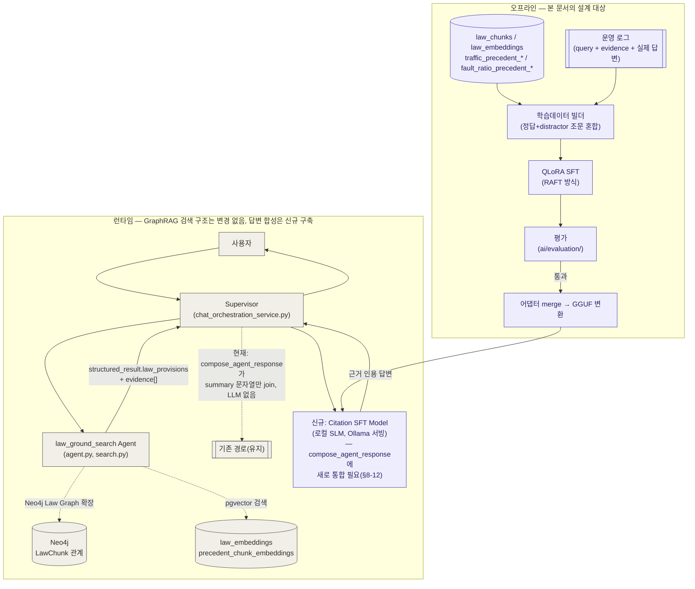

# SLM 파인튜닝 설계서
**법령·판례 근거 인용 충실도(Citation Faithfulness) SFT** · Design Document 1/1

| 항목 | 값 |
|------|-----|
| 문서 번호 | SFT-ARCH-001 |
| 버전 | v0.29 |
| 작성일 | 2026-07-13 (최초 작성), 2026-07-14 갱신(28회) |
| 근거 문서 | `docs/architecture/law_agent_architecture_summary.md`, `ai/agents/law_ground_search/`(agent.py, search.py, query_understanding.py, rule_guard.py), `storage/schemas/law_db_schema.sql`, `storage/schemas/precedent_db_schema.sql`, `storage/rag/legal_rag_smoke_chunks.jsonl`, `backend/chatbot/models.py`, `backend/chatbot/repositories.py`, `docs/architecture/history-event-design-2026-06-28.md`, `docs/architecture/history-operating-policy-2026-06-30.md`, SLM/파인튜닝 학습 논의 대화(2026-07-13) |
| 문서 번호 체계 | 본 문서는 `docs/architecture/appeal-judgment/`의 `ARCH-00x`/`DATA-00x`/`API-00x` 체계와 별개의 독립 번호 공간(`SFT-*`)을 사용한다 — 대상 Agent가 다르고 상호 참조 관계가 없다. |
| 변경 요약 | v0.1: 최초 작성. 목적을 "법 지식 암기"가 아니라 "검색된 근거를 다루는 행동 학습"으로 명시적으로 좁혔고, DPO는 범위 밖 옵션(§9)으로만 남겼다. v0.1 → v0.2: §8-1(운영 로그 존재 여부) 조사 완료 — 저장 인프라(`ChatMessage`/`AgentResult`/`RetrievalEvent`)는 존재함을 확인, 남은 미결은 실 데이터 볼륨·완결성·보관기간 편향 세 가지로 좁힘(§4-1a, §8-1 갱신). v0.2 → v0.3: `backend/chatbot/models.py` 직접 확인 — blocklist 정책은 별도 테이블 `HistoryEvent`에만 적용되고 `ChatMessage`/`AgentResult`/`RetrievalEvent`는 영향받지 않음을 확인(완결성 해소). 이 세 테이블에는 `retention_expires_at` 같은 만료 필드가 없어 보관기간 편향 우려도 낮아짐. 로컬 DB(`localhost`)는 세션 샌드박스에서 접근 불가라 실제 행 수 확인용 SQL/Django 쿼리를 §8-1에 추가 — 이것이 유일하게 남은 미결. v0.3 → v0.4: 팀 확인으로 "서비스 아직 실사용 전, 쌓인 로그 없음"이 확정됨 — §8-1을 "로그 없음 확정"으로 닫고, §4-2를 "합성 데이터가 fallback"에서 "합성 데이터가 1단계 유일 경로"로 재정의. 운영 개시 후 재검토 트리거를 §8-1b로 신설. v0.4 → v0.5: §4-4 신설 — `storage/rag/law_query_terms.yaml`의 27개 카테고리를 커버리지 매트릭스로 확정, 질의 생성 템플릿·gold/distractor 선정 규칙(score 구간, 그래프 감가 공식 재사용)·생성 규모(파일럿 350건, 1차 학습셋 1,500~2,000건, 80/10/10 층화 분할)·품질 검수 기준을 구체화. v0.5 → v0.6: §4-4 구현체 `etl/legal_sft/build_pilot_dataset.py` 작성 및 mock 모드 검증 완료(381건, train/val/test 전 구간 27/27 카테고리 커버리지 확인) — §10 파일 구조 갱신, real 모드는 law_chunks/embeddings 적재 후 검증 필요로 남김. v0.6 → v0.7: §8-4(임베딩 차원 불일치) 해소 — 실 데이터 확인 결과 OpenAI `dimensions` 파라미터로 1024차원 일관 생성 중임을 확인, 실제 불일치 아니었음. §8-6 신설 — 법령 수집·임베딩 파이프라인이 이미 완주(99,315 chunk, 45,110 관계, 2026-07-10)했고 산출물이 디스크에 존재함을 확인, Postgres/Neo4j "적재" 여부만 미확인으로 좁힘 — 재사용 가능한 로드 명령 제공. v0.7 → v0.8: 팀이 Postgres에서 직접 `search_laws()` 실행해 적재 완료 확인(§8-6 최종 해소) — 이 과정에서 `article_no=None`(별표 등)일 때 Distractor A 선정 로직이 오답을 건너뛰는 버그 발견, `chunk_id` 기준 판별로 수정하고 mock 모드 재검증 완료. v0.8 → v0.9: 팀이 `--source real`을 실제 환경에서 실행해 end-to-end 검증 완료 — 381건 생성, 27/27 카테고리 커버리지, 저신뢰도 94/381건. §4-4/§10 상태를 "구현 완료"에서 "구현·검증 완료"로 갱신, 다음 단계를 100% 사람 검수로 명시. v0.9 → v0.10: 100% 사람 검수를 시작하기 전 자동 스캔(카테고리별 gold source_name이 `search_terms`의 기대 법령명과 일치하는지 대조)으로 4개 카테고리(hit_and_run·bus_lane_violation·uninsured_driving·criminal_penalty, 54건)를 의심 대상으로 잡았으나, `is_gold`/`low_confidence` 플래그까지 반영한 정밀 재확인 결과 실제 오염은 hit_and_run·bus_lane_violation 두 카테고리(train 기준 22건)뿐이었음을 확인(uninsured_driving은 애초에 전부 저신뢰도, criminal_penalty의 gold 3건은 이미 정답이었음 — 1차 스캔의 과다 계상이었음). 실제 오염 사례는 "여객자동차 운수사업법 시행령" 별표5를 gold로 가리키고 있었다 — 근본 원인은 `search_laws()`의 top1 점수만으로 gold를 승격시키는 로직이, 큰 처벌표(별표5, 120개+ part 청크)가 다양한 위반/처벌 질의에 애매하게 높은 점수(0.58~0.60)로 걸리는 현상을 걸러내지 못한 것으로 확인(실측: hit_and_run 검색 쿼리의 top-8 전부가 이 표의 조각, 정답 법 34개 청크는 top-15 안에도 못 듦). `build_pilot_dataset.py`에 카테고리별 기대 법령명(search_terms 재사용) 검증 안전장치를 추가해 무관한 top1을 gold로 승격시키지 않도록 수정하고, 파일럿 전체(381건) 재생성 — 재검증 결과 27개 카테고리 전부 gold mismatch 0건 확인(저신뢰도 비율 94→123건으로 증가, 이게 정직한 결과). `storage/rag/sft_pilot/{train,val,test}.jsonl`을 수정본으로 교체, `test/unit/test_legal_sft_build_pilot_dataset.py` 회귀 테스트 10건 추가. 100% 사람 검수는 이 수정본 기준으로 진행. v0.10 → v0.11: 카테고리별 사람 검수(§4-4) 진행 중 27개 중 17개 카테고리에서 법령명 대조만으로는 못 잡는 추가 문제 발견(`03_파일럿_품질검수_발견사항.md`) — 조문 단위 오류 3개(seatbelt_violation이 안전모 조문을 잘못 인용, freight_vehicle이 2015년 폐지된 조문을 인용, bicycle이 본문 없는 청크를 인용), 표 조각(별표) gold 8개, gold 자체가 없는 카테고리 6개. 이 중 조문 단위 문제 3개 + 표 조각 중 내용까지 무관했던 bus·taxi 2개를 코퍼스에서 재탐색해 해결 시도: `build_pilot_dataset.py`에 `_has_valid_content`(폐지·공백·서식조각 제외) · `_is_trustworthy`(별표는 법령명·점수만으로 신뢰, 일반 조문은 카테고리 키워드가 본문에 실제로 있어야 신뢰) 두 안전장치를 추가. 결과: seatbelt_violation·freight_vehicle·bus는 신뢰할 만한 대체 조문을 코퍼스에서 못 찾아 정직하게 저신뢰도로 전환(확신 있는 오답보다 안전), bicycle·taxi는 더 나은(비어있지 않은/주제가 맞는) 조문을 찾아 gold로 승격. 전체 재생성 후 27개 카테고리 gold mismatch 0건 재확인, 저신뢰도 비율 123→180/381건으로 증가(정직화 결과 + `search_laws()` 결과의 실행 간 미세한 변동성 — §8 신규 미결 사항 참고). `test/unit/test_legal_sft_build_pilot_dataset.py`에 회귀 테스트 16건 추가(총 26개). 조문 단위 실측 사례로 발견된 별개 버그(일부 항만 삭제된 조문을 통째로 무효 처리하던 정규식 앵커링 실수)도 같은 커밋에서 수정. v0.11 → v0.12: 파일 저장 중 물리적으로 잘려 있던 §4-4 항목4 이후 내용을 실제 구현체(`etl/legal_sft/build_pilot_dataset.py`, `02_진행상황_및_다음단계.md`, `03_파일럿_품질검수_발견사항.md`, `test/unit/test_legal_sft_build_pilot_dataset.py`, `docs/issues/sft-pilot-gold-contamination-fix.md`)와 대조해 완성 — §4-4 항목4(output 생성 상세)·항목5(품질 검수 세 안전장치: 법령명 일치·조문 내용 유효성·조문 신뢰성) 신설, §5(학습 데이터 스키마·저신뢰도 한정 문구 처리) 신설, §6(QLoRA/RAFT 학습 설계, 미구현 상태 명시) 신설, §7(평가 설계 지표) 신설, §8 미결 사항을 §8-1/§8-1b(운영 로그 재확인·전환 트리거)부터 §8-10까지 종합(§8-4·§8-6은 해소 이력으로, §8-7~§8-9는 v0.6~v0.11 작업 중 실측 발견된 항목으로, §8-10은 `CONFIDENCE_THRESHOLD`(0.4) 상수가 실제로는 미사용이고 `low_confidence` 판정이 `GOLD_MIN_SCORE`(0.6)로만 이뤄지는 정합성 갭을 신규 미결로 기록), §9(DPO 범위 밖 재확인), §10(파일 구조 최신화) 신설. v0.12 → v0.13: §8-11 신설 — 배포 이후 SLM이 개별 요청 단위로 실패했을 때 대형 LLM API로 실시간 전환하는 런타임 폴백 메커니즘이 설계돼 있지 않음을 미결로 기록(§2의 EVAL 게이트는 배포 전 문턱일 뿐, 배포 후 개별 요청 폴백과는 다른 개념). 같은 논의에서 `law_ground_search`의 실제 LLM 의존 지점도 확인 — `search_laws()`는 OpenAI 임베딩 API(생성형 아님)에 의존하지만, 생성형 LLM 호출(`llm_extractor.extract_legal_keywords`/`format_api_response`, `ai/agents/law_ground_search/llm_extractor.py`)은 `agent.py`에 선택적 매개변수로만 존재하고 `app/services/agent_node_service.py:576`의 실제 프로덕션 호출(`run_law_ground_search(agent_input, adapter_context)`)은 이 인자를 넘기지 않아 현재는 미사용 상태임을 확인. v0.13 → v0.14: "Supervisor가 최종 답변 생성에 호출하는 대형 LLM"의 실제 위치를 추적한 결과 **그런 호출 자체가 없음**을 확인 — `app/services/chat_orchestration_service.py::compose_agent_response()`(Supervisor가 여러 Agent 결과를 합치는 유일한 지점)는 LLM 호출 없이 각 Agent의 하드코딩 템플릿 `summary` 문자열을 이어붙이기만 한다. §1 개요·§2 다이어그램의 "대형 LLM API를 SLM으로 교체" 전제를 "지금 없는 근거→답변 합성 기능을 SLM으로 신규 구축"으로 정정. §8-12 신설(런타임 통합 지점 부재, G4/§7 latency·비용 비교 기준 재검토 필요성, `compose_agent_response()` 통합 작업이 이 문서 범위 밖 신규 항목이라는 점 기록), §10에 통합 작업 행 추가. v0.14 → v0.15: §8-12에 항목 추가 — `compose_agent_response()`가 합치는 5개 Agent(`law_ground_search`/`text_ml_case_search`/`objection_report_generation`/`appeal_decision_flow`/`fine_notice_analysis`) 중 `appeal_decision_flow`는 `evidence`가 항상 빈 배열(`utils.py:17`)이고 `objection_report_generation`의 evidence 유사 구조는 필드명이 §5-1 학습 스키마와 다름을 코드로 확인 — SLM을 5개 Agent 전체에 무차별 적용할 수 없고 evidence 스키마가 맞는 Agent만 SLM으로 라우팅하는 Agent별 분기 설계가 별도로 필요함을 신규 미결로 기록. v0.15 → v0.16: §7-1 신설 — "비교군 불필요" 기각(폐기된 근거 표)은 SLM 절대 정답률 채점에만 해당하고, 순위 5번(행동 통제 강건성) 미검증 가설을 검증하려면 여전히 비교군이 유용하다는 점을 정리. gpt-4o-mini/GPT-4o 프롬프트 전용 프로토타입을 `test.jsonl`로 §7 4개 절대 지표 채점 → SLM과 비교하는 절차를 QLoRA(§6) 착수 전 게이트로 신설, 부가로 G4 latency/비용 실측치 확보 방안도 포함. v0.16 → v0.17: §7 평가 하네스 구현 완료 — `ai/evaluation/citation_metrics.py`(정밀도·재현율·포맷준수율·헤징정확도 채점), `latency_cost.py`(참고 가격표 기반 비용 추정 + latency 타이머), `run_eval.py`(CLI, `--self-check`/`--predictions` 두 모드). `--self-check`로 `storage/rag/sft_pilot/test.jsonl`(27건) 자가 검증 완료 — 전 지표 만점, gold가 없는(저신뢰도) 카테고리는 정밀도·재현율 N/A로 정확히 구분됨. 합성 예측(절반 오답)으로 `--predictions` 경로도 검증. 단위 테스트 23건 추가(`test_evaluation_citation_metrics.py`·`test_evaluation_latency_cost.py`, `build_output_text()`와의 저신뢰도 문구 교차 검증 포함), 저장소 전체 296 passed. §7-1이 제안한 프롬프트 전용 프로토타입(gpt-4o-mini/GPT-4o) 채점에도 그대로 재사용 가능 — 예측 결과만 `--predictions` 형식으로 준비하면 됨. v0.17 → v0.18: 5개 문서(01·02·03·04·05) 전체 일관성 검수 — §10 파일 구조 표에 누락된 `04_clean_ascii_table_구현계획.md`·`05_개발_의의_정리.md`·평가 하네스 테스트 파일 추가. §8-12 두 번째 불릿("평가 하네스 비교 기준 모호")이 §7-1 신설로 이미 해소됐는데 반영이 안 돼 있던 걸 정정. §7 서두 문장의 시제 오류(구현한다...구현 완료) 정리. `02_진행상황_및_다음단계.md`에서 §1-7 다음이 §1-9로 건너뛰어 §1-8이 누락돼 있던 번호 오류 수정(§1-9→§1-8, §1-10→§1-9로 재정렬, 본문 교차참조 갱신), 설계서 버전 참조(v0.14로 낡아 있던 것)를 v0.18로 갱신, §2-3 미결 사항 요약 표에 누락돼 있던 §8-10·§8-11·§8-12 행 추가. `05_개발_의의_정리.md` 순위 5번 항목에 §7-1 검증 절차 링크 추가. `03_파일럿_품질검수_발견사항.md`·`04_clean_ascii_table_구현계획.md`는 검수 결과 이상 없음 확인. v0.18 → v0.19: §7-1 게이트 실제 실행 완료 — `ai/evaluation/prompt_prototype.py` 신설(gpt-4o-mini 프롬프트 전용 프로토타입, 단위 테스트 4건 mock 기반), `test.jsonl` 27건에 실제 API 호출(비용 $0.006). 1차 실행에서 프롬프트의 placeholder 단어("제목"/"source_ref"/"본문")를 모델이 문자 그대로 베끼는 설계 결함 발견·구체적 예시로 수정 후 재실행 — 정밀도 1.000(n=6), 재현율 0.400(n=15), 포맷준수율 0.963, 헤징정확도 0.630, 평균 latency 1.45초, 실측 비용 건당 $0.000226(참고 가격표 추정치와 정합). 원인 분석 결과 과잉 헤징 사례 중 일부(`criminal_penalty`)는 gold 라벨 자체가 질의와 무관해(제1조 목적 조항을 "이의신청 방법" 질문의 gold로 사용) 모델이 합리적으로 회피한 것으로 보이는 반면, 일부(`dangerous_driving`)는 멀쩡한 gold를 두고도 회피해 순위 5번(행동 통제 강건성) 가설이 완전히 기각되지는 않음 — 다만 표본이 작고(n=27) gold 품질 문제가 섞여 있어 이 결과만으로 QLoRA 투자를 확정하기엔 이르다고 결론. v0.19 → v0.20: `04_clean_ascii_table_구현계획.md`(옵션 B — 조회 시점 정리)를 실제로 구현 완료 — `etl/legal/text_cleanup.py::clean_ascii_table()` 신설, `search_laws()`/`get_provision_text()`/`law_ground_search` 그래프 확장 경로/`build_pilot_dataset.py` 그래프 확장 경로 4곳에 적용(단위 테스트 9건). 파일럿 재생성(381건, DB 안정 상태에서 재검증)으로 `03_...`의 🟡 B-1 그룹(표 조각 gold, 6개 카테고리) 완전 해결 확인 — 표 조각 의심 evidence 0건. 이어서 ⚪ C그룹(gold 없음, 6개 카테고리) 개선을 시도했으나 실패 — 쿼리 재구성(canonical만/자연어 질의)이 오히려 점수를 더 떨어뜨림(현재 방식이 최선). 대신 SQL 직접 조회로 근본 원인 두 갈래를 규명: (1) `uninsured_driving`은 정답 법령(`자동차손해배상 보장법`)이 `etl/legal/manifests/traffic_law_manifest.yaml` 수집 대상 24개 법령에 애초에 빠져 있어 코퍼스에 존재하지 않음(재수집 필요, §8-13), (2) 나머지 5개(`night_light_violation`·`personal_mobility`·`speeding`·`unlicensed_driving`·`motorcycle`)는 정답이 대형 별표(처벌기준표, `도로교통법 시행규칙 별표24/28/35`·`시행령 별표8`)에 묻혀 있어 좁은 질의와의 임베딩 유사도가 구조적으로 0.55~0.59에서 막힘 — v0.10에서 발견된 "여객자동차 운수사업법 시행령 별표5" 오염 패턴과 동일 계열(§8-14). 이 과정에서 재적재 시도 중 이 개발 환경에 `LAW_GO_KR_OC`(법제처 API 키)가 비어 있어 실 데이터 재수집이 현재 불가능함도 확인(§8-13). v0.20 → v0.21: 파일럿 레코드 전수 검수(§2-1) 착수 직후 `bus`·`taxi`(B-2에서 이미 수정 완료 처리됐던 카테고리)가 서식(신청서 양식) 조각을 gold로 다시 잘못 인용하는 **회귀**를 발견 — 원인은 v0.20의 `clean_ascii_table`이 `search_laws()` 안에서 박스 드로잉 문자를 미리 `" | "`로 치환해버려, `build_pilot_dataset.py::_looks_like_table_fragment()`(원본 박스 문자 개수로 표/서식 조각 판별)가 더 이상 그 문자를 못 찾게 된 것 — 이번 세션 자체가 만든 회귀. `clean_ascii_table`이 남기는 파이프(`|`) 구분자 개수를 표 조각 신호로 추가해 수정(회귀 테스트 2건 추가, `test/unit/test_legal_sft_build_pilot_dataset.py` 총 28건). 재검증 결과 `bus`는 저신뢰도로 재전환, `taxi`는 서식이 아닌 실제 프로즈 조문으로 재배정(다만 "사고·처벌" 질의 대비 "사업면허" 성격이라 완벽한 매치는 아님 — 구조적 결함이 아닌 의미적 관련성 문제로 범위 밖). 이 발견은 §2-1의 파일럿 레코드 전수 검수가 자동 안전장치만으로는 못 잡는 결함을 실제로 찾아낸 사례. v0.21 → v0.22: 파일럿 레코드 전수 검수(§2-1) 계속 — 27개 카테고리 대표 gold를 질의와 전수 대조. 결과: 12개 카테고리는 정상(gold-질의 합치), 3개(`bicycle`·`taxi`·`criminal_penalty`)는 이미 알려진 절충안, 3개(`hit_and_run`·`special_vehicle`·`bus_lane_violation`)는 §8-9("실행 간 결과 변동")를 실측으로 재확인(top1 점수가 0.60~0.63으로 GOLD_MIN_SCORE 바로 근처라 재생성 프로세스마다 gold 유무가 뒤집힘 — 새 버그 아님), 나머지 11개는 기존 문서화된 A/C그룹 저신뢰도 상태와 일치. bus/taxi 회귀(위 항목) 외에 카테고리 대표 샘플 기준 새로운 결함은 발견되지 않음 — 질의별 세부 변형(카테고리당 12~15건 개별)까지의 전수 확인은 이번 세션 범위 밖으로 남김. v0.22 → v0.23: 질의별 세부 변형 확인 중 새 결함 발견 — `dangerous_driving`·`drunk_driving`·`helmet_not_worn` 3개 카테고리는 카테고리당 gold 조문이 하나뿐이고 그 하나가 "처벌/벌점/과태료" 3가지 질의 유형 전부에 재사용되는데, 그 gold가 금지행위만 정의하는 일반 조문이라 "벌점 몇 점"·"과태료 얼마" 질의가 요구하는 구체 수치를 실제로 담고 있지 않음(수치는 별도 별표에 존재) — `03_파일럿_품질검수_발견사항.md` 🟠 D그룹으로 신규 기록. 기존 3개 안전장치(`_has_valid_content`/`_is_trustworthy`/`_matches_expected_law`)는 전부 "조문이 주제와 맞는가"만 검증하고 "질의가 요구하는 정보 유형을 담고 있는가"는 검증하지 않는다는 게 근본 원인 — 새로운 결함 클래스라 이번 세션에서 코드로 고치지 않고 문서화만 해서 후속 과제로 남기기로 팀 결정(질의 템플릿별 gold 필터링 또는 `build_output_text()` evidence 합성 재설계 중 택일 필요, §6 QLoRA 착수 전 논의). v0.23 → v0.24: D그룹 개선을 위해 "벌점"/"과태료 범칙금" 키워드를 검색어에 추가하는 실험을 진행(근본 원인 — `real_evidence()`가 카테고리 안 모든 질의를 `search_terms`로만 검색하고 실제 query_text는 검색에 안 씀 — 에 착안). 결과가 카테고리·질의 유형별로 일관되지 않음을 확인: `dangerous_driving`·`helmet_not_worn`은 "+과태료 범칙금"이 실제 범칙금표로 이동 + 임계값 통과(성공)하지만 "+벌점"은 맞는 벌점표로 이동해도 점수가 임계값 미달로 떨어짐(맞는 답을 찾고도 저신뢰도로 버려짐), `drunk_driving`은 키워드를 뭘 추가해도 top1이 전혀 안 움직여 이 방법 자체가 안 통함. 단순 키워드 추가는 일관된 해법이 아니라고 결론짓고, 실제 수정(질의 유형별 gold 필터링 재설계 또는 evidence 합성 재설계)은 후속 과제로 계속 남기기로 팀 결정 — 지금은 착수하지 않음. v0.24 → v0.25: D그룹을 실제로 해결 — 검색(search_terms)을 고치는 대신 gold 승격 조건에 질의-인식 체크를 추가하는 방향으로 전환. `dangerous_driving`(구속 시 면허취소)·`drunk_driving`(혈중알코올농도별 단계적 기준)은 SQL 조사 결과 애초에 "벌점 몇 점"에 조문 하나로 답할 수 있는 구조가 아님을 확인 — 검색을 아무리 고쳐도 없는 답을 찾을 수 없다는 결론. `_query_asks_for_penalty_number`/`_has_penalty_number`(질의가 벌점·과태료를 묻는데 후보 본문에 숫자+단위 패턴이 없으면 신뢰하지 않음)를 `real_evidence()`에 추가(`etl/legal_sft/build_pilot_dataset.py`, 단위 테스트 8건). 파일럿 재생성으로 검증한 결과 원래 3개 카테고리가 정직하게 저신뢰도로 전환됐고, 이 필터가 §1-13 사람 검수에서 놓쳤던 2개 카테고리(`mobile_phone_driving`·`traffic_accident` — 후자는 최초 "정상 확인"으로 잘못 분류돼 있었음)도 추가로 잡아내 총 5개 카테고리가 D그룹 패턴이었음이 드러남 — `03_...` D그룹·정상 목록 갱신. v0.25 → v0.26: §2-2 항목3(1차 정식 학습셋 확장, 1,500~2,000건) 완료. 구현 과정에서 `real_evidence()`가 카테고리당 매번 동일한 검색어로 OpenAI 임베딩 API를 반복 호출하던 낭비를 발견해 `_cached_search_laws()`로 캐시(381건 규모 실측: 381회→27회 호출). `generate_paraphrases()` 신설 — 카테고리당 1회 배치 채팅 API 호출(gpt-4o-mini)로 paraphrase 생성. 최초 구현은 응답 JSON 키로 원본 질의 문자열을 그대로 요구했다가 GPT의 echo 오차로 27개 카테고리 중 5개가 조용히 증강 0건 처리되는 회귀가 있어 번호(인덱스) 매핑으로 교체. `--paraphrase-factor 5`로 최종 1,905건 생성(train 1,524/val 200/test 181, 80/10/10 층화, 27/27 카테고리 커버리지), 실측 비용 $0.0188(사전 추정치보다 훨씬 저렴). 단위 테스트 7건 추가(`test_legal_sft_build_pilot_dataset.py` 총 45건). 결과물: `storage/rag/sft_pilot_v1/{train,val,test}.jsonl`. v0.26 → v0.27: §2-2 항목5(QLoRA 학습 스크립트 작성) 완료 — `ai/training/train_qlora.py`(Unsloth+`trl` SFTTrainer). 베이스 모델 기본값을 `unsloth/Qwen2.5-7B-Instruct`로 확정(Unsloth 공식 지원 모델 목록 확인, EXAONE은 공식 목록에 없고 커뮤니티 PR 수준 지원이라 기본값에서 제외 — `--base-model`로 언제든 교체 가능하게 설계). §7-1 게이트와 동일한 시스템 프롬프트·evidence 렌더링(`ai/evaluation/prompt_prototype.py`)을 재사용해 프롬프트 조건을 맞춰, 학습 후 §7-1 결과와 직접 비교 가능하게 함. GPU 전용 의존성은 리포지토리 기본 requirements.txt에서 분리(GPU 인스턴스에서 별도 설치 전제). CPU에서 검증 가능한 부분(레코드 로드·채팅 예시 변환·인자 파싱)은 단위 테스트 7건으로 커버. §10 미결이던 학습 스크립트 저장 위치를 `ai/training/`, 체크포인트 저장 위치를 `output/qlora_adapters/`로 확정. v0.27 → v0.28: EXAONE-3.5-7.8B-Instruct 라이선스 확인 — Hugging Face 모델 카드 기준 "EXAONE AI Model License Agreement 1.1 - NC"(비상업적 용도 한정)임을 확인, §8-15 신설(상업적 운영 여부에 따라 후보 제외 또는 상업 라이선스 협의 필요). 같은 조사에서 한국어 벤치마크(KoMT-Bench 7.96/LogicKor 9.08, Qwen2.5-7B 대비 각각 5.19/6.38)로 EXAONE이 Qwen2.5-7B를 크게 앞선다는 근거도 확인해 §6 후보 설명에 추가 — 성능은 유력하지만 라이선스가 이번 세션 신규 미결 사항. v0.28 → v0.29: §8-16 신설 — SFT 파일럿 distractor B(그래프 확장) 예시를 살펴보던 중 Neo4j `RELATED_TO` 관계가 모법-하위법령 구분 없이 "같은 문서 안에서만" 조문번호를 매칭하는 걸 발견(`etl/legal/extract_extra_relations.py::resolve_refs()`) — 시행규칙 별표28이 인용하는 "제13조"(모법인 도로교통법 제13조를 가리키는 관례적 표기)가 시행규칙 자기 자신의 제13조(완전히 무관한 내용)로 잘못 연결됨. 근본 원인은 manifest/DB 스키마 어디에도 모법-하위법령 관계 필드(`parent_source_id` 등)가 없어서. `_fetch_graph_expansion_neighbor()` 반환값이 `is_gold=False`로 하드코딩돼 있어 SFT 학습 데이터의 gold 정확성은 훼손하지 않음(학습 전 수정 불필요) — 다만 같은 그래프를 실시간으로 쓰는 `law_ground_search` Agent 실서비스 응답 품질에는 영향을 줄 수 있어 더 시급할 수 있음. |

---

## 1. 개요

본 문서는 `law_ground_search` Agent(및 향후 `text_ml_case_search`의 판례 검색)가 반환하는 근거
(`law_provisions`, `evidence`)를 입력받아 Supervisor가 사용자에게 전달할 **최종 자연어 답변을
생성하는 단계**를 로컬 SLM(Small Language Model)으로 새로 구축하기 위한 SFT(Supervised
Fine-Tuning) 파이프라인을 설계한다.

> ⚠️ **2026-07-13 전제 정정(v0.14)**: 이 단계는 "대형 LLM API 호출을 SLM으로 교체"가 아니다 —
> 실제 코드(`app/services/chat_orchestration_service.py::compose_agent_response()`)를 추적한
> 결과, Supervisor가 여러 Agent의 결과를 최종 답변으로 합성하는 지점은 **LLM 호출이 전혀 없이
> 각 Agent의 하드코딩된 템플릿 `summary` 문자열을 `"\n\n".join()`으로 이어붙이는 것**뿐이었다
> (`law_ground_search`의 경우 `f"조문 {len(valid_provisions)}건 검색됨..."` 같은 진단성
> 문구). 즉 **교체할 기존 대형 LLM 호출 자체가 없다** — SLM은 지금 없는 "근거→자연어 답변
> 합성" 기능을 처음으로 만드는 것이다. 상세는 §8-12 참고.

핵심 설계 원칙은 세 가지다.

1. **법 지식은 여전히 RAG가 담당한다.** `law_chunks`는 `enforce_date`/`expire_date`로 계속
   개정되므로, 조문 원문을 SLM 파라미터에 암기시키면 개정 이후 낡은 법을 자신 있게 답하는 위험이
   생긴다. 파인튜닝의 목적은 지식 주입이 아니라 **"주어진 근거를 가지고 어떻게 인용하고 어떻게
   판단을 유보할지"** 행동을 학습시키는 것이다 (RAFT: Retrieval-Augmented Fine-Tuning 패턴).
2. **Supervisor 연동 계약을 바꾸지 않는다.** `law_ground_search`의 출력 envelope
   (`structured_result.law_provisions`, `evidence` 배열: `source_ref`/`chunk_id`/`article_no`/
   `retrieval_score`/`match_reason`)은 그대로 학습 데이터의 입력 스키마로 재사용한다. 검색 로직
   자체(`agent.py`, `search.py`, Neo4j 그래프 확장)는 본 문서의 변경 대상이 아니다.
3. **DPO는 범위 밖이다.** 선호도 기반 미세조정(DPO)은 SFT가 안정화된 이후의 옵션으로만
   §9에 남겨두고, 본 문서는 SFT 1단계 설계에 집중한다.

---

## 2. 시스템 컨텍스트



- 검색 경로(`law_ground_search` → Neo4j/pgvector)는 **기존 GraphRAG 구조를 그대로 유지**한다 —
  이 부분은 원래 전제대로 맞다.
- 반면 "Supervisor → SLM → Supervisor" 경로는 **기존에 있던 대형 LLM 호출을 교체하는 게
  아니라, `compose_agent_response()`(현재는 템플릿 `summary` 문자열 join만 함)에 처음으로
  통합해야 하는 신규 구성 요소**다 — §8-12 참고.
- 오프라인 경로(아래 subgraph)가 본 문서의 설계 범위다.

---

## 3. 목표 / 비목표

### 3-1. 목표

| ID | 목표 |
|----|------|
| G1 | 검색된 `evidence` 중 정답 조문만 인용하고, 신뢰도 낮은 오답 후보(distractor)는 무시한다. |
| G2 | 정해진 인용 포맷(`source_ref`, `article_no` 명시)을 항상 준수한다. |
| G3 | `evaluate_confidence`의 판단 기준(top-1 `score` < 0.4, `search.py` THRESHOLD)과 정합적으로, 근거가 약할 때 과신하지 않고 한정 문구("추가 확인 필요" 등)를 사용한다. |
| G4 | 대형 LLM API 호출 대비 지연시간·비용을 낮춘 로컬 SLM으로 답변 생성 단계를 대체할 수 있는 후보를 만든다. |

### 3-2. 비목표 (Non-goals)

| ID | 비목표 | 사유 |
|----|--------|------|
| NG1 | 법 조문·판례 원문을 모델 파라미터에 암기시키는 것 | RAG가 이미 담당 — §1 원칙 1 참고. 법 개정 시 재학습 없이도 최신성 유지되도록 RAG 의존을 유지해야 함 |
| NG2 | DPO 등 선호도 기반 미세조정 | SFT 1단계 안정화 이후의 옵션. §9에서만 방향성 언급, 본 문서 설계 범위 아님 |
| NG3 | `appeal_decision_flow`의 RG(risk_classification)/MG(merit_classification) 판단 로직 대체 | 별도 Agent·별도 판단 도메인. 이의가능성 판정은 본 문서가 다루는 "근거 인용 답변 생성"과 책임이 다름 — 필요 시 별도 설계서로 분리 |
| NG4 | `law_ground_search`의 검색 로직(Neo4j 그래프 확장, pgvector 검색) 자체를 SLM으로 대체 | 검색은 결정론적 파이프라인으로 유지, SLM은 검색 "이후" 답변 생성 단계만 담당 |

---

## 4. 데이터 파이프라인 설계

### 4-1. 데이터 소스

| 소스 | 용도 | 비고 |
|------|------|------|
| `law_chunks` / `law_embeddings` (pgvector) | 정답 조문 및 동일 `domain_tags` 내 distractor 조문 샘플링 | `storage/schemas/law_db_schema.sql` |
| Neo4j `LawChunk` 관계(`HAS_PENALTY`/`HAS_APPENDIX`/`HAS_EXCEPTION`/`RELATED_TO`) | 그래프 확장으로 딸려온 "관련은 있으나 직접 정답은 아닌" 조문을 distractor로 활용 | `search.py`의 `LAW_GRAPH_EXPANSION_RELATION_TYPES`와 동일 관계 재사용 |
| `traffic_precedent_chunks` / `fault_ratio_precedent_chunks` | 판례 인용 학습(1차 범위는 법령 인용 우선, 판례는 2차 확장 대상) | `holding`/`summary`/`main_text` 활용 |
| 운영 로그 (질의 → `evidence` → 실제 최종 답변) | 실사용 분포를 반영한 최우선 데이터 소스 | 저장 인프라는 존재함(§4-1a) — 다만 실 데이터 볼륨·완결성은 **§8-1 확인 필요** |
| `storage/rag/legal_rag_smoke_chunks.jsonl` | 스모크 테스트용 픽스처 — 학습 데이터로 직접 사용 금지, 파이프라인 검증(포맷 확인)용으로만 사용 | 실 데이터가 아님을 명시 |

### 4-1a. 운영 로그 저장 인프라 조사 결과 (2026-07-13 확인)

§8-1이었던 "운영 로그 존재 여부"를 조사한 결과, **저장 인프라 자체는 이미 존재한다.**

- `backend/chatbot/models.py`: `ChatMessage`(사용자 질의·최종 답변 텍스트), `AgentResult`(`evidence`
  JSONField), `AgentInvocation`(노드별 실행 기록), `RetrievalEvent`(`query_text`, `source_refs` —
  `node_code == "law_ground_search"`일 때만 생성)가 정의돼 있다.
- `backend/chatbot/repositories.py`의 `_persist_agent_invocations` → `_persist_retrieval_event_for_invocation`
  경로가 실제로 이 테이블들을 채우도록 연결돼 있다.
- 다만 `docs/architecture/history-operating-policy-2026-06-30.md`의 metadata allowlist/blocklist
  정책상 `raw_output`, `raw_payload`, `reasoning`, `user_text`(항목명 기준)는 이력 이벤트에
  **명시적으로 저장 차단** 대상이다. `ChatMessage`/`AgentResult`가 이 blocklist와 별개의
  테이블인지, 아니면 같은 제약을 받는지는 문서만으로는 확정할 수 없었다.
- 보관 기간도 사용자 유형별로 다르다(익명 1일 / 게스트 7일 / 회원 365일) — 즉 실제 학습에 쓸 수
  있는 로그 볼륨은 "얼마나 오래 서비스가 운영됐는지"와 "회원 비중"에 크게 좌우된다.
- `test/`에는 별도 fixture 파일 없이, 테스트 코드 안에 law_ground_search 관련 샘플 질의/응답이
  인라인으로 하드코딩돼 있다(`test_agent_node_service.py` 등). 실제 학습 데이터로 쓰기엔 부족하지만,
  질의 표현 패턴을 참고해 합성 데이터의 질의문을 더 현실적으로 만드는 데 참고할 수 있다.

**결론**: "로그가 아예 없다"가 아니라 "로그 인프라는 있으나 실 데이터 볼륨·완결성 확인이 남아
있다"로 §8-1을 갱신한다. 다음 단계는 §8-1(갱신판) 참고.

### 4-2. 데이터 생성 방식

**(v0.4 갱신) 서비스가 아직 실사용 전이라 운영 로그가 없다는 것이 확정됐다(§8-1). 따라서 아래
합성 데이터 방식이 "보강 수단"이 아니라 1단계의 유일한 데이터 소스다.**

1. **합성 데이터(1단계 유일 경로)**: `law_chunks`에서 조문 하나를 정답으로 고정하고, 같은
   `domain_tags`를 공유하는 다른 조문 1~2개를 오답 distractor로 랜덤 샘플링해 `evidence` 배열을
   실제 검색 결과처럼 구성한다. 정답 응답은 1차로 규칙 기반 템플릿(조문 인용 형식 고정)으로
   생성하고, 표현 다양성이 필요하면 대형 LLM으로 초안을 만든 뒤 사람이 인용 정확성만 검수한다.
   질의문 표현은 `test/` 내 인라인 샘플(§4-1a)과 `storage/rag/law_query_terms.yaml`의 사용자
   일상어 목록을 참고해 현실적으로 구성한다.
2. **운영 로그 재사용(향후, 서비스 운영 개시 이후)**: 서비스가 실제로 운영을 시작하면 §8-1의
   조사용 SQL/Django 쿼리로 로그 볼륨을 재확인하고, 충분히 쌓이면 합성 데이터를 실 사용자 질의
   분포로 점진적으로 대체·보강한다. 이 전환 시점의 트리거는 §8-1b 참고.

### 4-3. Distractor 비율

실제 운영에서 top-5 검색이 완벽하지 않다는 전제(§3 G1)를 반영해, 학습 예시의 evidence 배열은
**정답 1~2건 + 오답(낮은 `retrieval_score` 또는 그래프 확장으로 딸려온 간접 관련 조문) 1~2건**을
기본 비율로 섞는다. 오답이 전혀 없는 "깨끗한" 예시만 학습하면 실제 서비스의 노이즈 섞인 검색
결과에 취약해진다.

### 4-4. 생성 규칙 구체화 (v0.5, 2026-07-13)

**커버리지 매트릭스**: `storage/rag/law_query_terms.yaml`에 이미 정의된 27개 카테고리(vehicle_type
7종, violation_type 16종, penalty_type 4종)를 합성 데이터의 커버리지 기준으로 그대로 사용한다.
각 카테고리는 `canonical`(정규 명칭), `user_terms`(일상어 여러 개), `search_terms`(검색 부스팅용
정규 용어)를 이미 갖고 있어 별도 용어 사전을 새로 만들 필요가 없다.

1. **질의 생성**: 카테고리별 `user_terms` 중 하나를 유형별 질문 템플릿에 삽입한다.
   - `vehicle_type` 템플릿 예: "{user_term} 타다가 사고 나면 과실비율 어떻게 돼?"
   - `violation_type` 템플릿 예: "{user_term} 하면 처벌이 어떻게 돼?", "{user_term} 걸렸는데 벌점은 몇 점이야?"
   - `penalty_type` 템플릿 예: "{user_term} 얼마나 나와?", "{user_term} 이의신청 어떻게 해?"

   카테고리당 `user_term` 3~5개 × 템플릿 2~3개 조합 ≈ 카테고리당 10~15개 질의.

2. **정답(gold) 선정**: 카테고리의 `search_terms`를 그대로 기존 `etl/legal/search.py`의
   `search_laws()`에 넣어 top-k 검색 → top-1(또는 top-2, score 0.6 이상일 때만)을 gold로 채택.
   score가 `evaluate_confidence`의 임계치(0.4) 미만이면 해당 예시는 "저신뢰도 세트"로 별도
   태그해 §5의 한정 문구 학습용으로 쓴다.

3. **Distractor 선정 규칙 (§4-3 구체화)**:
   - **Distractor A(오답 조문)**: gold와 같은 `domain_tags`를 공유하지만 `article_no`가 다른
     조문 중 `retrieval_score` 0.3~0.5 구간(신뢰 임계치 바로 아래, 실제 애매한 검색 결과 재현) 1건.
   - **Distractor B(그래프 확장 노이즈)**: gold의 Neo4j `RELATED_TO`/`HAS_APPENDIX` 이웃 조문 1건,
     score는 `search.py`의 실제 감가 공식(`base_score * 0.9`, `_expand_with_law_graph` 참고)을
     그대로 적용해 실제 그래프 확장 결과와 동일한 분포로 생성한다.
   - 예시당 `evidence` 배열 = gold 1~2건 + distractor 0~2건, 총 2~4건.

4. **정답 응답(output) 생성**: 1차로 규칙 기반 템플릿(`build_output_text()`)으로 생성한다 — gold
   조문마다 `"{article_title 또는 '관련 조문'}({source_ref})에 따르면 {provision_text}"` 형식으로
   문장을 만들고, gold가 여러 건이면 공백으로 이어붙인다. `low_confidence`이거나 gold가 하나도
   없으면 조문 인용 대신 고정 한정 문구로 대체한다(§5-2). 표현 다양성을 위한 대형 LLM 초안 생성 +
   사람의 인용 정확성 검수(§4-2에서 언급한 2차 경로)는 파일럿 단계에서는 아직 구현하지 않았다
   (`etl/legal_sft/README.md` "다음 구현 예정" 참고) — 규칙 기반 템플릿만으로 파일럿 381건을
   생성·검증했고, 1차 정식 학습셋(1,500~2,000건) 확장 시점에 paraphrase 증강과 함께 도입할 예정이다.

5. **품질 검수 기준 (v0.9~v0.11 실측으로 구체화)**: 100% 사람 검수를 시작하기 전, 아래 세 가지를
   코드 안전장치로 먼저 걸러낸다 — 사람 검수는 이 세 안전장치를 통과한 뒤에도 남는, 코드로는 못
   잡는 문제(카테고리 결과물 자체의 도메인 적합성)에 집중한다.
   - **법령명 일치** (`_expected_law_names`/`_matches_expected_law`): gold 후보의 `source_name`이
     카테고리 `search_terms` 중 법령명처럼 보이는 항목(`법`/`법률`/`규칙`/`시행령`/`조례` 포함
     문자열)과 일치해야 한다. `search_laws()`가 top1 점수만으로 gold를 승격시키면 전혀 무관한 법이
     걸릴 수 있다는 게 실측으로 확인됐다 — 상세는
     [`docs/issues/sft-pilot-gold-contamination-fix.md`](../../issues/sft-pilot-gold-contamination-fix.md).
   - **조문 내용 유효성** (`_has_valid_content`): 조문 전체가 삭제됐거나(`"제N조 삭제 <날짜>"`가
     조문 맨 앞에 오는 경우만 — 일부 항만 삭제된 조문은 유효 처리), 본문이 10자 미만으로 사실상
     비어있거나, 별표 번호(`appendix_no`) 없이 표 조각(박스 문자·6칸 이상 반복 공백)만 있는
     서식류 청크는 gold 후보에서 제외한다.
   - **조문 신뢰성** (`_is_trustworthy`): 별표(`appendix_no` 있음)는 법령명·점수만으로 신뢰한다
     (표는 위반유형을 코드·번호로 표기해 카테고리 키워드가 문자 그대로 안 나오는 게 정상). 일반
     조문(`appendix_no` 없음)은 카테고리 `user_terms` 중 하나가 본문에 실제로 등장해야 신뢰한다 —
     안 그러면 같은 법 안에서 주제가 다른 조문(예: 안전띠 카테고리에 안전모 조문)이 선택될 수 있다.

   세 안전장치를 모두 통과하는 후보가 없으면 gold 없이 `low_confidence=True`로 정직하게 처리한다
   — "법령명만 맞는 유일한 후보"라도 무조건 신뢰하는 permissive fallback은 실 데이터 재생성
   검증에서 단 한 번도 필요했던 적이 없었다(허위 확정보다 저신뢰도가 항상 안전하다는 원칙).

   이 세 안전장치로도 못 잡는 카테고리 단위 문제(예: 검색 쿼리 구성 자체가 특정 카테고리의 점수를
   체계적으로 깎는 경우)는 사람 검수로만 발견됐다 — 상세 사례는
   [`03_파일럿_품질검수_발견사항.md`](./03_파일럿_품질검수_발견사항.md) 참고.

---

## 5. 학습 데이터 스키마 및 저신뢰도(한정 문구) 처리

### 5-1. 스키마

각 학습 예시는 JSONL 한 줄에 아래 스키마를 따른다(`Example.to_training_dict()`,
`etl/legal_sft/build_pilot_dataset.py`):

```json
{
  "instruction": "사용자 질의와 evidence 배열을 보고, 정답 근거만 인용해 답변하라. 근거가 약하면 단정하지 말 것.",
  "input": {
    "query": "안전띠 미착용 하면 처벌이 어떻게 돼?",
    "evidence": [
      {"source_ref": "...", "chunk_id": "...", "source_name": "...", "source_type": "law",
       "article_no": "제50조", "appendix_no": null, "article_title": null,
       "provision_text": "...", "source_url": "...", "retrieval_score": 0.605,
       "match_reason": "vector_search_keyword_matched"}
    ]
  },
  "output": "관련 조문(제50조)에 따르면 ...",
  "_meta": {"category_code": "seatbelt_violation", "category_type": "violation_type", "low_confidence": false}
}
```

`instruction`은 모든 예시에서 고정 문자열이다 — 태스크 자체가 "주어진 evidence를 가지고 인용
행동을 하는 것"으로 고정돼 있어 예시마다 달라질 이유가 없다(§1 원칙 1). `input.evidence`는
`law_ground_search`의 실제 출력 envelope(`source_ref`/`chunk_id`/`article_no`/`retrieval_score`/
`match_reason`)과 필드명을 그대로 맞춘다(§1 원칙 2). `_meta`는 학습 스크립트가 읽지 않는
검수·분석 전용 필드다.

### 5-2. 저신뢰도(한정 문구) 처리

`low_confidence`는 예시 단위로 결정된다 — evidence 배열 안에 `is_gold=True`인 항목이 하나도
없으면(§4-4 규칙 5의 세 안전장치를 모두 통과하는 후보가 없었던 경우) `low_confidence=True`가
되고, `output`은 조문 인용 대신 고정 한정 문구로 대체된다(`build_output_text()`):

> "검색된 근거의 신뢰도가 낮아 정확한 조문을 특정하기 어렵습니다. 추가 확인이 필요합니다."

이 문구는 현재 규칙 기반 고정 템플릿 하나뿐이다 — G3가 요구하는 "다양한 한정 문구"는 파일럿
단계에서는 구현하지 않았고, 1차 정식 학습셋 확장 시 paraphrase 증강과 함께 문구 다양화를
검토한다(§4-4 규칙 4의 미구현 사항과 같은 트랙).

**§3 G3와의 정합성에 대한 미결 사항은 §8-10 참고** — G3는 `evaluate_confidence`의 0.4 임계치
기준으로 한정 문구 판단을 정의했지만, 실제 구현은 `GOLD_MIN_SCORE`(0.6) 미달 여부로만
`low_confidence`를 결정한다.

---

## 6. 모델 학습 설계 (QLoRA SFT, RAFT 방식)

파일럿 데이터 생성(§4)에 이어 학습 스크립트 작성까지 완료했다(2026-07-14) — 다만 **실제
학습 실행 자체는 GPU 자원이 있어야 검증 가능**하고(§8-3 미결), 아직 실행하지 않았다.

- **학습 방법**: QLoRA 기반 SFT를 RAFT(Retrieval-Augmented Fine-Tuning) 방식으로 적용한다 — §5-1
  스키마의 `input.evidence`(정답+distractor 혼합)를 그대로 컨텍스트에 넣고 `output`(정답 인용
  또는 한정 문구)을 타깃으로 학습시켜, "검색 결과가 노이즈 섞여 있어도 정답만 골라 인용하는" 행동을
  직접 학습 신호로 준다.
- **베이스 모델**: 기본값 `unsloth/Qwen2.5-7B-Instruct`(Unsloth 공식 지원 모델 목록에
  있음, 2026-07-14 확인). EXAONE-3.5-7.8B-Instruct는 후보로 남겨뒀지만 기본값에서
  제외했다 — Unsloth 공식 지원 목록에 없고, 커뮤니티 PR로 Llama 아키텍처에 매핑되는
  수준이라 라이브러리 업데이트에 상대적으로 깨지기 쉽다. `--base-model`로 언제든 교체
  가능(QLoRA 특성상 어댑터만 바꾸면 됨). EXAONE-3.5-7.8B-Instruct는 한국어 벤치마크
  (KoMT-Bench 7.96 대 Qwen2.5-7B 5.19, LogicKor 9.08 대 6.38)에서 Qwen2.5-7B를 크게
  앞서 성능 면에서는 유력한 후보이지만, 라이선스가 **EXAONE AI Model License Agreement
  1.1 - NC**(비상업적 용도 한정)라 이 프로젝트가 상업적 서비스를 전제로 한다면 파인튜닝
  이전에 라이선스 조건 검토가 선행돼야 한다(§8-15).
- **학습 프레임워크**: Unsloth + HuggingFace `trl`(`SFTTrainer`) — RunPod 등 GPU 환경에서
  구동하는 걸 전제로 확정.
- **배포 경로**: 어댑터 merge → GGUF 변환 → 기존 `langchain-ollama` 연동으로 서빙(§2 시스템
  컨텍스트 다이어그램의 MERGE→SLM 경로와 동일). 학습 스크립트에 `--save-merged-16bit`
  옵션으로 병합 단계까지는 준비해뒀다(GGUF 변환은 별도 `llama.cpp` 작업, 미착수).
- **학습 스크립트**: `ai/training/train_qlora.py`. §7-1 게이트(`prompt_prototype.py`)와
  동일한 시스템 프롬프트·evidence 렌더링을 재사용해 프롬프트 조건을 맞춤 — QLoRA 학습
  후 평가 하네스(§7)로 §7-1 결과와 직접 비교 가능. GPU 전용 의존성(unsloth/trl/peft/
  bitsandbytes)은 리포지토리 기본 `requirements.txt`에 넣지 않고 GPU 인스턴스에서
  별도 설치. CPU에서 검증 가능한 부분(레코드 로드·채팅 예시 변환·인자 파싱)은 단위
  테스트로 커버(`test/unit/test_training_train_qlora.py`, 7건).
- **하이퍼파라미터·체크포인트 저장 위치**: `output/qlora_adapters/`로 확정(§10).

---

## 7. 평가 설계

아래 지표로 평가 하네스를 `ai/evaluation/`에 구현했다(**2026-07-13 완료** —
`citation_metrics.py`·`latency_cost.py`·`run_eval.py`, 단위 테스트 23건).
`python -m ai.evaluation.run_eval --self-check`으로 gold를 그대로 채점해 하네스 정합성을
자가 검증할 수 있다 — 전 지표 만점이 정상. 실제 예측(§7-1의 프롬프트 프로토타입이든, §6
학습 후 SLM이든)은 `--predictions`로 채점한다.

| 지표 | 정의 | 판정 기준 |
|---|---|---|
| 인용 정밀도(citation precision) | 모델이 응답에서 인용한 `source_ref` 중 실제 gold인 비율 | distractor를 gold로 착각해 인용하면 감점 |
| 인용 재현율(citation recall) | evidence 배열의 gold 중 모델이 실제로 인용한 비율 | gold가 있는데도 인용을 누락하면 감점 |
| 포맷 준수율 | 응답이 `source_ref`/`article_no`를 명시하는 정해진 인용 포맷(G2)을 따르는 비율 | 정규식/파서 기반 자동 채점 |
| 저신뢰도 문구 정확도 | `low_confidence=True`인 예시에서 한정 문구를 사용했는지, `False`인데 불필요하게 한정 문구를 쓰지 않았는지(과소·과대 확신 둘 다 감점) | §5-2 고정 문구 매칭 또는 의미 유사도 |
| latency / 비용 | 기존 대형 LLM API 대비 로컬 SLM의 응답 지연시간·비용 | G4 — SLM 후보가 실사용 가능한지 판단하는 최종 게이트 |

평가셋은 §4-4의 `test.jsonl`(카테고리별 층화 분할로 학습에 쓰이지 않은 10%)을 우선 사용하고,
운영 로그가 쌓이면(§8-1b) 실사용 분포 평가셋으로 보강한다.

### 7-1. QLoRA 착수 전 게이트 — 프롬프트 전용 프로토타입 비교 (2026-07-13 논의로 신설)

`05_개발_의의_정리.md`의 "폐기된 근거" 표는 "비교군(대형 LLM)이 있어야 평가할 수 있다"를
기각했지만, 이는 **SLM의 절대적 정답률 채점**(위 4개 지표는 `test.jsonl` gold 대비 절대
평가로 충분)에 한정된 결론이다. 이것과 별개로, `05_개발_의의_정리.md` 순위표 5번
("행동 통제 강건성" — 학습이 프롬프트보다 인용 규율을 더 잘 지킬 것)은 **미검증 가설**로
남아 있고, 이 가설은 QLoRA 학습·GPU 서빙 인프라(§8-3, 미결)에 투자하기 전에 훨씬 싸게
검증할 수 있다.

**절차**: gpt-4o-mini(또는 GPT-4o)에 §5-1과 동일한 `instruction`+`evidence` 입력을 그대로
프롬프트로 주고(파인튜닝 없이), `test.jsonl` 전체에 대해 위 4개 절대 지표로 채점한다.

- **프롬프트만으로 점수가 충분히 높다** → 순위 5번 가설 기각. SLM 투자 근거는 "품질"이
  아니라 순위 1(프라이버시)·2(선제 투자)로만 남으므로, 그 두 근거의 강도만으로 QLoRA 투자
  여부를 다시 판단해야 한다.
- **프롬프트만으로는 점수가 낮다**(distractor 오인용, 한정 문구 누락 등) → 순위 5번 가설이
  뒷받침됨. SLM 투자가 품질 측면에서도 정당화된다.

부가 효과로, 이 프로토타입을 실행하면서 측정한 실제 지연시간·비용이 G4(latency/비용) 지표의
참고 가격표(GPT-4o-mini $0.15/$0.60 per 1M 토큰)를 대체하는 **실측값**이 된다.

이 게이트는 §6(QLoRA 학습) 착수 **전**에 수행하는 것을 권장한다 — 학습 없이 프롬프팅만
필요해 비용이 낮고, 그 결과로 QLoRA 투자 자체의 타당성을 먼저 검증할 수 있다.

**실행 결과 (2026-07-13, `ai/evaluation/prompt_prototype.py`, gpt-4o-mini, `test.jsonl` 27건)**:

| 지표 | 값 |
|---|---|
| 인용 정밀도 | 1.000 (n=6 — 실제로 인용을 시도한 건이 6건뿐) |
| 인용 재현율 | 0.400 (n=15) |
| 포맷 준수율 | 0.963 |
| 저신뢰도 문구(헤징) 정확도 | 0.630 |
| 평균 latency | 1.45초/건 |
| 실측 비용 | $0.006096 / 27건 (건당 $0.000226) — §7의 참고 가격표 추정치와 정합 |

1차 실행에서 프롬프트 설계 결함(placeholder 단어 "제목"/"source_ref"/"본문"을 예시 없이
지시해 모델이 문자 그대로 베끼는 문제)을 발견해 구체적 예시로 교체 후 재실행 — 정밀도
n=2→6, 재현율 0.133→0.400으로 개선. 이후 원인을 더 살펴본 결과 두 갈래로 나뉜다:

- **모델이 정말 못 지킨 경우**(`dangerous_driving` "끼어들기 걸렸는데 벌점은 몇 점이야?") —
  gold 근거가 멀쩡한데도 과잉 헤징. 순위 5번 가설을 뒷받침.
- **gold 라벨 자체가 질의에 안 맞는 경우**(`criminal_penalty` "형사처벌 이의신청은 어떻게
  해?" — gold가 특정범죄가중처벌법 "제1조(목적)" 조항으로, "이의신청 방법"과 무관) — 모델이
  애매한 근거로 억지로 답하지 않고 헤징한 게 오히려 합리적인 행동일 수 있어, 낮은 재현율이
  전적으로 모델 결함이라고 보기 어렵다. `05_개발_의의_정리.md`가 이미 지적한 "gold `output`이
  검증된 좋은 답변이 아니라 템플릿"이라는 우려가 실측으로 재확인된 것.

**결론**: 순위 5번("행동 통제 강건성") 가설은 **완전히 기각되지 않았다** — 프롬프팅만으로는
헤징 정확도(0.630)가 안정적이라 보기 어려워, 파인튜닝이 개선할 여지가 실측으로 확인됐다.
다만 n=27(그중 gold 있는 건 15건)로 표본이 작고, gold 라벨 품질 문제가 섞여 있어 이 결과
하나로 QLoRA 투자를 확정하기엔 이르다 — 1차 정식 학습셋(§2-2) 확장 및 §3 B-1/C그룹(gold
품질) 개선 후 재실행을 권장한다. 원본 예측·리포트는
`storage/rag/sft_pilot_eval/gpt4o_mini_predictions_v2.jsonl`·`gpt4o_mini_report_v2.json`.

---

## 8. 미결 사항

### 8-1. 운영 로그 실 데이터 볼륨·완결성 (저장 인프라 확인은 §4-1a에서 완료)

§4-1a에서 저장 인프라(`ChatMessage`/`AgentResult`/`RetrievalEvent`) 존재와 blocklist 비영향까지는
확인됐다. 실제 행 수 확인은 로컬 DB가 이 세션에서 접근 불가해 남겨둔다 — 운영 개시 후 아래 종류의
쿼리로 재확인한다(정확한 쿼리는 `backend/chatbot/models.py`의 실제 필드명에 맞춰 팀이 작성):

```python
# Django 쿼리 예시 (실행 전 실제 필드명 재확인 필요)
from chatbot.models import RetrievalEvent
RetrievalEvent.objects.filter(node_code="law_ground_search").count()
```

**결론(v0.4 확정)**: 서비스가 아직 실사용 전이라 쌓인 로그가 없음 — 1단계는 합성 데이터(§4-2)가
유일한 경로다.

### 8-1b. 운영 로그 → 실사용 분포 전환 트리거

서비스 운영 개시 후, §8-1 쿼리로 확인한 `RetrievalEvent` 행 수가 카테고리(§4-4의 27개 기준) 대비
의미 있는 표본(예: 카테고리당 최소 수십 건)을 넘기면, 합성 데이터를 실사용 질의 분포로 점진적으로
대체·보강하는 재학습을 검토한다. 구체적 임계값은 미정 — 트리거 조건만 방향성으로 남겨둔다.

### 8-2. 판례 원문 개인정보 마스킹 적용 범위

판례 인용 학습(§4-1, 2차 확장 대상)을 시작하면 `traffic_precedent_cases.full_text` 등에 개인정보
마스킹이 적용돼 있는지 확인이 필요하다. `fine_notice_analysis/masking.py` 재사용 가능성만
확인됐고, 실제 적용 여부·범위는 미확인 — 판례 데이터로 확장하는 시점에 필요.

### 8-3. 학습 GPU 자원

로컬/클라우드 여부 미정. QLoRA라도 7B급 모델은 16~24GB 이상 VRAM이 필요 — §6 베이스 모델
확정과 함께 결정.

### 8-4. 임베딩 차원 불일치 — 해소됨 (v0.7)

`law_db_schema.sql` 주석(E5 1024차원)과 실제 코드(OpenAI 임베딩) 간 불일치로 보였으나, 실 데이터
확인 결과 OpenAI `text-embedding-3-large`를 `dimensions=1024`로 생성 중이라 실제로는 불일치가
아니었다 — 주석이 낡았을 뿐. 후속 조치 불필요.

### 8-5. 재학습 주기

미정. "행동 패턴이 바뀔 때"(예: 인용 포맷 요구사항 변경, 새 카테고리 추가) 기준으로 충분할
가능성이 높지만, 운영 데이터가 쌓인 뒤(§8-1b) 확정한다.

### 8-6. law_chunks/law_embeddings 적재 여부 — 해소됨 (v0.8)

파일 시스템 조사로 수집·임베딩 파이프라인이 이미 완주(2026-07-10, 99,315 chunk, 45,110 관계)했음을
확인했고, 이후 팀이 Postgres에서 직접 `search_laws()`를 실행해 적재 완료를 확인했다. 이 과정에서
gold 오염 버그(§4-4 규칙 5)를 발견해 별도로 수정했다 —
[`docs/issues/sft-pilot-gold-contamination-fix.md`](../../issues/sft-pilot-gold-contamination-fix.md) 참고.

### 8-7. `export_neo4j.py`의 임베딩 경로 하드코딩 버그

`import_similarity_relations`가 임베딩 경로를 `law_embeddings_e5_large.jsonl`로 하드코딩(L322)하고
있는데, 실제 파일명은 `law_embeddings_openai.jsonl`이다. `import_similarity=True`로 호출할 때만
영향을 주며, 유사 조문 클러스터링(`SIMILAR_TO` 관계) 적재 시 먼저 고쳐야 한다. 본 SFT 파이프라인이
직접 쓰는 경로는 아니라 우선순위는 낮다.

### 8-8. `search_laws()` top_k 상한

2026-07-13 실측 발견 — `top_k`를 얼마로 요청하든(8이든 15든 100이든) 실제로는 7~8건 근처에서
결과가 잘린다. pgvector 인덱스 설정(probes 등) 관련으로 추정되나 미조사. `build_pilot_dataset.py`의
gold 필터 안전장치(§4-4 규칙 5)가 "더 깊이 찾기"(`top_k=15` 요청)에 의존하는 부분이 있어 이 상한
때문에 효과가 제한될 수 있다 — `law_ground_search` Agent의 실제 검색 품질에도 영향을 줄 수 있어 이
문서 범위를 넘는 별도 조사가 필요하다.

### 8-9. `search_laws()` 실행 간 결과 변동

2026-07-13 실측 발견(§4-4 파일럿 재생성 검증 중) — 동일한 코드·질의로 파일럿을 두 번 연속
재생성했는데 저신뢰도 건수가 163→180으로 달랐다. §8-8과 같은 원인(인덱스 근사 탐색 특성)으로
추정되나 확인되지 않았다. 재현성이 중요한 1차 정식 학습셋(1,500~2,000건) 생성 전에 원인 규명이
필요하다.

### 8-10. `CONFIDENCE_THRESHOLD`(0.4) 상수 미사용

`build_pilot_dataset.py`에 `evaluate_confidence`의 실제 임계치(0.4)를 그대로 옮긴
`CONFIDENCE_THRESHOLD` 상수가 정의돼 있으나(§3 G3 근거), 실제 `low_confidence` 판정 로직(§5-2)은
이 상수를 참조하지 않고 `GOLD_MIN_SCORE`(0.6) 미달 여부로만 결정한다 — 즉 "낮은 신뢰도"의 실제
기준이 설계서가 인용한 Agent 판단 기준(0.4)보다 훨씬 엄격한 값(0.6)으로 구현돼 있다. 의도적
보수화(허위 확정보다 저신뢰도가 안전하다는 §4-4 규칙 5 원칙과 일관)인지, 단순히 상수가 죽은 채로
남은 것인지 아직 정리되지 않았다 — 정식 학습셋 확장 전에 결정 필요.

### 8-11. 배포 이후 런타임 폴백(fallback) 메커니즘 미설계

> **2026-07-14 역할 분담 확정**: §8-11·§8-12(런타임 통합·폴백)는 **배포 담당 팀의 역할**이다
> — 이 문서(SFT-ARCH-001) 담당 범위는 QLoRA 학습 → 평가(§7) → 어댑터 merge/GGUF 변환까지
> 결과물을 전달하는 것으로 확정됐다. 두 항목은 참고용 미결로 남겨두되, 이 팀이 직접
> 착수할 필요는 없다 — 배포 팀에 결과물을 전달할 때 이 두 항목을 함께 안내한다.

§2 다이어그램의 `EVAL --통과--> MERGE --> SLM` 경로는 **배포 전 게이트**(평가를 통과해야만
어댑터가 merge돼 서빙된다)이지, 배포된 SLM이 **개별 요청 단위로 실패했을 때** 대형 LLM API로
실시간 전환하는 런타임 폴백은 아니다. 현재 문서에는 이 런타임 폴백 메커니즘 자체가 없다 —
근거가 약할 때 SLM이 스스로 한정 문구로 답하는 것(§5-2)은 "모델이 자기 판단으로 발을 빼는
행동"이지 "다른 모델(대형 LLM)에게 대신 답변을 넘기는 것"이 아니다. 배포 이후 SLM 응답
품질이 의심스러운 개별 요청에 실시간으로 개입할 방법(예: 저신뢰도 응답을 감지해 대형 LLM으로
재라우팅)이 필요한지, 필요하다면 어떤 신호로 트리거할지 결정되지 않았다.

### 8-12. 런타임 통합 지점 자체가 없음 (§1·§2 전제 정정과 연결된 핵심 미결)

2026-07-13 실측 확인 — Supervisor가 여러 Agent 결과를 최종 답변으로 합성하는 유일한 지점
(`app/services/chat_orchestration_service.py::compose_agent_response()`, 154-178행)은
**LLM 호출이 전혀 없다.** 각 Agent의 `output["summary"]`(하드코딩된 템플릿 문자열)를
`"\n\n".join(_dedupe(summaries))`로 이어붙일 뿐이다. `law_ground_search`의 `evidence` 배열은
`structured_results`/`evidence` 필드로 응답 payload에 별도로 실리지만, 이걸 자연어로
풀어주는 로직은 없다.

이게 의미하는 것:

- **"교체" 대상이 없다.** §1 전제(대형 LLM API를 SLM으로 교체)는 정정 필요 — 지금은 새 기능을
  처음 만드는 것이다. `ai/agents/law_ground_search/llm_extractor.py`의
  `format_api_response()`(§8-11 관련 발견)가 근거→답변 합성과 가장 비슷한 기존 코드이지만,
  이것도 Agent 내부 로직이고 프로덕션에서 호출 안 됨(`agent_node_service.py:576`이
  `llm_extractor`를 안 넘김) — Supervisor 레벨 합성과는 다른 위치다.
- ~~**평가 하네스(§7)의 비교 기준이 모호해진다.**~~ — ✅ §7-1(v0.16)에서 해결: §7의 4개
  절대 지표는 `test.jsonl` gold 대비 채점으로 충분해 비교 대상이 애초에 필요 없고(구현·
  자가검증 완료, v0.17), G4의 "대형 LLM API 대비"는 실제 비교 시스템이 아니라 참고
  가격표(`latency_cost.py`)로 대체했다. 다만 `05_개발_의의_정리.md` 순위 5번("행동 통제
  강건성") 가설 검증에는 여전히 비교가 유용해, §7-1이 프롬프트 전용 프로토타입 비교
  게이트를 별도로 정의했다(아직 미실행).
- **런타임 통합 작업 자체가 이 문서 범위 밖으로 새로 생긴다.** `compose_agent_response()`가
  SLM을 호출하도록 바꾸는 작업(§2 다이어그램의 `SV --> SLM` 화살표를 실제 코드로 만드는 것)은
  §6(모델 학습)·§7(평가)이 끝난 뒤에도 별도로 남는 구현 항목인데, 지금까지 이 문서 어디에도
  명시적으로 잡혀 있지 않았다 — §10 파일 구조에 추가 필요.
- **SLM 역할이 `compose_agent_response`가 합치는 5개 Agent 전체로 자동 확장되지 않는다.**
  코드 확인 결과(2026-07-13) `compose_agent_response`가 `summary`를 합치는 Agent는
  `law_ground_search` 외에도 `text_ml_case_search`/`objection_report_generation`/
  `appeal_decision_flow`/`fine_notice_analysis` 4개가 더 있다. 그런데
  `appeal_decision_flow/utils.py:17`은 `evidence`가 **항상 빈 배열**이라 인용할 대상 자체가
  없고(이 Agent의 `summary`는 위험도·승산 판정 텍스트 — NG3로 이미 범위 밖), `objection_report_
  generation/agent.py:385-389`의 evidence 유사 구조는 필드명(`source_reference` 등)이
  `law_ground_search`가 학습 스키마로 쓰는 `source_ref`(§5-1)와 다르다. 즉 SLM을
  `compose_agent_response`에 통합할 때 5개 Agent 출력을 전부 SLM에 넣을 수 없다 — **evidence
  스키마가 맞는 Agent(현재는 `law_ground_search`, 향후 판례 검색 확장 시 그것)만 SLM으로
  라우팅하고, 나머지(`appeal_decision_flow` 등)는 기존 템플릿 `summary`를 그대로 쓰는 Agent별
  분기**가 필요하다. 이 라우팅 설계는 아직 어디에도 없다.

### 8-13. 이 개발 환경엔 실 법령 재수집 수단이 없음 (`LAW_GO_KR_OC` 미설정)

2026-07-14 실측 발견 — C그룹 개선 시도 중 `uninsured_driving`의 근본 원인(§8-14)을 고치려면
`etl/legal/manifests/traffic_law_manifest.yaml`에 `자동차손해배상 보장법`을 추가하고
재수집(`etl/legal/ingestion/run.py`)해야 하는데, 이 환경의 `.env`에는 `LAW_GO_KR_OC`(법제처
API 키)가 빈 값으로만 있다. `--client auto`는 이 경우 조용히 offline mock 클라이언트로
빠져 70건짜리 샘플만 생성한다(`etl/legal/ingestion/collector.py:392-401`) — 실행 전 실 API
키가 있는지 반드시 확인해야 하며, 없으면 이 환경에서는 법령 재수집 자체가 불가능하다. 현재
DB의 99,315건은 실 API 키가 있는 다른 환경(팀원 PC 등)에서 수집돼 반입된 것으로 추정.

### 8-14. C그룹(gold 없는 6개 카테고리) — 쿼리 재구성으로는 해결 안 됨, 근본 원인 두 갈래

2026-07-14 조사 — `03_파일럿_품질검수_발견사항.md` ⚪C그룹의 6개 카테고리(top1 점수가
0.545~0.593로 `GOLD_MIN_SCORE`(0.6) 바로 아래)에 대해 검색 쿼리 구성 방식을 바꿔보는 실험
(현재 `" ".join(search_terms)` → `canonical`만 / 자연어 질의)을 실행 — **6개 카테고리
전부 현재 방식이 최선이었고, 대안들은 오히려 점수를 더 낮췄다**(예: `personal_mobility`
0.583→0.421/0.397). 쿼리 문구 조정은 해법이 아님을 확인.

이어서 OpenAI 호출 없는 순수 SQL 키워드 검색(`law_chunks.provision_text ILIKE`)으로 근본
원인을 규명:

- `uninsured_driving`: 정답 법령(`자동차손해배상 보장법`)이 코퍼스에 아예 없음(§8-13) —
  쿼리를 아무리 바꿔도 개선 불가능한 카테고리.
- 나머지 5개(`night_light_violation`·`personal_mobility`·`speeding`·`unlicensed_driving`·
  `motorcycle`): 관련 조문은 있으나 상위 매치가 전부 대형 별표(`도로교통법 시행규칙
  별표24/28/35`, `시행령 별표8` — 여러 위반유형을 한 표에 같이 담은 처벌기준표)라, 좁은
  질의와의 임베딩 유사도가 구조적으로 0.55~0.59에서 막힌다. v0.10에서 발견된 "여객자동차
  운수사업법 시행령 별표5" 오염 패턴(§8-6 changelog 참고)과 본질적으로 같은 현상 — 다만
  이번엔 gold를 잘못 승격시키는 게 아니라 정답 후보 자체가 대형 표에 묻혀 임계값을 못 넘는
  경우다.

**미결**: 두 원인 다 이 문서 범위(코드/쿼리 수정)로는 해결이 안 된다 — (1)은 재수집(§8-13
선결), (2)는 대형 별표를 위반유형 단위로 재청킹하는 별도 ingestion 작업이 필요하다. 현재는
이 6개 카테고리를 "정직하게 저신뢰도"로 두는 게 맞다 — 확신 있는 오답보다 안전하다.

### 8-15. EXAONE-3.5-7.8B-Instruct 라이선스가 비상업적(NC) 용도로 제한됨

2026-07-14 확인 — §6에서 베이스 모델 후보로 남겨둔 EXAONE-3.5-7.8B-Instruct는 한국어
벤치마크(KoMT-Bench·LogicKor)에서 Qwen2.5-7B-Instruct를 크게 앞서는 유력한 후보지만,
Hugging Face 모델 카드 기준 라이선스가 **"EXAONE AI Model License Agreement 1.1 - NC"**다
— NC는 비상업적(Non-Commercial) 용도로 한정한다는 뜻이다. 이 프로젝트(교통분쟁 AI 서비스)가
상업적으로 운영될 계획이라면, 이 라이선스 조건상 EXAONE 계열을 파인튜닝·서빙에 쓸 수 없거나
LG AI Research와 별도 상업 라이선스 협의가 필요할 수 있다. §6의 "확정하지 않고 평가 하네스로
비교할 예정"이라는 서술은 성능만 기준으로 한 것이며, 이 라이선스 조건은 아직 §7 평가 절차에
반영돼 있지 않다. **다음 단계**: (1) 프로젝트의 상업적 운영 여부를 팀 차원에서 먼저 확정,
(2) 상업적 운영이 맞다면 EXAONE 계열을 §4-2(SFT-ARCH-002) 후보에서 제외하거나 LG AI
Research에 상업 라이선스 문의, (3) Qwen2.5-7B-Instruct는 Apache 2.0 라이선스로 이 제약이
없음을 참고해 우선순위 재검토.

### 8-16. Neo4j `RELATED_TO` 관계가 모법-하위법령 구분 없이 "같은 문서 안에서만" 조문번호를 매칭함

2026-07-14 실측 발견 — SFT 파일럿의 distractor B(그래프 확장) 예시를 살펴보던 중, `mobile_phone_driving`
카테고리에서 gold(도로교통법 시행규칙 별표28 — "20. 통행구분 위반 | 제13조제1항·제2항")가
`RELATED_TO`로 도로교통법 **시행규칙** 제13조(어린이의 보호 — 킥보드 등 놀이기구 규정,
완전히 무관한 내용)를 가리키는 걸 발견했다. 원인은 `etl/legal/extract_extra_relations.py::
resolve_refs()`가 `article_map[(source_version_id, article_no)]`로 **같은 문서
(source_version_id) 안에서만** 조문번호를 인덱싱·매칭하기 때문이다 — 별표28의 "제13조"는
관례상 **모법(도로교통법 법률)** 제13조(통행구분)를 가리키는 참조인데, 이 로직은 그걸 모르고
자기 문서(시행규칙)의 제13조로 잘못 연결한다.

**근본 원인**: `traffic_law_manifest.yaml`/`law_db_schema.sql`/Neo4j 스키마 어디에도
"이 시행령/시행규칙은 이 법률의 하위 법령이다"라는 모법-하위법령 관계 필드 자체가 없다
(`parent_source_id` 같은 필드 부재, manifest 확인 완료) — 그래서 그래프 추출 로직이 이
구분을 할 근거 자체가 없다.

**학습 데이터 영향(낮음, 학습 전 수정 불필요)**: `_fetch_graph_expansion_neighbor()`의
반환값은 `is_gold=False`로 하드코딩돼 있어(distractor B는 gold 승격 경로 자체가 없음),
이 오류가 gold 정확성을 훼손하지 않는다 — "관련 없는 evidence는 인용하지 않는다"는 학습
신호는 distractor가 어떤 경로로 섞였든 동일하게 유효하다.

**실서비스 영향(있음, 더 시급할 수 있음)**: `law_ground_search` Agent가 실시간 질의에도
같은 Neo4j 그래프로 `_expand_with_law_graph()`를 수행하므로(`ai/agents/law_ground_search/
search.py`), 실제 사용자 응답에도 이런 잘못 연결된 "관련 조문"이 섞여 나갈 수 있다.

**미결**: (1) manifest에 `parent_source_id` 필드 추가, (2) `resolve_refs()`가 현재 문서에서
못 찾으면 모법 쪽에서 폴백 검색하도록 재설계 — 둘 다 데이터 모델 확장이 필요해 이 문서
범위 밖. SFT 학습 일정을 막지는 않으므로, RAG 실서비스 정확도 개선 과제로 별도 착수 권장.

---

## 9. DPO (범위 밖 옵션)

NG2에서 이미 비목표로 명시했듯, 선호도 기반 미세조정(DPO)은 이 문서의 설계 범위가 아니다. SFT
1단계가 §7 평가를 통과해 실제로 대형 LLM API를 대체할 후보가 된 뒤, "정답 인용은 하지만 표현이
어색한 경우"처럼 SFT만으로는 못 잡는 선호도 차이가 확인되면 별도 설계서로 검토한다. 방향성만
남겨두고 본 문서는 더 이상 다루지 않는다.

---

## 10. 파일 구조

| 경로 | 내용 | 상태 |
|---|---|---|
| `docs/architecture/slm-finetuning/01_SFT설계서.md` | 본 설계 문서(SFT-ARCH-001) | 현재 버전 |
| `docs/architecture/slm-finetuning/02_진행상황_및_다음단계.md` | 진행 경과·다음 단계 시간순 요약 | 최신 |
| `docs/architecture/slm-finetuning/03_파일럿_품질검수_발견사항.md` | 카테고리별 사람 검수 발견사항 | 최신(B-1 해결·C그룹 원인 규명 반영, 2026-07-14) |
| `docs/architecture/slm-finetuning/04_clean_ascii_table_구현계획.md` | 별표 표 조각 정리 함수(`clean_ascii_table`) 구현 계획 | 구현 완료(2026-07-14, §8-14) |
| `docs/architecture/slm-finetuning/05_개발_의의_정리.md` | SLM 개발 의의 정렬 — 왜 자체 SLM인가, 폐기된 근거 | 최신 |
| `docs/issues/sft-pilot-gold-contamination-fix.md` | gold 오염 버그 수정 이슈 기록 | 해결됨 |
| `etl/legal/text_cleanup.py` | `clean_ascii_table()` — 박스 드로잉 문자 정리 유틸(§8-14/04 문서) | 구현·테스트 완료(9건) |
| `etl/legal_sft/build_pilot_dataset.py` | 파일럿 데이터 생성 스크립트(mock/real 모드) | 구현·검증 완료 |
| `etl/legal_sft/README.md` | 스크립트 실행법·전제조건 | 최신 |
| `storage/rag/sft_pilot_cleaned_check/{train,val,test}.jsonl` | 파일럿 데이터(381건, clean_ascii_table·D그룹 필터 검증용) | 검증 완료, 정식 학습셋의 전 단계 산출물 |
| `storage/rag/sft_pilot_v1/{train,val,test}.jsonl` | **1차 정식 학습셋**(1,905건, paraphrase 증강, 80/10/10 층화 분할) | 생성 완료(2026-07-14), 27/27 카테고리 커버리지 |
| `test/unit/test_legal_sft_build_pilot_dataset.py` | gold 필터·조문 신뢰성 안전장치·paraphrase 증강 회귀 테스트(45건) | 전체 통과 |
| `test/unit/test_legal_text_cleanup.py` | `clean_ascii_table()` 단위 테스트(9건, 알려진 한계 고정 포함) | 전체 통과 |
| 학습 스크립트(QLoRA/RAFT, §6) | `ai/training/train_qlora.py`(Unsloth+trl SFTTrainer) | 작성 완료(2026-07-14), 실행은 GPU 자원 필요(§8-3 미결) |
| 학습 스크립트 테스트 | `test/unit/test_training_train_qlora.py` | 7건, CPU에서 검증 가능한 범위(레코드 로드·채팅 변환·인자 파싱), 전체 통과 |
| 평가 하네스(`ai/evaluation/`, §7) | `citation_metrics.py`, `latency_cost.py`, `run_eval.py`, `README.md` | 구현·자가검증 완료. §7-1 프롬프트 프로토타입 채점 실행 완료(아래 항목) |
| 평가 하네스 테스트 | `test/unit/test_evaluation_citation_metrics.py`, `test_evaluation_latency_cost.py` | 23건, 전체 통과 |
| §7-1 QLoRA 착수 전 게이트(`ai/evaluation/prompt_prototype.py`) | 스크립트 + `test/unit/test_evaluation_prompt_prototype.py`(4건) + 예측·리포트(`storage/rag/sft_pilot_eval/gpt4o_mini_predictions_v2.jsonl`, `gpt4o_mini_report_v2.json`) | 실행 완료(2026-07-13) — 결과·해석은 §7-1 참고 |
| Supervisor 런타임 통합(`compose_agent_response()`가 SLM 호출하도록 수정, §8-12) | `app/services/chat_orchestration_service.py` | 미착수 — 이 문서에 처음 명시(v0.14) |

