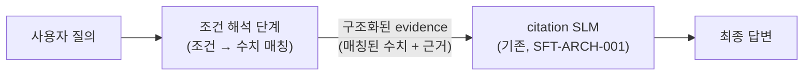
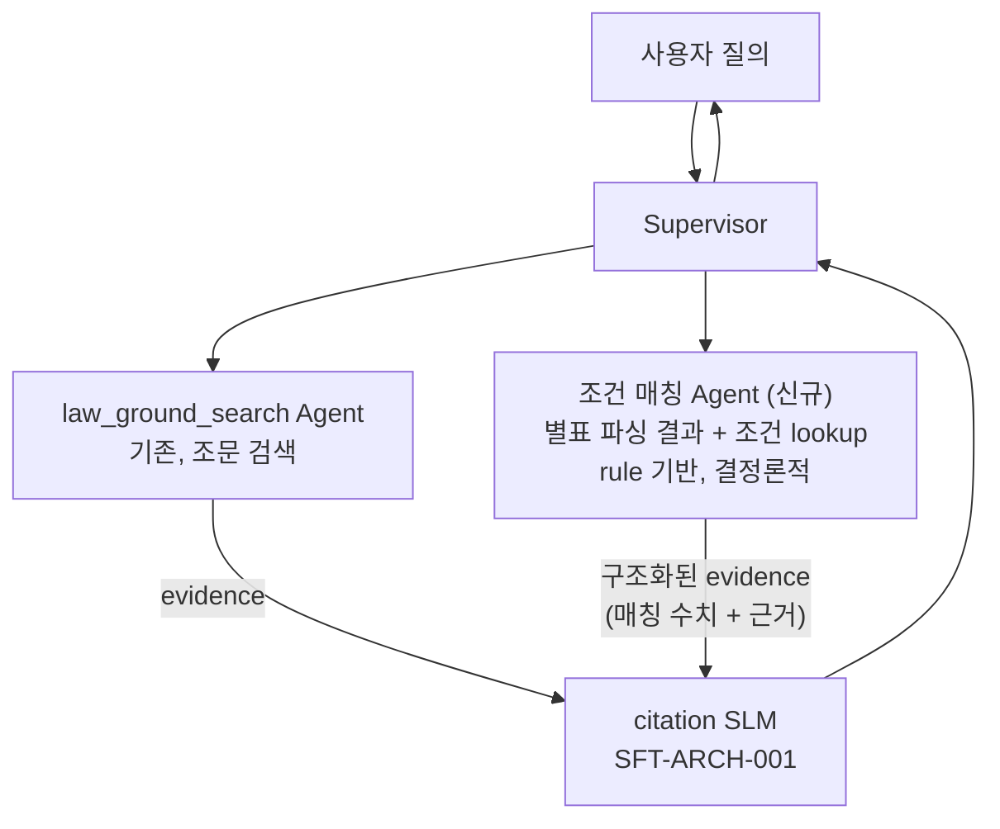

# 조건별 수치 해석 확장 — 후속 작업 추천

**D그룹(벌점·과태료 등 조건별 수치 해석) 대응 방향 제안** · Design Note

| 항목 | 값 |
|------|-----|
| 문서 번호 | SFT-ARCH-003 |
| 버전 | v0.2 |
| 작성일 | 2026-07-14 (최초 작성), 2026-07-14 갱신 — D그룹 최종 범위(5개 카테고리)·SFT 측 임시 조치 완료·역할 분담 확정 반영 |
| 근거 문서 | `01_SFT설계서.md`(SFT-ARCH-001) §1·§8-12·§8-14·NG1, `03_파일럿_품질검수_발견사항.md` 🟠 D그룹, `06_데이터정의및모델선정설계서.md`(SFT-ARCH-002) |
| 작성 배경 | "지금 SLM은 evidence 인용 정확도에 집중돼 있는데, 조건별 복잡한 해석(벌점·과태료 수치 매칭)을 담당하는 SLM을 추가로 학습시켜 병렬로 진행할 수 있는가"라는 질문에 대한 답변을 문서화한 것. D그룹(`dangerous_driving`·`drunk_driving`·`helmet_not_worn`·`mobile_phone_driving`·`traffic_accident`, 최초 3개에서 자동 필터로 2개 추가 발견)이 실제 사례. |
| ⚠️ SFT 측 조치는 이미 완료됨 | 이 문서가 제안하는 "조건 매칭 Agent"(§3)는 아직 미착수이지만, **SFT 파일럿/학습셋 안에서는 D그룹이 이미 정직한 저신뢰도로 처리되도록 조치 완료됐다**(gold가 요구 수치를 안 담고 있으면 신뢰하지 않는 필터, `etl/legal_sft/build_pilot_dataset.py::_query_asks_for_penalty_number`/`_has_penalty_number`). 즉 "잘못된 조문을 확신 있게 인용"하는 위험은 없어졌지만, "정확한 수치를 실제로 찾아서 답해주는" 능력은 여전히 없다 — 이 문서의 제안(조건 매칭 Agent)은 그 능력을 채우기 위한 것으로, 여전히 유효한 후속 과제다. |

---

## 1. 문제 정의

현재 citation SLM(SFT-ARCH-001)은 **"이미 주어진 evidence 중 정답만 골라 인용하고, 근거가
약하면 과신하지 않는 행동"**을 학습한다(§1 원칙 1). evidence 자체가 질의에 필요한 정보를
담고 있는지 판단·해석하는 역할은 원래 범위 밖이다.

D그룹은 이 경계에서 발생한 문제다 — gold 조문이 주제는 맞지만("난폭운전 금지" 조문), 질의가
요구하는 실제 수치("벌점 몇 점?")는 그 조문이 아니라 별도 별표(조건 구간 → 수치 매핑 표)에
있다. 즉 "정답 조문을 고르는 것"과 "조건에 맞는 정확한 수치를 찾아내는 것"은 서로 다른 태스크다.

**2026-07-14 확정**: 레코드 전수 검수 중 자동 필터를 실제로 적용해보니, 최초 발견한
3개(`dangerous_driving`·`drunk_driving`·`helmet_not_worn`) 외에 사람 검수가 놓쳤던
2개(`mobile_phone_driving`·`traffic_accident`)도 같은 패턴이었음이 드러났다 — 최종
**5개 카테고리**가 D그룹이다.

---

## 2. 검토한 방향과 결론

### 2-1. 두 번째 SLM을 추가 학습시켜 병렬 운영 — 조건부로 가능, 권장 순서 아님

기술적으로는 가능하다. QLoRA 특성상 베이스 모델을 공유하고 어댑터만 추가하면 비용 부담이
크지 않고, 학습 자체는 기존 citation SLM 작업과 별도 트랙으로 병행할 수 있다.

다만 실제 서빙 시점에는 "완전한 병렬"(두 SLM이 독립적으로 각자 답을 내고 합치는 구조)보다
**순차 파이프라인**이 구조적으로 맞다.

조건 해석 단계가 먼저 "혈중알코올농도 0.03~0.08%이니 별표의 이 행이 정답"을 판단해 구조화된
evidence를 만들고, citation SLM이 그걸 받아 최종 답변에 인용하는 2단계 구성이다. 두 모델을
병렬로 **학습**시키는 것과, 서빙 시점에 **순차로 엮는 것**은 별개 문제로 구분해야 한다.

### 2-2. 조건 해석 단계를 SLM이 아니라 rule 기반 Agent로 구현 — 권장

별표 데이터는 본질적으로 "조건 구간 → 수치"가 결정론적으로 매핑되는 표다. 이걸 파인튜닝으로
풀면 두 가지 문제가 생긴다.

| 문제 | 상세 |
|---|---|
| 재학습 비용 | 법 개정(벌점·과태료 기준 변경)마다 재학습이 필요해진다 |
| 설계 원칙 충돌 | SFT-ARCH-001 NG1("법 조문·판례 원문을 모델 파라미터에 암기시키지 않는다")과 정확히 같은 문제 — 별표 수치도 "법 지식"이며 RAG/구조화 데이터로 다루는 게 원칙에 맞다 |

**대안**: 별표를 1회 파싱해 조건-수치 매핑을 구조화된 데이터(DB 테이블 또는 rule 형태)로
만들어두고, 런타임에는 결정론적 lookup으로 해당 조건에 맞는 수치를 찾아 evidence에 끼워넣는
방식. 이렇게 하면 두 번째 "SLM"이 아니라 두 번째 "rule 기반 Agent"가 되고, 기존 5-Agent +
Supervisor 구조(SFT-ARCH-001 §8-12)에 자연스럽게 편입된다.

| 방식 | 정확성 | 법 개정 대응 | 개발/유지 비용 |
|---|---|---|---|
| 두 번째 SLM 파인튜닝 | 확률적 (환각 위험) | 재학습 필요 | 학습 데이터·GPU 자원 필요 |
| rule 기반 lookup Agent | 결정론적 (표 파싱 정확하면 100%) | 별표 갱신만 반영하면 됨 | 별표 파서 1회 구현, 이후 유지보수 낮음 |

### 2-3. 자연어 조건 추출까지 필요하면 역할을 다시 분리

사용자가 조건을 수치로 명확히 말하지 않는 경우("술 좀 마시고 운전했는데" 등)까지 다뤄야
한다면, "자연어 → 조건 추출"과 "조건 → 수치 매핑"을 다시 나누는 게 맞다.

- **조건 추출**: 자연어 이해가 필요 — LLM(citation SLM과 별도 소규모 태스크, 또는 프롬프트만으로도
  충분할 가능성 높음)이 유리하다.
- **조건 → 수치 매핑**: 결정론적 lookup 유지 (§2-2와 동일).

이 경우에도 "수치 매핑"까지 LLM에 맡길 필요는 없다는 결론은 바뀌지 않는다.

---

## 3. 권장 아키텍처 (제안)

- `law_ground_search`(조문 검색)와 신규 `조건 매칭 Agent`(수치 lookup)는 Supervisor 아래
  나란히 동작하는 별도 Agent로 병렬 실행 가능 — 여기서의 "병렬"은 이 두 Agent가 서로 독립적으로
  동시에 실행될 수 있다는 뜻이고, 두 결과가 합쳐지는 지점(citation SLM)은 그대로 유지된다.
- 신규 Agent는 SLM이 아니라 rule 기반 모듈로 시작하는 것을 권장한다. 이후 자연어 조건 추출이
  실제로 필요하다고 확인되면(§2-3), 그 부분만 소규모로 LLM화한다.

---

## 4. 전제 조건 / 선행 작업

1. **`compose_agent_response()` SLM 통합 자체가 아직 미착수**(SFT-ARCH-001 §8-12) — citation
   SLM 하나조차 런타임에 붙어 있지 않은 상태다. **2026-07-14 역할 분담 확정 — 이 통합
   작업은 배포 팀 담당**이라, SFT 파인튜닝 팀이 직접 착수할 필요는 없다. 다만 신규 "조건
   매칭 Agent"를 실제로 서빙에 얹으려면 배포 팀과 이 선행조건을 먼저 조율해야 한다는 점은
   그대로 유효하다.
2. **별표 파싱 범위 확정**: D그룹 5개 카테고리(`dangerous_driving`·`drunk_driving`·
   `helmet_not_worn`·`mobile_phone_driving`·`traffic_accident`)가 참조하는 별표부터
   우선 파싱 대상으로 좁힌다. 전체 별표(99,315 chunk 중 다수)를 한 번에 구조화하려 하지 않는다.
3. **Agent별 evidence 스키마 통일**: `compose_agent_response()`가 합치는 Agent 중
   evidence 스키마가 서로 다른 문제가 이미 있다(§8-12) — 신규 Agent의 출력도 citation SLM의
   `input.evidence` 스키마(SFT-ARCH-002 §3-2)와 필드명을 맞춰야 한다.

---

## 5. 결론 및 다음 단계

| 결정 | 근거 |
|---|---|
| 두 번째 SLM을 새로 파인튜닝하지 않는다(1차) | 별표는 결정론적 데이터 — rule 기반이 정확성·유지보수 양쪽에서 우월 |
| D그룹 대응은 "별표 파서 + lookup Agent" 신규 구현으로 시작한다 | §2-2 |
| 자연어 조건 추출이 실측으로 필요해지면 그 부분만 별도로 LLM화한다 | §2-3 — 조건 추출과 수치 매핑을 분리 유지 |
`compose_agent_response()` SLM 통합(§8-12, **배포 팀 담당**)과 서빙 시점을 미리 조율한다 | 통합 지점 없이는 신규 Agent를 얹을 곳이 없음 — 이 작업 자체는 배포 팀이 하지만, 조건 매칭 Agent를 언제 얹을 수 있는지는 미리 맞춰둬야 함 |

**다음 단계**: (1) D그룹 3개 카테고리가 참조하는 별표 구조 조사(컬럼 구성, 조건 표현 방식) →
(2) 파서 설계 및 lookup 스키마 정의 → (3) `compose_agent_response()` Agent별 분기 설계(§8-12)와
일정 조율.
