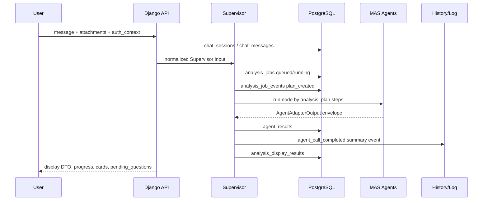

# Supervisor ERD flow alignment

| Item | Content |
|---|---|
| Date | 2026-06-29 |
| Owner | `hi20260204-maker` |
| Related issues | `#29`, `#56`, `#68` |
| Related PRs | `#87`, `#88`, `#89` |
| Purpose | Decide when ERD and Supervisor flow changes should move from roadmap to concrete implementation. |

## 1. Short answer

ERD and Supervisor flow changes start immediately after the Agent output schema
intake PR. The sequence is:

1. Current PR scope: align ERD and Supervisor flow as a DDD/MAS implementation
   plan without changing existing tables.
2. Next implementation PR: add auth/session/rate-limit skeleton because owner,
   guest, quota, and merge policy decide who can see each case and report.
3. Next AI orchestration PR: add `ai_sessions` and `agent_invocations` candidate
   design or model skeleton so every Supervisor-to-Agent call can be traced.
4. Next history PR: move `history_event.v1` from sidecar-first operation toward
   DB-backed `history_events`, after retention and permission rules are fixed.
5. Later PR: split heavy OCR/RAG/Vision/report generation into worker or service
   boundaries if the modular monolith becomes too heavy.

So the ERD should not be rebuilt all at once. The current tables stay as the MVP
storage backbone, and new tables are added only when they solve a concrete
Supervisor, history, auth, or cost-control problem.

## 2. Current implementation checkpoint

The current backend already has the minimum persistence path for Supervisor MVP:

| Flow step | Current table or artifact | Current state |
|---|---|---|
| Chat session | `chat_sessions` | Implemented |
| User/assistant message | `chat_messages` | Implemented |
| File metadata | `uploaded_files` | Implemented |
| Supervisor job lifecycle | `analysis_jobs` | Implemented |
| Job progress event | `analysis_job_events` | Implemented |
| Agent output envelope | `agent_results` | Implemented |
| Supervisor display snapshot | `analysis_display_results` | Implemented |
| Report metadata | `reports` | Implemented |
| My Case progress read model | DB aggregation from the tables above | Implemented in PR `#87` |
| Output schema intake | OpenAPI v0 Agent schemas | PR `#89` |
| DDD/MAS/history roadmap | Bounded context roadmap | PR `#88` |

This means the next ERD work is not a replacement. It is a context ownership and
traceability pass.

## 3. DDD bounded context ownership

| Bounded context | Current tables | Next candidate tables | Why it changes |
|---|---|---|---|
| Identity/Auth | `chat_sessions.owner_id`, metadata auth hints | `users`, `guest_identities`, `auth_sessions`, `auth_events` | Separate login session, guest identity, and chat/case session. |
| Subscription/Quota | Mock rate-limit response only | `subscriptions`, `usage_quotas`, `usage_events` | Control free/member/subscriber model and paid AI calls. |
| Case/Chat | `chat_sessions`, `chat_messages` | `case_status_events` | Make My Case progress and follow-up counseling easier to reconstruct. |
| Evidence Intake | `uploaded_files` | `ocr_results`, `media_frames`, `evidence_items` | Track OCR/Vision artifacts without storing raw reasoning or unnecessary originals. |
| AI Orchestration | `analysis_jobs`, `analysis_job_events`, `agent_results`, `analysis_display_results` | `ai_sessions`, `agent_invocations`, `agent_feedback_events` | Trace Supervisor plans, Agent calls, retries, latency, status, evidence count, and errors. |
| Knowledge/RAG | Evidence metadata inside Agent output | `source_documents`, `rag_chunks`, `retrieval_events` | Reproduce why a law/case/standard was cited. |
| Report | `reports` | `report_versions`, `report_download_events` | Support report revisions, download authorization, and audit trail. |
| Observability/History | sidecar `history_event.v1` | `history_events`, `audit_log_events` | Support after-service, debugging, and 운영 분석 with privacy-safe logs. |

## 4. Supervisor flow target

The Supervisor flow should be treated as the orchestration boundary, not as a
single giant Agent.

The current code already covers the basic path. The next change is to make the
missing trace points explicit:

| Missing trace point | Proposed storage | Timing |
|---|---|---|
| One logical AI run across multiple jobs or retries | `ai_sessions` | After auth/session skeleton |
| One Agent call attempt | `agent_invocations` | Next AI orchestration PR |
| Retry/error/latency/cost/token summary | `agent_invocations.metadata` or `usage_events` | With Agent invocation logging |
| User feedback on Agent result | `agent_feedback_events` | After display cards stabilize |
| Privacy-safe service history | `history_events` | After TTL and permission rule confirmation |

## 5. What changes first

The next concrete implementation order should be:

| Order | Work | Reason |
|---:|---|---|
| 1 | Auth/session/rate-limit skeleton | `owner_id`, `guest_id`, `auth_session_id`, quota key, and merge policy affect every later table. |
| 2 | Supervisor ERD alignment notes and tests | Make sure docs, OpenAPI, and Django models agree on current vs next tables. |
| 3 | AI session / Agent invocation log skeleton | Mentor feedback requires history/log management for Agent calls and debugging. |
| 4 | History DB transition decision | Sidecar history is enough for MVP, but after-service needs queryable DB events. |
| 5 | Object storage/download authorization | Reports and uploaded files need real owner authorization before production. |

## 6. What should not change yet

- Do not split into MSA services now.
- Do not remove `analysis_jobs`, `analysis_job_events`, `agent_results`, or
  `analysis_display_results`.
- Do not store full Agent reasoning text by default.
- Do not make OCR/RAG/Vision calls purely synchronous inside the chat request.
- Do not make subscription tables enforce real billing until quota policy is
  confirmed.

## 7. Issue update text

Use the following short status when updating related issues:

> ERD/Supervisor flow changes start after the Agent output schema intake. The
> first change is not a table rewrite. We keep the current PostgreSQL backbone
> and add DDD ownership plus traceability: auth/session/quota first, then
> `ai_sessions`/`agent_invocations`, then DB-backed `history_events` after TTL
> and permission rules are fixed.

