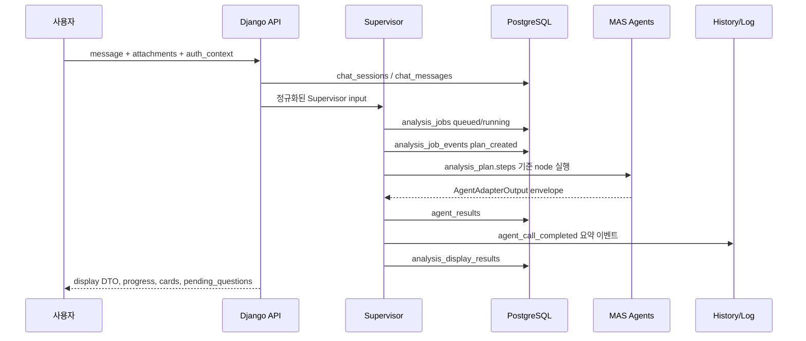

# Supervisor ERD 흐름 정렬

| 항목 | 내용 |
|---|---|
| 작성일 | 2026-06-29 |
| 담당 | `hi20260204-maker` |
| 관련 이슈 | `#29`, `#56`, `#68` |
| 관련 PR | `#87`, `#88`, `#89` |
| 목적 | ERD와 Supervisor 흐름 변경을 언제 설계에서 구현으로 옮길지 결정한다. |

## 1. 결론

ERD와 Supervisor 흐름 변경은 Agent 출력 스키마 반영 PR 직후부터 시작한다.
다만 현재 테이블을 한 번에 갈아엎는 방식이 아니라 아래 순서로 진행한다.

1. 현재 PR 범위에서는 기존 테이블을 유지하면서 ERD와 Supervisor 흐름을
   DDD/MAS 구현 계획으로 정렬한다.
2. 다음 구현 PR에서는 인증/세션/rate limit 뼈대를 먼저 추가한다.
   `owner_id`, `guest_id`, quota, merge 정책이 각 사건과 리포트의 조회 권한을
   결정하기 때문이다.
3. 그 다음 AI orchestration PR에서 `ai_sessions`, `agent_invocations` 후보
   설계 또는 모델 뼈대를 추가해 Supervisor가 어떤 Agent를 언제 호출했는지
   추적할 수 있게 한다.
4. 그 다음 history PR에서 `history_event.v1` 보조 파일 우선 구조를 DB 기반
   `history_events`로 옮길지 결정한다. 이 작업은 보관 기간, 조회 권한, privacy
   rule이 정해진 뒤 진행한다.
5. 이후 OCR/RAG/Vision/report 생성처럼 무거운 영역만 worker 또는 별도
   서비스 경계로 분리할지 검토한다.

따라서 ERD는 지금 전면 재작성하지 않는다. 현재 테이블은 MVP 저장 골격으로
유지하고, Supervisor 추적성, history, auth, 비용 제어에 필요한 경우에만 새
테이블을 추가한다.

## 2. 현재 구현 체크포인트

현재 backend에는 Supervisor MVP에 필요한 최소 persistence 경로가 이미 있다.

| 흐름 단계 | 현재 테이블 또는 산출물 | 현재 상태 |
|---|---|---|
| 채팅 세션 | `chat_sessions` | 구현됨 |
| 사용자/assistant 메시지 | `chat_messages` | 구현됨 |
| 파일 metadata | `uploaded_files` | 구현됨 |
| Supervisor job 생명주기 | `analysis_jobs` | 구현됨 |
| job 진행 이벤트 | `analysis_job_events` | 구현됨 |
| Agent output envelope | `agent_results` | 구현됨 |
| Supervisor display snapshot | `analysis_display_results` | 구현됨 |
| report metadata | `reports` | 구현됨 |
| 내 사건 진행도 read model | 위 테이블 기반 집계 | PR `#87`에서 구현됨 |
| 출력 스키마 반영 | OpenAPI v0 Agent schema | PR `#89` |
| DDD/MAS/history roadmap | bounded context roadmap | PR `#88` |

즉 다음 ERD 작업은 교체가 아니라 context 소유권과 추적성 보강 작업이다.

## 3. DDD bounded context 소유권

| Bounded context | 현재 테이블 | 다음 후보 테이블 | 변경 이유 |
|---|---|---|---|
| Identity/Auth | `chat_sessions.owner_id`, auth metadata hint | `users`, `guest_identities`, `auth_sessions`, `auth_events` | 로그인 세션, 비회원 식별자, 채팅/사건 세션을 분리한다. |
| Subscription/Quota | mock rate-limit 응답 | `subscriptions`, `usage_quotas`, `usage_events` | 비회원/회원/구독 회원 제한과 유료 AI 호출 비용을 제어한다. |
| Case/Chat | `chat_sessions`, `chat_messages` | `case_status_events` | 내 사건 진행도와 재상담 흐름을 복구하기 쉽게 만든다. |
| Evidence Intake | `uploaded_files` | `ocr_results`, `media_frames`, `evidence_items` | OCR/Vision 파생 산출물을 추적하되 불필요한 원본과 reasoning 전문은 저장하지 않는다. |
| AI Orchestration | `analysis_jobs`, `analysis_job_events`, `agent_results`, `analysis_display_results` | `ai_sessions`, `agent_invocations`, `agent_feedback_events` | Supervisor plan, Agent 호출, retry, latency, status, evidence count, error를 추적한다. |
| Knowledge/RAG | Agent output 안의 evidence metadata | `source_documents`, `rag_chunks`, `retrieval_events` | 어떤 법령/판례/기준이 왜 인용됐는지 재현한다. |
| Report | `reports` | `report_versions`, `report_download_events` | report 수정본, 다운로드 권한, audit trail을 지원한다. |
| Observability/History | 보조 파일 기반 `history_event.v1` | `history_events`, `audit_log_events` | 애프터서비스, 디버깅, 운영 분석을 개인정보 보호 기준에 맞는 log로 지원한다. |

## 4. Supervisor 흐름 목표

Supervisor는 거대한 단일 Agent가 아니라 orchestration boundary로 본다.

현재 코드는 기본 흐름을 이미 처리한다. 다음 변경은 빠진 추적 지점을 명시하는 것이다.

| 빠진 추적 지점 | 후보 저장 위치 | 적용 시점 |
|---|---|---|
| 여러 job 또는 retry를 묶는 하나의 논리적 AI 실행 | `ai_sessions` | 인증/세션 뼈대 이후 |
| 개별 Agent 호출 attempt | `agent_invocations` | 다음 AI orchestration PR |
| retry/error/latency/cost/token 요약 | `agent_invocations.metadata` 또는 `usage_events` | Agent invocation logging과 함께 |
| Agent 결과에 대한 사용자 피드백 | `agent_feedback_events` | display card가 안정된 뒤 |
| 개인정보 보호 기준에 맞는 서비스 history | `history_events` | TTL과 권한 rule 확인 뒤 |

## 5. 먼저 바꿀 것

다음 실제 구현 순서는 아래가 맞다.

| 순서 | 작업 | 이유 |
|---:|---|---|
| 1 | 인증/세션/rate limit 뼈대 | `owner_id`, `guest_id`, `auth_session_id`, quota key, merge 정책이 이후 모든 테이블에 영향을 준다. |
| 2 | Supervisor ERD alignment note와 테스트 | 문서, OpenAPI, Django model이 현재 테이블과 다음 후보 테이블을 같은 기준으로 보게 한다. |
| 3 | AI session / Agent invocation log 뼈대 | 멘토 피드백의 history/log management가 Agent 호출과 디버깅에 필요하다. |
| 4 | History DB 전환 결정 | MVP는 보조 파일 기반 history로 충분하지만 애프터서비스에는 조회 가능한 DB event가 필요하다. |
| 5 | Object storage/download authorization | report와 uploaded file은 운영 전 실제 owner 권한 검증이 필요하다. |

## 6. 아직 바꾸지 않을 것

- 지금 MSA처럼 서비스를 분리하지 않는다.
- `analysis_jobs`, `analysis_job_events`, `agent_results`, `analysis_display_results`를 제거하지 않는다.
- Agent reasoning 전문을 기본 저장하지 않는다.
- OCR/RAG/Vision 호출을 chat request 안에서 순수 동기 호출로 묶지 않는다.
- quota 정책이 확정되기 전 subscription table로 실제 과금을 enforce하지 않는다.

## 7. 이슈 업데이트 문구

관련 이슈에는 아래 기준으로 짧게 업데이트한다.

> ERD/Supervisor 흐름 변경은 Agent 출력 스키마 반영 이후 시작한다.
> 첫 변경은 테이블 전면 재작성이 아니다. 현재 PostgreSQL 저장 골격을 유지하고,
> 인증/세션/quota를 먼저 잡은 뒤 `ai_sessions`/`agent_invocations`로
> 추적성을 추가하며, TTL과 권한 rule 확정 후 DB 기반 `history_events`로
> 넘어간다.
