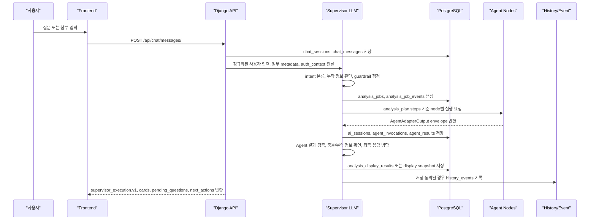

# Supervisor LLM Flow 및 DDD ERD 점검 - 2026-07-01

## 1. 결론

현재 #68에는 chat-first, 저장 동의, supervisor session/auth 흐름이 코멘트로 남아 있다.
다만 `Supervisor가 LLM을 사용한다`는 전제의 전체 운영 flow와, ERD가 DDD bounded context 기준으로 어떻게 읽히는지는 별도 코멘트로 분리되어 있지 않았다.

따라서 이 문서는 다음 두 가지를 명확히 남기기 위한 기록이다.

- Supervisor LLM이 어떤 역할을 하고 어떤 단계에서 Agent node로 넘기는지
- 현재 ERD가 DDD 형식으로 볼 수 있는지, 부족한 부분은 무엇인지

중요한 전제:

- Supervisor는 최종 자연어 답변과 routing/merge/guardrail을 담당한다.
- 개별 Agent 구현은 각 담당자가 맡는다.
- `hi20260204-maker`가 맡지 않은 Agent 구현은 건드리지 않는다.
- 현재 구조는 MSA가 아니라 Django modular monolith 안의 DDD bounded context 정리다.

GitHub #68 기록:

- Supervisor LLM 전체 Flow 코멘트: https://github.com/SKNETWORKS-FAMILY-AICAMP/SKN27-FINAL-3Team/issues/68#issuecomment-4850389086
- DDD ERD 점검 코멘트: https://github.com/SKNETWORKS-FAMILY-AICAMP/SKN27-FINAL-3Team/issues/68#issuecomment-4850393766

## 2. Supervisor LLM 전체 Flow

실서비스 기준 Supervisor는 LLM을 사용한다. 단, LLM이 모든 일을 직접 처리하는 것이 아니라, 사용자 입력을 해석하고 어떤 Agent node를 어떤 순서로 호출할지 결정하는 orchestration layer다.

## 3. Supervisor LLM 책임 범위

| 단계 | Supervisor LLM 책임 | 저장 위치 |
|---|---|---|
| 입력 이해 | 사용자 질문, 첨부 목적, auth 상태를 보고 상담 의도 분류 | `chat_messages.metadata`, `analysis_jobs.metadata` |
| 추가 질문 판단 | 법률/과실/고지서 분석에 필요한 필드가 부족한지 판단 | `pending_questions`, `analysis_job_events` |
| 실행 계획 생성 | 어떤 node를 어떤 순서로 부를지 `analysis_plan` 생성 | `analysis_jobs.analysis_plan_id`, `analysis_jobs.metadata.analysis_plan` |
| Agent 호출 조율 | node별 입력 envelope 구성, dependency/upstream result 전달 | `ai_sessions`, `agent_invocations` |
| 결과 검증 | Agent output envelope, evidence, limitations 검증 | `agent_results`, `agent_invocations.metadata` |
| 최종 병합 | 사용자에게 보여줄 카드, 요약, 다음 행동, 한계 문구 생성 | `analysis_display_results`, API response |
| guardrail | 확정 판단처럼 보이지 않게 표현 제한, 근거/한계 표시 | `limitations`, `history_events.metadata` |

Supervisor가 직접 하지 않는 일:

- OCR 원문 추출 자체
- 최신 법령/RAG 검색 자체
- 이미지/영상 분석 자체
- 이의신청서 작성 Agent 내부 구현
- 다른 담당자 Agent 구현 수정

## 4. 현재 구현과 실제 LLM 전환 차이

현재 구현은 실제 LLM 호출 대신 mock/contract 기반 supervisor execution boundary를 사용한다.

이미 연결된 것:

- `POST /api/chat/messages/`가 `analysis_plan`을 만들고 node output envelope를 반환한다.
- 같은 흐름에서 `ai_sessions`, `agent_invocations`, `agent_results`, `analysis_jobs`가 저장된다.
- `POST /api/agents/plans/run/`도 `session_id`가 있으면 persistence boundary를 남긴다.
- response에는 `supervisor_execution.v1`이 포함된다.

실제 LLM 전환 시 바뀌어야 하는 것:

- `submit_message`/mock plan 생성 부분을 Supervisor LLM planner로 교체한다.
- Agent node 실행은 worker/queue 기반으로 분리한다.
- `agent_invocations.status`를 `queued -> running -> success/partial/failed`로 실시간 갱신한다.
- timeout, retry, cancel, progress polling을 추가한다.

바뀌면 안 되는 것:

- `AgentAdapterInput`
- `AgentAdapterOutput`
- `analysis_plan`
- `supervisor_execution.v1`
- `agent_results`
- `agent_invocations`
- `analysis_display_results`

즉, LLM으로 교체하더라도 화면/API/DB 계약은 유지되어야 한다.

## 5. DDD ERD 점검 결과

현재 ERD는 DDD bounded context 기준으로 읽을 수 있다. 다만 완전한 tactical DDD aggregate 설계가 끝난 상태는 아니고, Django modular monolith 안에서 DDD 소유권을 정리한 상태다.

| DDD bounded context | 현재 model/table | 판정 |
|---|---|---|
| Identity/Auth | `UserAccount`, `GuestIdentity`, `AuthSession`, `AuthEvent` | 분리됨 |
| Case/Chat | `ChatSession`, `ChatMessage` | 분리됨 |
| Evidence Intake | `UploadedFile` | 1차 분리됨 |
| AI Orchestration | `AnalysisJob`, `AnalysisJobEvent`, `AgentNodeDefinition`, `AiSession`, `AgentInvocation`, `AgentResult`, `AnalysisDisplayResult`, `AgentFeedbackEvent` | 핵심 경계 존재 |
| Report | `Report` | 분리됨 |
| Observability/History | `HistoryEvent` | 분리됨 |
| Subscription/Quota | `Subscription`, `UsageQuota`, `UsageEvent` | 분리됨 |
| Code/Reference | `CodeGroup`, `CodeItem` | 분리됨 |
| Knowledge/RAG | 아직 별도 영속 table 없음 | 다음 단계 필요 |

## 6. Aggregate Root 관점

| Aggregate 후보 | Root table | 포함/연결 table |
|---|---|---|
| 상담/사건 | `chat_sessions` | `chat_messages`, `uploaded_files`, `analysis_jobs`, `reports` |
| AI 실행 | `analysis_jobs` 또는 `ai_sessions` | `analysis_job_events`, `agent_invocations`, `agent_results`, `analysis_display_results` |
| 인증 세션 | `auth_sessions` | `users`, `guest_identities`, `auth_events` |
| 리포트 | `reports` | `analysis_display_results`, 향후 `report_versions`, `report_download_events` |
| 이력/감사 | `history_events` | subject/session/job/report references |

현재는 `AnalysisJob`이 화면/API 기준 실행 root에 가깝고, `AiSession`은 여러 node invocation/retry를 묶는 논리 실행 단위로 보는 것이 맞다.

## 7. 아직 부족한 DDD/ERD 부분

완성 전에 보강해야 하는 부분:

- 실제 `Case` entity가 아직 별도 table로 분리되어 있지 않다. 현재는 `chat_sessions`와 `analysis_jobs`가 사건 흐름을 대신한다.
- Knowledge/RAG context가 아직 `source_documents`, `rag_chunks`, `retrieval_events`로 분리되어 있지 않다.
- `owner_id`는 여전히 문자열 중심이다. 실제 사용자 FK 전환 여부는 auth 안정화 후 결정해야 한다.
- 실제 worker queue가 없으므로 `agent_invocations`의 queued/running 상태 갱신은 아직 완전한 비동기 실행이 아니다.
- Agent reasoning 전문은 저장하지 않는 정책을 유지해야 한다.
- 사용자 원문, OCR 원문, 법률 reasoning 전문은 history metadata에 저장하면 안 된다.

## 8. 이슈 코멘트 기준

#68에는 다음 두 코멘트를 별도로 남겨야 한다.

1. Supervisor LLM flow 코멘트
   - LLM이 하는 일
   - Agent node로 넘기는 방식
   - 현재 mock/contract 구현과 실제 LLM 전환 차이
   - 저장되는 table

2. DDD ERD 점검 코멘트
   - 현재 ERD가 DDD bounded context 기준으로 나뉘어 있음을 명시
   - 아직 부족한 Knowledge/RAG, Case entity, worker queue gap 명시
   - MSA가 아니라 modular monolith + DDD boundary라는 점 명시

## 9. 결론

현재 구조는 DDD 방향으로 정리되어 있고, supervisor/Agent 실행을 MAS 구조로 확장할 수 있는 ERD 골격도 있다.

다만 실제 운영 기준으로는 다음이 남아 있다.

- Supervisor LLM planner 연결
- worker/queue/retry/progress 전환
- 실제 Agent 구현 연결
- Knowledge/RAG 영속 table
- Google OAuth 운영 설정
- guardrail QA와 history retention 정책 확정
