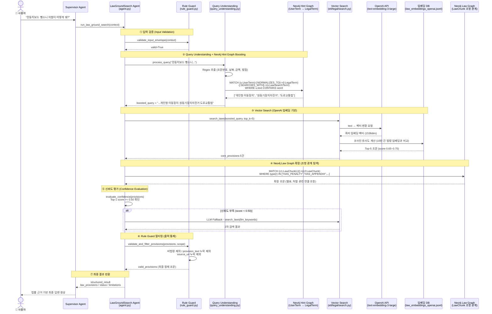

# LawGroundSearch 에이전트 전체 구성도
## (실제 구현 코드 기반 시퀀스 다이어그램)

---

## 주요 컴포넌트 역할 요약

| 컴포넌트 | 파일 | 역할 | 구현 상태 |
|---|---|---|---|
| **Rule Guard** | `rule_guard.py` | 입력 검증 + 출력 필터링 | ✅ 완료 |
| **Query Understanding** | `query_understanding.py` | 정규식 추출 + Neo4j 힌트 부스팅 | ✅ 완료 |
| **Neo4j Hint Graph** | Neo4j DB | 일상어 → 법률용어 변환 | ✅ 코드 완료 / ⚠️ 테스트 데이터만 적재 |
| **Vector Search** | `etl/legal/search.py` | OpenAI 임베딩 기반 코사인 유사도 검색 | ✅ 완료 (10만 건) |
| **Neo4j Law Graph** | Neo4j DB | 조항 간 처벌·별표·예외·일반 참조 관계 확장 | ✅ extra relation ETL/export 연결 / ⚠️ 산출물 적재 후 count 검증 필요 |
| **Confidence Eval** | `search.py` | Top-1 점수(0.50) 기준 신뢰도 판정 | ✅ 완료 |
| **LLM Fallback** | `agent.py` | 신뢰도 부족 시 LLM 키워드 추출 2차 검색 | ✅ 완료 (LLM 외부 주입 필요) |
