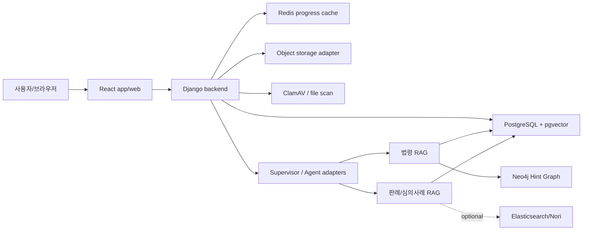
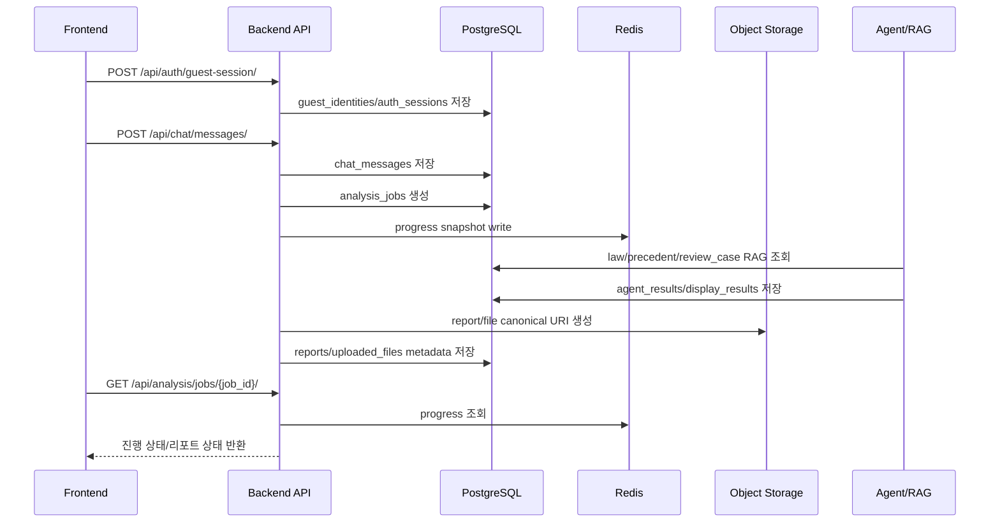

# 데이터베이스/저장소 설계 문서

| 항목 | 내용 |
|---|---|
| 프로젝트 | SKN27 교통분쟁 AI |
| 문서 목적 | 서비스 운영 DB, RAG 지식 저장소, 파일/리포트 저장소, 진행 상태 캐시 설계를 정리 |
| 작성 기준 | 로컬 Git 브랜치/커밋, `backend/chatbot/models.py`, Django migrations, `storage/schemas`, `docker-compose.yml`, `docs/architecture/*`, GitHub 활동 리포트 |
| 기준일 | 2026-07-06 |
| 현재 브랜치 | `feature/connect-fault-ratio-agent` |
| 원격 저장소 | `https://github.com/SKNETWORKS-FAMILY-AICAMP/SKN27-FINAL-3Team.git` |

---

## 1. 프로젝트 저장소 개요

본 프로젝트는 교통사고, 과실비율, 과태료·범칙금, 법령 근거, 이의신청서 초안 생성을 지원하는 AI 상담 서비스다. 저장소 구조는 서비스 실행 영역과 데이터/지식베이스 영역을 분리한다.

| 경로 | 역할 |
|---|---|
| `backend/chatbot` | Django 기반 영속 저장 모델, migration, 관리 command |
| `app/web` | React 프론트엔드, 비회원 세션, Google 로그인, 상담/리포트 작업대 UI |
| `app/services` | mock/auth/history/report/agent service adapter |
| `ai/agents` | 실제 Agent 구현과 adapter |
| `etl` | 법령, 판례, 심의사례, 과실비율 기준정보 전처리 |
| `storage/schemas` | PostgreSQL/pgvector 스키마 |
| `storage/rag` | RAG smoke fixture, query term 설정 |
| `docs/architecture` | 저장소 정책, Redis/Object storage/Auth 설계 기록 |

---

## 2. Git/브랜치/이슈 근거

### 2.1 주요 브랜치 흐름

| 브랜치 | 의미 | 저장소 설계 영향 |
|---|---|---|
| `erd-auth-agent-code-tables` | 인증/Agent/code table 뼈대 | `users`, `guest_identities`, `auth_sessions`, `auth_events`, Agent 실행 이력 설계 |
| `auth-ownership-guard` | 소유권/쿼터 정책 | `owner_id`, guest/user subject, rate limit 정책 |
| `history-operating-policy` | history 저장/조회 정책 | `history_events`, 비회원 TTL, 회원 보관 범위 |
| `redis-progress-cache` | 진행 상태 캐시 | `analysis_job_progress:{job_id}`, `chat_session_state:{session_id}` |
| `object-storage-adapter` | 파일/리포트 저장소 경계 | `uploaded_files.storage_uri`, `reports.storage_uri`, metadata-only object adapter |
| `frontend-app-shell-auth-api` | 프론트 shell/Auth API | 비회원 bootstrap, Google login, session persistence |
| `feature/mvp-auth-session-spine` | MVP 인증 세션 spine | guest -> login -> session binding 흐름 |
| `feature/mvp-chat-worker-report-flow` | 상담-worker-report 연결 | `analysis_jobs`, `agent_results`, `reports` 흐름 |
| `feature/mvp-scan-worker-report-rag-flow` | 업로드 scan/RAG/report 연결 | 파일 scan gate, RAG evidence, report generation |
| `feature/report-quality-ux` | 리포트 품질 UX | `reports.metadata.report_quality`, partial report 표시 |
| `feat-fault-ratio-knowledge-base` | 과실비율 RAG 지식베이스 | fault ratio precedent DB, pgvector, text ML case search |
| `feature/text-ml-case-search-adapter` | 텍스트 ML 사례 검색 adapter | 심의사례/판례 evidence 통합 |

### 2.2 이슈/PR 기반 설계 변화

| 날짜 | PR/이슈 흐름 | 저장소 설계 반영 |
|---|---|---|
| 2026-06-29 | PR #84~#93 | Agent result, display result, report metadata, download boundary, My Case summary, auth/code table 설계 |
| 2026-06-30 | PR #94~#112 | Auth ownership, quota, Redis cache, object storage, Google auth, frontend app shell, workbench UI |
| 2026-07-02 | PR #115~#118 | Google auth code flow, fine appeal decision, law ground search |
| 2026-07-03 | PR #121~#135 | supervisor mode, upload scan, auth session spine, guest policy, worker report/RAG flow |
| 2026-07-06 | PR #136~#140 | E2E demo hardening, worker polling, report quality UX, fault ratio knowledge base, text ML adapter |

---

## 3. 전체 저장소 아키텍처

저장소 설계는 기준 저장소와 보조 저장소를 분리한다.

| 저장소 | 역할 | 기준 여부 |
|---|---|---|
| PostgreSQL | 서비스 영속 데이터, history, reports, RAG case/chunk/embedding | 기준 저장소 |
| pgvector | 법령/판례/심의사례 vector similarity | 기준 vector 저장소 |
| Redis | worker/job 진행 상태 TTL cache | 보조 캐시 |
| Object storage adapter | 업로드 파일/리포트 binary URI와 metadata | binary 저장소 경계 |
| Neo4j | 법률 용어 hint graph, graph expansion | RAG 보조 지식 그래프 |
| Elasticsearch/Nori | BM25/vector/hybrid 검색 A/B 실험 | 선택 실험 저장소 |
| ClamAV | 파일 업로드 scan | 저장소 전 gate |

---

## 4. 서비스 운영 DB 설계

서비스 운영 DB는 `backend/chatbot/models.py`와 Django migration을 기준으로 한다.

### 4.1 상담/파일/분석/리포트

| 테이블 | 주요 키 | 목적 |
|---|---|---|
| `chat_sessions` | `session_id`, `owner_id`, `status` | 비회원/회원 상담 세션 저장 |
| `chat_messages` | `message_id`, `session_id`, `role` | 사용자/AI/system 메시지 저장 |
| `uploaded_files` | `attachment_id`, `owner_id`, `session_id`, `storage_uri` | 업로드 파일 metadata, scan 상태, agent handoff |
| `analysis_jobs` | `job_id`, `session_id`, `message_id`, `status`, `active_node` | Supervisor/Agent 분석 job 단위 |
| `analysis_job_events` | `job_id`, `status`, `active_node` | job 진행 이력 |
| `agent_results` | `result_id`, `job_id`, `node_code`, `status` | Agent별 structured result/evidence/limitations |
| `analysis_display_results` | `display_result_id`, `job_id` | 화면 표시용 카드/질문/첨부/리포트 링크 |
| `reports` | `report_id`, `owner_id`, `session_id`, `job_id`, `storage_uri` | 리포트 metadata, content, object storage URI |

### 4.2 인증/소유권/쿼터

| 테이블 | 주요 키 | 목적 |
|---|---|---|
| `users` | `user_id`, `email`, `provider_subject` | 서비스 사용자 계정 |
| `social_accounts` | `provider`, `provider_user_id` | Google 등 social account 연결 |
| `oauth_connections` | `connection_id`, `user_id`, `provider` | OAuth token lifecycle |
| `guest_identities` | `guest_id`, `status`, `expires_at` | 비회원 식별자와 병합 후보 |
| `auth_sessions` | `auth_session_id`, `subject_type`, `subject_id` | 로그인/비회원 인증 세션 |
| `auth_events` | `event_id`, `event_type`, `subject_id` | guest 발급, 로그인, 병합 등 인증 이벤트 |
| `subscriptions` | `subscription_id`, `user_id`, `plan_code` | 구독/요금제 상태 |
| `usage_quotas` / `usage_events` | subject 기준 | 비회원/회원/구독 rate limit |

핵심 정책은 로그인 사용자와 비회원 사용자를 동일한 session id로 섞지 않는 것이다. 비회원은 `guest:{guest_id}`, 회원은 `user:{user_id}` subject로 구분한다.

---

## 5. RAG 지식 저장소 설계

### 5.1 법령 RAG

스키마: `storage/schemas/law_db_schema.sql`

| 테이블 | 내용 |
|---|---|
| `law_chunks` | 법령 조문/별표/서식 chunk, source metadata, 시행일/만료일, domain tags |
| `law_embeddings` | `law_chunks.chunk_id` 기준 embedding vector |

주요 인덱스:

- `law_chunks.domain_tags` GIN index
- `law_chunks(enforce_date, expire_date)` temporal index
- `law_embeddings` HNSW cosine index

법령 RAG는 단순 vector 검색만 쓰지 않고 Neo4j Hint Graph를 결합한다. A/B 테스트 기준으로 OpenAI embedding + Neo4j Graph-RAG 조합이 최종 채택 후보로 정리됐다.

### 5.2 교통 판례/과실비율 판례 RAG

스키마: `storage/schemas/precedent_db_schema.sql`

| DB | 주요 테이블 | 용도 |
|---|---|---|
| `traffic_precedent_db` | `traffic_precedent_cases`, `traffic_precedent_chunks`, `traffic_precedent_chunk_embeddings` | 교통사고 관련 판례 검색 |
| `fault_ratio_precedent_db` | `fault_ratio_precedent_cases`, `fault_ratio_precedent_chunks`, `fault_ratio_precedent_chunk_embeddings` | 과실비율 판례 검색 |

chunk 전략은 `structured_1500_250`이다. embedding은 `text-embedding-3-small`, 1536 dimensions 기준으로 적재한다.

### 5.3 과실비율 심의사례 RAG

스키마: `storage/schemas/review_case_db_schema.sql`

| 테이블 | 내용 |
|---|---|
| `review_case_preprocess_runs` | 전처리 run metadata, document/chunk/count/quality summary |
| `review_case_documents` | 심의사례 문서 단위 정규화 결과 |
| `review_case_source_chunks` | 원천 chunk |
| `review_case_chunks` | RAG 검색용 chunk |
| `review_case_quality_reports` | 문서별 품질 플래그 |
| `review_case_toc_items` | 목차 항목 |
| `review_case_toc_case_links` | 목차와 사례 문서 연결 |
| `review_case_chunk_embeddings` | 심의사례 chunk embedding |

---

## 6. 파일/리포트 저장소 설계

Object storage adapter 정책은 `object_storage_adapter.v1`이다.

| 항목 | 설계 |
|---|---|
| provider 기본값 | `mock_s3` |
| bucket 기본값 | `skn27-demo-object-storage` |
| prefix 기본값 | `canonical` |
| signed URL TTL | 900초 |
| 현재 단계 | metadata-only adapter |
| 업로드 파일 | `uploaded_files.storage_uri`, `metadata.source_storage_uri` |
| 리포트 | `reports.storage_uri`, `reports.metadata.object_storage`, `reports.content.object_storage` |

현재는 실제 binary write/read보다 canonical metadata 전환 지점이 먼저 구현되어 있다. 실제 S3/MinIO client, signed URL 분리, lifecycle/retention 정책은 후속 작업이다.

---

## 7. Redis 진행 상태 캐시 설계

Redis는 기준 저장소가 아니라 300초 TTL의 진행 상태 cache다.

| Key | 내용 |
|---|---|
| `analysis_job_progress:{job_id}` | job status, active node, progress message, analysis plan id, status counts, source tables |
| `chat_session_state:{session_id}` | session status, current intent, latest job id, latest job status |

장애 또는 cache miss 발생 시 API는 PostgreSQL의 `analysis_jobs`, `analysis_job_events`, `chat_sessions`에서 상태를 복구하고 Redis에 다시 write한다. OCR 원문, prompt, agent reasoning 전문은 cache snapshot에 넣지 않는다.

---

## 8. Docker Compose 저장소 구성

| 서비스 | 이미지/역할 | 포트 |
|---|---|---|
| `backend` | Django backend | `8000` |
| `frontend` | Vite React frontend | `5173` |
| `postgres` | `pgvector/pgvector:pg16` | `5432` |
| `redis` | `redis:7-alpine` | `6379` |
| `clamav` | 파일 scan | `3310` |
| `neo4j` | graph hint store | `7474`, `7687` |
| `data-seed` | 법령 ETL pipeline 실행 | 일회성 |
| `elasticsearch` | Nori/BM25/vector 실험 | `9200` |
| `kibana` | Elasticsearch UI | `5601` |

PostgreSQL 초기화는 `./storage/schemas/law_db_schema.sql`을 `/docker-entrypoint-initdb.d/init.sql`로 mount한다. 판례/심의사례 DB는 별도 loader/schema loader로 생성한다.

---

## 9. 데이터 흐름

---

## 10. 남은 설계 이슈

| 우선순위 | 영역 | 남은 작업 |
|---|---|---|
| 높음 | 실제 binary storage | mock_s3 metadata-only에서 S3/MinIO write/read로 전환 |
| 높음 | 개인정보/보관 정책 | OCR 원문, 고지서, 사고 사진, 영상 metadata 보관/삭제 기준 확정 |
| 높음 | guest merge | 비회원 상담을 회원 계정에 병합할 때 사용자 확인 UX/API 확정 |
| 높음 | worker queue | 실제 비동기 queue 도입 시 `analysis_job_events`와 Redis snapshot 갱신 기준 확정 |
| 보통 | Neo4j 운영 범위 | MVP는 hint graph 중심, 조문 위임 관계 graph는 후순위 |
| 보통 | Elasticsearch | 현재 A/B 실험 후보이며 기준 저장소는 PostgreSQL pgvector |
| 보통 | report lifecycle | partial report, final report, 다운로드 권한, object lifecycle 연결 |

