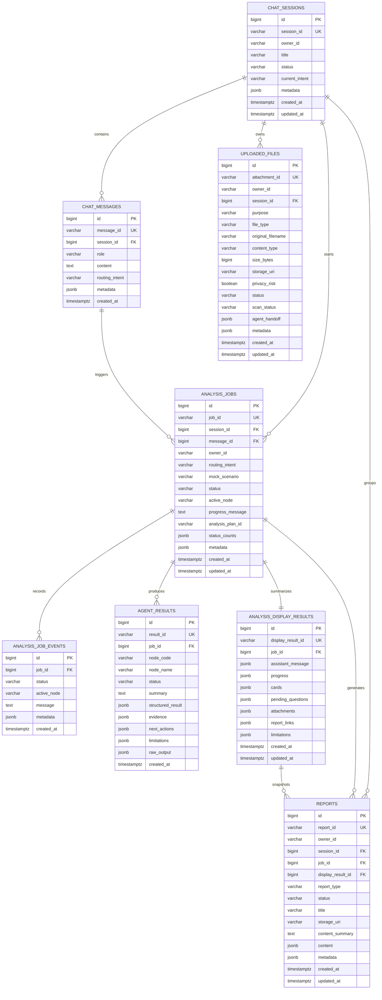

> 2026-06-29 update: canonical `POST /api/analysis/jobs/` now persists the job boundary plus one `agent_results` row per mock plan execution. Canonical `GET /api/analysis/results/{job_id}/` persists the Supervisor display snapshot to `analysis_display_results`. Canonical `POST /api/reports/` persists report metadata to `reports` with a `mock://reports/{report_id}` artifact placeholder. Explicit `/api/mock/...` paths remain sidecar-only. The next persistence target is the real object storage adapter/download authorization path.

# PostgreSQL ERD 초안

| 항목 | 내용 |
|---|---|
| 작성일 | 2026-06-28 |
| 대상 브랜치 | `django-production-storage-foundation` |
| 관련 이슈 | `#56`, `#58`, `#68` |
| 구현 상태 | Django model + initial migration foundation 완료, canonical 파일/채팅 분석 경계 metadata 저장 연결 |

## 1. 현재 진행 정도

오늘 dev에 올릴 수 있는 Django 백엔드 범위는 다음 상태다.

| 영역 | 상태 | 비고 |
|---|---|---|
| Django 서버 골격 | 완료 | `backend/manage.py`, `config`, `chatbot` app 구성 |
| Canonical API surface | 완료 | `/api/...` 경로가 mock service를 재사용하며 동작 |
| Mock API 회귀 경로 | 완료 | `/api/mock/...` 유지 |
| JWT 실패 envelope | 완료 | `auth_error.v1`, `WWW-Authenticate` header, 401/403 계약 |
| Agent adapter 계약 | 완료 | `agent_adapter.v1`, input/context/output validator |
| PostgreSQL schema foundation | 완료 | Django models + `0001_initial` migration |
| PostgreSQL 실제 저장 연결 | 부분 완료 | `POST/GET /api/files/`, `POST /api/chat/messages/`의 message/job boundary 저장 연결 |
| Redis progress cache | 미완료 | DB fallback 정책만 설계 |
| Object storage | 미완료 | `storage_uri` metadata 필드만 준비 |

즉, 팀원이 오늘 dev에서 확인할 수 있는 것은 “Django 서버와 운영 후보 API 경로가 살아 있고, PostgreSQL로 갈 테이블 뼈대가 정해졌으며, canonical 파일 API와 채팅 메시지 분석 경계가 DB row를 만들기 시작한 상태”다. Agent 결과, display result, report 저장 연결은 다음 단계다.

## 2. ERD

## 3. 실제 Django table 이름

`backend/chatbot/models.py`에는 ERD와 맞도록 `db_table`을 지정한다.

| Django model | PostgreSQL table | 역할 |
|---|---|---|
| `ChatSession` | `chat_sessions` | 사용자별 상담 session |
| `ChatMessage` | `chat_messages` | 사용자/assistant 메시지 이력 |
| `UploadedFile` | `uploaded_files` | 첨부 metadata와 object storage URI |
| `AnalysisJob` | `analysis_jobs` | 분석 job 생명주기 |
| `AnalysisJobEvent` | `analysis_job_events` | job 진행 event/audit trail |
| `AgentResult` | `agent_results` | 개별 Agent 결과 envelope |
| `AnalysisDisplayResult` | `analysis_display_results` | 화면 표시용 Supervisor 병합 snapshot |
| `Report` | `reports` | 리포트 metadata와 생성 결과 |

## 4. 화면/API 연결

| 화면 영역 | API | PostgreSQL 기준 테이블 |
|---|---|---|
| 챗봇 session 생성/목록 | `POST /api/chat/sessions/`, `GET /api/chat/sessions/` 후보 | `chat_sessions` |
| 챗봇 메시지 입력/이력 | `POST /api/chat/messages/`, `GET /api/chat/sessions/{id}/messages/` 후보 | `chat_messages`, `analysis_jobs` |
| 첨부 자료 | `POST /api/files/`, `GET /api/files/{attachment_id}/` | `uploaded_files` |
| 분석 진행 상태 | `POST /api/analysis/jobs/`, `GET /api/analysis/jobs/{job_id}/` | `analysis_jobs`, `analysis_job_events` |
| 분석 결과 카드 | `GET /api/analysis/results/{job_id}/` | `agent_results`, `analysis_display_results` |
| 리포트 저장/다운로드 | `POST /api/reports/`, `GET /api/reports/{report_id}/download/` | `reports`, `analysis_display_results` |
| 마이페이지/이력 | `GET /api/mypage/summary/`, `GET /api/history/` 후보 | `chat_sessions`, `analysis_jobs`, `reports` 집계 |

## 5. 연결 전 정책

- `owner_id`는 현재 문자열 식별자로 둔다. 실제 JWT 연결 후 `request.user` 또는 JWT claim 기반 FK/owner 정책으로 승격한다.
- API response shape는 저장소 전환 후에도 canonical `/api/...` 기준을 유지한다.
- `analysis_plan`, `node_execution`, `chat_response` 같은 raw debug 묶음은 DB에 저장할 수 있지만, 화면용 `GET /api/analysis/results/{job_id}/`는 display DTO만 반환한다.
- Redis는 빠른 progress cache로만 사용하고, Redis miss 시 PostgreSQL의 `analysis_jobs`와 `analysis_job_events`에서 재구성 가능해야 한다.
- Object storage에는 원본 파일과 생성 리포트 byte를 저장하고, PostgreSQL에는 `storage_uri`와 metadata만 저장한다.

## 6. 현재 repository 연결 상태

2026-06-28 현재 `POST /api/files/`, `GET /api/files/`, `GET /api/files/{attachment_id}/`는 Django repository를 통해 `uploaded_files`를 사용한다. 파일 byte 저장은 object storage adapter 도입 전까지 기존 mock local storage를 유지하고, DB에는 `attachment_id`, `session_id`, `purpose`, `file_type`, `content_type`, `size_bytes`, `storage_uri`, `agent_handoff`, `metadata`를 저장한다.

`POST /api/chat/messages/`는 mock 응답 shape를 유지하면서 `chat_sessions`, `chat_messages`, `analysis_jobs`, `analysis_job_events`에 상담 메시지와 분석 job 생성 경계를 기록한다. 아직 Agent 실행 결과와 Supervisor display DTO는 DB에서 읽어 응답하지 않고, 다음 단계에서 `agent_results`, `analysis_display_results`, `reports`로 연결한다.

명시적 회귀 테스트 경로인 `/api/mock/attachments/`는 기존 sidecar-only 동작을 유지한다.

## 7. 남은 구현 순서

1. Agent adapter 실행 결과를 `agent_results`에 저장한다.
2. Supervisor display DTO를 `analysis_display_results`로 저장하거나, `agent_results`에서 매번 병합할지 결정한다.
3. `reports`와 object storage download flow를 연결한다.
4. Redis progress cache와 PostgreSQL fallback을 연결한다.
