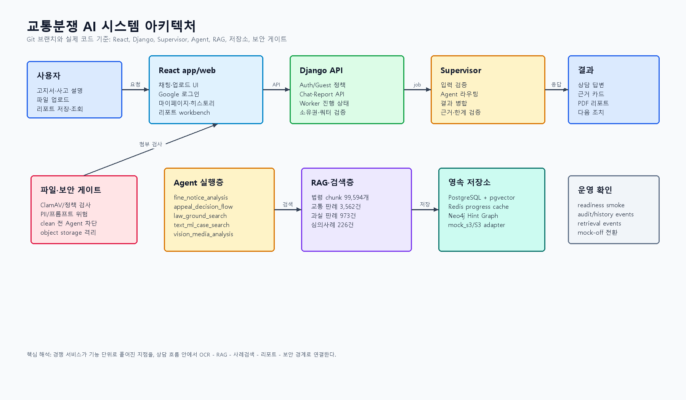
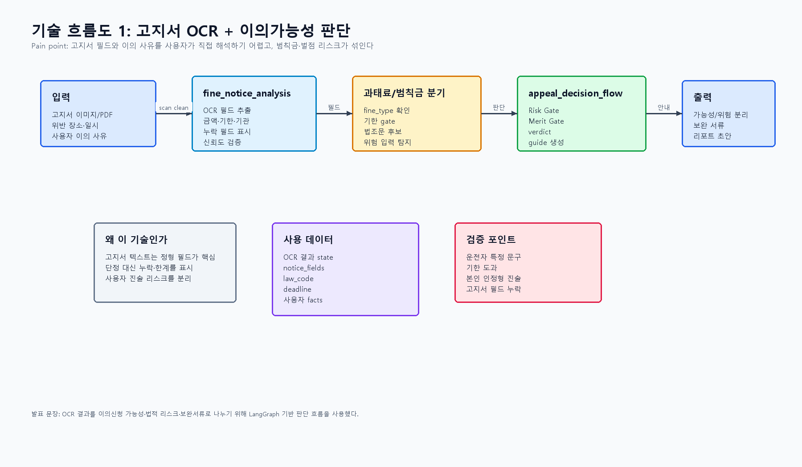
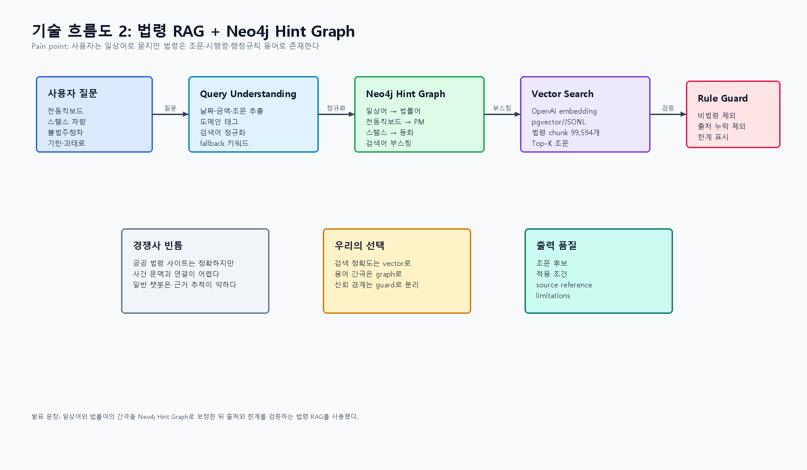
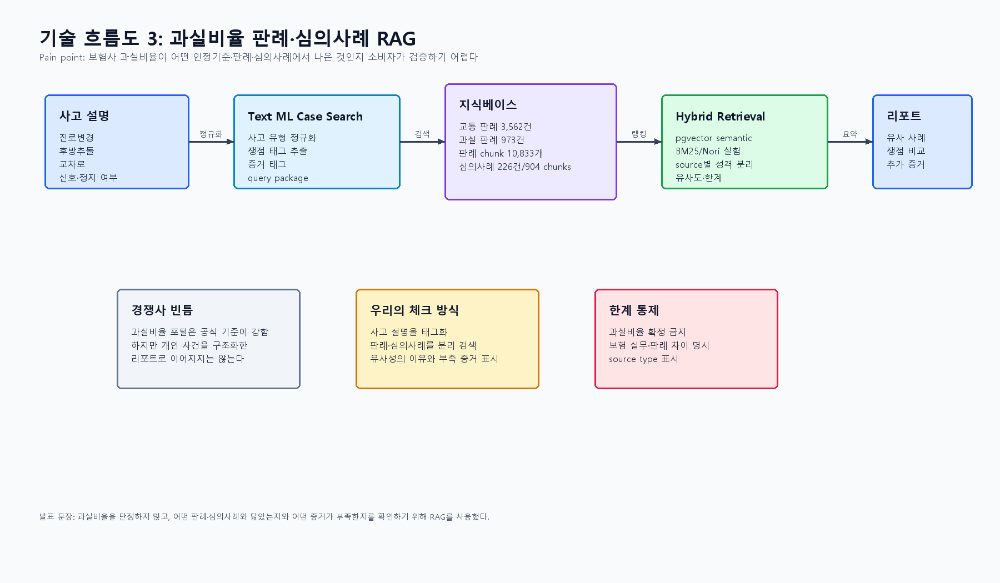
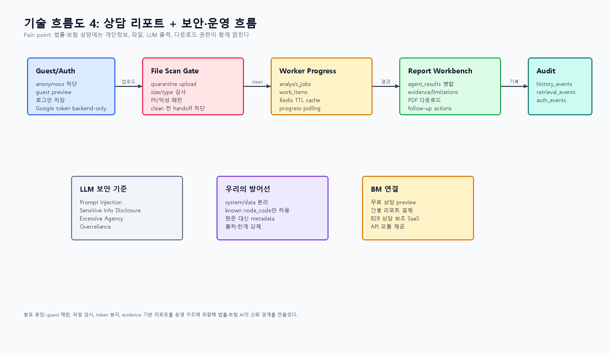

# 교통분쟁 AI 프로젝트 아키텍처·경쟁사·기술 흐름 정리

| 항목 | 내용 |
|---|---|
| 기준일 | 2026-07-08 |
| 분석 범위 | Git 브랜치/커밋, `app/`, `backend/`, `ai/agents/`, `etl/`, `storage/`, `docs/architecture` |
| 프로젝트 정의 | 교통사고·과태료·범칙금·과실비율 분쟁에서 사용자가 전문가 상담 전 근거를 확인하고 리포트로 정리하는 AI 상담/분석 서비스 |
| 발표용 핵심 문장 | "우리는 교통분쟁에서 사용자가 겪는 정보 비대칭과 근거 탐색 비용을 줄이기 위해 OCR, 법령 RAG, 과실비율 사례검색, 리포트, 보안 게이트를 하나의 상담 흐름으로 연결했다." |

## 1. Git 기반 프로젝트 해석

최근 Git 흐름은 단순 챗봇이 아니라 "상담 입력 → Agent 실행 → RAG 근거 → 리포트 → 저장/다운로드 → 운영 readiness"로 수렴한다.

| 근거 | 해석 |
|---|---|
| `feature/local-google-login-fallback`, `google-auth-jwt`, `auth-token-lifecycle` | 사용자/guest 인증, Google 로그인, token 분리 설계 |
| `feature/upload-scan-e2e-flow`, `feature/mvp-scan-worker-report-rag-flow` | 파일 업로드 후 scan gate를 거쳐 Agent 입력으로 넘기는 흐름 |
| `feature/law-ground-sync-adapter`, `feature-law-ground-search` | 법령 RAG를 실제 Supervisor 흐름에 연결 |
| `feature/connect-fault-ratio-agent`, `feature/text-ml-case-search-adapter` | 과실비율 판례·심의사례 검색 Agent 연결 |
| `feature/report-workbench-actions`, `feature/report-pdf-download`, `feature/report-quality-ux` | 채팅 결과를 리포트와 후속 action으로 전환 |
| `redis-progress-cache`, `object-storage-adapter`, `history-operating-policy` | 진행 상태 캐시, 파일/리포트 저장 경계, 감사성 이력 저장 |

## 2. 시스템 아키텍처 이미지

원본 SVG: `docs/assets/architecture-analysis/system-architecture-2026-07-08.svg`

## 3. 경쟁·대체 서비스 분석

| 구분 | 대표 사례 | 강점 | Pain point | 우리 대응 |
|---|---|---|---|---|
| 공식 과실비율 포털 | 손해보험협회 과실비율 정보포털 | 과실비율 인정기준, 검색순위, 심의사례, 인터넷 상담 메뉴가 있음 | 사용자가 사고 사실을 직접 구조화해야 하고 개인 사건 리포트로 자연스럽게 이어지지 않음 | 사고 설명을 쟁점 태그로 정규화하고 유사 판례·심의사례를 리포트에 연결 |
| 보험 데이터·정보 서비스 | 보험개발원, 카히스토리, 보험통계, 보험료 할인할증조회 | 보험 데이터 기반 신뢰와 공식성 | 교통분쟁 상담 흐름, 법령 근거, 과실비율 사례 비교가 한 화면에 묶이지 않음 | RAG 근거와 리포트 workbench로 사용자의 사건 단위 판단 비용을 낮춤 |
| 보험사 앱/콜센터 | 보험사 사고접수·보상상담 | 실제 보험 처리와 연결 | 보험사 관점의 설명으로 느껴질 수 있고 근거 비교·반론 준비가 제한됨 | 판례·심의사례·법령 source를 분리해 사용자가 근거를 비교 |
| 법률상담 플랫폼 | 로톡 등 변호사 연결 플랫폼 | 전문가 상담과 사건 의뢰 가능 | 초기 셀프 점검에는 비용·시간 부담이 큼 | 무료/저비용 preview와 건별 근거 리포트로 pre-consulting 포지션 |
| 일반 검색/챗봇 | 검색엔진, 범용 LLM | 접근성이 높음 | 최신 근거, 개인정보 보호, 파일 scan, 사건별 이력·리포트 저장이 약함 | 파일 검사, token 분리, evidence/limitations, history/report 저장 |
| 공공 데이터 | 공공데이터포털 단속카메라, TAAS, 국가법령정보센터 | 공식 데이터와 공개성 | 일반 사용자가 사고·고지서 문맥으로 연결하기 어려움 | road_context_analysis/MCP 제안과 법령 RAG로 상담 문맥에 연결 |

## 4. SWOT

| 구분 | 내용 |
|---|---|
| Strength | OCR, 법령 RAG, 과실비율 사례검색, 이의가능성 판단, 리포트가 하나의 상담 흐름으로 연결된다. |
| Weakness | MVP 단계에서는 실제 보험사 내부 데이터, 실시간 판례 API, 실제 Vision 모델 연결이 제한적이다. |
| Opportunity | 셀프 점검 수요, 온라인 보험·법률 상담 확대, 공공 데이터와 RAG 결합, B2B 상담 보조 SaaS 확장이 가능하다. |
| Threat | 법률 자문 오해, 개인정보/파일 보안 사고, 공식기관·보험사의 기능 확장, RAG 최신성·출처 품질 문제가 있다. |

발표에서는 경쟁사를 약점만으로 비판하지 말고, "공식성·전문성은 경쟁사가 강하지만 사용자의 사건 단위 근거 정리와 리포트 연결이 빈틈"이라고 정리하는 편이 안전하다.

## 5. Pain Point → 기술 선택

| Pain point | 사용자가 겪는 실패 | 사용 기술 | 왜 이 기술인가 |
|---|---|---|---|
| 고지서 내용을 읽기 어렵다 | 위반 유형, 기한, 금액, 기관을 놓침 | OCR + `fine_notice_analysis` | 이미지/PDF에서 정형 필드를 추출하고 누락 필드를 표시 |
| 이의신청이 오히려 위험할 수 있다 | 운전자 특정, 범칙금/벌점 리스크가 섞임 | LangGraph `appeal_decision_flow` | deadline, law code, risk gate, merit gate를 분리 판단 |
| 법령 용어를 모른다 | 일상어 검색으로 조문을 못 찾음 | Neo4j Hint Graph + 법령 vector RAG | 일상어를 법률어로 확장하고 조문 chunk를 검색 |
| 보험사 과실비율 근거가 불투명하다 | 유사 판례·심의사례를 찾지 못함 | `text_ml_case_search` + pgvector/BM25 실험 | 사고 설명을 태그화하고 판례·심의사례 source를 분리 |
| AI 결과를 믿기 어렵다 | 왜 그런 답이 나왔는지 확인 불가 | evidence, limitations, retrieval_events | 근거와 한계를 리포트에 강제 |
| 개인정보와 파일이 위험하다 | 고지서·차량번호·주소·사진이 노출될 수 있음 | file scan gate, guest/auth 분리, object storage adapter | clean 전 Agent 차단, 저장/다운로드 권한 분리 |
| 상담이 일회성으로 끝난다 | 나중에 다시 보거나 제출하기 어렵다 | report workbench, PDF download, history_events | 채팅 결과를 저장 가능한 리포트로 전환 |

## 6. 기술 흐름도 이미지

### 6.1 고지서 OCR + 이의가능성 판단

발표 문장: "OCR 결과를 이의신청 가능성·법적 리스크·보완서류로 나누기 위해 LangGraph 기반 판단 흐름을 사용했다."

### 6.2 법령 RAG + Neo4j Hint Graph

발표 문장: "일상어와 법률어의 간극을 Neo4j Hint Graph로 보정한 뒤 출처와 한계를 검증하는 법령 RAG를 사용했다."

### 6.3 과실비율 판례·심의사례 RAG

발표 문장: "과실비율을 단정하지 않고, 어떤 판례·심의사례와 닮았는지와 어떤 증거가 부족한지를 확인하기 위해 RAG를 사용했다."

### 6.4 상담 리포트 + 보안·운영 흐름

발표 문장: "guest 제한, 파일 검사, token 분리, evidence 기반 리포트를 운영 구조에 포함해 법률·보험 AI의 신뢰 경계를 만들었다."

## 7. 발표용 결론

이 프로젝트의 차별점은 "AI가 과실비율이나 이의신청 가능성을 확정한다"가 아니다. 차별점은 사용자가 흩어진 고지서, 사고 설명, 법령, 과실비율 기준, 판례·심의사례, 증거 부족 지점을 하나의 상담 리포트에서 확인할 수 있게 만드는 것이다.

따라서 발표에서는 아래 순서가 가장 자연스럽다.

1. 교통분쟁은 사고 이후 정보 비대칭과 근거 탐색 비용의 문제다.
2. 기존 공식 서비스와 전문가 플랫폼은 강점이 있지만, 사용자 사건 단위 리포트와 AI 상담 흐름은 약하다.
3. 우리는 OCR, 법령 RAG, 과실비율 RAG, 리포트, 보안 게이트를 연결해 그 빈틈을 체크했다.
4. 단정이 아니라 근거·한계·다음 조치를 제공하는 서비스로 포지셔닝한다.

## 8. 참고 자료

- 손해보험협회 자동차사고 과실비율 정보포털: https://accident.knia.or.kr/
- 보험개발원: https://www.kidi.or.kr/
- 로톡: https://www.lawtalk.co.kr/
- 공공데이터포털 전국무인교통단속카메라표준데이터: https://www.data.go.kr/data/15028200/standard.do
- TAAS 교통사고분석시스템: https://taas.koroad.or.kr/
- 국가법령정보센터: https://www.law.go.kr/
- OWASP Top 10 for Large Language Model Applications: https://owasp.org/www-project-top-10-for-large-language-model-applications/
