# hi20260204-maker 보안/운영 플로우 발표 정리 - 2026-07-02

## 1. 발표 핵심 요약

이 프로젝트의 실서비스 전환 핵심은 단순히 화면이나 mock API를 늘리는 것이 아니라, 운영 가능한 경계를 만드는 것이다.

중요한 축은 다음 네 가지다.

1. Google 인증과 app JWT를 분리해서 token 노출 위험을 줄인다.
2. Supervisor가 상담 입력을 분석하고 Agent 실행 계획을 만든다.
3. Agent 실행은 worker queue로 분리해서 `queued -> running -> success/failed/retrying` 상태를 추적한다.
4. Production readiness, 장애 대응, 롤백, 백업, secret rotation으로 운영 리스크를 통제한다.

발표용 한 문장:

> 이 프로젝트는 사용자의 상담 요청을 Supervisor가 분석하고, Agent 실행은 worker queue로 분리하며, RAG 근거와 실행 결과는 PostgreSQL에 감사 가능하게 남기고, 인증 token과 운영 설정은 readiness와 secret 정책으로 통제하는 구조로 전환되고 있습니다.

## 2. 현재 프로젝트 반영 업데이트 체크

| 분류 | 반영된 업데이트 | 확인 포인트 | 다음 확인 |
|---|---|---|---|
| Supervisor | LLM planner optional adapter와 fallback contract | `SUPERVISOR_LLM_ENABLED`, `supervisor_llm_service.py` | 실제 API key 환경에서 planner smoke test |
| Worker Queue | DB work item 기반 queue/retry/progress 경계 | `agent_work_items`, `process_agent_work_items` | 상시 worker/scheduler 운영 방식 결정 |
| Legal RAG | pgvector 우선 검색과 Django RAG fallback | `law_chunks`, `law_embeddings`, `rag_chunks`, `retrieval_events` | ETL 적재와 vector search 실측 |
| Google Auth | Authorization Code Flow, app JWT, backend-only OAuth token 저장 | `/api/auth/google/code/`, `social_accounts`, `oauth_connections` | Google Cloud mock off smoke test |
| Readiness | security, DB, OAuth, LLM, RAG, queue, storage 통합 점검 | `check_production_readiness` | DB 포함 readiness 재실행 |
| Object Storage | metadata adapter 경계 | `uploaded_files.storage_uri`, `reports.storage_uri` | 실제 S3/MinIO binary write/read |
| Progress Cache | Redis TTL cache + PostgreSQL fallback | `analysis_job_progress:{job_id}` | worker 실행 단계별 cache 갱신 |
| History | 표준-라이트 이력 보관 정책 | `history_events` | 실제 계정/권한 정책 재검증 |

## 3. 보안 프로세스가 필요한 이유

Google 인증에서 가장 위험한 부분은 Google `refresh_token`이다.

`access_token`은 짧게 만료되지만, `refresh_token`은 새 access token을 계속 발급받을 수 있는 열쇠다. 이 값이 브라우저 localStorage, JS 메모리, 로그, 네트워크 디버깅 도구, 확장 프로그램 등에 노출되면 Google API 접근 권한이 탈취될 수 있다.

그래서 이 프로젝트의 보안 방향은 다음과 같다.

- 브라우저는 Google access/refresh token을 보관하지 않는다.
- 프론트엔드는 Google authorization code만 백엔드로 보낸다.
- 백엔드가 Google token endpoint에서 code를 교환한다.
- 백엔드는 Google token을 `oauth_connections`에 backend-only 보호 저장한다.
- 브라우저에는 우리 서비스 API 호출용 app JWT만 내려준다.
- 운영에서는 mock Google login과 mock bearer token을 반드시 끈다.

이 설계의 핵심은 “Google token”과 “우리 서비스 인증 token”을 분리하는 것이다.

## 4. Google 인증/보안 시퀀스

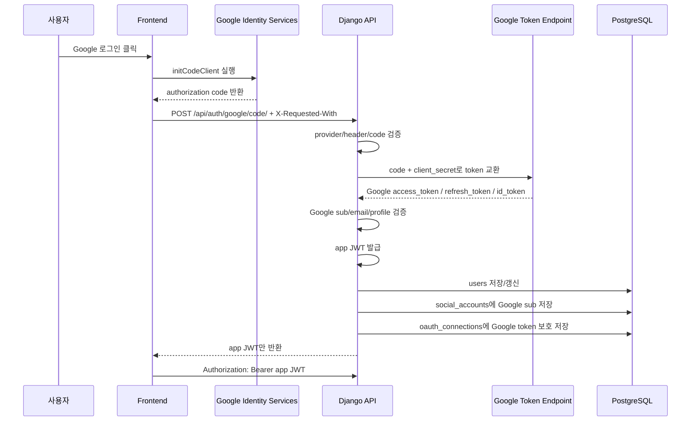

## 5. Google 인증 단계별 설명

### 5.1 Frontend는 authorization code만 받는다

프론트엔드는 `google.accounts.oauth2.initCodeClient()`를 사용한다.

이 방식에서는 브라우저가 Google access token을 직접 받지 않고 authorization code만 받는다. token exchange는 백엔드가 수행한다.

이게 필요한 이유는 브라우저에 Google token을 남기지 않기 위해서다.

### 5.2 Backend가 code를 검증하고 교환한다

백엔드 endpoint는 `POST /api/auth/google/code/`다.

요청에는 `X-Requested-With: XmlHttpRequest` 헤더가 필요하다. 이 헤더는 popup code flow 요청이 정상적인 프론트 AJAX 요청인지 구분하는 1차 경계다.

백엔드는 `GOOGLE_CLIENT_ID`, `GOOGLE_CLIENT_SECRET`, `GOOGLE_POPUP_REDIRECT_URI`를 사용해 Google token endpoint와 통신한다.

중요한 점은 `GOOGLE_CLIENT_SECRET`이 프론트로 절대 가지 않는다는 것이다.

### 5.3 Google 계정 식별은 email보다 sub 기준으로 한다

Google 응답에서 `sub`, `email`, `email_verified`, profile 정보를 확인한다.

계정 연결 기준은 email보다 Google `sub`가 더 안정적이다. email은 바뀔 수 있지만 provider subject는 Google 계정의 고유 식별자다.

그래서 `social_accounts.provider_user_id = Google sub`로 저장한다.

### 5.4 브라우저에는 app JWT만 내려준다

브라우저 응답의 `access_token`은 Google access token이 아니다.

우리 서비스가 발급한 app JWT다. 이 JWT는 우리 Django API 호출에만 사용한다.

```http
Authorization: Bearer <app JWT>
```

app JWT에는 대략 다음 정보가 들어간다.

- `iss`: 발급자
- `aud`: 대상 API
- `sub`: 우리 서비스 user id
- `jti`: auth session id
- `exp`: 만료 시각
- `provider_subject`: Google sub
- `email`, `name`

### 5.5 Google token은 backend-only로 보호 저장한다

Google access/refresh token은 `oauth_connections`에 저장한다.

저장 필드는 다음과 같다.

- `access_token_encrypted`
- `refresh_token_encrypted`
- `token_type`
- `expires_at`
- `granted_scopes`
- `revoked_at`

현재 구현은 `OAUTH_TOKEN_SECRET` 기반으로 token을 보호 문자열로 변환해 저장한다.

운영에서는 `OAUTH_TOKEN_SECRET`, `APP_JWT_SECRET`, `GOOGLE_CLIENT_SECRET`을 반드시 secret store에 둬야 한다.

## 6. Refresh / Logout 보안 시퀀스

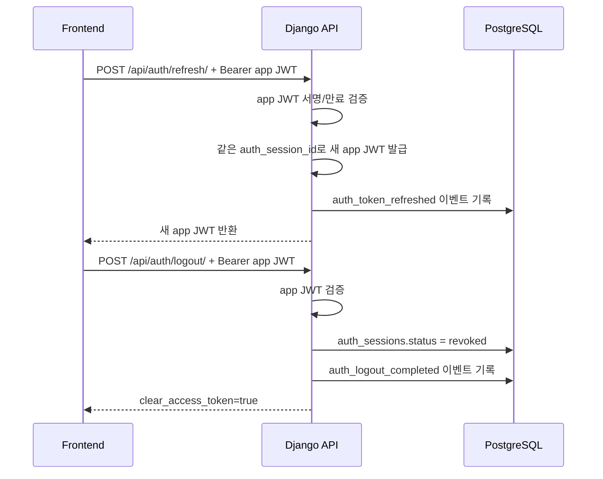

현재 정책상 refresh는 아직 유효한 app JWT가 있을 때만 가능하다.

별도의 장기 refresh token을 브라우저에 두지 않는 방식이라 MVP 보안 경계로는 단순하고 안전하다.

단, 장기적으로는 보호 endpoint마다 `auth_sessions.status`가 active인지 DB 확인을 붙이면 logout/revoke 보안이 더 강해진다.

## 7. 운영 보안 설정 체크포인트

운영에서는 아래 설정이 반드시 필요하다.

```dotenv
GOOGLE_AUTH_ALLOW_MOCK=0
APP_AUTH_ALLOW_MOCK_BEARER=0
APP_JWT_SECRET=<32자 이상 강한 secret>
OAUTH_TOKEN_SECRET=<32자 이상 강한 secret>
GOOGLE_CLIENT_ID=<Google OAuth client id>
GOOGLE_CLIENT_SECRET=<Google OAuth client secret>
GOOGLE_POPUP_REDIRECT_URI=<프론트 origin>
```

중요한 이유:

- `GOOGLE_AUTH_ALLOW_MOCK=0`: 운영에서 mock Google login 차단
- `APP_AUTH_ALLOW_MOCK_BEARER=0`: 운영에서 dev bearer token 차단
- `APP_JWT_SECRET`: app JWT 위조 방지
- `OAUTH_TOKEN_SECRET`: 저장된 Google token 보호
- `GOOGLE_CLIENT_SECRET`: backend code exchange 보안

`check_production_readiness`는 이 값들이 mock/default 상태이면 fail을 낸다.

## 8. 운영 플로우 전체 그림

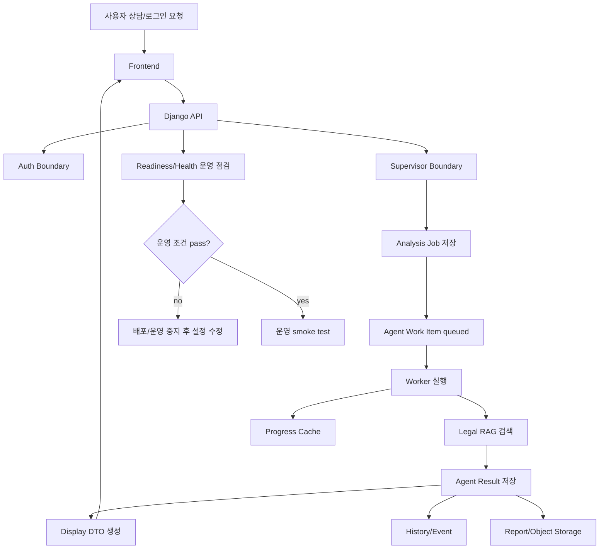

이 그림에서 중요한 점은 운영 경계가 나뉘어 있다는 것이다.

- 인증은 Auth boundary
- 판단은 Supervisor boundary
- 실행은 Worker boundary
- 근거는 RAG boundary
- 결과 표시는 Display DTO
- 운영 검증은 Readiness
- 장애 추적은 History/Event

## 9. 배포 전 Readiness 플로우

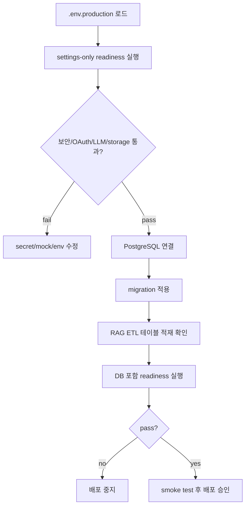

Readiness가 보는 항목:

- Django security
- Database PostgreSQL 연결
- Google OAuth non-mock 설정
- Supervisor LLM 설정
- Legal RAG vector search 설정
- Worker queue persistence
- Object storage adapter 설정

현재 사용자가 실행한 실패는 DB host 문제다.

- Docker Compose 내부: `POSTGRES_HOST=postgres`
- Windows 호스트에서 직접 `manage.py` 실행: `POSTGRES_HOST=localhost`

DB 연결이 실패하면 Legal RAG 테이블과 worker queue 테이블 introspection도 함께 실패한다.

## 10. 서비스 요청 처리 운영 시퀀스

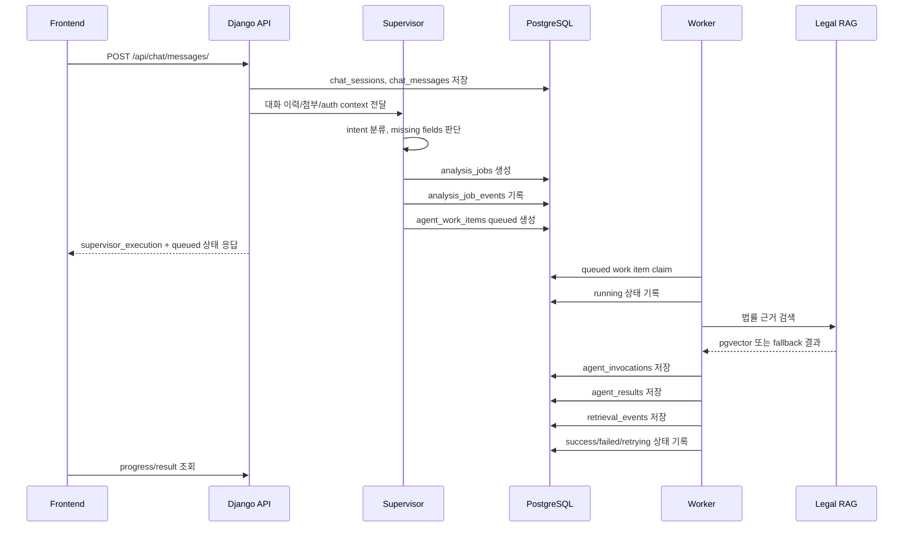

이 구조가 필요한 이유:

- Agent 실행이 오래 걸려도 API timeout을 줄일 수 있다.
- 실패한 작업을 추적할 수 있다.
- 재시도 정책을 붙일 수 있다.
- 사용자에게 진행률을 보여줄 수 있다.
- 운영자가 DB에서 병목 상태를 확인할 수 있다.

## 11. Worker Queue 상태 플로우

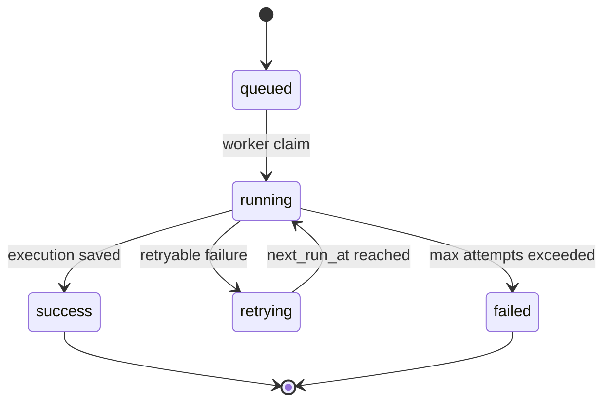

상태 의미:

| 상태 | 의미 |
|---|---|
| `queued` | Supervisor가 작업 계획을 만들었고 worker가 아직 가져가지 않음 |
| `running` | worker가 row lock으로 claim하고 실행 중 |
| `success` | Agent plan 실행과 결과 저장 완료 |
| `failed` | 재시도 불가 또는 최대 재시도 초과 |
| `retrying` | 일시 실패 후 다음 실행 시간 대기 |

운영에서 필요한 후속 작업:

- management command 1회 실행이 아니라 상시 worker/scheduler로 실행
- retry 간격과 최대 시도 횟수 정책 확정
- stuck running item 탐지
- 실패율/latency monitoring

## 12. Redis Progress Cache 운영 플로우

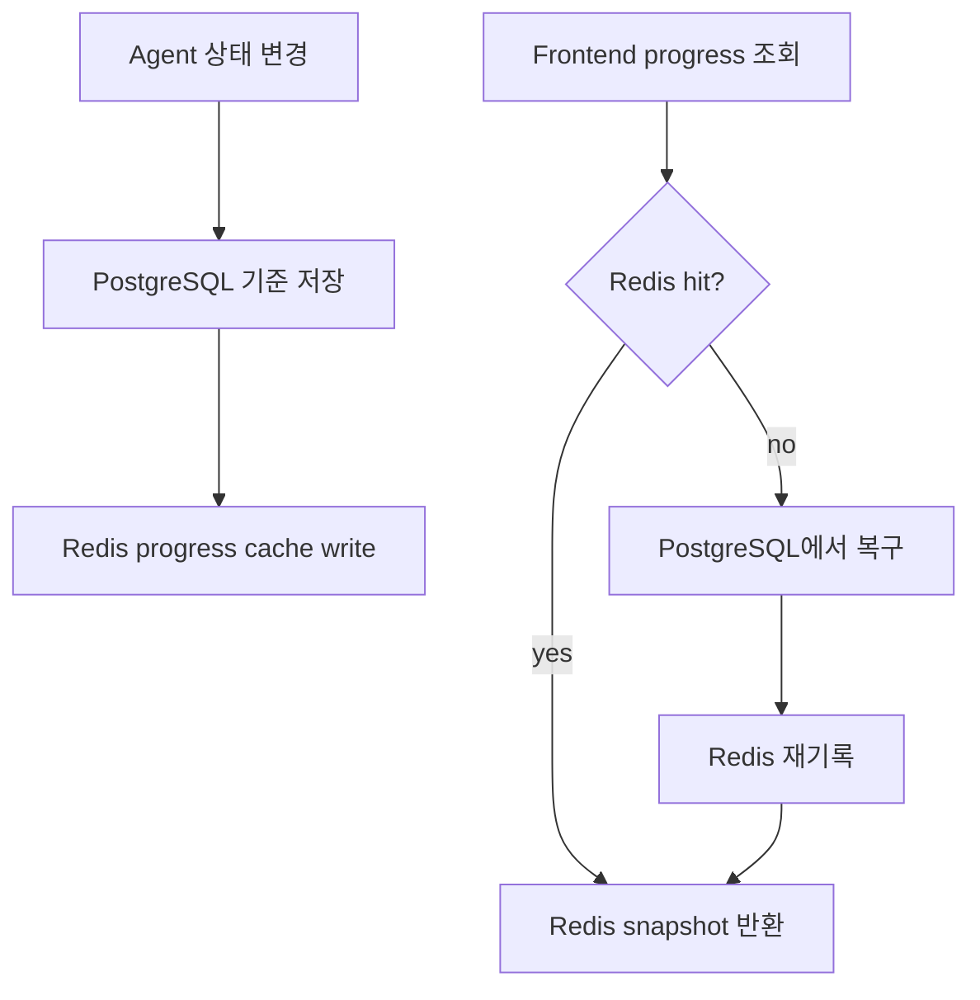

Redis는 기준 저장소가 아니다. 짧은 TTL 진행 상태 캐시다.

기준 데이터는 PostgreSQL에 남는다.

Redis에 넣는 정보:

- job status
- active node
- progress message
- analysis plan id
- status counts
- latest job status

Redis에 넣지 않는 정보:

- 사용자 원문
- OCR 원문
- prompt
- agent reasoning 전문
- raw output

이 정책이 필요한 이유는 progress polling 성능은 확보하면서 민감 원문이 cache에 퍼지는 것을 막기 위해서다.

## 13. Legal RAG 운영 플로우

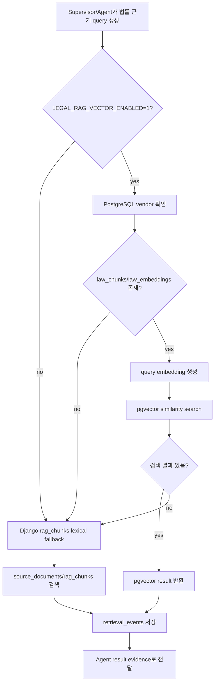

RAG 저장소는 두 계층이다.

| 경로 | 테이블 | 역할 |
|---|---|---|
| pgvector 경로 | `law_chunks`, `law_embeddings` | 법률 ETL 산출물 semantic search |
| Django fallback 경로 | `source_documents`, `rag_chunks`, `retrieval_events` | 런타임 근거 저장, fallback 검색, 감사 로그 |

이 구조가 필요한 이유:

- vector search 장애가 전체 상담 장애로 번지지 않는다.
- fallback 여부가 metadata에 남는다.
- 근거 source reference를 리포트까지 추적할 수 있다.
- 검색 품질 개선에 필요한 retrieval event가 쌓인다.

## 14. Object Storage / Report 운영 플로우

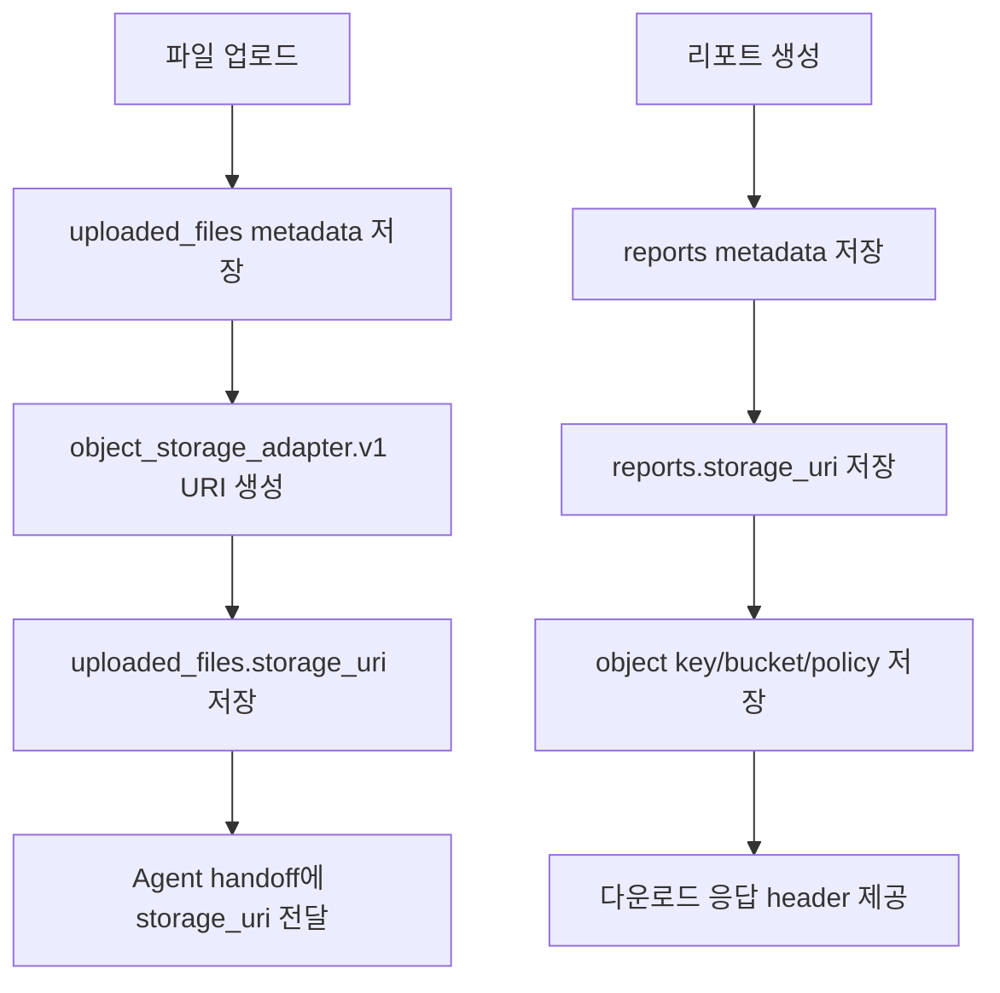

현재 단계는 metadata adapter다.

즉, 실제 binary write/read 전 단계에서 API/DB 계약을 먼저 잡아둔 것이다.

이게 필요한 이유:

- 나중에 S3/MinIO를 붙여도 DB/API 계약을 크게 바꾸지 않는다.
- mock local sidecar URI와 object storage URI를 구분한다.
- report download 권한과 object key lifecycle을 연결할 수 있다.

남은 일:

- 실제 S3/MinIO client 연결
- signed URL 발급
- upload virus scan
- OCR 원문 저장 금지 정책
- report retention lifecycle

## 15. History/Event 운영 플로우

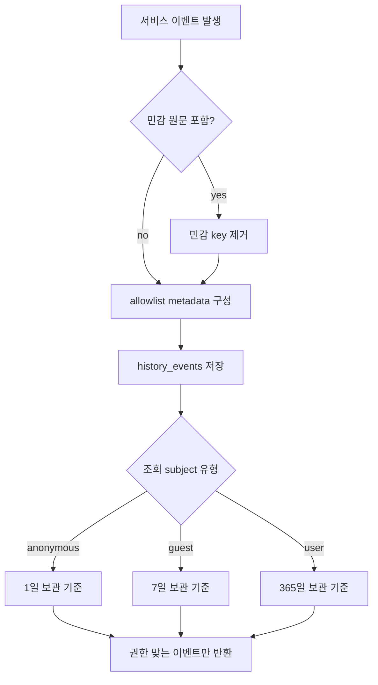

History 정책의 핵심:

- 원문 저장소가 아니다.
- 감사/요약/재상담용 표준-라이트 이벤트 저장소다.
- `user_text`, `ocr_raw`, `prompt`, `reasoning`, `raw_output`, `raw_payload`는 저장하지 않는다.
- subject별 보관 기간을 다르게 둔다.

이게 필요한 이유:

- 재상담과 My Page 이력을 제공해야 한다.
- 하지만 민감 원문과 reasoning 전문을 장기간 history에 남기면 개인정보/보안 리스크가 커진다.

## 16. Secret 관리 운영 플로우

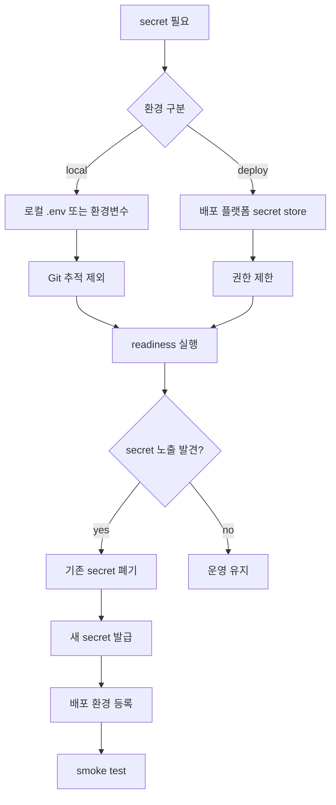

Secret 관리 원칙:

- 비밀정보는 코드, Markdown, HTML, 클라이언트 JS에 저장하지 않는다.
- `.env` 파일은 Git에 올리지 않는다.
- 운영에서는 secret store를 사용한다.
- `Authorization`, `Cookie`, token 값은 로그에 남기지 않는다.
- 오류 메시지에는 secret, 서버 경로, DB 주소를 포함하지 않는다.

## 17. 장애 대응 / 롤백 / 백업 운영 플로우

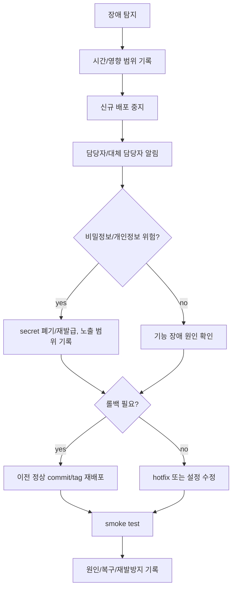

장애 등급:

| 등급 | 기준 | 대응 시간 |
|---|---|---|
| SEV-1 | 개인정보 노출, 인증 우회, 데이터 손상, 전체 장애 | 즉시 |
| SEV-2 | 핵심 기능 장애, 외부 API 장애, 일부 사용자 영향 | 1시간 이내 |
| SEV-3 | 문서 오류, 일부 화면 오류, 비핵심 기능 문제 | 영업일 기준 1일 이내 |

롤백 트리거:

- 진입 화면이 열리지 않는다.
- 핵심 정적 산출물이 누락된다.
- 비밀정보가 화면, 로그, 저장소에 노출된다.
- 개인정보가 마스킹 없이 사용자 화면에 노출된다.
- 데이터 삭제 또는 데이터 손상이 의심된다.
- 장애 담당자가 문제를 30분 안에 제한하지 못한다.

백업/복구 기준:

- 사용자 계정 데이터
- 상담 세션과 메시지
- 업로드 파일 metadata
- 리포트와 이의신청서 초안
- 감사 로그
- 운영 설정

운영 전 반드시 RTO/RPO를 정해야 한다.

## 18. 발표 마무리 멘트

이 프로젝트의 운영 플로우는 단순히 서버를 띄우는 수준이 아니다.

배포 전에는 readiness로 설정을 차단하고, 실행 중에는 worker queue와 progress cache로 상태를 추적하고, RAG와 인증 token은 감사 가능한 저장소에 남기며, 장애 시에는 incident, rollback, backup, secret rotation 절차로 피해를 제한하는 구조다.

보안 쪽에서는 Google token과 app JWT를 분리한 것이 핵심이다.

브라우저는 Google authorization code와 app JWT만 다루고, Google access/refresh token은 백엔드에서만 보호 저장한다. 그래서 Google API 연동 가능성은 유지하면서도 token 노출 위험을 백엔드 경계 안으로 줄였다.

남은 일은 이 설계를 실제 운영 환경에서 검증하는 것이다.

- `POSTGRES_HOST=localhost`로 호스트 실행 readiness 재검증
- Docker 내부에서는 `POSTGRES_HOST=postgres` 유지
- `law_chunks`, `law_embeddings` ETL 적재 확인
- worker 상시 실행 방식 결정
- Google Cloud OAuth mock off smoke test
- 실제 Agent output을 공통 envelope/display DTO로 검증
