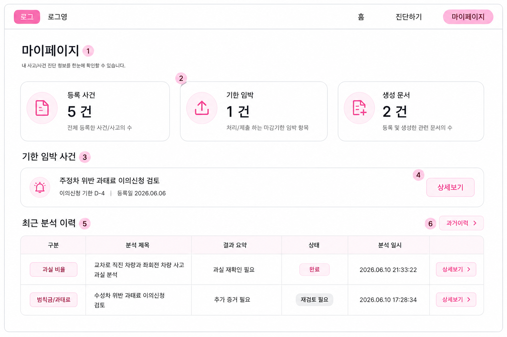
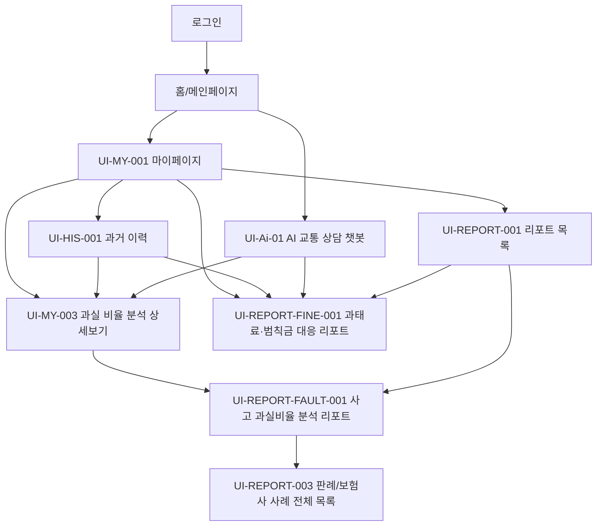

# 교통분쟁 AI 서비스 화면설계서

| 항목 | 내용 |
|---|---|
| 문서명 | 교통분쟁 AI 서비스 화면설계서 |
| 프로젝트명 | 교통분쟁 AI: 과실비율·범칙금/과태료 분석 및 리포팅 서비스 |
| 작성일 | 2026-06-18 |
| 문서 버전 | v0.2 |
| 작성 기준 | 요구사항 정의서 v0.4, 통합 화면정의서 이미지, Notion 작업 트래커 확인 결과 |
| 참조 화면 | `docs/assets/screen-design/final-screen-plan-complete-updated.png`, `docs/assets/screen-design/mypage-updated.png`, `docs/assets/screen-design/report-pages-updated.png` |
| Notion 참조 | `https://app.notion.com/p/3838137f675680cbac76c7f939aed248?v=3838137f67568004a032000ca196db55&source=copy_link` |

---

## 1. 문서 목적

본 문서는 교통분쟁 AI 서비스의 주요 MVP 화면 구조, 화면별 표시 데이터, 사용자 액션, 진입 경로, 요구사항 매핑을 정의한다.

현재 화면설계서의 목적은 프론트엔드 구현자가 화면 구조를 추측하지 않고, 요구사항 정의서와 화면정의서 이미지 기준으로 마이페이지, 챗봇, 과거 이력, 분석 상세보기, 리포트 목록, 판례/보험사 사례 목록, 과실비율 리포트, 과태료·범칙금 대응 리포트 화면을 구현할 수 있도록 하는 것이다.

Notion 작업 트래커는 화면 자체의 상세 UI 원본이 아니라, 관련 데이터/RAG/문서 작업 진행상태를 확인하는 보조 근거로만 사용한다.

---

## 2. 한글 표시 및 인코딩 기준

| 항목 | 기준 |
|---|---|
| 파일 인코딩 | 모든 문서와 프론트엔드 소스는 UTF-8로 저장한다. |
| HTML 인코딩 | `<meta charset="UTF-8">`을 명시한다. |
| 기본 언어 | HTML 루트에 `lang="ko"`를 사용한다. |
| 권장 폰트 | `Pretendard`, `Noto Sans KR`, `Apple SD Gothic Neo`, `Malgun Gothic`, `sans-serif` 순서로 지정한다. |
| 깨짐 방지 | API 응답, DB 저장, CSV/JSON 입출력, Markdown 문서 모두 UTF-8을 유지한다. |
| 표기 원칙 | 화면명, 버튼명, 상태명, 분석 결과 라벨은 한글 원문을 기준으로 한다. |

---

## 3. 확인 근거

### 3.1 통합 화면정의서 이미지 확인 결과

통합 화면정의서 이미지에서 확인된 화면은 아래 8개이다.

| 구분 | 화면정의서 화면 | 화면정의서 Screen ID | 요구사항 매핑 | 반영 상태 | 후속 조치 |
|---|---|---|---|---|---|
| 1 | 마이페이지 | `UI-MY-001 (Updated)` | `UI-MY-001`, `REQ-MY-001~007` | 등록 사건, 기한 임박, 생성 문서, 최근 분석 이력 구조 반영 | 확정 반영 |
| 2 | AI 교통 상담 챗봇 | `UI-Ai-01` | `UI-CHAT-001`, `UI-CHAT-002`, `REQ-CHAT-001~004` | 대화 목록, 챗봇 대화창, 분석 결과 카드, 추천 키워드, 입력창 구조 반영 | 요구사항 정의서의 `UI-CHAT-*`와 화면정의서 ID 체계 정리 필요 |
| 3 | 과실 비율 분석 상세보기 | `UI-MY-003 (Rev.)` | `UI-MY-003`, `REQ-FAULT-001~008` | 분석 요약, 사고 정보, 업로드 자료, AI 분석 요약, 핵심 쟁점, 후속 행동 구조 반영 | 과실비율 리포트와 진입/표시 책임 분리 필요 |
| 4 | 과거 이력 | `UI-MY-001 (Rev.)` | `UI-HIS-001`, `REQ-HIS-001~008` | 유형/기간/검색 필터와 분석 이력 표 구조 반영 | 화면정의서 원본 ID와 요구사항 ID 불일치 정리 필요 |
| 5 | 리포팅 목록 | `UI-RP-list-01` | `UI-REPORT-001`, `REQ-REPORT-008~009` | 검색, 기간 선택, 유형 필터, 리포트 목록 표, 페이지네이션 구조 반영 | API 정의서에서 리포트 목록 조회 조건 확정 필요 |
| 6 | 판례/보험사 사례 전체 목록 | 화면정의서 이미지 기준 | `UI-REPORT-003`, `REQ-REPORT-007` | 전체 사례 목록, 보험사 사례 필터, 선택 사례 상세, PDF 다운로드/원문 보기 구조 반영 | 판례/보험사 사례 데이터 출처와 원문 링크 제공 범위 확정 필요 |
| 7 | 사고 과실비율 분석 리포트 | `UI-REPORT-FAULT-001` | `UI-REPORT-002`, `REQ-REPORT-002~004`, `REQ-FAULT-003~008` | 사고 개요, 제출 자료, AI 분석 결과, 판단 근거, 핵심 쟁점, 유사 판례, 후속 조치 반영 | 확정 반영 |
| 8 | 과태료·범칙금 대응 리포트 | `UI-REPORT-FINE-001` | `UI-MY-004`, `REQ-FINE-001~013`, `REQ-REPORT-005~006` | OCR, 처분 결과, 이의제기 가능성, 필요 증거, 법령/판례, 예상 결과, 이의신청서 초안 반영 | 확정 반영 |

### 3.2 Notion 작업 트래커 확인 결과

Notion 공개 작업 트래커에서 확인한 관련 작업은 아래와 같다.

| 작업 | 상태 | 우선순위 | 설명 | 화면설계 반영 |
|---|---|---|---|---|
| ML-RAG 시퀀스다이어그램 | 완료 | 낮음 | 담당 영역 시퀀스다이어그램 작성 | 챗봇/RAG/리포트 흐름의 보조 근거로 사용 가능 |
| 데이터 수집 목록 정리 | 상태 미입력 | 보통 | 모은 텍스트 데이터 전처리 준비 겸 목록 정리 | 데이터 출처 목록은 확정 전이므로 화면에는 빈/부분 상태 처리가 필요 |
| 보험 약관 데이터 수집 | 진행 중 | 보통 | 11개 보험 약관 데이터 수집 진행 중 | 보험 챗봇, 과실비율 리포트, 보험사 사례 영역은 진행 중 데이터 상태를 고려 |
| 판례 데이터 수집 | 진행 중 | 보통 | 불필요한 문서가 확인되어 수정 중 | 판례/보험사 사례 전체 목록은 검색 결과 없음, 일부 결과, 원문 링크 없음 상태를 처리 |
| 법령 데이터 수집(api) | 완료 | 보통 | 법령, 시행령, 시행 규칙 총 23개 수집 완료 | 과태료·범칙금 대응 리포트의 관련 법령 영역에 우선 연결 가능 |
| 프로젝트 범위와 요구사항 정의서 정리 | 완료 | 보통 | 프로젝트 역할, MVP 범위, 담당자 매트릭스, 요구사항 정의서, AI-Hub 데이터 활용 리포트 작성 | 요구사항 정의서 v0.4 기준 유지 |

### 3.3 요구사항 정의서 후속 업데이트 필요 항목

| 항목 | 현재 요구사항 정의서 표현 | 화면설계서 기준 권장 표현 |
|---|---|---|
| `UI-REPORT-002` 화면명 | 리포팅 상세 분석 | 사고 과실비율 분석 리포트 |
| `UI-MY-004` 화면명 | 과태료/범칙금 분석 상세보기 | 과태료·범칙금 대응 리포트 |
| 챗봇 화면 ID | `UI-CHAT-001`, `UI-CHAT-002` | 화면정의서 이미지의 `UI-Ai-01`과 매핑 관계 확정 |
| 과거 이력 화면 ID | `UI-MY-002` 또는 화면정의서 이미지의 `UI-MY-001 (Rev.)` | 문서에서는 `UI-HIS-001`로 분리 관리하되 최종 ID 확정 필요 |
| 과실비율 분석 상세보기와 리포트 | 상세보기와 리포팅 상세 분석이 혼재 | 상세보기 `UI-MY-003`, 리포트 `UI-REPORT-FAULT-001`로 역할 분리 |
| 판례/보험사 사례 목록 | `UI-REPORT-003` | 전체 목록, 좌측 목록, 우측 상세, PDF 다운로드/원문 보기 구조 명시 |

---

## 4. 전체 화면 목록

| Screen ID | 화면명 | 설명 | MVP 포함 | 참조 이미지 |
|---|---|---|---|---|
| `UI-MY-001` | 마이페이지 | 사용자 분석 현황, 기한 임박 사건, 최근 분석 이력 요약 | 포함 | `final-screen-plan-complete-updated.png`, `mypage-updated.png` |
| `UI-Ai-01` | AI 교통 상담 챗봇 | 교통사고, 과실비율, 범칙금/과태료 상담 대화와 분석 카드 제공 | 포함 | `final-screen-plan-complete-updated.png` |
| `UI-HIS-001` | 과거 이력 | 분석 이력 목록, 유형/기간/검색 필터, 상세 진입 | 포함 | `final-screen-plan-complete-updated.png` |
| `UI-MY-003` | 과실 비율 분석 상세보기 | 과실비율 분석 이력의 상세 요약과 후속 행동 표시 | 포함 | `final-screen-plan-complete-updated.png` |
| `UI-REPORT-001` | 리포트 목록 | 생성된 리포트 목록, 검색, 필터, 상세 진입 | 포함 | `final-screen-plan-complete-updated.png` |
| `UI-REPORT-003` | 판례/보험사 사례 전체 목록 | 관련 판례/보험사 사례 검색, 목록, 선택 상세, PDF/원문 액션 | 포함 | `final-screen-plan-complete-updated.png` |
| `UI-REPORT-FAULT-001` | 사고 과실비율 분석 리포트 | 과실비율 분석 결과와 후속 조치 리포트 | 포함 | `final-screen-plan-complete-updated.png`, `report-pages-updated.png` |
| `UI-REPORT-FINE-001` | 과태료·범칙금 대응 리포트 | 과태료·범칙금 OCR 분석, 이의제기 판단, 이의신청서 초안 | 포함 | `final-screen-plan-complete-updated.png`, `report-pages-updated.png` |

---

## 5. 공통 화면 구조

### 5.1 상단 내비게이션

| 영역 | 표시 내용 | 동작 |
|---|---|---|
| 로고 | `로그` 버튼, 서비스명 `교통분쟁 AI` | 클릭 시 홈으로 이동 |
| 홈 | `홈` | 홈 화면으로 이동 |
| 진단하기 | `진단하기` | 진단 시작 화면으로 이동 |
| 마이페이지 | `마이페이지` 버튼 | 마이페이지로 이동, 현재 화면이면 활성 상태 표시 |

### 5.2 공통 버튼 규칙

| 버튼 유형 | 표현 | 동작 |
|---|---|---|
| 주요 이동 | 분홍색 배경 또는 분홍색 테두리 버튼 | 상세보기, 마이페이지, PDF 저장 등 핵심 액션 |
| 보조 이동 | 흰색 배경, 회색 테두리 | 더 많은 판례 보기, 관련 법령 더보기, 원문 보기 등 보조 액션 |
| 상태 표시 | 배지 또는 칩 | 완료, 재검토 필요, 높음, 분석 완료, 진행 중 등 |
| 다운로드 | 아이콘과 텍스트 조합 | PDF, DOCX, 이의신청서 다운로드 |

### 5.3 공통 상태

| 상태 | 표시 기준 |
|---|---|
| 로딩 | 카드 또는 표 영역에 스켈레톤 UI를 표시한다. |
| 빈 데이터 | 분석 이력, 리포트, 판례/보험사 사례가 없을 경우 빈 상태 문구와 다음 액션을 제공한다. |
| 오류 | 데이터 조회 실패 시 재시도 버튼과 오류 안내 문구를 표시한다. |
| 권한 없음 | 로그인하지 않은 사용자는 로그인 화면으로 이동한다. |
| 데이터 수집 진행 중 | Notion 기준 보험 약관/판례 데이터가 진행 중이므로 일부 목록은 `수집 중`, `결과 없음`, `원문 준비 중` 상태를 표시할 수 있어야 한다. |

---

## 6. UI-MY-001 마이페이지

### 6.1 화면 목적

사용자가 본인의 사고/사건 진단 현황을 한눈에 확인하고, 기한 임박 사건 또는 최근 분석 이력의 상세 화면으로 빠르게 이동할 수 있도록 한다.

### 6.2 진입 경로

| 경로 | 설명 |
|---|---|
| 상단 내비게이션 `마이페이지` | 로그인 후 어느 화면에서든 진입 가능 |
| 로그인 후 기본 이동 | 기존 사용자는 로그인 후 마이페이지로 이동 가능 |
| 분석 완료 후 이동 | 분석 완료 후 결과 저장 시 마이페이지에서 이력 확인 가능 |

### 6.3 화면 구성

| 번호 | 영역 | 표시 내용 | 요구사항 매핑 |
|---|---|---|---|
| 1 | 상단 내비게이션 | 로고, 홈, 진단하기, 마이페이지 | 공통 |
| 2 | 요약 카드 | 등록 사건, 기한 임박, 생성 문서 | `REQ-MY-002~004` |
| 3 | 기한 임박 사건 | 사건명, 마감 D-day, 등록일, 상세보기 버튼 | `REQ-MY-005` |
| 4 | 최근 분석 이력 | 구분, 분석 제목, 결과 요약, 상태, 분석 일시, 상세보기 | `REQ-MY-006`, `REQ-HIS-005` |
| 5 | 과거이력 이동 | 전체 과거 이력 화면으로 이동하는 버튼 | `REQ-MY-007` |

### 6.4 사용자 액션

| 액션 | 트리거 | 결과 |
|---|---|---|
| 기한 임박 사건 상세보기 | 기한 임박 카드의 `상세보기` 클릭 | 해당 사건 유형에 맞는 상세/리포트 화면으로 이동 |
| 최근 분석 상세보기 | 테이블 행의 `상세보기` 클릭 | 과실비율이면 `UI-MY-003` 또는 `UI-REPORT-FAULT-001`, 과태료·범칙금이면 `UI-REPORT-FINE-001`로 이동 |
| 과거이력 이동 | `과거이력` 버튼 클릭 | `UI-HIS-001`로 이동 |

### 6.5 예외 및 빈 상태

| 상황 | 화면 처리 |
|---|---|
| 등록 사건 없음 | 요약 카드는 `0건`, 최근 분석 이력에는 빈 상태와 진단하기 버튼 표시 |
| 기한 임박 사건 없음 | 기한 임박 사건 카드 대신 `기한 임박 사건이 없습니다.` 표시 |
| 최근 분석 이력 없음 | `최근 분석 이력이 없습니다.` 표시 |
| 조회 실패 | 마이페이지 데이터 조회 실패 안내와 재시도 버튼 표시 |

---

## 7. UI-Ai-01 AI 교통 상담 챗봇

### 7.1 화면 목적

사용자가 교통사고, 과실비율, 범칙금/과태료 관련 질문을 입력하고, 챗봇 응답과 분석 결과 카드를 통해 다음 행동 또는 상세 리포트로 이동할 수 있도록 한다.

### 7.2 진입 경로

| 경로 | 설명 |
|---|---|
| 홈 또는 메인페이지 `챗봇` | AI 교통 상담 챗봇 메인 화면으로 이동 |
| 진단하기 또는 상담 진입점 | 사고/범칙금 질문 흐름으로 진입 |
| 과거 대화 목록 | 기존 대화방을 선택해 대화 내용을 재조회 |

### 7.3 화면 구성

| 번호 | 영역 | 표시 내용 | 요구사항 매핑 |
|---|---|---|---|
| 1 | 대화 목록 사이드바 | 과거 챗봇 상담 이력, 제목, 마지막 대화 요약, 대화 시간 | `REQ-CHAT-001~002` |
| 2 | 챗봇 대화창 | 사용자 질문, AI 응답, 상황 분석 안내 | `REQ-CHAT-001~004` |
| 3 | 분석 결과 카드 | 교통사고 요약 카드, 과실비율 카드, 범칙금/과태료 카드 | `REQ-CHAT-003`, `REQ-REPORT-001` |
| 4 | 상세/근거 버튼 | `상세 보기`, `근거 보기` 등 상세 화면 이동 버튼 | `REQ-REPORT-007` |
| 5 | 유의사항 | 실제 상황에 따라 달라질 수 있다는 안내와 추가 자료 요청 | `NFR-009` |
| 6 | 메시지 입력창 | 텍스트 입력, 파일 첨부 버튼, 전송 버튼 | `REQ-CHAT-001~002` |
| 7 | 상단 제어 | 새 대화 시작, 사용자 프로필 또는 세션 관리 버튼 | 공통 |

### 7.4 표시 데이터

| 데이터 | 예시 | 비고 |
|---|---|---|
| 대화 제목 | `교통사고 과실비율 문의` | 사용자의 첫 질문 또는 자동 요약 |
| 대화 요약 | `직진 중 좌회전 차량과 사고` | 목록에 노출 |
| AI 응답 | 분석 결과 요약, 추가 질문 요청 | 근거 포함 답변 필요 |
| 분석 카드 유형 | 교통사고, 과실비율, 범칙금/과태료 | 카드별 상세 화면이 다름 |
| 추천 키워드 | 블랙박스 영상, 현장 사진, 신호위반 등 | 버튼 형태로 제공 가능 |

### 7.5 사용자 액션

| 액션 | 트리거 | 결과 |
|---|---|---|
| 대화 선택 | 좌측 대화 목록 클릭 | 해당 대화방으로 전환 |
| 새 대화 시작 | `새 대화 시작` 클릭 | 새 상담 세션 생성 |
| 상세 보기 | 분석 카드의 `상세 보기` 클릭 | 과실비율 상세, 범칙금 상세, 리포트 화면으로 이동 |
| 근거 보기 | 과실비율 카드의 `근거 보기` 클릭 | 근거 팝업 또는 관련 사례 화면으로 이동 |
| 파일 첨부 | 입력창 첨부 버튼 클릭 | 현장 사진, 블랙박스 영상 등 첨부 |

### 7.6 예외 및 빈 상태

| 상황 | 화면 처리 |
|---|---|
| 대화 이력 없음 | `아직 상담 이력이 없습니다.`와 새 대화 시작 버튼 표시 |
| RAG 검색 결과 부족 | 근거 부족 안내와 추가 자료 요청 문구 표시 |
| 파일 업로드 실패 | 업로드 실패 안내와 재시도 버튼 표시 |
| 응답 생성 실패 | 답변 생성 실패 안내와 다시 보내기 버튼 표시 |

---

## 8. UI-HIS-001 과거 이력

### 8.1 화면 목적

사용자가 지금까지 진행한 분석 내역을 유형, 기간, 검색어로 조회하고, 결과를 다시 검토하거나 상세보기로 이동할 수 있도록 한다.

### 8.2 진입 경로

| 경로 | 설명 |
|---|---|
| 마이페이지 `과거이력` | 마이페이지에서 전체 분석 이력 목록으로 이동 |
| 상단 내비게이션 또는 메뉴 | 로그인 후 이력 메뉴에서 이동 |

### 8.3 화면 구성

| 번호 | 영역 | 표시 내용 | 요구사항 매핑 |
|---|---|---|---|
| 1 | 상단 내비게이션 | 로고, 홈, 진단하기, 마이페이지 | 공통 |
| 2 | 페이지 제목 | `최근 분석 이력`, 안내 문구 | `REQ-HIS-001` |
| 3 | 필터/검색 | 유형 드롭다운, 기간 드롭다운, 검색 입력창 | `REQ-HIS-002~004` |
| 4 | 분석 이력 표 | 구분, 분석 제목, 결과 요약, 상태, 분석 일시, 상세보기 | `REQ-HIS-005~006` |
| 5 | 페이지네이션 | 현재 페이지, 이전/다음 버튼 | `REQ-HIS-007` |

### 8.4 표시 데이터

| 데이터 | 예시 | 비고 |
|---|---|---|
| 유형 | 전체, 과실 비율, 범칙금/과태료 | 화면정의서 이미지 기준 |
| 기간 | 최근 1개월 등 | 기본값 확정 필요 |
| 상태 | 완료, 재검토 필요 | 상태 배지로 표시 |
| 상세보기 | `보기` 또는 `상세보기` 버튼 | 분석 유형에 따라 이동 대상 분기 |

### 8.5 사용자 액션

| 액션 | 트리거 | 결과 |
|---|---|---|
| 유형 필터 | 유형 드롭다운 변경 | 해당 유형의 이력만 표시 |
| 기간 필터 | 기간 드롭다운 변경 | 해당 기간의 이력만 표시 |
| 키워드 검색 | 검색어 입력 후 검색 | 분석 제목 또는 키워드 기준 검색 |
| 상세보기 | 표 행의 상세 버튼 클릭 | 과실비율 상세 또는 과태료·범칙금 리포트로 이동 |

### 8.6 예외 및 빈 상태

| 상황 | 화면 처리 |
|---|---|
| 조건에 맞는 이력 없음 | `조건에 맞는 분석 이력이 없습니다.` 표시 |
| 검색어 없음 | 전체 또는 현재 필터 조건의 목록 표시 |
| 조회 실패 | 조회 실패 안내와 재시도 버튼 표시 |

---

## 9. UI-MY-003 과실 비율 분석 상세보기

### 9.1 화면 목적

사용자가 과거 이력에서 선택한 과실비율 분석 결과를 리포트 생성 전 상세 요약 형태로 확인하고, 핵심 쟁점과 후속 행동을 검토할 수 있도록 한다.

### 9.2 진입 경로

| 경로 | 설명 |
|---|---|
| 마이페이지 최근 분석 이력 | 과실비율 분석 항목의 상세보기 클릭 |
| 과거 이력 | 과실비율 분석 이력의 상세보기 클릭 |
| 챗봇 분석 결과 카드 | 과실비율 카드의 상세보기 클릭 |

### 9.3 화면 구성

| 번호 | 영역 | 표시 내용 | 요구사항 매핑 |
|---|---|---|---|
| 1 | 분석 요약 카드 | 사고 제목, 분석 일시, 분석 유형, 이의제기 가능성 또는 판단 라벨 | `REQ-FAULT-001~002` |
| 2 | 사고 정보 요약 | 사고 일시, 사고 장소, 사고 상황, 기상/도로 조건 | `REQ-FAULT-003` |
| 3 | 업로드 자료 | 블랙박스 영상, 현장 사진, 경찰 조사서, 기타 자료 | `REQ-FAULT-004` |
| 4 | AI 분석 요약 | 사고 상황 요약, 종합 판단, 신뢰도 | `REQ-FAULT-005` |
| 5 | 핵심 쟁점 | 신호 확인, 좌회전 시점, 직진 차량 주의의무 등 태그 | `REQ-FAULT-006` |
| 6 | 관련 기준/유사 사례 | 관련 법령, 보험사 사례, 판례 요약 | `REQ-FAULT-007` |
| 7 | 후속 행동 | 추가 자료 확보, 이의제기 검토 등 | `REQ-FAULT-008` |

### 9.4 표시 정책

| 항목 | 기준 |
|---|---|
| 과실비율 상세보기 결과 | 요구사항 정의서 기준으로 정성 라벨 중심으로 표시한다. |
| 수치 과실비율 | 리포트 화면에서 도넛 차트 또는 비율 카드로 표시할 수 있다. |
| 주의 문구 | 실제 판단과 다를 수 있으며 추가 자료에 따라 결과가 달라질 수 있음을 표시한다. |

### 9.5 사용자 액션

| 액션 | 트리거 | 결과 |
|---|---|---|
| 리포트 보기 또는 생성 | 리포트 관련 버튼 클릭 | `UI-REPORT-FAULT-001`로 이동 |
| 추가 증거 확인 | 후속 행동 카드 클릭 | 업로드 또는 체크리스트 화면으로 이동 |
| 관련 사례 보기 | 유사 사례 영역 클릭 | `UI-REPORT-003`으로 이동 |

---

## 10. UI-REPORT-001 리포트 목록

### 10.1 화면 목적

AI 분석을 통해 생성된 교통사고, 과실비율, 범칙금/과태료 리포트를 목록으로 확인하고, 검색/필터 후 상세 화면으로 이동할 수 있도록 한다.

### 10.2 진입 경로

| 경로 | 설명 |
|---|---|
| 마이페이지 | 생성 문서 또는 리포트 목록 진입점 클릭 |
| 분석 완료 후 | 리포트 생성 완료 후 목록으로 이동 |
| 상단 또는 사이드 메뉴 | 리포트 목록 메뉴에서 이동 |

### 10.3 화면 구성

| 번호 | 영역 | 표시 내용 | 요구사항 매핑 |
|---|---|---|---|
| 1 | 페이지 제목 | `리포트 목록`, 안내 문구 | `REQ-REPORT-008~009` |
| 2 | 검색 | 리포트 제목, 사고 유형, 차량 정보 검색 | `REQ-REPORT-009` |
| 3 | 기간 선택 | 리포트 생성 또는 사고 일시 기준 기간 선택 | `REQ-REPORT-009` |
| 4 | 유형 필터 | 전체, 교통사고, 과실비율, 범칙금/과태료, 과태료 이의신청, 기타 | `REQ-REPORT-001` |
| 5 | 리포트 목록 표 | 리포트 제목, 유형, 사고 일시, 생성 일시, 분석 상태, 과실비율 또는 결과 요약, 액션 | `REQ-REPORT-008~009` |
| 6 | 페이지네이션 | 페이지 번호, 페이지 크기 선택 | `REQ-HIS-007` |

### 10.4 사용자 액션

| 액션 | 트리거 | 결과 |
|---|---|---|
| 리포트 검색 | 검색어 입력 | 조건에 맞는 리포트 목록 표시 |
| 기간 필터 | 기간 선택 | 해당 기간 리포트만 표시 |
| 유형 필터 | 칩 또는 버튼 클릭 | 선택 유형 리포트만 표시 |
| 상세보기 | 목록 행 액션 클릭 | 리포트 유형에 따라 `UI-REPORT-FAULT-001` 또는 `UI-REPORT-FINE-001`로 이동 |
| 다운로드 | 다운로드 액션 클릭 | PDF 또는 DOCX 다운로드 |

### 10.5 예외 및 빈 상태

| 상황 | 화면 처리 |
|---|---|
| 생성된 리포트 없음 | `생성된 리포트가 없습니다.`와 진단하기 버튼 표시 |
| 조건에 맞는 리포트 없음 | `검색 조건에 맞는 리포트가 없습니다.` 표시 |
| 다운로드 실패 | 다운로드 실패 안내와 재시도 버튼 표시 |

---

## 11. UI-REPORT-003 판례/보험사 사례 전체 목록

### 11.1 화면 목적

사용자가 과실비율 리포트 또는 분석 상세에서 연결된 판례/보험사 사례를 전체 목록으로 확인하고, 선택한 사례의 상세 근거를 검토할 수 있도록 한다.

### 11.2 진입 경로

| 경로 | 설명 |
|---|---|
| 과실비율 리포트 | 유사 판례 영역의 더보기 또는 상세보기 클릭 |
| 과실비율 분석 상세보기 | 관련 기준 및 유사 사례 영역 클릭 |
| 챗봇 근거 보기 | 챗봇 분석 카드의 근거 보기 클릭 |

### 11.3 화면 구성

| 번호 | 영역 | 표시 내용 | 요구사항 매핑 |
|---|---|---|---|
| 1 | 뒤로가기/제목 | `사고 리포트로 돌아가기`, `판례/보험사 사례 전체 목록` | `REQ-REPORT-007` |
| 2 | 전체 사례 목록 | 판례/보험사 사례 탭, 검색, 필터, 사례 카드 목록 | `REQ-REPORT-007` |
| 3 | 선택 사례 상세 | 사례 ID, 제목, 판결/결정일, 사건번호, 사고 개요, 판정 판단, 과실비율, 관련 법령, 참고 사항 | `REQ-FAULT-007` |
| 4 | 문서 액션 | PDF 다운로드, 원문 보기 | `REQ-REPORT-007` |

### 11.4 표시 데이터

| 데이터 | 예시 | 비고 |
|---|---|---|
| 사례 ID | `CASE-001`, `INS-001` | 데이터 출처별 prefix 사용 가능 |
| 출처 유형 | 판례, 보험사 사례 | 필터 기준 |
| 과실비율 | 원고/피고 또는 차량별 비율 | 사례 원문 기준 |
| 관련 법령 | 도로교통법 등 | Notion 기준 법령 데이터 수집 완료 항목 우선 연결 가능 |
| 원문 링크 | PDF 다운로드, 원문 보기 | 판례/보험사 사례 데이터 수집 진행상태에 따라 없을 수 있음 |

### 11.5 사용자 액션

| 액션 | 트리거 | 결과 |
|---|---|---|
| 사례 검색 | 키워드 입력 | 사례명, 키워드, 사건번호 기준 검색 |
| 출처 필터 | 판례/보험사 사례 탭 선택 | 선택 출처만 표시 |
| 사례 선택 | 좌측 사례 카드 클릭 | 우측 상세 영역에 사례 상세 표시 |
| PDF 다운로드 | `PDF 다운로드` 클릭 | 선택 사례 문서 다운로드 |
| 원문 보기 | `원문 보기` 클릭 | 외부 원문 또는 내부 원문 상세로 이동 |

### 11.6 예외 및 빈 상태

| 상황 | 화면 처리 |
|---|---|
| 판례 데이터 수집 진행 중 | `판례 데이터 수집 중입니다.` 또는 일부 결과만 표시 |
| 원문 링크 없음 | `원문 링크 준비 중` 상태 표시 |
| 검색 결과 없음 | `조건에 맞는 사례가 없습니다.` 표시 |
| 문서 다운로드 실패 | 다운로드 실패 안내와 재시도 버튼 표시 |

---

## 12. UI-REPORT-FAULT-001 사고 과실비율 분석 리포트

### 12.1 화면 목적

사용자가 사고 과실비율 분석 결과를 리포트 형태로 확인하고, 사고 개요, 제출 자료, AI 분석 결과, 판단 근거, 핵심 쟁점, 유사 판례, 후속 조치를 한 화면에서 검토할 수 있도록 한다.

### 12.2 진입 경로

| 경로 | 설명 |
|---|---|
| 마이페이지 최근 분석 이력 | 과실비율 분석 항목의 `상세보기` 클릭 |
| 과거 이력 | 과실비율 분석 이력의 상세 진입 |
| 리포트 목록 | 과실비율 리포트 상세 진입 |
| 챗봇 상세보기 | 보험/과실비율 챗봇 응답에서 리포트 상세 이동 |

### 12.3 화면 구성

| 번호 | 영역 | 표시 내용 | 요구사항 매핑 |
|---|---|---|---|
| 1 | 사고 개요 | 사고 유형, 사고 일시, 사고 장소, 기상/도로, 사고 상황 | `REQ-FAULT-003`, `REQ-REPORT-002` |
| 2 | 제출 자료 현황 | 블랙박스 영상, 현장 사진, 경찰 조사서, 기타 자료 | `REQ-FAULT-004`, `REQ-REPORT-003` |
| 3 | AI 분석 결과 | 예상 과실비율, 도넛 차트, 신뢰도, 안내 문구 | `REQ-REPORT-004` |
| 4 | 판단 근거 | 좌회전 차량 진입, 직진 차량 우선권, 도로교통법 적용 등 | `REQ-REPORT-002` |
| 5 | 핵심 쟁점 | 신호 확인 필요, 좌회전 시점 판단, 직진 차량 주의의무, 블랙박스 화질 보통, 추가 증거 필요 | `REQ-FAULT-006`, `REQ-REPORT-003` |
| 6 | 유사 판례 | 사건 번호, 사고 유형, 주요 내용, 과실비율, 판결/결정, 상세보기 | `REQ-FAULT-007`, `REQ-REPORT-007` |
| 7 | 후속 조치 | 추가 자료 확보, 이의제기 검토, 결과 모니터링 | `REQ-FAULT-008`, `REQ-REPORT-003` |

### 12.4 표시 데이터

| 데이터 | 예시 | 비고 |
|---|---|---|
| 화면 제목 | `사고 과실비율 분석 리포트` | 기존 `리포팅 상세 분석`보다 구체화된 화면명 |
| 분석 일시 | `2026.06.16 17:28` | 리포트 생성 또는 분석 완료 일시 |
| 분석 유형 | `과실 비율 분석` | 이력 유형과 동일하게 관리 |
| 사고 유형 | `교차로 직진 차량과 좌회전 차량 사고` | 사용자가 입력한 사고 유형 또는 AI 요약 |
| 제출 자료 | `블랙박스 영상 1개 파일`, `현장 사진 6장` 등 | 파일 유형별 개수 표시 |
| 예상 과실비율 | `직진 차량 20%`, `좌회전 차량 80%` | 실제 판단과 다를 수 있다는 안내 필수 |
| 신뢰도 | `92%` | 모델/Agent 결과 기반 |
| 유사 판례 | `CASE-001` 등 | 상세보기로 판례/보험사 사례 상세 이동 |

### 12.5 사용자 액션

| 액션 | 트리거 | 결과 |
|---|---|---|
| 유사 판례 상세보기 | 유사 판례 표의 `상세 보기` 클릭 | 판례 또는 보험사 사례 상세 화면으로 이동 |
| 더 많은 판례 보기 | `더 많은 판례 보기` 클릭 | `UI-REPORT-003`으로 이동 |
| 후속 조치 검토 | 후속 조치 카드 확인 | 사용자가 추가 자료 확보 또는 이의제기 검토 여부 판단 |

### 12.6 주의 문구

| 위치 | 문구 기준 |
|---|---|
| AI 분석 결과 하단 | `본 분석 결과는 제출된 자료와 AI 모델을 기반으로 산출되며, 실제 판단과 다를 수 있습니다.` |
| 첨부 자료 하단 | `첨부 자료의 분석 결과는 AI 기반 분석으로, 실제 사실과 다를 수 있으므로 참고용으로 활용해주세요.` |

---

## 13. UI-REPORT-FINE-001 과태료·범칙금 대응 리포트

### 13.1 화면 목적

사용자가 과태료 또는 범칙금 고지서 분석 결과를 확인하고, OCR 문서 분석, 처분 결과, 이의제기 가능성, 필요 증거, 관련 법령/판례, 예상 결과, AI 작성 이의신청서 초안을 한 화면에서 검토할 수 있도록 한다.

이 화면은 사고 과실비율 분석 리포트와 별도 화면이다.

### 13.2 진입 경로

| 경로 | 설명 |
|---|---|
| 마이페이지 최근 분석 이력 | 범칙금/과태료 분석 항목의 `상세보기` 클릭 |
| 과거 이력 | 과태료·범칙금 분석 이력의 상세 진입 |
| 리포트 목록 | 과태료·범칙금 리포트 상세 진입 |
| 범칙금 챗봇 | 범칙금 챗봇 응답에서 리포트 상세 이동 |

### 13.3 화면 구성

| 번호 | 영역 | 표시 내용 | 요구사항 매핑 |
|---|---|---|---|
| 1 | OCR 문서 분석 | 위반 유형, 위반 장소, 위반 일시, 통지일, 납부기한, 관할 기관, OCR 상태, OCR 신뢰도, 고지서 이미지 | `REQ-FINE-001~004` |
| 2 | 처분 결과 | 현재 단계, 처분 상태, 통지일 등 | `REQ-FINE-005~006` |
| 3 | 이의제기 가능성 | 이의신청 검토 문구, 가능성 라벨, 판단 근거 요약 | `REQ-FINE-007` |
| 4 | 필요 증거 | 블랙박스 영상, 교차로 CCTV, 신호등 상태 사진, 시야 방해 자료, 기타 자료 | `REQ-FINE-008~009` |
| 5 | 관련 법령/판례 | 관련 법령, 유사 판례, 더보기 버튼 | `REQ-FINE-010` |
| 6 | 예상 결과 | 예상 감경 가능성, 예상 과태료, 예상 벌점 | `REQ-REPORT-005` |
| 7 | AI 작성 이의신청서 | 수신, 제목, 이의신청 취지, 사실관계 등 초안 | `REQ-FINE-011` |
| 8 | 문서 액션 | 전체 복사, 다운로드, PDF 저장, DOCX 저장 | `REQ-FINE-012~013`, `REQ-REPORT-006` |

### 13.4 표시 데이터

| 데이터 | 예시 | 비고 |
|---|---|---|
| 화면 제목 | `과태료·범칙금 대응 리포트` | 기존 상세보기 화면을 리포트 성격으로 구체화 |
| 분석 일시 | `2026.06.16 17:28` | 분석 완료 일시 |
| 분석 유형 | `과태료/범칙금 분석` | 이력 구분과 동일하게 관리 |
| 위반 유형 | `교차로 통행 방법 위반` | OCR 및 RAG 판단 결과 |
| OCR 상태 | `정상 인식` | 실패 시 보정 또는 재업로드 안내 필요 |
| OCR 신뢰도 | `95%` | 정량 또는 정성 라벨 가능 |
| 이의제기 가능성 | `높음` | 높음/중간/낮음/추가 검토 필요 |
| 예상 과태료 | `60,000원` | 실제 부과 내용과 다를 수 있음 |
| 예상 벌점 | `15점` | 법령/기준 기반 예상 값 |

### 13.5 사용자 액션

| 액션 | 트리거 | 결과 |
|---|---|---|
| 고지서 이미지 확대 | OCR 영역의 이미지 클릭 | 이미지 확대 또는 미리보기 모달 표시 |
| 관련 법령 더보기 | `관련 법령 더보기` 클릭 | 관련 법령 목록 확장 또는 상세 화면 이동 |
| 유사 판례 더보기 | `유사 판례 더보기` 클릭 | `UI-REPORT-003`으로 이동 |
| 전체 복사 | `전체 복사` 클릭 | AI 작성 이의신청서 초안 전체를 클립보드에 복사 |
| 다운로드 | `다운로드` 클릭 | 이의신청서 파일 다운로드 |
| PDF 저장 | `PDF 저장` 클릭 | 현재 리포트 또는 이의신청서 PDF 저장 |
| DOCX 저장 | `DOCX 저장` 클릭 | 이의신청서 DOCX 파일 저장 |

### 13.6 예외 및 검토 상태

| 상황 | 화면 처리 |
|---|---|
| OCR 실패 | OCR 상태를 실패로 표시하고 재업로드 또는 수동 입력 안내 |
| OCR 신뢰도 낮음 | 신뢰도 경고와 함께 핵심 필드 검토 요청 |
| 필요 증거 없음 | `추가 증거가 확인되지 않았습니다.` 표시 |
| 이의제기 가능성 낮음 | 무리한 이의신청 권유를 피하고 근거 부족 안내 |
| 초안 생성 실패 | 초안 영역에 생성 실패 메시지와 재시도 버튼 표시 |

---

## 14. 화면 전환 흐름

---

## 15. API 연결 초안

정확한 API 계약은 별도 API 정의서에서 확정한다. 본 화면설계서에서는 화면이 필요로 하는 데이터 단위만 정의한다.

| 화면 | 필요 데이터 | API 정의서에서 확정할 항목 |
|---|---|---|
| `UI-MY-001` | 마이페이지 요약, 기한 임박 사건, 최근 분석 이력 | `GET /api/mypage/summary/`, `GET /api/history/` |
| `UI-Ai-01` | 대화 세션 목록, 메시지 목록, 챗봇 응답, 분석 카드, 근거 목록, 첨부 파일 | `GET /api/chat/sessions/`, `GET /api/chat/sessions/{id}/messages/`, `POST /api/chat/penalty/`, `POST /api/chat/insurance/` |
| `UI-HIS-001` | 분석 이력 목록, 유형/기간/검색 필터 결과 | `GET /api/history/` |
| `UI-MY-003` | 과실비율 분석 상세, 사고 정보, 업로드 자료, AI 분석 요약, 핵심 쟁점, 후속 행동 | `GET /api/history/{id}/` 또는 과실비율 상세 전용 endpoint |
| `UI-REPORT-001` | 리포트 목록, 검색/필터 결과, 다운로드 정보 | `GET /api/reports/` |
| `UI-REPORT-FAULT-001` | 사고 개요, 제출 자료, AI 분석 결과, 판단 근거, 핵심 쟁점, 유사 판례, 후속 조치 | `GET /api/reports/{id}/` 또는 과실비율 리포트 전용 endpoint |
| `UI-REPORT-FINE-001` | OCR 결과, 처분 결과, 이의제기 가능성, 필요 증거, 관련 법령/판례, 예상 결과, 이의신청서 초안 | `GET /api/reports/{id}/` 또는 과태료·범칙금 리포트 전용 endpoint |
| `UI-REPORT-003` | 판례/보험사 사례 목록, 검색/필터 결과, 선택 문서 상세, 원문 링크, PDF 다운로드 정보 | `GET /api/reports/{id}/related-cases/` 또는 사례 검색 전용 endpoint |

---

## 16. 화면별 수용 기준

| 화면 | 수용 기준 |
|---|---|
| `UI-MY-001` | 등록 사건, 기한 임박, 생성 문서 수가 표시되고, 기한 임박 사건과 최근 분석 이력의 상세보기 이동이 가능해야 한다. |
| `UI-Ai-01` | 대화 목록, 챗봇 메시지, 분석 결과 카드, 유의사항, 입력창이 표시되고 상세/근거 이동이 가능해야 한다. |
| `UI-HIS-001` | 유형, 기간, 키워드로 분석 이력을 조회하고 각 항목 상세보기로 이동할 수 있어야 한다. |
| `UI-MY-003` | 과실비율 분석 상세에서 사고 정보, 업로드 자료, AI 분석 요약, 핵심 쟁점, 후속 행동을 확인할 수 있어야 한다. |
| `UI-REPORT-001` | 리포트 목록을 검색/필터하고 리포트 유형별 상세 화면으로 이동할 수 있어야 한다. |
| `UI-REPORT-003` | 판례/보험사 사례 목록과 선택 사례 상세를 확인하고 PDF 다운로드 또는 원문 보기 액션을 수행할 수 있어야 한다. |
| `UI-REPORT-FAULT-001` | 사고 개요, 제출 자료 현황, AI 분석 결과, 판단 근거, 핵심 쟁점, 유사 판례, 후속 조치를 확인할 수 있어야 한다. |
| `UI-REPORT-FINE-001` | OCR 문서 분석, 처분 결과, 이의제기 가능성, 필요 증거, 관련 법령/판례, 예상 결과, AI 작성 이의신청서 초안을 확인할 수 있어야 한다. |
| 공통 | 한글이 깨지지 않아야 하며, 주요 카드와 표가 데스크톱 화면에서 겹치지 않아야 한다. |

---

## 17. 남은 화면설계 및 결정 작업

| 우선순위 | 화면 또는 영역 | 남은 작업 |
|---|---|---|
| 높음 | Screen ID 체계 | 화면정의서 이미지의 `UI-Ai-01`, `UI-MY-001 (Rev.)`, `UI-RP-list-01`과 요구사항 정의서 ID 체계 매핑 확정 |
| 높음 | 진단하기 | 과실비율 진단과 과태료·범칙금 진단의 입력 폼 분리 여부 확정 |
| 높음 | API 정의서 | 과실비율 상세, 과실비율 리포트, 과태료·범칙금 리포트, 판례/보험사 사례 목록 endpoint 분리 기준 확정 |
| 보통 | 챗봇 | 범칙금 챗봇과 보험 챗봇을 단일 `AI 교통 상담 챗봇` 화면 안에서 어떻게 구분할지 확정 |
| 보통 | 리포트 목록 | 리포트 유형, 검색 대상, 정렬 기준, 다운로드 액션 노출 기준 확정 |
| 보통 | 판례/보험사 사례 전체 목록 | 판례 데이터 수집 진행 중 상태, 원문 링크 없음 상태, 보험사 사례 수집 상태 표시 기준 확정 |
| 보통 | 오류/빈 상태 | 공통 오류, 빈 데이터, 권한 없음, OCR 실패, 초안 생성 실패, RAG 근거 부족 화면 확정 |
