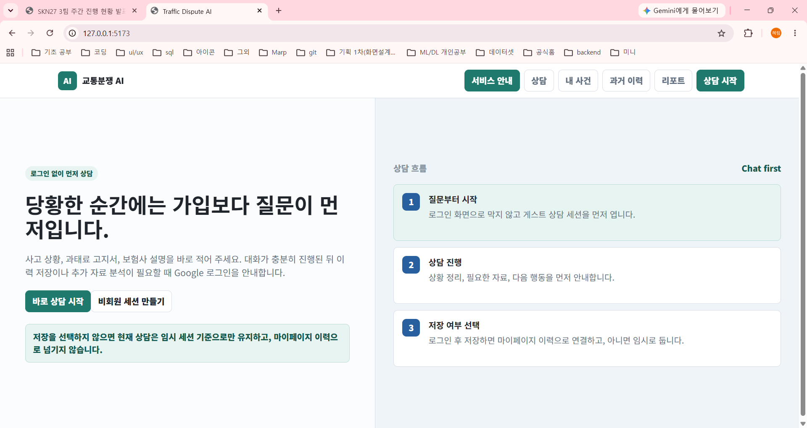
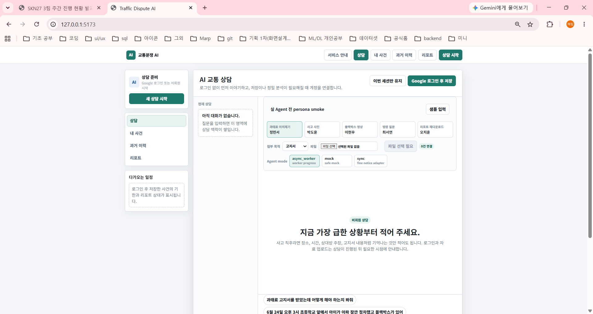
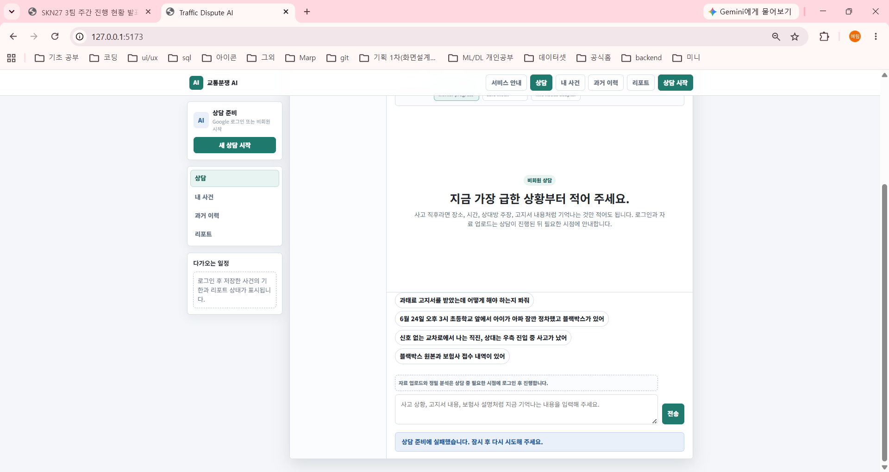
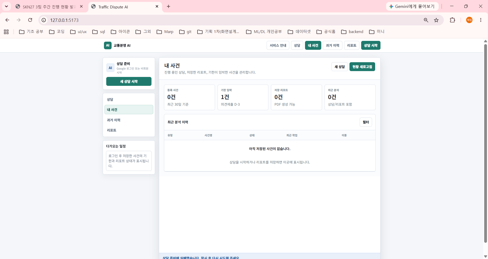
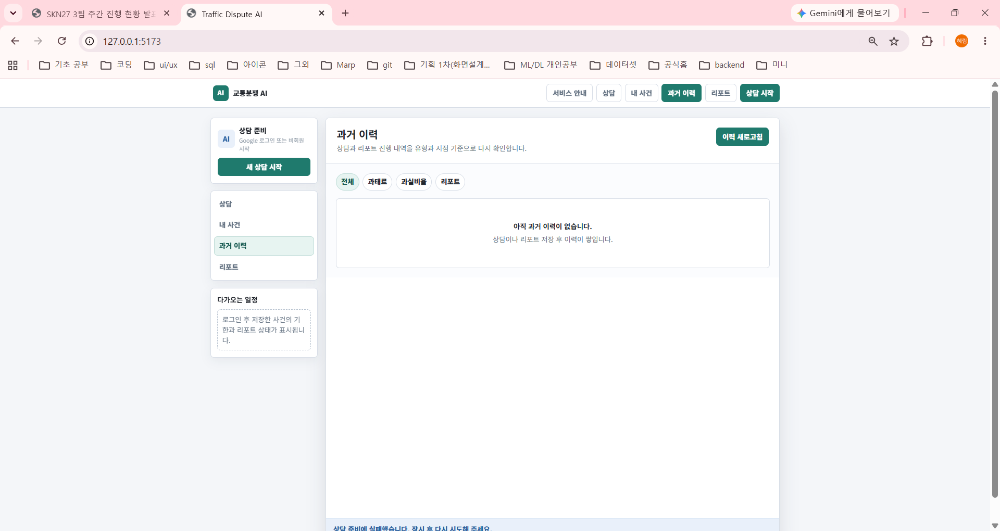
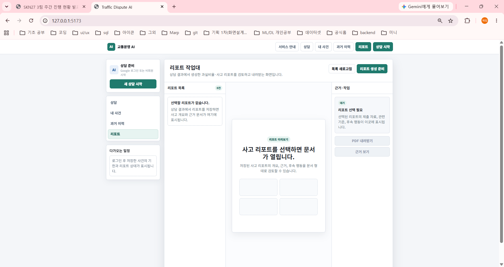
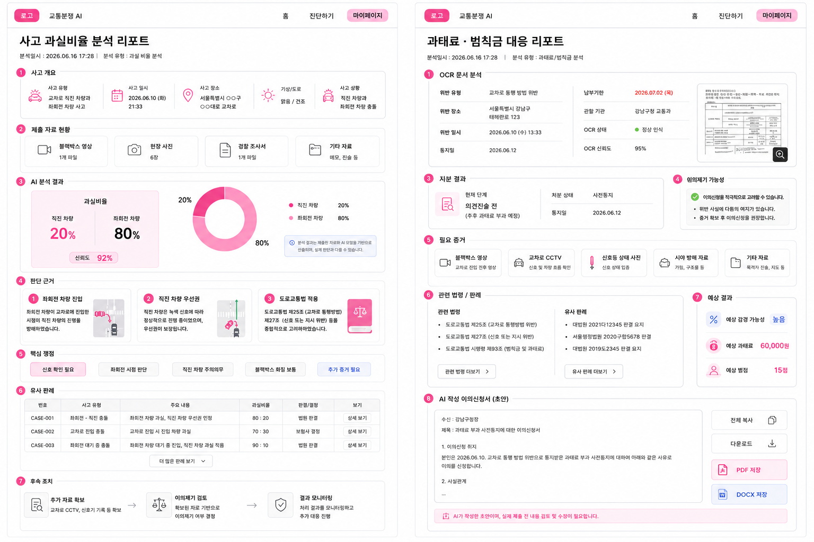

# 교통분쟁 AI 서비스 화면설계서

| 항목 | 내용 |
|---|---|
| 문서명 | 교통분쟁 AI 서비스 화면설계서 |
| 프로젝트명 | 교통분쟁 AI: 과실비율·범칙금/과태료 분석 및 리포팅 서비스 |
| 작성일 | 2026-06-18 |
| 최종 업데이트 | 2026-07-06 |
| 문서 버전 | v0.5 |
| 작성 기준 | 2026-07-06 구현 화면 캡처, 2026-06-29~2026-07-06 Git 업데이트, Drive 화면설계서 PDF 확인 결과 |
| 참조 화면 | `docs/assets/screen-design/current-2026-07-06/*.png`, `docs/assets/screen-design/report-pages-updated.png`, `app/screen-design-mvp-flow.html` |

---

## 1. 업데이트 기준

이 문서는 2026-07-06 현재 구현된 화면과 2026-06-29 이후 Git 업데이트를 기준으로 다시 정리한 화면설계서다.

구성 범위는 다음과 같다.

| 구분 | 처리 |
|---|---|
| 최신 구현 화면 | 사용자가 제공한 2026-07-06 캡처 기준으로 정리 |
| Git 업데이트 | 2026-06-29~2026-07-06 구현 변경을 화면 요구사항으로 반영 |
| 상세 리포팅 화면 | 과실비율 리포트와 과태료·범칙금 대응 리포트 정의 유지 |
| 산출물 범위 | 최신 화면, Git 반영 사항, API 연결 초안, 상세 리포팅, 남은 결정 작업 |

최신 핵심 흐름은 `로그인 먼저`가 아니라 `상담 먼저, 저장 또는 정밀 분석이 필요할 때 Google 로그인 안내`다.

---

## 2. 최신 화면 목록

| Screen ID | 화면명 | 최신 구현 기준 |
|---|---|---|
| `UI-SERVICE-001` | 서비스 안내 | 가입 전에 사고 상황, 과태료 고지서, 보험사 설명을 먼저 입력할 수 있음을 안내한다. |
| `UI-CHAT-001` | AI 교통 상담 | 비회원 상담을 기본으로 열고, 저장 또는 정밀 분석이 필요할 때 로그인을 안내한다. |
| `UI-CASE-001` | 내 사건 | 등록 사건, 기한 임박, 저장 리포트, 최근 분석 현황을 재조회한다. |
| `UI-HISTORY-001` | 과거 이력 | 상담과 리포트 진행 내역을 `전체`, `과태료`, `과실비율`, `리포트` 기준으로 확인한다. |
| `UI-REPORT-WORKBENCH-001` | 리포트 작업대 | 리포트 목록, 문서 미리보기, 근거·작업 패널로 리포트를 검토한다. |
| `UI-REPORT-FAULT-001` | 사고 과실비율 분석 리포트 | 과실비율 분석 결과와 판단 근거를 문서형 리포트로 제공한다. |
| `UI-REPORT-FINE-001` | 과태료·범칙금 대응 리포트 | OCR, 이의제기 가능성, 법령·판례, 이의신청서 초안을 문서형 리포트로 제공한다. |

---

## 3. 캡처 이미지 반영

### 3.1 캡처별 반영 기준

| 캡처 | 화면 | 반영 내용 |
|---|---|---|
| `01-service-guide.png` | 서비스 안내 | `당황한 순간에는 가입보다 질문이 먼저입니다.` 문구와 `바로 상담 시작`, `비회원 세션 만들기` CTA를 기준으로 한다. |
| `02-chat-top.png` | 상담 상단 | `이번 세션만 유지`, `Google 로그인 후 저장`, 샘플 입력, 첨부 목적, Agent mode를 필수 구성으로 둔다. |
| `03-chat-input-error.png` | 상담 입력 및 오류 | 빠른 질문, 입력창, 전송 버튼, `상담 준비에 실패했습니다. 잠시 후 다시 시도해 주세요.` 오류 상태를 반영한다. |
| `04-my-case.png` | 내 사건 | 등록 사건, 기한 임박, 저장 리포트, 최근 분석 카드와 최근 분석 이력 빈 상태를 반영한다. |
| `05-history.png` | 과거 이력 | `전체`, `과태료`, `과실비율`, `리포트` 필터와 빈 상태를 반영한다. |
| `06-report-workbench.png` | 리포트 작업대 | 리포트 목록, 문서 미리보기, 근거·작업 패널, `리포트 생성 준비`, PDF 다운로드 비활성 상태를 반영한다. |

### 3.2 캡처 이미지

---

## 4. 화면별 디스크립션

### 4.1 UI-SERVICE-001 서비스 안내

| 영역 | 표시 내용 | 동작 |
|---|---|---|
| 상단 내비게이션 | `서비스 안내`, `상담`, `내 사건`, `과거 이력`, `리포트`, `상담 시작` | 현재 화면을 강조하고 각 메뉴로 이동한다. |
| 메인 카피 | `당황한 순간에는 가입보다 질문이 먼저입니다.` | 가입보다 상담 입력이 먼저임을 명확히 한다. |
| 보조 설명 | 사고 상황, 과태료 고지서, 보험사 설명을 바로 입력하라는 안내 | 법률 판단 확정이 아니라 상담과 정리 보조 서비스임을 암시한다. |
| CTA | `바로 상담 시작`, `비회원 세션 만들기` | 둘 다 상담 화면으로 진입한다. |
| 임시 세션 안내 | 저장하지 않으면 현재 상담은 임시 세션으로 유지되고 마이페이지 이력에 남지 않는다. | 비회원 데이터 보관 범위를 명확히 한다. |
| 상담 흐름 | 질문부터 시작, 상담 진행, 저장 여부 선택 | 사용자가 다음 행동을 예측할 수 있게 한다. |

### 4.2 UI-CHAT-001 AI 교통 상담

| 영역 | 표시 내용 | 동작 |
|---|---|---|
| 세션 제어 | `이번 세션만 유지`, `Google 로그인 후 저장` | 비회원 상담 유지 또는 계정 이력 연결을 선택한다. |
| 현재 상담 목록 | 대화가 없으면 `질문을 입력하면 이 영역에 상담 맥락이 쌓입니다.` | 상담 맥락이 생기면 최근 대화 또는 사건 요약을 표시한다. |
| 샘플 입력 | 과태료 이의제기, 사고 사진, 블랙박스 영상, 법령 질문, 리포트 재다운로드 | 시연과 테스트에서 빠르게 상담 상황을 채운다. |
| 첨부 목적 | `고지서` 등 목적 선택 | 업로드 파일을 분석 파이프라인 또는 질문 맥락에 연결한다. |
| 파일 선택 | 파일 선택 전에는 `파일 선택 필요`, 연결 수는 `0건 연결` | 업로드 후 파일명, 상태, 분석 가능 여부를 표시한다. |
| Agent mode | `async_worker`, `mock`, `sync` | 시연 환경에서 worker progress, safe mock, fine notice adapter를 선택한다. |
| 중앙 안내 | `지금 가장 급한 상황부터 적어 주세요.` | 장소, 시간, 상대방 주장, 고지서 내용부터 입력하도록 유도한다. |
| 빠른 질문 | 고지서 대응, 블랙박스/보험사 설명, 교차로 사고, 원문·내역 보유 | 사용자가 바로 입력 예시를 선택한다. |
| 오류 상태 | `상담 준비에 실패했습니다. 잠시 후 다시 시도해 주세요.` | 재시도, 서버 연결 상태, mock 전환 안내를 함께 제공한다. |

### 4.3 UI-CASE-001 내 사건

| 영역 | 표시 내용 | 동작 |
|---|---|---|
| 헤더 | `내 사건`, `새 상담`, `현황 새로고침` | 새 상담을 시작하거나 저장 현황을 다시 불러온다. |
| 요약 카드 | 등록 사건, 기한 임박, 저장 리포트, 최근 분석 | 최근 30일 기준 사건과 리포트 상태를 보여준다. |
| 최근 분석 이력 | 유형, 사건명, 상태, 최근 작업, 이동 | 저장된 상담 또는 리포트를 다시 연다. |
| 빈 상태 | `아직 저장된 사건이 없습니다.` | 상담 시작 또는 리포트 저장 후 이곳에 표시된다고 안내한다. |

### 4.4 UI-HISTORY-001 과거 이력

| 영역 | 표시 내용 | 동작 |
|---|---|---|
| 헤더 | `과거 이력`, `이력 새로고침` | 상담과 리포트 진행 내역을 다시 불러온다. |
| 필터 | `전체`, `과태료`, `과실비율`, `리포트` | 유형별 이력만 표시한다. |
| 목록 | 상담/분석/리포트 이벤트 | 선택한 항목의 상세 또는 리포트로 이동한다. |
| 빈 상태 | `아직 과거 이력이 없습니다.` | 상담이나 리포트 저장 후 이력이 쌓인다고 안내한다. |

### 4.5 UI-REPORT-WORKBENCH-001 리포트 작업대

| 영역 | 표시 내용 | 동작 |
|---|---|---|
| 헤더 | `리포트 작업대`, `목록 새로고침`, `리포트 생성 준비` | 저장 리포트 목록을 갱신하거나 생성 준비 상태를 시작한다. |
| 리포트 목록 | 저장된 리포트 카드와 개수 | 리포트를 선택하면 미리보기가 열린다. |
| 문서 미리보기 | 사고 리포트 개요, 근거, 후속 행동 | 리포트 문서를 검토한다. |
| 근거·작업 패널 | 제출 자료, 관련 기준, 후속 행동, Agent 결과 | PDF 다운로드 또는 근거 보기 액션의 조건을 보여준다. |
| 빈 상태 | `선택할 리포트가 없습니다.` | 상담 결과에서 리포트를 저장하면 표시된다고 안내한다. |

---

## 5. Git 업데이트 반영

### 5.1 확인 범위

2026-06-29부터 2026-07-06 현재까지 로컬 Git 이력을 기준으로 화면설계에 반영할 구현 변화를 확인했다.

### 5.2 주요 변경과 화면 반영

| 기간/PR 흐름 | 구현 업데이트 | 화면설계 반영 |
|---|---|---|
| 2026-06-29 `#84~#93` | agent result, display result, report metadata, download storage boundary, My Case summary, auth/agent/code table 기반 정리 | `내 사건`, `과거 이력`, `리포트 작업대`를 저장된 상담·분석·리포트 재조회 화면으로 정의 |
| 2026-06-30 `#94~#112` | auth ownership guard, quota policy, Redis progress cache, object storage adapter, Google auth/JWT, frontend app shell, workbench UI 연결 | 비회원/회원 상태, Google 로그인 후 저장, 업로드/스캔, 리포트 목록·미리보기 UI 반영 |
| 2026-07-02 `#115~#118` | Google auth code flow, 과태료 이의가능성 판단, 법령 GraphRAG 검색 | 상담 입력 후 법령 근거·이의제기 가능성·후속 행동을 리포트 작업대에서 검토 |
| 2026-07-03 `#121~#135` | supervisor execution mode, fine notice sync upload, auth session spine, guest policy enforcement, chat worker report flow, scan worker report RAG flow 연결 | 상담 화면에 Agent mode, worker progress, file scan gating, guest policy, report generation 준비 상태 반영 |
| 2026-07-06 `#136~#140` | E2E demo hardening, worker progress polling, report quality UX, 과실비율 knowledge base RAG, text ML case search adapter 추가 | 리포트 작업대에 worker polling, report quality/partial report, 과실비율 근거 검색, 유사 사례 검색 결과 표시 |

### 5.3 최신 사용자 흐름

| 순서 | 최신 구현 근거 | 화면 요구사항 |
|---:|---|---|
| 1 | `feature/mvp-auth-session-spine`, `feature/mvp-guest-policy-enforcement` | 사용자는 비회원 세션으로 상담을 먼저 시작할 수 있어야 한다. |
| 2 | `feature/mvp-upload-login-gate`, `feature/fine-notice-upload-sync-bridge` | 자료 업로드와 정밀 분석은 상담 중 필요한 시점에 로그인 또는 정책 안내와 함께 연결한다. |
| 3 | `feature/chat-message-worker-progress`, `feature/worker-progress-polling` | worker 진행 상태를 대기/진행/완료 상태로 보여준다. |
| 4 | `feature/mvp-chat-worker-report-flow`, `feature/mvp-scan-worker-report-rag-flow` | 상담 결과는 리포트 생성 준비 상태로 넘어가며, 리포트 작업대에서 목록·미리보기·근거를 확인한다. |
| 5 | `feature/report-quality-ux` | 리포트가 부분 생성인지, 최종 검토가 필요한지, 제한 사항이 있는지를 UI에 표시한다. |
| 6 | `feat-fault-ratio-knowledge-base`, `feature/text-ml-case-search-adapter` | 과실비율 리포트에는 인정기준/판례/유사 사례 검색 결과를 근거로 연결한다. |

---

## 6. API 연결 초안

| 화면 | 필요 데이터 | API 후보 |
|---|---|---|
| `UI-SERVICE-001` | 비회원 세션 생성 가능 여부, 현재 인증 상태 | `POST /api/auth/guest-session/`, `GET /api/auth/me/` |
| `UI-CHAT-001` | 세션, 메시지, 첨부 파일, Agent mode, worker 진행 상태 | `GET /api/chat/sessions/`, `POST /api/chat/sessions/`, `POST /api/chat/messages/`, `POST /api/files/`, `POST /api/analysis/jobs/`, `GET /api/analysis/jobs/{job_id}/` |
| `UI-CASE-001` | 사건 요약, 기한 임박, 저장 리포트, 최근 분석 | `GET /api/mypage/summary/`, `GET /api/history/`, `GET /api/reports/` |
| `UI-HISTORY-001` | 유형별 이력 목록, 필터 조건, 상세 진입 정보 | `GET /api/history/`, `GET /api/history/{id}/` |
| `UI-REPORT-WORKBENCH-001` | 리포트 목록, 미리보기, 근거, 작업 상태, 다운로드 링크 | `GET /api/reports/`, `GET /api/reports/{id}/`, `GET /api/reports/{id}/related-cases/`, `GET /api/reports/{id}/download/` |
| Agent 운영 | 노드 상태, 실행 계획, worker progress, mock/sync 전환 | `GET /api/agents/nodes/`, `POST /api/agents/plans/run/`, `GET /api/analysis/results/{job_id}/` |

---

## 7. 상세 리포팅

### 7.1 UI-REPORT-FAULT-001 사고 과실비율 분석 리포트

#### 화면 목적

사용자가 사고 과실비율 분석 결과를 리포트 형태로 확인하고, 사고 개요, 제출 자료, AI 분석 결과, 판단 근거, 핵심 쟁점, 유사 판례, 후속 조치를 한 화면에서 검토할 수 있도록 한다.

#### 진입 경로

| 진입 지점 | 조건 |
|---|---|
| 리포트 작업대 | 과실비율 리포트 선택 |
| 내 사건 | 과실비율 분석 또는 저장 리포트 항목 열기 |
| 과거 이력 | 과실비율 분석 이력 상세 진입 |
| 챗봇 결과 | 과실비율 분석 완료 후 리포트 생성 또는 상세보기 |

#### 화면 구성

| 순서 | 영역 | 표시 데이터 |
|---:|---|---|
| 1 | 헤더 | 화면 제목, 분석 일시, PDF 저장, 뒤로가기 |
| 2 | 사고 개요 | 사고 일시, 장소, 사고 유형, 차량 A/B, 핵심 상황 |
| 3 | 제출 자료 | 사고 사진, 블랙박스, 진술서, 보험사 자료, 자료 상태 |
| 4 | AI 분석 결과 | 예상 과실비율, 책임 방향, 신뢰도, 주의 문구 |
| 5 | 판단 근거 | 도로교통법, 과실비율 인정기준, 보험사 기준, 적용 한계 |
| 6 | 핵심 쟁점 | 신호, 차선, 우선권, 속도, 회피 가능성, 증거 부족 지점 |
| 7 | 유사 판례·사례 | 사건번호, 사고 유형, 주요 내용, 과실비율, 결정 요지 |
| 8 | 후속 조치 | 추가 증거 요청, 보험사 대응, 이의제기 가능성, 리포트 다운로드 |

#### 표시 정책

| 항목 | 기준 |
|---|---|
| 과실비율 | 확정 판단이 아니라 예상 또는 후보 값으로 표시한다. |
| 신뢰도 | 입력 자료 충분성, 유사 사례 매칭, 법령 근거 수준에 따라 표시한다. |
| 부분 리포트 | `partial_report`이면 제한 사항과 추가 필요 자료를 반드시 표시한다. |
| 유사 사례 | `text ML case search adapter` 또는 RAG 결과를 근거로 연결한다. |
| 법률 문구 | 법률 자문이 아니라 참고용 분석임을 명시한다. |

#### 사용자 액션

| 액션 | 동작 |
|---|---|
| PDF 내려받기 | 리포트 PDF를 생성 또는 다운로드한다. |
| 근거 보기 | 판단 근거, 판례, 보험사 사례 상세를 연다. |
| 추가 자료 업로드 | 사진, 블랙박스, 진술서 등 누락 자료를 추가한다. |
| 리포트 재생성 | worker 또는 agent 결과 갱신 후 리포트를 다시 만든다. |

### 7.2 UI-REPORT-FINE-001 과태료·범칙금 대응 리포트

#### 화면 목적

사용자가 과태료·범칙금 고지서 분석 결과를 확인하고, OCR 결과, 처분 정보, 이의제기 가능성, 필요 증거, 관련 법령·판례, 예상 결과, 이의신청서 초안을 검토할 수 있도록 한다.

#### 진입 경로

| 진입 지점 | 조건 |
|---|---|
| 리포트 작업대 | 과태료·범칙금 리포트 선택 |
| 내 사건 | 저장된 고지서 분석 항목 열기 |
| 과거 이력 | 과태료·범칙금 분석 이력 상세 진입 |
| 챗봇 결과 | 고지서 분석 완료 후 리포트 생성 또는 상세보기 |

#### 화면 구성

| 순서 | 영역 | 표시 데이터 |
|---:|---|---|
| 1 | 헤더 | 화면 제목, 분석 일시, PDF 저장, 뒤로가기 |
| 2 | 고지서 OCR 결과 | 위반 유형, 고지 번호, 위반 일시, 장소, 금액, 납부 기한 |
| 3 | 처분 결과 | 과태료/범칙금 구분, 벌점, 납부 상태, 의견제출 기한 |
| 4 | 이의제기 가능성 | 가능/검토 필요/낮음, 판단 사유, missing field |
| 5 | 필요 증거 | 블랙박스, 사진, 현장 상황, 운전자 진술, 고지서 원본 |
| 6 | 관련 법령·판례 | 법령 조항, 시행규칙, 판례 또는 행정심판 사례 |
| 7 | 예상 결과 | 수용 가능성, 감경 가능성, 기각 가능성, 리스크 |
| 8 | 이의신청서 초안 | 제목, 제출 대상, 사실관계, 주장, 첨부 자료, 마무리 문구 |

#### 표시 정책

| 항목 | 기준 |
|---|---|
| OCR 상태 | 성공, 실패, 필드 누락, 재업로드 필요 상태를 분리한다. |
| 이의제기 가능성 | 확정 승소 가능성이 아니라 입력 자료 기준의 검토 의견으로 표시한다. |
| 법령 근거 | GraphRAG 또는 법령 검색 결과의 최신성·적용 한계를 함께 표시한다. |
| 초안 문구 | 사용자가 그대로 제출하기 전 검토가 필요하다는 안내를 포함한다. |
| 다운로드 | 회원 또는 저장된 리포트 기준으로 PDF 다운로드를 활성화한다. |

#### 사용자 액션

| 액션 | 동작 |
|---|---|
| PDF 내려받기 | 고지서 분석 리포트 또는 이의신청서 초안을 PDF로 저장한다. |
| 근거 보기 | 법령, 판례, 행정심판 사례 상세를 확인한다. |
| 누락 자료 추가 | OCR 실패 또는 필드 누락 시 고지서 원본과 추가 증거를 다시 올린다. |
| 초안 재생성 | 추가 자료 반영 후 이의신청서 초안을 다시 만든다. |

---

## 8. 남은 결정 작업

| 우선순위 | 영역 | 남은 작업 |
|---|---|---|
| 높음 | 상담 준비 실패 상태 | 현재 오류 메시지에 재시도, 원인, mock 전환 또는 backend 연결 점검 안내를 추가한다. |
| 높음 | 리포트 작업대 | `리포트 생성 준비` 버튼 조건, worker 완료 후 목록 반영 시점, PDF 다운로드 활성화 기준을 확정한다. |
| 높음 | 로그인 저장 정책 | `이번 세션만 유지`와 `Google 로그인 후 저장`의 데이터 보관 범위, 만료 시점, 마이페이지 반영 기준을 확정한다. |
| 보통 | Agent mode 노출 | `async_worker`, `mock`, `sync`를 최종 사용자 화면에서 숨기거나 쉬운 표현으로 바꿀지 결정한다. |
| 보통 | 상세 리포팅 | `partial_report`, `report_quality`, 유사 사례, 법령 근거를 어떤 순서와 배지로 보여줄지 확정한다. |
