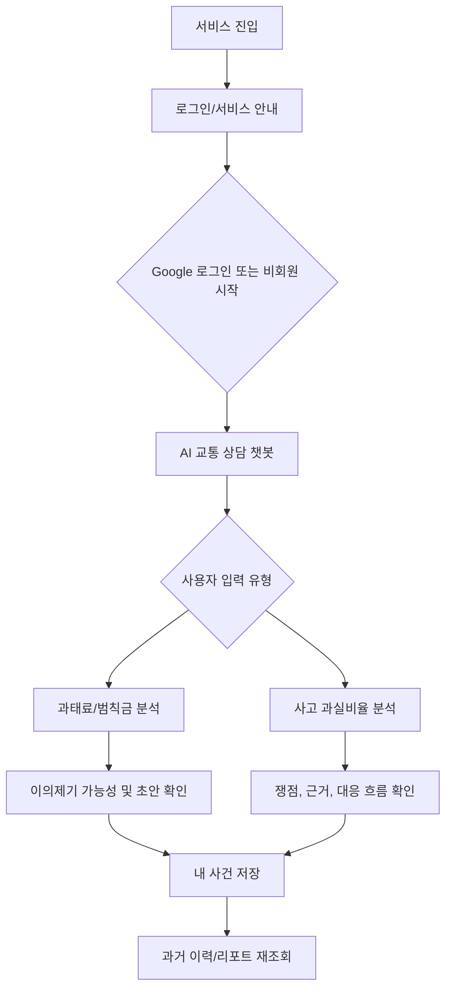
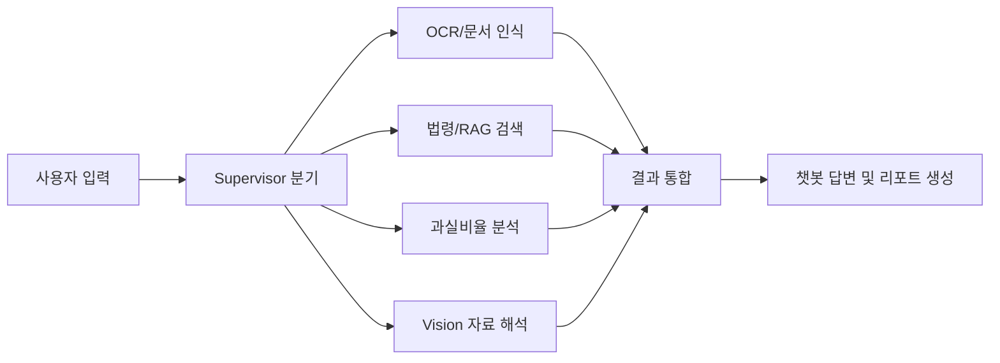

# 교통분쟁 AI UI/UX 흐름 정리

| 항목 | 내용 |
|---|---|
| 문서 목적 | HTML 산출물에서 제거한 화면별 설명, 발표 흐름, 사용자 사용 흐름을 별도 문서로 정리한다. |
| 대상 HTML | `app/screen-design-mvp-flow.html` |
| 기준 문서 | `docs/screen-design-specification.md` |
| 작성일 | 2026-06-22 |

## 1. 산출물 분리 기준

`app/screen-design-mvp-flow.html`은 실제 사용자가 보는 서비스 화면처럼 구성한다. 따라서 화면 안에는 발표용 설명, 화면설계서 해설, 검증 필요 문구, 내부 Agent 설명을 직접 노출하지 않는다.

이 문서는 발표자가 화면 흐름을 설명하거나 개발자가 화면별 책임을 확인할 때 사용하는 보조 문서다.

## 2. 사용자 진입 흐름

## 3. 화면별 설명

| 화면 | 사용자 목적 | 주요 UI | 다음 행동 |
|---|---|---|---|
| 로그인/서비스 안내 | 서비스 목적을 이해하고 바로 상담을 시작한다. | Google 로그인, 비회원 상담 시작, 상담 미리보기 | 챗봇으로 이동 |
| AI 교통 상담 | 사고 상황, 과태료 고지서, 사진/영상 자료를 입력한다. | 상담 목록, 대화 영역, 첨부 자료, 분석 상태 | 과태료 결과 또는 과실비율 결과로 이동 |
| 과태료·범칙금 분석 결과 | 고지서 OCR 결과와 이의제기 가능성을 확인한다. | 납부 금액, 기한, 쟁점, 필요 자료, 의견제출서 초안 | 리포트 저장, 초안 다운로드 |
| 사고 과실비율 분석 결과 | 사고 쟁점과 대응 흐름을 확인한다. | 사고 장면 도식, 제출 자료, 쟁점, 보험사 문의 초안 | 리포트 저장, 자료 추가 |
| 내 사건 | 진행 중인 상담과 저장한 리포트를 관리한다. | 사건 요약, 최근 분석 이력, 오늘 처리할 일 | 사건 재열람, 리포트 다운로드 |

## 4. 화면 전환 규칙

| 시작 화면 | 트리거 | 도착 화면 |
|---|---|---|
| 로그인/서비스 안내 | `Google로 계속하기`, `비회원 상담 시작` | AI 교통 상담 |
| AI 교통 상담 | `고지서 분석하기`, `전송`, 결과 카드의 `결과 보기` | 과태료·범칙금 분석 결과 |
| AI 교통 상담 | `과실비율 확인하기`, 결과 카드의 `상담 열기` | 사고 과실비율 분석 결과 |
| 과태료·범칙금 분석 결과 | `리포트 저장` | 내 사건 |
| 사고 과실비율 분석 결과 | `리포트 저장` | 내 사건 |
| 내 사건 | 이력 행의 `열기` | 해당 분석 결과 또는 상담 화면 |

## 5. 발표 설명 순서

1. 별도 홈 화면 없이 로그인/서비스 안내에서 바로 상담으로 진입한다.
2. 사용자는 챗봇에 사고 설명, 고지서, 사진, 영상을 입력한다.
3. 입력 유형에 따라 과태료·범칙금 분석 또는 사고 과실비율 분석으로 흐름이 갈라진다.
4. 결과 화면은 단순 답변이 아니라 근거, 필요 자료, 다음 행동, 문서 초안을 함께 제공한다.
5. 사용자는 분석 결과를 내 사건에 저장하고, 기한이 임박한 사건과 과거 이력을 재조회한다.

## 6. 내부 처리 흐름

사용자 화면에는 내부 처리명을 직접 노출하지 않는다. 발표나 개발 설명에서는 아래 흐름으로 설명한다.

## 7. 업데이트 필요 항목

| 항목 | 처리 방향 |
|---|---|
| 요구사항 정의서의 챗봇 화면 ID와 화면설계 이미지의 `UI-Ai-01` 매핑 | 최종 요구사항 문서에서 ID 체계를 확정한다. |
| 과태료 결과와 과실비율 결과의 API 응답 구조 | 실제 백엔드 계약이 확정되면 HTML의 정적 예시 데이터를 교체한다. |
| 로그인 정책 | Google 로그인 필수 여부와 비회원 상담 허용 범위를 확정한다. |
| 리포트 다운로드 형식 | PDF, DOCX, 원문 링크 제공 범위를 확정한다. |
| 법률/보험 근거 표시 기준 | 사용자에게 노출 가능한 근거와 내부 검색 근거를 분리한다. |

## 8. 현재 HTML 확인 포인트

| 확인 항목 | 기준 |
|---|---|
| 사용자 화면성 | HTML 화면에는 발표용 해설 대신 서비스 UI만 보여야 한다. |
| 진입 흐름 | 로그인/서비스 안내에서 챗봇으로 바로 이동해야 한다. |
| 상담 흐름 | 챗봇에서 과태료 결과와 과실비율 결과로 이동해야 한다. |
| 저장 흐름 | 결과 화면에서 내 사건으로 이동해야 한다. |
| 반응형 | 데스크톱과 모바일에서 텍스트가 겹치거나 화면 밖으로 밀리지 않아야 한다. |
