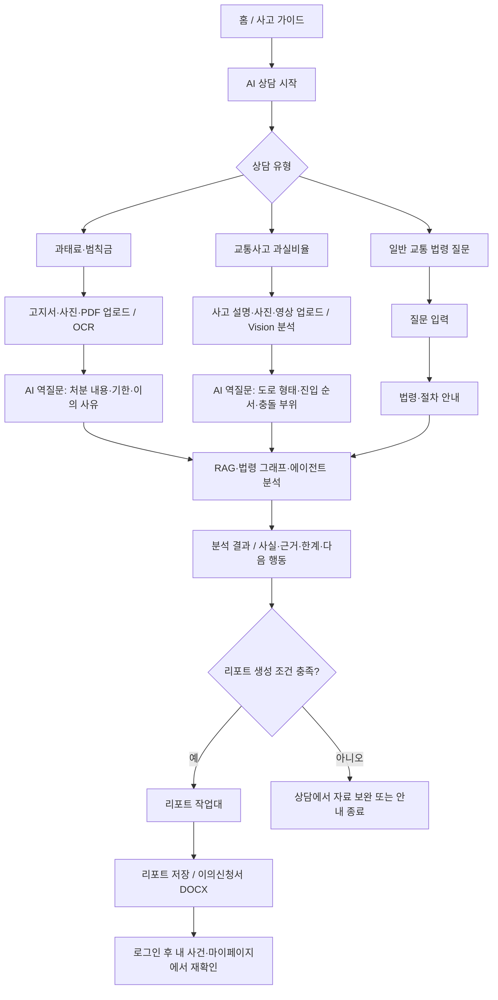

# 리포트 작업대 상시 진입과 사용자 흐름 품질 설계

## 목적

사용자가 상담을 마친 뒤 리포트 산출물을 어디에서 검토·저장·다운로드하는지 항상 알 수 있게 한다. 리포트가 아직 없더라도 `리포트 작업대`는 열리며, 현재 준비 단계와 부족한 자료, 다음 행동을 안내한다. 이 변경은 일반 법령 질문을 리포트 생성으로 강제하지 않는다.

## 확인된 현재 상태

- `reporting` 화면과 `ReportingScreen`은 구현되어 있지만, 전역 좌측 메뉴에는 `사고 가이드`, `AI 상담`, `마이페이지`만 있다.
- 상담 하단의 `작업대` 버튼은 이의신청 리포트 생성 노드가 포함되고, `agent_execution_ready` 상태이며, 역질문·누락 정보 없이 `reporting_payload`가 준비된 경우에만 표시된다.
- 따라서 일반 법령·절차 안내, 상담 시작 전, 또는 정보 보완 중인 사용자는 작업대의 존재를 알기 어렵다.
- 비회원은 상담을 진행할 수 있고 리포트 화면을 볼 수 있다. 저장·DOCX 다운로드와 저장 목록 조회는 기존 로그인 정책을 유지한다.

## 사용자 결정

- 좌측 메뉴에 `리포트 작업대`를 상시 추가한다.
- 리포트가 없을 때에도 작업대를 열어 `현재 준비 단계`, `부족한 자료`, `AI 상담으로 이동`을 제공한다.
- 빈 상태만으로 종료하지 않는다. 로그인 사용자는 작업대 진입·새로고침·로그인 성공 뒤 저장 리포트 목록과 선택 리포트의 상세를 자동으로 불러온다.
- 비회원은 현재 상담에서 준비된 공개 리포팅 payload를 임시 미리보기로 검토할 수 있다. 저장 목록·저장·제출용 DOCX는 로그인 필요 정책을 유지하고, 그 이유와 다음 행동을 작업대에서 명시한다.
- Google 로그인 실패는 설정 불일치, 팝업 차단·종료, 서버 코드 교환 실패를 구분해 안내한다. Google Cloud Console의 실제 등록값은 코드가 아닌 운영 설정으로 별도 검증한다.
- 제공된 이슈 관리 엑셀은 팀의 상태·담당자 관리에 유지하고, Markdown 체크리스트는 기술적 원인·증거·수정·재검증 기준의 기준 문서로 사용한다.

## UX와 상태 모델

`app/web/reportWorkbenchState.js`의 순수 함수가 화면에 공개해도 되는 상태만 아래 다섯 상태로 정규화한다.

| 상태 | 조건 | 작업대 안내 |
| --- | --- | --- |
| `available` | 현재 리포트, 저장 리포트 또는 검증된 리포팅 payload가 존재 | 기존 미리보기·저장·DOCX 작업을 표시 |
| `persisting` | 리포트 생성 에이전트가 선택됐고 분석은 준비됐으나 저장 결과가 아직 없음 | 저장 워커 처리 중임을 표시하고 새로고침 제공 |
| `needs_information` | 역질문 또는 누락 필드가 남음 | 누락 사실·자료 목록과 `AI 상담으로 이동` 제공 |
| `not_reportable` | 상담은 끝났지만 해당 유형이 별도 리포트를 만들지 않음 | 절차 안내 상담임을 명확히 표시하고 상담으로 돌아가기 제공 |
| `not_started` | 활성 상담·저장 리포트가 없음 | 상담 유형 선택부터 시작하도록 안내 |

상태 함수는 사용자에게 이미 공개 가능한 `supervisor_state.stage`, `next_questions`, `missing_fields`만 소비한다. 내부 실행 payload, 저장소 URI, 원문 OCR, 사용자 식별 정보는 표시하지 않는다.

## 화면 변경

1. `RAIL_ITEMS`에 `reporting` / `리포트 작업대`를 추가한다. 기존 라우트와 `ReportingScreen`을 재사용한다.
2. 작업대 진입 함수는 로그인 상태이면 목록 API를 호출하고, 최신 저장 리포트의 상세 API까지 조회한 뒤 캔버스에 표시한다. 로딩·목록 실패·로그인 필요 상태를 별도 공개 상태로 표시한다.
3. `ReportingScreen`에는 현재의 세 칼럼 작업대 레이아웃을 유지한다. 목록 카드 선택도 상세 API를 통해 동일한 상세 DTO를 사용한다.
4. 현재 상담의 `reporting_payload`가 준비됐지만 아직 저장되지 않았다면 임시 미리보기로 표시한다. 이 상태에서 저장·DOCX는 로그인 안내와 기존 문서 확인 게이트를 거친다.
5. `hasReport`가 거짓이면 중앙 미리보기와 우측 상태 영역을 빈 화면이 아니라 `ReportWorkbenchEmptyState`로 교체한다. 빈 상태는 단계 배지, 사용자 친화적 설명, 최대 세 개의 부족 자료·사실, `AI 상담으로 이동` 버튼을 제공한다.
6. 저장된 리포트·문서 확인·Google 로그인·DOCX 정책, 그리고 이의신청 신원 노출 확인 게이트는 우회하지 않는다.

## 로그인 장애 분리와 운영 검증

- 프런트는 Google Identity Services popup code flow에서 현재 `window.location.origin`을 backend code-exchange request의 `redirect_uri`로 보낸다.
- backend는 `GOOGLE_CLIENT_ID`, `GOOGLE_POPUP_REDIRECT_URI`, 요청 `client_id`, 요청 origin을 비교한다. 불일치는 fail-closed가 맞으며, 비밀값을 응답에 포함하지 않는다.
- `redirect_uri_mismatch`는 Google Cloud Console의 OAuth client 설정에서 현재 HTTPS origin이 등록되지 않았을 때 Google 단계에서 발생한다. 코드만으로 외부 Console 등록값을 수정하지 않는다.
- `popup_closed`는 팝업이 사용자·브라우저·콜백 연결 실패로 닫힌 결과다. 화면은 재시도 행동과 안전한 오류 분류를 보여야 하며 raw authorization code는 로그·상태·UI에 남기지 않는다.
- 운영 완료 조건은 Google Cloud Console의 Authorized JavaScript origins와 redirect URI가 `https://skn27-traffic-pilot.duckdns.org`에 맞고, runtime의 세 OAuth 값이 같은 client/origin을 사용하며, 실제 브라우저 한 번의 login → 현재 상담 저장 → report list/detail 재열기가 성공하는 것이다.

## E2E 범위

아래 사용자 흐름을 로컬 결정적 통합 테스트와 배포 후 브라우저 스모크로 분리한다.

- 로컬 결정적 통합: OCR, Vision, RAG provider의 외부 호출은 fixture로 대체하되 실제 API·큐·Worker·리포트·문서 권한 경계를 통과한다.
- 배포 후 스모크: 합성 정보만 사용하며, 과태료 절차 안내, OCR 첨부, 과실 역질문, 일반 법령 안내, 리포트 진입, 로그인 후 저장 목록을 브라우저에서 확인한다.
- 실제 OCR/Vision/LLM provider 호출은 비용·처리 시간을 발생시킬 수 있으므로 실행 전 별도 승인한다. 승인 전에는 로컬 결정적 E2E와 무과금 화면·API 스모크만 실행한다.

## 품질 기준

- 과실: 이미 제공한 도로 형태·신호·진입 순서·충돌 부위를 다시 묻지 않고, 상충 진술이 있을 때만 근거와 함께 보완을 요청한다.
- 과태료: 단순 절차 질문에는 과도한 이의신청 리포트 게이트를 노출하지 않고, 고지서 기반 이의신청에는 처분 내용·기한·사유·OCR 확인 상태를 명확히 보인다.
- 일반 법령: 법령·절차 안내와 출처·한계·다음 행동을 제공하며, 리포트 미생성을 오류처럼 표현하지 않는다.
- RAG/그래프: 결과에는 적용 근거와 한계를 보이고, 운영 검증은 RAG 검색 결과·그래프 연결·에이전트 응답이 동일 사건에서 사용됐다는 안전한 메타데이터로 증명한다.
- Vision: 첨부·스캔·분석 대기·부분 실패를 구분해 보여 주며, 미연결·미가동 상태를 성공으로 표기하지 않는다.

## 이슈 관리 엑셀 적용

`이슈_관리_템플릿.xlsx`의 번호, 상태, 우선순위, 유형, 화면·기능, 재현 절차, 기대/실제 결과, 환경, 담당자, 조치, 재검증 결과 열은 핫픽스 운영에 충분하다. 기존 1~4번(과실 역질문 반복, 첨부 표시, 채팅 저장, 안전 문구)은 모두 핫픽스 후보로 유지한다. Markdown 체크리스트의 `HFX-*` ID를 엑셀의 `비고`에 기록해 양쪽을 연결한다.
