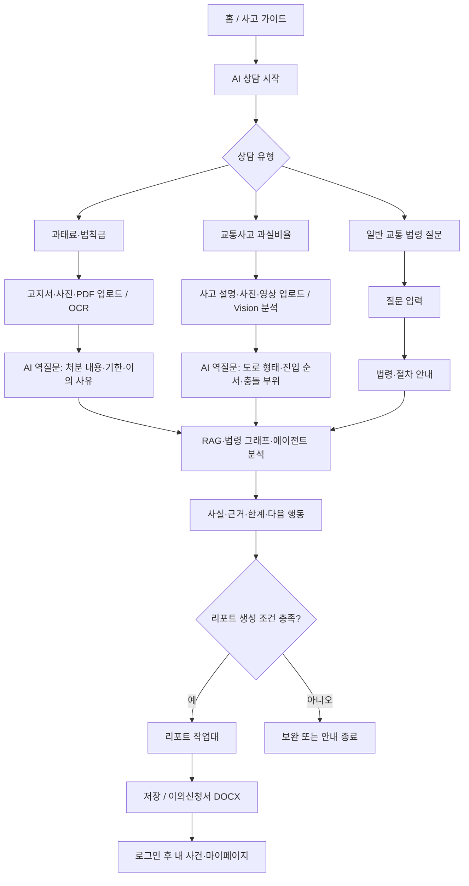

# Pilot 핫픽스·전체 사용자 흐름 체크리스트

> 기준일: 2026-07-31  
> 배포 기준: `origin/dev`의 PR #350 병합 커밋 `691ed6bdd07c`  
> 범위: 사용자 흐름, 프런트 UX, 에이전트 연결, RAG·Neo4j·Vision 증거, 리포트·로그인, 품질과 운영 오류

## 운영 방식

- 이 문서는 기술 기준·근거·재검증 기록이다.
- `C:\Users\Playdata\Downloads\이슈_관리_템플릿.xlsx`는 담당자·상태·우선순위의 팀 관리 원장이다.
- 각 항목의 `HFX-*`를 엑셀 `비고`에 기록한다. 엑셀의 재현 절차·기대 결과·실제 결과·조치·재검증 결과는 이 문서의 해당 항목과 같은 사실을 사용한다.
- `확인됨`은 코드 또는 실행 증거가 있는 상태, `검증 대기`는 아직 실행하지 않은 상태다. 실행하지 않은 외부 provider 결과를 통과로 표시하지 않는다.

## 서비스 흐름 기준

## 확인된 핫픽스

### HFX-001 — 리포트 작업대 상시 진입과 빈 상태

- [ ] **상태:** 구현·결정적 검증 완료 / 배포본 사용자 재검증 대기
- **우선순위:** 높음
- **유형 / 화면:** 화면·UI / 전역 좌측 메뉴, 리포트 작업대
- **재현:** 홈 또는 상담 시작 전, 일반 법령 상담 완료, 역질문 중인 상담에서 좌측 메뉴를 확인한다.
- **기대:** `리포트 작업대`가 항상 보이고, 리포트가 없으면 현재 준비 단계·부족한 자료·AI 상담 이동을 표시한다.
- **실제:** 2026-07-31 배포본에서 전역 메뉴의 `리포트 작업대`가 상시 노출되고, 상담 전에는 `상담 시작 전`·`아직 생성된 리포트가 없습니다.`·`AI 상담 시작` 빈 상태가 표시된다. 핫픽스 브랜치는 로그인 사용자가 메뉴 진입·새로고침·로그인 복귀 시 목록→상세 DTO를 자동 수화하고, 비회원의 분석 payload는 임시 미리보기로 구분한다.
- **원인:** 기존에는 `RAIL_ITEMS`에 `reporting` 경로가 없었고, 추가 후에도 메뉴 진입이 route state만 바꿔 저장 목록·상세 API를 호출하지 않았다. 목록 요약이 `currentReport` fallback으로 렌더링돼 실제 리포트 본문·근거·문서 게이트가 없는 상태를 완료 리포트처럼 보일 수 있었다.
- **조치:** 상시 메뉴·공개 상태 기반 빈 작업대에 더해, 수화 전 목록 요약을 `loading_saved_report`로 분리하고, `GET /api/reports/` → `GET /api/reports/{id}/` 순서의 상세 수화·임시 리포트 표시·로드 실패 재시도를 추가했다.
- **재검증:** 로컬 결정적 테스트는 통과했다. 배포 후 로그인 → 저장 리포트 목록 → 상세 미리보기·근거·누락 자료 → 저장·DOCX 게이트 → 마이페이지 재열기를 실제 브라우저로 완료해야 한다.
- **증거:** 신규 상태·OAuth 안내 node test 10 통과, 전체 프런트 node test 37 통과, 프런트 계약·OAuth boundary pytest 34 통과, Vite build 39 모듈 성공, Django report/auth 통합 44 통과. 기존 배포본 메뉴·빈 상태 브라우저 검증은 통과했으나 이번 수화 코드는 아직 배포 대기다.

### HFX-002 — 과실비율 에이전트의 사실 카드 병합·반복 역질문

- [ ] **상태:** 원인·재현 검증 대기
- **우선순위:** 높음
- **유형 / 화면:** 기능 개선 / 과실비율 AI 상담
- **엑셀 연결:** 이슈 목록 1번
- **재현:** 도로 형태·신호·진입 순서·충돌 부위를 한 번에 모두 입력하고, 후속 답변을 제출한다.
- **기대:** 이미 확정된 사실은 유지하며 실제 누락·상충 사실만 묻는다.
- **품질 기준:** 사용자 메시지가 화면에서 사라지지 않고, 최신 답변이 사실 카드에 병합되며, 동일 질문을 반복하지 않는다.
- **필요 증거:** Supervisor `missing_fields`, `next_questions`, 사실 카드, `text_ml_case_search` 결과의 안전한 요약.

### HFX-003 — 첨부 자료 참조 상태의 가시성

- [ ] **상태:** 재현·설계 검토 대기
- **우선순위:** 보통
- **유형 / 화면:** 화면·UI / 첨부자료, 상담 메시지
- **엑셀 연결:** 이슈 목록 2번
- **기대:** AI 답변이 어떤 첨부 자료를 참조했는지 안전한 이름·처리 상태로 알 수 있고, 중복된 하단 첨부 표시는 정리된다.
- **품질 기준:** 원문 OCR·private storage 경로·개인정보는 노출하지 않는다.

### HFX-004 — 비회원 상담 저장 시점과 새 상담 전환

- [ ] **상태:** 재현·정책 검증 대기
- **우선순위:** 보통
- **유형 / 화면:** 기능 개선 / 게스트 상담, 새 상담
- **엑셀 연결:** 이슈 목록 3번
- **기대:** 임시 상담의 보존 기간과 로그인 후 저장 조건을 명확히 안내하고, 새 상담 전환 시 사용자 입력이 예고 없이 사라지지 않는다.
- **검증:** guest session, local session, 로그인 연결, 새 상담, 브라우저 새로고침을 구분해 확인한다.

### HFX-005 — 비정상·범위 밖 질문의 안전한 안내

- [ ] **상태:** 문구·라우팅 검증 대기
- **우선순위:** 낮음
- **유형 / 화면:** 문구 / AI 상담
- **엑셀 연결:** 이슈 목록 4번
- **기대:** 서비스 범위를 벗어나거나 판단 근거가 없는 질문에는 비난 없이 가능한 범위와 필요한 정보를 안내한다.
- **품질 기준:** 법적 결론·과실 확정·허위 근거를 만들지 않는다.

### HFX-006 — 과실비율 상담에서 저장 리포트로 이어지는 조건 검증

- [ ] **상태:** 통합 E2E 검증 대기
- **우선순위:** 높음
- **유형 / 화면:** 기능·연동 / 과실비율 상담, 리포트 작업대
- **근거:** backend의 case analysis Worker는 `fault_ratio_analysis` 리포트를 만들 수 있도록 검증돼 있다. 반면 프런트의 작업대 CTA 판단은 `objection_report_generation` 노드 존재 여부를 기준으로 하므로, 실제 과실 상담 계획과 동일 조건인지 배포 E2E로 확인해야 한다.
- **기대:** 과실 사실이 확정되고 분석·리포트 조건을 충족한 사건은 작업대에서 저장 리포트를 연다. 미충족이면 부족 사실과 보완 경로를 표시한다.
- **재현:** 도로 형태·신호·진입 순서·충돌 부위를 모두 제출한 과실 상담을 완료하고, 결과·작업대·내 사건을 순서대로 확인한다.
- **조치 후보:** E2E 결과가 불일치이면 프런트 판정을 개별 노드명 의존이 아니라 공개 `reporting_payload`·persisted report 상태로 정렬한다. 이는 별도 기능 핫픽스로 분리한다.

### HFX-007 — Vision 실제 Provider/GPU 실행 증거

- [ ] **상태:** 운영 활성화·유료 E2E 승인 대기
- **우선순위:** 높음
- **유형 / 화면:** 인프라·연동 / 사고 사진·영상 업로드, Vision 결과
- **근거:** Vision AWS queue·on-demand worker·이미지 빌드 관련 코드와 계약은 존재하지만, 현재 검증은 fixture 기반이다. GPU 인스턴스·AMI·모델 볼륨·실제 요청 후 자동 시작/중지 및 결과 반환은 이 문서 기준으로 아직 실행 증거가 없다.
- **기대:** 사용자에게 업로드·스캔·대기·처리·부분 실패가 구분되어 보이고, 실제 Vision 결과가 사고 분석에 안전하게 반영된다.
- **재검증:** 합성 영상 1건을 사용한 비용 승인 E2E에서 queue → GPU 기동 → 결과 → 유휴 중지 정책까지 확인한다.

### HFX-008 — 재강님 신규 청킹·그래프 설계(PR #328) 반영 증거

- [ ] **상태:** 소스 수령·별도 핫픽스 대기
- **우선순위:** 높음
- **유형 / 화면:** 데이터·RAG·Neo4j / 과실비율 근거
- **근거:** 현재 `origin/dev` 기준 커밋 이력에는 PR #328 병합 커밋이 확인되지 않는다. 현행 legal RAG·Neo4j seed 계약 테스트는 통과하지만, 재강님이 제공할 신규 review-case chunk·그래프 설계가 데이터·seed·검색·표시까지 반영됐다는 증거는 없다.
- **기대:** 새 설계의 chunk ID·metadata·embedding 재사용·Neo4j 노드/관계·`text_ml_case_search` 결과가 하나의 snapshot 기준으로 일치한다.
- **조치:** 소스 또는 병합 PR을 받은 뒤 별도 브랜치에서 schema/seed/migration/검색 adapter/회귀 평가를 함께 변경하고, 적재 수·연결 수·대표 질의 결과를 재검증한다.

## 전체 E2E 시나리오

| ID | 사용자 흐름 | 필수 연동 / 에이전트 | 성공 기준 | 상태 |
| --- | --- | --- | --- | --- |
| E2E-01 | 홈·사고 가이드·AI 상담·마이페이지·작업대 전환 | 프런트 라우팅, guest session | 모든 메뉴가 의도한 화면 또는 빈 상태를 보임 | 통과 — 배포본에서 작업대 메뉴·빈 상태·콘솔 무오류 확인 |
| E2E-02 | 비회원 일반 법령 질문 | `law_ground_search`, legal RAG | 절차·근거·한계·다음 행동을 보이며 리포트 미생성을 오류처럼 말하지 않음 | 검증 대기 |
| E2E-03 | 과태료 절차 텍스트 상담 | supervisor, legal RAG | 고지서 기한 확인 등 실용적 절차 안내, 과도한 이의신청 gate 없음 | 부분 확인됨 |
| E2E-04 | 과태료 고지서 이미지/PDF 업로드 | file scan, OCR, `fine_notice_analysis` | 업로드·스캔·OCR·확인 단계가 구분되고 처분명·금액·기한이 안전하게 반영됨 | provider 승인 대기 |
| E2E-05 | 과태료 이의신청 완료·리포트 | `appeal_decision_flow`, `objection_report_generation`, law RAG | 역질문 완료 후 작업대·문서 확인·저장·DOCX가 정책대로 동작 | 검증 대기 |
| E2E-06 | 과실비율 사실 입력·역질문 | Supervisor, fact merge, `text_ml_case_search` | 중복 역질문 없음, 충돌 때만 판단 보류, 사실·근거·한계 표시 | 검증 대기 |
| E2E-07 | 과실 사진·영상 첨부 | file scan, Vision worker, `vision_media_analysis` | 첨부 상태와 Vision 결과·부분 실패가 명확히 구분됨 | provider/GPU 승인 대기 |
| E2E-08 | 과실 RAG·Neo4j 근거 | review-case RAG, law graph, `text_ml_case_search`, `law_ground_search` | 유사사례·법령 근거와 한계가 안전한 메타데이터로 확인됨 | 검증 대기 |
| E2E-09 | 작업대 빈 상태·준비 완료·저장 리포트 | reporting route, report API | 빈 상태의 다음 행동과 기존 리포트 상세·다운로드가 함께 동작 | 구현·결정적 검증 통과 / 배포 브라우저 검증 대기 |
| E2E-10 | Google 로그인·내 사건·마이페이지 재열기 | OAuth, auth bind, report list/detail | 저장 후 소유자만 사건·리포트를 재확인하고 타 사용자 접근은 차단됨 | 코드·서버 계약 통과 / Google Console 실제 설정 및 브라우저 검증 대기 |
| E2E-11 | 실패·복구 | upload scan, worker pending/partial/failed, retry UI | 실패 원인·재시도·자료 보완 경로가 있고 성공으로 오표시하지 않음 | 검증 대기 |

## 에이전트·데이터 품질 게이트

- [ ] `fine_notice_analysis`: OCR 사실과 사용자 진술을 구분하고, OCR 미확인 시 이의신청 산출물로 진행하지 않는다.
- [ ] `law_ground_search`: 법령 RAG 결과가 없거나 부분 결과면 근거 부족을 표시하고 출처를 꾸며내지 않는다.
- [ ] `appeal_decision_flow`: 운전자 신원 노출 위험과 이의 사유 검토를 정책대로 분리한다.
- [ ] `objection_report_generation`: 고지서 기반 사실·기한·기관·첨부 확인이 충족된 경우에만 DOCX 행동을 연다.
- [ ] `text_ml_case_search`: 과실 사실 카드·review-case 검색·유사 사례 범위·한계를 응답에 반영한다.
- [ ] `vision_media_analysis`: GPU/Provider 비가동·대기·부분 실패를 명시하고 임의의 장면 판정을 만들지 않는다.
- [ ] Neo4j 법령 그래프: RAG seed와 그래프 노드·관계가 동일 법령 기준으로 연결되며, 누락 시 안전한 fallback을 사용한다.
- [ ] 임베딩 재사용: 동일 source hash는 재임베딩하지 않고, 데이터 삭제 없이 변경분만 적재한다.

## 검증 기록 규칙

- [ ] 모든 테스트는 입력 유형, 기대 UI, HTTP/Worker 상태, 실제 결과, 로그·커밋·배포 증거를 남긴다.
- [ ] 개인 식별 정보, OAuth 코드, 원문 고지서, OCR 전문, 업로드 경로, API 키는 기록하지 않는다.
- [ ] 유료 provider는 실행 전 별도 승인과 사용 시나리오를 남긴다.
- [ ] 발견 이슈는 HFX ID와 함께 엑셀에 기록하고, 수정 후 동일 재현 절차로 `통과 / 재수정 필요`를 적는다.

## 2026-07-31 배포 전 실행 기록

- [x] 프런트 상태 단위 테스트: `node --test *.test.js` — 35 통과.
- [x] 프런트 관련 Python 계약 테스트: 53 통과.
- [x] Vite 운영 빌드: 39 모듈 변환, 성공.
- [x] 결정적 Django E2E: 59 통과. canonical flow, 첨부 분류 확인, guest-login 소유권, supervisor reporting, report API, resource ownership을 실제 API·큐·Worker·DOCX 경계까지 fixture로 검증했다.
- [x] 에이전트·RAG·그래프 계약: 191 통과. agent node/execution, 법령 그래프 seed·명령, production RAG seed, pgvector readiness, legal RAG service를 외부 provider 없이 검증했다. LangGraph 의존성 deprecation 경고 1건만 있으며 실패는 없었다.
- [x] 배포본 무과금 화면 재확인: 전역 `리포트 작업대` 메뉴 → `상담 시작 전` 빈 작업대 → `AI 상담 시작` CTA가 정상 노출됐고, 이 전환에서 브라우저 console error/warn은 0건이었다.
- [x] 작업대 완성 핫픽스 로컬 검증: 저장 목록 요약은 상세 수화 전 완료 리포트로 렌더링하지 않고, 현재 상담의 미저장 payload는 임시 리포트로 구분한다. 목록·상세 API와 문서 액션의 기존 인증 경계는 유지했다.
- [x] OAuth 오류 분리: `redirect_uri_mismatch`와 `popup_closed`의 안전한 사용자 안내 회귀를 추가했고, Google Console의 origin/redirect와 runtime client ID 일치 검증 절차를 운영 문서에 추가했다.
- [ ] 실제 OCR·Vision·OpenAI provider를 사용하는 업로드/분석 E2E는 비용 승인 후 시행한다.
