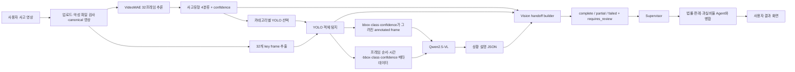

# Vision Agent 인수인계서

- 작성 기준일: 2026-07-25
- 대상 브랜치: `feat-accident-image-video-agent-result-flow`
- 로컬 기준 경로: `D:\dev\SKN27-FINAL-3Team\.worktrees\feat-accident-image-video-agent-result-flow`
- RunPod 기준 경로: `/workspace/SKN27-FINAL-3Team`
- 문서 범위: 데이터, 전처리, VideoMAE, YOLO, Qwen/LLaVA 실험, Supervisor handoff, RunPod 백업, 서비스 연결 및 배포 준비

> 이 문서는 현재 확인 가능한 코드, CSV, 로그, 모델 산출물 및 기존 보고서를 대조한 인수인계 기준 문서다. “1,200건 처리 완료”, “모델 출력 유효”, “서비스 배포 완료”는 서로 다른 상태이므로 반드시 구분한다.

---

## 1. 한눈에 보는 현재 상태

### 1.1 핵심 결론

1. 사고 영상은 `car_vs_car`, `car_vs_pedestrian`, `car_vs_motorcycle`, `car_vs_bicycle` 4개 유형으로 관리한다.
2. Qwen 32프레임 실험은 카테고리별 300건, 총 1,200건 모두 결과 행이 저장됐다.
3. 1,200건 중 Qwen 원본 출력이 모델 스키마를 만족한 결과는 651건, 54.25%다.
4. 나머지 549건은 삭제하거나 무시하지 않고 `partial`, `requires_review`, 안정된 오류 코드로 보존한다.
5. 영어 출력은 schema-valid 651건 중 650건, 99.85%로 안정적이었다.
6. Qwen은 현재 GPU에서 실행 가능하다. LLaVA는 48GB급 GPU에서도 CUDA OOM이 발생해 사용 가능한 비교 결과가 없다.
7. VideoMAE, YOLO, Qwen 결과를 Supervisor handoff JSON으로 만드는 로컬 파이프라인과 계약 테스트는 구현됐다.
8. RunPod Serverless용 client, worker, Dockerfile까지 코드는 있으나 실제 유료 Endpoint 배포와 원격 사용자 E2E는 아직 완료되지 않았다.
9. RunPod의 필수 코드, 구조화 결과, 체크포인트, 최종 1,200건 재현 입력은 로컬에 해시 검증해 백업했다. Pod는 삭제하지 않았다.

### 1.2 완료 상태를 구분하는 기준

| 구분 | 의미 | 현재 상태 |
|---|---|---|
| 처리 완료 | 고유 asset에 대해 32프레임 결과 행이 저장됨 | 1,200/1,200 완료 |
| model schema-valid | Qwen 원본 JSON이 필수 필드와 enum 계약을 만족 | 651/1,200, 54.25% |
| handoff-valid | 모델 실패를 포함해 Supervisor가 읽을 수 있는 안전한 결과로 변환 | fallback 및 계약 구현 |
| 로컬 E2E | 로컬/RunPod 프로젝트에서 VideoMAE+YOLO 결과를 handoff로 생성 | 확인 완료 |
| 운영 배포 | 실제 RunPod Serverless Endpoint를 통해 업로드부터 UX까지 실행 | 미완료 |

---

## 2. 프로젝트 목적과 Vision Agent의 책임

서비스의 최종 목적은 사고 영상을 보고 과실비율을 직접 확정하는 것이 아니다. Vision Agent는 영상에서 관찰 가능한 사실을 구조화해 Supervisor에 전달하고, Supervisor가 법률·판례·과실비율 Agent의 근거와 함께 최종 답변을 구성하도록 돕는다.

### 2.1 모델별 책임

| 구성요소 | 주 책임 | 하지 않아야 할 일 |
|---|---|---|
| VideoMAE | 사고유형 4분류, confidence 산출 | 법률 판단, 최종 과실비율 확정 |
| YOLO | 프레임별 객체 탐지, bbox, class, confidence 제공 | 사고유형의 최종 확정 |
| Qwen2.5-VL | 객체 관계, 사고 상황, 장면 조건, 가시성, 불확실성 설명 | VideoMAE 라벨을 무조건 덮어쓰기 |
| LLaVA | Qwen 대체 후보의 동일 조건 비교 | usable 결과 없이 운영 모델로 채택 |
| Vision 후처리 | JSON 파싱, 스키마 검증, partial fallback, review 표시 | 실패 결과를 정상 결과처럼 위장 |
| Supervisor | Vision과 법률·사례 근거 병합, 사용자 응답 조정 | Vision의 불확실성을 제거하거나 숨기기 |

### 2.2 현재 채택된 역할 분리

Qwen 4프레임 baseline에서 사고유형 정답률이 19.2%에 그쳤기 때문에 VLM을 최종 사고유형 분류기로 사용하지 않는다. 사고유형은 VideoMAE가 우선하며, Qwen은 상황 설명과 관찰 근거를 보완한다. VideoMAE와 Qwen이 불일치하면 자동으로 하나를 정답 처리하지 않고 `requires_review` 사유로 남기는 것이 안전한 운영 원칙이다.

---

## 3. 전체 데이터·모델 연결 흐름



### 3.1 YOLO가 Qwen에 전달하는 정보

정확한 입력 계약은 다음과 같다.

1. 영상에서 32개 프레임을 순서대로 추출한다.
2. YOLO가 각 프레임의 객체를 탐지한다.
3. 객체별 `class`, `confidence`, `bbox`를 기록한다.
4. 같은 정보를 사람이 볼 수 있도록 bbox와 객체명을 프레임 이미지에 그린다.
5. 프레임의 순서와 시간 정보도 메타데이터에 포함한다.
6. Qwen에는 annotated 이미지와 프레임별 메타데이터를 함께 전달한다.
7. Qwen은 이 근거를 사용해 상황 요약 JSON을 생성한다.

따라서 “YOLO가 Qwen에게 32프레임을 직접 보내는가”라는 질문에는, 구현상 파이프라인이 YOLO 탐지 결과로 만든 annotated 프레임과 메타데이터를 Qwen 입력으로 조립한다고 답하는 것이 정확하다. YOLO 자체가 네트워크 호출을 하는 구조는 아니다.

관련 구현:

- `ai/vision/vlm_input.py`: 이미지와 프레임 메타데이터의 입력 계약
- `ai/vision/run_to_supervisor.py`: 실제 서비스 파이프라인
- `scripts/vision/run_vlm32_independent.py`: RunPod 독립 benchmark runner
- `test/test_vlm_input_contract.py`: 프레임과 메타데이터 계약 테스트

---

## 4. 데이터 구성과 100건에서 300건으로 확장한 이유

### 4.1 사고 카테고리

| 코드 | 의미 | 최종 Qwen 분석 수 |
|---|---|---:|
| `car_vs_car` | 차대차 | 300 |
| `car_vs_pedestrian` | 차대보행자 | 300 |
| `car_vs_motorcycle` | 차대이륜차 | 300 |
| `car_vs_bicycle` | 차대자전거 | 300 |
| 합계 | 4개 카테고리 | 1,200 |

### 4.2 초기 400건 benchmark

초기에는 카테고리별 100건, 총 400건으로 다음을 빠르게 확인했다.

- 모델과 전처리 코드가 실제 영상에서 동작하는가
- 카테고리별 기본 오류 경향은 무엇인가
- Qwen이 사고유형 분류에 적합한가
- JSON 출력이 서비스 스키마로 안정적으로 변환되는가
- VideoMAE 지도 파인튜닝의 가능성이 있는가

그러나 표본이 적고 일부 학습 결과에서 train accuracy가 매우 높아지는 과적합 경향이 관찰됐다. 카테고리 차이와 JSON 실패율을 더 안정적으로 측정하기 위해 Qwen 분석 풀을 카테고리별 300건으로 확장했다.

### 4.3 데이터 확장 시 지킨 원칙

- 카테고리별 목표 개수는 동일하게 300건으로 유지했다.
- 결과 행의 고유 기준은 `asset_id`다.
- 32프레임 결과가 저장된 고유 asset 수로 실행 완료를 판단한다.
- JSON valid 결과만 완료로 세지 않는다.
- 기존 invalid도 재실행 시 기본적으로 건너뛰어 무한 재시도를 방지한다.
- invalid 재검사는 `--pilot-qwen-invalid N`을 명시한 경우에만 제한적으로 수행한다.

### 4.4 아직 남은 데이터 무결성 한계

초기 benchmark의 `incident_id`, 촬영 시점, 조명, 가시 대상 메타데이터는 보강됐으나 일부는 파일명에서 파생한 값이다. 공식 원본 사고 ID와의 대조 및 near-duplicate 검사는 최종 모델 성능을 주장하기 전에 필요하다. 1,200건 확장은 실행 안정성과 오류 분포를 확인하는 개발 데이터 성격이 강하며, 독립 holdout 성능을 의미하지 않는다.

---

## 5. 전처리 상세

### 5.1 기존 전처리

초기 방식은 영상 전체에서 주로 4프레임을 균등 추출하고, 많은 프레임에 CLAHE와 unsharp mask를 비슷하게 적용했다. 이 방식은 다음 문제가 있었다.

- 충돌 전후의 중요한 시간 변화가 4프레임 사이에서 빠질 수 있음
- 정상 주간 프레임까지 과도하게 선명화될 수 있음
- 야간 노이즈와 과노출을 서로 다른 문제로 처리하지 못함
- Qwen이 물체 관계를 판단할 근거가 부족함

### 5.2 적응형 전처리

개선 실험에서는 프레임의 밝기와 명암 상태를 먼저 판정하고 필요한 처리만 적용했다.

- 정상 밝기: 원본을 최대한 유지
- 저조도·야간: gamma 및 CLAHE 중심 보정
- 과노출: 밝기 억제
- 흐림이 큰 경우: 제한적인 선명화
- 과도한 일괄 보정 대신 상태별 분기

적응형 전처리는 `ai/vision/adaptive_preprocessing.py`를 기준으로 하며, 각 처리 결과와 밝기 상태를 CSV/메타데이터에 기록해 원본과 비교할 수 있게 했다.

### 5.3 32프레임 선택

최종 VLM 실험은 영상마다 32프레임을 입력한다. 프레임 순서가 시간 순서를 보존해야 하며, Qwen 입력에는 다음 정보가 함께 들어간다.

```text
frame_order
timestamp 또는 시간 순서
annotated image path
detections[
  class
  confidence
  bbox
]
```

향후에는 같은 영상에서 다음 세 조건을 paired 비교해야 한다.

| 조건 | 프레임 구성 | 목적 |
|---|---|---|
| A | 균등 32 | 현재 기준선 |
| B | 균등 16 + 변화량 상위 16 | 움직임 변화 반영 |
| C | 균등 16 + YOLO 충돌 후보 주변 16 | 사고 시점 근거 강화 |

현재 1,200건 결과는 이 세 조건의 정식 비교 결과가 아니라, 32프레임 계약의 대량 실행 안정성과 Qwen JSON 품질을 확인한 결과다.

### 5.4 YOLO 전처리와 시각 근거

초기 400건 실험에서 카테고리별 선정 YOLO는 다음과 같다.

| 사고유형 | 선정 모델 |
|---|---|
| 차대차 | `yolov8m.pt` |
| 차대보행자 | `yolo11n.pt` |
| 차대이륜차 | `yolov8m.pt` |
| 차대자전거 | `yolo11s.pt` |

서비스 경로에서는 VideoMAE 예측 카테고리에 따라 YOLO를 선택할 수 있고, 명시적 `--yolo-model` 값이 있으면 해당 모델을 사용한다. YOLO 결과는 최종 사고유형 정답이 아니라 관찰 근거다.

### 5.5 전처리 결과의 추가 활용

- annotated frame: Qwen 시각 입력 및 사람 검수
- bbox/class/confidence: Qwen 텍스트 메타데이터와 Supervisor 근거
- 프레임 순서/시간: 사고 전후 변화 설명
- 밝기/가시성 정보: scene condition 및 limitation
- 낮은 confidence: `requires_review` 판단
- 실패한 Qwen 결과: VideoMAE와 YOLO 결과만 남긴 partial handoff

---

## 6. 모델 실험의 목적과 진행 과정

### 6.1 ResNet18 baseline

목적은 frame-level 이미지 분류가 사고유형 분류에 어느 정도 가능한지 빠르게 확인하는 것이었다. 최고 test accuracy는 약 59.7%로 기록됐지만, 시간 변화가 중요한 사고 영상에 단일 프레임 중심 모델은 한계가 있었다. 이후 주 모델 후보는 시간 정보를 처리하는 VideoMAE로 이동했다.

### 6.2 VideoMAE 5초 clip 실험

YOLO/ByteTrack으로 사고 후보 시점을 찾고 그 주변 5초 clip을 만들어 VideoMAE로 분류하는 방식을 실험했다. 시간 정보를 활용하는 장점이 있었지만, 후보 시점이 빗나가면 사고 장면 자체가 clip에서 누락되는 변수가 생겼다.

### 6.3 VideoMAE raw-video 실험

clip 생성 실패 변수를 제거하기 위해 원본 약 10초 영상을 자르지 않고 프레임을 샘플링하는 실험을 추가했다. 현재 서비스 파이프라인도 원본 영상에서 VideoMAE 프레임을 읽는 경로를 사용한다.

확정된 exp4 32프레임 기록:

| 지표 | 값 |
|---|---:|
| test sample | 60 |
| Accuracy | 66.67% |
| Macro F1 | 66.94% |
| test loss | 0.881587 |
| confidence 0.5 미만 | 18.33% |

카테고리별:

| 카테고리 | Precision | Recall | F1 |
|---|---:|---:|---:|
| 차대자전거 | 77.78% | 46.67% | 58.33% |
| 차대차 | 75.00% | 80.00% | 77.42% |
| 차대이륜차 | 48.00% | 80.00% | 60.00% |
| 차대보행자 | 90.00% | 60.00% | 72.00% |

해석:

- 차대차가 상대적으로 안정적이다.
- 차대자전거 recall 46.67%는 실제 자전거 사고 누락 위험이 크다.
- 차대이륜차 precision 48%는 이륜차 예측 오탐 위험이 크다.
- confidence 0.5 미만 18.33%는 자동 확정 대신 review 전환이 필요하다.
- test sample이 60건뿐이므로 이 수치를 최종 운영 성능으로 과장하면 안 된다.

### 6.4 Qwen 4프레임 baseline

목적은 Qwen이 사고유형과 상황 정보를 구조화할 수 있는지 확인하는 것이었다.

| 지표 | 결과 |
|---|---:|
| 전체 분석 | 400/400 |
| JSON 정상 파싱 | 351/400 |
| 사고유형 정답 | 77/400, 19.2% |
| `uncertain` | 167/400 |
| JSON 파싱 오류 | 49/400 |

사고유형 정답 수는 차대차 63, 차대보행자 12, 차대이륜차 0, 차대자전거 2였다. 이 결과로 Qwen은 사고유형 확정 모델이 아니라 설명 보조 모델로 역할을 고정했다.

### 6.5 Qwen 32프레임 + YOLO 입력 계약 실험

목적은 다음 네 가지였다.

1. 4프레임보다 풍부한 시간 정보를 제공
2. YOLO 객체·bbox 근거를 Qwen에 전달
3. JSON schema-valid와 실패 원인을 대량 표본에서 측정
4. 실패해도 Supervisor가 사용할 수 있는 partial handoff 확보

초기 차대차 실행은 300건 중 valid 186건에서 정체된 것처럼 보였다. 원인은 GPU 중단이 아니라 runner가 “처리된 고유 결과” 대신 “valid 결과”를 완료 기준으로 세던 데 있었다. invalid를 반복 시도하면서 진행률이 오르지 않는 구조를 다음과 같이 수정했다.

- 완료 기준을 고유 32프레임 결과 행으로 변경
- `model_json_valid`와 `handoff_json_valid` 분리
- valid/invalid 관계없이 결과가 저장된 asset은 일반 재실행에서 skip
- 오류별 최대 1회 adaptive retry
- JSON incomplete 재시도는 `max_new_tokens=1024`
- 기타 재시도는 `max_new_tokens=512`
- invalid 결과를 `partial`, `requires_review`로 보존
- 명시적 pilot 옵션으로만 invalid 일부 재실행

이 변경 후 네 카테고리 모두 300건까지 정상 종료됐다.

### 6.6 LLaVA pilot

Qwen-invalid 30건을 대상으로 LLaVA가 더 안정적인 JSON과 설명을 만드는지 비교하려 했다. 그러나 48GB급 GPU에서 CUDA OOM이 발생해 사용 가능한 pilot 결과가 만들어지지 않았다. 따라서 현재는 다음만 결론 내릴 수 있다.

- 현재 하드웨어와 설정에서는 Qwen이 실행 가능
- LLaVA와의 내용 품질 우열은 아직 비교 불가
- LLaVA 전체 1,200건 확장은 승인할 근거가 없음

---

## 7. Qwen 1,200건 최종 결과

### 7.1 카테고리별 schema-valid

| 카테고리 | 처리 | model-valid | invalid | valid 비율 |
|---|---:|---:|---:|---:|
| car_vs_car | 300 | 197 | 103 | 65.67% |
| car_vs_pedestrian | 300 | 155 | 145 | 51.67% |
| car_vs_motorcycle | 300 | 149 | 151 | 49.67% |
| car_vs_bicycle | 300 | 150 | 150 | 50.00% |
| 합계 | 1,200 | 651 | 549 | 54.25% |

차대차가 가장 높지만 65.67%에 불과하며, 나머지 세 카테고리는 약 50%다. 따라서 현재 Qwen 원본 JSON을 검증 없이 Supervisor에 전달하면 안 된다.

### 7.2 JSON 실패 원인

상위 분류:

| 오류 분류 | 건수 |
|---|---:|
| `schema_invalid` | 300 |
| `json_incomplete` | 249 |
| 합계 | 549 |

세부 원인:

| 세부 오류 | 건수 |
|---|---:|
| `schema_invalid:missing:accident_situation` | 202 |
| `json_incomplete:Unterminated string starting at` | 86 |
| `json_incomplete:Expecting ',' delimiter` | 82 |
| `schema_invalid:missing:scene_conditions.evidence` | 74 |
| `json_incomplete:Expecting value` | 52 |
| `json_incomplete:Expecting property name enclosed in double quotes` | 29 |
| `schema_invalid:enum:bbox_helpfulness` | 14 |
| `schema_invalid:enum:predicted_accident_target` | 10 |

우선 개선 대상은 `accident_situation` 누락 202건이다. 단순 토큰 부족뿐 아니라 프롬프트의 필수 필드 강조와 출력 순서가 영향을 줄 수 있다. incomplete 249건은 생성 종료 위치와 토큰 길이를 표본 분석한 뒤 조정해야 한다.

### 7.3 처리시간

| 카테고리 | 총 실행시간 | 영상당 |
|---|---:|---:|
| car_vs_pedestrian | 5시간 49분 25초 | 69.88초 |
| car_vs_motorcycle | 6시간 4분 48초 | 72.96초 |
| car_vs_bicycle | 4시간 48분 34초 | 57.71초 |

- 위 900건 가중 평균: 영상당 66.85초
- 차대차는 재실행 로그에 시작·종료 시각이 없어 같은 기준의 평균에서 제외
- 일반 재실행은 저장된 valid/invalid를 모두 skip하므로 불필요한 장시간 재분석을 피함

### 7.4 GPU 메모리

- 실행 중 관찰 범위: 약 12.5~19.5GiB
- 관찰 최대치: 19,532MiB
- 완료 후: 14MiB, GPU 사용률 0%

GPU 프로세스가 없었던 시점은 runner가 종료돼 모델 프로세스가 메모리를 해제한 정상 상태였다. 진행률 정체와 GPU 프로세스 부재를 같은 원인으로 보면 안 된다.

### 7.5 영어 출력 안정성

- raw output 1,200건 중 한글 포함: 1건
- 기타 비영문·비한글 문자 출력: 0건
- schema-valid 651건 중 영어-only: 650건, 99.85%

영어 안정성은 매우 높다. 다만 현재 validator는 영문과 한글을 모두 허용하므로 운영 계약을 영어-only로 고정하려면 한글 1건 같은 출력을 `vision_qwen_language_invalid`로 분류하는 정책 결정이 필요하다.

### 7.6 Qwen 대비 LLaVA 개선 여부

판단 불가다. LLaVA는 OOM으로 usable 결과가 없기 때문에 Qwen보다 좋거나 나쁘다고 결론 내릴 수 없다. 현재 운영 후보는 실행 가능성과 증적이 있는 Qwen이다.

### 7.7 LLaVA 1,200건 확대 여부

현재는 확대하지 않는다. 다음 중 하나가 먼저 필요하다.

- 더 큰 VRAM 또는 메모리 절약 설정에서 30건 pilot 성공
- 동일 30건에서 schema-valid, 내용 정확도, 시간, 비용 비교
- Qwen보다 실질적으로 개선된다는 근거

---

## 8. JSON 검증, 재시도, fallback 계약

### 8.1 모델 출력과 handoff 출력 분리

- `model_json_valid`: Qwen 원본 응답이 모델 스키마를 만족했는지
- `handoff_json_valid`: Supervisor에 전달되는 외부 계약이 유효한지

모델이 실패해도 후처리가 안전한 partial JSON을 만들 수 있으므로 두 값은 같지 않다.

### 8.2 재시도 정책

| 상황 | 처리 |
|---|---|
| 최초 정상 | 저장 후 종료 |
| JSON incomplete | `max_new_tokens=1024`로 1회 재시도 |
| schema/enum 등 기타 오류 | 512 토큰으로 오류별 1회 재시도 |
| 재시도 후 invalid | partial/requires_review 저장 |
| 일반 재실행 | 기존 저장 결과는 valid/invalid 모두 skip |
| invalid pilot | `--pilot-qwen-invalid N`일 때만 N건 재분석 |

영상 하나의 생성 호출은 최초와 retry를 합쳐 최대 2회다. 이 제한은 비용과 무한 반복을 막는다.

### 8.3 안정된 Qwen 오류 코드

- `vision_qwen_input_contract`
- `vision_qwen_json_incomplete`
- `vision_qwen_schema_invalid`
- `vision_qwen_language_invalid`
- `vision_qwen_unavailable`
- `vision_qwen_skipped`

모델의 원문 예외, 로컬 절대 경로, prompt 전체를 Supervisor나 사용자 응답에 노출하지 않는다.

---

## 9. Supervisor handoff

### 9.1 스키마와 상태

- schema version: `vision-supervisor-handoff-v1`
- 허용 상태: `complete`, `partial`, `failed`
- 내부의 기존 `success` 상태는 handoff에서 `complete`로 정규화

### 9.2 상태 의미

| 상태 | 의미 | 대표 조건 |
|---|---|---|
| `complete` | 필수 Vision 결과가 모두 정상 | Qwen valid, 핵심 결과 존재 |
| `partial` | 일부 모델 실패지만 안전한 근거가 남음 | Qwen invalid/skipped, VideoMAE·YOLO 존재 |
| `failed` | 유효한 Vision 분석을 만들 수 없음 | 입력·모델·실행 전체 실패 |

예시:

```json
{
  "schema_version": "vision-supervisor-handoff-v1",
  "status": "complete",
  "model_analysis": {
    "qwen": {
      "valid": true,
      "requires_review": false,
      "error_code": null
    }
  }
}
```

```json
{
  "schema_version": "vision-supervisor-handoff-v1",
  "status": "partial",
  "model_analysis": {
    "qwen": {
      "valid": false,
      "requires_review": true,
      "error_code": "vision_qwen_json_incomplete"
    }
  }
}
```

### 9.3 실제 확인한 handoff E2E

- 입력: `aihub_train_00003498_bb_3_150717_bike_38_014.mp4`
- key frames: 32
- handoff status: `partial`
- Qwen: `vision_qwen_skipped`
- RunPod 출력: `/workspace/SKN27-FINAL-3Team/storage/vision/outputs/supervisor_handoff/vision_supervisor_handoff_aihub_train_00003498_bb_3_150717_bike_38_014.json`

이 검증은 실제 RunPod 프로젝트에서 VideoMAE+YOLO 결과가 Supervisor handoff로 만들어지는 것을 확인한 것이다. 실제 RunPod Serverless Endpoint를 통한 원격 서비스 E2E를 의미하지는 않는다.

---

## 10. 주요 코드와 실행 진입점

| 파일 | 역할 |
|---|---|
| `ai/vision/run_to_supervisor.py` | VideoMAE → YOLO → Qwen → handoff 전체 실행 |
| `ai/vision/vlm_input.py` | annotated frame과 YOLO metadata 입력 계약 |
| `ai/vision/vlm_json.py` | JSON 추출·파싱·오류 분류 |
| `ai/vision/build_supervisor_handoff.py` | Supervisor용 정규화 결과 생성 |
| `ai/vision/adaptive_preprocessing.py` | 밝기·명암 기반 적응형 전처리 |
| `ai/vision/pipeline.py` | key frame 및 YOLO 처리 공통 흐름 |
| `ai/vision/train_videomae_classifier.py` | VideoMAE 학습 |
| `ai/vision/videomae_infer.py` | VideoMAE 추론 |
| `scripts/vision/run_vlm32_independent.py` | 카테고리별 300건 YOLO/Qwen/LLaVA runner |
| `ai/vision/runpod_worker.py` | RunPod Serverless worker handler |
| `app/services/runpod_vision_client.py` | `/run`, `/status` 원격 client |
| `app/services/vision_media_analysis_adapter.py` | local/runpod provider 분기 및 allowlist |
| `deploy/runpod-vision/Dockerfile` | Serverless worker 이미지 |

### 10.1 서비스 파이프라인 실행

직접 파일 실행은 프로젝트 import 경로를 잃을 수 있으므로 패키지 방식으로 실행한다.

```bash
cd /workspace/SKN27-FINAL-3Team
python -m ai.vision.run_to_supervisor INPUT.mp4 \
  --checkpoint storage/vision/models/videomae_raw_video/per_label_300_32frames/videomae_cls_20260724_002551
```

현재 기본 Qwen 모델은 `Qwen/Qwen2.5-VL-3B-Instruct`, 기본 VLM 프레임 수는 32다. 운영 배포 전에 정확한 Hugging Face revision까지 고정해야 재현 가능한 모델 identity가 된다.

### 10.2 독립 Qwen 실행

```bash
cd /workspace/SKN27-FINAL-3Team
python scripts/vision/run_vlm32_independent.py qwen \
  --category car_vs_car
```

기존 invalid 일부만 재실행:

```bash
python scripts/vision/run_vlm32_independent.py qwen \
  --category car_vs_car \
  --pilot-qwen-invalid 30
```

LLaVA pilot:

```bash
python scripts/vision/run_vlm32_independent.py llava \
  --category car_vs_car \
  --pilot-qwen-invalid 30
```

---

## 11. 결과 파일과 모델 위치

### 11.1 구조화 결과

기준 루트:

```text
storage/vision/outputs/category_yolo_qwen_compare/
```

카테고리별 32프레임 결과의 주요 파일:

```text
<category>/known_label_adaptive_32frames/qwen_yolo_compare_results.csv
<category>/known_label_adaptive_32frames/yolo_summary.csv
<category>/known_label_adaptive_32frames/annotated_frames/
```

RunPod에서 로컬로 구조화 결과 80개 파일을 `storage/vision/outputs` 아래에 동기화했다.

### 11.2 VideoMAE 체크포인트

```text
storage/vision/models/videomae_raw_video/
  per_label_100_exp4_32frames_adaptive_labeled/
    videomae_cls_20260722_145601/
  per_label_300_32frames/
    videomae_cls_20260724_002551/
```

두 체크포인트의 `model.safetensors`를 RunPod에서 로컬로 복사하고 해시를 검증했다.

### 11.3 핵심 보고서

- `docs/vision/vision_qwen_1200_final_and_handoff_2026-07-25.md`
- `docs/vision/vision_progress_and_revised_analysis_direction_2026-07-23.md`
- `docs/vision/vision_preprocessing_experiment_sync_report_2026-07-22.md`
- `docs/vision/vision_car_vs_car_preprocessing_comparison_2026-07-22.md`
- `docs/vision/vision_supervisor_handoff_readiness_2026-07-23.md`
- `docs/superpowers/specs/2026-07-24-runpod-serverless-vision-design.md`
- `docs/ops/vision-media-adapter-runbook.md`

---

## 12. RunPod 백업과 Pod 삭제 전 확인

### 12.1 검증된 필수 백업

경로:

```text
artifacts/runpod-backup-20260725/
```

필수 archive:

| 파일 | 크기 | SHA-256 |
|---|---:|---|
| `runpod_vision_backup_20260725.tar.gz` | 1,575,997,517 bytes | `7a9997bb52eb5e04503d9c84ee7c8e56072ef73eccfe896258fd7fe3c5a151be` |
| `repro-inputs/vision_repro_inputs_20260725.tar` | 19,064,576,000 bytes | `ac264147d7ab954018fdb4be8276d7a0fc7f2e1fe9f309fde08d168f4864130b` |

첫 archive에는 Vision 코드, 문서, 테스트, 구조화 결과, 두 VideoMAE 체크포인트, RunPod root runner·로그·GPU CSV·실행 notebook이 포함된다.

재현 입력 archive에는 다음이 포함된다.

- RunPod에 남아 있던 원본 영상: 823개
- 최종 frame directory: 1,171개
- 결과가 직접 파일을 가리키는 입력: 29개
- 1,171개 frame directory + 29개 direct input으로 최종 Qwen 1,200행 전체 입력 범위 보존
- RunPod 자체에도 이미 없었던 원본 영상: 377개

377개 asset은 `repro-inputs/missing_selected_raw_asset_ids_20260725.txt`에 기록했고 dataset manifest와 Drive source URL은 보존했다.

### 12.2 전체 RunPod 인벤토리

| 분류 | 파일 수 | 바이트 |
|---|---:|---:|
| 전체 프로젝트 | 1,682,179 | 548,952,227,493 |
| 생성 프레임 | 1,367,040 | 417,170,143,612 |
| 원본 영상 | 2,000 | 13,170,886,323 |
| 모델 | 18 | 689,955,163 |
| 구조화 결과 | 80 | 33,680,584 |

수백 GB의 비최종 중간 프레임은 재생성 가능하고 최종 1,200건 재현에 불필요해 로컬로 모두 복사하지 않았다. 전체 경로, 크기, 시각은 `runpod_inventory.tsv`에 남아 있다.

### 12.3 로컬과 RunPod 코드 대조

초기 비교:

- 동일 23
- 내용 다름 33
- 로컬 누락 135
- RunPod workspace-root 증적 183

동기화 후:

- 동일 106
- 내용 다름 33
- canonical 경로 누락 52
- workspace-root 증적 183/183 보존

33개 다른 파일은 로컬 코드가 더 최신이어서 덮어쓰지 않았다. 예를 들어 RunPod의 일부 `pipeline.py`는 기본 5프레임이지만 현재 로컬은 32프레임 계약을 사용한다. RunPod의 오래된 중복 runner를 현재 로컬 runner 위에 복사하면 완료·retry 수정이 사라질 수 있다.

52개 파일은 실행 notebook, rollback 복사본, public YOLO weight, 배포 archive, bytecode 등이라 검증 archive에만 보존했다.

### 12.4 Pod를 삭제하기 전에 추가 판단이 필요한 자산

다음이 필요하면 Pod를 유지하거나 별도 백업한다.

1. 최종 1,200건 외 추가 원본 영상 1,177개
2. 비최종 annotated/preprocessed 중간 프레임 전체
3. 오프라인 사용을 위한 Hugging Face cache
4. 현재 패키지·CUDA 환경의 완전한 snapshot

위 네 항목은 최종 구조화 결과, 두 체크포인트, 최종 Qwen 입력 재현에는 필수는 아니다. 현재 Pod는 삭제하지 않은 상태다.

---

## 13. 테스트와 확인된 증적

### 13.1 Vision 계약 검증

- 초기 로컬 계약·JSON·입력·runner 테스트: 29 passed
- handoff 상태 subtest: 4 passed
- 최종 백업 후 관련 회귀 테스트: 131 passed, 1 warning, 4 subtests passed
- RunPod 서비스 파일 문법 검사 통과
- 로컬과 RunPod 서비스 코드 SHA-256 일치 확인 시점 존재
- 실제 RunPod VideoMAE+YOLO handoff 생성 E2E 통과

### 13.2 중요 테스트 파일

- `test/test_vlm_input_contract.py`
- `test/test_vlm_json.py`
- `test/test_vlm_runner_build.py`
- `test/test_vision_run_to_supervisor.py`
- `test/test_vision_supervisor_handoff.py`
- `test/test_videomae_frame_directory.py`
- RunPod adapter/client/worker 관련 test

### 13.3 현재 Git 상태 주의

Vision 관련 수정과 백업은 아직 미커밋 변경을 포함한다. 다른 브랜치에서 작업하거나 UI/UX 브랜치로 이동하기 전에 이 worktree를 그대로 보존하고, 변경 범위를 검토한 뒤 의도적으로 commit해야 한다. 사용자가 요청하지 않은 상태에서 자동 commit·push하지 않는다.

---

## 14. 운영 배포 구현 상태

### 14.1 코드로 구현된 범위

- `VISION_RUNTIME_PROVIDER=local|runpod` 분기
- RunPod Queue API `POST /run`
- `GET /status/{job_id}` polling
- execution별 job ID cache 및 재사용
- S3 HTTPS signed URL 경계
- 응답 allowlist 및 schema 재검증
- worker 입력의 host, MIME, 크기, timeout 검증
- 임시 영상·프레임·출력 정리
- API key, signed URL query, 내부 경로, provider 원문 오류 비노출
- RunPod worker와 Dockerfile

### 14.2 아직 완료되지 않은 실제 배포

- container registry에 immutable image push
- 과금 가능한 RunPod Serverless Endpoint 생성
- 승인된 VideoMAE checkpoint 및 Qwen artifact/Network Volume 연결
- restricted API key와 private runtime env 설정
- 실제 S3 signed URL을 이용한 `/run` → `/status`
- 원격 결과를 Supervisor가 수신하는 실환경 contract test
- 사용자 업로드 → scan → RunPod → Supervisor → UX 결과 화면 E2E
- cold start, timeout, 비용 상한 확인

현재 Jupyter Pod는 분석 환경이지 운영 Serverless Endpoint가 아니다. 따라서 현재 상태를 “배포 완료”라고 표현하면 안 된다.

### 14.3 배포 전 확인할 코드 위험

이전 점검에서 worker/adapter가 완료 결과도 `partial`로 고정할 가능성이 확인됐다. 실제 Endpoint 활성화 전에 `complete`가 손실 없이 전달되는지 complete/partial/failed 세 상태를 원격 E2E로 검증해야 한다.

또한 benchmark에서 사용한 Qwen의 정확한 revision과 서비스 기본 모델 identity를 맞추고 해시 또는 revision을 동결해야 한다.

---

## 15. 운영·장애 대응

### 15.1 진행 상황 확인 기준

장시간 실행에서는 다음 세 값을 함께 본다.

1. CSV의 고유 32프레임 결과 수
2. `model_json_valid=True` 수
3. GPU/프로세스 상태

valid 수만 보면 차대차 186/300 정체와 같은 오판이 생긴다. CSV 고유 처리 수가 증가하면 invalid가 포함돼도 정상 진행이다.

### 15.2 대표 장애와 조치

| 증상 | 원인 후보 | 조치 |
|---|---|---|
| valid 수가 안 늘어남 | invalid 결과가 계속 생김 | 고유 처리 수 확인 |
| 같은 영상 반복 | 완료 기준이 valid에 묶임 | 저장된 valid/invalid 모두 skip하는 최신 runner 확인 |
| GPU 프로세스 없음 | runner 종료 또는 OOM | 로그 종료 코드와 CSV 최종 행 확인 |
| JSON 끝이 잘림 | 생성 토큰 부족 | incomplete retry 1024 적용 여부 확인 |
| 필수 필드 누락 | prompt/schema 불안정 | 오류 코드 집계 후 prompt 개선 |
| LLaVA 즉시 실패 | VRAM 부족 | pilot 중단, Qwen 작업 보호 |
| Qwen 실패로 전체 결과 없음 | fallback 미작동 | partial handoff와 VideoMAE·YOLO 보존 확인 |
| RunPod 중복 과금 | `/run` POST 자동 재시도 | POST 자동 반복 금지, 받은 job ID부터 polling |

### 15.3 안전한 원격 오류 코드

- `vision_remote_execution_failed`
- `vision_remote_cancelled`
- `vision_remote_timeout`
- `vision_remote_unavailable`
- `vision_remote_invalid_response`

운영자는 `job_id`, `execution_id`, `attachment_id`, 상태, stable error code, latency만 추적하고 secret·signed URL·원본 예외는 사용자에게 노출하지 않는다.

---

## 16. 다음 담당자의 우선순위

### P0. 현재 결과를 안전하게 동결

- [ ] 이 worktree의 Vision 변경 diff 검토
- [ ] 구조화 결과와 두 체크포인트 경로 확인
- [ ] 백업 두 archive의 SHA-256 재확인
- [ ] 최종 1,200건 CSV의 고유 asset 수와 valid/invalid 재집계
- [ ] 코드, 설정, 모델 revision, 결과 hash를 release manifest로 동결
- [ ] 의도한 Vision 파일만 commit

### P1. Qwen JSON 품질 개선

- [ ] `missing:accident_situation` 202건 표본 분석
- [ ] `missing:scene_conditions.evidence` 74건 표본 분석
- [ ] incomplete 249건의 생성 길이와 중단 위치 분석
- [ ] 필수 필드를 JSON 앞부분에 배치하는 최소 prompt 실험
- [ ] enum 24건의 허용값 반복 강조 또는 정규화 검토
- [ ] 같은 고정 pilot에서 변경 전후 schema-valid 비교
- [ ] model-valid 결과도 카테고리별 사람이 내용 검수

### P2. YOLO 근거의 실제 기여도 검증

- [ ] 동일 영상·동일 Qwen에서 원본 32프레임과 annotated+metadata 32프레임 paired 비교
- [ ] bbox 객체 관계 설명의 정확도
- [ ] 충돌 시점 가시성
- [ ] 잘못된 YOLO bbox가 Qwen을 오도하는 사례
- [ ] `bbox_helpfulness`와 실제 reviewer 평가의 일치도

### P3. VideoMAE 품질과 review threshold

- [ ] 공식 incident ID 또는 신뢰 가능한 group 기준 확보
- [ ] near-duplicate split 누수 검사
- [ ] validation에서 confidence threshold 선택
- [ ] precision/recall/F1, macro F1, confusion matrix 재산출
- [ ] 차대자전거 낮은 recall에 대한 강제 review 정책
- [ ] 차대이륜차 낮은 precision에 대한 강제 review 정책
- [ ] 독립 holdout에서 최종 1회 평가

### P4. RunPod Serverless 실제 배포

- [ ] immutable worker image build/push
- [ ] 모델 artifact 및 Network Volume 승인
- [ ] Endpoint와 restricted secret 설정
- [ ] 비식별 fixture 원격 smoke
- [ ] complete/partial/failed 각 1건 contract test
- [ ] upload → scan → `/run` → `/status` → Supervisor → UX E2E
- [ ] cold start, 처리시간, GPU 메모리, 비용 기록
- [ ] worker/adapter의 partial 고정 여부 수정 및 검증

### P5. LLaVA 재검토 조건

- [ ] 더 큰 VRAM 또는 메모리 절약 설정 확보
- [ ] Qwen-invalid 30건 pilot 성공
- [ ] schema-valid, 내용 정확도, 시간, GPU 비용 비교
- [ ] 개선이 입증된 경우에만 범위 확대

---

## 17. 인수인계 체크리스트

### 데이터

- [x] 카테고리별 300건 Qwen 결과 저장
- [x] 최종 1,200행 입력 범위 백업
- [x] RunPod 인벤토리 저장
- [x] RunPod에 이미 없던 원본 377 asset 기록
- [ ] 공식 incident ID 검증
- [ ] near-duplicate 누수 검증

### 모델

- [x] Qwen 1,200건 실행
- [x] VideoMAE 두 체크포인트 로컬 동기화
- [x] Qwen JSON 오류 분류
- [x] LLaVA OOM 사실 기록
- [ ] 운영 Qwen exact revision 동결
- [ ] VideoMAE 최종 threshold 확정

### 코드와 계약

- [x] 32프레임 기본값
- [x] YOLO annotated frame + metadata 입력 계약
- [x] adaptive retry
- [x] model-valid/handoff-valid 분리
- [x] partial/requires_review fallback
- [x] stable Qwen error code
- [x] `vision-supervisor-handoff-v1`
- [x] contract test와 로컬 handoff E2E
- [ ] 변경 commit 및 PR

### 배포

- [x] RunPod client/worker/Dockerfile 코드
- [x] local/runpod provider 분기
- [ ] registry image push
- [ ] 실제 Serverless Endpoint
- [ ] secrets 및 모델 volume 설정
- [ ] 원격 Supervisor E2E
- [ ] UX 최종 결과 E2E

### 백업

- [x] 필수 archive 해시 검증
- [x] 재현 입력 archive 해시 검증
- [x] 구조화 결과와 모델 canonical 경로 동기화
- [x] 최신 로컬 코드를 오래된 RunPod 코드로 덮어쓰지 않음
- [x] Pod 미삭제

---

## 18. 인수인계 시 반드시 전달할 판단

1. Qwen 1,200건은 모두 실행됐지만 schema-valid는 54.25%다.
2. invalid 549건은 분석하지 않은 것이 아니라 분석 후 안전한 fallback으로 보존한 결과다.
3. JSON valid와 영상 상황 설명의 의미 정확도는 별도다. valid 651건도 사람 표본 검수가 필요하다.
4. Qwen은 설명 모델이며 사고유형 확정은 VideoMAE가 우선한다.
5. YOLO는 32프레임에 bbox·객체명 근거를 제공하며, annotated 이미지와 metadata가 함께 Qwen에 들어간다.
6. LLaVA는 OOM 때문에 Qwen과 우열을 판단할 자료가 없다.
7. Supervisor handoff 1차 계약은 구현됐지만 실제 RunPod Serverless 운영 배포는 아직 아니다.
8. RunPod 필수 자산은 로컬에 검증 백업했지만, 수백 GB의 재생성 가능한 중간 프레임 전체는 가져오지 않았다.
9. Pod 삭제는 사용자가 별도로 결정해야 하며 현재는 삭제하지 않았다.
10. 다음 단계의 최우선은 새 모델을 늘리는 것이 아니라 Qwen JSON 실패의 큰 두 원인과 VideoMAE threshold를 검증하는 것이다.

---

## 19. 용어

| 용어 | 의미 |
|---|---|
| asset | 한 개의 분석 대상 영상 또는 그 결과 식별 단위 |
| schema-valid | 모델 원본 JSON이 필수 필드·타입·enum을 만족 |
| handoff-valid | Supervisor가 안전하게 읽을 수 있는 외부 계약 |
| annotated frame | YOLO bbox와 객체명이 그려진 프레임 |
| partial | 일부 모델 실패지만 사용 가능한 근거가 남은 상태 |
| requires_review | 자동 확정하지 않고 사람이 확인해야 하는 상태 |
| adaptive retry | 실패 종류에 따라 토큰 등 재시도 조건을 바꾸는 방식 |
| paired comparison | 동일 영상에서 한 변수만 바꿔 결과를 비교하는 실험 |
| Serverless Endpoint | Jupyter Pod와 별개인 RunPod 운영 Queue API |
| canonical video | 업로드·검사·정규화 경계를 통과한 서비스 입력 영상 |

---

## 20. 문서 근거

본 문서는 다음 자료를 기준으로 작성했다.

- Qwen 1,200건 최종 결과 보고서
- 전처리 실험 및 동기화 보고서
- 400건 benchmark와 VideoMAE exp4 평가 보고서
- Qwen/YOLO 입력 계약과 runner 코드
- Supervisor handoff schema와 테스트
- RunPod Serverless 설계 및 운영 runbook
- RunPod 전체 인벤토리와 해시 비교표
- 검증된 필수 백업 archive와 재현 입력 archive

수치가 충돌할 때는 2026-07-25 최종 CSV·로그 집계와 해시 검증된 로컬 파일을 우선한다. 과거 보고서의 “진행 중”, “보류”, “미완료” 표기는 당시 시점의 기록이며, 이 문서의 현재 상태 표가 최신 판단이다.
