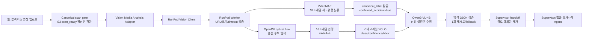

# Vision(DL) 100건 최종 분석 및 웹·에이전트 연결 보고서

작성일: 2026-07-29 
대상: 차대차·차대보행자·차대이륜차·차대자전거 각 100건, 총 400건 
분석 범위: 정제 100건 데이터, VideoMAE, OpenCV, YOLO, Qwen2.5-VL, Qwen3-VL, 웹→RunPod→Supervisor handoff 
제외 범위: 환경·날씨·노면 확장 분석, 16/24프레임 비교, Vision Agent 이후 FR

## 기술 요약

**운영 설명 모델은 `Qwen/Qwen3-VL-4B-Instruct`가 적합하다.** 동일한 400개 영상과 동일한 VideoMAE·YOLO·16프레임 입력에서 Qwen3는 Qwen2.5보다 JSON 유효률이 93.5%에서 98.5%로 5.0%p 높았고, fallback은 6.5%에서 1.5%로 5.0%p 낮았다. 확정 사고를 비사고로 부정하는 문장은 32/400(8.0%)에서 0/400(0%)로 감소했다. 평균 지연시간은 12.295초에서 16.069초로 3.774초(30.7%) 증가했지만, p95는 25.79초에서 25.18초로 비슷했고 측정된 GPU peak는 14,316.8MiB에서 12,991.6MiB로 낮았다.

**사고유형 분류 운영 checkpoint는 기존 카테고리별 300건 학습 checkpoint이다.** 같은 고정 test 40건에서 accuracy 25/40(62.5%), macro F1 62.06%로 기존 100건 checkpoint의 42.5%/43.13%, 새 정제 100건 checkpoint의 32.5%/30.23%보다 높았다. 전체 400건을 이 checkpoint로 다시 예측했을 때 accuracy는 288/400(72.0%)였지만, 이는 독립 test가 아닌 전체 데이터 기술 통계이므로 일반화 성능으로 해석하면 안 된다.

**가장 큰 개선은 모델 크기 자체보다 책임 경계를 고정한 것이다.** VideoMAE가 사고유형을 결정하고, Qwen은 `confirmed_accident=true`와 읽기 전용 `canonical_label`을 입력받아 보이는 장면만 설명한다. 이 계약으로 Qwen이 사고 존재나 유형을 다시 판단하던 충돌을 제거했다.

현재 결론은 다음과 같다.

1. 서비스 기본 설명 모델: `Qwen/Qwen3-VL-4B-Instruct`
2. 사고유형 분류: 고정 test에서 가장 우수한 기존 per-label-300 VideoMAE checkpoint
3. VideoMAE 입력: 영상당 32프레임
4. OpenCV·YOLO·Qwen 근거 입력: 충돌 후보 중심 16프레임(문맥/직전/충돌/직후 각 4)
5. 운영 조건: JSON 재시도·fallback·human review를 유지하고, Qwen은 사고유형·과실·법적 책임을 결정하지 않음

## 1. 전체 아키텍처

### 1.1 모듈별 입력·출력·책임

| 단계 | 입력 | 출력 | 책임 | 하지 않는 일 |
|---|---|---|---|---|
| 웹·scan gate | 업로드 영상 | scan-ready S3 참조 | 악성·미검증 파일 차단 | 영상 해석 |
| Adapter/RunPod client | canonical attachment | 제한된 RunPod request | 서명 URL, timeout, 재사용 job 관리 | 모델 추론 |
| RunPod worker | HTTPS 영상 URL | 안전한 handoff JSON | host·크기·다운로드·실행 제한 | 과실 판단 |
| OpenCV | 원본 영상 | optical-flow score, 충돌 후보 | 저비용 시간 위치 탐색 | 사고유형 분류 |
| VideoMAE | 32프레임 | 4개 사고유형 확률 | 사고유형과 confidence 결정 | 자연어 상황 설명 |
| YOLO | 16개 근거 프레임 | 객체 class/confidence/bbox | 객체 존재 근거 제공 | 사고유형·책임 판단 |
| Qwen3-VL | 잠긴 유형, YOLO, 16프레임 | narrative, frame 근거, uncertainty | 보이는 사실 설명 | 유형 재분류, 과실·법률 결론 |
| JSON/handoff | 모델 출력 | 검증·정규화된 compact JSON | schema, fallback, review 계약 | 미확인 사실 보완 |
| Supervisor | Vision handoff | 후속 Agent 입력 | 사례·법률 검색 라우팅 | Vision 결과를 확정 법률 판단으로 취급 |

### 1.2 영상 한 건 처리 흐름

1. 사용자가 웹에 블랙박스 영상을 올린다.
2. scan gate가 통과한 `blackbox_video`만 Vision 노드가 선택한다.
3. RunPod worker가 서명 URL의 host, HTTPS, 파일 크기, content type, timeout을 검증한다.
4. VideoMAE가 32프레임으로 사고유형 확률을 계산한다.
5. 최고 확률 유형을 `canonical_label`로 잠근다. confidence가 임계치보다 낮으면 review 대상으로 표시한다.
6. OpenCV가 영상 전체를 저해상도 optical flow로 훑어 motion peak를 충돌 후보로 잡는다.
7. 문맥 4, 충돌 직전 4, 충돌 부근 4, 충돌 이후 4의 총 16프레임을 생성한다.
8. VideoMAE 유형에 대응하는 YOLO weight가 16프레임의 객체 class, confidence, bbox를 생성한다.
9. Qwen3는 `confirmed_accident=true`, 잠긴 유형, 프레임 순서·시간·역할, YOLO 객체를 받아 설명 JSON만 생성한다.
10. JSON validator가 필수 필드, 배열 수, frame reference를 검사한다. 실패하면 오류에 맞춘 prompt로 한 번 재시도한다.
11. 재시도도 실패하면 VideoMAE·YOLO 결과는 보존하고 Qwen만 fallback 처리한다.
12. 로컬 경로와 원시 예외문을 제거한 handoff를 Supervisor에 전달한다.

## 2. 데이터와 평가 정의

### 2.1 데이터 구성

| 항목 | 값 |
|---|---:|
| 차대차 | 100 |
| 차대보행자 | 100 |
| 차대이륜차 | 100 |
| 차대자전거 | 100 |
| 총 영상 | 400 |
| train / validation / test | 280 / 80 / 40 |
| 고유 asset_id | 400/400 |
| 고유 incident_id | 400/400 |
| 고유 SHA-256 | 400/400 |
| VideoMAE 입력 | 영상당 32프레임 |
| OpenCV·YOLO·Qwen 입력 | 영상당 16프레임 |
| 생성 근거 프레임 | 6,400 |

분할은 카테고리별 70/20/10이다. 모델 checkpoint 비교는 동일한 test 40건(카테고리별 10건)에서 수행했다. Qwen 비교는 사고 장면 설명 안정성을 보기 위해 전체 400건을 동일 asset_id로 paired 비교했다.

### 2.2 지표 정의

- **accuracy**: VideoMAE 정답 수 / 평가 영상 수
- **macro F1**: 네 카테고리 F1의 동일 가중 평균
- **model JSON valid**: Qwen 원출력이 엄격한 설명 schema를 그대로 통과한 비율
- **handoff valid**: fallback을 포함한 최종 Supervisor JSON이 계약을 통과한 비율
- **fallback**: Qwen 원출력이 실패해 안전한 대체 설명을 사용한 비율
- **label preservation**: 최종 Qwen 결과의 canonical label이 VideoMAE 입력과 동일한 비율
- **비사고 부정률**: 확정 사고 입력인데 설명이 “no accident/no collision”과 같은 부정 표현을 포함한 비율
- **latency**: 영상 한 건의 Qwen 추론 시간. 평균·중앙값·p95를 함께 본다.
- **GPU peak**: 해당 실행에서 관측한 최대 CUDA allocation. 다른 환경 간 절대 비교가 아니라 동일 RunPod 실행 내 비교 지표다.

## 3. 활용 모델의 역할·선정 이유·장단점

| 구성요소 | 실제 역할·버전 | 선정 이유 | 장점 | 단점·실패 가능성 |
|---|---|---|---|---|
| OpenCV | Farneback optical flow, adaptive preprocessing | 전체 영상을 저비용으로 훑고 충돌 후보를 찾기 위해 사용 | 빠름, 모델 다운로드 불필요, 시간 위치를 설명 가능 | 카메라 흔들림·급회전도 높은 motion으로 볼 수 있음 |
| YOLO | 차대차·이륜차 `yolov8m.pt`, 보행자 `yolo11n.pt`, 자전거 `yolo11s.pt` | 카테고리 실험에서 선택된 weight를 유형별로 사용 | class/confidence/bbox가 명확하고 빠름 | 가림·야간·원거리·작은 객체에 취약, 접촉 자체는 분류하지 않음 |
| VideoMAE | 4-class fine-tuned checkpoint, 32프레임 | 공간 한 장이 아닌 시간 변화로 사고유형을 고정하기 위해 사용 | 일관된 유형 분류, Qwen 책임 축소 | 데이터 품질·분할 누수·클래스 혼동에 민감, 설명 능력 없음 |
| Qwen2.5-VL | `Qwen/Qwen2.5-VL-3B-Instruct` | 기존 기준선과 과거 결과가 있어 비교 기준으로 유지 | 평균 지연시간이 짧고 경량 | JSON 실패 6.5%, 비사고 부정 8.0%, 상황 설명 충돌 사례 |
| Qwen3-VL | `Qwen/Qwen3-VL-4B-Instruct` | 20건 pilot과 전체 400건에서 schema·부정 표현이 개선됨 | JSON 98.5%, fallback 1.5%, 부정 0%, 영어 100% | 평균 지연시간 30.7% 증가, 여전히 6건 fallback |
| JSON validator | `vision-qwen-explanation-v1` | 자유문을 Agent에 직접 넘기지 않기 위해 사용 | frame reference·배열 수·필수 필드 검증 | schema가 과도하면 유효한 설명도 fallback될 수 있음 |

### 대체 후보와 운영 판단

- Qwen3-VL 8B 이상은 품질 잠재력은 있으나 단일 GPU 메모리와 latency 비용이 커 pilot 통과 전 운영 기본값으로 채택하지 않는다.
- Qwen 27B급 4-bit는 별도 성능 실험 대상일 수 있으나 이번 100건 최종 서비스 경로에는 포함하지 않는다.
- YOLO는 “사고유형 분류기”가 아니라 객체 근거 생성기다. 유형은 계속 VideoMAE가 담당해야 한다.
- Qwen 실패가 전체 분석 실패가 되어서는 안 된다. VideoMAE·YOLO 결과와 review flag를 남기는 부분 성공 계약이 필요하다.

## 4. VideoMAE checkpoint 비교

### 4.1 동일 test 40건 결과

| checkpoint | accuracy | macro F1 | low confidence |
|---|---:|---:|---:|
| 기존 per-label-100 | 17/40 (42.5%) | 43.13% | 12/40 (30.0%) |
| **기존 per-label-300** | **25/40 (62.5%)** | **62.06%** | **6/40 (15.0%)** |
| 새 정제 per-label-100 | 13/40 (32.5%) | 30.23% | 24/40 (60.0%) |

기존 per-label-300 checkpoint가 accuracy와 macro F1 모두 가장 높고 low-confidence 비율도 가장 낮다. 따라서 이 checkpoint를 운영 분류기로 선택했다. 새 정제 100건만으로 3 epoch 재학습한 모델은 표본 수가 적고 confidence가 충분히 형성되지 않아 운영 후보에서 제외했다.

### 4.2 선택 checkpoint의 카테고리별 결과

| 카테고리 | Precision | Recall | F1 | 정답 |
|---|---:|---:|---:|---:|
| 차대자전거 | 77.78% | 70.00% | 73.68% | 7/10 |
| 차대차 | 50.00% | 60.00% | 54.55% | 6/10 |
| 차대이륜차 | 80.00% | 40.00% | 53.33% | 4/10 |
| 차대보행자 | 57.14% | 80.00% | 66.67% | 8/10 |

가장 큰 약점은 차대이륜차 recall 40%다. 실제 이륜차 10건 중 4건이 차대차로, 1건이 차대자전거로, 1건이 차대보행자로 분류됐다. 이륜차가 작거나 가려지고 차량과 함께 나타나는 장면에서 시간 정보만으로 상대 객체를 구분하기 어렵다는 뜻이다. 차대차도 3/10이 차대보행자로 혼동됐다.

### 4.3 Confusion matrix

행은 실제, 열은 예측이며 순서는 자전거·차·이륜차·보행자다.

| 실제＼예측 | 자전거 | 차 | 이륜차 | 보행자 |
|---|---:|---:|---:|---:|
| 자전거 | 7 | 1 | 0 | 2 |
| 차 | 0 | 6 | 1 | 3 |
| 이륜차 | 1 | 4 | 4 | 1 |
| 보행자 | 1 | 1 | 0 | 8 |

전체 400건 재예측 accuracy 288/400(72.0%)와 macro F1 71.08%는 데이터 전체에 대한 기술 통계다. checkpoint 선택에 사용한 독립 비교 수치는 반드시 test 40건의 62.5%/62.06%로 발표해야 한다.

## 5. Qwen2.5와 Qwen3 전체 400건 비교

### 5.1 전체 결과

| 지표 | Qwen2.5-VL-3B | Qwen3-VL-4B | 증감 |
|---|---:|---:|---:|
| model JSON valid | 374/400 (93.5%) | **394/400 (98.5%)** | +5.0%p |
| handoff valid | 400/400 (100%) | 400/400 (100%) | 동일 |
| fallback | 26/400 (6.5%) | **6/400 (1.5%)** | -5.0%p |
| label preservation | 400/400 (100%) | 400/400 (100%) | 동일 |
| confirmed_accident | 400/400 (100%) | 400/400 (100%) | 동일 |
| 비사고 부정 | 32/400 (8.0%) | **0/400 (0%)** | -8.0%p |
| 영어 출력 | 399/400 (99.75%) | **400/400 (100%)** | +0.25%p |
| 평균 latency | **12.295초** | 16.069초 | +3.774초 |
| 중앙 latency | **10.566초** | 14.179초 | +3.613초 |
| p95 latency | 25.79초 | **25.18초** | -0.61초 |
| GPU peak | 14,316.8MiB | **12,991.6MiB** | -1,325.2MiB |

Qwen3의 핵심 이득은 평균 속도가 아니라 출력 안정성과 책임 계약 준수다. 평균 latency는 증가했지만 p95가 악화되지 않았고, fallback과 비사고 부정이 크게 줄었다. Agent로 결과를 넘기는 서비스에서는 이 안정성 차이가 더 중요하다.

### 5.2 카테고리별 결과

각 카테고리 분모는 100이다.

| 카테고리 | 모델 | JSON valid | fallback | 비사고 부정 | 평균/중앙/p95 latency |
|---|---|---:|---:|---:|---:|
| 차대차 | Qwen2.5 | 95 | 5 | 10 | 11.861 / 10.335 / 23.380초 |
|  | **Qwen3** | **100** | **0** | **0** | 15.655 / 14.548 / 24.677초 |
| 차대보행자 | Qwen2.5 | 98 | 2 | 8 | 11.490 / 10.270 / 20.041초 |
|  | **Qwen3** | 97 | 3 | **0** | 14.994 / 13.346 / 21.278초 |
| 차대이륜차 | Qwen2.5 | 89 | 11 | 6 | 13.405 / 11.303 / 28.066초 |
|  | **Qwen3** | **98** | **2** | **0** | 17.689 / 14.738 / 26.088초 |
| 차대자전거 | Qwen2.5 | 92 | 8 | 8 | 12.426 / 10.099 / 25.946초 |
|  | **Qwen3** | **99** | **1** | **0** | 15.939 / 15.067 / 24.932초 |

Qwen3는 차대차·차대이륜차·차대자전거에서 JSON 안정성이 뚜렷하게 개선됐다. 차대보행자는 Qwen2.5 98건 대비 Qwen3 97건으로 1건 감소했지만, 비사고 부정은 8건에서 0건으로 줄었다. Qwen3의 6개 fallback 원인은 허용 frame reference를 벗어난 출력 2건, evidence array 최대 개수 초과 3건, 미완성 JSON 1건이었다.

### 5.3 실제 대표 사례

| asset_id | 카테고리 | Qwen2.5 | Qwen3 | 해석 |
|---|---|---|---|---|
| `aihub_train_00002781` | 차대자전거 | “사고나 충돌의 징후가 없다”는 취지 | 접근·충돌·변형·파편을 설명 | 확정 사고 부정 제거 |
| `aihub_train_00000352` | 차대보행자 | 일반 교차로 교통을 설명하며 충돌 부정 | 보행자 충돌과 이후 프레임을 설명 | 대상·시점 설명 개선 |
| `aihub_train_00003921` | 차대차 | 신호 대기·주행 서술 중심 | 추월 차량의 충돌과 차선 이동을 설명 | 연속 장면 해석 개선 |
| `aihub_train_00000874` | 차대이륜차 | 느린 주행이며 충돌이 보이지 않는다고 설명 | 이륜차 진입·주차 차량 충돌을 설명 | 소형 객체 사건 설명 개선 |

반면 Qwen3도 완전하지 않다. `aihub_train_00001594`, `aihub_train_00003027`, `aihub_train_00002086`은 evidence 배열 개수 초과, `aihub_train_00000027`, `aihub_train_00000258`은 허용되지 않은 `frame_16` 참조, `aihub_train_00000573`은 미완성 JSON으로 fallback됐다.

## 6. 프레임 전략과 객체 근거

초기 방식은 영상 전체에서 32프레임을 균등 추출해 Qwen 입력으로 사용했다. 이 방식은 전체 문맥은 넓지만 짧은 충돌 순간이 균등 간격 사이에 빠질 수 있고, 이미지 토큰과 latency도 커졌다.

최종 방식은 다음처럼 책임을 분리한다.

- VideoMAE: 32프레임으로 시간적 분류
- OpenCV: 전체 영상의 optical flow를 훑어 motion peak 탐색
- YOLO·Qwen: 16프레임만 사용
  - context 4
  - pre-impact 4
  - impact 4
  - post-impact 4

16/24프레임 A/B는 사용자 요청에 따라 진행하지 않았다. 따라서 “16프레임이 24프레임보다 우수하다”는 결론은 내릴 수 없다. 확인 가능한 결론은 16프레임 고정 입력에서 Qwen3가 Qwen2.5보다 schema와 부정 표현 지표가 안정적이었다는 것이다.

## 7. 모델·파이프라인 변경 타임라인

1. **초기 POC**: 균등 프레임, YOLO 객체 탐지, Qwen2.5가 사고유형과 설명을 함께 생성
2. **유형 분리**: VideoMAE 4-class 분류기를 도입하고 YOLO weight를 카테고리별 선택
3. **충돌 근거 강화**: Qwen 입력을 균등 32프레임에서 optical-flow 충돌 후보 중심 16프레임으로 변경
4. **책임 계약 고정**: `confirmed_accident=true`, `canonical_label` 읽기 전용, Qwen은 설명 전담
5. **JSON 안정화**: `vision-qwen-explanation-v1`, frame reference 검증, 오류별 1회 재시도, fallback 도입
6. **모델 업그레이드**: Qwen2.5-VL-3B 기준선에서 Qwen3-VL-4B로 변경
7. **서비스 연결**: 웹 scan-ready 영상 → RunPod worker → 안전한 Supervisor handoff 경로에 동일 계약 반영

## 8. 웹·Agent 연결 상태와 PR 반영 범위

기존 저장소에는 다음 경로가 이미 존재한다.

- 웹 업로드와 canonical scan gate
- `vision_media_analysis` Agent registry/routing
- `app/services/vision_media_analysis_adapter.py`
- `app/services/runpod_vision_client.py`
- `ai/vision/runpod_worker.py`
- RunPod Dockerfile과 환경변수

이번 변경은 새 Agent를 중복 구현하지 않고 기존 경로에 다음만 반영한다.

- 서비스 기본 모델을 Qwen3-VL-4B로 변경
- VideoMAE 32프레임, 근거 16프레임 기본값 통일
- optical-flow 기반 4+4+4+4 프레임 역할 저장
- YOLO 객체 JSON과 프레임 메타데이터를 Qwen 입력에 결합
- 잠긴 사고유형·확정 사고 계약
- 엄격 JSON·재시도·fallback
- 새 `qwen_explanation` handoff를 웹 adapter가 허용하되 기존 `qwen` 입력도 호환
- Qwen3를 지원하도록 `transformers>=4.57.0,<5` 명시

Git에는 원본 영상, 6,400개 프레임, 모델 weight/cache, 원시 Qwen 출력 CSV를 넣지 않는다. 재현 가능한 코드, compact 지표, 보고서만 포함한다.

## 9. 한계·위험·운영 권고

### 확인된 한계

- 사람 설명 일치도는 독립적인 사람 라벨이 없어 정량화하지 못했다.
- `impact_visibility=direct`는 0/400, 비어 있지 않은 `impact_evidence`도 0/400이었다. 현재 schema 필드는 존재하지만 직접 충돌 근거 품질이 충분히 검증되지 않았다.
- VideoMAE의 독립 test는 40건으로 작다. 특히 카테고리별 분모가 10이므로 한 건이 recall 10%p를 바꾼다.
- Qwen3도 6/400은 fallback됐다.
- YOLO 객체 검출과 실제 물리 접촉 판정은 다르다.

### 운영 권고

1. Qwen3를 기본값으로 사용하되 fallback과 `requires_review`를 제거하지 않는다.
2. VideoMAE confidence와 top-2 margin이 낮으면 자동 확정 대신 검수 대상으로 표시한다.
3. 차대이륜차는 VideoMAE recall이 낮으므로 우선 추가 라벨 검수 대상으로 둔다.
4. Qwen 원문보다 검증된 handoff JSON만 후속 Agent에 전달한다.
5. 모델·checkpoint·YOLO weight·프레임 수·schema version을 결과와 함께 저장한다.
6. 다음 평가에서는 사람 설명 일치 라벨과 직접 충돌 근거 라벨을 별도로 만든다.
7. PR과 배포에서는 model weight를 이미지에 넣지 말고 RunPod volume의 read-only 경로를 사용한다.

## 10. 발표용 핵심 메시지

- “하나의 큰 모델이 모든 것을 판단하게 하지 않고, VideoMAE는 유형, YOLO는 객체 근거, Qwen은 설명만 담당하도록 역할을 분리했습니다.”
- “Qwen3는 Qwen2.5 대비 JSON 성공률을 93.5%에서 98.5%로 높이고, 확정 사고를 비사고로 부정하는 출력을 8%에서 0%로 낮췄습니다.”
- “분류 성능은 고정 test 40건에서 62.5%이며, 전체 400건의 72%는 독립 test 수치가 아니므로 구분해서 보고합니다.”
- “현재 시스템은 법적 책임을 자동 확정하지 않고, 확인 가능한 영상 근거와 한계를 Supervisor에 안전하게 전달합니다.”

## 11. 예상 질문과 답변

### 왜 Qwen만 사용하지 않았나?

Qwen이 사고 존재·유형·설명을 모두 판단하면 동일 영상에서도 label을 바꾸거나 사고를 부정할 수 있었다. VideoMAE가 유형을 고정하고 Qwen을 설명 전담으로 제한하는 편이 일관성과 검증 가능성이 높았다.

### 왜 Qwen3 4B인가?

동일 400건에서 JSON 유효률 98.5%, fallback 1.5%, 비사고 부정 0%로 Qwen2.5 3B보다 안정적이었다. 8B 이상보다 단일 GPU 운영 부담도 낮다.

### 왜 16프레임인가?

영상 전체 분류는 VideoMAE 32프레임이 담당한다. Qwen에는 충돌 전후를 모은 16프레임을 전달해 충돌 순간 누락과 토큰 비용 사이의 균형을 맞췄다. 24프레임과의 우열은 실험하지 않았다.

### 정확도가 62.5%면 서비스 가능한가?

법률 결론을 자동 확정하는 분류기로는 부족하다. 현재 용도는 사건 유형 후보와 영상 근거를 후속 Agent·사람 검수에 전달하는 보조 분석이다. low-confidence review 계약이 필수다.

### 전체 400건 72%가 더 정확한 수치 아닌가?

아니다. 전체 400건 평가는 checkpoint 선택 후 동일 데이터 전체를 본 기술 통계다. 일반화 성능은 고정 test 40건의 62.5%를 사용해야 한다.

### 과실 비율도 알 수 있나?

알 수 없다. Vision handoff는 `fault_ratio`, `liable_party`, `traffic_violation`, `final_accident_type`을 Vision이 결정하지 않는 필드로 명시한다. 법률·사례 Agent와 사람 검토가 필요하다.

## 12. 트러블슈팅과 변경 이력

### 12.1 모델 간 책임과 데이터 계약 충돌

**문제점**

가장 큰 근본 문제는 **모델 성능 하나가 아니라 모델 간 책임과 데이터 계약이 불명확해 Qwen이 확정 사실과 분류 결과를 다시 판단한 것**이었다.

**증상·영향**

Qwen2.5 결과 중 32/400(8.0%)이 확정 사고 입력인데도 “사고나 충돌이 보이지 않는다”는 부정 표현을 포함했다. Qwen이 별도의 사고대상을 예측하도록 두면 VideoMAE label과 충돌해 후속 Agent가 어느 값을 신뢰해야 하는지도 모호해졌다.

**근본 원인**

VideoMAE, YOLO, Qwen의 책임이 schema에서 분리되지 않았다. 사고 존재, 사고유형, 객체 검출, 상황 설명이 하나의 prompt와 자유 JSON에 섞여 있었다.

**해결 방안**

VideoMAE가 `canonical_label`을 결정하고 읽기 전용으로 잠갔다. 데이터셋의 사고 여부는 `confirmed_accident=true`로 고정했다. YOLO는 class/confidence/bbox만 제공하고, Qwen은 `vision-qwen-explanation-v1`에 맞춘 narrative와 frame 근거만 생성하도록 제한했다. 충돌하면 label은 바꾸지 않고 `conflict`, `requires_review`만 올리도록 했다.

**검증 결과/해결 완료 여부**

Qwen2.5와 Qwen3 모두 label preservation 400/400, handoff valid 400/400을 달성했다. Qwen3의 비사고 부정은 0/400으로 감소했다. 책임 충돌 방지는 계약 수준에서 해결 완료로 판단한다. 다만 직접 충돌 근거 필드는 아직 0/400이므로 근거 품질 자체는 추가 검증이 필요하다.

**남은 한계**

잠긴 label이 잘못된 경우 Qwen이 수정하지 못한다. 이 문제는 Qwen 재분류가 아니라 VideoMAE confidence·top-2 margin과 사람 review로 처리해야 한다.

**재발 방지**

후속 schema에서 Qwen 사고유형 필드를 다시 추가하지 않는다. 서비스 테스트에서 `confirmed_accident`, `canonical_label`, fallback, frame reference를 회귀 검사한다.

### 12.2 데이터 무결성과 식별자 연결

**문제점**

완전·유사 중복, 동일 incident의 반복, split 누수, 브라우저 임시 판정 유실, UTF-8 BOM으로 인한 첫 CSV 열의 `asset_id` 오염이 평가 신뢰성과 결과 연결을 위협했다.

**증상·영향**

중복 영상이 train과 test에 동시에 들어가면 실제보다 높은 성능이 나온다. `asset_id`가 비거나 달라지면 VideoMAE·YOLO·Qwen 결과를 같은 영상으로 paired 비교할 수 없다. 브라우저 상태만 사용한 사람 판정은 페이지 재생성 후 사라졌다.

**근본 원인**

초기 파이프라인은 파일명과 화면 상태에 의존했고, SHA-256·incident ID·대표 프레임 지문을 하나의 영구 manifest에서 관리하지 않았다. CSV 인코딩도 BOM을 고려하지 않았다.

**해결 방안**

SHA-256, asset/incident ID, 길이·해상도, 대표 프레임 지문, 디코딩 검사를 결합했다. CSV는 `utf-8-sig`로 읽고, 사람 판정과 split은 CSV/JSON manifest에 영구 저장하도록 바꿨다. 모든 모델 결과는 `asset_id`로 paired join했다.

**검증 결과/해결 완료 여부**

최종 100건 데이터는 asset_id 400/400 고유, incident_id 400/400 고유, SHA-256 400/400 고유이며 split은 280/80/40이다. Qwen2.5·Qwen3 결과는 동일 asset_id 400건으로 연결됐다. 이 보고서 범위의 100건 무결성은 검증 완료다.

**남은 한계**

대표 프레임 지문은 실질 중복을 줄이는 휴리스틱이며 모든 편집·재인코딩 중복을 수학적으로 보장하지 않는다. 사람 판정 UI는 서버 저장 성공 확인과 재로딩 회귀 테스트가 계속 필요하다.

**재발 방지**

manifest를 단일 기준으로 사용하고, 데이터 분할 전에 완전·incident·실질 중복 검사를 강제한다. 결과 파일은 `asset_id`, source SHA-256, model ID, checkpoint hash, schema version을 필수로 남긴다.

## 13. 근거와 재현성

정량 수치는 `docs/vision/vision_100_metrics.json`에 분자·분모와 함께 저장했다. 원본 결과·프레임 아카이브는 Git에 넣지 않고 로컬 검증 보관본으로 유지한다.

주요 RunPod 원천 상대경로는 다음과 같다.

- manifest: `fresh_100_compare/manifests/fresh_unique_100.csv`
- split: `fresh_100_compare/manifests/fresh_unique_100_split.csv`
- VideoMAE: `fresh_100_compare/videomae_old100|old300|new100/test_metrics.json`
- Qwen2.5: `fresh_100_compare/qwen25_3b_full100/results.csv`
- Qwen3: `fresh_100_compare/qwen3_4b_full100/results.csv`
- paired 사례: `fresh_100_compare/team_review/report_data.json`
- 실행 로그: `fresh_qwen25_full100.log`, `fresh_qwen3_4b_full100.log`, `vision_analysis_100.log`, `vision_preprocess_yolo_400.log`

- `fresh_100_results_and_frames.tar.gz` — SHA-256: `823e6577c3c82b530ca8c06ea57d869c992dd045d7af037a7c26aa643b2cfa89`
- `fresh_100_execution_logs.tar.gz` — SHA-256: `b8c63d6d41a7a7dd241ade175792c609168f4c65fb25d0e6b17dd108f26b3679`

확인하지 못한 사람 설명 일치도는 추정하지 않았다.
