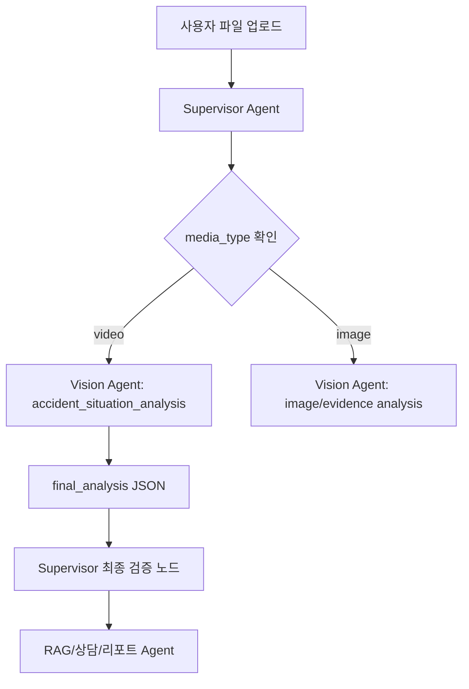

# Vision Input·Output Schema 변경 보고서

| 항목 | 내용 |
|---|---|
| 작성일 | 2026-06-29 |
| 목적 | 기존 Vision Agent Input·Output Schema가 실제 POC 구현 과정에서 어떻게 변경되었는지 정리하고, Supervisor Agent와 연결 가능한 계약 기준을 제안한다. |
| 기존 기준 문서 | `D:/dev/개인 업무/DeepLearning/docs/vision_agent_input_output_schema.md` |
| 현재 구현 기준 문서 | `docs/vision_output_schema_current.md` |
| 관련 구현 파일 | `ai/vision/schemas.py`, `ai/vision/videomae_infer.py`, `ai/vision/merge_analysis.py` |

## 1. 변경 요약

기존 스키마는 하나의 Vision Agent가 이미지와 영상을 모두 분석하고, 하나의 `agent_output`을 반환하는 구조였다.

현재 POC 구현에서는 영상 분석 흐름이 다음처럼 확장되었다.

```text
원본 영상
-> key frame 추출
-> YOLO 객체 탐지
-> bbox 변화 기반 event window 후보 생성
-> clip 후보 생성
-> VideoMAE 입력 프레임 추출
-> VideoMAE pretrained 추론
-> YOLO 결과 + VideoMAE 결과 병합
-> final_analysis JSON 생성
```

따라서 Output Schema는 단일 결과에서 3단계 결과 구조로 변경되었다.

```text
기존:
agent_output

현재:
agent_output_*.json
+ videomae_results_*.json
= final_analysis_*.json
```

최종적으로 Supervisor Agent가 우선 참조할 파일은 다음으로 정리한다.

```text
storage/vision/outputs/final_analysis/final_analysis_*.json
```

다만 Supervisor가 실제 판단 노드로 넘겨야 하는 핵심 Vision 계약은 `final_analysis.vision_agent_output.agent_output` 안에 보존한다.

---

## 2. 기존 Input Schema

기존 문서의 Input Schema는 다음과 같다.

```json
{
  "agent_input": {
    "session_id": "ses_20260623_0001",
    "message_id": "msg_0001",
    "job_id": "job_0002",
    "node_code": "vision_media_analysis",
    "attachments": [
      {
        "attachment_id": "att_0002",
        "media_type": "image | video",
        "purpose": "accident_scene | evidence | accident_statement | fine_notice | unknown",
        "mime_type": "image/jpeg | image/png | video/mp4 | video/avi",
        "storage_uri": "파일 저장 경로 또는 접근 URI",
        "privacy_risk": true
      }
    ],
    "analysis_request": {
      "extract_key_frames": "boolean | null",
      "detect_objects": true,
      "classify_scene": "boolean | null",
      "analyze_damage": "boolean | null",
      "analysis_mode": "accident_scene | damage_image | unknown",
      "summarize_scene": true,
      "remove_audio": "boolean | null"
    }
  }
}
```

### 2.1 기존 Input Schema 의미

| 영역 | 설명 |
|---|---|
| `session_id`, `message_id`, `job_id` | 상담 세션, 사용자 메시지, 비동기 분석 작업을 연결하기 위한 식별자 |
| `node_code` | Vision Agent 실행 노드 식별자. 기존 문서에서는 `vision_media_analysis` |
| `attachments` | 사용자가 업로드한 이미지/영상 파일 목록 |
| `purpose` | PM 상위 목적 enum. `damage_image`는 여기에 넣지 않음 |
| `analysis_request` | Vision Agent에 어떤 분석 기능을 수행할지 전달하는 요청 옵션 |
| `analysis_mode` | Vision 내부 처리 모드. `damage_image`는 PM 상위 purpose가 아니라 이 내부 모드로만 사용 |

### 2.2 Input Schema 변경 판단

Input Schema는 큰 틀을 유지한다. 다만 현재 구현 기준에서는 영상 POC에 맞춰 `analysis_request`에 clip/video understanding 관련 옵션이 추가될 수 있다.

기존 Input Schema에서 유지할 것:

```text
agent_input.session_id
agent_input.message_id
agent_input.job_id
agent_input.attachments
agent_input.attachments[].purpose
agent_input.analysis_request.analysis_mode
```

변경 또는 확장할 것:

```text
node_code: vision_media_analysis -> accident_situation_analysis 또는 supervisor 내부 라우팅명과 정합 필요
analysis_request.extract_key_frames: 유지
analysis_request.detect_objects: 유지
analysis_request.summarize_scene: 유지
analysis_request.video_understanding: 추가 권장
analysis_request.clip_policy: 추가 권장
```

---

## 3. 변경 후 권장 Input Schema

Supervisor Agent가 Vision Agent를 호출할 때 사용할 권장 Input Schema는 다음과 같다.

```json
{
  "agent_input": {
    "session_id": "ses_20260629_0001",
    "message_id": "msg_0001",
    "job_id": "vision_job_0001",
    "node_code": "accident_situation_analysis",
    "requested_by": "supervisor_agent",
    "attachments": [
      {
        "attachment_id": "att_video_0001",
        "media_type": "video",
        "purpose": "accident_scene",
        "mime_type": "video/mp4",
        "storage_uri": "storage/vision/raw/sample.mp4",
        "privacy_risk": true
      }
    ],
    "analysis_request": {
      "analysis_mode": "accident_scene",
      "extract_key_frames": true,
      "detect_objects": true,
      "build_event_window": true,
      "extract_event_clip": true,
      "run_video_understanding": true,
      "summarize_scene": true,
      "remove_audio": true,
      "clip_policy": {
        "short_video_full_context_sec": 5,
        "long_video_pre_context_sec": 4,
        "long_video_post_context_sec": 2,
        "videomae_frame_count": 16
      }
    }
  }
}
```

### 3.1 변경 후 Input 필드 설명

| 필드 | 타입 | 설명 |
|---|---|---|
| `node_code` | string | 현재 구현 기준은 `accident_situation_analysis`. 기존 `vision_media_analysis`와 이름 정합 필요 |
| `requested_by` | string | Supervisor가 호출한 작업임을 명시 |
| `build_event_window` | boolean | bbox 변화 기반 event window 후보를 생성할지 여부 |
| `extract_event_clip` | boolean | event window 또는 짧은 영상 전체 기준으로 clip을 생성할지 여부 |
| `run_video_understanding` | boolean | VideoMAE pretrained 보조 추론을 실행할지 여부 |
| `clip_policy.short_video_full_context_sec` | number | 10초 이하 영상은 자르지 않고 전체 영상 사용 |
| `clip_policy.long_video_pre_context_sec` | number | 긴 영상 clip 생성 시 사건 후보 이전 context 초 |
| `clip_policy.long_video_post_context_sec` | number | 긴 영상 clip 생성 시 사건 후보 이후 context 초 |
| `clip_policy.videomae_frame_count` | number | VideoMAE 입력으로 사용할 균등 샘플링 프레임 수. 현재 16 |

### 3.2 Supervisor 연결 시 Input 규칙

Supervisor는 다음 규칙으로 Vision Agent를 호출한다.

| 조건 | Supervisor 처리 |
|---|---|
| 업로드 파일이 영상이고 `purpose=accident_scene` | `analysis_mode=accident_scene`, `run_video_understanding=true` |
| 업로드 파일이 증빙 이미지 | `purpose=evidence`, `analysis_mode=accident_scene` 또는 `unknown` |
| 차량 파손 이미지 | PM purpose는 `evidence` 또는 확정 enum 사용, Vision 내부 `analysis_mode=damage_image` |
| 음성 분석 제외 | 영상 입력 시 `remove_audio=true` |
| 개인정보 가능성 있음 | `privacy_risk=true`로 전달하고 저장/출력 정책 적용 |

---

## 4. 기존 Output Schema

기존 문서의 Output Schema는 다음과 같다.

```json
{
  "agent_output": {
    "node_code": "vision_media_analysis",
    "status": "success | partial | failed",
    "summary": "",
    "structured_result": {
      "media_type": "image | video",
      "observations": [],
      "detected_objects": [],
      "road_type_candidates": [],
      "accident_type_candidates": [],
      "risk_event_candidates": [],
      "event_window": null,
      "key_frames": [],
      "damage_area_candidates": [],
      "evidence_candidates": [],
      "limitations": []
    }
  }
}
```

### 4.1 기존 Output Schema 의미

기존 구조는 Vision Agent의 결과를 하나의 `agent_output`으로 반환한다.

| 필드 | 설명 |
|---|---|
| `observations` | 장면 변화, 객체 관계, 파손 상태 등 관찰 결과 |
| `detected_objects` | 객체 탐지 결과 |
| `road_type_candidates` | 도로유형 후보 |
| `accident_type_candidates` | 사고유형 후보 |
| `risk_event_candidates` | 위험 이벤트 후보 |
| `event_window` | 사고 또는 위험 상황 추정 시간 구간 |
| `key_frames` | 근거 프레임 |
| `damage_area_candidates` | 파손 영역 후보 |
| `evidence_candidates` | 후속 Agent가 참조할 근거 |
| `limitations` | 분석 한계 |

---

## 5. 변경 후 Output Schema

현재 구현 기준 Output은 다음 3개 산출물로 분리된다.

| 산출물 | 스키마 버전 | 역할 |
|---|---|---|
| `agent_output_*.json` | `vision-agent-output-v2` | YOLO/bbox 기반 핵심 Vision Agent 결과 |
| `videomae_results_*.json` | `videomae-inference-result-v1` | VideoMAE pretrained clip-level action hint |
| `final_analysis_*.json` | `vision-final-analysis-v1` | 두 결과를 병합한 최종 POC 결과 |

Supervisor Agent가 우선 받는 최종 Output은 `final_analysis_*.json`이다.

---

## 6. 변경 후 최종 Output Schema: `vision-final-analysis-v1`

```json
{
  "schema_version": "vision-final-analysis-v1",
  "status": "success | partial | failed | unknown",
  "analysis_scope": "single_video_poc",
  "vision_agent_output": {
    "agent_output": {
      "node_code": "accident_situation_analysis",
      "status": "success | partial | failed",
      "summary": "",
      "structured_result": {},
      "metadata": {}
    }
  },
  "video_understanding": {
    "analysis_type": "videomae_pretrained_clip_inference",
    "model_name": "MCG-NJU/videomae-base-finetuned-kinetics",
    "device": "cuda | cpu",
    "source_manifest": "storage/vision/outputs/videomae_inputs/videomae_clip_manifest_*.json",
    "clip_count": 1,
    "clips": [],
    "interpretation_note": ""
  },
  "comparison_summary": {
    "yolo_bbox_role": "",
    "videomae_role": "",
    "videomae_top_labels": [],
    "decision": ""
  },
  "limitations": []
}
```

### 6.1 최종 Output 필드 설명

| 필드 | 타입 | 설명 |
|---|---|---|
| `schema_version` | string | 최종 병합 스키마 버전. 현재 `vision-final-analysis-v1` |
| `status` | string | Vision Agent 처리 상태를 승계 |
| `analysis_scope` | string | 현재는 단일 영상 POC이므로 `single_video_poc` |
| `vision_agent_output` | object | 기존 핵심 Vision Agent 결과 전체 |
| `video_understanding` | object | VideoMAE pretrained 보조 추론 결과 |
| `comparison_summary` | object | YOLO/bbox와 VideoMAE의 역할 차이 요약 |
| `limitations` | array | 최종 결과의 판단 한계 |

---

## 7. 변경 후 핵심 Agent Output: `vision-agent-output-v2`

`final_analysis.vision_agent_output.agent_output` 내부에 들어간다.

```json
{
  "agent_output": {
    "node_code": "accident_situation_analysis",
    "status": "success | partial | failed",
    "summary": "video key frame에서 car 15건, person 1건이 탐지되었습니다...",
    "structured_result": {
      "media_type": "video | image | unknown",
      "event_window_candidates": [],
      "key_clips": [],
      "key_frames": [],
      "detected_objects": [],
      "object_change_observations": [],
      "scene_context_candidates": [],
      "user_claim_comparison": {},
      "field_summary": "",
      "evidence_candidates": [],
      "unavailable_items": [],
      "limitations": []
    },
    "metadata": {}
  }
}
```

### 7.1 기존 Output과 달라진 점

| 기존 필드 | 변경 후 필드 | 변경 이유 |
|---|---|---|
| `observations` | `object_change_observations`, `scene_context_candidates`, `field_summary` | 관찰 결과를 bbox 변화, 장면 맥락, 요약으로 분리 |
| `risk_event_candidates` | `event_window_candidates` | 실제 구현에서는 위험 이벤트보다 시간 구간 후보가 우선 필요 |
| `event_window` | `event_window_candidates[]` | 후보가 여러 개일 수 있어 배열 구조로 변경 |
| `key_frames` | 유지, 역할 필드 강화 | `event_before`, `risk_increase`, `event_peak`, `event_after` 역할 추가 |
| `road_type_candidates` | 현재 미구현 | 도로유형은 별도 학습/분류 근거 부족으로 제외 |
| `accident_type_candidates` | 현재 미구현 | 사고유형 확정은 Vision 단독에서 하지 않음 |
| `damage_area_candidates` | 현재 미구현 | 파손 분석은 별도 `analysis_mode=damage_image` 후속 범위 |
| `evidence_candidates` | 유지 | 후속 RAG/리포트/화면 증빙 연결에 사용 |
| `limitations` | 유지 + `unavailable_items` 추가 | 확정 불가 항목을 구조적으로 분리 |

---

## 8. VideoMAE 보조 Output Schema

VideoMAE 결과는 `video_understanding`에 병합된다.

```json
{
  "analysis_type": "videomae_pretrained_clip_inference",
  "model_name": "MCG-NJU/videomae-base-finetuned-kinetics",
  "device": "cuda",
  "source_manifest": "storage/vision/outputs/videomae_inputs/videomae_clip_manifest_*.json",
  "clip_count": 1,
  "clips": [
    {
      "clip_id": "clip_01",
      "clip_path": "storage/vision/processed/clips/sample_clip_01.mp4",
      "clip_start_sec": 0.0,
      "clip_end_sec": 10.0,
      "basis": "short_video_full_context",
      "frame_count": 16,
      "top_prediction": {
        "rank": 1,
        "label_id": 123,
        "label": "driving car",
        "score": 0.563136
      },
      "top_predictions": []
    }
  ],
  "interpretation_note": "VideoMAE Kinetics labels are supplementary action hints."
}
```

### 8.1 VideoMAE 결과 사용 규칙

| 항목 | 기준 |
|---|---|
| 사용 가능 | clip 전체 맥락 보조 설명 |
| 사용 가능 | YOLO/bbox 결과와 비교할 보조 action hint |
| 사용 불가 | 사고유형 확정 |
| 사용 불가 | 과실비율 산정 |
| 사용 불가 | 법적 책임 판단 |
| 사용 불가 | 사용자 진술 없이 사고 서사 확정 |

---

## 9. Supervisor Agent 연결 기준

Supervisor Agent는 Vision 결과를 최종 판단값으로 사용하지 않고, 증거와 후보 정보로 사용해야 한다.

### 9.1 Supervisor 입력에서 Vision 호출



### 9.2 Supervisor가 읽어야 할 필드

| 목적 | 읽을 필드 |
|---|---|
| 사용자에게 영상 분석 요약 제공 | `vision_agent_output.agent_output.summary` |
| 사고 후보 구간 확인 | `vision_agent_output.agent_output.structured_result.event_window_candidates` |
| 근거 프레임 표시 | `vision_agent_output.agent_output.structured_result.key_frames` |
| 객체 탐지 근거 표시 | `vision_agent_output.agent_output.structured_result.detected_objects` |
| 증빙 연결 | `vision_agent_output.agent_output.structured_result.evidence_candidates` |
| VideoMAE 보조 맥락 | `video_understanding.clips[].top_prediction` |
| 판단 한계 표시 | `limitations`, `unavailable_items` |

### 9.3 Supervisor가 판단하면 안 되는 필드

아래 항목은 Vision Output에서 확정값으로 사용하면 안 된다.

```text
fault_ratio
liable_party
traffic_violation
final_accident_type
```

Supervisor는 이 항목들을 다음 노드로 넘긴다.

| 항목 | 후속 처리 |
|---|---|
| `fault_ratio` | 과실비율 사례/RAG/법률 근거 노드에서 판단 |
| `liable_party` | 사용자 진술, 사고 상황, 법률 근거 종합 후 판단 |
| `traffic_violation` | 신호/법규/경찰 API/사용자 진술 확인 후 판단 |
| `final_accident_type` | Vision 후보 + 사용자 진술 + RAG 결과로 확정 |

### 9.4 Supervisor 최종 검증 노드 권장 로직

```text
1. final_analysis.schema_version 확인
2. status가 success 또는 partial인지 확인
3. event_window_candidates, key_frames, evidence_candidates 존재 여부 확인
4. video_understanding은 보조 결과로만 표시
5. unavailable_items를 확인하여 확정 불가 항목을 후속 Agent로 라우팅
6. 사용자 진술이 있으면 user_claim_comparison을 갱신하거나 별도 비교 노드로 전달
7. 리포트 생성 시 Vision 결과를 '관찰 근거' 섹션으로만 삽입
```

---

## 10. 기존 스키마에서 현재 스키마로 변경된 이유

| 변경 | 이유 |
|---|---|
| 단일 `agent_output`에서 `final_analysis` 병합 구조로 확장 | YOLO/bbox와 VideoMAE 결과의 성격이 다르기 때문 |
| `event_window`를 `event_window_candidates[]`로 변경 | 사고 구간은 확정값이 아니라 후보값이기 때문 |
| `observations`를 세분화 | bbox 변화, 장면 맥락, field summary를 분리해야 후속 Agent가 사용하기 쉬움 |
| VideoMAE 결과를 별도 `video_understanding`으로 분리 | 사고 도메인 fine-tuning 모델이 아니므로 핵심 판단 결과와 섞으면 위험 |
| `unavailable_items` 추가 | 과실비율, 책임 주체, 법적 판단을 Vision이 확정하지 않도록 명시 |
| `damage_image`를 PM purpose에서 제외 | PM 상위 enum과 Vision 내부 analysis_mode를 분리하기 위해 |

---

## 11. 최종 권장안

### 11.1 계약 유지 기준

PM/Supervisor 계약에서는 다음 구조를 기준으로 한다.

```text
final_analysis.vision_agent_output.agent_output
```

즉, 기존 `agent_output` 계약은 폐기하지 않고 최종 병합 결과 안에 그대로 보존한다.

### 11.2 POC 확장 기준

VideoMAE 결과는 다음 위치에 둔다.

```text
final_analysis.video_understanding
```

이 영역은 보조 분석 결과이며, 사고 판단 모델의 Output으로 해석하지 않는다.

### 11.3 이슈/문서에 쓸 요약 문장

```md
기존 Vision Output Schema는 단일 `agent_output` 중심이었으나,
현재 POC에서는 YOLO/bbox 기반 `agent_output`과 VideoMAE pretrained 보조 추론 결과를 병합한
`final_analysis` 구조로 확장하였다.

Supervisor Agent는 `final_analysis`를 수신하되, 실제 계약 핵심은
`final_analysis.vision_agent_output.agent_output`으로 유지한다.
VideoMAE 결과는 `video_understanding`에 보조 맥락으로만 저장하며,
과실비율·법적 책임·최종 사고유형은 Vision Agent가 확정하지 않는다.
```

---

## 12. Agent 간 전달 기준

현재 Vision POC에서는 Output 산출물이 3개로 나뉘지만, 모든 산출물을 모든 Agent에 그대로 전달하면 안 된다.

각 산출물의 전달 대상은 다음처럼 구분한다.

| 산출물 | 생성 위치 | 성격 | 전달 대상 | 전달 방식 |
|---|---|---|---|---|
| `agent_output_*.json` | `storage/vision/outputs/agent_outputs/` | YOLO/bbox 기반 핵심 Vision Agent 결과 | Supervisor 내부 검증, 화면/리포트 증빙 구성 | `final_analysis.vision_agent_output.agent_output` 안에 포함해서 전달 |
| `videomae_results_*.json` | `storage/vision/outputs/videomae_results/` | VideoMAE pretrained 보조 action hint | Vision 내부 비교, Supervisor 참고 | 직접 전달하지 않고 `final_analysis.video_understanding`으로 요약 병합 |
| `final_analysis_*.json` | `storage/vision/outputs/final_analysis/` | Vision POC 최종 병합 결과 | Supervisor Agent | Vision Agent의 1차 반환값으로 전달 |
| `vision_supervisor_handoff` | Supervisor가 `final_analysis`에서 추출 | 후속 Agent 전달용 경량 계약 | 법률 Agent, 판례 Agent, RAG Agent, 리포트 Agent | Supervisor가 필요한 필드만 추출해 전달 |

정리하면 다음과 같다.

```text
Vision Agent가 Supervisor에게 전달할 것:
final_analysis_*.json

Supervisor가 법률/판례/RAG Agent에게 전달할 것:
final_analysis 전체가 아니라 vision_supervisor_handoff 형태로 정리한 경량 스키마
```

---

## 13. Supervisor Handoff Schema 권장안

법률 Agent나 판례 Agent는 bbox 전체, 모든 frame path, VideoMAE top-k 전체가 필요하지 않다. 대신 사고 판단에 필요한 관찰 근거, 확정 불가 항목, 증빙 후보만 받는 것이 안전하다.

따라서 Supervisor가 `final_analysis_*.json`을 받은 뒤, 후속 Agent에는 아래 형태로 변환해서 전달하는 것을 권장한다.

```json
{
  "vision_supervisor_handoff": {
    "schema_version": "vision-supervisor-handoff-v1",
    "source": {
      "final_analysis_schema_version": "vision-final-analysis-v1",
      "vision_node_code": "accident_situation_analysis",
      "analysis_scope": "single_video_poc",
      "source_video": "storage/vision/raw/sample.mp4"
    },
    "status": "success | partial | failed",
    "media_summary": {
      "media_type": "video",
      "summary": "video key frame에서 car 15건, person 1건이 탐지되었습니다...",
      "field_summary": "2.933~9.467초 구간이 우선 확인 후보로 생성되었습니다..."
    },
    "event_candidates": [
      {
        "event_candidate_id": "event_window_01",
        "start_sec": 2.933,
        "end_sec": 9.467,
        "priority_score": 1.0,
        "basis": "bbox_motion_peak_with_2sec_context",
        "source_refs": ["frame_03", "frame_04"]
      }
    ],
    "visual_evidence": {
      "key_frames": [],
      "evidence_candidates": [],
      "detected_object_summary": {
        "car": 15,
        "person": 1
      }
    },
    "video_understanding_hint": {
      "model_name": "MCG-NJU/videomae-base-finetuned-kinetics",
      "top_label": "driving car",
      "score": 0.563136,
      "usage_policy": "supplementary_context_only"
    },
    "not_determined_by_vision": [
      "fault_ratio",
      "liable_party",
      "traffic_violation",
      "final_accident_type"
    ],
    "routing_recommendation": {
      "next_agents": ["legal_rag_agent", "precedent_agent", "report_agent"],
      "legal_agent_focus": ["traffic_violation", "legal_responsibility", "applicable_law"],
      "precedent_agent_focus": ["similar_accident_cases", "fault_ratio_reference", "case_factors"],
      "report_agent_focus": ["visual_evidence_summary", "timeline", "limitations"]
    }
  }
}
```

---

## 14. Agent별 전달 스키마 구분

### 14.1 Vision Agent -> Supervisor Agent

Vision Agent는 Supervisor에게 최종 병합 결과를 전달한다.

전달 스키마:

```text
final_analysis_*.json
```

전달 이유:

- YOLO/bbox 기반 핵심 결과가 포함되어 있다.
- VideoMAE 보조 결과가 포함되어 있다.
- 판단 한계가 포함되어 있다.
- Supervisor가 후속 Agent 라우팅을 결정할 수 있다.

Supervisor가 읽을 핵심 경로:

```text
final_analysis.status
final_analysis.vision_agent_output.agent_output.summary
final_analysis.vision_agent_output.agent_output.structured_result.event_window_candidates
final_analysis.vision_agent_output.agent_output.structured_result.key_frames
final_analysis.vision_agent_output.agent_output.structured_result.detected_objects
final_analysis.vision_agent_output.agent_output.structured_result.evidence_candidates
final_analysis.video_understanding.clips[].top_prediction
final_analysis.limitations
```

### 14.2 Supervisor Agent -> 법률 Agent

법률 Agent에는 Vision 원본 전체가 아니라, 법률 검토에 필요한 관찰 근거만 전달한다.

전달 스키마:

```text
vision_supervisor_handoff
```

법률 Agent가 봐야 할 필드:

| 목적 | 필드 |
|---|---|
| 사건 후보 시간대 | `event_candidates[].start_sec`, `event_candidates[].end_sec` |
| 관찰 요약 | `media_summary.summary`, `media_summary.field_summary` |
| 객체 근거 | `visual_evidence.detected_object_summary` |
| 판단 불가 항목 | `not_determined_by_vision` |
| 법률 검토 초점 | `routing_recommendation.legal_agent_focus` |

법률 Agent가 받으면 안 되는 의미:

```text
Vision이 과실비율을 산정했다
Vision이 법적 책임을 판단했다
Vision이 사고유형을 확정했다
```

### 14.3 Supervisor Agent -> 판례 Agent

판례 Agent에는 유사 사례 검색에 필요한 조건만 전달한다.

전달 스키마:

```text
vision_supervisor_handoff
```

판례 Agent가 봐야 할 필드:

| 목적 | 필드 |
|---|---|
| 사고 장면 요약 | `media_summary.summary` |
| 사고 후보 구간 | `event_candidates[]` |
| 객체 구성 | `visual_evidence.detected_object_summary` |
| 보조 영상 맥락 | `video_understanding_hint.top_label` |
| 판례 검색 초점 | `routing_recommendation.precedent_agent_focus` |

판례 Agent는 이 정보를 바탕으로 유사 판례나 과실비율 참고 사례를 검색한다. 단, Vision 결과만으로 과실비율을 확정하지 않는다.

### 14.4 Supervisor Agent -> RAG/리포트 Agent

RAG/리포트 Agent에는 사용자에게 보여줄 수 있는 증빙 중심 정보가 필요하다.

전달 스키마:

```text
vision_supervisor_handoff
```

리포트 Agent가 봐야 할 필드:

| 목적 | 필드 |
|---|---|
| 리포트 요약 | `media_summary.summary` |
| 타임라인 | `event_candidates[]`, `visual_evidence.key_frames[]` |
| 증빙 이미지 | `visual_evidence.evidence_candidates[]` |
| 보조 설명 | `video_understanding_hint` |
| 주의 문구 | `not_determined_by_vision` |

---

## 15. 팀장 공유용 요약

팀장에게는 다음처럼 전달하면 된다.

```md
Vision 쪽 Output은 3개로 나뉩니다.

1. `agent_output_*.json`
   - YOLO/bbox 기반 핵심 Vision Agent 결과입니다.
   - 객체 탐지, key frame, 사고 후보 구간, 증빙 후보가 들어갑니다.

2. `videomae_results_*.json`
   - VideoMAE pretrained 모델의 clip-level 보조 결과입니다.
   - 사고 판단값이 아니라 `driving car` 같은 action hint입니다.
   - 법률/판례 Agent에 직접 넘기지 않습니다.

3. `final_analysis_*.json`
   - 위 두 결과를 합친 Vision POC 최종 산출물입니다.
   - Vision Agent가 Supervisor에게 전달할 기준 파일입니다.

Supervisor가 법률 Agent나 판례 Agent로 넘길 때는 `final_analysis` 전체를 그대로 넘기지 않고,
`vision_supervisor_handoff` 형태로 필요한 필드만 추출해 전달하는 것이 좋습니다.

이 handoff 스키마에는 사건 후보 구간, 관찰 요약, key frame/evidence 후보,
VideoMAE 보조 맥락, Vision이 확정하지 못한 항목이 포함됩니다.

Vision은 과실비율, 법적 책임, 최종 사고유형을 확정하지 않고,
이 항목들은 Supervisor가 법률/RAG/판례 Agent로 라우팅합니다.
```

---

## 16. 최종 전달 원칙

```text
Vision 내부 검증용:
agent_output_*.json, videomae_results_*.json

Vision -> Supervisor:
final_analysis_*.json

Supervisor -> 법률/판례/RAG/리포트:
vision_supervisor_handoff
```

이 기준을 적용하면 Vision 모델 변경이 있더라도 후속 Agent는 안정적인 handoff 스키마만 바라보면 된다.

