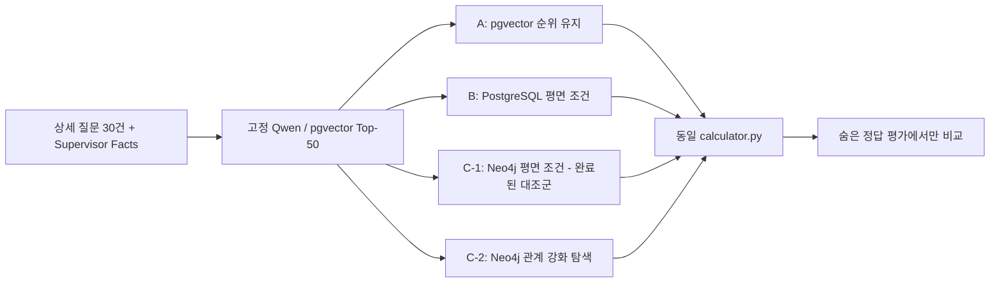
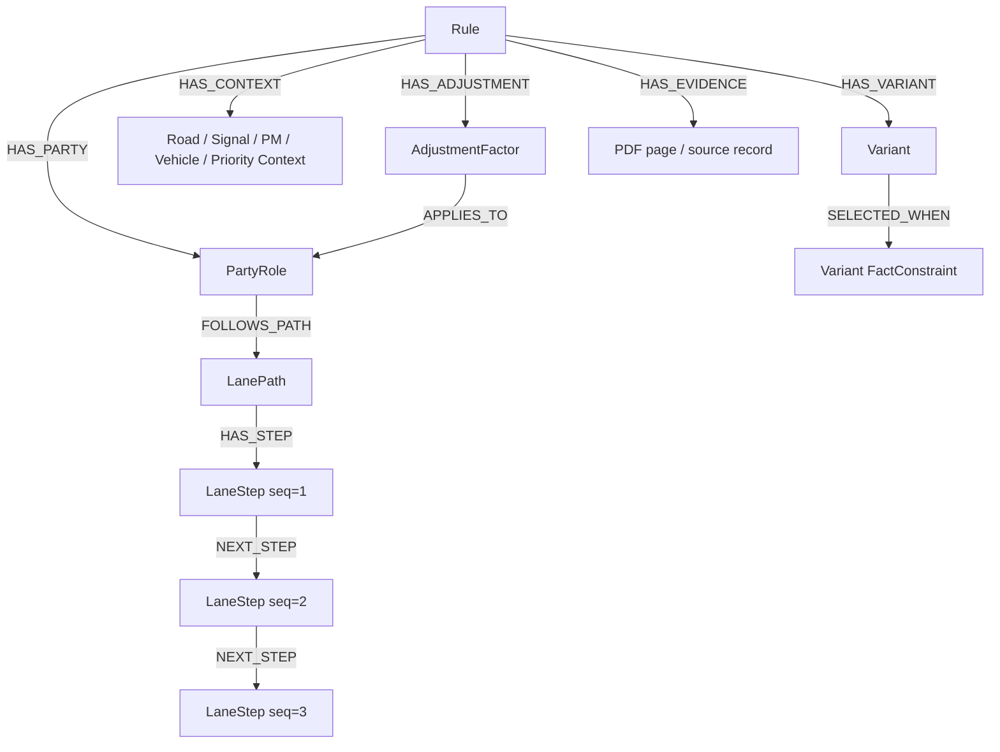

# 상세 사고 30건: Neo4j 관계 강화 C-2 재실험 계획 V8

> 상태: V7 A/B/C-1 완료 후, **Neo4j만 관계 강화하여 B와 재비교**하는 계획
>
> 고정 대상: 질문 30건, 숨은 정답 30건, Qwen3-Embedding-4B GPU 벡터, pgvector exact-cosine Top-50, B 결과, 공통 `calculator.py`
>
> 변경 대상: Neo4j projection·Cypher 관계 탐색·C-2 결과만 변경

## 1. 결론부터: 왜 C-2가 필요한가

V7의 C는 `Rule → Condition` 평면 구조를 Neo4j에 저장한 **C-1 동등성 대조군**이었다. 따라서 PostgreSQL B와 같은 조건 계약을 같은 방식으로 실행했고, B/C-1이 같은 결과가 나온 것은 정상이다. 그러나 이는 Neo4j의 관계 탐색 장점을 측정하지 못한다.

V8 C-2는 PDF에 이미 구조화된 경로·문맥·Variant·수정요소 관계를 그래프로 투영한다. 비교 질문은 다음 하나다.

> 동일 Top-50 후보에서, 관계 강화 Neo4j C-2가 PostgreSQL 평면 후처리 B보다 Rule 순위·계산 가능성·최종비율 정확도를 개선하는가? 개선하지 않더라도 어떤 관계가 실제로 후보를 바꾸었는가?

## 2. 실험 방법의 재정의



- A, B, C-1 결과는 재생성하지 않고 SHA를 고정한다.
- C-2도 B와 동일한 Top-50 후보만 입력으로 받는다. 후보 밖 Rule을 만들지 않는다.
- 검색 가중치·벡터 점수와 구조 점수의 합산은 사용하지 않는다.
- C-2는 PDF 근거가 있는 관계의 `확정 일치 / 미확정 / 명시 모순`만으로 후보 bucket을 바꾸고, 같은 bucket에서는 원래 pgvector rank를 유지한다.
- 모든 방법은 동일 `calculator.py`를 호출한다. Neo4j는 비율을 계산하거나 답을 생성하지 않는다.

## 3. 사전 데이터 검토 결과

현재 277개 Rule Canonical Profile에서 확인된 관계 원천은 다음과 같다.

| PDF 구조 원천 | 건수 | C-2 사용 여부 | 근거 |
|---|---:|---|---|
| Party | 554 | 사용 | Rule의 A/B·차량·보행자·PM 역할 |
| LanePath | 30 | 사용 | 2025 회전교차로 진입·회전·출차 차로 |
| LaneStep | 75 | 사용 | `seq`가 있는 실제 경로 순서 |
| Variant | 40 | 사용 | 2023 계층형 보기·기본비율 분기 |
| PMContext | 38 | 사용 | 2021 PM 도로·신호·행동 문맥 |
| SignalContext | 38 | 사용 | 신호 상태 관계 |
| VehicleContext | 38 | 사용 | 차량·PM 속성 관계 |
| RoadContext | 61 | 사용 | 교차로·도로 폭·중앙선·가시성 문맥 |
| PriorityContext | 23 | 조회·근거 반환 | 우선권·법규 근거, 현재는 hard filter로 과대 해석하지 않음 |
| RoundaboutContext | 15 | 사용 | 2025 회전교차로 문맥 |
| AdjustmentFactor | 2,303 | 사용 | Rule·대상 Party·PDF delta 연결 |
| SharedRuleGroup | 0 | 이번 범위 제외 | 현재 Canonical에 데이터가 없어 관계를 발명하지 않음 |

### 데이터 부족 및 금지 사항

1. PDF가 명시하지 않은 `CONFLICTS_WITH` 또는 선후행 충돌 관계는 만들지 않는다. 같은 회전차로라는 사실만으로 실제 충돌 관계를 단정할 수 없기 때문이다.
2. LanePath가 없는 Rule에 대해 차로 경로를 추정하지 않는다.
3. 질문에 차로·순서 Fact가 없으면 `UNKNOWN`이며, 임의의 차로를 넣지 않는다.
4. 30문항 중 그래프 경로 Fact가 실제로 들어있는 subset의 크기를 먼저 기록한다. 표본이 작으면 전역 정확도 일반화 근거로 사용하지 않는다.
5. 정답 Rule, 정답 비율, case별 PDF 페이지는 C-2 projection/Cypher/runtime에서 절대 읽지 않는다.

## 4. C-2 Neo4j 관계 스키마



### 허용 관계와 출처

| Neo4j 관계 | 생성 근거 | 사용 방식 |
|---|---|---|
| `Rule-HAS_PARTY→PartyRole` | `parties` | 사용자/상대 Party 매핑 |
| `PartyRole-FOLLOWS_PATH→LanePath` | `lane_paths.party_key` | 2025 차로 경로 비교 |
| `LanePath-HAS_STEP→LaneStep` | `lane_steps.party_key` | 각 차량의 순서 있는 경로 |
| `LaneStep-NEXT_STEP→LaneStep` | 같은 Rule·Party, `seq + 1` | 경로 순서 검증 |
| `Rule-HAS_VARIANT→Variant` | `variants` | 보기·분기 근거 반환 |
| `Rule-HAS_CONTEXT→Context` | PM/Signal/Vehicle/Road/Priority/Roundabout context | 문맥 조건 검증 |
| `Rule-HAS_ADJUSTMENT→Adjustment` | `adjustment_factors` | Calculator 입력 근거와 Party 연결 |
| `Adjustment-APPLIES_TO→PartyRole` | `target_party_key` | 수정요소 대상 확인 |

모든 노드·관계에는 `rule_id`, 원본 record ID, source table, source field, raw text/페이지를 보존한다. 관계 생성 과정에서 새 과실비율·새 Rule·새 충돌 사실을 만들지 않는다.

## 5. C-2 실행 계약

### 5.1 질문 Facts의 그래프 비교

Runtime은 질문 Fact를 Neo4j에 영구 저장하지 않고 Cypher parameter로 전달한다.

1. Top-50 후보 Rule의 `PartyRole`과 사용자/상대 매핑을 확인한다.
2. 후보에 LanePath가 있으면 해당 Party의 `LaneStep`을 `seq` 순서대로 읽는다.
3. 질문에 명시된 `entry_lane`, `circulation_lane`, `exit_lane`, `entry_timing`, `movement`를 경로 단계와 비교한다.
4. PM·신호·도로·회전교차로·Variant Context가 구조화되어 있고 질문 Fact가 있으면 관계를 따라 비교한다.
5. PDF 관계에 명시된 수정요소 대상만 Calculator trace로 전달한다.

### 5.2 가중치 없는 bucket

| C-2 상태 | 기준 | 순위 |
|---|---|---:|
| `GRAPH_FULL_MATCH` | 평면 필수조건과 확인 가능한 경로·문맥 관계 모두 일치 | 0 |
| `FLAT_FULL_GRAPH_INELIGIBLE` | 평면 조건은 일치, 해당 Rule에 그래프 관계가 없거나 질문에 해당 Fact가 없음 | 1 |
| `GRAPH_COMPATIBLE_UNKNOWN` | 명시 모순은 없지만 그래프 경로 확인에 필요한 Fact가 없음. 원래 cosine rank는 보존하되 Calculator는 실행하지 않고 Supervisor 재질문으로 넘김 | 0 |
| `MISMATCH` | Party·차로 단계·문맥 중 하나 이상이 명시적으로 모순 | 3 |

같은 bucket 안에서는 pgvector 원래 rank를 유지한다. 점수 합산·가중치·정답 기반 boost는 금지한다.

## 6. 구현 단계와 Gate

| 단계 | 작업 | 통과 조건 | 실패 시 처리 |
|---|---|---|---|
| C2-0 | B/C-1 결과·Top-50·Calculator SHA 고정 | B와 C-1 출력 재작성 금지 | 즉시 중단 |
| C2-1 | Neo4j 관계 강화 projection | source counts·원본 ID·관계 provenance 100% | 누락/발명 관계 제거 |
| C2-2 | Cypher graph matcher 구현 | 단위 fixture에서 `NEXT_STEP`, Context, Variant, Adjustment path 검증 | query 수정 후 재검증 |
| C2-3 | 30건 C-2 3회 실행 | 동일 Top-50, byte-identical 3회 | 결과 무효 |
| C2-4 | B vs C-2 평가 | 전역·그래프 eligible subset·case trace 생성 | slice 표본 부족을 명시 |
| C2-5 | 계산기 회귀검증 | 모든 calculated 결과 합계 100·동일 입력 동일 trace | 즉시 중단 |

## 7. B vs C-2 비교 지표

전역 30건과 `graph_eligible` subset을 분리해 다음을 낸다.

- Hit@1, Hit@3, MRR@3, nDCG@3, Hit@10, Recall@50
- Exact Rule@1, Party Mapping Exact, Base Ratio Exact, Variant Exact, Adjustment Set Exact, Final Ratio Exact, End-to-End Exact
- C-2가 B 대비 Rule을 올린/내린/유지한 case 수와 case ID
- LanePath/Context/Variant/Adjustment 각각이 C-2 결정을 바꾼 case trace
- `UNKNOWN`이 된 그래프 경로와 Supervisor 재질문용 missing Fact
- B/C-1/C-2 p50/p95/p99 latency와 node/relationship 수

### 성공·해석 기준

- C-2가 B보다 낮아질 수도 있다. 이 경우에도 왜 낮아졌는지 관계 trace로 공개한다.
- C-2의 차이가 없는 경우에는 Neo4j가 불필요하다는 결론이 아니라, 현재 30문항의 graph-eligible subset·관계 정보가 차별화를 만들지 못했다는 결론으로 제한한다.
- C-2가 개선되어도 30건 전체가 아닌 graph-eligible subset의 표본 수와 함께 해석한다.

## 8. 파일·격리 규칙

```text
artifacts/v7_complete30_abc/
├─ 03_a_pgvector/                 # 고정, 수정 금지
├─ 04_b_postgresql/               # 고정, 수정 금지
├─ 05_c_neo4j/                    # C-1 보존
├─ 07_c2_neo4j_enriched/          # 새 C-2 결과
└─ 08_c2_comparison/              # B/C-1/C-2 비교표·보고서·trace
```

- 기존 `complete30-abc-postgres`에는 쓰지 않는다.
- 기존 `complete30-abc-neo4j`의 `Complete30V7*` 평면 노드는 보존한다.
- C-2는 같은 전용 Neo4j 컨테이너에서 `Complete30V8*` label prefix만 사용한다.
- 기존 프로젝트 DB/container/volume에는 쓰지 않는다.

## 9. 구현 전 최종 검토 결론

방향은 맞다. 단, C-2가 측정하는 것은 “Neo4j를 사용했다”가 아니라 **PDF에서 실제로 추출된 다단계 관계가 후보 선택에 유효했는가**다. 현재 데이터만으로 LanePath·LaneStep·Context·Variant·Adjustment 관계 강화는 가능하다. PDF가 명시하지 않은 충돌/우선순위 관계를 그래프에 추가하는 것은 금지한다.
