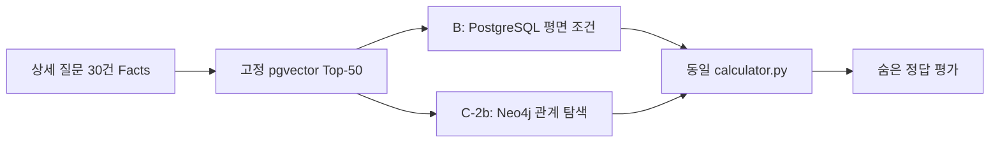

# 상세 사고 30건: Neo4j 전체 관계 C-2b 재실험 계획 V9

> 상태: 최초 C-2b 결과 무효화 후 관계·matcher·calculator 계약을 보완했으며, 동일 컨테이너에서 C-1 추가 전과 C-2 추가 후 재실험 및 최종 Gate를 완료했다. 기존 V7 A/B/C-1 및 V8 C-2a artifact는 보존한다.

## 현재 Neo4j DB 정리 계약

- Browser에서 확인·비교하는 활성 그래프는 `Complete30V7`(추가 전)과 `Complete30V9`(관계 강화 후)만이다.
- `Complete30V8`은 폐기된 C-2a 중간 투영본이다. 재현 근거가 되는 로컬 artifact와 코드·계획서는 보존하되, Browser 혼선을 막기 위해 DB 노드·관계는 제거한다.
- V7/V9의 동일 30개 질문·동일 Top-50·동일 calculator 계약은 유지한다. DB 정리는 실험 입력이나 평가 산출물을 변경하지 않는다.
- 최종 의사결정용 지표·운영 계약·한계는 `COMPLETE30_인정기준_RAG_최종_의사결정_보고서.md`를 단일 요약본으로 사용한다.

## 1. 목표

동일한 Qwen pgvector Top-50 후보와 동일 `calculator.py`에서, PostgreSQL 평면 후처리 B와 비교하여 **관계형 Neo4j C-2b가 실제로 Rule 선택·계산 입력·설명 가능한 trace에 차이를 만드는지** 검증한다. 검색 가중치와 정답 기반 boost는 사용하지 않는다.



## 2. C-2a와 C-2b의 차이

C-2a는 `Rule–Party–LanePath–LaneStep–Context–Adjustment` 노드를 만들었지만, 런타임 선택에는 일부 LanePath와 신호만 사용했다. 따라서 C-2a는 관계 뼈대/안전성 검증이며 Neo4j 우위 실험이 아니다.

C-2b는 아래 관계를 **Neo4j V9 label prefix**로 새로 만들고, 후보 판별 trace 또는 계산 입력에 실제 사용한다.

| 관계 | 원본 근거 | C-2b 사용 | 사실성 |
|---|---|---|---|
| `RuleGroup-CONTAINS_RULE→Rule` | `rules.section_path[0:2]` | 동일 PDF 사고군 trace | 원본 파생(경로 보존) |
| `Rule-HAS_PARTY→PartyRole` | `parties` | 사용자/상대 A/B 매핑 | 원본 |
| `PartyRole-FOLLOWS_PATH→LanePath` | `lane_paths` | 경로 존재 여부 | 원본 |
| `LanePath-HAS_STEP→LaneStep-NEXT_STEP→LaneStep` | `lane_steps.seq` | 진입→회전→진출 순서 비교 | 원본/순서 파생 |
| `PartyRole-PRECEDES_ENTRY→PartyRole` | `is_first_entry`, `is_late_entry`가 동시에 명시된 Rule | 선/후진입 trace | 원본 boolean 파생 |
| `Rule-HAS_VARIANT→Variant` | `variants`, base alt ratio | 분기 근거 trace; base 선택은 동일 계산기 | 원본 |
| `Rule-HAS_CONTEXT→PM/Signal/Vehicle/Road/Priority/RoundaboutContext` | 각 context table | 사실이 입력된 문맥만 match/mismatch/unknown | 원본 |
| `Rule-HAS_ADJUSTMENT→Adjustment-APPLIES_TO→PartyRole` | `adjustment_factors.target_party_key` | **그래프에서 계산기 profile 구성** | 원본 |
| `Rule-HAS_BASE_FAULT→BaseFault` | `base_faults` | **그래프에서 계산기 profile 구성** | 원본 |
| `PartyRole-POTENTIALLY_CONVERGES_ON→PotentialConflictZone` | 두 Party LaneStep의 공통 lane | trace만; hard filter 금지 | 파생 가능성 |

## 3. 명시적으로 하지 않는 것

- 서로 다른 두 차량의 `출차 선후`는 원본에 명시된 시간 필드가 없으므로 만들지 않는다. `is_first_entry/is_late_entry`만 `PRECEDES_ENTRY`로 사용한다.
- 공통 차로는 실제 충돌 지점이 아니다. 그래서 `PotentialConflictZone`은 후보 제거·비율 계산에 쓰지 않는다.
- Variant/Context가 질문 Facts와 대응하지 않으면 `UNKNOWN` trace로 남기며, 임의 Rule을 승격하지 않는다.
- 정답 Rule·정답 비율·case별 PDF 답안 페이지는 projection/runtime에 읽지 않는다. 평가는 종료 후에만 답안지를 읽는다.

## 4. 순위 계약

1. 각 방법은 동일 Top-50만 본다.
2. C-2b는 그래프에서 찾은 명시 `MATCH/MISMATCH/UNKNOWN`으로 bucket만 결정한다.
3. bucket 내부에는 기존 pgvector rank를 보존한다. 점수 합산·가중치 없음.
4. 그래프에서 필요한 fact가 `UNKNOWN`이면 해당 semantic top rule을 보존하고 숫자 계산을 차단해 Supervisor 재질문 대상으로 반환한다.
5. C-2b의 계산은 graph traversal로 재구성한 `base_faults/parties/adjustment_factors`만 입력으로 받는다. 같은 필드가 canonical과 byte-equivalent인지 검증한다.

## 5. 구현·검증 Gate

| Gate | 실행 내용 | 통과 기준 |
|---|---|---|
| C2b-0 | V7/V8 artifact SHA 고정 | 기존 파일 변경 0 |
| C2b-1 | V9 graph projection | 원본 record ID·source table/field·파생 표시 100%, node/edge count manifest |
| C2b-2 | 관계 matcher | Lane `NEXT_STEP`, entry precedence, context, variant, conflict potential trace fixture 통과 |
| C2b-3 | graph calculator adapter | 선택 Rule의 base/party/adjustment graph profile == canonical profile |
| C2b-4 | 30건 3회 | 동일 Top-50, byte-identical rule/calculation outputs |
| C2b-5 | B vs C-2b 평가 | Hit@1/@3, MRR@3, nDCG@3, Hit@10, Recall@50, E2E, graph subset와 trace |

## 6. 산출 경로

```text
lab_complete30_infra/
└─ complete30-abc-neo4j               # 동일 실험 컨테이너 안에서 C-1과 C-2 label로 비교

src/new_abc_test_v7/
├─ project_neo4j_c2b.py
└─ run_c2b_neo4j.py

artifacts/v7_complete30_abc/
├─ 09_c2b_neo4j_fullgraph/
│  ├─ c2b_graph_projection_manifest.json
│  ├─ rule_selection.jsonl
│  ├─ calculation.jsonl
│  └─ c2b_runtime_manifest.json
└─ 10_c2b_comparison/
   ├─ B_vs_C2b_비교표.md
   └─ c2b_run_validation.json
```

## 7. 해석 규칙

개선이 없거나 B와 같은 결과여도 실패를 숨기지 않는다. 이 경우 “C-2b 전체 관계가 이 30문항에서 B를 개선하지 못했다”라고 보고하고, 관계별 eligible 수·후보 변경 수·UNKNOWN 수를 함께 제시한다. 개선이 있더라도 graph-eligible subset 크기를 분리해 과장하지 않는다.

## 8. 최초 실행 결과의 무효화와 재실행 조건

- V9 graph projection은 PASS다. Rule 277, RuleGroup 29, Fact 1,164, Party 554, BaseFault 277, Adjustment 2,303, Context 403, LaneStep 75, `NEXT_STEP` 45, `PRECEDES_ENTRY` 6, `PotentialConflictZone` 10.
- **무효화 이유 1 — bucket 계약 위반:** 최초 matcher가 `GRAPH_FULL_MATCH`, `AMBIGUOUS_PARTY`, graph-ineligible 후보를 모두 같은 bucket으로 둬, 완전 관계일치가 원래 cosine 순위를 이기지 못했다. q09/q25/q26이 그 직접 증거다.
- **무효화 이유 2 — party resolution 누락:** 평면 조건에서 A/B가 모두 vehicle이면 `AMBIGUOUS_PARTY`가 되는데, 최초 matcher가 LaneStep을 이용해 두 orientation을 다시 검증하지 않았다.
- **무효화 이유 3 — calculator null delta:** PDF 표의 `비적용`은 `delta=null`인데, 최초 calculator가 이를 숫자로 변환하려 했다. `is_applicable=false` 또는 null delta를 건너뛰도록 공통 calculator 계약을 보완했다.
- 보완 matcher selection-only 확인에서 q09, q25, q26은 `GRAPH_FULL_MATCH` Rule로 변경되며, q27은 부족한 진입방향 Fact 때문에 원래 semantic Rule을 `UNKNOWN`으로 보존한다.
- 공통 calculator가 변경됐으므로 공정 비교를 위해 기존 artifact를 덮어쓰지 않고 새 run version에서 A/B/C 모두 동일 calculator로 재실행해야 한다.

## 9. 관계 추가 전/후 최종 비교

두 방법은 동일 `complete30-abc-neo4j` 컨테이너 안에서 label로 격리한다.

- C-1 추가 전: `Complete30V7`, 1,718 노드 / 1,441 관계. PostgreSQL B와 같은 평면 Fact 구조.
- C-2 추가 후: `Complete30V9`, 7,815 노드 / 13,196 관계.
- C-2 신규 핵심 관계: `ENTERS_LANE`, `CIRCULATES_IN`, `EXITS_TO`, `TRANSITIONS_TO`, `TOWARD`, 문맥별 `HAS_*CONTEXT`, `DESCRIBES_PARTY`, `SIGNAL_FOR`, `VARIANT_OF`, `ASSIGNS_FAULT`, `TRIGGERED_BY`, `ADJUSTS`.
- 동일 질문 30건, 동일 Qwen/pgvector Top-50, 동일 calculator, 3회 반복을 사용한다.

| 지표 | C-1 관계 추가 전 | C-2 관계 추가 후 |
|---|---:|---:|
| Hit@1 / Rule Exact | 11/30 (36.7%) | 14/30 (46.7%) |
| Hit@3 | 21/30 (70.0%) | 21/30 (70.0%) |
| MRR@3 | 0.5056 | 0.5667 |
| nDCG@3 | 0.5552 | 0.6008 |
| Final Ratio Exact | 9/30 (30.0%) | 12/30 (40.0%) |
| Calculation Coverage | 20/30 (66.7%) | 21/30 (70.0%) |

선택이 바뀐 q09, q25, q26은 모두 오답 Rule에서 정답 Rule로 이동했고 최종 비율도 정답과 일치했다. Top-3/Top-10/Recall@50은 후보 집합 자체가 동일하므로 변하지 않았다. 답안지는 runtime에서 읽지 않고 평가 단계에서만 읽었다.
