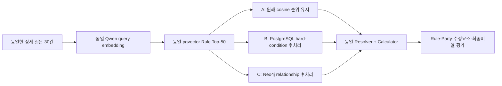

# 상세 사고 30건 기반 A/B/C 비교 실험계획 V7

> 상태: 실행 전 계획 확정본  
> 입력: `evaluation/v7_complete30/complete30_consumer_questions_v1.jsonl` 30건  
> 숨은 정답: `evaluation/v7_complete30/complete30_answer_key_with_explanations_v1.jsonl` 30건  
> 목적: 상세 사고 질문만으로 인정기준 Rule을 찾고, 동일 계산기로 최종 과실비율까지 산출했을 때 A/B/C의 차이를 수치로 비교한다.

## 0. 한눈에 보는 실행 순서

| 순서 | 단계 | 목표 | 핵심 산출물 | 다음 단계 조건 |
|---|---|---|---|---|
| G0 | 입력·정답 동결 | 30개 질문과 30개 숨은 정답을 변경 불가 상태로 고정 | 해시 manifest, 누출 검사 | 30:30·ID 1:1·누출 0 |
| G1 | 공통 검색 준비 | 동일 Qwen 모델로 30개 query vector와 277개 Rule 후보군 확정 | 공통 Top-50 후보 | 모델·차원·후보 SHA 동일 |
| G2 | Canonical·DB 투영 | 같은 PDF 조건을 PostgreSQL과 Neo4j에 동일하게 적재 | parity 보고서 | 277 Rule 조건 parity 100% |
| G3-A | A 실행 | pgvector 원순위 기준선 측정 | A 순위·Rule·비율 결과 | 30건 결과·평가표 완성 |
| G3-B | B 실행 | pgvector 후보를 PostgreSQL 조건으로 후처리 | B 순위·Rule·비율 결과 | 30건 결과·trace 완성 |
| G3-C | C 실행 | 같은 후보를 Neo4j 관계로 후처리 | C 순위·Rule·비율 결과 | 30건 결과·trace 완성 |
| G4 | 최종 비교 | 검색·계산·운영 지표와 실패 원인을 함께 비교 | A/B/C 비교표·결론 | 수치와 case trace 일치 |

각 G3 단계가 끝나면 결과를 사용자에게 보고하고 다음 단계 진행 여부를 확인한다. G0~G2의 비파괴적 준비 작업은 연속 수행할 수 있지만 Gate 실패 시 즉시 중단한다.

---

## 1. 이번 실험이 답할 질문

1. 의미검색만으로 정답 Rule이 Top-1과 Top-3에 얼마나 잘 올라오는가?
2. pgvector Top 후보에 PostgreSQL 구조 조건을 적용하면 정답 Rule 순위가 개선되는가?
3. 같은 조건을 Neo4j 관계로 적용하면 순위·최종 과실비율·처리시간이 어떻게 달라지는가?
4. 회전교차로, 차로변경, 진입 선후관계처럼 관계가 복잡한 사고군에서 Neo4j의 운영상 장점이 있는가?

이 실험은 법률적 판단을 LLM에 맡기지 않는다. 검색기는 Rule 후보를 정렬하고, Resolver는 입력 Facts와 PDF 조건을 기계적으로 비교하며, Calculator는 PDF에서 승인된 숫자만 더하고 뺀다.

---

## 2. A/B/C의 정확한 정의



### A — pgvector only

- 277개 Rule 단위 문서를 exact cosine으로 검색한다.
- pgvector가 반환한 순위를 변경하지 않는다.
- Top-1 Rule을 선택한 뒤에만 공통 Resolver와 Calculator를 호출한다.
- 구조 조건은 A의 **검색 순위 변경**에 사용하지 않는다.

### B — pgvector → PostgreSQL 후처리

- A와 byte-identical한 Top-50 후보를 입력받는다.
- PostgreSQL의 Rule, PartyRole, Context, Variant, Adjustment, LaneStep 구조를 조인한다.
- 입력 Facts와 모순되는 후보를 뒤로 보내고, 남은 후보 내부에서는 기존 pgvector 순서를 유지한다.
- 벡터 점수와 구조 점수를 합산하지 않으며 임의 가중치를 사용하지 않는다.

### C — pgvector → Neo4j 후처리

- A/B와 byte-identical한 Top-50 후보를 입력받는다.
- PostgreSQL과 동일한 Canonical 조건을 그래프 노드·관계로 투영한다.
- Rule→PartyRole→Context→Variant/Adjustment/LaneStep 관계를 탐색해 B와 같은 판정 계약으로 순서를 변경한다.
- 임의 가중치를 사용하지 않는다.

### B와 C가 같은 결과를 낼 수 있는 이유

B와 C에 **같은 지식과 같은 판정 규칙**을 넣으면 정확도가 같은 것이 정상일 수 있다. 그 경우 실험 실패가 아니다. 정확도 외에 latency, 쿼리 복잡도, 조건 누락률, 관계 확장 비용을 비교한다.

B보다 C에 더 많은 관계 지식을 넣으면 정확도 차이는 DB 종류가 아니라 **지식량 차이**가 된다. 따라서 본실험에서는 두 DB의 Canonical 의미를 동일하게 유지한다.

---

## 3. 데이터 계약과 정답 누출 방지

### 3.1 Runtime 입력

Runtime이 읽는 파일은 질문지 하나뿐이다.

```text
complete30_consumer_questions_v1.jsonl
```

각 행에는 자연어 질문과 질문에서 독립적으로 전사한 `structured_facts`가 있다. Rule ID, Rule에서 복사한 제목·사고군 label, 기본비율, 최종비율, PDF 정답 페이지는 없다.

### 3.2 숨은 정답

평가기만 다음 파일을 읽는다.

```text
complete30_answer_key_with_explanations_v1.jsonl
```

정답에는 Rule ID, PDF Party 매핑, 기본비율, Variant, 수정요소, 최종비율, 계산 단계, 한국어 해설, PDF 파일·페이지가 있다.

### 3.3 프로세스 격리

- `prepare_candidates.py`, `run_a.py`, `run_b.py`, `run_c.py`는 답안 파일 경로를 인자로 받지 않는다.
- 평가기 `evaluate_abc.py`만 실행 결과와 답안을 함께 읽는다.
- Canonical 조건 작성은 30개 Gold Rule만 보고 만들지 않는다. corpus 전체 277 Rule을 PDF 구조 테이블에서 일괄 생성한다.
- 정답 Rule을 이용한 boost, 예외 코드, threshold 조정은 금지한다.
- 질문 파일 SHA가 바뀌면 A/B/C를 전부 다시 실행한다.

---

## 4. 후보와 순위 계약

### 4.1 공통 후보

- corpus grain: Rule 1개 = 검색 문서 1개
- corpus 예상 수: 277 Rule
- embedding: 기존 실험에서 선택한 동일 Qwen 4B 모델·revision·pooling·정규화 사용
- query: `question_text` 30건
- 검색: float32 exact cosine
- 보관 후보: Top-50

Top-50은 정답 성능 목표가 아니라 **후처리 실패 원인 분석용 후보 풀**이다. 실제 핵심 지표는 Top-1과 Top-3이다.

모델 이름, revision, dimension, pooling 또는 정규화 중 하나라도 기존 Rule embedding과 다르면 G1을 실패 처리한다. 다른 모델의 query vector를 기존 document vector와 섞지 않는다.

### 4.2 가중치 없는 후처리

B/C는 각 후보를 다음 상태로 분류한다.

| 상태 | 의미 | 순위 처리 |
|---|---|---|
| `FULL_MATCH` | 모든 필수 조건이 확인됐고 모순 없음 | 가장 앞 |
| `COMPATIBLE_UNKNOWN` | 모순은 없지만 일부 조건이 입력에 없음 | 두 번째 |
| `UNMODELED` | 해당 Rule 조건이 아직 구조화되지 않음 | Gate에서 원칙적으로 금지 |
| `MISMATCH` | 하나 이상의 필수 조건이 입력과 명시적으로 모순 | 가장 뒤 |

동일 상태 안에서는 원래 cosine rank를 유지한다. 구조 점수, 가중합, 임의 boost는 없다.

30개 질문은 재질문 없이 필요한 사실이 들어 있도록 작성했지만, 후보 Rule마다 요구하는 모든 조건이 질문에 존재하는 것은 아니다. 이때 `UNKNOWN`을 `MISMATCH`로 취급하지 않는다.

### 4.3 최종 Rule 선택

- 각 방법의 후처리 순위 1위를 그 방법의 선택 Rule로 기록한다.
- `FULL_MATCH`가 여러 개면 원래 cosine 순위가 가장 높은 Rule을 선택한다.
- 검색 평가에서는 항상 전체 순위 목록을 남긴다.
- 안전성 진단을 위해 `full_match_count`, `unknown_count`, `mismatch_count`도 별도로 기록한다.

---

## 5. Party·Variant·수정요소·계산 계약

### 5.1 Party 매핑

각 후보에서 다음 두 매핑을 모두 검사한다.

```text
mapping 1: user = PDF Party A, opponent = PDF Party B
mapping 2: user = PDF Party B, opponent = PDF Party A
```

보행자 기준처럼 Party key가 `보/차`이면 해당 실제 key를 사용한다. 질문의 `user`가 곧 PDF A라고 가정하지 않는다.

### 5.2 Variant

- 기본비율이 복수인 Rule은 질문 Facts로 Variant를 먼저 확정한다.
- 예: 주차구획 `전진출차`와 `후진출차`를 구분한다.
- Variant를 확정하지 못하면 숫자를 추정하지 않고 `variant_unresolved`로 기록한다.

### 5.3 Adjustment

- 질문에서 명시된 수정요소만 적용한다.
- `no_other_adjustment_factors=true`이면 명시되지 않은 수정요소를 임의 적용하지 않는다.
- 적용 대상은 사용자/상대가 아니라 PDF Party key로 먼저 확정한 뒤 사용자 관점으로 변환한다.
- 적용 순서와 매 단계 전후 비율을 trace에 저장한다.

### 5.4 동일 Calculator

세 방법 모두 하나의 `calculator.py`를 호출한다.

```json
{
  "rule_id": "...",
  "party_mapping": {"user": "A", "opponent": "B"},
  "base_ratio_by_pdf_party": {"A": 30, "B": 70},
  "variant_id": null,
  "adjustments": [
    {"adjustment_id": "...", "target_pdf_party_key": "A", "delta": 5}
  ]
}
```

Calculator는 Rule 선택이나 수정요소 적용 여부를 판단하지 않는다. 전달받은 숫자만 계산하고 다음을 검증한다.

- 사용자 과실 + 상대 과실 = 100
- 각 값은 0~100
- 모든 adjustment의 source ID 존재
- 계산 trace를 다시 재생해 같은 최종비율 도출

기존 V6 `g3_run_abc.py`의 base-only 계산 함수는 사용하지 않는다.

---

## 6. 평가 지표

### 6.1 검색 순위 Primary KPI

| 지표 | 이유 |
|---|---|
| `Hit@1` | 첫 결과가 정답인지 가장 직접적으로 측정 |
| `Hit@3` | 실제 서비스가 확인할 수 있는 상위 3개 내 정답 존재 여부 |
| `MRR@3` | 정답이 Top-3 중 얼마나 앞에 있는지 측정 |
| `nDCG@3` | 정답·허용 Rule의 순위 품질 측정 |

기본 qrels는 답안의 단일 `rule_id`를 `relevance=2`로 사용한다. 별도 Rule을 `relevance=1`로 인정하려면 두 Rule이 PDF상 동일한 적용조건과 Outcome을 만든다는 근거를 먼저 기록해야 하며, 검색 결과를 본 뒤 허용 Rule을 추가하지 않는다.

### 6.2 Secondary·진단 지표

- Hit/MRR/nDCG@10
- Recall@50: 후보 생성 단계에서 정답 자체를 놓쳤는지 확인
- Gold Rule의 평균·중앙 rank
- 2020/2021/2023/2025 source별 지표
- 회전교차로·차로 관계 Case slice 지표

Top-50 수치는 진단용이며 주요 성공 지표로 사용하지 않는다.

### 6.3 구조·계산 지표

| 지표 | 분모 |
|---|---:|
| Exact Rule@1 | 30 |
| Party Mapping Exact | 30 |
| Base Ratio Exact | 30 |
| Variant Exact | Variant 필요 Case 수와 전체 30을 모두 표기 |
| Adjustment Set Exact | 30 |
| Final Ratio Exact | 30 |
| End-to-End Exact | Rule+Party+Variant+Adjustment+최종비율 모두 정확 / 30 |
| Calculation Coverage | 숫자를 안전하게 계산한 Case / 30 |
| Conditional Ratio Exact | 계산한 Case 중 정확 / 계산한 Case |
| User Fault MAE | 사용자 최종 과실의 절대 오차 평균(%p) |

`Calculation Coverage`와 `Conditional Ratio Exact`를 하나의 정확도로 합치지 않는다.

### 6.4 운영 지표

- PostgreSQL/Neo4j 후처리 latency p50/p95/p99
- DB query 수
- SQL join 수와 Cypher traversal hop 수
- 적재 row/node/relationship 수
- Canonical parity
- 조건 하나 추가 시 변경되는 스키마·코드 범위

정확성 결과는 결정론적이므로 1회면 충분하다. 3회 반복은 질문이나 정답을 다시 만드는 작업이 아니라 latency 측정과 결과 SHA 재현성 확인용이다.

---

## 7. 단계별 구현 계획

### G0 — 입력·정답 동결

작업:

1. 기존 검증기를 다시 실행한다.
2. 질문·답안 SHA와 case_id 목록을 manifest에 고정한다.
3. Runtime 입력에 `rule_id`, 비율, PDF 페이지가 없는지 재검사한다.

통과 조건:

- 질문 30, 답안 30, Rule 30개
- case_id 1:1
- 최종비율 합계 100: 30/30
- 질문 정답 누출 0

### G1 — 공통 embedding·Top-50

작업:

1. 기존 Qwen Rule embedding의 모델 manifest와 277개 행을 확인한다.
2. 같은 모델로 질문 30개를 임베딩한다.
3. exact cosine Top-50을 한 번 생성해 공통 후보 파일로 고정한다.
4. 답안은 읽지 않고 후보를 생성한다.

통과 조건:

- query vector 30개, document vector 277개
- 차원·모델·정규화 동일
- case마다 중복 없는 Top-50
- 공통 후보 SHA 고정

### G2 — Canonical·PostgreSQL·Neo4j

작업:

1. 네 PDF의 기존 Core 구조에서 277 Rule 조건을 Canonical JSONL로 생성한다.
2. PartyRole, Context, Variant, Adjustment, LanePath/LaneStep을 포함한다.
3. 새 격리 Lab PostgreSQL과 Neo4j에 같은 Canonical을 투영한다.
4. 모든 Rule의 조건 수·값·필수 여부를 양쪽에서 역추출해 비교한다.

통과 조건:

- Top-50 union의 `UNMODELED=0`; 목표는 corpus 277 전체 coverage
- PostgreSQL↔Neo4j condition parity 100%
- 기존 프로젝트 DB 쓰기 0

### G3-A — pgvector 기준선

작업:

1. 공통 후보 원순위를 그대로 평가한다.
2. Top-1 Rule에 공통 Resolver·Calculator를 적용한다.
3. 검색·Rule·비율·실패 trace를 출력한다.

보고 후 G3-B 진행 여부를 확인한다.

### G3-B — PostgreSQL 후처리

작업:

1. 공통 후보에 SQL hard-condition 판정을 적용한다.
2. 상태 버킷과 원래 rank로 안정 재정렬한다.
3. Top-1에 공통 Resolver·Calculator를 적용한다.
4. A 대비 상승·하락 Case와 원인을 출력한다.

보고 후 G3-C 진행 여부를 확인한다.

### G3-C — Neo4j 후처리

작업:

1. 동일 후보에 Cypher 관계 판정을 적용한다.
2. B와 동일한 상태 계약으로 안정 재정렬한다.
3. Top-1에 같은 Resolver·Calculator를 적용한다.
4. B/C parity와 관계형 Case trace를 출력한다.

보고 후 G4 진행 여부를 확인한다.

### G4 — 최종 비교

최종 표에는 최소한 다음 열이 있어야 한다.

| 방법 | Hit@1 | Hit@3 | MRR@3 | nDCG@3 | Recall@50 | Rule@1 | Final Ratio Exact | E2E Exact | User Fault MAE | p95 latency |
|---|---:|---:|---:|---:|---:|---:|---:|---:|---:|---:|
| A |  |  |  |  |  |  |  |  |  |  |
| B |  |  |  |  |  |  |  |  |  |  |
| C |  |  |  |  |  |  |  |  |  |  |

추가로 30개 case별 A/B/C Rule rank, 선택 Rule, Party 매핑, 최종비율, 오답 원인을 JSONL과 MD로 제공한다.

---

## 8. 새 폴더 구조

```text
etl/fault_cases/NEW_ABC_TEST_V6/
├─ COMPLETE30_ABC_실험계획.md
├─ evaluation/
│  └─ v7_complete30/
│     ├─ complete30_consumer_questions_v1.jsonl
│     ├─ complete30_answer_key_with_explanations_v1.jsonl
│     ├─ complete30_manifest.json
│     └─ complete30_validation_result.json
├─ src/
│  └─ new_abc_test_v7/
│     ├─ contracts.py
│     ├─ freeze_inputs.py
│     ├─ prepare_embeddings.py
│     ├─ retrieve_common_candidates.py
│     ├─ build_canonical_profiles.py
│     ├─ project_postgresql.py
│     ├─ project_neo4j.py
│     ├─ resolver.py
│     ├─ calculator.py
│     ├─ run_a.py
│     ├─ run_b.py
│     ├─ run_c.py
│     ├─ evaluate_abc.py
│     └─ validate_run.py
├─ lab_complete30_infra/
│  ├─ compose.yaml
│  ├─ .env.example
│  ├─ postgres/
│  └─ neo4j/
└─ artifacts/
   └─ v7_complete30_abc/
      ├─ 00_frozen_input/
      ├─ 01_common_candidates/
      ├─ 02_canonical_projection/
      ├─ 03_a_pgvector/
      ├─ 04_b_postgresql/
      ├─ 05_c_neo4j/
      └─ 06_comparison/
```

기존 `new_abc_test_v6/g3_run_abc.py`와 V6 결과 파일은 읽기 전용 참고로 두고 V7 결과에 합산하지 않는다.

---

## 9. 격리 Docker·권한 계획

- 기존 `skn27-postgres`, `skn27-neo4j`에는 쓰지 않는다.
- V7 전용 container, network, volume, DB/schema/label prefix를 사용한다.
- `.env`는 `lab_complete30_infra/`에 따로 만들고 Git에 포함하지 않는다.
- 포트는 실행 직전 현재 Docker/호스트 사용 현황을 확인해 충돌 없는 값으로 확정한다.
- 기존 DB에서 원천 Core를 가져올 필요가 있으면 read-only dump/export만 사용한다.
- 삭제·초기화는 V7 이름의 전용 volume만 대상으로 하며, 대상 절대경로와 container 이름을 먼저 검증한다.

사용자가 직접 해야 할 기본 작업은 없다. Docker Desktop이 실행 중이면 container 생성·적재·실행은 프로젝트 범위 안에서 수행할 수 있다.

별도 사용자 승인이 필요한 경우:

1. 기존 프로젝트 DB 또는 기존 volume을 수정·삭제해야 하는 상황
2. 정답·PDF 근거가 충돌해 어느 값을 채택할지 결정해야 하는 상황
3. 현재 없는 대용량 embedding 모델을 새로 다운로드해야 하는 상황

위 세 경우가 아니면 각 단계 결과를 보고한 뒤 계획된 범위에서 진행한다.

---

## 10. 완료 정의

다음 조건을 모두 충족해야 실험 완료로 본다.

1. A/B/C가 같은 30개 질문, query embedding, Top-50 후보를 사용했다.
2. Runtime이 숨은 답안을 읽지 않았다는 입력·프로세스 감사 기록이 있다.
3. PostgreSQL과 Neo4j가 같은 Canonical 조건을 보유한다.
4. A/B/C 모두 Hit@1/3, MRR@3, nDCG@3과 진단용 @10/@50 지표가 있다.
5. A/B/C 모두 Rule, Party, Variant, Adjustment, 최종비율 지표가 30건 전체 분모로 계산됐다.
6. 동일 Calculator가 세 방법에 사용됐고 계산 재생 검증이 통과했다.
7. 30건 case별 결과와 실패 원인이 남아 있다.
8. 정확성 실행 SHA가 반복해 동일하고 latency 3회 측정이 있다.
9. B/C가 같으면 그 이유를 parity로, 다르면 최초 분기 조건을 trace로 증명한다.
10. 기존 운영 DB 쓰기 0이 감사 결과로 확인된다.
