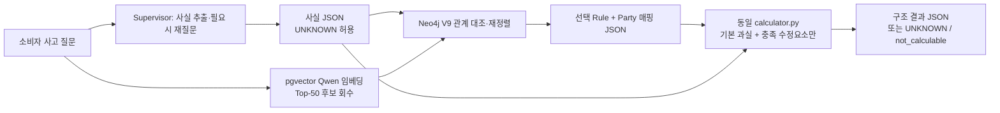
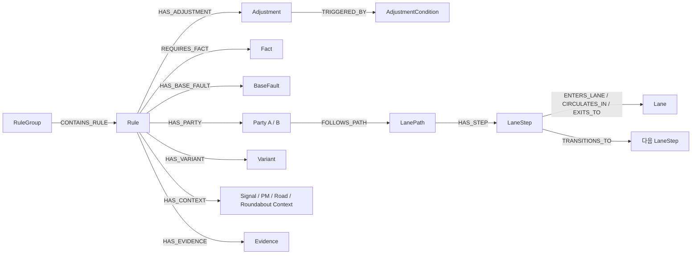

# 인정기준 검색 RAG 최종 의사결정 보고서

## 결론

인정기준 검색 RAG의 최종안은 **`pgvector 의미 검색 → Neo4j V9 관계 재정렬 → 단일 결정론 계산기`**로 한다.

- pgvector는 질문 의미에 맞는 Rule 후보 Top-50을 회수한다.
- Neo4j V9는 그 후보만 대상으로 사고 당사자·행동·신호·차로 경로·Variant·수정요소의 PDF 구조 관계를 대조해 순서를 다시 정한다.
- calculator는 선택된 Rule에 PDF 출처가 있는 기본 과실과 실제 충족한 수정요소만 적용해 JSON 결과를 만든다. 수정요소가 없으면 기본 과실을 그대로 반환한다.
- Runtime은 사고를 판단하거나 자연어로 과실비율을 설명하지 않는다. 사실이 부족하면 `UNKNOWN`/`not_calculable`을 반환하고 Supervisor가 재질문한다.

이 선택은 30개 상세 질문의 통제 재실험에서 **`pgvector + Neo4j V7` 관계 강화 전 대조군(C1)**보다 **`pgvector + Neo4j V9` 관계 강화 후(C2)**의 Rule Top-1, 당사자 매핑, 최종 과실비율 정확도가 모두 상승했기 때문이다. 법률상 과실비율 확정 성능을 뜻하지는 않으며, PDF 근거와 실험용 정답지의 사람 검수는 별도 필수 절차다.

## 1. 실험 명칭과 최종 비교의 범위

| 명칭 | 실제 파이프라인 | 역할 |
|---|---|---|
| A | `pgvector` | 의미 검색만 수행하는 기준선 |
| B | `pgvector + PostgreSQL` | 관계가 아닌 평면 구조 조건 후처리 |
| C1 | `pgvector + Neo4j V7` | Neo4j 관계 강화 전의 그래프 대조군 |
| C2 | `pgvector + Neo4j V9` | 차로 경로·신호·Variant·수정요소 관계를 강화한 최종 후보 |

**C1은 PostgreSQL이 아니다.** C1↔C2는 Neo4j 그래프를 V7에서 V9로 강화했을 때의 순수 효과를 보는 통제 비교다. B↔C2는 실제 운영 후보의 비교이며, 두 방식 모두 pgvector 검색을 먼저 수행한다.

현재 확보된 **직접 통제 점수표는 C1↔C2**다. A/B의 점수는 초기 공통 후보 실험에서 나온 이력 점수이므로, A·B·C2 세 방식의 최종 head-to-head 수치라고 표기하지 않는다. 보고서의 C2 채택 근거는 V7 대비 V9의 측정된 개선과 V9가 다단계 관계를 표현할 수 있다는 구조적 필요성이다.

최종 성능 판단에는 과거 V8 C-2a 결과를 사용하지 않는다. V8은 중간 투영본으로 DB에서도 제거했으며, 실행 근거 artifact만 보존한다.

| 항목 | C1: `pgvector + Neo4j V7` | C2: `pgvector + Neo4j V9` |
|---|---|---|
| 질문 | 동일한 상세 사고 질문 30건 | 동일 |
| 의미 후보 | 동일한 Qwen 임베딩 Top-50 | 동일 |
| 계산기 | 동일 `calculator.py` | 동일 |
| 정답지 접근 | Runtime 미접근, 평가 단계만 접근 | 동일 |
| 반복 | 3회, byte-identical | 3회, byte-identical |
| 구조 표현 | Rule-조건의 평면 대조 | Rule·Party·LanePath·LaneStep·Lane·Signal·Variant·Adjustment 관계 |

최종 Gate `C2_PRE_POST_FINAL`을 재실행해 PASS했다. 41개 계산 결과의 산술 오류는 0건이었다.

## 2. 최종 성능 점수표

아래 모든 비율은 30문항 분모의 점수다. MRR@3와 nDCG@3도 0~100점으로 환산했다. `Top-3/10/50`은 동일한 pgvector 후보 집합을 Neo4j가 **재정렬만** 하므로 전후가 같을 수 있다. Neo4j의 효과는 주로 Top-1과 계산 가능한 Rule 선택에서 확인한다.

| 지표 | C1 `pgvector + Neo4j V7` | C2 `pgvector + Neo4j V9` | 변화 |
|---|---:|---:|---:|
| Rule Hit@1 / Rule Exact | 36.7점 (11/30) | **46.7점 (14/30)** | **+10.0점p** |
| Hit@3 | 70.0점 (21/30) | 70.0점 (21/30) | 0.0점p |
| Hit@10 | 80.0점 (24/30) | 80.0점 (24/30) | 0.0점p |
| Recall@50 | 93.3점 (28/30) | 93.3점 (28/30) | 0.0점p |
| MRR@3 | 50.6점 | **56.7점** | **+6.1점p** |
| nDCG@3 | 55.5점 | **60.1점** | **+4.6점p** |
| 당사자 매핑 정확 | 53.3점 (16/30) | **56.7점 (17/30)** | **+3.4점p** |
| 계산 가능 Coverage | 66.7점 (20/30) | **70.0점 (21/30)** | **+3.3점p** |
| 최종 과실비율 정확 | 30.0점 (9/30) | **40.0점 (12/30)** | **+10.0점p** |

### 실제로 바뀐 3건

V9는 후보군 밖의 Rule을 새로 만들지 않았다. 동일 Top-50 안에서 관계가 맞는 Rule을 앞으로 보내 세 건을 개선했다.

| 문항 | C1 선택 | C2 V9 선택 | 결과 |
|---|---|---|---|
| q09 | PM 2021 도표10 | PM 2021 도표05 | Rule·최종비율 정답으로 개선 |
| q25 | 회전교차로 회전-9 | 회전교차로 회전-1 | Rule·당사자·최종비율 정답으로 개선 |
| q26 | 회전교차로 회전-9 | 회전교차로 회전-2 | Rule·당사자·최종비율 정답으로 개선 |

## 3. A/B 출발점과 운영 후보의 이력 비교

초기 A/B/C 비교는 `pgvector` 단독(A), `pgvector + PostgreSQL`(B), `pgvector + Neo4j V7`(C1)로 실행됐다. 당시 C1은 평면 조건 관계만 읽었기 때문에 B와 동일했다. 이 표는 **검색 고도화의 출발점**을 보여주기 위한 이력이며, 최종 의사결정은 위의 C1 대 C2 V9 통제 비교를 따른다.

| 지표 | A `pgvector` | B `pgvector + PostgreSQL` |
|---|---:|---:|
| Rule Hit@1 | 33.3점 (10/30) | 36.7점 (11/30) |
| Hit@3 | 50.0점 (15/30) | 70.0점 (21/30) |
| Hit@10 | 66.7점 (20/30) | 80.0점 (24/30) |
| Recall@50 | 93.3점 (28/30) | 93.3점 (28/30) |
| MRR@3 | 41.1점 | 50.6점 |
| nDCG@3 | 43.4점 | 55.5점 |
| 당사자 매핑 정확 | 36.7점 (11/30) | 53.3점 (16/30) |
| 최종 과실비율 정확 | 26.7점 (8/30) | 30.0점 (9/30) |

의미 검색만으로 Top-50 회수는 93.3점이지만 Top-1은 33.3점이었다. 따라서 **의미 검색 단독은 최종 Rule 결정기로 부족하고, 구조 후처리가 필요하다**는 근거가 된다.

## 4. 운영 검색 계약

### 검색 가중치 정책

**검색 가중치 합산은 사용하지 않는다.**

1. pgvector 유사도는 후보 Top-50을 정하는 데만 사용한다.
2. PostgreSQL/Neo4j는 PDF에서 구조화한 사실과 질문 Fact가 일치하는지 확인하는 후처리다.
3. Neo4j가 임의 점수나 가중합으로 과실비율을 바꾸지 않는다. 관계상 완전 일치·미확정·불일치를 판별해 후보 순서만 바꾼다.
4. 과실비율 숫자 변경은 검색 단계가 아니라 calculator에서, PDF 표의 `Adjustment`와 사용자 Fact가 명시적으로 충족할 때만 일어난다.

### Neo4j V9에서 실제 사용·보존하는 관계

| 범주 | 관계 예시 | 목적 |
|---|---|---|
| 사고 당사자 | `HAS_PARTY`, `ASSIGNS_FAULT` | Rule의 A/B와 사용자/상대 매핑 |
| 차로·경로 | `FOLLOWS_PATH`, `HAS_STEP`, `ENTERS_LANE`, `CIRCULATES_IN`, `EXITS_TO`, `TRANSITIONS_TO` | 회전교차로 진입·회전·출차 흐름 대조 |
| 신호·행동 | `SIGNAL_FOR`, `TOWARD`, `DESCRIBES_PARTY` | 신호와 진행 방향의 당사자 귀속 |
| Rule 계층 | `CONTAINS_RULE`, `VARIANT_OF`, `HAS_*CONTEXT` | RuleGroup, Variant, PM·도로·우선관계 문맥 |
| 수정요소 | `TRIGGERED_BY`, `ADJUSTS` | 계산기에 넘길 PDF 출처 수정요소 추적 |

V9 실험 그래프는 `Complete30V9` 라벨로 7,815개 노드와 13,196개 관계를 보존한다. 비교 전 그래프 `Complete30V7`은 1,718개 노드와 1,441개 관계로 보존한다.

## 5. B와 C2의 역할 구분

둘 다 pgvector 후보 검색 이후 동작하지만, 구조의 표현력이 다르다.

| 단계 | B: `pgvector + PostgreSQL` | C2: `pgvector + Neo4j V9` |
|---|---|---|
| 후보 검색 | pgvector Top-50 | pgvector Top-50 |
| 후처리 표현 | Rule별 조건 행을 평면 비교 | Rule→Party→경로→차로·신호·Variant·수정요소를 관계 탐색 |
| 강점 | 단순 사고군·참여자·행동 조건 | 회전교차로, PM, 다단계 차로 경로, 당사자 귀속 관계 |
| 비율 변경 | 공통 calculator만 수행 | 공통 calculator만 수행 |

따라서 **운영 기본안은 `pgvector + Neo4j V9`**이고, B는 Neo4j를 사용할 수 없는 환경에서의 단순 구조 후처리 대안이다.

## 6. Runtime 출력 원칙

Runtime은 다음 JSON 필드만 반환한다.

- `candidate_rule_ids`: pgvector 후보
- `selected_rule_id`, `party_mapping`, `selection_state`
- `base_ratio`, `applied_adjustments`, `final_ratio`
- `status`: `calculated` 또는 `not_calculable`
- `missing_facts`: Supervisor 재질문에 필요한 Fact 목록

Runtime이 하지 않는 일:

- 사고 사실을 추정하거나 채우기
- 수치에 대한 법률적 판단·권고·설명 생성
- 출처 없는 가중치로 후보 또는 과실비율 변경

## 7. Neo4j V9 노드와 엣지 사전

Neo4j에서 **노드(Node)**는 PDF에서 분리한 하나의 객체이고, **엣지(Edge)**는 두 객체 사이의 출처 있는 관계다. 예를 들어 `Rule`은 “어떤 사고 기준”, `Party`는 그 기준에서의 A/B 당사자, `LaneStep`은 당사자가 경로에서 밟는 한 단계다. 엣지는 “이 Rule에는 이 Party가 있다”, “이 Party는 이 차로 경로를 따른다”를 표현한다.

### 노드: 무엇을 보관하는가

| 노드 | 의미 | 대표 연결 | 현재 역할 |
|---|---|---|---|
| `Rule` | PDF의 한 인정기준 Rule | Party, Fact, BaseFault, Adjustment, Variant, Context, Evidence | 검색 후보의 중심 |
| `Party` | 해당 Rule의 PDF 당사자 A/B | Rule, LanePath, BaseFault | 사용자/상대방을 A/B에 매핑 |
| `Fact` | Rule 성립에 필요한 사고 사실 | `Rule-REQUIRES_FACT→Fact` | 신호·행동·차종 등 질문 Fact와 대조 |
| `BaseFault` | PDF의 기본 과실비율 | `Rule-HAS_BASE_FAULT→BaseFault` | calculator의 시작 비율 |
| `Adjustment` | PDF 표의 수정요소 | `Rule-HAS_ADJUSTMENT→Adjustment` | calculator가 적용할 후보 수정요소 |
| `AdjustmentCondition` | 수정요소가 성립하는 조건 | `Adjustment-TRIGGERED_BY→AdjustmentCondition` | 출처·추적용 조건 단위 |
| `LanePath` | 한 당사자의 전체 차로 경로 | `Party-FOLLOWS_PATH→LanePath` | 당사자별 경로 묶음 |
| `LaneStep` | 진입·회전·출차 같은 경로 한 단계 | LanePath, Lane | 차로·방향 Fact 대조의 핵심 |
| `Lane` | 진입1차로·회전2차로·출차1차로 등 차로 객체 | LaneStep | 차로를 이름 문자열이 아닌 객체로 표현 |
| `Context` | PM·신호·도로·우선관계·회전교차로 문맥 | `Rule-HAS_CONTEXT→Context` | PM/자동차 신호 귀속 등 문맥 대조 |
| `Variant` | 같은 Rule의 분기 조건·대안 비율 | `Rule-HAS_VARIANT→Variant` | 변형 Rule의 출처 보존 |
| `RuleGroup` | 같은 사고군의 Rule 묶음 | `RuleGroup-CONTAINS_RULE→Rule` | 후보군 분류·탐색 경계 |
| `Evidence` | PDF 페이지·원문 출처 | `Rule-HAS_EVIDENCE→Evidence` | 결과의 출처 추적 |
| `PotentialConflictZone` | 두 경로가 만날 수 있는 잠재 위치 | LaneStep | 실제 충돌 사실이 아닌 탐색 보조 정보 |

### 엣지: 선 하나가 뜻하는 것

| 엣지 | 읽는 법 | 사용 목적 |
|---|---|---|
| `CONTAINS_RULE` | 사고군은 여러 Rule을 포함한다 | RuleGroup 탐색 |
| `REQUIRES_FACT` | Rule은 이 사실을 요구한다 | 질문 Fact와 Rule 조건 대조 |
| `HAS_PARTY` | Rule에는 A/B 당사자가 있다 | 사용자·상대방 매핑과 계산 |
| `FOLLOWS_PATH` | 당사자는 이 차로 경로를 따른다 | 당사자별 경로 분리 |
| `HAS_STEP` | 경로는 순서 있는 단계를 가진다 | 진입·회전·출차 Fact 대조 |
| `ENTERS_LANE` | 이 단계는 특정 진입차로로 들어간다 | 차로 경로를 명시적으로 시각화·확장 |
| `CIRCULATES_IN` | 이 단계는 회전차로를 지난다 | 회전교차로 경로 표현 |
| `EXITS_TO` | 이 단계는 특정 출차로로 나간다 | 출차 조건 표현 |
| `TRANSITIONS_TO` | 한 차로 단계 다음에 다른 단계가 온다 | 경로 순서·연속성 표현 |
| `SIGNAL_FOR` | 신호 문맥은 특정 당사자에 속한다 | PM/차량 신호 귀속 |
| `HAS_BASE_FAULT` | Rule의 기본 과실은 이 값이다 | calculator 입력 |
| `HAS_ADJUSTMENT` | Rule에는 이 수정요소가 있다 | calculator 입력 |
| `TRIGGERED_BY` | 수정요소는 이 조건에 의해 성립한다 | 수정요소 조건의 출처 추적 |
| `VARIANT_OF` | 이 Variant는 이 기본 Rule의 분기다 | 대안 비율·분기 출처 |
| `HAS_CONTEXT` | Rule은 이 사고 문맥을 가진다 | 신호·PM·도로·우선관계 대조 |
| `HAS_EVIDENCE` | Rule의 근거는 이 PDF Evidence다 | 페이지·원문 추적 |

### 현재 C2 Runtime에서 실제로 읽는 관계와 보존 관계

이 구분은 중요하다. V9에 적재됐다고 해서 모든 엣지가 현재 순위 계산에 같은 비중으로 쓰이는 것은 아니다.

| 구분 | 관계 | 현재 사용 방식 |
|---|---|---|
| **후보 재정렬에 직접 사용** | `REQUIRES_FACT`, `HAS_PARTY`, `FOLLOWS_PATH`, `HAS_STEP`, `HAS_CONTEXT` | Rule 조건·A/B 매핑·차로 단계·신호 문맥을 질문 Fact와 대조 |
| **계산기에 직접 사용** | `HAS_BASE_FAULT`, `HAS_PARTY`, `HAS_ADJUSTMENT` | 기본 과실·당사자·수정요소를 graph adapter로 calculator에 전달 |
| **출처 추적·다음 확장용** | `ENTERS_LANE`, `CIRCULATES_IN`, `EXITS_TO`, `TRANSITIONS_TO`, `SIGNAL_FOR`, `TRIGGERED_BY`, `VARIANT_OF`, `HAS_EVIDENCE` 등 | Browser 시각화·PDF 근거 보존·다음 matcher 확장에 사용. 현재 Runtime은 `LaneStep`과 `Context`의 원본 구조를 읽어 같은 의미를 대조한다. |
| **판단에 사용 금지** | `POTENTIALLY_CONVERGES_ON`, `PRECEDES_ENTRY` | PDF에 실제 충돌 지점·선후행 Fact가 없는 경우 trace만 남기며 Rule 승격이나 비율 변경 근거로 쓰지 않는다. |

따라서 Neo4j는 “관계가 있다는 이유만으로 점수를 더 주는 DB”가 아니다. **질문에 있는 Fact와 PDF에서 구조화한 관계가 정확히 대응할 때만** 후보를 앞세우고, 대응 Fact가 없으면 `UNKNOWN`으로 남긴다.

## 8. 한계와 다음 검증

- 30건은 실험용 상세 질문·정답지이므로, 결과는 내부 구조 검색 비교의 증거다. 실제 서비스 정확도나 법적 판단 정확도를 보장하지 않는다.
- Top-50에 정답이 없는 2건은 Neo4j로도 회복할 수 없다. 임베딩 모델/문서 표현 개선의 별도 과제다.
- PDF에서 명시되지 않은 충돌 지점·출차 선후행은 그래프에 발명해 넣지 않았다. 해당 Fact가 필요하면 Supervisor가 `UNKNOWN`을 근거로 재질문해야 한다.
- 다음 Gate는 30건 정답지의 Rule·기본비율·수정요소·해설을 PDF 페이지 근거로 사람 검수하는 것이다. 그 뒤 신규 홀드아웃 30~50건으로 같은 A/B/C V9 계약을 재검증한다.

## 근거 파일

- `artifacts/v7_complete30_abc/11_c2_pre_post/metrics.json`
- `artifacts/v7_complete30_abc/11_c2_pre_post/final_validation.json`
- `artifacts/v7_complete30_abc/06_comparison/abc_metrics.json`
- `src/new_abc_test_v7/run_c2_pre_post.py`
- `src/new_abc_test_v7/calculator.py`
