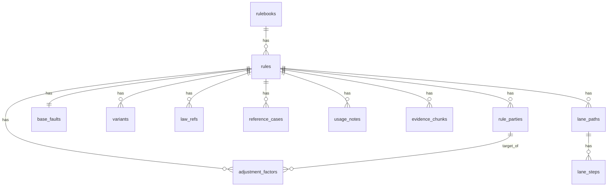

# 과실비율 인정기준 DB 적재 통합 계획서 - 최종 통합본

> 이 문서는 아래 두 파일의 내용을 하나의 DB 적재 계획서로 합친 통합본이다.  
> 중복되는 내용은 더 구체적인 설명을 우선으로 두고, 겹치지 않는 내용은 빠뜨리지 않고 추가했다.  
> 특히 `Staging`, `Core`, `Search Documents`, `Embedding`, `Neo4j`, `A/B test`, `코드 구현 계획`을 하나의 흐름으로 다시 정리했다.

통합 대상 파일:

```text
1. README_기준정보_데이터_적재_계획_수정본(1).md
2. 과실비율_인정기준_DB_적재_Neo4j_임베딩_최종계획(2).md
```

통합 기준:

```text
- Staging 상세 설계와 전처리 산출물 경로 설명은 README 수정본의 내용을 기준으로 유지한다.
- Search Documents, Embedding, 코드 구현 계획, 서비스 흐름은 최종계획서의 내용을 추가한다.
- Core 컬럼 선정 기준은 실제 구현자가 왜 이 컬럼을 써야 하는지 알 수 있도록 보강한다.
- Elasticsearch는 MVP 필수 단계가 아니라 제외/선택 검토 대상으로 정리한다.
- 유사도 점수는 저장값이 아니라 검색 시점 계산값이라는 기준을 유지한다.
```

---

# 통합본 선요약. 최종 전체 구조와 헷갈렸던 부분


## 0.1 전체 구조 한 줄 정리

```text
전처리 JSONL
  ↓
PostgreSQL Staging
  ↓
PostgreSQL Core
  ↓
PostgreSQL Search Documents + Embedding
  ↓
Neo4j Graph
```

각 단계의 역할은 다르다.

```text
Staging = 전처리 결과 1차 적재/검수/보관용
Core = 서비스/과실계산/Neo4j 생성용
Search Documents = Core 기반 검색/임베딩용
Neo4j = Core 기반 관계 탐색/검증용
```

---


## 0.2 지금 헷갈렸던 부분 정리

## 1.1 Staging은 “기본 데이터”가 아니다

`Staging = 기본`이라고 부르면 `base_faults`의 “기본과실”과 헷갈릴 수 있다.

정확히는 다음이다.

```text
Staging = 전처리 JSONL을 PostgreSQL에 먼저 담아두는 임시/검수 테이블
```

예를 들어 `rules.jsonl`의 한 줄이 아래처럼 생겼다고 하자.

```json
{"rule_id":"official_2023_차47-3","rule_title":"버스정류장에서 정차후 출발 버스와 그 앞으로 진로변경","accident_group":"자동차와 자동차"}
```

이 JSON 하나가 DB row 하나가 된다.

```text
stg_rules

batch_id | rule_id              | rule_title                         | accident_group     | raw_json
---------|----------------------|------------------------------------|--------------------|--------------------
v10      | official_2023_차47-3 | 버스정류장에서 정차후 출발...        | 자동차와 자동차       | {원본 JSON 전체}
```

즉:

```text
JSONL 한 줄 = JSON 하나 = DB row 하나
```

---

## 1.2 Core는 실제 서비스용이다

Core는 Staging에서 필요한 값만 뽑아 정리한 테이블이다.

```text
Staging은 검수/보관용
Core는 서비스/계산/Neo4j 생성용
```

Core에는 다음 테이블들이 들어간다.

```text
rulebooks
rules
rule_parties
base_faults
variants
adjustment_factors
evidence_chunks
law_refs
reference_cases
usage_notes
lane_paths
lane_steps
```

---

## 1.3 Search Documents는 Core 기반이다

Search Documents는 Staging이 아니라 Core를 바탕으로 만든다.

이유는 간단하다.

```text
Staging = 아직 1차 적재/검수용
Core = 정제되어 서비스에서 쓰는 기준 데이터
```

검색용 문장은 반드시 Core 기준으로 만들어야 Neo4j와 계산 결과가 맞는다.

예를 들어 Core에 다음 데이터가 있다.

```text
rules:
차47-3 / 버스정류장에서 정차후 출발 버스와 그 앞으로 진로변경

rule_parties:
A = 정차 후 출발 버스차량
B = 추월 진로변경

base_faults:
A40:B60

adjustment_factors:
B 진로변경 신호불이행·지연 +10
```

그러면 Search Documents에는 이런 문장을 만든다.

```text
차47-3. 버스정류장에서 정차 후 출발한 버스차량과 그 앞으로 진로변경한 차량 간 사고 기준이다.
A는 정차 후 출발 버스차량이고, B는 추월 진로변경 차량이다.
기본과실은 A40:B60이다.
B가 진로변경 신호를 불이행하거나 지연하면 B 과실에 +10이 적용될 수 있다.
```

이 문장을 임베딩해서 벡터로 저장한다.

---

## 1.4 임베딩과 유사도 점수는 다르다

```text
embedding = 미리 저장하는 벡터값
similarity_score = 검색할 때마다 계산되는 값
```

Search Documents에는 다음을 저장한다.

```text
search_text
embedding
metadata
```

유사도 점수는 저장하지 않는다.  
사용자 질문이 들어올 때마다 질문도 임베딩하고, 저장된 embedding과 비교해서 계산한다.

---


---


# 본문 1. 기준정보 데이터 적재 상세 계획서 내용 통합


# 과실비율 인정기준 데이터 적재 상세 계획서 - 수정본

## 0. 이번 수정의 핵심

기존 계획서의 큰 흐름은 맞다.

```text
전처리 JSONL
→ PostgreSQL Staging
→ PostgreSQL Core
→ Neo4j Graph
→ Vector / Elasticsearch 검색 연결
```

다만 기존 문서의 1단계 설명은 헷갈릴 수 있었다.
기존에는 `preprocess_raw_rows`라는 하나의 테이블에 `payload JSONB`로 모든 JSONL row를 넣는 방식이었다.
이 방식은 구현은 단순하지만, 테이블별 구조를 눈으로 확인하기 어렵고, 사용자가 이해하기 어렵다.

따라서 이 수정본에서는 1단계를 아래처럼 바꾼다.

```text
기존 방식:
모든 JSONL row → preprocess_raw_rows 하나의 테이블 → payload JSONB 저장

수정 방식:
JSONL 파일별로 staging 테이블 생성
rules.jsonl              → stg_rules
parties.jsonl            → stg_rule_parties
base_faults.jsonl        → stg_base_faults
variants.jsonl           → stg_variants
adjustment_factors.jsonl → stg_adjustment_factors
chunks.jsonl             → stg_evidence_chunks
law_refs.jsonl           → stg_law_refs
reference_cases.jsonl    → stg_reference_cases
usage_notes.jsonl        → stg_usage_notes
```

즉, 이 문서에서 말하는 1단계는 더 이상 “한 테이블에 payload만 넣는 방식”이 아니다.

정확한 저장 방식은 다음이다.

```text
JSONL 한 줄 = JSON 객체 하나 = PostgreSQL row 하나
자주 쓰는 값 = 컬럼으로 저장
기준서별 특수 값 = attributes JSONB에 저장
원본 JSON 전체 = raw_json JSONB에 같이 저장
```

---

## 1. 전체 적재 흐름

```text
etl/fault_cases/artifacts/fault_standard_output/preprocessed/
  2020_nontypical_accident_rulebook/
  2021_pm_vs_auto_nontypical_rulebook/
  2023_official_auto_accident_rulebook/
  2025_two_lane_roundabout_rulebook/
    ↓
[1단계] PostgreSQL Staging 저장
    - JSONL 파일별 stg_* 테이블에 저장
    - 주요 필드는 컬럼으로 저장
    - 원본 row 전체는 raw_json JSONB로 보존
    - 검수, 재처리, 버전 비교, Core 생성 전 확인용

    ↓
[2단계] PostgreSQL Core 테이블 생성
    - Staging에서 서비스에 필요한 공통 구조만 정리
    - Rule, Party, BaseFault, Variant, Adjustment 중심
    - 과실 계산, 관리자 화면, Neo4j 생성에 사용

    ↓
[3단계] Neo4j Graph 생성
    - Core 테이블에서 노드와 엣지 생성
    - 사고유형 매칭, A/B 관계 검증, 수정요소 연결에 사용

    ↓
[4단계] Vector / Elasticsearch 검색 연결
    - evidence_chunks, law_refs, reference_cases, usage_notes 중심
    - 자연어 사고 설명 후보 검색, 판례/심의사례 키워드 검색에 사용
```

---

## 2. 현재 전처리 데이터 상태

현재 적재 대상은 zip 파일 자체가 아니라 아래 전처리 산출물 루트 폴더다.

```text
etl/fault_cases/artifacts/fault_standard_output/preprocessed/
```

이 루트 아래의 4개 기준서 폴더를 직접 순회해서 JSONL을 읽는다.

```text
2020_nontypical_accident_rulebook/
2021_pm_vs_auto_nontypical_rulebook/
2023_official_auto_accident_rulebook/
2025_two_lane_roundabout_rulebook/
```

각 기준서 폴더 안의 `99_tables_for_db/*.jsonl`과 기준서별 보조 JSONL을 적재 대상으로 본다.

| 구분 | 설명 | 대표 파일 |
|---|---|---|
| 기준서 | 과실비율 기준서 단위 | `rulebooks.jsonl` |
| 기준 규칙 | 개별 과실비율 기준 | `rules.jsonl` |
| 당사자 | A/B, 보/차, PM/차 등 | `parties.jsonl` |
| 기본과실 | 기본 비율 | `base_faults.jsonl` |
| 세부 시나리오 | 기본과실이 여러 경우로 갈리는 경우 | `variants.jsonl`, `rule_scenarios.jsonl` |
| 수정요소 | 현저한 과실, 중대한 과실, 신호불이행 등 | `adjustment_factors.jsonl` |
| 법규/판례/설명 | 근거 설명용 | `law_refs.jsonl`, `reference_cases.jsonl`, `usage_notes.jsonl` |
| 검색용 문단 | RAG/검색용 | `chunks.jsonl`, `rule_blocks.jsonl` |
| 특수 맥락 | 회전교차로, PM, 도로상황 등 | `lane_paths.jsonl`, `lane_steps.jsonl`, `pm_contexts.jsonl`, `road_contexts.jsonl` |
| 품질검증 | 파싱 상태 확인 | `parse_quality_report.jsonl` |

현재 구조는 DB 적재가 불가능한 구조가 아니다. 오히려 이미 `Rule 중심`으로 잘 나뉘어 있다.
다만 전처리 JSONL의 모든 필드를 최종 ERD 컬럼으로 그대로 만들면 기준서별 특수 필드 때문에 테이블이 지저분해질 수 있다.

---

# 3. 1단계: PostgreSQL Staging 저장

## 3.1 1단계의 목적

1단계는 전처리 결과를 PostgreSQL에 거의 그대로 저장하는 단계다.
하지만 여기서 “그대로”의 의미는 `payload` 하나에 뭉쳐 넣는다는 뜻이 아니다.

정확히는 다음과 같다.

```text
각 JSONL 파일마다 staging 테이블을 만든다.
각 JSONL row는 staging 테이블의 row 하나가 된다.
공통적으로 자주 볼 값은 컬럼으로 저장한다.
원본 JSON 전체는 raw_json 컬럼에 같이 저장한다.
```

1단계의 목적은 서비스 로직이 아니라 다음이다.

```text
1. 전처리 결과 원본 보존
2. JSONL row가 어떤 테이블로 들어갔는지 눈으로 확인
3. 전처리 버전별 비교
4. 잘못 적재되었을 때 복구
5. Core 테이블 생성 전 검수
6. 나중에 컬럼 추가가 필요할 때 raw_json에서 재추출
```

즉, Staging은 최종 서비스 테이블이 아니라 `검수 가능한 임시 적재소`다.

---

## 3.2 Staging 공통 원칙

모든 stg_* 테이블은 아래 공통 원칙을 따른다.

```text
batch_id
- 어떤 전처리 버전에서 들어왔는지 기록

rulebook_id
- 어느 기준서에서 온 데이터인지 기록

rule_id
- 어떤 기준 rule에 연결되는지 기록

주요 컬럼
- 서비스/검수에서 자주 볼 값은 컬럼으로 펼침

attributes JSONB
- 기준서별 특수 필드, 자주 쓰지 않는 구조값 저장

raw_json JSONB
- 원본 JSON row 전체 저장
```

중요한 점은 `raw_json`은 백업이자 원본 보존용이고, 서비스가 계속 직접 조회하는 대상은 아니라는 것이다.

---

## 3.3 Batch 테이블

전처리 산출물 루트 폴더 하나를 적재할 때마다 batch를 하나 만든다.

```sql
CREATE TABLE preprocess_batches (
    batch_id BIGSERIAL PRIMARY KEY,
    batch_name TEXT NOT NULL,
    source_root_path TEXT,
    preprocess_version TEXT,
    description TEXT,
    created_at TIMESTAMP DEFAULT now()
);
```

예시 row:

| batch_id | batch_name | source_root_path | preprocess_version | description |
|---:|---|---|---|---|
| 1 | `preprocessed_2026_07_01` | `etl/fault_cases/artifacts/fault_standard_output/preprocessed` | `v10_combined` | `4개 기준서 통합 전처리 결과` |

---

## 3.4 Staging 테이블 목록

1단계에서 만들 staging 테이블은 다음과 같다.

| JSONL 파일 | Staging 테이블 | 설명 |
|---|---|---|
| `rulebooks.jsonl` | `stg_rulebooks` | 기준서 단위 |
| `rules.jsonl` | `stg_rules` | 개별 기준 rule |
| `parties.jsonl` | `stg_rule_parties` | A/B, 보/차, PM/차 등 당사자 |
| `base_faults.jsonl` | `stg_base_faults` | 기본과실 |
| `variants.jsonl` | `stg_variants` | 세부 시나리오별 비율 |
| `adjustment_factors.jsonl` | `stg_adjustment_factors` | 수정요소 |
| `law_refs.jsonl` | `stg_law_refs` | 관련 법규 |
| `reference_cases.jsonl` | `stg_reference_cases` | 참고판례/참고사례 |
| `usage_notes.jsonl` | `stg_usage_notes` | 기준 적용 설명 |
| `chunks.jsonl` | `stg_evidence_chunks` | 검색/RAG 문단 |
| `rule_blocks.jsonl` | `stg_rule_blocks` | 원문 블록 |
| `lane_paths.jsonl` | `stg_lane_paths` | 회전교차로 경로 |
| `lane_steps.jsonl` | `stg_lane_steps` | 회전교차로 단계 |
| `road_contexts.jsonl` | `stg_road_contexts` | 도로상황 |
| `pm_contexts.jsonl` | `stg_pm_contexts` | PM 사고 맥락 |
| `parse_quality_report.jsonl` | `stg_parse_quality_report` | 전처리 품질검증 |

처음 MVP에서는 아래 7개만 먼저 해도 된다.

```text
stg_rulebooks
stg_rules
stg_rule_parties
stg_base_faults
stg_variants
stg_adjustment_factors
stg_evidence_chunks
```

---

## 3.5 `stg_rulebooks`

```sql
CREATE TABLE stg_rulebooks (
    batch_id BIGINT REFERENCES preprocess_batches(batch_id),
    rulebook_id TEXT NOT NULL,
    rulebook_name TEXT,
    source_type TEXT,
    source_subtype TEXT,
    source_file TEXT,
    published_year INTEGER,
    source_reliability TEXT,
    raw_json JSONB NOT NULL,
    created_at TIMESTAMP DEFAULT now(),
    PRIMARY KEY (batch_id, rulebook_id)
);
```

역할:

```text
기준서 하나를 저장한다.
예: 2023 공식 자동차사고 과실비율 인정기준, 2025 2차로 회전교차로 기준 등
```

---

## 3.6 `stg_rules`

`rules.jsonl`의 각 row가 `stg_rules`의 row 하나가 된다.

```sql
CREATE TABLE stg_rules (
    batch_id BIGINT REFERENCES preprocess_batches(batch_id),
    rule_id TEXT NOT NULL,
    rulebook_id TEXT NOT NULL,

    rule_code TEXT,
    rule_no TEXT,
    rule_title TEXT,
    rule_type TEXT,

    accident_group TEXT,
    accident_subgroup TEXT,

    normalized_ratio TEXT,
    party_a_ratio INTEGER,
    party_b_ratio INTEGER,

    base_fault_type TEXT,
    calculation_source TEXT,
    scenario_required BOOLEAN,
    variants_required BOOLEAN,
    auto_calculation_eligible BOOLEAN,

    page_start INTEGER,
    page_end INTEGER,
    parse_status TEXT,

    attributes JSONB,
    raw_json JSONB NOT NULL,
    created_at TIMESTAMP DEFAULT now(),

    PRIMARY KEY (batch_id, rule_id)
);
```

예시:

| batch_id | rule_id | rule_title | accident_group | normalized_ratio | raw_json |
|---:|---|---|---|---|---|
| 1 | `official_2023_차47-3` | `버스정류장에서 정차후 출발 버스와 그 앞으로 진로변경` | `자동차와 자동차` | `40:60` | 원본 JSON 전체 |
| 1 | `official_2023_차48-1` | `선행차량의 적재물 낙하` | `자동차와 자동차` | `0:100` | 원본 JSON 전체 |

---

## 3.7 `stg_rule_parties`

`parties.jsonl`의 각 row가 `stg_rule_parties`의 row 하나가 된다.

```sql
CREATE TABLE stg_rule_parties (
    batch_id BIGINT REFERENCES preprocess_batches(batch_id),
    party_id TEXT NOT NULL,
    rule_id TEXT NOT NULL,
    rulebook_id TEXT NOT NULL,

    party_key TEXT NOT NULL,
    party_label TEXT,
    party_type TEXT,

    movement TEXT,
    road_position TEXT,
    signal_state TEXT,
    entry_timing TEXT,
    violation_type TEXT,

    raw_text TEXT,
    attributes JSONB,
    raw_json JSONB NOT NULL,
    created_at TIMESTAMP DEFAULT now(),

    PRIMARY KEY (batch_id, party_id),
    UNIQUE (batch_id, rule_id, party_key)
);
```

예시:

| rule_id | party_key | party_type | movement | raw_text |
|---|---|---|---|---|
| `official_2023_차47-3` | `A` | `vehicle` | `정차 후 출발` | `(A) 정차 후 출발 버스차량` |
| `official_2023_차47-3` | `B` | `vehicle` | `진로변경` | `(B) 추월 진로변경` |

회전교차로처럼 특수 필드가 있으면 `attributes`에 둔다.

```json
{
  "party_color": "red",
  "entry_lane": "진입1차로",
  "circulation_lane": "회전1차로",
  "exit_direction": "3시",
  "lane_change_from": null,
  "lane_change_to": null
}
```

---

## 3.8 `stg_base_faults`

```sql
CREATE TABLE stg_base_faults (
    batch_id BIGINT REFERENCES preprocess_batches(batch_id),
    base_fault_id TEXT NOT NULL,
    rule_id TEXT NOT NULL,
    rulebook_id TEXT NOT NULL,

    base_fault_type TEXT,
    calculation_source TEXT,

    party_a_ratio INTEGER,
    party_b_ratio INTEGER,
    normalized_ratio TEXT,

    scenario_required BOOLEAN,
    variants_required BOOLEAN,
    auto_calculation_eligible BOOLEAN,

    is_one_sided_fault BOOLEAN,
    is_equal_fault BOOLEAN,

    raw_text TEXT,
    quality_flags JSONB,
    attributes JSONB,
    raw_json JSONB NOT NULL,
    created_at TIMESTAMP DEFAULT now(),

    PRIMARY KEY (batch_id, base_fault_id),
    UNIQUE (batch_id, rule_id)
);
```

예시:

| rule_id | base_fault_type | calculation_source | party_a_ratio | party_b_ratio | normalized_ratio |
|---|---|---|---:|---:|---|
| `official_2023_차47-3` | `pair_ratio` | `base_faults` | 40 | 60 | `40:60` |
| `official_2023_보22` | `variant_ratio` | `variants` | null | null | null |

---

## 3.9 `stg_variants`

```sql
CREATE TABLE stg_variants (
    batch_id BIGINT REFERENCES preprocess_batches(batch_id),
    variant_id TEXT NOT NULL,
    rule_id TEXT NOT NULL,
    rulebook_id TEXT NOT NULL,

    variant_key TEXT,
    variant_title TEXT,
    scenario_text TEXT,

    party_a_ratio INTEGER,
    party_b_ratio INTEGER,

    single_party_key TEXT,
    single_party_ratio INTEGER,
    single_party_type TEXT,

    ratio_interpretation TEXT,
    needs_review BOOLEAN,

    raw_text TEXT,
    attributes JSONB,
    raw_json JSONB NOT NULL,
    created_at TIMESTAMP DEFAULT now(),

    PRIMARY KEY (batch_id, variant_id)
);
```

예시 1: `차43-7`

| rule_id | variant_key | scenario_text | party_a_ratio | party_b_ratio |
|---|---|---|---:|---:|
| `official_2023_차43-7` | `가` | `안전지대 벗어나기 전` | 100 | 0 |
| `official_2023_차43-7` | `나` | `안전지대 벗어난 후` | 70 | 30 |

예시 2: `보22`

| rule_id | variant_key | scenario_text | single_party_key | single_party_ratio |
|---|---|---|---|---:|
| `official_2023_보22` | `가` | `소로 횡단` | `보` | 10 |
| `official_2023_보22` | `나` | `동일폭 횡단` | `보` | 20 |
| `official_2023_보22` | `다` | `대로 횡단` | `보` | 30 |

---

## 3.10 `stg_adjustment_factors`

```sql
CREATE TABLE stg_adjustment_factors (
    batch_id BIGINT REFERENCES preprocess_batches(batch_id),
    adjustment_id TEXT NOT NULL,
    rule_id TEXT NOT NULL,
    rulebook_id TEXT NOT NULL,

    target_party_key TEXT,
    target_party_type TEXT,

    factor_name TEXT,
    factor_category TEXT,

    delta INTEGER,
    delta_direction TEXT,
    raw_delta TEXT,

    condition_text TEXT,
    explanation_text TEXT,
    raw_text TEXT,

    is_applicable BOOLEAN,
    auto_calculation_eligible BOOLEAN,
    exclude_from_auto_calculation BOOLEAN,

    attributes JSONB,
    raw_json JSONB NOT NULL,
    created_at TIMESTAMP DEFAULT now(),

    PRIMARY KEY (batch_id, adjustment_id)
);
```

예시:

| rule_id | target_party_key | factor_name | delta | raw_text |
|---|---|---|---:|---|
| `official_2023_차47-3` | `A` | `현저한 과실` | 10 | `A 현저한 과실 +10` |
| `official_2023_차47-3` | `B` | `진로변경 신호불이행·지연` | 10 | `B 진로변경 신호불이행·지연 +10` |

중요 검증:

```text
stg_adjustment_factors.rule_id + target_party_key
→ stg_rule_parties.rule_id + party_key
```

이 연결이 되면 나중에 Neo4j에서 `AdjustmentFactor - APPLIES_TO -> RuleParty` 관계를 만들 수 있다.

---

## 3.11 `stg_evidence_chunks`

`chunks.jsonl`의 각 row가 들어간다.

```sql
CREATE TABLE stg_evidence_chunks (
    batch_id BIGINT REFERENCES preprocess_batches(batch_id),
    chunk_id TEXT NOT NULL,
    rule_id TEXT,
    rulebook_id TEXT NOT NULL,

    block_id TEXT,
    chunk_type TEXT,
    chunk_text TEXT NOT NULL,

    rule_title TEXT,
    accident_group TEXT,
    accident_subgroup TEXT,
    accident_tags JSONB,

    source_reliability TEXT,
    metadata JSONB,
    raw_json JSONB NOT NULL,
    created_at TIMESTAMP DEFAULT now(),

    PRIMARY KEY (batch_id, chunk_id)
);
```

역할:

```text
자연어 사고 설명 후보 검색
RAG 근거 문단 검색
Elasticsearch 또는 Vector index의 입력 데이터
```

---

## 3.12 기타 Staging 테이블

아래 테이블들은 MVP 2차 이후에 넣어도 된다.

```text
stg_law_refs
stg_reference_cases
stg_usage_notes
stg_rule_blocks
stg_lane_paths
stg_lane_steps
stg_road_contexts
stg_pm_contexts
stg_parse_quality_report
```

공통 원칙은 동일하다.

```text
주요 필드 = 컬럼
원본 row 전체 = raw_json
특수 필드 = attributes 또는 metadata JSONB
```

---

## 3.13 1단계 Staging 적재 코드 실행 방법

1단계 코드는 현재 아래 위치에 둔다.

```text
etl/fault_cases/src/fault_standard/loading/
  db.py
  staging_schema.py
  staging_loader.py
  run_staging_load.py
  run_staging_pipeline.py
```

역할은 다음과 같다.

| 파일 | 역할 |
|---|---|
| `db.py` | `.env` 또는 환경변수에서 PostgreSQL 접속 정보를 읽고 DB 연결 |
| `staging_schema.py` | `staging.preprocess_batches`, `staging.stg_*` 테이블 DDL 생성 |
| `staging_loader.py` | 전처리 산출물 4개 폴더를 순회하여 JSONL을 staging 테이블에 적재 |
| `run_staging_load.py` | 이미 준비된 DB에 staging 적재만 수행하는 CLI |
| `run_staging_pipeline.py` | docker postgres 실행, DB 생성, schema 생성, staging 적재까지 한 번에 수행하는 CLI |

실행 전 PostgreSQL 환경변수는 `.env`에 아래처럼 둔다.

```env
POSTGRES_HOST=localhost
POSTGRES_PORT=5432
POSTGRES_USER=postgres
POSTGRES_PASSWORD=change-me
POSTGRES_DB=law_db
FAULT_STANDARD_POSTGRES_DB=fault_standard_db
```

`POSTGRES_DB`는 docker-compose의 기본 PostgreSQL DB 이름이고, `FAULT_STANDARD_POSTGRES_DB`는 과실비율 인정기준 Staging 적재 코드가 우선 사용하는 DB 이름이다.

즉, PostgreSQL 컨테이너는 기존 `postgres` 하나를 그대로 쓰고, 그 안에 인정기준용 DB만 분리해서 사용할 수 있다.

```text
PostgreSQL 컨테이너 1개
  - law_db
  - fault_standard_db
```

`law_db`와 `fault_standard_db`는 같은 PostgreSQL 컨테이너 안에 있는 서로 다른 database다.
인정기준 데이터는 `fault_standard_db` 안에 넣는다.

또한 `fault_standard_db` 내부에서는 PostgreSQL schema를 나눠서 관리한다.

```text
fault_standard_db
  - staging
      - preprocess_batches
      - stg_rules
      - stg_rule_parties
      - stg_base_faults
      - stg_adjustment_factors
      - ...
  - core
      - rulebooks
      - rules
      - rule_parties
      - base_faults
      - adjustment_factors
      - ...
  - search
      - rule_search_documents
      - search_result_logs
```

이렇게 나누는 이유는 다음과 같다.

```text
public에 stg_* / core / search 테이블을 모두 넣으면 DBeaver에서 테이블이 길게 섞여 보인다.
staging schema는 전처리 원본 검수용이다.
core schema는 서비스 계산과 Neo4j 생성 기준이다.
search schema는 임베딩/검색용 문서 저장소다.
```

현재 1단계에서 실제로 만드는 것은 `staging` schema와 `staging.stg_*` 테이블이다.
`core`, `search` schema는 2단계 이후에 생성한다.

최종 실행은 아래 한 줄을 기본으로 사용한다.

```powershell
python -m etl.fault_cases.src.fault_standard.loading.run_staging_pipeline
```

이 명령은 내부에서 다음 작업을 순서대로 수행한다.

```text
1. docker compose up -d postgres 실행
2. fault_standard_db 없으면 생성
3. staging schema 생성
4. staging.preprocess_batches 생성
5. staging.stg_* 테이블 생성
6. 전처리 산출물 4개 폴더의 JSONL을 staging.stg_* 테이블에 적재
```

스키마만 먼저 만들고 데이터 적재는 하지 않을 때:

```powershell
python -m etl.fault_cases.src.fault_standard.loading.run_staging_pipeline --create-schema-only
```

입력 루트는 기본값으로 아래 경로를 사용한다.

```text
etl/fault_cases/artifacts/fault_standard_output/preprocessed
```

다른 경로를 쓰고 싶으면 다음처럼 지정한다.

```powershell
python -m etl.fault_cases.src.fault_standard.loading.run_staging_pipeline `
  --source-root etl/fault_cases/artifacts/fault_standard_output/preprocessed `
  --batch-name fault_standard_preprocessed_latest `
  --mode replace-batch
```

이미 Docker PostgreSQL이 켜져 있고 DB도 준비되어 있다면 docker 실행 단계를 건너뛸 수 있다.

```powershell
python -m etl.fault_cases.src.fault_standard.loading.run_staging_pipeline --skip-docker-up
```

적재 후 콘솔에는 `staging` schema의 테이블별 row count가 출력된다.

```text
[staging] table counts:
  - stg_rules: 277
  - stg_rule_parties: 554
  - stg_base_faults: 277
  - stg_adjustment_factors: 2303
  ...
```

`replace-batch` 모드는 같은 `batch_name`이 이미 있으면 기존 batch와 그 batch의 staging row를 지우고 다시 적재한다. 재실행 검수에는 이 방식이 가장 안전하다.

나중에 코드 폴더도 단계별로 더 명확히 나눌 수 있다.
단, 현재 구현은 아직 1단계 중심이므로 `loading/` 바로 아래에 staging 관련 파일이 있다.
2단계 이후에는 아래처럼 분리하는 것이 좋다.

```text
etl/fault_cases/src/fault_standard/loading/
  db.py
  staging/
    schema.py
    loader.py
    run_pipeline.py
  core/
    schema.py
    transformer.py
    loader.py
  graph/
    neo4j_schema.py
    neo4j_loader.py
  search/
    embedding_loader.py
    index_loader.py
```

---

# 4. 2단계: PostgreSQL Core 테이블 생성

## 4.1 2단계의 목적

2단계는 Staging에서 검증된 데이터를 서비스와 Neo4j가 바로 사용할 수 있는 형태로 정리하는 단계다.

```text
Staging
= 전처리 결과를 파일 구조에 가깝게 저장
= 검수, 원본 보존, 재처리용

Core
= 서비스와 Neo4j를 위한 최종 정리 테이블
= 과실 계산, 관리자 화면, 그래프 생성에 사용
```

PostgreSQL에서는 두 단계를 schema로 분리한다.

```text
staging.stg_rules
staging.stg_rule_parties
staging.stg_base_faults

core.rules
core.rule_parties
core.base_faults
```

처음에는 Staging과 Core가 거의 비슷해 보여도 된다.
차이는 역할이다.

```text
stg_* 테이블
- 특정 batch에 종속됨
- 같은 rule_id가 batch별로 여러 번 존재 가능
- 검수와 재처리 중심

core 테이블
- 현재 서비스에서 사용할 활성 데이터
- rule_id는 하나만 활성화
- Neo4j 생성 기준
```

---

## 4.2 Core ERD



Core의 중심은 무조건 `core.rules`다.
대부분의 테이블은 `rule_id`로 `core.rules`에 연결된다.

---

## 4.3 Core 테이블 목록

| Core 테이블 | Staging 원본 | 역할 |
|---|---|---|
| `core.rulebooks` | `staging.stg_rulebooks` | 기준서 |
| `core.rules` | `staging.stg_rules` | 과실비율 기준 |
| `core.rule_parties` | `staging.stg_rule_parties` | 당사자 |
| `core.base_faults` | `staging.stg_base_faults` | 기본과실 |
| `core.variants` | `staging.stg_variants` | 시나리오별 과실 |
| `core.adjustment_factors` | `staging.stg_adjustment_factors` | 수정요소 |
| `core.evidence_chunks` | `staging.stg_evidence_chunks` | 검색/RAG 문단 |
| `core.law_refs` | `staging.stg_law_refs` | 관련 법규 |
| `core.reference_cases` | `staging.stg_reference_cases` | 참고판례/사례 |
| `core.usage_notes` | `staging.stg_usage_notes` | 적용 설명 |
| `core.lane_paths` | `staging.stg_lane_paths` | 회전교차로 경로 |
| `core.lane_steps` | `staging.stg_lane_steps` | 회전교차로 단계 |

---

## 4.4 Core 생성 규칙

Core는 특정 batch를 선택해서 만든다.

```text
예: batch_id = 1인 staging 데이터를 core로 승격
```

승격 규칙:

```text
staging.stg_rulebooks            → core.rulebooks
staging.stg_rules                → core.rules
staging.stg_rule_parties         → core.rule_parties
staging.stg_base_faults          → core.base_faults
staging.stg_variants             → core.variants
staging.stg_adjustment_factors   → core.adjustment_factors
staging.stg_evidence_chunks      → core.evidence_chunks
staging.stg_law_refs             → core.law_refs
staging.stg_reference_cases      → core.reference_cases
staging.stg_usage_notes          → core.usage_notes
```

Core에 넣기 전 검증해야 하는 것:

```text
1. rule_id 중복 없음
2. rule마다 party 2개 존재
3. rule마다 base_fault 1개 존재
4. adjustment target_party_key가 해당 rule의 party_key에 존재
5. variants_required = true인 rule에는 variants 존재
6. JSON 파싱 오류 없음
```

---

# 5. 차47-3 예시로 보는 1단계와 2단계 차이

## 5.1 원본 JSONL

`rules.jsonl` 한 줄:

```json
{
  "rule_id": "official_2023_차47-3",
  "rule_code": "차47-3",
  "rule_title": "버스정류장에서 정차후 출발 버스와 그 앞으로 진로변경",
  "accident_group": "자동차와 자동차",
  "normalized_ratio": "40:60",
  "party_a_ratio": 40,
  "party_b_ratio": 60,
  "parse_status": "valid"
}
```

`parties.jsonl` 두 줄:

```json
{"party_id":"party_official_2023_차47-3_A","rule_id":"official_2023_차47-3","party_key":"A","party_type":"vehicle","movement":"정차 후 출발","raw_text":"(A) 정차 후 출발 버스차량"}
{"party_id":"party_official_2023_차47-3_B","rule_id":"official_2023_차47-3","party_key":"B","party_type":"vehicle","movement":"진로변경","raw_text":"(B) 추월 진로변경"}
```

---

## 5.2 1단계 Staging 저장 모습

`stg_rules`

| batch_id | rule_id | rule_title | normalized_ratio | raw_json |
|---:|---|---|---|---|
| 1 | `official_2023_차47-3` | `버스정류장에서 정차후 출발 버스와 그 앞으로 진로변경` | `40:60` | rules.jsonl 원본 JSON 전체 |

`stg_rule_parties`

| batch_id | rule_id | party_key | party_type | movement | raw_text | raw_json |
|---:|---|---|---|---|---|---|
| 1 | `official_2023_차47-3` | `A` | `vehicle` | `정차 후 출발` | `(A) 정차 후 출발 버스차량` | party A 원본 JSON 전체 |
| 1 | `official_2023_차47-3` | `B` | `vehicle` | `진로변경` | `(B) 추월 진로변경` | party B 원본 JSON 전체 |

즉, Staging은 이렇게 저장된다.

```text
컬럼에는 주요 값이 들어감
raw_json에는 그 row의 원본 JSON 하나가 들어감
JSONL 파일 하나는 staging 테이블 하나로 매핑됨
```

---

## 5.3 2단계 Core 저장 모습

Core는 Staging에서 검증된 batch를 서비스용으로 승격한 결과다.

`rules`

| rule_id | rule_title | normalized_ratio | calculation_source |
|---|---|---|---|
| `official_2023_차47-3` | `버스정류장에서 정차후 출발 버스와 그 앞으로 진로변경` | `40:60` | `base_faults` |

`rule_parties`

| party_id | rule_id | party_key | party_type | movement | raw_text |
|---|---|---|---|---|---|
| `party_official_2023_차47-3_A` | `official_2023_차47-3` | `A` | `vehicle` | `정차 후 출발` | `(A) 정차 후 출발 버스차량` |
| `party_official_2023_차47-3_B` | `official_2023_차47-3` | `B` | `vehicle` | `진로변경` | `(B) 추월 진로변경` |

`base_faults`

| rule_id | party_a_ratio | party_b_ratio | normalized_ratio |
|---|---:|---:|---|
| `official_2023_차47-3` | 40 | 60 | `40:60` |

`adjustment_factors`

| rule_id | target_party_key | factor_name | delta |
|---|---|---|---:|
| `official_2023_차47-3` | `A` | `현저한 과실` | 10 |
| `official_2023_차47-3` | `A` | `중대한 과실` | 20 |
| `official_2023_차47-3` | `B` | `진로변경 신호불이행·지연` | 10 |
| `official_2023_차47-3` | `B` | `현저한 과실` | 10 |
| `official_2023_차47-3` | `B` | `중대한 과실` | 20 |

---

# 6. Neo4j 노드와 엣지 정의

## 6.1 Neo4j는 Staging이 아니라 Core에서 만든다

중요한 원칙:

```text
Neo4j는 stg_* 테이블을 직접 보지 않는다.
Neo4j는 Core 테이블을 기준으로 생성한다.
```

이유:

```text
Staging은 batch별 검수용이라 같은 rule_id가 여러 버전으로 존재할 수 있음
Core는 현재 서비스에서 사용할 확정 데이터만 존재함
Neo4j는 확정 데이터만 그래프로 만들어야 함
```

---

## 6.2 Neo4j 노드 정의

| 노드 라벨 | 출처 Core 테이블 | 고유키 | 의미 |
|---|---|---|---|
| `Rulebook` | `rulebooks` | `rulebook_id` | 기준서 |
| `Rule` | `rules` | `rule_id` | 과실비율 기준 하나 |
| `RuleParty` | `rule_parties` | `party_id` | 특정 Rule 안의 A/B/보/차 당사자 |
| `BaseFault` | `base_faults` | `base_fault_id` 또는 `rule_id` | 기본과실 |
| `Variant` | `variants` | `variant_id` | 세부 시나리오별 과실 |
| `AdjustmentFactor` | `adjustment_factors` | `adjustment_id` | 수정요소 |
| `EvidenceChunk` | `evidence_chunks` | `chunk_id` | 검색/RAG 문단 |
| `LawRef` | `law_refs` | `law_ref_id` | 관련 법규 |
| `ReferenceCase` | `reference_cases` | `reference_case_id` | 참고판례/사례 |
| `UsageNote` | `usage_notes` | `usage_note_id` | 기준 적용 설명 |
| `LanePath` | `lane_paths` | `lane_path_id` | 회전교차로 경로 |
| `LaneStep` | `lane_steps` | `lane_step_id` | 회전교차로 단계 |

---

## 6.3 Neo4j 엣지 정의

| 엣지 | 시작 노드 | 끝 노드 | 생성 기준 | 의미 |
|---|---|---|---|---|
| `HAS_RULE` | `Rulebook` | `Rule` | `rules.rulebook_id = rulebooks.rulebook_id` | 기준서가 기준을 포함 |
| `HAS_PARTY` | `Rule` | `RuleParty` | `rule_parties.rule_id = rules.rule_id` | 기준에 당사자가 있음 |
| `HAS_BASE_FAULT` | `Rule` | `BaseFault` | `base_faults.rule_id = rules.rule_id` | 기준의 기본과실 |
| `HAS_VARIANT` | `Rule` | `Variant` | `variants.rule_id = rules.rule_id` | 기준의 세부 시나리오 |
| `HAS_ADJUSTMENT` | `Rule` | `AdjustmentFactor` | `adjustment_factors.rule_id = rules.rule_id` | 기준의 수정요소 |
| `APPLIES_TO` | `AdjustmentFactor` | `RuleParty` | `adjustment.rule_id = party.rule_id AND adjustment.target_party_key = party.party_key` | 수정요소 적용 대상 |
| `HAS_EVIDENCE` | `Rule` | `EvidenceChunk` | `evidence_chunks.rule_id = rules.rule_id` | 기준 관련 검색 문단 |
| `HAS_LAW_REF` | `Rule` | `LawRef` | `law_refs.rule_id = rules.rule_id` | 관련 법규 |
| `HAS_REFERENCE_CASE` | `Rule` | `ReferenceCase` | `reference_cases.rule_id = rules.rule_id` | 관련 판례/사례 |
| `HAS_USAGE_NOTE` | `Rule` | `UsageNote` | `usage_notes.rule_id = rules.rule_id` | 기준 적용 설명 |
| `HAS_LANE_PATH` | `Rule` | `LanePath` | `lane_paths.rule_id = rules.rule_id` | 회전교차로 경로 |
| `HAS_STEP` | `LanePath` | `LaneStep` | `lane_steps.lane_path_id = lane_paths.lane_path_id` | 경로의 단계 |

가장 중요한 엣지는 `APPLIES_TO`다.
이 관계가 있어야 “수정요소 +10이 A에게 붙는지 B에게 붙는지”를 안정적으로 계산할 수 있다.

---

## 6.4 차47-3 Neo4j 예시

```text
(:Rule {rule_id:'official_2023_차47-3'})
    -[:HAS_PARTY]-> (:RuleParty {party_key:'A', raw_text:'정차 후 출발 버스차량'})
    -[:HAS_PARTY]-> (:RuleParty {party_key:'B', raw_text:'추월 진로변경'})
    -[:HAS_BASE_FAULT]-> (:BaseFault {party_a_ratio:40, party_b_ratio:60})
    -[:HAS_ADJUSTMENT]-> (:AdjustmentFactor {factor_name:'현저한 과실', target_party_key:'A', delta:10})
    -[:HAS_ADJUSTMENT]-> (:AdjustmentFactor {factor_name:'진로변경 신호불이행·지연', target_party_key:'B', delta:10})

(:AdjustmentFactor {target_party_key:'A'})
    -[:APPLIES_TO]-> (:RuleParty {party_key:'A'})

(:AdjustmentFactor {target_party_key:'B'})
    -[:APPLIES_TO]-> (:RuleParty {party_key:'B'})
```

## 6.5 차47-3 전체 그래프 흐름

6.4의 예시는 핵심 관계만 압축해서 보여준 것이다.
실제 Neo4j에서는 `APPLIES_TO` 이후에도 당사자 행동, 기본과실, 수정요소, 근거 문단, 법규, 참고사례가 같은 `Rule` 아래에 같이 연결된다.

```text
(:Rulebook {rulebook_id:'2023_official_auto_accident_rulebook'})
    -[:HAS_RULE]->
(:Rule {
    rule_id:'official_2023_차47-3',
    rule_code:'차47-3',
    rule_title:'버스정류장에서 정차후 출발 버스와 그 앞으로 진로변경',
    accident_group:'자동차와 자동차',
    normalized_ratio:'40:60'
})
```

당사자와 행동은 `RuleParty`를 기준으로 분리한다.

```text
(:Rule {rule_id:'official_2023_차47-3'})
    -[:HAS_PARTY]->
(:RuleParty {
    party_id:'party_official_2023_차47-3_A',
    party_key:'A',
    party_type:'vehicle',
    movement:'정차 후 출발',
    raw_text:'(A) 정차 후 출발 버스차량'
})
    -[:HAS_MOVEMENT]->
(:Movement {name:'정차 후 출발'})

(:Rule {rule_id:'official_2023_차47-3'})
    -[:HAS_PARTY]->
(:RuleParty {
    party_id:'party_official_2023_차47-3_B',
    party_key:'B',
    party_type:'vehicle',
    movement:'진로변경',
    raw_text:'(B) 추월 진로변경'
})
    -[:HAS_MOVEMENT]->
(:Movement {name:'진로변경'})
```

기본과실은 rule에 1개 붙는다.

```text
(:Rule {rule_id:'official_2023_차47-3'})
    -[:HAS_BASE_FAULT]->
(:BaseFault {
    base_fault_type:'pair_ratio',
    party_a_ratio:40,
    party_b_ratio:60,
    normalized_ratio:'40:60',
    calculation_source:'base_faults'
})
```

수정요소는 `Rule` 아래에 생성하고, `APPLIES_TO`로 적용 대상 party에 다시 연결한다.
이 구조가 있어야 `A +10`, `B +10`을 섞지 않고 계산할 수 있다.

```text
(:Rule {rule_id:'official_2023_차47-3'})
    -[:HAS_ADJUSTMENT]->
(:AdjustmentFactor {
    factor_name:'현저한 과실',
    target_party_key:'A',
    target_party_type:'vehicle',
    delta:10
})
    -[:APPLIES_TO]->
(:RuleParty {party_id:'party_official_2023_차47-3_A'})

(:Rule {rule_id:'official_2023_차47-3'})
    -[:HAS_ADJUSTMENT]->
(:AdjustmentFactor {
    factor_name:'진로변경 신호불이행·지연',
    target_party_key:'B',
    target_party_type:'vehicle',
    delta:10
})
    -[:APPLIES_TO]->
(:RuleParty {party_id:'party_official_2023_차47-3_B'})
```

근거 데이터는 계산 대상은 아니지만, 답변에서 왜 이 기준을 선택했는지 설명할 때 사용한다.

```text
(:Rule {rule_id:'official_2023_차47-3'})
    -[:HAS_EVIDENCE]->
(:EvidenceChunk {chunk_type:'rule_text'})

(:Rule {rule_id:'official_2023_차47-3'})
    -[:HAS_LAW_REF]->
(:LawRef)

(:Rule {rule_id:'official_2023_차47-3'})
    -[:HAS_REFERENCE_CASE]->
(:ReferenceCase)

(:Rule {rule_id:'official_2023_차47-3'})
    -[:HAS_USAGE_NOTE]->
(:UsageNote)
```

최종 계산 흐름은 다음과 같다.

```text
1. Rule official_2023_차47-3 선택
2. HAS_BASE_FAULT에서 기본과실 40:60 확인
3. A RuleParty에 APPLIES_TO 된 수정요소만 A 과실에 반영
4. B RuleParty에 APPLIES_TO 된 수정요소만 B 과실에 반영
5. HAS_EVIDENCE / HAS_LAW_REF / HAS_REFERENCE_CASE / HAS_USAGE_NOTE를 답변 근거로 사용
```

요약하면 차47-3의 Neo4j 구조는 아래처럼 읽으면 된다.

```text
Rulebook
└─ HAS_RULE → Rule
   ├─ HAS_PARTY → RuleParty A ─ HAS_MOVEMENT → Movement
   ├─ HAS_PARTY → RuleParty B ─ HAS_MOVEMENT → Movement
   ├─ HAS_BASE_FAULT → BaseFault
   ├─ HAS_ADJUSTMENT → AdjustmentFactor A ─ APPLIES_TO → RuleParty A
   ├─ HAS_ADJUSTMENT → AdjustmentFactor B ─ APPLIES_TO → RuleParty B
   ├─ HAS_EVIDENCE → EvidenceChunk
   ├─ HAS_LAW_REF → LawRef
   ├─ HAS_REFERENCE_CASE → ReferenceCase
   └─ HAS_USAGE_NOTE → UsageNote
```

---

# 7. 적재 단계별 구현 계획

## Phase 1. Staging 적재

작업:

```text
1. preprocessed 루트 폴더 확인
2. 4개 기준서 폴더 탐색
3. batch row 생성
4. JSONL 파일별로 대응되는 stg_* 테이블에 적재
5. 각 row의 주요 필드는 컬럼으로 저장
6. 원본 JSON row 전체는 raw_json에 저장
```

완료 기준:

```text
stg_rules count = rules.jsonl 전체 row 수
stg_rule_parties count = parties.jsonl 전체 row 수
stg_base_faults count = base_faults.jsonl 전체 row 수
stg_adjustment_factors count = adjustment_factors.jsonl 전체 row 수
JSON 파싱 오류 0건
rule_id 누락 의심 row 0건 또는 사유 기록
```

---

## Phase 2. Staging 검증

검증 쿼리 예시:

```sql
-- rule마다 party가 2개인지 확인
SELECT rule_id, COUNT(*) AS party_count
FROM stg_rule_parties
WHERE batch_id = 1
GROUP BY rule_id
HAVING COUNT(*) <> 2;
```

```sql
-- rule마다 base_fault가 있는지 확인
SELECT r.rule_id
FROM stg_rules r
LEFT JOIN stg_base_faults b
  ON r.batch_id = b.batch_id
 AND r.rule_id = b.rule_id
WHERE r.batch_id = 1
  AND b.rule_id IS NULL;
```

```sql
-- adjustment target이 party에 연결되는지 확인
SELECT a.adjustment_id, a.rule_id, a.target_party_key
FROM stg_adjustment_factors a
LEFT JOIN stg_rule_parties p
  ON a.batch_id = p.batch_id
 AND a.rule_id = p.rule_id
 AND a.target_party_key = p.party_key
WHERE a.batch_id = 1
  AND a.target_party_key IS NOT NULL
  AND p.party_id IS NULL;
```

```sql
-- variant가 필요한데 variant가 없는 rule 확인
SELECT r.rule_id, r.rule_title
FROM stg_rules r
LEFT JOIN stg_variants v
  ON r.batch_id = v.batch_id
 AND r.rule_id = v.rule_id
WHERE r.batch_id = 1
  AND r.variants_required = true
GROUP BY r.rule_id, r.rule_title
HAVING COUNT(v.variant_id) = 0;
```

---

## Phase 3. Core 승격

작업:

```text
1. 검증 통과한 batch_id 선택
2. stg_rulebooks → rulebooks
3. stg_rules → rules
4. stg_rule_parties → rule_parties
5. stg_base_faults → base_faults
6. stg_variants → variants
7. stg_adjustment_factors → adjustment_factors
8. stg_evidence_chunks → evidence_chunks
9. stg_law_refs/reference_cases/usage_notes → law_refs/reference_cases/usage_notes
```

완료 기준:

```text
Core rules 수 = Staging rules 수
Core rule_parties 수 = Staging rule_parties 수
Core base_faults 수 = Staging base_faults 수
Core adjustment_factors 수 = Staging adjustment_factors 수
Core에서 FK 연결 실패 0건
```

---

## Phase 4. Neo4j 생성

작업:

```text
1. Rulebook 노드 생성
2. Rule 노드 생성
3. RuleParty 노드 생성
4. BaseFault 노드 생성
5. Variant 노드 생성
6. AdjustmentFactor 노드 생성
7. Evidence/Law/Case/Usage 노드 생성
8. HAS_RULE, HAS_PARTY, HAS_BASE_FAULT, HAS_VARIANT, HAS_ADJUSTMENT 관계 생성
9. APPLIES_TO 관계 생성
```

Neo4j 검증 쿼리:

```cypher
MATCH (r:Rule)
RETURN count(r) AS rule_count;
```

```cypher
MATCH (a:AdjustmentFactor)
WHERE NOT (a)-[:APPLIES_TO]->(:RuleParty)
RETURN a.adjustment_id, a.rule_id, a.target_party_key;
```

```cypher
MATCH (r:Rule)
WHERE NOT (r)-[:HAS_BASE_FAULT]->(:BaseFault)
RETURN r.rule_id, r.rule_title;
```

완료 기준:

```text
Neo4j Rule 수 = Core rules 수
Neo4j RuleParty 수 = Core rule_parties 수
모든 Rule이 BaseFault 관계를 가짐
모든 AdjustmentFactor가 APPLIES_TO 관계를 가짐
```

---

## Phase 5. 검색 연결

검색 연결은 Core/Neo4j가 안정화된 뒤 진행한다.

```text
Vector 검색 대상:
- evidence_chunks.chunk_text
- rules.rule_title
- rule_blocks.clean_text

Elasticsearch 검색 대상:
- evidence_chunks.chunk_text
- law_refs.raw_text
- reference_cases.raw_text
- usage_notes.note_text
- 심의사례/판례 전문
```

역할:

```text
Vector:
사용자 자연어 사고 설명으로 후보 rule 검색

Neo4j:
후보 rule의 A/B, 기본과실, 수정요소, variant 구조 검증

Elasticsearch:
심의사례, 판례, 법규, 설명문 키워드/문장 검색
```

---

# 8. 하면 안 되는 설계

## 8.1 모든 JSONL row를 하나의 payload 테이블에만 넣기

이 방식은 구현은 쉽지만 지금 프로젝트에는 헷갈릴 가능성이 크다.

문제:

```text
파일별 구조가 눈에 안 보임
rules와 parties와 adjustment_factors가 같은 테이블에 섞임
검수 쿼리가 복잡해짐
사용자가 DB를 봤을 때 이해하기 어려움
```

대신 이 수정본처럼 JSONL 파일별 stg_* 테이블을 사용한다.

---

## 8.2 모든 JSONL 필드를 최종 Core 컬럼으로 만들기

이것도 피한다.

문제:

```text
기준서별 특수 필드 때문에 NULL 컬럼이 많아짐
새 기준서 추가 시 ALTER TABLE이 많아짐
ERD가 지저분해짐
```

대신:

```text
공통 핵심 필드 = 컬럼
기준서별 특수 필드 = attributes JSONB
원본 row 전체 = raw_json JSONB
```

---

## 8.3 Neo4j를 Staging에서 바로 만들기

피한다.

이유:

```text
Staging은 batch별 임시/검수 데이터
동일 rule_id가 여러 batch에 존재할 수 있음
Neo4j는 확정된 Core 기준으로 만들어야 함
```

---

# 9. 최종 요약

```text
1단계 Staging
= JSONL 파일별 stg_* 테이블에 저장
= JSONL 한 줄은 DB row 하나
= 주요 값은 컬럼, 원본 JSON은 raw_json
= 검수와 원본 보존용

2단계 Core
= Staging에서 검증된 batch를 서비스용 테이블로 승격
= Rule, Party, BaseFault, Variant, Adjustment 중심
= 과실 계산과 Neo4j 생성 기준

3단계 Neo4j
= Core 테이블에서 노드와 엣지 생성
= Rule 중심 그래프
= AdjustmentFactor - APPLIES_TO - RuleParty 관계가 핵심

4단계 검색
= Vector는 자연어 사고 설명으로 후보 rule 검색
= Elasticsearch는 판례/심의사례/법규 키워드 검색
```

한 줄로 정리하면:

```text
JSONL을 한 테이블 payload로 몰아넣지 말고,
JSONL 파일별 stg_* 테이블에 컬럼 + raw_json 형태로 저장한다.
그다음 검증된 데이터를 Core로 승격하고,
Neo4j는 Core에서 만든다.
```


---


# 본문 2. 최종계획서에서 추가 통합한 Core DDL 상세


아래 내용은 최종계획서의 Core 테이블 DDL 설명을 통합한 것이다. README 수정본의 Core ERD와 Core 생성 규칙 뒤에 붙여서 보면 된다.


# 3. PostgreSQL 2단계: Core 설계

## 3.1 Core 목적

Core는 실제 서비스에서 쓰는 정제 테이블이다.

역할:

```text
1. 과실 계산
2. 관리자 조회
3. Neo4j 그래프 생성
4. Search Documents 생성
```

---

## 3.2 Core 테이블 목록

MVP 기준으로 먼저 필요한 것은 다음이다.

```text
rulebooks
rules
rule_parties
base_faults
variants
adjustment_factors
evidence_chunks
```

2차로 추가할 것:

```text
law_refs
reference_cases
usage_notes
```

3차로 추가할 것:

```text
lane_paths
lane_steps
road_contexts
pm_contexts
signal_contexts
```

---

## 3.3 rules

```sql
CREATE TABLE rules (
    rule_id TEXT PRIMARY KEY,
    rulebook_id TEXT REFERENCES rulebooks(rulebook_id),

    rule_code TEXT,
    rule_no TEXT,
    rule_title TEXT,
    rule_type TEXT,

    accident_group TEXT,
    accident_subgroup TEXT,

    normalized_ratio TEXT,
    party_a_ratio INTEGER,
    party_b_ratio INTEGER,

    base_fault_type TEXT,
    calculation_source TEXT,
    scenario_required BOOLEAN,
    variants_required BOOLEAN,
    auto_calculation_eligible BOOLEAN,

    page_start INTEGER,
    page_end INTEGER,
    parse_status TEXT,

    source_type TEXT,
    source_subtype TEXT,
    source_reliability TEXT,

    raw_json JSONB
);
```

---

## 3.4 rule_parties

```sql
CREATE TABLE rule_parties (
    party_id TEXT PRIMARY KEY,
    rule_id TEXT REFERENCES rules(rule_id),

    party_key TEXT NOT NULL,
    party_label TEXT,
    party_type TEXT,

    movement TEXT,
    road_position TEXT,
    signal_state TEXT,
    entry_timing TEXT,
    violation_type TEXT,

    raw_text TEXT,
    attributes JSONB,
    raw_json JSONB,

    UNIQUE (rule_id, party_key)
);
```

중요:

```text
party_key는 A/B/보/차처럼 rule 안에서의 당사자 키다.
전역으로 A 노드를 하나만 만들면 안 된다.
Rule마다 A의 의미가 다르기 때문이다.
```

---

## 3.5 base_faults

```sql
CREATE TABLE base_faults (
    base_fault_id TEXT PRIMARY KEY,
    rule_id TEXT UNIQUE REFERENCES rules(rule_id),

    base_fault_type TEXT,
    calculation_source TEXT,

    party_a_ratio INTEGER,
    party_b_ratio INTEGER,
    normalized_ratio TEXT,

    scenario_required BOOLEAN,
    variants_required BOOLEAN,
    auto_calculation_eligible BOOLEAN,

    is_one_sided_fault BOOLEAN,
    is_equal_fault BOOLEAN,

    raw_text TEXT,
    quality_flags JSONB,
    raw_json JSONB
);
```

계산 기준:

```text
calculation_source = base_faults
→ base_faults의 party_a_ratio / party_b_ratio를 바로 사용

calculation_source = variants
→ variants에서 시나리오를 먼저 선택해야 함
```

---

## 3.6 variants

```sql
CREATE TABLE variants (
    variant_id TEXT PRIMARY KEY,
    rule_id TEXT REFERENCES rules(rule_id),

    variant_key TEXT,
    variant_title TEXT,
    scenario_text TEXT,

    party_a_ratio INTEGER,
    party_b_ratio INTEGER,

    single_party_key TEXT,
    single_party_ratio INTEGER,
    single_party_type TEXT,

    ratio_interpretation TEXT,
    needs_review BOOLEAN,

    raw_text TEXT,
    raw_json JSONB
);
```

예시:

```text
차43-7
- 가: A100/B0
- 나: A70/B30

보22
- 가: 보행자 10
- 나: 보행자 20
- 다: 보행자 30
```

---

## 3.7 adjustment_factors

```sql
CREATE TABLE adjustment_factors (
    adjustment_id TEXT PRIMARY KEY,
    rule_id TEXT REFERENCES rules(rule_id),

    target_party_key TEXT,
    target_party_type TEXT,

    factor_name TEXT,
    factor_category TEXT,

    delta INTEGER,
    delta_direction TEXT,
    raw_delta TEXT,

    condition_text TEXT,
    explanation_text TEXT,
    raw_text TEXT,

    is_applicable BOOLEAN,
    auto_calculation_eligible BOOLEAN,
    exclude_from_auto_calculation BOOLEAN,

    attributes JSONB,
    raw_json JSONB
);
```

중요 연결 규칙:

```text
adjustment_factors.rule_id + target_party_key
→ rule_parties.rule_id + party_key
```

즉, 수정요소가 A에게 붙는지 B에게 붙는지는 이 조합으로 찾는다.

---


# 통합 추가. Core 컬럼 선정 기준 상세 설명

이 섹션은 Core 테이블을 만들 때 “왜 이 컬럼이 필요한지”를 개발자가 바로 판단할 수 있게 하기 위한 보강 설명이다. Staging은 전처리 결과를 받아놓는 곳이라 기준이 비교적 단순하지만, Core는 서비스/계산/Neo4j/Search Documents가 실제로 참조하는 기준 데이터이므로 컬럼 선정 기준이 명확해야 한다.

Core 컬럼 선정 기준은 다음이다.

```text
1. 과실 계산에 반드시 필요한 값인가?
2. Neo4j 노드/엣지를 만들 때 필요한 값인가?
3. 사고유형 매칭에 자주 쓰이는 값인가?
4. 관리자 화면이나 검수 화면에서 바로 봐야 하는 값인가?
5. Search Documents를 만들 때 검색용 문장에 들어가는 값인가?
6. 기준서마다만 있는 특수 필드인가?
   → 그러면 컬럼이 아니라 attributes JSONB로 보관
7. 원본 확인이 필요한가?
   → raw_json JSONB로 보관
```

한 줄 기준은 다음이다.

```text
자주 쓰는 값은 컬럼,
기준서별 특수값은 attributes JSONB,
원본 확인용은 raw_json JSONB.
```

## rules 컬럼 선정 이유

`rules`는 Core의 중심 테이블이다. 모든 Core 관계는 `rules.rule_id`를 기준으로 연결된다. Neo4j에서도 `Rule` 노드가 되고, Search Documents를 만들 때도 기준 문장의 시작점이 된다.

| 컬럼 | 선정 이유 |
|---|---|
| `rule_id` | 모든 테이블 연결의 기준이다. Neo4j `Rule` 노드의 고유키다. |
| `rulebook_id` | 어떤 기준서에 속한 rule인지 연결한다. `Rulebook - HAS_RULE - Rule` 관계 생성에 필요하다. |
| `rule_code` | `차47-3`, `보22`, `회전-13`처럼 사람이 보는 기준번호다. 답변과 관리자 화면에 필요하다. |
| `rule_no` | 기준서 원문 번호나 내부 번호가 따로 있을 때 보관한다. |
| `rule_title` | 검색, 관리자 화면, 답변 설명, Search Documents 생성에 모두 필요하다. |
| `rule_type` | 일반 rule, 특수 rule, 회전교차로 rule 등 유형 구분에 사용한다. |
| `accident_group` | 자동차 대 자동차, 자동차 대 보행자 같은 1차 사고 분류다. 후보 rule 필터링에 필요하다. |
| `accident_subgroup` | 진로변경, 문개방, 횡단, 회전교차로 등 세부 사고유형 매칭에 필요하다. |
| `normalized_ratio` | `40:60`처럼 사람이 보기 쉬운 기본과실 표시용이다. |
| `party_a_ratio`, `party_b_ratio` | 빠른 조회와 기본과실 표시용이다. 실제 계산 기준은 `base_faults`를 우선한다. |
| `base_fault_type` | `pair_ratio`, `variant_ratio`처럼 기본과실 형태를 구분한다. |
| `calculation_source` | `base_faults`를 바로 쓸지, `variants`를 먼저 선택해야 하는지 결정한다. |
| `scenario_required` | 추가 사고 시나리오 선택이 필요한 rule인지 표시한다. |
| `variants_required` | variants 테이블 확인이 필요한 rule인지 표시한다. |
| `auto_calculation_eligible` | 자동 과실 계산이 가능한 rule인지 판단한다. |
| `page_start`, `page_end` | 원문 페이지 출처 표시와 검수에 필요하다. |
| `parse_status` | `valid`, `review_required` 같은 파싱 품질 상태를 관리한다. |
| `source_type`, `source_subtype`, `source_reliability` | 공식 기준서/참고자료/보조 기준 등 출처 신뢰도를 구분한다. |
| `raw_json` | 원본 row 전체를 보관한다. Core 생성 후에도 원문 확인과 재처리에 필요하다. |

중요한 점은 `rules`가 계산을 전부 직접 하지 않는다는 것이다. `rules`는 “이 기준이 어떤 계산 방식을 써야 하는지”를 알려주고, 실제 기본과실은 `base_faults`, 세부 시나리오는 `variants`, 수정요소는 `adjustment_factors`에서 계산한다.

```text
차47-3
calculation_source = base_faults
→ base_faults의 A40:B60을 바로 사용

보22
calculation_source = variants
variants_required = true
→ variants에서 소로/동일폭/대로를 먼저 선택
```

## rule_parties 컬럼 선정 이유

`rule_parties`는 각 기준 안의 당사자를 표현한다. 여기서 중요한 점은 A/B를 전역 노드로 만들면 안 된다는 것이다. Rule마다 A의 의미가 다르기 때문이다.

| 컬럼 | 선정 이유 |
|---|---|
| `party_id` | 당사자 row 고유 ID다. Neo4j `RuleParty` 노드 고유키로 사용한다. |
| `rule_id` | 어떤 rule의 당사자인지 연결한다. |
| `party_key` | A/B/보/차/PM 등 rule 내부 당사자 키다. 수정요소 연결의 핵심이다. |
| `party_label` | 사람이 보는 당사자명이다. |
| `party_type` | vehicle, pedestrian, motorcycle, bicycle, pm 등 당사자 유형이다. |
| `movement` | 직진, 진로변경, 정차 후 출발, 문열림 등 사고 매칭에 필요하다. |
| `road_position` | 교차로, 횡단보도, 고속도로 등 위치 정보다. |
| `signal_state` | 신호위반/신호상태 매칭에 사용한다. |
| `entry_timing` | 진입 전/진입 후/회전 중 등 시점 표현이 필요한 경우 사용한다. |
| `violation_type` | 위반 유형을 구조화해서 저장한다. |
| `raw_text` | 원문 당사자 설명이다. Search Documents 생성에도 자주 사용한다. |
| `attributes` | 회전교차로 차로, 색상, 진입/진출 방향 등 기준서별 특수 필드 보관용이다. |
| `raw_json` | 원본 row 전체 보관용이다. |

수정요소와 당사자 연결 규칙은 반드시 유지해야 한다.

```text
adjustment_factors.rule_id + target_party_key
→ rule_parties.rule_id + party_key
```

예를 들어 `차47-3`에서 B에게 `진로변경 신호불이행·지연 +10`이 있으면 다음처럼 연결된다.

```text
차47-3
A = 정차 후 출발 버스차량
B = 추월 진로변경

B 진로변경 신호불이행 +10
→ target_party_key = B
→ rule_parties의 B에 연결
```

Neo4j에서는 다음 관계가 된다.

```text
(:Rule)-[:HAS_PARTY]->(:RuleParty)
(:AdjustmentFactor)-[:APPLIES_TO]->(:RuleParty)
```

## base_faults 컬럼 선정 이유

`base_faults`는 기본과실을 저장한다. Rule 하나에는 원칙적으로 base_faults row가 하나 있어야 한다.

| 컬럼 | 선정 이유 |
|---|---|
| `base_fault_id` | 기본과실 row 고유 ID다. |
| `rule_id` | 어떤 rule의 기본과실인지 연결한다. Rule당 1개가 원칙이다. |
| `base_fault_type` | `pair_ratio`, `variant_ratio` 등 기본과실 구조를 구분한다. |
| `calculation_source` | base_faults를 바로 쓸지 variants를 먼저 봐야 하는지 결정한다. |
| `party_a_ratio`, `party_b_ratio` | A/B 기본과실 비율이다. 계산에 직접 사용한다. |
| `normalized_ratio` | `40:60`, `0:100` 같은 표시용 값이다. |
| `scenario_required` | 시나리오 선택이 필요한지 표시한다. |
| `variants_required` | variant가 필요한지 표시한다. |
| `auto_calculation_eligible` | 자동 계산 가능 여부다. |
| `is_one_sided_fault` | 0:100, 100:0 같은 일방과실 여부다. |
| `is_equal_fault` | 50:50 같은 동일과실 여부다. |
| `raw_text` | 원문 기본과실 텍스트다. |
| `quality_flags` | 파싱 이슈나 검토 필요 사유를 저장한다. |
| `raw_json` | 원본 row 전체 보관용이다. |

검증 기준은 다음이다.

```text
Rule 하나에는 base_faults row가 하나 있어야 함.
```

검증 쿼리:

```sql
SELECT r.rule_id
FROM rules r
LEFT JOIN base_faults b ON r.rule_id = b.rule_id
WHERE b.rule_id IS NULL;
```

결과가 0개여야 한다.

## variants 컬럼 선정 이유

`variants`는 기본과실이 여러 시나리오로 갈릴 때 사용한다. 예를 들어 `차43-7`처럼 `(가)`, `(나)`에 따라 A/B 비율이 달라지거나, `보22`처럼 보행자 과실만 단독 비율로 표시되는 경우가 있다.

| 컬럼 | 선정 이유 |
|---|---|
| `variant_id` | variant 고유 ID다. |
| `rule_id` | 어떤 rule의 variant인지 연결한다. |
| `variant_key` | 가/나/다 같은 구분값이다. |
| `variant_title` | variant 제목이다. |
| `scenario_text` | 어떤 상황에서 이 variant를 선택해야 하는지 설명한다. |
| `party_a_ratio`, `party_b_ratio` | A/B 비율 variant일 때 사용한다. |
| `single_party_key` | 보22처럼 특정 당사자 과실만 적힌 경우 사용한다. |
| `single_party_ratio` | single party 과실 비율이다. |
| `single_party_type` | pedestrian 등 단일 당사자 유형을 저장한다. |
| `ratio_interpretation` | 비율 해석 방식이다. |
| `needs_review` | 검토 필요 여부다. |
| `raw_text` | 원문 텍스트다. |
| `raw_json` | 원본 row 전체 보관용이다. |

예시:

```text
차43-7
(가) A100:B0
(나) A70:B30

보22
(가) 보행자 10
(나) 보행자 20
(다) 보행자 30
```

A/B 비율이면 `party_a_ratio`, `party_b_ratio`를 쓰고, 특정 당사자만 표시되는 구조면 `single_party_key`, `single_party_ratio`를 쓴다.

## adjustment_factors 컬럼 선정 이유

`adjustment_factors`는 수정요소 테이블이다. 최종 과실 계산에서 매우 중요하다.

| 컬럼 | 선정 이유 |
|---|---|
| `adjustment_id` | 수정요소 고유 ID다. |
| `rule_id` | 어떤 rule의 수정요소인지 연결한다. |
| `target_party_key` | A/B/보/차 중 누구에게 적용되는지 나타낸다. |
| `target_party_type` | vehicle, pedestrian 등 보조 정보다. |
| `factor_name` | 현저한 과실, 중대한 과실, 신호불이행 등 수정요소명이다. |
| `factor_category` | 과실 유형 분류다. |
| `delta` | +10, +20, -10 같은 실제 계산값이다. |
| `delta_direction` | increase/decrease 등 방향이다. |
| `raw_delta` | 원문 `+10`, `-20` 보관용이다. |
| `condition_text` | 적용 조건이다. |
| `explanation_text` | 설명 텍스트다. |
| `raw_text` | 원문 수정요소 텍스트다. |
| `is_applicable` | 적용 가능한 수정요소인지 표시한다. |
| `auto_calculation_eligible` | 자동 계산에 넣을 수 있는지 표시한다. |
| `exclude_from_auto_calculation` | true면 자동 계산에서 제외한다. |
| `attributes` | 특수 필드 보관용이다. |
| `raw_json` | 원본 row 전체 보관용이다. |

여기서 가장 중요한 컬럼은 다음이다.

```text
target_party_key
delta
is_applicable
exclude_from_auto_calculation
```

계산할 때는 다음처럼 적용한다.

```text
target_party_key = A, delta = 10
→ A 과실 +10

target_party_key = B, delta = 10
→ B 과실 +10
```

하지만 아래처럼 되어 있으면 자동 계산에서 제외해야 한다.

```text
is_applicable = false
exclude_from_auto_calculation = true
```

## evidence_chunks 컬럼 선정 이유

`evidence_chunks`는 검색/RAG/근거용 문장 테이블이다. 계산의 중심은 아니지만, 사용자에게 왜 이 기준을 선택했는지 설명할 때 필요하다.

| 컬럼 | 선정 이유 |
|---|---|
| `chunk_id` | 문단 고유 ID다. |
| `rule_id` | 어떤 rule과 연결되는 문단인지 나타낸다. |
| `block_id` | 원문 block 연결용이다. |
| `chunk_type` | rule_summary, law_ref, usage_note 등 문단 유형이다. |
| `chunk_text` | 실제 검색/RAG 문장이다. |
| `rule_title` | 검색 품질 개선용 중복 정보다. |
| `accident_group` | 검색 필터링용이다. |
| `accident_subgroup` | 검색 필터링용이다. |
| `source_reliability` | 공식/참고/보조 구분이다. |
| `metadata` | 태그, 페이지, 기타 정보를 담는다. |
| `raw_json` | 원본 row 전체 보관용이다. |

이 테이블은 Neo4j의 핵심 계산 노드는 아니지만, Search Documents/Embedding을 만들 때 중요하다.


---


# 본문 3. Search Documents와 임베딩 상세 통합


아래 내용은 최종계획서에서 겹치지 않거나 더 구체적이었던 Search Documents/Embedding 설명을 통합한 것이다.


# 4. PostgreSQL 3단계: Search Documents와 임베딩

## 4.1 Search Documents는 왜 필요한가

Core는 구조화 데이터다.  
하지만 사용자는 자연어로 말한다.

사용자 예시:

```text
정류장에서 버스가 출발하는데 뒤차가 앞으로 끼어들었어요.
```

Core에는 이렇게 나뉘어 있다.

```text
rule_title = 버스정류장에서 정차후 출발 버스와 그 앞으로 진로변경
A = 정차 후 출발 버스차량
B = 추월 진로변경
base_fault = A40:B60
```

그래서 Core 데이터를 사람이 검색하기 좋은 문장으로 다시 합친다.

---

## 4.2 rule_search_documents

```sql
CREATE EXTENSION IF NOT EXISTS vector;

CREATE TABLE rule_search_documents (
    document_id TEXT PRIMARY KEY,
    rule_id TEXT REFERENCES rules(rule_id),

    document_type TEXT NOT NULL,
    search_text TEXT NOT NULL,

    embedding VECTOR(3072),

    metadata JSONB,

    created_at TIMESTAMP DEFAULT now(),
    updated_at TIMESTAMP DEFAULT now()
);
```

`VECTOR(3072)`는 OpenAI `text-embedding-3-large` 기준 예시다.  
다른 모델을 쓰면 차원이 달라질 수 있다.

---

## 4.3 document_type

처음에는 3개만 쓰면 된다.

```text
rule_summary
adjustment_summary
evidence_chunk
```

### rule_summary

Rule 전체를 검색하기 좋은 문장으로 만든다.

```text
차47-3. 버스정류장에서 정차 후 출발한 버스차량과 그 앞으로 진로변경한 차량 간 사고 기준이다.
A는 정차 후 출발 버스차량이고, B는 추월 진로변경 차량이다.
기본과실은 A40:B60이다.
```

### adjustment_summary

수정요소 중심 문장이다.

```text
차47-3 수정요소. A에게 현저한 과실이 있으면 A 과실에 +10, 중대한 과실이 있으면 +20이 적용될 수 있다.
B가 진로변경 신호를 불이행하거나 지연하면 B 과실에 +10이 적용될 수 있다.
```

### evidence_chunk

원문 근거/설명/법규/참고사례 문단이다.

---

## 4.4 임베딩 과정

임베딩은 다음 과정이다.

```text
1. Core 기반으로 search_text 생성
2. search_text를 임베딩 모델에 넣음
3. 벡터값을 받음
4. rule_search_documents.embedding에 저장
```

예시:

```text
search_text:
차47-3. 버스정류장에서 정차 후 출발한 버스차량과...

embedding:
[0.012, -0.233, 0.881, ...]
```

---

## 4.5 유사도 점수는 저장하지 않는다

사용자 질문이 들어오면 그때 계산한다.

```sql
SELECT
    document_id,
    rule_id,
    document_type,
    search_text,
    1 - (embedding <=> :query_embedding) AS similarity_score
FROM rule_search_documents
WHERE embedding IS NOT NULL
ORDER BY embedding <=> :query_embedding
LIMIT 10;
```

여기서 `similarity_score`는 그 순간의 검색 결과다.

로그를 남기고 싶으면 별도 테이블을 둔다.

```sql
CREATE TABLE search_result_logs (
    search_log_id BIGSERIAL PRIMARY KEY,
    query_text TEXT NOT NULL,
    document_id TEXT,
    rule_id TEXT,
    similarity_score NUMERIC,
    rank INTEGER,
    created_at TIMESTAMP DEFAULT now()
);
```

---


---


# 본문 4. 코드 구현 계획 상세 통합


README 수정본에는 Staging 적재 실행 방법이 들어 있고, 아래에는 최종계획서의 코드 구현 계획을 그대로 추가한다. 따라서 실제 구현 시에는 README의 CLI 실행 방법과 아래 코드 구조를 함께 보면 된다.


# 6. 코드 구현 계획

## 6.1 추천 폴더 구조

```text
etl/fault_cases/src/fault_standard/
  loading/
    db.py

    staging/
      schema.py
      loader.py
      verifier.py
      run_pipeline.py

    core/
      schema.py
      transformer.py
      verifier.py
      run_transform.py

    graph/
      neo4j_schema.py
      neo4j_loader.py
      verifier.py
      run_load_graph.py

    search/
      schema.py
      build_documents.py
      embed_documents.py
      query_vector_search.py
      run_build_search.py
```

현재 구현은 1단계 Staging 중심이므로 아래 파일들이 먼저 존재한다.

```text
etl/fault_cases/src/fault_standard/loading/
  db.py
  staging_schema.py
  staging_loader.py
  run_staging_load.py
  run_staging_pipeline.py
```

2단계 이후 코드가 늘어나면 위 추천 구조처럼 `staging/`, `core/`, `graph/`, `search/` 하위 폴더로 나누는 것이 좋다.
중요한 기준은 Python 폴더와 PostgreSQL schema 이름을 맞추는 것이다.

```text
Python loading/staging  → PostgreSQL staging schema
Python loading/core     → PostgreSQL core schema
Python loading/search   → PostgreSQL search schema
Python loading/graph    → Neo4j graph 생성
```

---

## 6.2 JSONL 읽기 코드

```python
import json
from pathlib import Path
from typing import Iterator, Dict, Any


def read_jsonl(path: Path) -> Iterator[Dict[str, Any]]:
    """
    JSONL 파일을 한 줄씩 읽어서 dict로 반환한다.

    JSONL은 한 줄이 JSON 하나다.
    따라서 한 줄이 DB row 하나가 된다.
    """
    with path.open("r", encoding="utf-8") as f:
        for line_no, line in enumerate(f, start=1):
            line = line.strip()
            if not line:
                continue

            try:
                yield json.loads(line)
            except json.JSONDecodeError as e:
                raise ValueError(f"JSON parse error: {path} line {line_no}: {e}")
```

---

## 6.3 Staging 적재 코드 개념

```python
from pathlib import Path


def load_staging(preprocessed_root: Path, batch_id: str, conn):
    """
    preprocessed 루트 아래의 JSONL 파일을 찾아서
    JSONL 파일별 stg_* 테이블에 저장한다.
    """

    table_mapping = {
        "rulebooks.jsonl": "stg_rulebooks",
        "rules.jsonl": "stg_rules",
        "parties.jsonl": "stg_rule_parties",
        "base_faults.jsonl": "stg_base_faults",
        "variants.jsonl": "stg_variants",
        "adjustment_factors.jsonl": "stg_adjustment_factors",
        "chunks.jsonl": "stg_evidence_chunks",
        "law_refs.jsonl": "stg_law_refs",
        "reference_cases.jsonl": "stg_reference_cases",
        "usage_notes.jsonl": "stg_usage_notes",
        "lane_paths.jsonl": "stg_lane_paths",
        "lane_steps.jsonl": "stg_lane_steps",
    }

    for jsonl_path in preprocessed_root.rglob("*.jsonl"):
        file_name = jsonl_path.name
        if file_name not in table_mapping:
            continue

        stg_table = table_mapping[file_name]

        for row in read_jsonl(jsonl_path):
            # row에서 주요 컬럼을 추출하고 raw_json에는 row 전체를 저장
            insert_staging_row(
                conn=conn,
                table=stg_table,
                batch_id=batch_id,
                row=row,
                raw_json=row,
            )
```

---

## 6.4 Core 변환 코드 개념

```python
def transform_rules_to_core(conn, batch_id: str):
    sql = """
    INSERT INTO rules (
        rule_id,
        rulebook_id,
        rule_code,
        rule_title,
        accident_group,
        accident_subgroup,
        base_fault_type,
        calculation_source,
        scenario_required,
        variants_required,
        auto_calculation_eligible,
        page_start,
        page_end,
        parse_status,
        raw_json
    )
    SELECT
        rule_id,
        rulebook_id,
        rule_code,
        rule_title,
        accident_group,
        accident_subgroup,
        base_fault_type,
        calculation_source,
        scenario_required,
        variants_required,
        auto_calculation_eligible,
        page_start,
        page_end,
        parse_status,
        raw_json
    FROM stg_rules
    WHERE batch_id = %(batch_id)s
    ON CONFLICT (rule_id) DO UPDATE SET
        rule_title = EXCLUDED.rule_title,
        accident_group = EXCLUDED.accident_group,
        accident_subgroup = EXCLUDED.accident_subgroup,
        base_fault_type = EXCLUDED.base_fault_type,
        calculation_source = EXCLUDED.calculation_source,
        scenario_required = EXCLUDED.scenario_required,
        variants_required = EXCLUDED.variants_required,
        auto_calculation_eligible = EXCLUDED.auto_calculation_eligible,
        raw_json = EXCLUDED.raw_json;
    """
    conn.execute(sql, {"batch_id": batch_id})
```

같은 방식으로 아래를 만든다.

```text
stg_rule_parties → rule_parties
stg_base_faults → base_faults
stg_variants → variants
stg_adjustment_factors → adjustment_factors
stg_evidence_chunks → evidence_chunks
```

---

## 6.5 Search Documents 생성 코드

```python
def build_rule_summary(rule, parties, base_fault, adjustments) -> str:
    lines = []

    lines.append(f"{rule['rule_code']}. {rule['rule_title']} 기준이다.")

    for p in parties:
        party_key = p.get("party_key")
        raw_text = p.get("raw_text") or p.get("party_label")
        movement = p.get("movement")

        if movement:
            lines.append(f"{party_key}는 {raw_text}이며 주요 행위는 {movement}이다.")
        else:
            lines.append(f"{party_key}는 {raw_text}이다.")

    if base_fault:
        if base_fault.get("calculation_source") == "variants":
            lines.append("이 기준은 세부 시나리오를 먼저 선택한 뒤 기본과실을 계산한다.")
        else:
            a = base_fault.get("party_a_ratio")
            b = base_fault.get("party_b_ratio")
            lines.append(f"기본과실은 A{a}:B{b}이다.")

    for adj in adjustments:
        target = adj.get("target_party_key")
        name = adj.get("factor_name")
        delta = adj.get("delta")

        if target and name and delta is not None:
            lines.append(f"{target}에게 {name}이 있으면 {target} 과실에 {delta}이 적용될 수 있다.")

    return "\n".join(lines)
```

---

## 6.6 임베딩 코드 개념

```python
from openai import OpenAI

client = OpenAI()


def embed_texts(texts: list[str]) -> list[list[float]]:
    response = client.embeddings.create(
        model="text-embedding-3-large",
        input=texts,
    )
    return [item.embedding for item in response.data]
```

저장:

```python
def update_document_embedding(conn, document_id: str, embedding: list[float]):
    sql = """
    UPDATE rule_search_documents
    SET embedding = %(embedding)s,
        updated_at = now()
    WHERE document_id = %(document_id)s;
    """
    conn.execute(sql, {
        "document_id": document_id,
        "embedding": embedding,
    })
```

---

## 6.7 Vector 검색 코드 개념

```python
def search_similar_rules(conn, query_embedding: list[float], limit: int = 10):
    sql = """
    SELECT
        document_id,
        rule_id,
        document_type,
        search_text,
        1 - (embedding <=> %(query_embedding)s) AS similarity_score
    FROM rule_search_documents
    WHERE embedding IS NOT NULL
    ORDER BY embedding <=> %(query_embedding)s
    LIMIT %(limit)s;
    """
    return conn.fetch_all(sql, {
        "query_embedding": query_embedding,
        "limit": limit,
    })
```

---

## 6.8 Neo4j 생성 코드 개념

```python
from neo4j import GraphDatabase


class Neo4jClient:
    def __init__(self, uri: str, user: str, password: str):
        self.driver = GraphDatabase.driver(uri, auth=(user, password))

    def close(self):
        self.driver.close()

    def execute_write(self, query: str, params: dict | None = None):
        with self.driver.session() as session:
            session.execute_write(lambda tx: tx.run(query, params or {}))
```

Rule 노드:

```python
def create_rule_node(neo4j, rule):
    query = """
    MERGE (r:Rule {rule_id: $rule_id})
    SET
        r.rule_code = $rule_code,
        r.rule_title = $rule_title,
        r.accident_group = $accident_group,
        r.accident_subgroup = $accident_subgroup,
        r.calculation_source = $calculation_source,
        r.scenario_required = $scenario_required,
        r.variants_required = $variants_required,
        r.auto_calculation_eligible = $auto_calculation_eligible
    """
    neo4j.execute_write(query, rule)
```

AdjustmentFactor와 APPLIES_TO 관계:

```python
def create_adjustment_node_and_relationships(neo4j, adj):
    query = """
    MATCH (r:Rule {rule_id: $rule_id})
    MERGE (a:AdjustmentFactor {adjustment_id: $adjustment_id})
    SET
        a.rule_id = $rule_id,
        a.target_party_key = $target_party_key,
        a.factor_name = $factor_name,
        a.factor_category = $factor_category,
        a.delta = $delta,
        a.delta_direction = $delta_direction,
        a.condition_text = $condition_text,
        a.auto_calculation_eligible = $auto_calculation_eligible,
        a.exclude_from_auto_calculation = $exclude_from_auto_calculation

    MERGE (r)-[:HAS_ADJUSTMENT]->(a)

    WITH a
    MATCH (p:RuleParty {rule_id: $rule_id, party_key: $target_party_key})
    MERGE (a)-[:APPLIES_TO]->(p)
    """
    neo4j.execute_write(query, adj)
```

---


---


# 본문 5. 서비스 흐름, 검증, 제외사항, 구현 순서 통합


# 7. 서비스 흐름

사용자 입력:

```text
정류장에서 버스가 출발하는데 뒤차가 앞으로 끼어들었어요.
```

처리 순서:

```text
1. 사용자 질문을 embedding한다.
2. rule_search_documents에서 Top-K 후보 rule을 찾는다.
3. 후보 rule_id를 Neo4j에 넘긴다.
4. Neo4j에서 Rule-Party-BaseFault-Adjustment 관계를 확인한다.
5. Core DB에서 상세 데이터를 조회한다.
6. base_fault 또는 variant로 기본과실을 결정한다.
7. 선택된 adjustment_factors를 적용한다.
8. 최종 과실비율과 근거를 응답한다.
```

---


# 8. 검증 쿼리

## 8.1 Staging row count

```sql
SELECT 'stg_rules' AS table_name, COUNT(*) FROM stg_rules
UNION ALL
SELECT 'stg_rule_parties', COUNT(*) FROM stg_rule_parties
UNION ALL
SELECT 'stg_base_faults', COUNT(*) FROM stg_base_faults
UNION ALL
SELECT 'stg_variants', COUNT(*) FROM stg_variants
UNION ALL
SELECT 'stg_adjustment_factors', COUNT(*) FROM stg_adjustment_factors;
```

## 8.2 rule마다 party 2개인지

```sql
SELECT rule_id, COUNT(*) AS party_count
FROM rule_parties
GROUP BY rule_id
HAVING COUNT(*) <> 2;
```

기대 결과:

```text
0 rows
```

## 8.3 rule마다 base_fault가 있는지

```sql
SELECT r.rule_id
FROM rules r
LEFT JOIN base_faults b ON r.rule_id = b.rule_id
WHERE b.rule_id IS NULL;
```

기대 결과:

```text
0 rows
```

## 8.4 adjustment target이 party에 연결되는지

```sql
SELECT a.adjustment_id, a.rule_id, a.target_party_key
FROM adjustment_factors a
LEFT JOIN rule_parties p
  ON a.rule_id = p.rule_id
 AND a.target_party_key = p.party_key
WHERE a.target_party_key IS NOT NULL
  AND p.party_id IS NULL;
```

기대 결과:

```text
0 rows
```

## 8.5 embedding 누락 확인

```sql
SELECT COUNT(*) AS missing_embedding_count
FROM rule_search_documents
WHERE embedding IS NULL;
```

---


# 9. 현재 MVP에서 제외할 것

## 9.1 Elasticsearch

현재 MVP에서는 제외한다.

이유:

```text
인정기준은 구조화 데이터라 Neo4j와 Core가 더 중요함
검색은 PostgreSQL pgvector 기반 Search Documents로 먼저 가능함
PostgreSQL + Neo4j + Elasticsearch까지 동시에 운영하면 복잡도가 커짐
판례/심의사례 전문 검색 단계에서 나중에 검토하면 됨
```

## 9.2 Staging 직접 서비스 조회

하지 않는다.

```text
Staging은 검수/보관용
서비스는 Core를 조회
검색은 Search Documents를 조회
그래프는 Neo4j를 조회
```

---


# 10. 최종 구현 순서

## Phase 1. Staging

```text
1. preprocess_batches 생성
2. stg_* 테이블 생성
3. JSONL 파일별로 stg_*에 적재
4. raw_json 보관
5. row count 검증
```

## Phase 2. Core

```text
1. rulebooks 적재
2. rules 적재
3. rule_parties 적재
4. base_faults 적재
5. variants 적재
6. adjustment_factors 적재
7. evidence_chunks 적재
8. 무결성 검증
```

## Phase 3. Search Documents + Embedding

```text
1. Core 기반 rule_summary 생성
2. Core 기반 adjustment_summary 생성
3. evidence_chunks 기반 evidence 문서 생성
4. search_text embedding 생성
5. rule_search_documents.embedding 저장
6. vector 검색 테스트
```

## Phase 4. Neo4j

```text
1. Neo4j constraints 생성
2. Rulebook 노드 생성
3. Rule 노드 생성
4. RuleParty 노드 생성
5. BaseFault 노드 생성
6. Variant 노드 생성
7. AdjustmentFactor 노드 생성
8. HAS_* 관계 생성
9. APPLIES_TO 관계 생성
10. Neo4j 검증
```

---


# 11. 최종 요약

```text
Staging
= JSONL 파일별 1차 적재/검수/보관

Core
= Staging에서 정제한 서비스/계산/Neo4j 생성용 데이터

Search Documents
= Core 데이터를 검색용 문장으로 바꾸고 embedding 저장

Neo4j
= Core 데이터를 기반으로 Rule-Party-BaseFault-Adjustment 관계 생성
```

한 줄 결론:

```text
PostgreSQL 안에서 Staging, Core, Search Documents를 만들고,
Neo4j는 Core를 기준으로 그래프화한다.
검색은 Core 기반 Search Documents의 embedding으로 후보 rule을 찾고,
Neo4j는 그 후보 rule의 A/B, 기본과실, 수정요소 관계를 검증한다.
```


---


# 통합 추가. A/B test는 언제 들어가는가

A/B test는 처음부터 들어가는 것이 아니라, 검색 후보를 뽑을 수 있는 상태가 된 뒤 들어간다.

결론은 다음이다.

```text
Staging 적재
→ Core 적재
→ Search Documents 생성
→ Embedding 저장
→ Neo4j 생성
→ 여기서 A/B test 시작
```

PostgreSQL에 Staging/Core를 넣는 단계에서는 A/B test가 아니라 무결성 검증을 한다. A/B test는 검색 방식이 여러 개 생겼을 때 비교하는 단계다.

## Staging/Core 단계에서는 A/B test가 아니다

여기서는 다음을 확인한다.

```text
rules 개수 맞는지
party 없는 rule 없는지
base_fault 없는 rule 없는지
adjustment target이 party에 연결되는지
variant 필요한 rule에 variant가 있는지
```

이건 A/B test가 아니라 DB 적재 검증이다.

예:

```sql
SELECT rule_id, COUNT(*)
FROM rule_parties
GROUP BY rule_id
HAVING COUNT(*) <> 2;
```

## A/B test는 Search Documents + Embedding 이후에 들어간다

A/B test는 이런 것을 비교한다.

```text
A안: Vector Only
B안: Vector + Neo4j Graph-RAG
C안: Keyword Search
D안: LLM Query Parsing + Neo4j
```

이걸 비교하려면 최소한 아래가 있어야 한다.

```text
1. Core 테이블
2. Search Documents
3. Embedding 저장
4. Neo4j 그래프
```

그래야 같은 질문을 넣고 비교할 수 있다.

## A/B test 1차: 검색 후보 비교

이 단계에서는 정답 rule을 잘 찾는지만 본다.

테스트 질문 예시:

```text
정류장에서 버스가 출발하는데 뒤차가 앞으로 끼어들었어요.
앞차에서 짐이 떨어져 뒤차가 사고났어요.
문 열다가 뒤에서 오던 오토바이랑 부딪혔어요.
회전교차로 1차로에서 나가려다가 2차로 차랑 사고났어요.
보행자 전용도로에서 차가 들어와서 사고났어요.
```

정답 rule_id를 미리 정해둔다.

```text
정류장 버스 출발 + 끼어들기 → 차47-3
앞차 적재물 낙하 → 차48-1
문개방 + 오토바이 → 차61-3
```

평가 기준은 다음이다.

```text
Top-1에 정답 rule이 있는가?
Top-3 안에 정답 rule이 있는가?
Top-5 안에 정답 rule이 있는가?
```

## A/B test 2차: Neo4j Graph-RAG 비교

Neo4j가 생기면 더 중요한 테스트가 가능하다.

비교 대상:

```text
A안: Vector Only
B안: Vector 검색 후 Neo4j 구조 검증
C안: LLM 사고 구조 추출 후 Neo4j 검색
D안: Vector + LLM 추출 + Neo4j Graph-RAG
```

여기서는 단순히 rule을 찾았는지만 보면 안 된다. 이 프로젝트는 계산까지 해야 하므로 평가 기준이 더 많다.

```text
1. correct_rule_id
2. correct_party_mapping
3. correct_base_fault
4. correct_variant_selection
5. correct_adjustment_target
6. final_fault_ratio_correct
```

예를 들어 `차47-3`을 찾았어도 A/B를 반대로 잡으면 실패다.

```text
정답:
A = 정차 후 출발 버스
B = 추월 진로변경
기본과실 A40:B60
```

만약 시스템이 다음처럼 잡으면 rule은 맞았어도 계산은 틀릴 수 있다.

```text
A = 끼어든 차량
B = 버스
```

그래서 Neo4j Graph-RAG A/B test가 중요하다.

최종 추천 구조는 다음이다.

```text
LLM 사고정보 추출
+ Vector 후보 rule 검색
+ Neo4j 구조 검증
+ Core 기반 과실 계산
```

한 줄 정리:

```text
DB 적재 단계 = 무결성 검증
검색/매칭 단계 = A/B test
계산 결과 단계 = 최종 성능 평가
```


---


# 통합 최종 결론

```text
Staging
= JSONL 파일별 1차 적재/검수/보관
= JSONL 한 줄은 DB row 하나
= 주요 값은 컬럼, 원본 JSON은 raw_json

Core
= Staging에서 검증된 batch를 서비스용 테이블로 승격
= 과실 계산, 관리자 화면, Search Documents 생성, Neo4j 생성 기준

Search Documents
= Core 데이터를 검색용 문장으로 바꾸고 embedding 저장
= 유사도 점수는 저장하지 않고 검색할 때 계산

Neo4j
= Core 데이터를 기반으로 Rule-Party-BaseFault-Adjustment 관계 생성
= AdjustmentFactor - APPLIES_TO - RuleParty 관계가 핵심

A/B test
= Staging/Core 적재 단계가 아니라 Search Documents/Embedding/Neo4j가 만들어진 뒤 검색/매칭 방식 비교 단계에서 수행
```

한 줄 결론:

```text
PostgreSQL 안에서 Staging, Core, Search Documents를 만들고,
Neo4j는 Core를 기준으로 그래프화한다.
검색은 Core 기반 Search Documents의 embedding으로 후보 rule을 찾고,
Neo4j는 그 후보 rule의 A/B, 기본과실, 수정요소 관계를 검증한다.
Elasticsearch는 MVP에서 제외하고, 판례/심의사례 전문 검색이 필요할 때 나중에 검토한다.
```

---

# 최종 실행 명령 정리

현재 구현 기준으로 사용자가 PowerShell에서 직접 실행해야 하는 명령은 기본적으로 한 줄이다.

```powershell
python -m etl.fault_cases.src.fault_standard.loading.run_staging_pipeline
```

이 명령은 아래 작업을 자동으로 수행한다.

```text
1. docker compose up -d postgres
2. fault_standard_db database 확인
3. fault_standard_db가 없으면 생성
4. PostgreSQL schema staging 생성
5. staging.preprocess_batches 생성
6. staging.stg_* 테이블 생성
7. etl/fault_cases/artifacts/fault_standard_output/preprocessed 아래 4개 기준서 폴더 적재
```

기본 입력 폴더는 다음과 같다.

```text
etl/fault_cases/artifacts/fault_standard_output/preprocessed
```

기본 batch 이름은 다음과 같다.

```text
fault_standard_preprocessed_latest
```

스키마만 만들고 데이터 적재는 하지 않을 때는 아래 명령을 사용한다.

```powershell
python -m etl.fault_cases.src.fault_standard.loading.run_staging_pipeline --create-schema-only
```

Docker PostgreSQL이 이미 켜져 있어서 `docker compose up -d postgres`를 생략하고 싶으면 아래 명령을 사용한다.

```powershell
python -m etl.fault_cases.src.fault_standard.loading.run_staging_pipeline --skip-docker-up
```

입력 폴더를 직접 지정하고 싶으면 아래처럼 실행한다.

```powershell
python -m etl.fault_cases.src.fault_standard.loading.run_staging_pipeline `
  --source-root etl/fault_cases/artifacts/fault_standard_output/preprocessed `
  --batch-name fault_standard_preprocessed_latest `
  --preprocess-version v1 `
  --mode replace-batch
```

DBeaver에서는 아래 위치를 확인한다.

```text
fault_standard_db
  Schemas
    staging
      Tables
        preprocess_batches
        stg_rules
        stg_rule_parties
        stg_base_faults
        stg_adjustment_factors
        ...
```

주의할 점은 `public` schema가 아니라 `staging` schema를 확인해야 한다는 것이다.
기존에 `public.stg_*`로 들어간 테이블이 보이더라도, 구조 변경 이후의 기준 위치는 `staging.stg_*`다.

이후 단계는 다음 기준으로 진행한다.

```text
1단계 완료: staging schema 적재
2단계 예정: core schema 생성 및 staging -> core 승격
3단계 예정: core 기준 Neo4j graph 생성
4단계 예정: search schema 생성 및 embedding/search document 생성
```

---

# 추가 구현. 2단계 Core 승격 실행 방법

Staging 적재가 끝난 뒤에는 같은 PostgreSQL database 안에 `core` schema를 만들고, 검증된 staging batch를 서비스용 테이블로 승격한다.

현재 구현된 Core 실행 파일은 아래와 같다.

```text
etl/fault_cases/src/fault_standard/loading/core/schema.py
etl/fault_cases/src/fault_standard/loading/core/loader.py
etl/fault_cases/src/fault_standard/loading/core/run_core_load.py
```

역할은 다음과 같다.

```text
schema.py
= core schema와 core.* 테이블 DDL 생성

loader.py
= staging batch 검증
= staging.stg_* 데이터를 core.* 테이블로 INSERT SELECT 승격
= adjustment_factors.target_party_id를 core.rule_parties와 연결

run_core_load.py
= PowerShell에서 실행하는 CLI 진입점
= docker postgres 실행, target DB 확인, core schema 생성, core 승격을 한 번에 수행
```

Core 단계에서 새로 생기는 구조는 다음과 같다.

```text
fault_standard_db
  Schemas
    public
      Tables
        없음 또는 공통 기본 객체

    staging
      Tables
        preprocess_batches
        stg_rules
        stg_rule_parties
        stg_base_faults
        ...

    core
      Tables
        core_loads
        rulebooks
        rules
        rule_parties
        base_faults
        variants
        rule_scenarios
        adjustment_factors
        evidence_chunks
        law_refs
        reference_cases
        usage_notes
        lane_paths
        lane_steps
```

즉 `public`은 PostgreSQL 기본 schema라 남아 있어도 되고, 실제 인정기준 적재 데이터는 `staging`과 `core` schema에서 확인한다.

## Core 승격 전 검증 기준

`run_core_load.py`는 core에 넣기 전에 아래 조건을 먼저 확인한다.

```text
1. staging.stg_rules에 rule이 1개 이상 존재해야 함
2. rule별 party 수가 2개여야 함
3. rule별 base_fault가 존재해야 함
4. 자동 계산 대상 adjustment_factor의 target_party_key가 실제 party와 연결되어야 함
5. variants_required=true인 rule은 variants 또는 rule_scenarios가 있어야 함
6. JSON parse error 상태의 quality_report가 없어야 함
```

이 검증을 통과하지 못하면 기본적으로 core 승격을 중단한다. 검증 실패를 알고도 강제로 올려야 할 때만 `--allow-validation-issues`를 사용한다.

## 기본 실행 명령

Staging을 이미 아래 명령으로 끝냈다면:

```powershell
python -m etl.fault_cases.src.fault_standard.loading.run_staging_pipeline
```

그 다음 Core 승격은 아래 한 줄로 실행한다.

```powershell
python -m etl.fault_cases.src.fault_standard.loading.core.run_core_load
```

위 명령은 기본적으로 아래 작업을 수행한다.

```text
1. docker compose up -d postgres
2. fault_standard_db database 확인
3. fault_standard_db가 없으면 생성
4. core schema 생성
5. core.* 테이블 생성
6. batch_name = fault_standard_preprocessed_latest 인 staging batch 선택
7. core 승격 전 검증 수행
8. 기존 core 활성 데이터 삭제
9. staging.stg_* 데이터를 core.*로 승격
```

이미 Docker PostgreSQL이 켜져 있으면 아래처럼 실행해도 된다.

```powershell
python -m etl.fault_cases.src.fault_standard.loading.core.run_core_load --skip-docker-up
```

Core schema와 테이블만 만들고 데이터 승격은 하지 않으려면 아래처럼 실행한다.

```powershell
python -m etl.fault_cases.src.fault_standard.loading.core.run_core_load --create-schema-only
```

특정 staging batch id를 직접 지정하려면 아래처럼 실행한다.

```powershell
python -m etl.fault_cases.src.fault_standard.loading.core.run_core_load --batch-id 1
```

기본 batch name을 명시해서 실행하려면 아래처럼 쓴다.

```powershell
python -m etl.fault_cases.src.fault_standard.loading.core.run_core_load `
  --batch-name fault_standard_preprocessed_latest `
  --mode replace-core
```

## Core 승격 결과 확인

DBeaver에서는 아래 위치를 확인한다.

```text
fault_standard_db
  Schemas
    core
      Tables
        rules
        rule_parties
        base_faults
        adjustment_factors
        variants
        rule_scenarios
```

핵심 확인 SQL은 다음과 같다.

```sql
SELECT COUNT(*) FROM core.rules;
SELECT COUNT(*) FROM core.rule_parties;
SELECT COUNT(*) FROM core.base_faults;
SELECT COUNT(*) FROM core.adjustment_factors;
```

`adjustment_factors`가 어느 party에 적용되는지 확인하려면 아래처럼 본다.

```sql
SELECT
    a.rule_id,
    a.factor_name,
    a.delta,
    a.target_party_key,
    p.party_type,
    p.movement
FROM core.adjustment_factors a
LEFT JOIN core.rule_parties p
  ON p.party_id = a.target_party_id
WHERE a.rule_id = 'official_2023_차47-3'
ORDER BY a.adjustment_id;
```

이 결과에서 `target_party_id`가 연결되어 있으면 Neo4j의 `AdjustmentFactor -[:APPLIES_TO]-> RuleParty` 관계를 만들 수 있다.

---

# 추가 보강. Core 관계 키 및 Neo4j 엣지 생성 안정화

## 문제 인식

Core 1차 구현은 `Rule`, `RuleParty`, `BaseFault`, `Variant`, `AdjustmentFactor`, `EvidenceChunk`, `LawRef`, `ReferenceCase`, `UsageNote`, `LanePath`, `LaneStep` 중심으로 구성했다. 이 구조만으로도 기본과실 조회와 수정요소 계산은 가능하다.

다만 Neo4j 그래프 생성까지 고려하면 일부 엣지를 만들 때 필요한 직접 연결 키가 부족했다.

문제는 다음과 같다.

```text
1. lane_steps에 lane_path_id가 없음
   - 계획상 관계: LanePath -[:HAS_STEP]-> LaneStep
   - 기존 구조에서는 rule_id + party_key로 추론해야 했음
   - 추론은 가능하지만 그래프 생성 시 조인 조건이 불안정해짐

2. lane_paths에 party_id가 없음
   - 계획상 관계: RuleParty -[:HAS_LANE_PATH]-> LanePath 또는 Rule -[:HAS_LANE_PATH]-> LanePath
   - 기존 구조에서는 party_key만 있어서 RuleParty와 직접 연결하기 위해 매번 rule_id + party_key 조인이 필요했음

3. adjustment_factors.target_party_id는 값은 채웠지만 관계 안정성이 약함
   - 계획상 관계: AdjustmentFactor -[:APPLIES_TO]-> RuleParty
   - target_party_key만으로도 연결 가능하지만, target_party_id를 core에 직접 저장해야 Neo4j 생성이 단순해짐

4. staging에는 context 계열 데이터가 있으나 core에는 없음
   - road_contexts, pm_contexts, signal_contexts, roundabout_contexts 등은 staging.stg_contexts에 모여 있음
   - 사고유형 매칭에서 Rule -[:HAS_CONTEXT]-> Context 관계를 만들려면 core.contexts가 필요함

5. shared rule group 정보가 core에 없음
   - PM 기준처럼 두 도표가 해설/법규를 공유하는 경우 SharedRuleGroup 또는 공유 row를 그래프에서 표현할 수 있어야 함
   - staging.stg_shared_rule_group_rows를 core로 승격하지 않으면 공유 해설/법규 출처 추적이 어려움
```

## 해결 방향

해결 원칙은 하드코딩이 아니라, 이미 staging에 존재하는 구조적 키를 core에 승격하는 방식이다.

```text
1. core.lane_paths에 party_id 추가
   - staging.stg_lane_paths와 staging.stg_rule_parties를 batch_id + rule_id + party_key로 조인
   - 결과적으로 LanePath가 어떤 RuleParty의 경로인지 직접 알 수 있음

2. core.lane_steps에 party_id, lane_path_id 추가
   - party_id는 staging.stg_rule_parties에서 조인
   - lane_path_id는 staging.stg_lane_paths에서 batch_id + rule_id + party_key로 조인
   - 결과적으로 LanePath - HAS_STEP - LaneStep 엣지를 추론 없이 만들 수 있음

3. core.adjustment_factors.target_party_id 유지 및 인덱스 추가
   - AdjustmentFactor - APPLIES_TO - RuleParty 관계 생성 시 target_party_id를 우선 사용
   - target_party_id가 있으면 Neo4j 적재 쿼리가 단순해짐

4. core.contexts 추가
   - staging.stg_contexts를 core.contexts로 승격
   - Rule - HAS_CONTEXT - Context 관계 생성 가능
   - road_area, signal_type, context_type 등을 사고유형 매칭에 활용 가능

5. core.shared_rule_group_rows 추가
   - staging.stg_shared_rule_group_rows를 core.shared_rule_group_rows로 승격
   - 공유 해설/법규/멤버 rule 연결을 Neo4j에서 재구성 가능
```

## 예상 Core 테이블 구조 변화

보강 후 core schema에는 아래 테이블이 추가되거나 컬럼이 보강된다.

```text
core.contexts
core.shared_rule_group_rows

core.lane_paths.party_id
core.lane_steps.party_id
core.lane_steps.lane_path_id
core.adjustment_factors.target_party_id
```

기존 중심 테이블은 그대로 유지한다.

```text
core.rulebooks
core.rules
core.rule_parties
core.base_faults
core.variants
core.rule_scenarios
core.adjustment_factors
core.evidence_chunks
core.law_refs
core.reference_cases
core.usage_notes
core.lane_paths
core.lane_steps
```

## 예상 Neo4j 관계 생성 방식

보강 후 Neo4j 관계는 아래처럼 더 직접적으로 만들 수 있다.

```text
Rulebook -[:HAS_RULE]-> Rule
Rule -[:HAS_PARTY]-> RuleParty
Rule -[:HAS_BASE_FAULT]-> BaseFault
Rule -[:HAS_VARIANT]-> Variant
Rule -[:HAS_SCENARIO]-> RuleScenario
Rule -[:HAS_ADJUSTMENT]-> AdjustmentFactor
AdjustmentFactor -[:APPLIES_TO]-> RuleParty
Rule -[:HAS_EVIDENCE]-> EvidenceChunk
Rule -[:HAS_LAW_REF]-> LawRef
Rule -[:HAS_REFERENCE_CASE]-> ReferenceCase
Rule -[:HAS_USAGE_NOTE]-> UsageNote
Rule -[:HAS_CONTEXT]-> Context
RuleParty -[:HAS_LANE_PATH]-> LanePath
LanePath -[:HAS_STEP]-> LaneStep
```

특히 아래 두 관계가 더 안전해진다.

```text
AdjustmentFactor -[:APPLIES_TO]-> RuleParty
= core.adjustment_factors.target_party_id -> core.rule_parties.party_id

LanePath -[:HAS_STEP]-> LaneStep
= core.lane_steps.lane_path_id -> core.lane_paths.lane_path_id
```

## Core 승격 결과 확인 SQL

Core 승격 후 아래 SQL로 보강 결과를 확인한다.

```sql
SELECT COUNT(*) FROM core.contexts;
SELECT COUNT(*) FROM core.shared_rule_group_rows;

SELECT COUNT(*)
FROM core.lane_paths
WHERE party_key IS NOT NULL
  AND party_id IS NULL;

SELECT COUNT(*)
FROM core.lane_steps
WHERE party_key IS NOT NULL
  AND party_id IS NULL;

SELECT COUNT(*)
FROM core.lane_steps
WHERE party_key IS NOT NULL
  AND lane_path_id IS NULL;

SELECT COUNT(*)
FROM core.adjustment_factors
WHERE COALESCE(exclude_from_auto_calculation, FALSE) = FALSE
  AND target_party_key IS NOT NULL
  AND target_party_id IS NULL;
```

기대값은 다음과 같다.

```text
core.contexts: staging.stg_contexts와 같은 수준의 row 수
core.shared_rule_group_rows: staging.stg_shared_rule_group_rows와 같은 수준의 row 수
lane_paths.party_id 누락: 0 또는 원문상 party 연결이 없는 row만 존재
lane_steps.party_id 누락: 0 또는 원문상 party 연결이 없는 row만 존재
lane_steps.lane_path_id 누락: 0 또는 lane_path가 원천적으로 없는 row만 존재
계산 대상 adjustment target_party_id 누락: 0
```

## 실행 명령

기존과 동일하게 core 승격 명령을 실행하면 된다.

```powershell
python -m etl.fault_cases.src.fault_standard.loading.core.run_core_load
```

이미 PostgreSQL 컨테이너가 켜져 있으면 아래처럼 실행한다.

```powershell
python -m etl.fault_cases.src.fault_standard.loading.core.run_core_load --skip-docker-up
```

이 보강은 staging 산출물을 다시 만들 필요가 없다. 이미 staging에 적재된 batch를 기준으로 core 승격만 다시 실행하면 된다.

---

# 추가 구현. 3단계 Search Documents 생성

## 문제 인식

Staging과 Core까지 완료되면 구조화 데이터는 준비된다. 하지만 사용자가 자연어로 질문했을 때 바로 `core.rules`를 검색하면 정확도가 떨어질 수 있다.

Core는 계산과 관계 생성을 위한 정규화 테이블이라, 검색에 필요한 문장이 여러 테이블에 흩어져 있다.

예를 들면 하나의 기준은 아래 테이블에 나뉘어 있다.

```text
core.rules
core.rule_parties
core.base_faults
core.variants
core.rule_scenarios
core.adjustment_factors
core.contexts
core.evidence_chunks
core.law_refs
core.reference_cases
core.usage_notes
```

따라서 검색/임베딩용으로는 이 구조화 데이터를 다시 사람이 검색하기 좋은 문장 단위로 합치는 `search` schema가 필요하다.

## 해결 방향

Search 단계는 Staging이 아니라 Core를 기준으로 만든다.

```text
staging = 원천 JSONL 보관 및 검수용
core = 계산/Neo4j/서비스용 정규화 데이터
search = core를 검색 가능한 문장으로 재구성한 데이터
```

이번 구현은 아래 순서로 진행한다.

```text
1. PostgreSQL search schema 생성
2. search.search_loads 생성
3. search.rule_search_documents 생성
4. search.search_result_logs 생성
5. core.rules 중심으로 rule_summary 문서 생성
6. core.evidence_chunks 기반 evidence_chunk 문서 생성
7. core.law_refs / reference_cases / usage_notes 기반 보조 문서 생성
8. embedding 컬럼은 준비하되, 실제 embedding API 호출은 다음 단계로 분리
```

## 구현 파일

```text
etl/fault_cases/src/fault_standard/loading/search/__init__.py
etl/fault_cases/src/fault_standard/loading/search/schema.py
etl/fault_cases/src/fault_standard/loading/search/loader.py
etl/fault_cases/src/fault_standard/loading/search/run_search_build.py
```

각 파일 역할은 다음과 같다.

```text
schema.py
= search schema 생성
= pgvector extension 생성
= search.rule_search_documents 테이블 생성
= search.search_loads / search.search_result_logs 생성

loader.py
= core 데이터 검증
= core 기반 검색 문서 생성
= rule_summary / evidence_chunk / law_ref / reference_case / usage_note 문서 생성

run_search_build.py
= PowerShell 실행용 CLI
= docker postgres 실행, DB 확인, search schema 생성, 검색 문서 생성을 한 번에 수행
```

## 생성되는 테이블

```text
fault_standard_db
  Schemas
    search
      Tables
        search_loads
        rule_search_documents
        search_result_logs
```

`rule_search_documents` 주요 컬럼은 다음과 같다.

```text
document_id
search_load_id
source_batch_id
rulebook_id
rule_id
document_type
document_scope
title
search_text
metadata
embedding
embedding_model
embedding_created_at
search_text_tsv
```

`embedding` 컬럼은 `VECTOR(3072)`로 만든다. 이는 OpenAI `text-embedding-3-large` 기준 차원이다. 실제 embedding 값은 다음 단계에서 별도 py로 채운다.

## 생성되는 document_type

현재 생성하는 검색 문서 유형은 다음과 같다.

```text
rule_summary
= Rule 하나를 대표하는 통합 검색 문서
= rule title, 사고분류, 기본과실, 당사자, 수정요소, 시나리오, context를 합친다.

evidence_chunk
= core.evidence_chunks 기반 근거 문단 검색 문서
= RAG 답변 근거로 활용한다.

law_ref
= core.law_refs 기반 관련 법규 검색 문서

reference_case
= core.reference_cases 기반 참고사례 검색 문서

usage_note
= core.usage_notes 기반 적용 설명 검색 문서
```

## 예상 검색 문서 예시

```text
document_type = rule_summary
rule_id = official_2023_차47-3
search_text =
기준서: 자동차사고 과실비율 인정기준
기준: 차47-3 버스정류장에서 정차 후 출발한 버스차량과 추월 진로변경 차량간 사고
사고분류: 자동차와 자동차 / 진로변경
기본과실: A40:B60 40 60
당사자: A 정차 후 출발 버스차량 / B 추월 진로변경
수정요소: A 현저한 과실 +10 / B 진로변경 신호불이행·지연 +10
상황정보: 도로상황 / 신호상태 / 기타 context
```

이렇게 만들어두면 자연어 질문을 embedding했을 때 `rule_id` 후보를 찾고, 이후 Neo4j와 Core에서 상세 계산을 이어갈 수 있다.

## 실행 명령

Staging과 Core를 이미 실행했다면 Search Documents 생성은 아래 명령으로 실행한다.

```powershell
python -m etl.fault_cases.src.fault_standard.loading.search.run_search_build
```

이미 Docker PostgreSQL이 켜져 있으면 아래처럼 실행한다.

```powershell
python -m etl.fault_cases.src.fault_standard.loading.search.run_search_build --skip-docker-up
```

search schema와 테이블만 만들고 문서 생성은 하지 않으려면 아래처럼 실행한다.

```powershell
python -m etl.fault_cases.src.fault_standard.loading.search.run_search_build --create-schema-only
```

특정 core load를 기준으로 만들고 싶으면 아래처럼 실행한다.

```powershell
python -m etl.fault_cases.src.fault_standard.loading.search.run_search_build --source-core-load-id 1
```

특정 source batch를 기준으로 만들고 싶으면 아래처럼 실행한다.

```powershell
python -m etl.fault_cases.src.fault_standard.loading.search.run_search_build --source-batch-id 1
```

embedding model 이름만 미리 기록하고 싶으면 아래처럼 실행한다.

```powershell
python -m etl.fault_cases.src.fault_standard.loading.search.run_search_build `
  --embedding-model text-embedding-3-large
```

주의할 점은 위 명령은 embedding 값을 실제로 생성하지 않는다. `embedding_model` 이름만 기록하고, `embedding` 컬럼은 NULL 상태로 둔다. 실제 embedding 생성은 API 키와 네트워크 호출이 필요한 다음 단계에서 별도 py로 만든다.

## 결과 확인 SQL

검색 문서 생성 후 DBeaver에서 아래 SQL로 확인한다.

```sql
SELECT document_type, COUNT(*)
FROM search.rule_search_documents
GROUP BY document_type
ORDER BY document_type;
```

embedding이 아직 비어 있는지 확인하려면 아래처럼 본다.

```sql
SELECT COUNT(*) AS missing_embedding_count
FROM search.rule_search_documents
WHERE embedding IS NULL;
```

키워드 기반으로 임시 검색하려면 아래처럼 확인할 수 있다.

```sql
SELECT document_id, rule_id, document_type, title
FROM search.rule_search_documents
WHERE search_text_tsv @@ plainto_tsquery('simple', '버스 정류장 진로변경')
LIMIT 20;
```

벡터 검색은 embedding 생성 이후 아래 형태로 진행한다.

```sql
SELECT
    document_id,
    rule_id,
    document_type,
    title,
    1 - (embedding <=> :query_embedding) AS similarity_score
FROM search.rule_search_documents
WHERE embedding IS NOT NULL
ORDER BY embedding <=> :query_embedding
LIMIT 10;
```

## 기대 결과

```text
search schema가 생성된다.
search.rule_search_documents에 Core 기반 검색 문서가 들어간다.
rule_summary 문서는 core.rules 수와 같은 수준으로 생성된다.
evidence_chunk 문서는 core.evidence_chunks 중 rule_id와 chunk_text가 있는 row 기준으로 생성된다.
law_ref, reference_case, usage_note 문서는 각각 관련 텍스트가 있는 row 기준으로 생성된다.
embedding은 아직 NULL이다.
```

즉 이번 단계의 목표는 “검색 문장 저장소 생성”이고, 다음 단계는 “embedding 생성 및 저장”이다.
