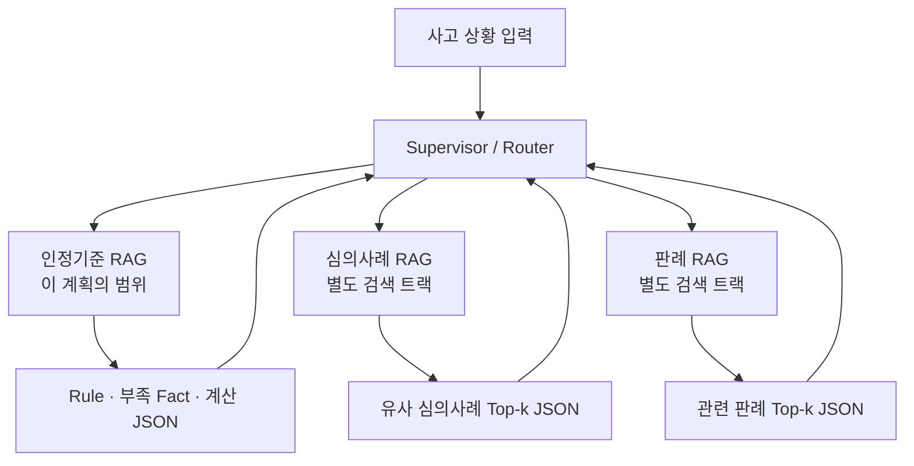
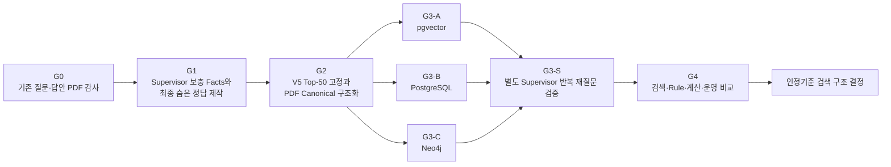
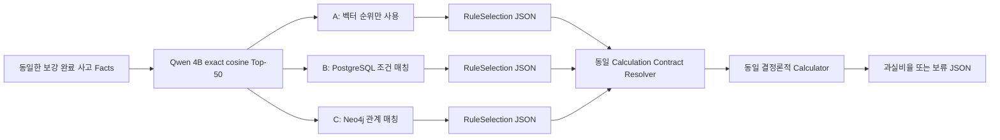
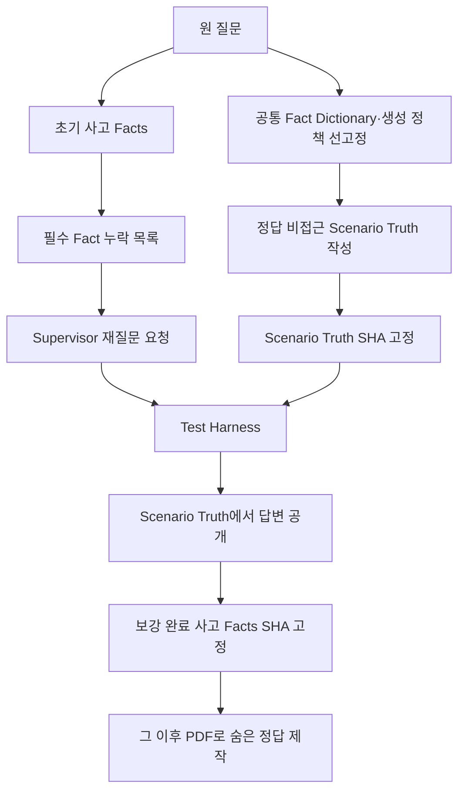
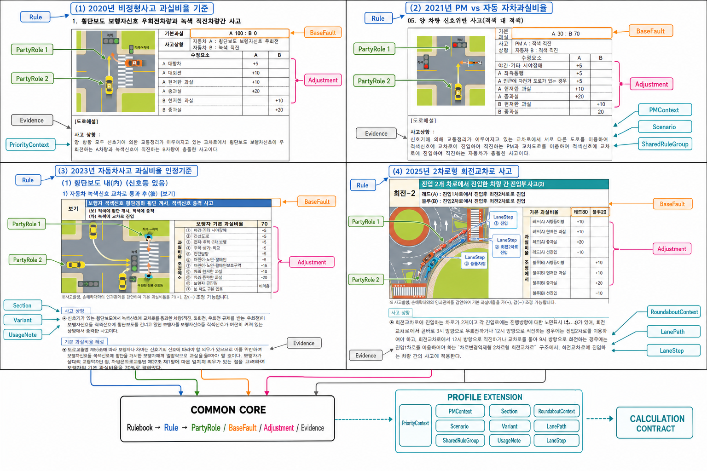
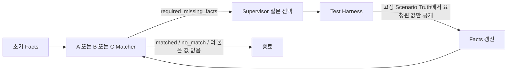

# 인정기준 pgvector · PostgreSQL · Neo4j A/B/C 실험 실행계획

> **2026-07-20 변경:** FULL-50 수치 비교의 최신 실행계획은
> `etl/fault_cases/NEW_ABC_TEST_V6/FULL_50_ABC_실험계획.md`다.
> 이 문서는 이전 Gate 설계와 근거 보존용이며, V6와 충돌할 경우 V6 계획을 따른다.

> 문서 상태: `validated_ready_for_g0_implementation`  
> 실험 버전: V5  
> 기준일: 2026-07-20  
> 적용 경로: `etl/fault_cases` 내부  
> 목적: 정답 검증부터 시작해 A/B/C를 동일 조건으로 비교하고, Neo4j 도입 여부를 근거로 결정한다.

---

## 한눈에 보는 계획

### 이 실험을 왜 하는가

이 실험의 최종 목적은 **사용자가 설명한 사고와 가장 잘 맞는 자동차사고 과실비율 인정기준 Rule을 어떤 검색 구조가 가장 정확하고 안전하게 찾는지 확인하는 것**이다.

비교 대상은 다음 세 가지다.

| 실험 | Rule을 찾는 방법 | 확인하려는 내용 |
|---|---|---|
| A | Qwen pgvector Top-1 | 의미검색만으로 맞는 인정기준을 얼마나 찾는가 |
| B | Qwen Top-50 + PostgreSQL 조건 매칭 | 구조화 필드와 조인으로 Rule 선택이 개선되는가 |
| C | Qwen Top-50 + Neo4j 관계 매칭 | 당사자·공통조건·차로 경로 관계로 Rule 선택과 추적이 개선되는가 |

A/B/C는 같은 사고 입력과 같은 Top-50 후보를 사용한다. 차이는 후보 Rule을 선택하는 방식뿐이며, 선택 이후 숫자 계산은 모두 같은 결정론적 Calculator가 수행한다.

이 실험은 LLM이 과실비율을 판단하도록 만드는 작업이 아니다. PDF 근거가 있는 Rule을 찾고, 필요한 사고 사실이 충분할 때만 PDF의 기본비율과 수정요소를 기계적으로 계산하는 구조를 검증한다.

### 전체 시스템에서 인정기준 RAG의 위치

인정기준 검색은 전체 사고 서비스가 사용할 수 있는 여러 RAG 중 하나다.



따라서 이 계획의 A/B/C 결과는 **인정기준 RAG 내부 검색 방식 비교 결과**다. 판례·심의사례 검색 성능이나 전체 서비스의 법률적 판단 정확도로 해석하지 않는다.

### 어떤 순서로 진행하는가



| 단계 | 먼저 해결할 질문 | 핵심 산출물 | 사용자 보고 후 다음 단계 |
|---|---|---|---|
| G0 | 기존 50문항 답안의 Rule·비율이 PDF와 맞는가 | PDF 증거 감사표 | 예 |
| G1 | 정답과 독립된 Scenario Truth에서 Supervisor 답변을 받았다면 최종 상황과 정답은 무엇인가 | Scenario Truth SHA, 보강 Facts, 재질문 trace, 숨은 정답·해설 | 예 |
| G2 | 동일 후보와 PDF 조건을 PostgreSQL·Neo4j가 같은 의미로 읽는가 | Top-50 SHA, Canonical 원장, Projection parity | 예 |
| G3-A | 의미검색만으로 어떤 Rule과 비율이 나오는가 | A RuleSelection·계산 JSON | 단계 결과 보고 |
| G3-B | PostgreSQL 조건 매칭 결과는 무엇인가 | B RuleSelection·계산 JSON | 단계 결과 보고 |
| G3-C | Neo4j 관계 매칭 결과는 무엇인가 | C RuleSelection·계산 JSON | 단계 결과 보고 |
| G3-S | 실제 Runtime처럼 누락 Fact를 재질문하면 안전하게 종료되는가 | 방법별 재질문 trace·회차·보류 결과 | G3 본실험과 분리 보고 |
| G4 | 어느 방식이 인정기준을 가장 잘 찾으며 운영 가치가 있는가 | 최종 비교 보고서 | 최종 결정 |

### 입력과 정답의 핵심 관계

기존 질문지는 버리지 않는다. Supervisor 재질문·답변은 기존 질문을 대체하지 않고 부족한 사실만 보충한다.

```text
기존 질문의 사고 설명
+ 정답과 독립적으로 먼저 고정한 Scenario Truth
+ Supervisor 재질문 시 Scenario Truth에서 공개된 사고 사실 답변
= A/B/C가 공통으로 사용할 보강 완료 accident_facts.jsonl
```

정답 파일은 Runtime 입력과 분리한다.

```text
보강 완료 사고 Facts를 PDF와 다시 대조
= verified_outcomes.jsonl
  (허용 Rule, 당사자 A/B 매핑, 기본비율, 수정요소, 계산 과정, 최종비율, PDF 근거)
```

### 이 계획의 완료 기준

다음을 모두 만족해야 완료다.

1. 50문항의 보강 Facts와 숨은 정답이 PDF 근거로 검증됨
2. A/B/C가 같은 입력·같은 Top-50·같은 Calculator를 사용함
3. 검색 회수율, Rule 선택, 올바른 보류, 계산 정확도를 분리해 측정함
4. B/C가 같은 Canonical 의미를 실행하고 parity를 만족함
5. Neo4j를 정확도뿐 아니라 관계 경로·순서·근거 추적·속도·운영 비용으로 판단함
6. 각 Gate 결과를 사용자에게 보고하고 승인 후 다음 단계로 진행함

### 비교 가능성 계약 — 반드시 지킬 평가 분모와 무효화 규칙

아래 계약을 모두 만족하지 않는 실행은 **A/B/C 성능 비교가 아니라 구현 점검(run check)** 으로만 기록한다. Neo4j·PostgreSQL·임베딩 모델의 우열 결론에 사용하지 않는다.

| 비교 지표 | A의 측정 | B/C의 측정 | 공통 분모·판정 |
|---|---|---|---|
| 후보 회수 | Top-1 / Top-10 / Top-50 Recall | 동일 Qwen Top-50을 입력으로 사용 | `has_exact_rule`이며 PDF 검증된 Case만 분모 |
| Rule 선택 | Top-1 Rule exact match | Top-50 안에서 Canonical 조건을 통과한 유일 Rule exact match | **Top-50에 정답 Rule이 존재하는 Case**만 분모. A의 Top-1과 B/C의 구조 선택값을 같은 단일 정확도라고 합산·우열화하지 않음 |
| 보류 안전성 | A는 `retrieved_only`로 보류 | B/C는 `requires_fact`/`ambiguous_rule`/`no_match` 반환 | PDF 정답이 `requires_fact` 또는 `no_match`인 Case만 분모 |
| 최종비율 | A가 승인된 RuleSelection·Party mapping을 만들지 못하면 `not_calculable` | B/C는 맞는 Rule·Party mapping·Variant·Adjustment가 모두 확정된 경우만 계산 | 전체 PDF 검증 Case 기준 end-to-end exact ratio와, 맞는 Rule 뒤 계산한 conditional ratio를 **분리 표기** |

1. `A Top-1 정확도`와 `B/C Top-50 구조선택 정확도`는 **다른 작업**이므로 같은 열에 놓더라도 직접적인 승패 수치로 해석하지 않는다.
2. B/C의 Rule 선택 정확도 분모는 `Top-50에 PDF 정답 Rule이 있는 Case`로 고정한다. 후보 밖 정답은 구조 매칭 실패가 아니라 검색 회수 실패로 분리한다.
3. B/C가 같은 Canonical 원장·Facts·3값 조건 규칙을 쓰면 정확도가 같은 것이 정상이다. 이 parity는 구현 일치 검증이며 Neo4j 효과 없음의 근거가 아니다.
4. B/C의 정확도 차이를 측정하려면 저장소가 아니라 **서로 다른 승인 Canonical 의미**가 필요하다. 이 경우에는 입력 Facts·정답·후보를 동일하게 두고, 어떤 관계 조건이 추가됐는지 PDF Evidence와 함께 별도 실험 버전으로 고정한다.
5. `pending/unmodeled` Rule, 미승인 Party mapping, 미승인 Variant·Adjustment·LaneStep가 영향을 주는 Case가 하나라도 있으면 해당 Case는 Rule·비율 정확도 분모에서 제외하고 `evaluation_not_ready`로 기록한다. 임의 기본비율 계산이나 오확정은 금지한다.
6. 위 계약을 위반한 실행(2026-07-20 `NEW_ABC_TEST`의 초기 G4 수치 포함)은 **비교 무효**다. 후보 적재·B/C projection parity·재현성 점검 결과만 보존하고, 성능 수치와 Neo4j 도입 판단에는 사용하지 않는다.

---

## 0. 이 문서의 효력과 이전 결과 처리

이 문서는 이전 계획을 대체하는 V5 실행계획이다.

V1~V4에서 생성한 Matcher, Canonical Ledger, PostgreSQL/Neo4j Projection, Calculator 결과와 정확도 보고서는 다음 목적으로만 보존한다.

- 실패 원인 확인
- 코드 회귀 테스트 참고
- V5에서 같은 문제가 반복되는지 비교

다음 용도로는 사용하지 않는다.

- A/B/C 성능 결론
- 정답지 근거
- Neo4j 도입 근거
- V5 Canonical 조건의 자동 승인 근거

V1~V4 산출물 manifest에는 `evaluation_status: invalid_for_evaluation` 또는 `reference_only`를 기록한다. V5 Runtime이 V1~V4의 qrels, RuleMatch, 계산 결과를 입력으로 읽으면 즉시 실패해야 한다.

### 선행 금지 규칙

1. G0 답안 증거 감사가 통과되기 전에는 Matcher·Calculator 정확도를 보고하지 않는다.
2. G1 입력 계약이 통과되기 전에는 V5 후보를 생성하지 않는다.
3. G2 Canonical Gate가 통과되기 전에는 B/C 본실험을 실행하지 않는다.
4. B/C parity가 통과되기 전에는 최종 성능 수치를 결론으로 사용하지 않는다.
5. 실패한 Gate를 이후 단계의 코드나 숫자로 덮지 않는다.

---

## 1. 변경 불가 원칙

### 1.1 실제 서비스의 인정기준 Runtime 모듈 역할

이 문서에서 `Runtime`은 계획서 작성이나 평가 데이터 제작 시점이 아니라, **실제 서비스에서 사용자 사고 입력을 처리하는 실행 시점**을 뜻한다. `인정기준 Runtime 모듈`은 Supervisor가 호출하는 인정기준 RAG 처리 구성요소다.

Codex가 사전에 PDF를 검수하고 평가 정답·한글 해설을 제작하는 작업은 Runtime 작업이 아니다.

실제 서비스의 인정기준 Runtime 모듈은 법률적 판단이나 새 자연어 해설을 생성하지 않는다. 명시 조건 비교, 부족 Fact 반환, 승인된 수치의 결정론적 계산만 수행한다.

허용되는 작업은 다음뿐이다.

- 입력된 사고 사실을 스키마로 전달
- 명시 조건을 기계적으로 비교
- 부족한 사실 키를 반환
- 승인된 숫자를 결정론적으로 계산
- 결과 JSON을 그대로 반환

금지되는 작업은 다음과 같다.

- LLM이 적절한 Rule을 추론
- LLM이 수정요소 적용 여부를 판단
- LLM이 과실비율을 생성하거나 보정
- 결과가 이상해 보인다는 이유로 숫자를 변경
- 사용자에게 법률적 판단이나 새 해설을 생성

Supervisor는 `required_missing_facts`를 받아 재질문할 수 있다. Matcher와 Calculator는 필요한 사실 키를 기계적 JSON으로 반환한다. 사용자에게 보여줄 재질문 문장은 Supervisor가 Fact Dictionary의 승인된 한글 문구를 사용한다.

Runtime이 반환하는 `calculation_steps`는 새 판단이나 해설이 아니라 승인된 BaseFault와 Adjustment를 어떤 순서로 산술했는지 기록한 기계적 trace다. 평가 정답지의 `explanation_ko`는 사전 PDF 감사용 해설이며 Runtime 모듈이 생성하지 않는다.

### 1.2 검색·관계 가중치 금지

사용하지 않는 것:

- 검색 가중치
- 관계 가중치
- 임의 점수 합산
- reranker
- 벡터 순위로 B/C 동률 해소
- 정답 Rule 우선순위

PDF 수정요소의 `+5`, `-10`, `+20`은 검색 가중치가 아니다. 선택된 Rule의 최종 과실비율을 계산하기 위한 PDF 공식 숫자이며, PDF 근거가 승인된 경우에만 Calculator가 적용한다.

### 1.3 동일 조건 원칙

A/B/C는 다음을 공유한다.

- 같은 50 Case
- 같은 보강 완료 Facts
- 같은 Qwen 모델·Rule 임베딩
- 같은 Top-50 후보 파일과 SHA-256
- 같은 Canonical 원장 버전
- 같은 결과 JSON Schema
- 같은 Calculation Contract Resolver
- 같은 Calculator

A/B/C의 차이는 **Top-50에서 Rule을 선택하는 방법**뿐이다.

---

## 2. 실험 질문과 비교 구조

이 실험은 다음 질문을 분리해서 측정한다.

1. Qwen 임베딩이 관련 Rule을 Top-k 안에 가져오는가?
2. 구조 조건이 Top-50 후보 중 적용 가능한 Rule을 안전하게 선택하는가?
3. 같은 Canonical 의미를 PostgreSQL과 Neo4j가 동일하게 실행하는가?
4. 선택된 Rule의 PDF 숫자를 Calculator가 정확히 계산하는가?
5. Neo4j가 PostgreSQL 대비 관계 경로·순서·추적·유지보수에서 실질적 이점을 주는가?



### 2.1 A의 정확한 의미

A는 pgvector 검색만으로 Rule을 선택하는 기준선이다.

- Top-1 후보를 기계적으로 선택한다.
- 구조 조건으로 후보 순위를 바꾸지 않는다.
- Rule이 계산 불가능하면 숫자를 만들지 않고 보류한다.
- 검색 회수율과 end-to-end 결과를 모두 기록한다.

A가 선택한 Rule 내부의 Variant·Adjustment를 숫자 계약으로 바꾸는 작업은 A/B/C 공통 Resolver가 수행한다. 이 Resolver는 명시 Facts와 PDF 승인 조건의 hard match만 수행하며 후보 Rule 순위를 변경하지 않는다.

### 2.2 B의 정확한 의미

B는 같은 Top-50을 PostgreSQL Canonical 테이블과 조인해 필수 조건을 비교한다.

- SQL hard equality 또는 승인된 연산자만 사용한다.
- 점수·가중치·유사도 재계산을 하지 않는다.
- `unknown` 조건이 남으면 Rule을 확정하지 않는다.

### 2.3 C의 정확한 의미

C는 같은 Top-50을 Neo4j Canonical Projection과 비교한다.

- B와 동일한 조건 의미를 Cypher로 실행한다.
- Party·Variant·SharedRuleGroup·LanePath·LaneStep 관계를 따라간다.
- 그래프 점수·가중치를 사용하지 않는다.
- 관계 경로를 진단 trace로 반환한다.

### 2.4 정확도가 같을 수 있다는 원칙

B와 C는 같은 Canonical 원장을 실행하므로 정확도가 같을 수 있고, 정상적인 기대값은 결정 parity 100%이다. Neo4j의 가치는 정확도가 자동으로 상승한다는 가정이 아니라 다음 항목으로 판단한다.

- 2025 LaneStep 순서 표현
- 2021 SharedRuleGroup 재사용
- Rule에서 PDF Evidence까지 경로 추적
- 조건 변경 시 수정 범위
- 진단 trace의 완전성
- p50/p95 latency와 운영 복잡도

### 2.5 B/C의 pgvector 결합 방식 — 가중치 없는 순차 후처리

B와 C는 pgvector와 구조 점수를 병렬 계산해 합치는 방식이 아니다. 다음 순서로 실행한다.

```text
1. pgvector exact cosine으로 Top-50 후보 생성
2. 후보 파일과 순위·cosine을 고정
3. B는 PostgreSQL, C는 Neo4j로 각 후보의 명시 조건을 hard match
4. MISMATCH 후보 제거, UNKNOWN 후보는 미확정으로 유지
5. 하나의 Rule 또는 승인된 동등 Rule 집합이 남을 때만 Calculator 계약 생성
```

다음과 같은 점수 합산은 본실험에서 금지한다.

```text
cosine × 0.6 + PostgreSQL 조건점수 × 0.4
cosine × 0.5 + Neo4j 관계점수 × 0.5
```

이유:

- 0.6·0.4 같은 값은 PDF 근거가 없음
- 구조상 틀린 Rule이 높은 cosine으로 다시 살아날 수 있음
- 가중치 튜닝 과정에서 평가 정답 누출 위험이 생김
- 결과 차이가 DB 구조 때문인지 가중치 때문인지 구분할 수 없음
- 결정론적 조건 매칭이라는 실험 질문이 흐려짐

cosine은 후보 생성과 A의 Top-1 선택에만 사용한다. B/C의 최종 Rule 선택, 동률 해소, Calculator에는 사용하지 않는다.

B와 C는 평가 시간을 줄이기 위해 기술적으로 병렬 실행할 수 있지만 결과를 합산·투표·병합하지 않는다. 각각 독립 결과를 만들고 G4에서 비교한다.

---

## 3. 현재 데이터 기준선

V5 시작 전 확인된 현재 자료는 다음과 같다. 이 숫자는 V5 정답으로 사용하지 않고 범위 확인에만 사용한다.

| 항목 | 현재 확인값 |
|---|---:|
| 공통 질문 | 50 Case |
| 기존 qrels | 111행 |
| exact Rule이 있는 질문 | 39 Case |
| exact Rule이 없는 질문 | 11 Case |
| exact Rule이 2개인 질문 | 3 Case (`q06`, `q32`, `q44`) |
| 관련 Rule이 복수인 질문 | 12 Case |
| Qwen Rule 단위 검색 문서 | 277건 |
| 기존 V1 Top-50 후보 항목 | 2,500건 |
| 기존 V1 Top-50 중복 제거 Rule | 238건 |

V5에서는 G1 보강 Facts를 결정론적으로 직렬화한 검색 입력으로 Top-50을 다시 생성한다. 따라서 V5 후보 Rule 합집합 수는 다시 계산하고 manifest로 고정한다.

### 3.1 기존 Supervisor·정답 파일의 현재 상태

이전 작업에서 다음 V3/V4 파일이 생성돼 있다.

| 기존 파일 | 확인된 내용 | V5 사용 정책 |
|---|---|---|
| `v3/supervisor_supplement_requests_v3.jsonl` | 50 Case 재질문 요청 | 질문 후보 참고만 허용 |
| `v3/simulated_supervisor_responses_v3.jsonl` | 50 Case, 370개 응답, unknown/미확정 64개 | 응답 seed 참고만 허용 |
| `v3/completed_accident_facts_v3.jsonl` | 기존 질문+시뮬레이션 응답 결합 50 Case | V5 Facts로 직접 사용 금지 |
| `v4/completed_accident_facts_v4.jsonl` | V3 Facts의 추가 필드 보강 | V5 Facts로 직접 사용 금지 |
| `v3/calculation_answer_key_v3_simulated_source_verified.jsonl` | 50 Case 중 최종비율 20건, null 30건 | V5 정답 사용 금지 |

기존 V3 정답 manifest는 `invalid_for_abc_comparison: true`, `not_a_production_answer_key: true`다. 또한 기존 계산 정답은 Adjustment ID만 있고 적용 조건·대상·delta·단계별 계산·한글 해설이 한 파일에 완전하게 모여 있지 않다.

추가 품질 검사에서 다음도 확인됐다.

- V3 Supervisor 응답 중 `answer_state=confirmed`이면서 값이 `unknown`인 항목 64개
- V3 completed Facts 50건의 `source_query_sha256`가 모두 null
- V3/V4 파일의 Case ID 집합은 기존 질문 50건과 일치하지만 provenance 계약은 V5 기준 미통과

V5에서는 `unknown` 값을 가진 응답의 상태를 `unknown`으로 기록하며 `confirmed`와 함께 사용하지 않는다. 모든 완성 Facts는 원 질문 파일 SHA와 Case별 source query hash를 필수로 가진다.

따라서 V5는 기존 파일을 이름만 바꾸지 않는다. 원 질문부터 PDF까지 다시 감사하고 다음을 새로 생성한다.

- 기존 질문과 보충 응답이 함께 있는 Runtime Facts
- `value_code`와 `value_label_ko`가 함께 있는 Supervisor trace
- 보강 Facts 고정 후 PDF로 다시 검증한 숨은 Outcome
- 기본비율·수정요소·계산 단계·최종비율·한글 해설이 함께 있는 정답지

---

## 4. 원본 자료와 DB 안전 범위

### 4.1 읽기 전용 원본

아래 PDF는 원본 증거이며 수정하지 않는다.

1. `artifacts/fault_standard_output/crawled/raw_source_files/210107_2020년_비정형사고_과실비율_기준.pdf`
2. `artifacts/fault_standard_output/crawled/raw_source_files/!!210624_PM대자동차사고과실비율비정형기준_송부(2021).pdf`
3. `artifacts/fault_standard_output/crawled/raw_source_files/230630_자동차사고_과실비율_인정기준_최종.pdf`
4. `artifacts/fault_standard_output/crawled/raw_source_files/250624_2차로형_회전교차로사고_과실비율_비정형기준.pdf`

질문지와 기존 qrels도 원본 입력으로 보존한다.

- 질문지: `evaluation/common/embedding_ab/v1/common_fault_queries_v1.jsonl`
- 기존 qrels: `evaluation/fault_standard/embedding_ab/v1/ground_truth/fault_standard_qrels_v1.2.jsonl`

### 4.2 DB 분리

| 대상 | 주소 | 정책 |
|---|---|---|
| 기존 PostgreSQL | `localhost:5432` | 읽기 전용 |
| 기존 Neo4j | `bolt://localhost:7687` | 읽기 전용·이번 실험에서는 쓰지 않음 |
| Lab PostgreSQL | `localhost:55432`, DB `fault_standard_lab` | V5 쓰기 허용 |
| Lab Neo4j | `bolt://localhost:17687` | V5 쓰기 허용 |

Lab 인프라 경로:

- `src/embedding_ab_shared/track_c_fault_standard_rule_matching/infra/docker-compose.yml`
- `src/embedding_ab_shared/track_c_fault_standard_rule_matching/infra/.env`
- 예시 환경파일: `infra/.env.example`

실제 비밀번호는 계획서·manifest·로그에 기록하지 않는다.

### 4.3 안전 검증

모든 쓰기 명령 전에 `assert_safe_for_write`를 실행한다.

필수 조건:

- `ABC_LAB_ENVIRONMENT == ABC_LAB`
- PostgreSQL port `55432`
- PostgreSQL database `fault_standard_lab`
- Neo4j URI `bolt://localhost:17687`
- 원본 PostgreSQL과 Lab의 port/database가 다름

원본 PostgreSQL 복제는 `pg_dump`로 읽기만 수행한다. 복제 전후 원본 핵심 테이블 건수와 schema checksum을 기록하고 달라지면 즉시 중단한다.

### 4.4 임베딩 저장과 검색 방식

- 모델: 실험에서 확정한 Qwen 4B 임베딩
- Rule 문서 수: 277
- 차원: 2,560
- V5 본실험: float32 exact cosine
- 후보 수: Top-50
- 검색 반복 시 같은 입력·벡터·정렬 규칙 사용

일반 `vector(2560)`은 pgvector HNSW의 일반 vector 2,000차원 인덱스 한도를 넘는다. 따라서 본실험에서 HNSW를 사용하지 않는다. `halfvec(2560) HNSW`는 정확도 실험과 섞지 않고 별도 성능 실험으로 분리한다. 기술 근거는 [pgvector 공식 HNSW 문서](https://github.com/pgvector/pgvector#hnsw)의 지원 차원(`vector` 2,000, `halfvec` 4,000)을 따른다.

기존 `vector(1024)` 컬럼은 Lab에서 삭제하지 않고 사용하지 않는다. Qwen 벡터는 V5 전용 테이블에 저장한다.

### 4.5 최종 계획 검증 시점의 Lab 준비 상태

2026-07-20 최종 검증 기준:

- `infra/.env` 존재
- Lab 대상 값은 PostgreSQL `55432/fault_standard_lab`, Neo4j `bolt://localhost:17687`
- source PostgreSQL은 `5432/fault_standard_db`로 Lab과 분리됨
- 안전 대상 값 검사 통과
- Docker Desktop daemon은 현재 실행되지 않음

Docker 미실행은 G0/G1의 파일·PDF 감사에는 영향을 주지 않는다. G2의 Lab 적재 전에만 필요하며, G1 승인 보고 후 사용자에게 Docker Desktop 시작을 요청한다. 사용자 승인 없이 Docker volume 삭제·초기화·재생성은 하지 않는다.

---

## 5. Gate 운영 원칙

각 Gate는 다음 네 상태 중 하나를 갖는다.

- `not_started`
- `in_progress`
- `passed`
- `failed`

각 Gate 완료 시 생성하는 manifest 공통 필드:

```json
{
  "experiment_version": "v5",
  "gate_id": "G0",
  "status": "passed | failed",
  "input_files": [{"path": "...", "sha256": "..."}],
  "output_files": [{"path": "...", "sha256": "..."}],
  "code_sha256": "...",
  "started_at": "...",
  "finished_at": "...",
  "validation_summary": {},
  "blocking_issues": []
}
```

Gate가 실패하면 다음 Gate를 실행하지 않는다. 사용자에게 결과·실패 Case·수정 사항을 보고하고 승인을 기다린다.

### 5.1 각 Gate 내부 실행 순서

V5 코드·폴더는 아직 생성되지 않았으므로 `ready_for_g0`는 G0 결과가 이미 준비됐다는 뜻이 아니다. **G0 구현을 시작할 준비가 됐다는 뜻**이다.

모든 Gate는 아래 순서를 따른다.

1. `IMPLEMENT` — 해당 Gate의 Schema·코드·테스트 작성
2. `DRY_RUN` — 소량 fixture로 경로·누출·안전 검사
3. `EXECUTE` — 승인된 전체 입력 실행
4. `VALIDATE` — 행 수·키·SHA·도메인 규칙·재현성 검사
5. `REPORT` — 산출물·실패 목록·다음 작업 보고
6. `WAIT_FOR_APPROVAL` — 사용자 승인 전 다음 Gate 금지

구현되지 않은 CLI 대신 수동으로 결과 JSONL만 작성해 Gate를 통과시키지 않는다. 반대로 코드 구현만 완료하고 전체 데이터 검증 없이 Gate를 통과시켜도 안 된다.

---

## 6. G0 — 50문항 답안 증거 감사

### 6.1 목표

기존 qrels를 정답으로 믿고 시작하지 않는다. 50문항 모두에 대해 질문·기존 답안·PDF 표·PDF 해설을 직접 대조해 V5 평가 정답을 확정한다.

이 작업은 Codex가 수행하고 사용자는 50건을 직접 채우지 않는다. 사용자는 감사 결과 요약과 충돌 Case를 보고 승인한다.

### 6.2 감사 순서

1. 네 PDF의 SHA-256, 파일 크기, PDF 총 페이지를 고정한다.
2. 질문 50건의 원문과 기존 qrels 행을 Case별로 묶는다.
3. PDF 텍스트 검색은 위치 탐색에만 사용한다.
4. 해당 PDF 페이지를 렌더링해 표·그림·해설을 육안으로 확인한다.
5. Rule, Party mapping, BaseFault, Variant, Adjustment를 확인한다.
6. 기본비율에서 최종비율까지 산술을 다시 계산한다.
7. 같은 사고를 직접 나타내는 Rule이 여러 개면 모두 기록한다.
8. 기존 답안과 다르면 기존 값과 수정 값을 함께 기록한다.

### 6.3 감사 행 Schema

```json
{
  "case_id": "fault_common_q01",
  "question_text": "...",
  "audit_resolution": "confirmed | corrected | unresolved",
  "initial_expected_status": "matched | requires_fact | no_match",
  "acceptable_rule_ids": ["..."],
  "claimed_outcomes": [],
  "verified_outcomes": [
    {
      "rule_id": "...",
      "rulebook_id": "...",
      "user_party_key": "A",
      "opponent_party_key": "B",
      "party_mapping": {"user": "A", "opponent": "B"},
      "variant_id": null,
      "base_ratio_by_pdf_party": {"A": 0, "B": 100},
      "base_ratio": {"user": 0, "opponent": 100},
      "applied_adjustments": [],
      "calculation_steps": [],
      "final_ratio": {"user": 0, "opponent": 100},
      "explanation_ko": "PDF의 A는 사용자, B는 상대방이다. 기본 A0:B100이며 적용 수정요소가 없어 사용자 0, 상대방 100이다.",
      "source_evidence_ids": ["..."]
    }
  ],
  "required_missing_facts": [],
  "evidence": [
    {
      "source_file": "...pdf",
      "pdf_page_number_1based": 1,
      "printed_page_label": null,
      "table_or_block": "...",
      "evidence_role": "rule_table | explanation | adjustment",
      "visual_reviewed": true
    }
  ],
  "audit_note": "..."
}
```

`acceptable_rule_ids`와 `verified_outcomes`는 복수 값을 지원한다. q06·q32·q44처럼 복수 exact Rule이 허용되는 Case를 단일 `verified_rule_id`로 축소하지 않는다. `acceptable_rule_ids`는 `verified_outcomes[].rule_id`에서 파생하며 두 집합이 다르면 검증 실패다.

### 6.3.1 A/B 당사자 매핑 정의

`A`와 `B`는 사용자·상대방의 고정 명칭이 아니라 각 PDF 도표에서 정의한 당사자 역할이다.

| 필드 | 의미 |
|---|---|
| `user_party_key: A` | 사용자가 PDF 도표의 A 역할 |
| `user_party_key: B` | 사용자가 PDF 도표의 B 역할 |
| `opponent_party_key: A` | 상대방이 PDF 도표의 A 역할 |
| `opponent_party_key: B` | 상대방이 PDF 도표의 B 역할 |

예를 들어 다음은 **상대방이 A이고 사용자가 B**라는 뜻이다.

```json
{
  "user_party_key": "B",
  "opponent_party_key": "A"
}
```

`opponent_party_key: A`를 사용자가 A라는 뜻으로 해석하면 안 된다. Validator는 두 당사자가 같은 PDF party key를 갖는 오류와 사용자/상대 비율 변환 오류를 검사한다.

### 6.3.2 정답 해설과 계산 과정

수학 문제의 답과 해설을 분리하듯, 평가 정답에는 최종비율만 저장하지 않는다. 모든 계산 가능 Outcome은 다음 내용을 함께 가져야 한다.

- PDF의 A/B가 사용자·상대 중 누구인지
- 기본 과실비율과 근거 표
- 선택된 Variant와 선택 조건
- 적용된 Adjustment ID
- Adjustment의 한글 조건
- 조건과 일치한 사고 Fact key
- 가산·감산 대상 party와 delta
- 각 단계 후 A/B 비율
- 사용자/상대 최종비율
- PDF file/page/block
- 사람이 검수할 수 있는 `explanation_ko`

예시:

```json
{
  "user_party_key": "B",
  "opponent_party_key": "A",
  "base_ratio_by_pdf_party": {"A": 20, "B": 80},
  "applied_adjustments": [
    {
      "adjustment_id": "adj_official_2023_차16-3_012",
      "condition_ko": "신호기 없는 T자형 교차로에서 소로 차량 B가 좌회전",
      "matched_fact_keys": [
        "environment.intersection_type",
        "user.road_priority",
        "user.movement"
      ],
      "target_party_key": "B",
      "delta": 10,
      "source_evidence_id": "evidence_..."
    }
  ],
  "calculation_steps": [
    {"step": 1, "operation": "base_fault", "ratio_after": {"A": 20, "B": 80}},
    {"step": 2, "operation": "adjustment", "target": "B", "delta": 10, "ratio_after": {"A": 10, "B": 90}}
  ],
  "final_ratio": {"user": 90, "opponent": 10},
  "explanation_ko": "사용자는 PDF의 B이다. 기본 A20:B80에서 B의 T자형 교차로 소로 좌회전 +10을 적용해 A10:B90이므로 사용자 90, 상대방 10이다."
}
```

`explanation_ko`는 사전 정답 감사자가 작성·확인하는 해설이다. 실제 서비스의 인정기준 Runtime 모듈이 새로 생성하는 자연어 판단이 아니다.

### 6.4 상태 규칙

| 상태 | 의미 | 숫자 허용 |
|---|---|---|
| `matched` | 하나 이상의 PDF 검증 Outcome이 있고 필요한 사실이 충분함 | 예 |
| `requires_fact` | 관련 Rule은 있으나 Variant·Party·Adjustment 확정 사실이 부족함 | 아니오 |
| `no_match` | PDF 코퍼스에 적용 가능한 exact Rule이 없음 | 아니오 |

`audit_resolution`은 답안 감사 상태이고 `initial_expected_status`는 **Supervisor 보강 전 원 질문**에서 Runtime이 내야 할 결과다. 둘을 혼합하지 않는다.

- 기존 답안만 틀렸고 다른 Rule이 맞으면 `corrected + matched`
- PDF에도 맞는 Rule이 없으면 `confirmed/corrected + no_match`
- 근거 충돌을 해결하지 못하면 `unresolved`이며 G0 미통과

G0의 `initial_expected_status=requires_fact`는 최종 평가 상태가 아니다. G1에서 Supervisor 응답이 추가된 뒤 같은 PDF Evidence를 다시 대조해 `post_clarification_expected_status`와 최종 숨은 Outcome을 확정한다.

### 6.5 산술 검증

모든 계산 가능 Outcome에 대해 다음을 확인한다.

- BaseFault의 사용자/상대 합이 100
- Party mapping 방향
- Variant가 기본비율을 교체하는지 여부
- Adjustment의 대상 Party와 부호
- 적용 Adjustment ID와 PDF 행의 일치
- Adjustment 조건과 `matched_fact_keys`의 실제 Facts 일치
- `calculation_steps`의 단계별 비율 일치
- Final ratio 합이 100
- A/B 비율을 사용자/상대 비율로 바꾼 결과 일치
- PDF가 허용하지 않은 임의 clamp 없음

### 6.6 G0 산출물

```text
evaluation/fault_standard/rule_matching_abc/v5/00_audit/
├─ answer_evidence_audit.jsonl
├─ answer_evidence_audit_summary.json
├─ answer_explanations_ko.md
├─ source_pdf_manifest.json
├─ disagreement_cases.jsonl
└─ g0_manifest.json
```

### 6.7 G0 통과 조건

1. 50/50 Case 감사 행 존재
2. `audit_resolution=unresolved` 0건
3. 모든 `matched` Outcome에 PDF Evidence 존재
4. 모든 계산 가능 Outcome에 산술 검증 통과
5. 모든 계산 가능 Outcome에 `calculation_steps`, `explanation_ko`, Evidence 존재
6. A/B와 사용자/상대 매핑 검증 통과
7. 복수 exact Rule을 배열로 보존
8. `requires_fact`와 `no_match`에는 최종 숫자 없음
9. 질문·기존 qrels·PDF·감사표 SHA 고정
10. 사용자 보고와 승인 완료

---

## 7. G1 — Runtime Facts와 숨은 정답 분리

### 7.1 목표

Supervisor가 필요한 재질문을 했고 응답을 받았다고 가정한 평가 입력을 만든다. Runtime에는 사고 사실만 전달하고 Rule·Variant·Adjustment·비율 정답은 전달하지 않는다.

기존 질문지는 계속 사용한다. Supervisor 응답 파일만 단독으로 검색 입력에 사용하지 않는다. 기존 질문에서 확인된 신호·진행방향·도로상황과 Supervisor가 보충한 사실을 합쳐 `accident_facts.jsonl`을 만든다.

### 7.2 입력 생성 흐름



### 7.3 책임 분리

- Codex는 정답과 분리된 Scenario Truth와 생성 정책을 먼저 작성·고정한다.
- Supervisor 응답값은 Test Harness가 고정된 Scenario Truth에서만 가져온다.
- 사용자가 JSONL 50건을 직접 채우지 않는다.
- 응답은 사고 상황 사실만 포함한다.
- 정답 Outcome을 복사해 응답을 만들지 않는다.
- 질문이나 합리적 시뮬레이션으로 확정할 수 없는 값은 `unknown`이다.

### 7.3.1 재질문 생성의 정답 누출 방지

Case별 재질문을 G0의 정답 Rule·Variant·Adjustment 또는 `verified_outcomes`에서 생성하면 안 된다. 정답 Rule에 필요한 Fact만 골라 질문하면 입력 자체가 정답에 유리하게 보강되는 누출이기 때문이다.

재질문은 G0 숨은 Outcome을 읽지 않는 별도 프로세스가 다음 입력만 사용해 생성한다.

- 기존 질문의 `raw_user_text`, `query_text`, `accident_group`, `participants`
- G1 시작 전에 버전·SHA가 고정된 공통 `fact_dictionary_v1.yaml`
- `accident_group + participant types`별 공통 intake Fact 목록

같은 사고군과 참여자 유형에는 같은 필수 Fact 목록과 같은 질문 순서를 적용한다. 특정 Case의 정답 Rule을 보고 질문 키를 추가·삭제하지 않는다.

실행 분리:

```text
Process G1-SCHEMA
  읽기 허용: 기존 질문의 사고군·참여자 유형·원문, 일반 사고 Fact ontology, 고정 seed 규칙
  읽기 금지: G0 verified outcomes, qrels, PDF Rule/ratio, Case별 정답·비율
  출력: fact_dictionary, scenario_extension_policy, schema_access_log

Process G1-TRUTH
  읽기 허용: 기존 질문, fact_dictionary, scenario_extension_policy, 고정 seed
  읽기 금지: G0 verified outcomes, qrels, PDF, Rule ID, 비율
  출력: scenario_truth, scenario_truth_manifest

Process G1-INPUT
  읽기 허용: 기존 질문, fact_dictionary, scenario_truth(Test Harness 전용)
  읽기 금지: G0 verified outcomes, qrels, PDF ratio, Rule ID
  출력: initial Facts, supplement requests, supervisor trace, accident_facts

Process G1-LABEL
  Scenario Truth와 accident_facts SHA가 고정된 뒤에만 실행
  읽기 허용: 고정 accident_facts, G0 PDF evidence
  출력: 숨은 verified_outcomes와 해설
```

G1-SCHEMA, G1-TRUTH, G1-INPUT, G1-LABEL의 입력 경로 allowlist를 코드로 분리한다. 실행 로그에서 G1-SCHEMA/G1-TRUTH/G1-INPUT이 qrels·Outcome·PDF Rule/ratio 경로를 열면 Gate 실패다.

`fact_dictionary_v1.yaml`과 `scenario_extension_policy_v1.yaml`도 정답보다 먼저 고정한다. 이 두 파일의 제작 과정에서 Case별 정답을 보거나, 특정 Case만을 위한 질문 키·허용값·생성 규칙을 넣으면 label leakage로 G1을 실패시킨다.

### 7.3.2 Scenario Truth 선고정 계약

`scenario_truth.jsonl`은 Supervisor 응답의 유일한 값 출처다. 각 Fact는 다음 중 하나여야 한다.

- `explicit`: 기존 질문에 직접 명시된 값
- `synthetic_assumption`: 정답과 무관한 공통 `scenario_extension_policy_v1.yaml`과 고정 seed로 생성한 값
- `unknown`: 독립적으로 확정할 수 없는 값

`scenario_extension_policy_v1.yaml`은 Case ID·Rule ID·PDF page·비율·정답 상태를 포함하지 않는다. 같은 사고군과 참여자 유형에는 같은 생성 규칙을 적용한다. 생성 정책은 V5 숨은 정답보다 먼저 SHA를 고정한다.

Case별 `synthetic_assumption` 값은 사람이 답안에 맞게 고르지 않는다. 고정 정책·고정 seed·Case ID의 해시로 동작하는 결정론적 생성기가 허용 코드 중 값을 만들며, 같은 입력을 3회 실행했을 때 Scenario Truth SHA가 같아야 한다. 원 질문에 있는 `explicit` 값은 인용 가능한 `source_text`와 문자열 위치를 가져야 하며 synthetic 값보다 우선한다.

생성 직후에는 정답과 무관한 도메인 일관성 검사를 수행한다. 예를 들어 신호가 없는 도로에 차량 신호 값을 강제로 넣는 모순, 한 참여자에게 동시에 양립 불가능한 진행 방향을 넣는 모순, LaneStep 순서 단절, 존재하지 않는 참여자에 대한 Fact를 금지한다. 검사는 Rule 일치 여부를 보지 않으며 일반 Fact ontology의 허용 조합만 사용한다.

Scenario Truth가 고정된 뒤 결과 분포가 기대와 다르다는 이유로 Case별 값을 고치지 않는다. 평가 가능한 `matched` 사례가 지나치게 적어 결론을 낼 수 없다면 V5 결과를 `inconclusive`로 보고하고, 같은 V5를 튜닝하지 않고 새 정책·새 SHA·새 버전의 데이터셋으로 다시 설계한다.

```json
{
  "case_id": "fault_common_q01",
  "scenario_truth_version": "v5",
  "facts": [
    {
      "fact_key": "environment.entry_order",
      "value_code": "unknown",
      "value_label_ko": "확인할 수 없음",
      "truth_source": "unknown"
    }
  ],
  "source_query_sha256": "...",
  "scenario_policy_sha256": "..."
}
```

Scenario Truth를 고정한 뒤 기존 답안과 다른 Rule·비율이 나오더라도 Truth를 기존 답안에 맞게 바꾸지 않는다. 고정 Facts를 기준으로 V5 정답을 새로 만들고 기존 qrels와의 차이를 기록한다.

### 7.3.3 누출 불변성 테스트

다음 테스트를 자동 실행한다.

1. qrels와 기존 Outcome의 Rule ID·비율을 임시 shadow 파일에서 변경한다.
2. 같은 질문·Fact Dictionary·정책·seed로 G1-TRUTH와 G1-INPUT을 다시 실행한다.
3. 다음 파일의 canonical SHA가 원 실행과 완전히 같아야 한다.

```text
scenario_truth.jsonl
scenario_truth_quality_report.json
supervisor_supplement_requests.jsonl
simulated_supervisor_responses.jsonl
supervisor_trace.jsonl
accident_facts.jsonl
```

하나라도 달라지면 label leakage로 G1을 실패시킨다.

추가 hash chain:

```text
question SHA
→ fact dictionary / scenario policy SHA
→ scenario truth SHA
→ supervisor trace SHA
→ accident facts SHA
→ 그 이후 verified outcomes SHA
```

숨은 Outcome이 생성된 뒤 Scenario Truth 또는 accident Facts가 바뀌면 기존 Outcome과 이후 실험 산출물은 자동으로 `invalid_for_evaluation` 처리한다.

### 7.4 Fact provenance

각 Fact는 출처를 가진다.

```json
{
  "fact_key": "opponent_signal",
  "value_code": "red",
  "value_label_ko": "적색 신호",
  "subject": "opponent",
  "source_kind": "query_span | simulated_supervisor",
  "source_text": "상대 차량은 적색 신호에 진입했다",
  "confidence_contract": "explicit | synthetic_assumption | unknown"
}
```

`synthetic_assumption`은 실험용 가정임을 명시한다. 이 사실과 G0 Outcome이 충돌하면 Outcome에 맞춰 몰래 바꾸지 않고 `scenario_answer_conflict`로 기록해 해결한다.

기계 매칭에는 언어에 흔들리지 않는 `value_code`를 사용한다. 사람이 JSONL을 바로 검수할 수 있도록 모든 허용 코드에는 `value_label_ko`를 함께 저장한다.

Supervisor trace 예시:

```json
{
  "fact_key": "environment.entry_order",
  "question_ko": "두 차량 중 어느 차량이 먼저 진입했나요?",
  "answer_code": "simultaneous",
  "answer_label_ko": "동시 진입",
  "answer_state": "confirmed",
  "source_kind": "simulated_supervisor"
}
```

`fact_dictionary_v1.yaml`은 모든 `value_code ↔ value_label_ko` 매핑과 승인된 `question_ko`를 보유한다. 코드만 있고 한글 label이 없거나, 사전에 없는 코드는 Gate 실패다.

응답 상태 규칙:

- 값이 승인 코드이면 `answer_state=confirmed`
- 값이 `unknown` 또는 null이면 `answer_state=unknown`
- `confirmed + unknown` 조합은 금지
- 모든 simulated 값은 `confidence_contract=synthetic_assumption`
- 원 질문에 직접 있는 값만 `confidence_contract=explicit`

### 7.5 파일 분리

| 파일 | Runtime 접근 | 내용 |
|---|---|---|
| `scenario_truth.jsonl` | 금지 — Test Harness만 허용 | 정답보다 먼저 고정한 완전 사고 사실 |
| `accident_facts.jsonl` | 허용 | 사용자·상대·환경·경로 사실 |
| `supervisor_trace.jsonl` | 허용 | 누락 키·질문·사실 응답 |
| `verified_outcomes.jsonl` | 금지 | Supervisor 보강 후 다시 확정한 상태와 Outcome 배열 |

### 7.6 누출 금지

Runtime 입력에서 금지되는 필드와 값:

- `rule_id`, `rulebook_id`
- `variant_id`, `adjustment_id`
- `base_ratio`, `final_ratio`
- 정답 문서 rank 강제 힌트
- PDF 페이지 번호
- qrels relevance
- Scenario Truth의 아직 질문받지 않은 Fact

Validator는 최상위 문자열만 검색하지 않고 중첩 객체·배열·키 이름까지 재귀 검사한다. Runtime 모듈에는 `verified_outcomes.jsonl` 경로를 주입하지 않는다.

### 7.7 보강 후 정답 재확정

Supervisor 응답이 추가되면 G0의 `requires_fact` Case가 `matched`로 바뀌거나, 추가 응답으로도 확정되지 않아 계속 `requires_fact`일 수 있다. 따라서 다음 절차를 반드시 수행한다.

1. `accident_facts.jsonl`을 먼저 고정한다.
2. G0 PDF Evidence와 보강 Facts를 다시 대조한다.
3. `post_clarification_expected_status`를 `matched | requires_fact | no_match` 중 하나로 확정한다.
4. `matched`이면 복수 허용 `acceptable_rule_ids`와 `verified_outcomes`에 Rule·Party·Variant·Adjustment·계산 단계·한글 해설·기본/최종비율을 기록한다.
5. `requires_fact/no_match`이면 최종비율을 기록하지 않는다.
6. 새 Outcome이 G0 Evidence로 지지되지 않으면 `scenario_answer_conflict`로 처리하고 G1을 실패시킨다.

이 재확정은 평가 정답 제작 절차이며 Runtime에 전달되지 않는다. Supervisor 응답을 기존 답안 비율에 맞추는 작업과도 분리한다. 먼저 Facts를 고정하고, 그 다음 PDF로 Outcome을 검증한다.

### 7.8 검색 입력 직렬화

보강 Facts는 Case마다 같은 순서로 직렬화한다.

```text
원 질문 | user.<fact_key>=<value> | opponent.<fact_key>=<value> | environment.<fact_key>=<value>
```

Fact key는 사전순으로 정렬한다. `unknown`은 삭제하지 않고 명시한다. Rule ID와 비율은 포함하지 않는다.

검색 계산에는 `value_code`를 사용하고, 검수 보고서에는 `value_label_ko`를 표시한다. 원 질문의 `raw_user_text`와 `query_text`는 provenance에 보존한다.

### 7.9 G1 산출물

```text
evaluation/fault_standard/rule_matching_abc/v5/01_contract/
├─ fact_dictionary_v1.yaml
├─ scenario_extension_policy_v1.yaml
├─ scenario_truth.jsonl
├─ scenario_truth_manifest.json
├─ scenario_truth_quality_report.json
├─ initial_accident_facts.jsonl
├─ supervisor_supplement_requests.jsonl
├─ simulated_supervisor_responses.jsonl
├─ supervisor_trace.jsonl
├─ supervisor_trace_ko.md
├─ accident_facts.jsonl
├─ verified_outcomes.jsonl
├─ post_clarification_outcome_audit.jsonl
├─ post_clarification_answer_explanations_ko.md
├─ process_access_log.jsonl
├─ label_invariance_validation.json
├─ leakage_validation.json
└─ g1_manifest.json
```

### 7.10 G1 통과 조건

1. 양 파일의 Case ID 집합이 50건으로 일치
2. 각 파일 SHA를 별도로 계산하고 공통 manifest에 기록
3. `dataset_version=v5` 일치
4. Runtime 입력의 금지 필드·값 0건
5. `scenario_answer_conflict` 0건
6. `unknown`을 임의 값으로 대체한 Case 0건
7. `confirmed + unknown` 조합 0건
8. 모든 `value_code`에 승인된 `value_label_ko` 존재
9. 기존 질문 Facts와 Supervisor 보충 Facts가 함께 보존됨
10. 모든 completed Facts에 질문 파일 SHA와 Case source hash 존재
11. Scenario Truth 50/50 Case 존재 및 정답보다 먼저 SHA 고정
12. Scenario policy에 Case/Rule/PDF page/비율 필드 0건
13. G1-SCHEMA/G1-TRUTH/G1-INPUT의 qrels·Outcome·Rule/ratio 접근 0건
14. qrels/Outcome shadow 변경 전후 G1 입력 산출물 SHA 동일
15. Runtime의 미질문 Scenario Truth Fact 접근 0건
16. 50/50 Case에 `post_clarification_expected_status` 존재
17. 모든 보강 후 `matched` Outcome이 G0 PDF Evidence로 추적됨
18. 모든 보강 후 계산 가능 Outcome에 계산 단계·한글 해설 존재
19. 사용자 보고와 승인 완료
20. Fact Dictionary·Scenario policy가 Outcome보다 먼저 SHA 고정
21. Scenario Truth 결정론적 3회 생성 SHA 동일
22. explicit Fact마다 원 질문 source span 존재
23. 도메인 모순 0건 및 `explicit/synthetic_assumption/unknown` 분포 보고

---

## 8. G2 — V5 Top-50 고정과 PDF Canonical 원장

### 8.1 목표

보강 완료 Facts로 A/B/C 공통 Top-50을 만들고, 비교 대상 후보 전체를 PDF 근거로 구조화한다.

### 8.2 후보 고정

1. Qwen Rule 문서 277건의 2,560차원 벡터를 Lab V5 전용 테이블에 적재한다.
2. G1 검색 문자열 50건을 같은 모델로 임베딩한다.
3. float32 exact cosine으로 Top-50을 생성한다.
4. 동점은 `rule_id ASC`로만 안정 정렬한다. 이 정렬은 B/C 선택 기준으로 사용하지 않는다.
5. 50행·각 50후보·총 2,500항목을 검사한다.
6. 후보 파일 SHA를 고정한 뒤 A/B/C에서 재검색하지 않는다.

Canonical 범위는 다음 합집합이다.

```text
V5 Top-50에 한 번이라도 등장한 Rule
UNION
G1 최종 숨은 `verified_outcomes.jsonl`이 참조하는 Rule
```

### 8.3 조건 없는 Rule 금지

Canonical 범위의 모든 Rule은 다음 상태 중 하나를 갖는다.

- `approved`: PDF 조건 검증 완료, Runtime 실행 가능
- `pending`: 검증 대기, Runtime 실행 금지
- `unmodeled`: 필요한 PDF 조건을 구조화하지 못함, Runtime에서 보류
- `invalid`: PDF Rule 참조 자체가 잘못됨

조건이 0개인 Rule을 `MATCH`로 처리하지 않는다. `pending/unmodeled/invalid` 후보가 Case 결과에 영향을 줄 가능성이 있으면 해당 Case는 본평가 준비 미완료다.

### 8.4 Canonical 공통 구조

```text
Rulebook
└─ Rule
   ├─ PartyRole
   ├─ BaseFault
   ├─ ApplicabilityCondition
   ├─ Variant
   │  └─ VariantCondition
   ├─ Adjustment
   │  └─ AdjustmentCondition
   ├─ SharedRuleGroup
   ├─ LanePath
   │  └─ LaneStep(seq)
   └─ Evidence
```

### 8.5 승인 연산자

조건 연산자는 whitelist로 제한한다.

- `eq`
- `not_eq`
- `in`
- `contains_all`
- `ordered_path_equals`

자유로운 수식·유사도·점수 연산은 금지한다. 새 연산자가 필요하면 PDF 근거·테스트·사용자 승인을 먼저 추가한다.

### 8.6 조건 Schema

```json
{
  "condition_id": "...",
  "condition_kind": "applicability | variant | adjustment",
  "owner_kind": "rule | variant | adjustment",
  "owner_id": "...",
  "rule_id": "...",
  "subject": "user | opponent | environment | path",
  "fact_key": "...",
  "operator": "eq",
  "expected_value": "...",
  "required": true,
  "source_file": "...pdf",
  "source_page": 1,
  "source_block": "...",
  "approval_status": "approved | pending"
}
```

Case ID를 Canonical 조건에 저장하지 않는다. 정답 Case에만 맞는 조건을 만드는 것을 금지한다. Rule 조건은 모든 Case에서 재사용 가능해야 한다.

### 8.6.1 수정요소 결합 정책

Adjustment에는 숫자와 trigger만 저장하지 않고 결합 규칙도 저장한다.

```json
{
  "adjustment_id": "...",
  "target_party_key": "A",
  "delta": 10,
  "application_policy": "additive | exclusive | non_applicable",
  "exclusive_group_id": null,
  "calculation_sequence": 1,
  "source_evidence_id": "..."
}
```

- `additive`: PDF상 함께 적용 가능하다는 근거가 있는 수정요소
- `exclusive`: 같은 그룹에서 하나만 선택 가능
- `non_applicable`: PDF가 비적용으로 표시한 항목

여러 수정요소가 동시에 MATCH하더라도 PDF에 결합 가능 근거가 없으면 Calculator로 넘기지 않고 `ambiguous_adjustment`를 반환한다. PDF에 없는 우선순위·최댓값·상한·하한을 코드가 추론하지 않는다.

### 8.7 네 PDF 구조 차이



| PDF | 필수 구조 | 이유 |
|---|---|---|
| 2020 비정형 | A/B Party, BaseFault, Adjustment trigger | 한 표에 기본비율과 양 당사자 수정요소가 함께 있음 |
| 2021 PM | PM/자동차 Party, SharedRuleGroup, 공통 행 범위 | 여러 도표가 PM 공통 수정요소를 공유함 |
| 2023 공식 | Section, Rule, 보행자/차량 Party, Variant, BaseFault, UsageNote | 계층형 Rulebook이며 보행자·단일 당사자와 보기 분기가 존재함 |
| 2025 회전교차로 | PartyRole, LanePath, 순서 있는 LaneStep | 진입 차로와 회전 차로의 이동 순서가 Rule 구분에 중요함 |

### 8.8 Neo4j 관계와 근거

| 관계 | 시작 → 끝 | 필요한 이유 | PDF 근거 대상 |
|---|---|---|---|
| `CONTAINS_RULE` | Rulebook → Rule | Rule 출처와 버전 분리 | 4개 공통 |
| `HAS_PARTY_ROLE` | Rule → PartyRole | 사용자/상대를 A/B·차량·보행자·PM에 매핑 | 4개 공통 |
| `HAS_BASE_FAULT` | Rule/Variant → BaseFault | 기본 과실비율의 소유 범위 보존 | 4개 공통 |
| `REQUIRES_FACT` | Rule → Condition | Rule 적용 필수 사고 사실 | 4개 공통 |
| `HAS_VARIANT` | Rule → Variant | 같은 Rule 내부 보기·조건 분기 | 2023 중심 |
| `VARIANT_REQUIRES` | Variant → Condition | Variant 선택에 필요한 사실 | 2023 중심 |
| `HAS_ADJUSTMENT` | Rule/Group → Adjustment | 적용 가능한 수정요소 연결 | 2020·2021·2023·2025 |
| `TRIGGERED_BY` | Adjustment → Condition | 수정요소 적용 조건 보존 | 4개 공통 |
| `MEMBER_OF_SHARED_GROUP` | Rule → SharedRuleGroup | 여러 PM 도표의 공통 행 재사용 | 2021 |
| `HAS_LANE_PATH` | Rule → LanePath | 회전교차로 차량별 경로 보존 | 2025 |
| `HAS_STEP` | LanePath → LaneStep | 경로 구성 단계 연결 | 2025 |
| `NEXT_STEP` | LaneStep → LaneStep | 진입·회전·진출 순서 보존 | 2025 |
| `SUPPORTED_BY` | 모든 Canonical Entity → Evidence | 값과 PDF file/page/block 추적 | 4개 공통 |

Neo4j 관계를 만드는 이유는 가중치를 주기 위해서가 아니다. PostgreSQL 조인으로도 같은 판정을 만들 수 있지만, 공통 수정요소·다단계 차로 경로·근거 추적을 연결 구조로 표현하고 진단 경로를 얻기 위해 사용한다.

### 8.9 PostgreSQL V5 Schema

Lab의 별도 schema `abc_v5`를 사용한다.

```text
abc_v5.rulebooks
abc_v5.rules
abc_v5.party_roles
abc_v5.base_faults
abc_v5.conditions
abc_v5.variants
abc_v5.adjustments
abc_v5.shared_rule_groups
abc_v5.shared_rule_group_members
abc_v5.lane_paths
abc_v5.lane_steps
abc_v5.evidence
abc_v5.rule_embeddings_qwen_2560
```

모든 FK, unique key, `approval_status` check constraint를 정의한다. 기존 Core/Search 테이블을 수정하지 않는다.

### 8.10 단일 원장과 Projection

V5의 소스 오브 트루스는 Git 관리 가능한 versioned Canonical JSONL이다.

```text
approved Canonical JSONL
├─ load → Lab PostgreSQL abc_v5
└─ project → Lab Neo4j
```

PostgreSQL에서 Neo4j 조건을 새로 추론하거나, Neo4j에서 PostgreSQL 조건을 새로 생성하지 않는다.

### 8.11 Projection parity

다음을 비교한다.

- Rule ID 집합
- Entity 종류별 개수
- Condition 내용 canonical hash
- BaseFault/Variant/Adjustment 내용 hash
- 관계 시작·끝 ID hash
- 중복 노드·관계 0건
- orphan 0건
- LaneStep `seq`와 `NEXT_STEP` 순서 일치
- Evidence file/page/block 일치

PostgreSQL 행 수와 Neo4j 관계 수를 단순히 같은 숫자로 비교하지 않는다. 같은 의미 단위의 canonical hash를 비교한다.

### 8.12 G2 산출물

```text
evaluation/fault_standard/rule_matching_abc/v5/02_canonical/
├─ candidate_scope_rules.jsonl
├─ rule_registry.jsonl
├─ approved_conditions.jsonl
├─ party_roles.jsonl
├─ base_faults.jsonl
├─ variants.jsonl
├─ adjustments.jsonl
├─ shared_rule_groups.jsonl
├─ lane_paths.jsonl
├─ evidence.jsonl
├─ canonical_coverage.json
└─ g2_manifest.json
```

### 8.13 G2 통과 조건

1. 후보 파일 50행·2,500항목 검증
2. 후보 SHA 고정
3. Canonical 범위 Rule 100% registry 등록
4. 본평가에 영향을 줄 `pending/unmodeled` Rule 0건
5. 조건 0개 자동 통과 가능성 0건
6. 모든 executable Entity에 PDF Evidence 존재
7. 모든 Adjustment에 대상·delta·결합 정책·Evidence 존재
8. 네 PDF profile별 대표 fixture 통과
9. PostgreSQL/Neo4j semantic parity 100%
10. 사용자 보고와 승인 완료

---

## 9. G3 — A/B/C 구현과 결정론적 계산

### 9.1 공통 3값 조건 평가

모든 조건 결과는 다음 중 하나다.

| 결과 | 의미 |
|---|---|
| `MATCH` | 명시 사고 Fact와 승인 조건이 일치 |
| `MISMATCH` | 명시 사고 Fact와 승인 조건이 불일치 |
| `UNKNOWN` | 필요한 Fact가 없거나 값이 `unknown` |

Rule 상태 결정:

- 필수 조건 중 하나라도 `MISMATCH`면 후보 탈락
- 모든 필수 조건이 `MATCH`면 적용 가능
- `MISMATCH`는 없지만 하나라도 `UNKNOWN`이면 확정 금지
- 조건이 0개면 `UNMODELED`, `MATCH` 금지

### 9.2 복수 Rule 처리

- 적용 가능 Rule 0개, unresolved 후보 0개: `no_match`
- 적용 가능 Rule 0개, unresolved 후보 존재: `requires_fact`
- 적용 가능 Rule 1개: `matched`
- 적용 가능 Rule 여러 개:
  - 동일한 승인 `equivalence_group_id`이고 Calculation Contract가 같으면 `matched_equivalent_set`
  - 그 외에는 `ambiguous_rule`

벡터 rank로 여러 Rule 중 하나를 고르지 않는다.

### 9.3 RuleSelection JSON

```json
{
  "case_id": "...",
  "method": "A | B | C",
  "status": "matched | matched_equivalent_set | requires_fact | ambiguous_rule | no_match | unmodeled_candidate",
  "selected_rule_ids": [],
  "matched_rule_ids": [],
  "unresolved_rule_ids": [],
  "rejected_rule_ids": [],
  "required_missing_facts": [],
  "candidate_sha256": "...",
  "facts_sha256": "...",
  "decision_trace": []
}
```

### 9.4 A 구현

1. 고정 후보 파일의 rank 1 Rule을 선택한다.
2. 후보 순위를 바꾸지 않는다.
3. Top-1/10/50 회수율을 별도로 계산한다.
4. Top-1 Rule을 공통 Calculation Contract Resolver로 전달한다.
5. 필요한 Variant/Adjustment Fact가 `unknown`이면 보류한다.

### 9.5 B 구현

1. Top-50 Rule ID를 `abc_v5.rules`와 조인한다.
2. 승인된 applicability condition만 읽는다.
3. SQL `CASE`로 MATCH/MISMATCH/UNKNOWN을 만든다.
4. Rule별 필수 조건 집계를 수행한다.
5. 공통 RuleSelection JSON으로 변환한다.

### 9.6 C 구현

1. Top-50 Rule ID만 Neo4j 후보로 전달한다.
2. `REQUIRES_FACT`, `HAS_PARTY_ROLE`, `MEMBER_OF_SHARED_GROUP`, `HAS_LANE_PATH`, `NEXT_STEP`를 조회한다.
3. B와 동일한 3값 규칙을 적용한다.
4. 사용한 노드·관계 ID를 `decision_trace`에 기록한다.
5. 공통 RuleSelection JSON으로 변환한다.

### 9.7 공통 Calculation Contract Resolver

Resolver는 선택된 Rule의 순위를 바꾸지 않는다. 다음을 hard match로만 확정한다.

- Party mapping
- BaseFault
- Variant
- Adjustment trigger
- SharedRuleGroup 적용 범위
- LanePath/LaneStep

하나라도 필요한 Fact가 `UNKNOWN`이면 숫자 계약을 만들지 않고 `requires_fact`를 반환한다.

적용 가능한 Adjustment가 여러 개인 경우 Canonical의 `application_policy`와 `exclusive_group_id`만 사용한다. 결합 가능성이 승인되지 않았거나 exclusive 그룹에서 여러 항목이 동시에 남으면 `ambiguous_adjustment`를 반환하고 숫자를 만들지 않는다.

### 9.8 Calculation Contract

```json
{
  "case_id": "...",
  "rule_id": "...",
  "user_party_key": "A",
  "opponent_party_key": "B",
  "party_mapping": {"user": "A", "opponent": "B"},
  "base_ratio_by_pdf_party": {"A": 70, "B": 30},
  "base_ratio": {"user": 70, "opponent": 30},
  "variant_id": null,
  "applied_adjustments": [
    {
      "adjustment_id": "...",
      "condition_ko": "...",
      "matched_fact_keys": ["..."],
      "target_party_key": "A",
      "delta": 10,
      "source_evidence_id": "..."
    }
  ],
  "source_evidence_ids": []
}
```

### 9.9 동일 Calculator

Calculator는 Calculation Contract만 입력받는다. 사고 Facts·벡터·PostgreSQL·Neo4j·qrels를 읽지 않는다.

순서:

1. BaseFault 입력
2. 승인된 Variant가 있으면 해당 BaseFault 사용
3. `applied_adjustments`를 명시된 대상과 부호대로 산술
4. 반대 당사자 비율을 같은 크기로 반대 방향 조정
5. 합계 100 검증
6. 범위 0~100 검증
7. PDF가 명시하지 않은 clamp 금지

계산 실패나 계약 누락 시 숫자를 만들지 않는다.

Calculator의 `steps`는 다음을 기계적으로 기록한다.

- operation 종류
- 적용 전 A/B 비율
- 대상 PDF party key
- delta
- 적용 후 A/B 비율
- 사용자/상대 변환 결과
- source evidence ID

Calculator는 `condition_ko`나 `explanation_ko`를 새로 작성하지 않는다. Contract에 승인된 label을 복사하고 산술 trace만 생성한다.

```json
{
  "case_id": "...",
  "status": "calculated | not_calculable | ambiguous_adjustment | calculation_error",
  "rule_id": "...",
  "user_party_key": "A",
  "opponent_party_key": "B",
  "base_ratio_by_pdf_party": {"A": 70, "B": 30},
  "base_ratio": {"user": 70, "opponent": 30},
  "final_ratio_by_pdf_party": {"A": 60, "B": 40},
  "final_ratio": {"user": 60, "opponent": 40},
  "applied_adjustment_ids": [],
  "steps": [
    {
      "step": 1,
      "operation": "base_fault",
      "ratio_before": null,
      "ratio_after": {"A": 70, "B": 30},
      "source_evidence_id": "..."
    }
  ],
  "unresolved_codes": []
}
```

### 9.10 테스트 fixture

최소 fixture:

- 2020 A/B + Adjustment
- 2021 PM SharedRuleGroup
- 2023 자동차 Variant
- 2023 보행자/차량 Party mapping과 BaseFault
- `opponent_party_key=A`일 때 상대=A·사용자=B 변환
- 2025 ordered LaneStep
- exact Rule 복수 Case
- `unknown` → `requires_fact`
- no-match negative control
- 조건 0개 Rule 자동 통과 방지
- Adjustment 방향·합계 100
- additive/exclusive/non-applicable 수정요소 조합
- 여러 exclusive 수정요소 동시 MATCH → `ambiguous_adjustment`
- 정답지 계산 단계와 Calculator `steps`의 단계별 비율 parity
- Runtime qrels 접근 방지

### 9.11 재현성

A/B/C를 각각 3회 실행한다.

- 기능 결과 JSON을 key 정렬·시간 필드 제외 방식으로 canonicalize한다.
- canonical output SHA가 3회 동일해야 한다.
- 실행시각·latency·run ID는 별도 metadata에 저장한다.

`byte-identical`은 기능 결과에만 적용하고 시간 metadata에는 적용하지 않는다.

### 9.12 Latency 측정

- 동일 장비·동일 Lab 컨테이너
- DB connection pool 사전 생성
- warm-up 5회
- 측정 30회
- 후보 파일 읽기 시간을 포함한 값과 제외한 값을 구분
- p50, p95, min, max 기록
- A/B/C 측정 경계 명시

### 9.13 G3-S — 별도 Supervisor 반복 재질문 검증

본 A/B/C 정확도 비교는 세 방법 모두 **같은 보강 완료 `accident_facts.jsonl`**을 한 번에 받아야 공정하다. 그러나 실제 Runtime에서는 Matcher가 `required_missing_facts`를 반환하고 Supervisor가 다시 묻는 흐름도 필요하므로, 이를 본 정확도와 섞지 않는 2차 실험 `G3-S`로 검증한다.



운영 규칙:

1. 각 방법은 같은 `initial_accident_facts.jsonl`에서 시작한다.
2. Supervisor는 Matcher가 반환한 missing key 중 Fact Dictionary의 `question_order`가 가장 앞선 키만 묻는다. 이 순서는 G1-SCHEMA에서 정답보다 먼저 고정하며 검색 점수나 가중치가 아니다.
3. Test Harness는 고정 Scenario Truth에서 **요청받은 키만** 공개한다.
4. 이미 물은 키를 다시 묻지 않는다.
5. 값이 `unknown`이면 그대로 보존하며 다른 값으로 추정하지 않는다.
6. 종료 조건은 `matched`, `matched_equivalent_set`, `no_match`, 질문 가능한 새 키 0개 중 하나다. Fact Dictionary의 유한 키 수가 상한이므로 무한 반복하지 않는다.
7. A/B/C가 서로 다른 질문을 할 수 있으므로 G3-S에서는 방법별 Facts SHA와 후보 재검색 결과를 따로 기록한다. 이를 본실험의 동일 입력 A/B/C 정확도와 합치지 않는다.

보고 지표:

- Case별 질문 수와 재질문 회차
- 질문 키 중복 0건
- Scenario Truth 미질문 Fact 접근 0건
- 보강 후 `matched/requires_fact/no_match/ambiguous_rule` 분포
- 최종 Rule·계산 정확도와 올바른 보류율
- 본실험 결과 대비 상태 전이

G3-S는 **Supervisor 질문 흐름의 안전성과 사용자 부담**을 평가한다. A/B/C 검색 방식의 순수 정확도 우열은 보강 완료 Facts를 동일하게 사용한 G3-A/B/C 결과로만 판단한다.

### 9.14 G3 통과 조건

1. A/B/C 같은 50 Case·Facts SHA·후보 SHA 사용
2. 공통 Output Schema 통과
3. B/C RuleSelection semantic parity 100%
4. PostgreSQL/Neo4j source entity hash 일치
5. A/B/C 각 3회 기능 결과 SHA 동일
6. Calculator 단일 구현 사용 확인
7. qrels/outcomes/비율 hint Runtime 접근 0건
8. 원본 DB 전후 불변 검사 통과
9. G3-S가 반복 질문·미질문 Fact 차단·결정론적 종료 검사를 통과
10. 사용자에게 본 A/B/C 결과와 G3-S를 분리 보고하고 G4 승인 대기

---

## 10. G4 — 최종 평가

### 10.1 검색 지표

| 지표 | 분모 |
|---|---|
| exact Rule Top-1/10/50 recall | G1 최종 숨은 정답에서 exact Outcome이 있는 Case |
| 관련 Rule Top-1/10/50 recall | 관련 Rule이 하나 이상 있는 Case |
| negative-control false positive | `no_match` Case |

정답 문서가 없는 Case를 recall 분모에 넣지 않는다.

### 10.2 Rule 선택 지표

| 지표 | 의미 |
|---|---|
| acceptable Rule hit | 선택 Rule 집합과 G1 최종 숨은 `verified_outcomes[].rule_id`가 교차하는가 |
| exact-set match | 복수 정답을 포함한 선택 집합이 기대 집합과 같은가 |
| expected-status accuracy | matched/requires_fact/no_match 상태가 맞는가 |
| correct abstention | 정보 부족·다중 충돌에서 숫자를 만들지 않았는가 |
| unsafe false match | 보류해야 할 Case를 matched로 만든 수 |

### 10.3 계산 지표

두 지표를 모두 보고한다.

1. `conditional calculator accuracy`
   - 올바른 Rule·Party·Variant·Adjustment 계약이 주어진 Case에서 산술이 맞는지 측정
2. `end-to-end final ratio accuracy`
   - 전체 계산 가능 Case에서 검색·Rule 선택·계약 해석·계산까지 최종 숫자가 맞는지 측정

Rule 선택이 맞은 Case만 분모로 삼은 숫자를 전체 비율 정확도라고 부르지 않는다.

### 10.4 B/C 비교 해석

B/C accuracy가 같으면 “Neo4j가 효과 없음”이라고 자동 결론 내리지 않는다. 같은 Canonical 의미를 실행하므로 parity는 구현 정확성의 증거다.

추가 비교 항목:

- LaneStep 경로 trace 완전성
- SharedRuleGroup 중복 감소
- Evidence 추적 hop 수
- 하나의 공통 조건 변경 시 수정 Entity 수
- query p50/p95 latency
- Projection 구축 시간
- 데이터 검증·운영 복잡도

G3-S의 재질문 회차와 사용자 부담은 운영 지표로만 비교한다. 본 A/B/C Rule 정확도 표에 합산하거나 가중 평균하지 않는다.

### 10.5 Neo4j 도입 판단 기준

필수 조건:

- B/C semantic parity 100%
- 후보 밖 Rule 생성 0건
- 근거 없는 관계 0건
- 원본 DB 변경 0건
- Runtime 정답 누출 0건

판단:

- 관계 경로·순서·공유 그룹의 진단/유지보수 이점이 확인되고 운영 비용을 수용할 수 있으면 `PostgreSQL + Neo4j` 검토
- 정확도와 진단 결과가 같고 관계 모델의 추가 이점이 없으면 `PostgreSQL only`
- parity 또는 근거 추적이 실패하면 Neo4j 도입 판단 보류

최종 선택은 측정 보고 후 사용자가 승인한다.

### 10.6 최종 보고서 필수 표기

- 전체 질문은 50건임을 명시
- 각 지표의 분자/분모
- G0~G3 manifest SHA
- A/B/C 입력 후보 SHA 동일성
- exact/no-exact/requires-fact 상태 분포
- PDF별 Canonical coverage
- pending/unmodeled 목록
- B/C parity
- conditional/end-to-end 계산 정확도 분리
- p50/p95 latency
- Neo4j 도입 또는 보류 근거

---

## 11. 사용자 보고 및 승인 지점

각 단계 완료 시 다음 형식으로 보고한다.

```text
1. 이번 Gate 목표
2. 실행한 명령
3. 입력 파일과 SHA
4. 생성 산출물과 SHA
5. 통과/실패 조건별 결과
6. 실패 또는 충돌 Case 목록
7. 다음 단계에서 할 작업
8. 다음 단계 진행 승인 요청
```

보고 순서:

1. G0 — 50문항 PDF 답안 감사
2. G1 — Facts/Outcomes 분리와 Supervisor 보강
3. G2 — V5 Top-50 및 Canonical coverage
4. G3 — A/B/C 재현성과 B/C parity, 별도 G3-S Supervisor 반복 재질문
5. G4 — 최종 비교와 Neo4j 도입 판단

사용자가 전체 접근 권한을 허용했더라도 Gate 승인은 생략하지 않는다.

### 11.1 사용자 승인·직접 행동 경계

| 작업 | 추가 승인/사용자 행동 | 이유 |
|---|---|---|
| 계획서·코드·PDF·질문지 읽기 | 추가 승인 불필요 | 읽기 전용 검증 |
| 승인된 Gate 내부 V5 코드·테스트·산출물 작성 | Gate 시작 승인에 포함 | workspace 내부의 정상 구현 작업 |
| G0 PDF 시각 감사 실행 | `G0 진행` 승인 필요 | 첫 실행 Gate 시작 |
| G0 결과 후 G1 시작 | G0 보고 후 승인 필요 | G0은 근거 감사로만 사용하며, G1 입력은 G0 Outcome과 격리해 생성 |
| Docker Desktop 시작 | G2 전 사용자가 직접 시작하거나 별도 실행 승인 | 현재 daemon이 꺼져 있고 데스크톱 앱 상태 변경 |
| Lab 컨테이너 최초 생성·시작 | G1 보고 후 G2 승인에 포함 | 로컬 컨테이너·volume 상태 생성 |
| Lab PostgreSQL/Neo4j V5 schema 적재 | G2 승인에 포함 | Lab에만 쓰기 발생 |
| 기존 Lab volume 삭제·초기화·덮어쓰기 | 매번 별도 명시 승인 필요 | 기존 실험 데이터 손실 가능 |
| 기존 PostgreSQL 5432 read/pg_dump | G2 승인에 포함, 읽기 전용 | Lab bootstrap용 원본 조회 |
| 기존 PostgreSQL/Neo4j 쓰기 | 허용하지 않음 | 운영·기존 프로젝트 데이터 보호 |
| 새 모델·대용량 패키지 다운로드 | 필요 시 사전 보고·승인 | 네트워크·시간·저장공간 사용 |
| PDF 근거 충돌 Case의 채택·제외 | 사용자 판단 필요 | 평가 정답과 분모가 바뀌는 결정 |
| G3-A→G3-B→G3-C→G3-S 진행 | 각 단계 결과 보고 후 승인 | 사용자가 본 A/B/C와 별도 재질문 검증 결과를 단계별 확인하기로 함 |
| G4 실행과 Neo4j 최종 도입 | G3 검증 후 승인, 최종 선택은 사용자 | 최종 비교·아키텍처 결정 |

사용자가 직접 해야 하는 정상 작업은 50개 JSONL 작성이나 DB 조작이 아니다. 원칙적으로 다음 경우에만 사용자 행동이 필요하다.

1. Docker Desktop daemon 시작
2. `.env` 비밀번호가 실제로 틀려 접속할 수 없을 때 자격증명 수정
3. PDF 근거가 충돌해 기술적으로 하나를 확정할 수 없을 때 채택·제외 결정
4. 각 Gate 완료 후 다음 단계 진행 승인
5. 최종 Neo4j 도입 여부 결정

Codex는 사용자의 승인 대신 `unresolved`를 임의 정답으로 바꾸거나, 기존 DB에 쓰거나, Lab 데이터를 삭제하지 않는다.

---

## 12. V5 폴더 구조

```text
etl/fault_cases/
├─ Fault_cases_MD/
│  └─ 임베딩_고도화/인정기준/track_c_fault_standard_rule_matching/
│     ├─ pgvector_postgresql_neo4j_실험계획.md
│     └─ assets/4개_인정기준_Canonical_구조_매핑.png
│
├─ src/embedding_ab_shared/track_c_fault_standard_rule_matching/
│  ├─ configs/
│  │  └─ experiment_v5.yaml
│  ├─ v5/
│  │  ├─ audit/
│  │  │  ├─ build_answer_evidence_audit.py
│  │  │  └─ validate_g0.py
│  │  ├─ contract/
│  │  │  ├─ build_fact_schema.py
│  │  │  ├─ build_initial_facts.py
│  │  │  ├─ build_scenario_truth.py
│  │  │  ├─ build_supervisor_trace.py
│  │  │  ├─ build_runtime_facts.py
│  │  │  ├─ validate_scenario_truth.py
│  │  │  ├─ validate_label_invariance.py
│  │  │  └─ validate_leakage.py
│  │  ├─ retrieval/
│  │  │  ├─ load_qwen_vectors.py
│  │  │  ├─ freeze_top50.py
│  │  │  └─ validate_candidate_parity.py
│  │  ├─ canonical/
│  │  │  ├─ schemas.py
│  │  │  ├─ build_registry.py
│  │  │  ├─ load_postgresql.py
│  │  │  ├─ project_neo4j.py
│  │  │  └─ validate_projection_parity.py
│  │  ├─ matching/
│  │  │  ├─ three_valued_logic.py
│  │  │  ├─ experiment_a.py
│  │  │  ├─ experiment_b.py
│  │  │  ├─ experiment_c.py
│  │  │  └─ run_supervisor_loop.py
│  │  ├─ calculator/
│  │  │  ├─ resolve_contract.py
│  │  │  └─ calculator.py
│  │  ├─ evaluation/
│  │  │  ├─ metrics.py
│  │  │  ├─ reproducibility.py
│  │  │  └─ run_g4.py
│  │  ├─ reporting/
│  │  │  └─ generate_gate_report.py
│  │  └─ run_gate.py
│  ├─ tests/
│  │  ├─ unit/v5/
│  │  └─ integration/v5/
│  └─ infra/
│     ├─ docker-compose.yml
│     ├─ .env.example
│     └─ migrations/v5/
│
├─ evaluation/fault_standard/rule_matching_abc/v5/
│  ├─ 00_audit/
│  ├─ 01_contract/
│  ├─ 02_canonical/
│  └─ 03_evaluation/
│
└─ artifacts/embedding_ab_shared/track_c_fault_standard_rule_matching/
   └─ run_fault_standard_abc_v5/
      ├─ 00_gate_manifests/
      ├─ 01_candidates/
      ├─ 02_a_pgvector/
      ├─ 03_b_postgresql/
      ├─ 04_c_neo4j/
      ├─ 05_calculator/
      ├─ 06_validation/
      └─ 07_final_report/
```

`experiment_v5.yaml`은 기존 `experiment_v1.yaml`을 그대로 재사용하지 않는다. 다음 값을 명시하고 SHA를 Gate manifest에 기록한다.

```yaml
experiment_id: fault_standard_abc_v5
dataset_version: v5
embedding:
  model_key: qwen3_4b_native_2560
  dimension: 2560
  document_count: 277
retrieval:
  candidate_k: 50
  method: exact_cosine
  hnsw_enabled: false
matching:
  weighted_scoring_enabled: false
  fusion_enabled: false
execution:
  repeat_count: 3
  verify_all_input_hashes: true
supervisor_loop:
  evaluation_role: secondary_only
  question_strategy: frozen_dictionary_order
  reveal_requested_truth_only: true
  repeated_question_allowed: false
```

---

## 13. 단계별 구현 명령 계약

아래 모듈은 V5 구현 시 제공해야 하는 최종 CLI 계약이다. 한 명령으로 다음 Gate까지 자동 진행하지 않는다.

모든 `run_gate` 명령은 `configs/experiment_v5.yaml`을 기본 설정으로 읽고 `experiment_id`, `dataset_version`, `weighted_scoring_enabled`, `fusion_enabled`를 검사한다. V1 설정 또는 가중치·fusion 활성 설정이면 실행을 거부한다.

작업 위치:

```powershell
Set-Location C:\dev\project\SKN27-FINAL-3Team
```

### G0

```powershell
python -m etl.fault_cases.src.embedding_ab_shared.track_c_fault_standard_rule_matching.v5.run_gate --gate G0
```

### G1

```powershell
python -m etl.fault_cases.src.embedding_ab_shared.track_c_fault_standard_rule_matching.v5.run_gate --gate G1
```

### Lab 시작 및 안전검사

```powershell
docker compose --env-file etl/fault_cases/src/embedding_ab_shared/track_c_fault_standard_rule_matching/infra/.env -f etl/fault_cases/src/embedding_ab_shared/track_c_fault_standard_rule_matching/infra/docker-compose.yml up -d
python -m etl.fault_cases.src.embedding_ab_shared.track_c_fault_standard_rule_matching.v5.run_gate --gate SAFETY
```

### G2

```powershell
python -m etl.fault_cases.src.embedding_ab_shared.track_c_fault_standard_rule_matching.v5.run_gate --gate G2
```

### G3-A/B/C

```powershell
python -m etl.fault_cases.src.embedding_ab_shared.track_c_fault_standard_rule_matching.v5.run_gate --gate G3A
python -m etl.fault_cases.src.embedding_ab_shared.track_c_fault_standard_rule_matching.v5.run_gate --gate G3B
python -m etl.fault_cases.src.embedding_ab_shared.track_c_fault_standard_rule_matching.v5.run_gate --gate G3C
python -m etl.fault_cases.src.embedding_ab_shared.track_c_fault_standard_rule_matching.v5.run_gate --gate G3S
python -m etl.fault_cases.src.embedding_ab_shared.track_c_fault_standard_rule_matching.v5.run_gate --gate G3_VALIDATE
```

### G4

```powershell
python -m etl.fault_cases.src.embedding_ab_shared.track_c_fault_standard_rule_matching.v5.run_gate --gate G4
```

명령이 아직 구현되지 않은 상태에서 산출물만 수동 생성해 Gate를 통과시키지 않는다.

---

## 14. 구현 체크리스트

### 계획·안전

- [ ] V1~V4 `reference_only` manifest
- [ ] V5 경로 외 쓰기 차단
- [ ] 원본 DB 전후 불변 검사
- [ ] 비밀번호 로그 노출 검사
- [ ] `experiment_v5.yaml` version·가중치·fusion 차단 검사
- [ ] 각 Gate IMPLEMENT→DRY_RUN→EXECUTE→VALIDATE→REPORT 순서

### G0

- [ ] PDF 4개 hash/page manifest
- [ ] 50/50 시각 감사
- [ ] 복수 Outcome 지원
- [ ] 기존 답안 수정 이력 보존
- [ ] `user_party_key`/`opponent_party_key` 의미와 A/B 변환 검증
- [ ] Adjustment 조건·대상·delta·matched Fact 기록
- [ ] 단계별 계산 trace와 `explanation_ko`
- [ ] 기본/최종비율 산술 검증
- [ ] unresolved 0건

### G1

- [ ] Scenario Truth 50건을 숨은 정답보다 먼저 생성·SHA 고정
- [ ] G1-SCHEMA가 Fact Dictionary·Scenario policy를 정답보다 먼저 생성·SHA 고정
- [ ] Scenario policy에 Case/Rule/PDF page/비율 없음
- [ ] synthetic 값은 고정 seed 결정론적 생성, 3회 SHA 동일
- [ ] explicit 값은 원 질문 source span 보유
- [ ] 일반 Fact ontology 도메인 모순 0건
- [ ] Test Harness만 Scenario Truth 접근
- [ ] Supervisor 시뮬레이션 trace
- [ ] 사용자 수동 50건 입력 불필요
- [ ] 기존 질문 Facts와 Supervisor 보충 Facts 결합
- [ ] 재질문 생성기가 qrels·Outcome을 읽지 않음
- [ ] qrels/Outcome shadow 변경 전후 G1 입력 산출물 SHA 불변
- [ ] 숨은 Outcome 생성 후 Truth/Facts 변경 시 downstream 자동 무효화
- [ ] 모든 `value_code`의 `value_label_ko` 매핑
- [ ] 사람이 읽을 수 있는 `supervisor_trace_ko.md`
- [ ] `unknown` 보존
- [ ] `confirmed + unknown` 조합 0건
- [ ] 질문 파일 SHA와 Case source hash 필수
- [ ] 정답 누출 재귀 검사
- [ ] scenario-answer 충돌 0건

### G2

- [ ] V5 Top-50 2,500항목
- [ ] Canonical 범위 합집합 고정
- [ ] 후보 Rule registry coverage 100%
- [ ] 조건 0개 auto-match 금지
- [ ] 4개 PDF profile 구현
- [ ] 관계별 PDF Evidence
- [ ] Adjustment additive/exclusive/non-applicable 정책
- [ ] PostgreSQL/Neo4j semantic parity

### G3

- [ ] A Top-1 deterministic selection
- [ ] B SQL hard matching
- [ ] C Cypher relationship matching
- [ ] B/C는 pgvector 후처리이며 score fusion 없음
- [ ] MATCH/MISMATCH/UNKNOWN
- [ ] 복수 Rule/equivalence 처리
- [ ] 동일 Resolver/Calculator
- [ ] Calculator trace와 숨은 정답 계산 단계 parity
- [ ] 3회 기능 output SHA 동일
- [ ] p50/p95 측정
- [ ] G3-S 반복 재질문은 본 A/B/C 정확도와 분리
- [ ] G3-S 미질문 Scenario Truth 접근·중복 질문 0건
- [ ] G3-S 유한 종료와 질문 회차 보고

### G4

- [ ] 검색·선택·계산 지표 분리
- [ ] recall 분모에서 no-match 제외
- [ ] conditional/end-to-end ratio 분리
- [ ] 50 Case 전체 상태표
- [ ] Neo4j 관계 이점과 운영 비용 비교

---

## 15. 현재 시작점

V5 계획서 최종 검증이 통과했으며, 시작 가능한 첫 작업은 **G0의 Schema·검증 코드 구현 후 답안 증거 감사**다.

G0에서 기존 qrels가 틀렸다고 확인되면 기존 파일을 덮어쓰지 않는다. `answer_evidence_audit.jsonl`의 `claimed_outcomes`와 감사 시점 `verified_outcomes`에 변경 전후를 남긴다. 이것은 최종 평가 정답이 아니며, V5 최종 숨은 정답은 G1에서 Scenario Truth와 Facts를 먼저 고정한 뒤 별도 `verified_outcomes.jsonl`로 생성한다.

G0 보고 전에는 A/B/C 정확도, RuleMatch 정확도, 비율 정확도 또는 Neo4j 도입 결론을 새로 만들지 않는다.

---

## 16. 2026-07-20 최종 계획 검증 기록

### 16.1 최종 판정

`validated_ready_for_g0_implementation`

계획의 질문·범위·데이터 분리·가중치 정책·Gate·분모·계산 계약·DB 안전·사용자 승인 경계를 검증했다. Scenario Truth 선고정·접근 차단·label 불변성·Supervisor 반복 재질문 분리를 포함한 필수 자동 점검 68개 중 68개를 통과했다.

이 판정은 V5 실험 결과가 유효하다는 뜻이 아니다. V5 코드와 산출물은 아직 없으며, 계획에 따라 G0 구현부터 시작할 수 있다는 뜻이다.

### 16.2 최종 검증에서 발견해 보강한 항목

1. **Fact Dictionary·Scenario policy 제작 단계의 누출 가능성**
   - 처리: `G1-SCHEMA`를 추가하고 qrels·Outcome·PDF Rule/ratio 접근을 금지했다.
   - 검증: 두 파일을 정답보다 먼저 SHA 고정하고, synthetic 값 결정론적 3회 생성·explicit source span·일반 도메인 모순 0건을 Gate 조건으로 추가했다.
2. **완성 Facts 본실험과 실제 Supervisor 반복 재질문의 혼합 가능성**
   - 처리: 동일 완성 Facts를 쓰는 본 A/B/C는 그대로 두고, 반복 재질문은 별도 `G3-S`로 분리했다.
   - 검증: 요청된 Scenario Truth key만 공개하고, 중복 질문 금지·유한 종료·회차를 별도로 보고하며 본 정확도에 합산하지 않는다.
3. **최종 평가 정답 참조 오류**
   - 처리: G2 Canonical 범위와 G4 지표가 G0 감사 시점 Outcome이 아니라 G1의 최종 숨은 `verified_outcomes.jsonl`을 참조하도록 수정했다.
   - 이유: G0은 기존 질문·답안의 근거 감사이고, 최종 평가는 Scenario Truth와 보강 Facts가 고정된 이후의 정답으로 해야 한다.

### 16.3 섹션별 검증

| 섹션 | 판정 | 검증 근거 |
|---|---|---|
| 한눈에 보는 계획 | 통과 | 인정기준 RAG 범위, A/B/C 목적, G0~G4 순서가 문서 첫 부분에 존재 |
| 0. 이전 결과 처리 | 통과 | V1~V4를 `reference_only/invalid_for_evaluation`로 제한 |
| 1. 변경 불가 원칙 | 통과 | 실제 Runtime 모듈과 사전 정답 제작을 분리하고 LLM 판단 금지 |
| 2. 비교 구조 | 통과 | A/B/C 동일 입력·후보·Calculator, B/C는 가중치 없는 독립 후처리 |
| 3. 데이터 기준선 | 통과(재검증 전 참고만) | 질문 50, qrels 111, 기존 후보 2,500/238 확인; V3 품질 위험 명시 |
| 4. 안전 범위 | 통과 | Lab `55432/17687`, source `5432`, `.env` 분리 확인; Docker 미실행 명시 |
| 5. Gate 운영 | 통과 | 구현→dry-run→실행→검증→보고→승인 순서 |
| 6. G0 | 통과 | 복수 정답, A/B 매핑, PDF Evidence, 계산 단계·한글 해설 계약 |
| 7. G1 | 통과 | G1-SCHEMA/Scenario Truth 선고정, 결정론적 synthetic 값, Test Harness 응답, 기존 질문+보충 Facts, G1-TRUTH/INPUT/LABEL 접근 차단, qrels 변경 불변성 |
| 8. G2 | 통과 | 후보 합집합 coverage, 조건 0개 차단, 네 PDF 구조, 관계 근거, 수정요소 결합 정책 |
| 9. G3 | 통과 | 3값 매칭, 복수 Rule, 공통 Resolver/Calculator, parity·재현성·latency, 별도 G3-S 반복 재질문 |
| 10. G4 | 통과 | G1 최종 숨은 정답 기준 검색·선택·보류·조건부 계산·end-to-end 분모 분리 |
| 11. 사용자 승인 | 통과 | Gate 승인, Docker, 삭제, 충돌 정답, 최종 도입의 권한 경계 명시 |
| 12~14. 폴더·CLI·체크리스트 | 통과 | V5 전용 config/code/evaluation/artifact 경로와 실행 차단 조건 명시 |
| 15. 시작점 | 통과 | 결과 실행이 아니라 G0 구현부터 시작한다고 명시 |

### 16.4 실제 파일 대조 결과

| 검사 | 결과 |
|---|---:|
| 질문 행/고유 Case | 50/50 |
| qrels 행/고유 query-rule pair | 111/111 |
| exact Rule 질문 | 39 |
| 복수 exact Rule 질문 | 3 |
| V3 Supervisor Case/응답 | 50/370 |
| V3 `confirmed + unknown` | 64 — V5 재사용 금지 근거 |
| V3 completed Facts source query hash null | 50/50 — V5 재사용 금지 근거 |
| V3 최종비율 존재/null | 20/30 |
| 기존 후보 행/항목/고유 Rule | 50/2,500/238 |
| 후보 행별 50개 충족 | 50/50 |
| 후보 내부 중복 Rule 행 | 0 |
| 질문·qrels·Supervisor·Facts·답안·후보 Case ID 집합 | 모두 일치 |
| Lab `.env` 안전 대상 | PostgreSQL `55432/fault_standard_lab`, Neo4j `17687` |
| 원본 조회 대상 | PostgreSQL `5432/fault_standard_db` |
| 비밀번호 값의 계획서 노출 | 0건 |

### 16.5 시작 전 남은 의도된 미완료 항목

1. `src/.../v5` 코드는 아직 없음 — G0 IMPLEMENT에서 생성
2. `evaluation/.../v5`와 `run_fault_standard_abc_v5`는 아직 없음 — 각 Gate 실행 시 생성
3. Docker daemon은 현재 꺼짐 — G2 시작 전 사용자 행동 필요
4. V5 최종 숨은 정답은 아직 없음 — G0 근거 감사 후, G1 Facts 고정 뒤 생성

이 네 항목은 계획 오류가 아니라 계획에 따라 앞으로 만들어야 하는 작업이다. G0 시작 전에 필요한 사용자 권한은 **`G0 진행` 승인 하나**다.
