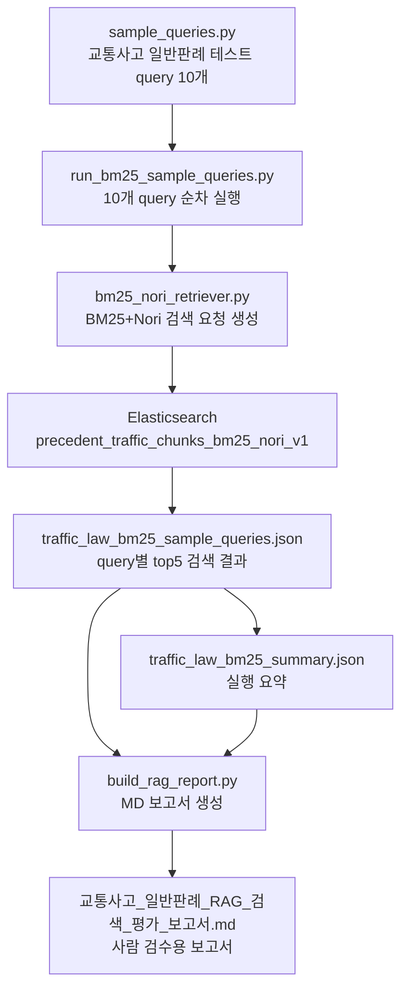

# PM 발표 핵심: 왜 교통사고 일반판례 RAG를 별도로 만들었는가

## 1. 교통사고 일반판례 RAG의 목적

교통사고 일반판례 RAG는 과실비율을 바로 산정하기 위한 Agent가 아니다.

목적은 다음과 같다.

```text
교통사고 상황에서 운전자 주의의무, 형사책임, 교통법규 위반, 사고 후 조치의무 같은
일반 법률 쟁점에 맞는 판례 후보를 검색하는 것
```

즉 `text_ml_case_search Agent`가 과실비율 판단 보조에 가깝다면,
교통사고 일반판례 RAG는 법률 쟁점 확인용 검색 모듈에 가깝다.

## 2. 왜 Agent가 아니라 RAG/Search까지만 만들었는가

현재 단계에서는 별도 Agent를 만들지 않았다.

이유는 다음과 같다.

```text
1. 교통사고 일반판례는 과실비율 Agent의 최종 active source가 아직 아니다.
2. 먼저 BM25+Nori 검색만으로 적절한 판례가 잡히는지 확인해야 한다.
3. 검색 품질이 검증된 뒤에야 Supervisor 또는 다른 법률 Agent와 연결하는 것이 안전하다.
4. 과실비율 심의사례/판례와 역할이 다르므로 바로 섞으면 출력 의미가 흐려질 수 있다.
```

따라서 현재 V1은 다음 범위까지만 담당한다.

```text
사용자/개발자가 정의한 교통사고 법률 쟁점 query
-> traffic_precedent index 검색
-> 관련 판례 후보 top5 반환
-> 사람이 보고 적합성 검토
```

## 3. 왜 BM25+Nori를 사용했는가

교통사고 일반판례 검색은 특정 법률 키워드가 중요하다.

예시는 다음과 같다.

```text
신호위반
중앙선 침범
횡단보도 보행자 사고
음주운전 형사책임
사고 후 미조치
어린이보호구역 사고
안전거리 확보의무
```

이런 검색은 의미적으로 비슷한 문서를 넓게 찾는 것보다,
정확한 사고 유형과 법률 쟁점이 들어간 판례를 찾는 것이 중요하다.

그래서 BM25+Nori를 사용했다.

```text
BM25
-> 검색어와 판례 문서의 키워드 매칭 강도 계산

Nori
-> 한국어 법률/교통사고 표현을 검색 가능한 형태소 단위로 분리
```

## 4. 과실비율 Agent와의 차이

| 구분 | text_ml_case_search Agent V2 | 교통사고 일반판례 RAG V1 |
|---|---|---|
| 목적 | 과실비율 판단 보조 근거 생성 | 교통사고 일반 법률 판례 검색 |
| 현재 단계 | Agent까지 구현 | RAG/Search까지만 구현 |
| 주요 source | review_case, fault_ratio_precedent | traffic_precedent |
| 출력 | Supervisor용 JSON | 검색 결과 JSON/MD 보고서 |
| 사용 방식 | Supervisor가 함수 호출 | 사람이 query 결과를 검토 |

## 5. 발표용 핵심 문장

```text
교통사고 일반판례 RAG는 과실비율을 직접 계산하는 기능이 아니라,
신호위반, 중앙선 침범, 음주운전, 사고 후 미조치처럼
교통사고의 법률 쟁점에 맞는 판례를 찾기 위한 검색 모듈입니다.
현재는 Agent로 붙이기 전 단계로, BM25+Nori 기반 검색이 실제 판례 후보를 잘 가져오는지 검증하는 V1입니다.
```

---
# 교통사고 일반판례 RAG V1 실행 흐름 발표용

## 1. 한 줄 요약

교통사고 일반판례 RAG V1은 `traffic_precedent` 판례 색인을 대상으로 BM25+Nori 검색을 수행해, 사용자의 교통사고 쟁점에 맞는 일반 판례 근거 후보를 찾아주는 검색 모듈이다.

현재 V1은 Agent가 아니라 **RAG/Search 단계**까지만 구현한다.

```text
사용자 사고 쟁점
→ 교통사고 일반판례 검색 query
→ Elasticsearch BM25+Nori 검색
→ 관련 판례 top_k 후보 반환
→ 사람이 보고서로 검색 품질 검수
```

## 2. 왜 별도 RAG로 분리했나

`text_ml_case_search` Agent V2는 현재 다음 두 source를 중심으로 동작한다.

```text
1. review_case
   - 심의사례
   - 과실비율 판단과 보험 실무 쟁점 중심

2. fault_ratio_precedent
   - 과실비율 관련 판례
   - 과실상계, 손해배상, 책임제한 판단 중심
```

반면 `traffic_precedent`는 성격이 조금 다르다.

```text
traffic_precedent
  - 교통사고 일반 판례
  - 신호위반, 중앙선 침범, 횡단보도, 음주운전, 뺑소니, 어린이보호구역 등
  - 운전자 주의의무, 형사 책임, 교통법규 위반, 사고 후 조치의무 판단에 강점
```

따라서 `traffic_precedent`를 바로 Agent output에 합치기보다, 먼저 독립 RAG/Search로 검색 품질을 확인하는 것이 맞다.

## 3. V1 범위

이번 V1에서 하는 것:

```text
traffic_precedent Elasticsearch index 확인
교통사고 일반판례 query 10개 작성
BM25+Nori retriever 작성
sample query 10개 실행
검색 결과 JSON 저장
사람이 볼 수 있는 MD 보고서 생성
```

이번 V1에서 하지 않는 것:

```text
Agent 통합
Supervisor 연결
과실비율 산정
법령 hint expansion
pgvector 검색
hybrid 검색
local reranker 평가
```

이유는 단순하다. 현재 목표는 “교통사고 일반판례가 BM25+Nori만으로도 잘 찾아지는가”를 먼저 확인하는 것이다. 검색 품질이 충분하면 V1은 작게 유지하고, 부족한 query가 확인될 때만 vector/hybrid/reranker로 확장한다.

## 4. 현재 사용한 검색 방식

검색 방식은 BM25+Nori이다.

```text
BM25
  - 검색어와 문서 내 단어 매칭 강도를 계산하는 전통적인 키워드 검색 방식

Nori
  - Elasticsearch의 한국어 형태소 분석기
  - “신호위반”, “교통사고”, “주의의무” 같은 한국어 표현을 검색 가능한 토큰으로 나눔
```

이번 RAG에서 BM25+Nori를 선택한 이유:

```text
1. 교통사고 일반판례 query는 법률 키워드가 명확함
2. 신호위반, 중앙선 침범, 음주운전, 뺑소니처럼 정확한 단어 매칭이 중요함
3. 이전 판례 A/B 테스트에서 BM25+Nori 계열 검색이 충분히 유효한 후보를 가져왔음
4. 법령 hint expansion 입력이 아직 없으므로 복잡한 확장을 먼저 넣을 필요가 없음
5. V1은 운영 기능이 아니라 검색 가능성 검증이 목적이므로 단순한 baseline이 적합함
```

## 5. 전체 흐름



## 6. 파일별 역할

| 구분 | 파일 | 역할 |
| --- | --- | --- |
| query 정의 | `etl/fault_cases/src/traffic_precedents/precedent_search/traffic_law/sample_queries.py` | 교통사고 일반판례 RAG 테스트용 query 10개를 정의한다. |
| 검색기 | `etl/fault_cases/src/traffic_precedents/precedent_search/traffic_law/bm25_nori_retriever.py` | `traffic_precedent` Elasticsearch index에 BM25+Nori 검색을 요청한다. |
| 실행 runner | `etl/fault_cases/src/traffic_precedents/precedent_search/traffic_law/run_bm25_sample_queries.py` | sample query 10개를 실행하고 JSON 결과를 저장한다. |
| 보고서 생성 | `etl/fault_cases/src/traffic_precedents/precedent_search/traffic_law/build_rag_report.py` | JSON 결과를 읽어 사람이 검수하기 쉬운 MD 보고서로 만든다. |
| 실행 기록 | `etl/fault_cases/Fault_cases_MD/판례/교통사고 관련 판례 RAG/실행과정.md` | 어떤 단계를 왜 진행했고 어떤 결과가 나왔는지 기록한다. |
| 평가 보고서 | `etl/fault_cases/Fault_cases_MD/판례/교통사고 관련 판례 RAG/교통사고_일반판례_RAG_검색_평가_보고서.md` | query별 대표 판례와 preview를 확인하는 최종 검수 보고서이다. |

## 7. 사용한 Elasticsearch index

```text
index:
  precedent_traffic_chunks_bm25_nori_v1

source_type:
  traffic_precedent
```

기존 색인 검증 결과:

```text
indexed_document_count_after = 25,952
bulk_error_count = 0
```

즉 Elasticsearch에는 교통사고 일반판례 chunk가 정상 색인되어 있고, 이번 RAG는 이 색인을 검색 대상으로 사용한다.

## 8. BM25+Nori 검색 조건

`bm25_nori_retriever.py`는 다음 필드를 대상으로 검색한다.

```text
search_text^4
chunk_text^2
case_name^1.5
search_text_standard
chunk_text_standard
```

의미:

```text
search_text^4
  - 전처리 단계에서 만든 검색용 통합 텍스트
  - 가장 중요한 검색 필드라 가중치를 높게 둠

chunk_text^2
  - 실제 판례 본문 chunk
  - 본문 매칭도 중요하므로 두 번째로 높게 둠

case_name^1.5
  - 사건명, 판례명
  - 사건 제목에 query 키워드가 직접 들어간 경우 반영

search_text_standard / chunk_text_standard
  - 표준화 텍스트 필드
  - 원문 표현과 정규화 표현을 함께 검색하기 위한 보조 필드
```

검색 옵션:

```text
operator = "or"
highlight = search_text, chunk_text
top_k = 5
```

`operator="or"`를 쓴 이유는 교통사고 query가 여러 법률 쟁점 단어로 구성되어 있기 때문이다. 모든 단어를 반드시 포함해야 하는 `and` 방식보다, 핵심 단어 일부가 강하게 맞는 판례도 후보로 가져오는 것이 RAG 검색에는 더 유리하다.

`highlight`는 왜 필요한가:

```text
1. 어떤 문장 때문에 검색됐는지 사람이 바로 확인할 수 있음
2. PM/기획자/개발자가 검색 품질을 검수하기 쉬움
3. 추후 Agent display_evidence로 확장할 때 사용자 표시 문구 후보가 됨
```

## 9. 테스트 query 10개

| query_id | query | 목적 |
| --- | --- | --- |
| traffic_law_q001 | 신호위반 교통사고 판례 | 신호위반 사고에서 운전자 주의의무와 책임 판단 판례를 찾는다. |
| traffic_law_q002 | 중앙선 침범 사고 운전자 책임 | 중앙선 침범 또는 역주행 사고의 책임 판단 근거를 찾는다. |
| traffic_law_q003 | 횡단보도 보행자 사고 운전자 주의의무 | 횡단보도 보행자 사고에서 운전자의 보호의무 판례를 찾는다. |
| traffic_law_q004 | 음주운전 교통사고 형사 책임 | 음주운전 사고의 형사책임 또는 법률상 책임 판단 판례를 찾는다. |
| traffic_law_q005 | 뺑소니 사고 후 미조치 판례 | 사고 후 미조치 또는 도주 관련 교통사고 판례를 찾는다. |
| traffic_law_q006 | 전동킥보드 교통사고 법적 책임 | 전동킥보드 또는 개인형 이동장치 사고 책임 판례를 찾는다. |
| traffic_law_q007 | 오토바이와 자동차 충돌 사고 책임 | 이륜차와 자동차 충돌 사고의 주의의무와 책임 판단 판례를 찾는다. |
| traffic_law_q008 | 후방추돌 사고 안전거리 주의의무 | 후방추돌 사고에서 안전거리 확보와 전방주시의무 판례를 찾는다. |
| traffic_law_q009 | 어린이보호구역 사고 처벌 판례 | 어린이보호구역 사고의 법적 책임 또는 처벌 관련 판례를 찾는다. |
| traffic_law_q010 | 교차로 좌회전 직진 충돌 주의의무 | 교차로 좌회전/직진 충돌 사고의 통행방법과 주의의무 판례를 찾는다. |

이 10개 query는 교통사고 일반판례 RAG가 다뤄야 할 대표적인 법률 쟁점을 넓게 확인하기 위해 선택했다.

## 10. 실행 결과 요약

실행 결과 파일:

```text
etl/fault_cases/artifacts/traffic_precedents_output/traffic_law_rag/traffic_law_bm25_summary.json
```

요약:

```json
{
  "created_at": "2026-07-05T23:25:21",
  "retriever": "traffic_law_bm25_nori",
  "source_type": "traffic_precedent",
  "elasticsearch_index": "precedent_traffic_chunks_bm25_nori_v1",
  "top_k": 5,
  "query_count": 10,
  "total_result_count": 50,
  "zero_result_query_count": 0,
  "zero_result_query_ids": []
}
```

해석:

```text
10개 query 모두 검색 결과를 반환했다.
각 query마다 top5 후보를 가져왔다.
전체 후보 수는 10 x 5 = 50개다.
검색 결과가 0개인 query는 없다.
```

따라서 현재 단계의 결론은 다음과 같다.

```text
BM25+Nori 기반 traffic_precedent RAG/Search V1은 기술적으로 정상 동작한다.
다만, 검색 결과가 실제로 좋은지는 query별 Top1/Top5 preview를 사람이 검수해야 한다.
```

## 11. 산출물

JSON 산출물:

```text
etl/fault_cases/artifacts/traffic_precedents_output/traffic_law_rag/traffic_law_bm25_sample_queries.json
etl/fault_cases/artifacts/traffic_precedents_output/traffic_law_rag/traffic_law_bm25_summary.json
etl/fault_cases/artifacts/traffic_precedents_output/traffic_law_rag/traffic_law_bm25_report.json
```

MD 산출물:

```text
etl/fault_cases/Fault_cases_MD/판례/교통사고 관련 판례 RAG/교통사고_일반판례_RAG_검색_평가_보고서.md
etl/fault_cases/Fault_cases_MD/판례/교통사고 관련 판례 RAG/실행과정.md
etl/fault_cases/Fault_cases_MD/판례/교통사고 관련 판례 RAG/교통사고_일반판례_RAG_V1_실행_흐름_발표용.md
```

## 12. 사람이 검수해야 하는 부분

현재 보고서에서 사람이 확인해야 할 핵심은 다음이다.

```text
1. query별 Top1 판례가 질문 의도와 맞는가
2. Top5 안에 실제로 쓸 만한 판례 근거가 있는가
3. matched_snippets가 법률 쟁점과 연결되는 문장을 보여주는가
4. traffic_precedent가 과실비율이 아니라 주의의무/책임 판단 근거로 잘 쓰일 수 있는가
5. 법령 hint 없이 BM25+Nori만으로 충분한가
```

검수 기준은 “점수가 높다”가 아니라 “해당 query에 대해 사람이 읽었을 때 근거로 쓸 수 있느냐”이다.

## 13. 재현 실행 명령

문법 확인:

```powershell
.\.venv\Scripts\python.exe -m py_compile etl/fault_cases/src/traffic_precedents/precedent_search/traffic_law/sample_queries.py
.\.venv\Scripts\python.exe -m py_compile etl/fault_cases/src/traffic_precedents/precedent_search/traffic_law/bm25_nori_retriever.py
.\.venv\Scripts\python.exe -m py_compile etl/fault_cases/src/traffic_precedents/precedent_search/traffic_law/run_bm25_sample_queries.py
.\.venv\Scripts\python.exe -m py_compile etl/fault_cases/src/traffic_precedents/precedent_search/traffic_law/build_rag_report.py
```

sample query 10개 실행:

```powershell
.\.venv\Scripts\python.exe -B -m etl.fault_cases.src.traffic_precedents.precedent_search.traffic_law.run_bm25_sample_queries --top-k 5
```

예상 결과:

```text
query_count = 10
total_result_count = 50
zero_result_query_count = 0
traffic_law_bm25_sample_queries.json 생성
traffic_law_bm25_summary.json 생성
```

보고서 생성:

```powershell
.\.venv\Scripts\python.exe -B -m etl.fault_cases.src.traffic_precedents.precedent_search.traffic_law.build_rag_report
```

예상 결과:

```text
교통사고_일반판례_RAG_검색_평가_보고서.md 갱신
traffic_law_bm25_report.json 갱신
```

## 14. PM 설명용 최종 해석

이번 작업으로 확인한 것은 “교통사고 일반판례 RAG를 만들 수 있는가”이다.

결과적으로 다음이 확인됐다.

```text
1. traffic_precedent 색인은 이미 Elasticsearch에 정상 구축되어 있다.
2. BM25+Nori 검색기는 교통사고 일반판례 query 10개에 대해 모두 후보를 반환했다.
3. 검색 결과는 JSON과 MD 보고서로 남아 있어 사람이 검수할 수 있다.
4. 아직 Agent나 Supervisor에 붙인 것은 아니다.
5. 현재 단계에서는 교통사고 일반판례 RAG/Search V1 baseline이 준비된 상태다.
```

따라서 다음 의사결정은 이렇다.

```text
보고서의 query별 Top1/Top5 판례가 충분히 적절하면:
  BM25+Nori를 교통사고 일반판례 RAG V1 기준으로 유지한다.

부족한 query가 많으면:
  hint expansion, pgvector, hybrid, reranker를 다음 실험으로 확장한다.
```

## 15. 이후 확장 방향

V1 이후 가능한 확장은 다음과 같다.

```text
1. legal_hint_dictionary.py
   - 법령/쟁점 hint가 생겼을 때 query를 보강한다.

2. search_text_builder.py
   - 사용자 입력, OCR, 보험사 주장, 법률 hint를 검색문으로 조합한다.

3. pgvector_retriever.py
   - 의미 기반 검색이 필요한 경우 추가한다.

4. hybrid_retriever.py
   - BM25와 vector 결과를 합친다.

5. local reranker 평가
   - 여러 검색 방식의 결과를 같은 reranker 점수로 비교한다.
```

하지만 현재는 이 확장들을 바로 넣지 않는다.

```text
현재 V1 결론:
  먼저 BM25+Nori 단독 검색 품질을 사람 검수로 확인한다.
```

