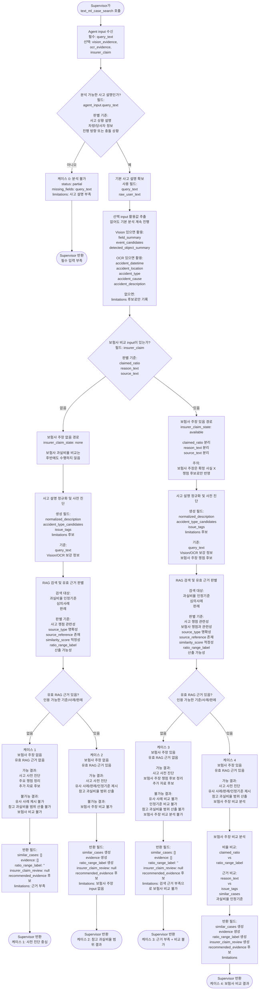

```mermaid
flowchart TD
    A(["Supervisor가<br/>text_ml_case_search 호출"]) --> B["Agent input 수신<br/>필수: query_text<br/>선택: vision_evidence, <br/>ocr_evidence, <br/>insurer_claim"]

    B --> C{"분석 가능한 사고 설명인가?<br/>필드: <br/>agent_input.query_text<br/><br/>판별 기준:<br/>사고 상황 설명<br/>차량/당사자 정보<br/>진행 방향 또는 충돌 상황"}

    C -- "아니오" --> C0["케이스 0: 분석 불가<br/>status: partial<br/>missing_fields: query_text<br/>limitations: 사고 설명 부족"]
    C0 --> Z0(["Supervisor 반환<br/>필수 입력 부족"])

    C -- "예" --> D["기본 사고 설명 확보<br/>사용 필드:<br/>query_text<br/>raw_user_text"]

    D --> E["선택 input 활용값 추출<br/>없어도 기본 분석 계속 진행<br/><br/>Vision 있으면 활용:<br/>field_summary<br/>event_candidates<br/>detected_object_summary<br/><br/>OCR 있으면 활용:<br/>accident_datetime<br/>accident_location<br/>accident_type<br/>accident_cause<br/>accident_description<br/><br/>없으면:<br/>limitations 후보로만 기록"]

    E --> F{"보험사 비교 input이 있는가?<br/>필드: insurer_claim<br/><br/>판별 기준:<br/>claimed_ratio<br/>reason_text<br/>source_text"}

    F -- "없음" --> N1["보험사 주장 없음 경로<br/>insurer_claim_state: none<br/><br/>보험사 과실비율 비교는<br/>후반에도 수행하지 않음"]

    F -- "있음" --> Y1["보험사 주장 있음 경로<br/>insurer_claim_state: available<br/><br/>claimed_ratio 분리<br/>reason_text 분리<br/>source_text 분리<br/><br/>주의:<br/>보험사 주장은 확정 사실 X<br/>쟁점 후보로만 반영"]

    N1 --> N2["사고 설명 정규화 및 사전 진단<br/><br/>생성 필드:<br/>normalized_description<br/>accident_type_candidates<br/>issue_tags<br/>limitations 후보<br/><br/>기준:<br/>query_text<br/>Vision/OCR 보강 정보"]

    Y1 --> Y2["사고 설명 정규화 및 사전 진단<br/><br/>생성 필드:<br/>normalized_description<br/>accident_type_candidates<br/>issue_tags<br/>limitations 후보<br/><br/>기준:<br/>query_text<br/>Vision/OCR 보강 정보<br/>보험사 주장 쟁점 후보"]

    N2 --> N3["RAG 검색 및 유효 근거 판별<br/><br/>검색 대상:<br/>과실비율 인정기준<br/>심의사례<br/>판례<br/><br/>판별 기준:<br/>사고 쟁점 관련성<br/>source_type 명확성<br/>source_reference 존재<br/>similarity_score 적정성<br/>ratio_range_label <br/>산출 가능성"]

    Y2 --> Y3["RAG 검색 및 유효 근거 판별<br/><br/>검색 대상:<br/>과실비율 인정기준<br/>심의사례<br/>판례<br/><br/>판별 기준:<br/>사고 쟁점 관련성<br/>보험사 쟁점과 관련성<br/>source_type 명확성<br/>source_reference 존재<br/>similarity_score 적정성<br/>ratio_range_label <br/>산출 가능성"]

    N3 --> N4{"유효 RAG 근거 있음?<br/>인용 가능한 기준/사례/판례"}
    Y3 --> Y4{"유효 RAG 근거 있음?<br/>인용 가능한 기준/사례/판례"}

    N4 -- "없음" --> N5["케이스 1<br/>보험사 주장 없음<br/>유효 RAG 근거 없음<br/><br/>가능 결과:<br/>사고 사전 진단<br/>주요 쟁점 정리<br/>추가 자료 후보<br/><br/>불가능 결과:<br/>유사 사례 제시 불가<br/>참고 과실비율 범위 산출 불가<br/>보험사 비교 불가"]
    N5 --> N6["반환 필드:<br/>similar_cases: []<br/>evidence: []<br/>ratio_range_label: ''<br/>insurer_claim_review: null<br/>recommended_evidence 후보<br/>limitations: 근거 부족"]
    N6 --> Z1(["Supervisor 반환<br/>케이스 1: 사전 진단 중심"])

    N4 -- "있음" --> N7["케이스 2<br/>보험사 주장 없음<br/>유효 RAG 근거 있음<br/><br/>가능 결과:<br/>사고 사전 진단<br/>유사 사례/판례/인정기준 제시<br/>참고 과실비율 범위 산출<br/><br/>불가능 결과:<br/>보험사 주장 비교 불가"]
    N7 --> N8["반환 필드:<br/>similar_cases 생성<br/>evidence 생성<br/>ratio_range_label 생성<br/>insurer_claim_review: null<br/>recommended_evidence 후보<br/>limitations: 보험사 주장 input 없음"]
    N8 --> Z2(["Supervisor 반환<br/>케이스 2: 참고 과실비율 범위 결과"])

    Y4 -- "없음" --> Y5["케이스 3<br/>보험사 주장 있음<br/>유효 RAG 근거 없음<br/><br/>가능 결과:<br/>사고 사전 진단<br/>보험사 주장 쟁점 후보 정리<br/>추가 자료 후보<br/><br/>불가능 결과:<br/>유사 사례 비교 불가<br/>인정기준 비교 불가<br/>참고 과실비율 범위 산출 불가<br/>보험사 주장 비교 분석 불가"]
    Y5 --> Y6["반환 필드:<br/>similar_cases: []<br/>evidence: []<br/>ratio_range_label: ''<br/>insurer_claim_review: null<br/>recommended_evidence 후보<br/>limitations: 검색 근거 부족으로 보험사 비교 불가"]
    Y6 --> Z3(["Supervisor 반환<br/>케이스 3: 근거 부족 + 비교 불가"])

    Y4 -- "있음" --> Y7["케이스 4<br/>보험사 주장 있음<br/>유효 RAG 근거 있음<br/><br/>가능 결과:<br/>사고 사전 진단<br/>유사 사례/판례/인정기준 제시<br/>참고 과실비율 범위 산출<br/>보험사 주장 비교 분석"]
    Y7 --> Y8["보험사 주장 비교 분석<br/><br/>비율 비교:<br/>claimed_ratio<br/>vs<br/>ratio_range_label<br/><br/>근거 비교:<br/>reason_text<br/>vs<br/>issue_tags<br/>similar_cases<br/>과실비율 인정기준"]
    Y8 --> Y9["반환 필드:<br/>similar_cases 생성<br/>evidence 생성<br/>ratio_range_label 생성<br/>insurer_claim_review 생성<br/>recommended_evidence 후보<br/>limitations"]
    Y9 --> Z4(["Supervisor 반환<br/>케이스 4: 보험사 비교 결과"])
```

```mermaid
flowchart TD
    A(["Supervisor가<br/>text_ml_case_search 호출"]) --> B["Agent input 수신<br/>필수: query_text<br/>선택: vision_evidence, <br/>ocr_evidence, <br/>insurer_claim"]

    B --> C{"분석 가능한 사고 설명인가?<br/>필드: <br/>agent_input.query_text<br/><br/>판별 기준:<br/>사고 상황 설명<br/>차량/당사자 정보<br/>진행 방향 또는 충돌 상황"}

    C -- "아니오" --> C0["케이스 0: 분석 불가<br/>status: partial<br/>missing_fields: query_text<br/>limitations: 사고 설명 부족"]
    C0 --> Z0(["Supervisor 반환<br/>필수 입력 부족"])

    C -- "예" --> D["기본 사고 설명 확보<br/>사용 필드:<br/>query_text<br/>raw_user_text"]

    D --> E["선택 input 활용값 추출<br/>없어도 기본 분석 계속 진행<br/><br/>Vision 있으면 활용:<br/>field_summary<br/>event_candidates<br/>detected_object_summary<br/><br/>OCR 있으면 활용:<br/>accident_datetime<br/>accident_location<br/>accident_type<br/>accident_cause<br/>accident_description<br/><br/>없으면:<br/>limitations 후보로만 기록"]

    E --> F{"보험사 비교 input이 있는가?<br/>필드: insurer_claim<br/><br/>판별 기준:<br/>claimed_ratio<br/>reason_text<br/>source_text"}

    F -- "없음" --> N1["보험사 주장 없음 경로<br/>insurer_claim_state: none<br/><br/>보험사 과실비율 비교는<br/>후반에도 수행하지 않음"]

    F -- "있음" --> Y1["보험사 주장 있음 경로<br/>insurer_claim_state: available<br/><br/>claimed_ratio 분리<br/>reason_text 분리<br/>source_text 분리<br/><br/>주의:<br/>보험사 주장은 확정 사실 X<br/>쟁점 후보로만 반영"]

    N1 --> N2["사고 설명 정규화 및 사전 진단<br/><br/>생성 필드:<br/>normalized_description<br/>accident_type_candidates<br/>issue_tags<br/>limitations 후보<br/><br/>기준:<br/>query_text<br/>Vision/OCR 보강 정보"]

    Y1 --> Y2["사고 설명 정규화 및 사전 진단<br/><br/>생성 필드:<br/>normalized_description<br/>accident_type_candidates<br/>issue_tags<br/>limitations 후보<br/><br/>기준:<br/>query_text<br/>Vision/OCR 보강 정보<br/>보험사 주장 쟁점 후보"]

    N2 --> N3["RAG 검색 및 유효 근거 판별<br/><br/>검색 대상:<br/>과실비율 인정기준<br/>심의사례<br/>판례<br/><br/>판별 기준:<br/>사고 쟁점 관련성<br/>source_type 명확성<br/>source_reference 존재<br/>similarity_score 적정성<br/>ratio_range_label <br/>산출 가능성"]

    Y2 --> Y3["RAG 검색 및 유효 근거 판별<br/><br/>검색 대상:<br/>과실비율 인정기준<br/>심의사례<br/>판례<br/><br/>판별 기준:<br/>사고 쟁점 관련성<br/>보험사 쟁점과 관련성<br/>source_type 명확성<br/>source_reference 존재<br/>similarity_score 적정성<br/>ratio_range_label <br/>산출 가능성"]

    N3 --> N4{"유효 RAG 근거 있음?<br/>인용 가능한 기준/사례/판례"}
    Y3 --> Y4{"유효 RAG 근거 있음?<br/>인용 가능한 기준/사례/판례"}

    N4 -- "없음" --> N5["케이스 1<br/>보험사 주장 없음<br/>유효 RAG 근거 없음<br/><br/>가능 결과:<br/>사고 사전 진단<br/>주요 쟁점 정리<br/>추가 자료 후보<br/><br/>불가능 결과:<br/>유사 사례 제시 불가<br/>참고 과실비율 범위 산출 불가<br/>보험사 비교 불가"]
    N5 --> N6["반환 필드:<br/>similar_cases: []<br/>evidence: []<br/>ratio_range_label: ''<br/>insurer_claim_review: null<br/>recommended_evidence 후보<br/>limitations: 근거 부족"]
    N6 --> Z1(["Supervisor 반환<br/>케이스 1: 사전 진단 중심"])

    N4 -- "있음" --> N7["케이스 2<br/>보험사 주장 없음<br/>유효 RAG 근거 있음<br/><br/>가능 결과:<br/>사고 사전 진단<br/>유사 사례/판례/인정기준 제시<br/>참고 과실비율 범위 산출<br/><br/>불가능 결과:<br/>보험사 주장 비교 불가"]
    N7 --> N8["반환 필드:<br/>similar_cases 생성<br/>evidence 생성<br/>ratio_range_label 생성<br/>insurer_claim_review: null<br/>recommended_evidence 후보<br/>limitations: 보험사 주장 input 없음"]
    N8 --> Z2(["Supervisor 반환<br/>케이스 2: 참고 과실비율 범위 결과"])

    Y4 -- "없음" --> Y5["케이스 3<br/>보험사 주장 있음<br/>유효 RAG 근거 없음<br/><br/>가능 결과:<br/>사고 사전 진단<br/>보험사 주장 쟁점 후보 정리<br/>추가 자료 후보<br/><br/>불가능 결과:<br/>유사 사례 비교 불가<br/>인정기준 비교 불가<br/>참고 과실비율 범위 산출 불가<br/>보험사 주장 비교 분석 불가"]
    Y5 --> Y6["반환 필드:<br/>similar_cases: []<br/>evidence: []<br/>ratio_range_label: ''<br/>insurer_claim_review: null<br/>recommended_evidence 후보<br/>limitations: 검색 근거 부족으로 보험사 비교 불가"]
    Y6 --> Z3(["Supervisor 반환<br/>케이스 3: 근거 부족 + 비교 불가"])

    Y4 -- "있음" --> Y7["케이스 4<br/>보험사 주장 있음<br/>유효 RAG 근거 있음<br/><br/>가능 결과:<br/>사고 사전 진단<br/>유사 사례/판례/인정기준 제시<br/>참고 과실비율 범위 산출<br/>보험사 주장 비교 분석"]
    Y7 --> Y8["보험사 주장 비교 분석<br/><br/>비율 비교:<br/>claimed_ratio<br/>vs<br/>ratio_range_label<br/><br/>근거 비교:<br/>reason_text<br/>vs<br/>issue_tags<br/>similar_cases<br/>과실비율 인정기준"]
    Y8 --> Y9["반환 필드:<br/>similar_cases 생성<br/>evidence 생성<br/>ratio_range_label 생성<br/>insurer_claim_review 생성<br/>recommended_evidence 후보<br/>limitations"]
    Y9 --> Z4(["Supervisor 반환<br/>케이스 4: 보험사 비교 결과"])
```
