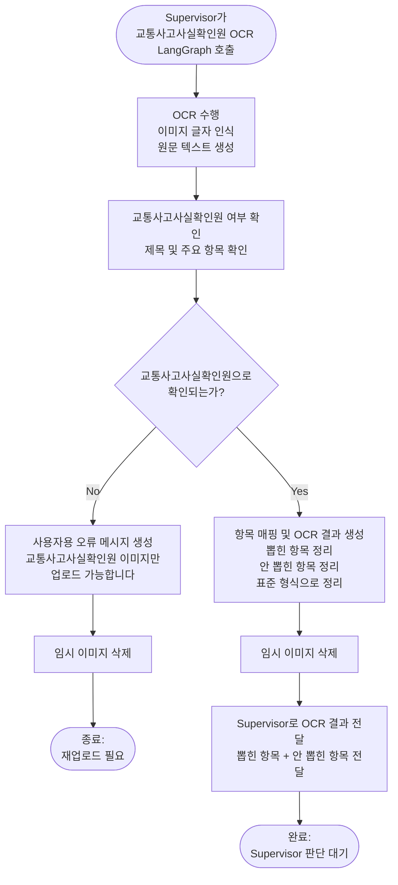

```mermaid
flowchart TD
    A([Supervisor가<br/>교통사고사실확인원 OCR LangGraph 호출]) --> B["OCR 수행<br/>이미지 글자 인식<br/>원문 텍스트 생성"]

    B --> C["교통사고사실확인원 여부 확인<br/>제목 및 주요 항목 확인"]

    C --> D{"교통사고사실확인원으로<br/>확인되는가?"}

    D -- "No" --> E["사용자용 오류 메시지 생성<br/>교통사고사실확인원 이미지만<br/>업로드 가능합니다"]

    E --> F["임시 이미지 삭제"]

    F --> G([종료:<br/>재업로드 필요])

    D -- "Yes" --> H["항목 매핑 및 OCR 결과 생성<br/>뽑힌 항목 정리<br/>안 뽑힌 항목 정리<br/>표준 형식으로 정리"]

    H --> I["임시 이미지 삭제"]

    I --> J["Supervisor로 OCR 결과 전달<br/>뽑힌 항목 + 안 뽑힌 항목 전달"]

    J --> K([완료:<br/>Supervisor 판단 대기])

```
