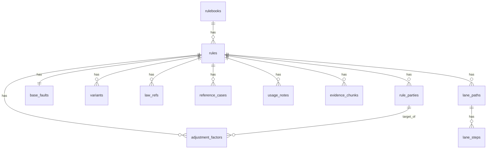

# 과실비율 인정기준 데이터 적재 상세 계획서 - 수정본

## 0. 이번 수정의 핵심

기존 계획서의 큰 흐름은 맞다.

```text
전처리 JSONL
→ PostgreSQL Staging
→ PostgreSQL Core
→ Neo4j Graph
→ Vector / Elasticsearch 검색 연결
```

다만 기존 문서의 1단계 설명은 헷갈릴 수 있었다.
기존에는 `preprocess_raw_rows`라는 하나의 테이블에 `payload JSONB`로 모든 JSONL row를 넣는 방식이었다.
이 방식은 구현은 단순하지만, 테이블별 구조를 눈으로 확인하기 어렵고, 사용자가 이해하기 어렵다.

따라서 이 수정본에서는 1단계를 아래처럼 바꾼다.

```text
기존 방식:
모든 JSONL row → preprocess_raw_rows 하나의 테이블 → payload JSONB 저장

수정 방식:
JSONL 파일별로 staging 테이블 생성
rules.jsonl              → stg_rules
parties.jsonl            → stg_rule_parties
base_faults.jsonl        → stg_base_faults
variants.jsonl           → stg_variants
adjustment_factors.jsonl → stg_adjustment_factors
chunks.jsonl             → stg_evidence_chunks
law_refs.jsonl           → stg_law_refs
reference_cases.jsonl    → stg_reference_cases
usage_notes.jsonl        → stg_usage_notes
```

즉, 이 문서에서 말하는 1단계는 더 이상 “한 테이블에 payload만 넣는 방식”이 아니다.

정확한 저장 방식은 다음이다.

```text
JSONL 한 줄 = JSON 객체 하나 = PostgreSQL row 하나
자주 쓰는 값 = 컬럼으로 저장
기준서별 특수 값 = attributes JSONB에 저장
원본 JSON 전체 = raw_json JSONB에 같이 저장
```

---

## 1. 전체 적재 흐름

```text
etl/fault_cases/artifacts/fault_standard_output/preprocessed/
  2020_nontypical_accident_rulebook/
  2021_pm_vs_auto_nontypical_rulebook/
  2023_official_auto_accident_rulebook/
  2025_two_lane_roundabout_rulebook/
    ↓
[1단계] PostgreSQL Staging 저장
    - JSONL 파일별 stg_* 테이블에 저장
    - 주요 필드는 컬럼으로 저장
    - 원본 row 전체는 raw_json JSONB로 보존
    - 검수, 재처리, 버전 비교, Core 생성 전 확인용

    ↓
[2단계] PostgreSQL Core 테이블 생성
    - Staging에서 서비스에 필요한 공통 구조만 정리
    - Rule, Party, BaseFault, Variant, Adjustment 중심
    - 과실 계산, 관리자 화면, Neo4j 생성에 사용

    ↓
[3단계] Neo4j Graph 생성
    - Core 테이블에서 노드와 엣지 생성
    - 사고유형 매칭, A/B 관계 검증, 수정요소 연결에 사용

    ↓
[4단계] Vector / Elasticsearch 검색 연결
    - evidence_chunks, law_refs, reference_cases, usage_notes 중심
    - 자연어 사고 설명 후보 검색, 판례/심의사례 키워드 검색에 사용
```

---

## 2. 현재 전처리 데이터 상태

현재 적재 대상은 zip 파일 자체가 아니라 아래 전처리 산출물 루트 폴더다.

```text
etl/fault_cases/artifacts/fault_standard_output/preprocessed/
```

이 루트 아래의 4개 기준서 폴더를 직접 순회해서 JSONL을 읽는다.

```text
2020_nontypical_accident_rulebook/
2021_pm_vs_auto_nontypical_rulebook/
2023_official_auto_accident_rulebook/
2025_two_lane_roundabout_rulebook/
```

각 기준서 폴더 안의 `99_tables_for_db/*.jsonl`과 기준서별 보조 JSONL을 적재 대상으로 본다.

| 구분 | 설명 | 대표 파일 |
|---|---|---|
| 기준서 | 과실비율 기준서 단위 | `rulebooks.jsonl` |
| 기준 규칙 | 개별 과실비율 기준 | `rules.jsonl` |
| 당사자 | A/B, 보/차, PM/차 등 | `parties.jsonl` |
| 기본과실 | 기본 비율 | `base_faults.jsonl` |
| 세부 시나리오 | 기본과실이 여러 경우로 갈리는 경우 | `variants.jsonl`, `rule_scenarios.jsonl` |
| 수정요소 | 현저한 과실, 중대한 과실, 신호불이행 등 | `adjustment_factors.jsonl` |
| 법규/판례/설명 | 근거 설명용 | `law_refs.jsonl`, `reference_cases.jsonl`, `usage_notes.jsonl` |
| 검색용 문단 | RAG/검색용 | `chunks.jsonl`, `rule_blocks.jsonl` |
| 특수 맥락 | 회전교차로, PM, 도로상황 등 | `lane_paths.jsonl`, `lane_steps.jsonl`, `pm_contexts.jsonl`, `road_contexts.jsonl` |
| 품질검증 | 파싱 상태 확인 | `parse_quality_report.jsonl` |

현재 구조는 DB 적재가 불가능한 구조가 아니다. 오히려 이미 `Rule 중심`으로 잘 나뉘어 있다.
다만 전처리 JSONL의 모든 필드를 최종 ERD 컬럼으로 그대로 만들면 기준서별 특수 필드 때문에 테이블이 지저분해질 수 있다.

---

# 3. 1단계: PostgreSQL Staging 저장

## 3.1 1단계의 목적

1단계는 전처리 결과를 PostgreSQL에 거의 그대로 저장하는 단계다.
하지만 여기서 “그대로”의 의미는 `payload` 하나에 뭉쳐 넣는다는 뜻이 아니다.

정확히는 다음과 같다.

```text
각 JSONL 파일마다 staging 테이블을 만든다.
각 JSONL row는 staging 테이블의 row 하나가 된다.
공통적으로 자주 볼 값은 컬럼으로 저장한다.
원본 JSON 전체는 raw_json 컬럼에 같이 저장한다.
```

1단계의 목적은 서비스 로직이 아니라 다음이다.

```text
1. 전처리 결과 원본 보존
2. JSONL row가 어떤 테이블로 들어갔는지 눈으로 확인
3. 전처리 버전별 비교
4. 잘못 적재되었을 때 복구
5. Core 테이블 생성 전 검수
6. 나중에 컬럼 추가가 필요할 때 raw_json에서 재추출
```

즉, Staging은 최종 서비스 테이블이 아니라 `검수 가능한 임시 적재소`다.

---

## 3.2 Staging 공통 원칙

모든 stg_* 테이블은 아래 공통 원칙을 따른다.

```text
batch_id
- 어떤 전처리 버전에서 들어왔는지 기록

rulebook_id
- 어느 기준서에서 온 데이터인지 기록

rule_id
- 어떤 기준 rule에 연결되는지 기록

주요 컬럼
- 서비스/검수에서 자주 볼 값은 컬럼으로 펼침

attributes JSONB
- 기준서별 특수 필드, 자주 쓰지 않는 구조값 저장

raw_json JSONB
- 원본 JSON row 전체 저장
```

중요한 점은 `raw_json`은 백업이자 원본 보존용이고, 서비스가 계속 직접 조회하는 대상은 아니라는 것이다.

---

## 3.3 Batch 테이블

전처리 산출물 루트 폴더 하나를 적재할 때마다 batch를 하나 만든다.

```sql
CREATE TABLE preprocess_batches (
    batch_id BIGSERIAL PRIMARY KEY,
    batch_name TEXT NOT NULL,
    source_root_path TEXT,
    preprocess_version TEXT,
    description TEXT,
    created_at TIMESTAMP DEFAULT now()
);
```

예시 row:

| batch_id | batch_name | source_root_path | preprocess_version | description |
|---:|---|---|---|---|
| 1 | `preprocessed_2026_07_01` | `etl/fault_cases/artifacts/fault_standard_output/preprocessed` | `v10_combined` | `4개 기준서 통합 전처리 결과` |

---

## 3.4 Staging 테이블 목록

1단계에서 만들 staging 테이블은 다음과 같다.

| JSONL 파일 | Staging 테이블 | 설명 |
|---|---|---|
| `rulebooks.jsonl` | `stg_rulebooks` | 기준서 단위 |
| `rules.jsonl` | `stg_rules` | 개별 기준 rule |
| `parties.jsonl` | `stg_rule_parties` | A/B, 보/차, PM/차 등 당사자 |
| `base_faults.jsonl` | `stg_base_faults` | 기본과실 |
| `variants.jsonl` | `stg_variants` | 세부 시나리오별 비율 |
| `adjustment_factors.jsonl` | `stg_adjustment_factors` | 수정요소 |
| `law_refs.jsonl` | `stg_law_refs` | 관련 법규 |
| `reference_cases.jsonl` | `stg_reference_cases` | 참고판례/참고사례 |
| `usage_notes.jsonl` | `stg_usage_notes` | 기준 적용 설명 |
| `chunks.jsonl` | `stg_evidence_chunks` | 검색/RAG 문단 |
| `rule_blocks.jsonl` | `stg_rule_blocks` | 원문 블록 |
| `lane_paths.jsonl` | `stg_lane_paths` | 회전교차로 경로 |
| `lane_steps.jsonl` | `stg_lane_steps` | 회전교차로 단계 |
| `road_contexts.jsonl` | `stg_road_contexts` | 도로상황 |
| `pm_contexts.jsonl` | `stg_pm_contexts` | PM 사고 맥락 |
| `parse_quality_report.jsonl` | `stg_parse_quality_report` | 전처리 품질검증 |

처음 MVP에서는 아래 7개만 먼저 해도 된다.

```text
stg_rulebooks
stg_rules
stg_rule_parties
stg_base_faults
stg_variants
stg_adjustment_factors
stg_evidence_chunks
```

---

## 3.5 `stg_rulebooks`

```sql
CREATE TABLE stg_rulebooks (
    batch_id BIGINT REFERENCES preprocess_batches(batch_id),
    rulebook_id TEXT NOT NULL,
    rulebook_name TEXT,
    source_type TEXT,
    source_subtype TEXT,
    source_file TEXT,
    published_year INTEGER,
    source_reliability TEXT,
    raw_json JSONB NOT NULL,
    created_at TIMESTAMP DEFAULT now(),
    PRIMARY KEY (batch_id, rulebook_id)
);
```

역할:

```text
기준서 하나를 저장한다.
예: 2023 공식 자동차사고 과실비율 인정기준, 2025 2차로 회전교차로 기준 등
```

---

## 3.6 `stg_rules`

`rules.jsonl`의 각 row가 `stg_rules`의 row 하나가 된다.

```sql
CREATE TABLE stg_rules (
    batch_id BIGINT REFERENCES preprocess_batches(batch_id),
    rule_id TEXT NOT NULL,
    rulebook_id TEXT NOT NULL,

    rule_code TEXT,
    rule_no TEXT,
    rule_title TEXT,
    rule_type TEXT,

    accident_group TEXT,
    accident_subgroup TEXT,

    normalized_ratio TEXT,
    party_a_ratio INTEGER,
    party_b_ratio INTEGER,

    base_fault_type TEXT,
    calculation_source TEXT,
    scenario_required BOOLEAN,
    variants_required BOOLEAN,
    auto_calculation_eligible BOOLEAN,

    page_start INTEGER,
    page_end INTEGER,
    parse_status TEXT,

    attributes JSONB,
    raw_json JSONB NOT NULL,
    created_at TIMESTAMP DEFAULT now(),

    PRIMARY KEY (batch_id, rule_id)
);
```

예시:

| batch_id | rule_id | rule_title | accident_group | normalized_ratio | raw_json |
|---:|---|---|---|---|---|
| 1 | `official_2023_차47-3` | `버스정류장에서 정차후 출발 버스와 그 앞으로 진로변경` | `자동차와 자동차` | `40:60` | 원본 JSON 전체 |
| 1 | `official_2023_차48-1` | `선행차량의 적재물 낙하` | `자동차와 자동차` | `0:100` | 원본 JSON 전체 |

---

## 3.7 `stg_rule_parties`

`parties.jsonl`의 각 row가 `stg_rule_parties`의 row 하나가 된다.

```sql
CREATE TABLE stg_rule_parties (
    batch_id BIGINT REFERENCES preprocess_batches(batch_id),
    party_id TEXT NOT NULL,
    rule_id TEXT NOT NULL,
    rulebook_id TEXT NOT NULL,

    party_key TEXT NOT NULL,
    party_label TEXT,
    party_type TEXT,

    movement TEXT,
    road_position TEXT,
    signal_state TEXT,
    entry_timing TEXT,
    violation_type TEXT,

    raw_text TEXT,
    attributes JSONB,
    raw_json JSONB NOT NULL,
    created_at TIMESTAMP DEFAULT now(),

    PRIMARY KEY (batch_id, party_id),
    UNIQUE (batch_id, rule_id, party_key)
);
```

예시:

| rule_id | party_key | party_type | movement | raw_text |
|---|---|---|---|---|
| `official_2023_차47-3` | `A` | `vehicle` | `정차 후 출발` | `(A) 정차 후 출발 버스차량` |
| `official_2023_차47-3` | `B` | `vehicle` | `진로변경` | `(B) 추월 진로변경` |

회전교차로처럼 특수 필드가 있으면 `attributes`에 둔다.

```json
{
  "party_color": "red",
  "entry_lane": "진입1차로",
  "circulation_lane": "회전1차로",
  "exit_direction": "3시",
  "lane_change_from": null,
  "lane_change_to": null
}
```

---

## 3.8 `stg_base_faults`

```sql
CREATE TABLE stg_base_faults (
    batch_id BIGINT REFERENCES preprocess_batches(batch_id),
    base_fault_id TEXT NOT NULL,
    rule_id TEXT NOT NULL,
    rulebook_id TEXT NOT NULL,

    base_fault_type TEXT,
    calculation_source TEXT,

    party_a_ratio INTEGER,
    party_b_ratio INTEGER,
    normalized_ratio TEXT,

    scenario_required BOOLEAN,
    variants_required BOOLEAN,
    auto_calculation_eligible BOOLEAN,

    is_one_sided_fault BOOLEAN,
    is_equal_fault BOOLEAN,

    raw_text TEXT,
    quality_flags JSONB,
    attributes JSONB,
    raw_json JSONB NOT NULL,
    created_at TIMESTAMP DEFAULT now(),

    PRIMARY KEY (batch_id, base_fault_id),
    UNIQUE (batch_id, rule_id)
);
```

예시:

| rule_id | base_fault_type | calculation_source | party_a_ratio | party_b_ratio | normalized_ratio |
|---|---|---|---:|---:|---|
| `official_2023_차47-3` | `pair_ratio` | `base_faults` | 40 | 60 | `40:60` |
| `official_2023_보22` | `variant_ratio` | `variants` | null | null | null |

---

## 3.9 `stg_variants`

```sql
CREATE TABLE stg_variants (
    batch_id BIGINT REFERENCES preprocess_batches(batch_id),
    variant_id TEXT NOT NULL,
    rule_id TEXT NOT NULL,
    rulebook_id TEXT NOT NULL,

    variant_key TEXT,
    variant_title TEXT,
    scenario_text TEXT,

    party_a_ratio INTEGER,
    party_b_ratio INTEGER,

    single_party_key TEXT,
    single_party_ratio INTEGER,
    single_party_type TEXT,

    ratio_interpretation TEXT,
    needs_review BOOLEAN,

    raw_text TEXT,
    attributes JSONB,
    raw_json JSONB NOT NULL,
    created_at TIMESTAMP DEFAULT now(),

    PRIMARY KEY (batch_id, variant_id)
);
```

예시 1: `차43-7`

| rule_id | variant_key | scenario_text | party_a_ratio | party_b_ratio |
|---|---|---|---:|---:|
| `official_2023_차43-7` | `가` | `안전지대 벗어나기 전` | 100 | 0 |
| `official_2023_차43-7` | `나` | `안전지대 벗어난 후` | 70 | 30 |

예시 2: `보22`

| rule_id | variant_key | scenario_text | single_party_key | single_party_ratio |
|---|---|---|---|---:|
| `official_2023_보22` | `가` | `소로 횡단` | `보` | 10 |
| `official_2023_보22` | `나` | `동일폭 횡단` | `보` | 20 |
| `official_2023_보22` | `다` | `대로 횡단` | `보` | 30 |

---

## 3.10 `stg_adjustment_factors`

```sql
CREATE TABLE stg_adjustment_factors (
    batch_id BIGINT REFERENCES preprocess_batches(batch_id),
    adjustment_id TEXT NOT NULL,
    rule_id TEXT NOT NULL,
    rulebook_id TEXT NOT NULL,

    target_party_key TEXT,
    target_party_type TEXT,

    factor_name TEXT,
    factor_category TEXT,

    delta INTEGER,
    delta_direction TEXT,
    raw_delta TEXT,

    condition_text TEXT,
    explanation_text TEXT,
    raw_text TEXT,

    is_applicable BOOLEAN,
    auto_calculation_eligible BOOLEAN,
    exclude_from_auto_calculation BOOLEAN,

    attributes JSONB,
    raw_json JSONB NOT NULL,
    created_at TIMESTAMP DEFAULT now(),

    PRIMARY KEY (batch_id, adjustment_id)
);
```

예시:

| rule_id | target_party_key | factor_name | delta | raw_text |
|---|---|---|---:|---|
| `official_2023_차47-3` | `A` | `현저한 과실` | 10 | `A 현저한 과실 +10` |
| `official_2023_차47-3` | `B` | `진로변경 신호불이행·지연` | 10 | `B 진로변경 신호불이행·지연 +10` |

중요 검증:

```text
stg_adjustment_factors.rule_id + target_party_key
→ stg_rule_parties.rule_id + party_key
```

이 연결이 되면 나중에 Neo4j에서 `AdjustmentFactor - APPLIES_TO -> RuleParty` 관계를 만들 수 있다.

---

## 3.11 `stg_evidence_chunks`

`chunks.jsonl`의 각 row가 들어간다.

```sql
CREATE TABLE stg_evidence_chunks (
    batch_id BIGINT REFERENCES preprocess_batches(batch_id),
    chunk_id TEXT NOT NULL,
    rule_id TEXT,
    rulebook_id TEXT NOT NULL,

    block_id TEXT,
    chunk_type TEXT,
    chunk_text TEXT NOT NULL,

    rule_title TEXT,
    accident_group TEXT,
    accident_subgroup TEXT,
    accident_tags JSONB,

    source_reliability TEXT,
    metadata JSONB,
    raw_json JSONB NOT NULL,
    created_at TIMESTAMP DEFAULT now(),

    PRIMARY KEY (batch_id, chunk_id)
);
```

역할:

```text
자연어 사고 설명 후보 검색
RAG 근거 문단 검색
Elasticsearch 또는 Vector index의 입력 데이터
```

---

## 3.12 기타 Staging 테이블

아래 테이블들은 MVP 2차 이후에 넣어도 된다.

```text
stg_law_refs
stg_reference_cases
stg_usage_notes
stg_rule_blocks
stg_lane_paths
stg_lane_steps
stg_road_contexts
stg_pm_contexts
stg_parse_quality_report
```

공통 원칙은 동일하다.

```text
주요 필드 = 컬럼
원본 row 전체 = raw_json
특수 필드 = attributes 또는 metadata JSONB
```

---

# 4. 2단계: PostgreSQL Core 테이블 생성

## 4.1 2단계의 목적

2단계는 Staging에서 검증된 데이터를 서비스와 Neo4j가 바로 사용할 수 있는 형태로 정리하는 단계다.

```text
Staging
= 전처리 결과를 파일 구조에 가깝게 저장
= 검수, 원본 보존, 재처리용

Core
= 서비스와 Neo4j를 위한 최종 정리 테이블
= 과실 계산, 관리자 화면, 그래프 생성에 사용
```

처음에는 Staging과 Core가 거의 비슷해 보여도 된다.
차이는 역할이다.

```text
stg_* 테이블
- 특정 batch에 종속됨
- 같은 rule_id가 batch별로 여러 번 존재 가능
- 검수와 재처리 중심

core 테이블
- 현재 서비스에서 사용할 활성 데이터
- rule_id는 하나만 활성화
- Neo4j 생성 기준
```

---

## 4.2 Core ERD



Core의 중심은 무조건 `rules`다.
대부분의 테이블은 `rule_id`로 `rules`에 연결된다.

---

## 4.3 Core 테이블 목록

| Core 테이블 | Staging 원본 | 역할 |
|---|---|---|
| `rulebooks` | `stg_rulebooks` | 기준서 |
| `rules` | `stg_rules` | 과실비율 기준 |
| `rule_parties` | `stg_rule_parties` | 당사자 |
| `base_faults` | `stg_base_faults` | 기본과실 |
| `variants` | `stg_variants` | 시나리오별 과실 |
| `adjustment_factors` | `stg_adjustment_factors` | 수정요소 |
| `evidence_chunks` | `stg_evidence_chunks` | 검색/RAG 문단 |
| `law_refs` | `stg_law_refs` | 관련 법규 |
| `reference_cases` | `stg_reference_cases` | 참고판례/사례 |
| `usage_notes` | `stg_usage_notes` | 적용 설명 |
| `lane_paths` | `stg_lane_paths` | 회전교차로 경로 |
| `lane_steps` | `stg_lane_steps` | 회전교차로 단계 |

---

## 4.4 Core 생성 규칙

Core는 특정 batch를 선택해서 만든다.

```text
예: batch_id = 1인 staging 데이터를 core로 승격
```

승격 규칙:

```text
stg_rulebooks            → rulebooks
stg_rules                → rules
stg_rule_parties         → rule_parties
stg_base_faults          → base_faults
stg_variants             → variants
stg_adjustment_factors   → adjustment_factors
stg_evidence_chunks      → evidence_chunks
stg_law_refs             → law_refs
stg_reference_cases      → reference_cases
stg_usage_notes          → usage_notes
```

Core에 넣기 전 검증해야 하는 것:

```text
1. rule_id 중복 없음
2. rule마다 party 2개 존재
3. rule마다 base_fault 1개 존재
4. adjustment target_party_key가 해당 rule의 party_key에 존재
5. variants_required = true인 rule에는 variants 존재
6. JSON 파싱 오류 없음
```

---

# 5. 차47-3 예시로 보는 1단계와 2단계 차이

## 5.1 원본 JSONL

`rules.jsonl` 한 줄:

```json
{
  "rule_id": "official_2023_차47-3",
  "rule_code": "차47-3",
  "rule_title": "버스정류장에서 정차후 출발 버스와 그 앞으로 진로변경",
  "accident_group": "자동차와 자동차",
  "normalized_ratio": "40:60",
  "party_a_ratio": 40,
  "party_b_ratio": 60,
  "parse_status": "valid"
}
```

`parties.jsonl` 두 줄:

```json
{"party_id":"party_official_2023_차47-3_A","rule_id":"official_2023_차47-3","party_key":"A","party_type":"vehicle","movement":"정차 후 출발","raw_text":"(A) 정차 후 출발 버스차량"}
{"party_id":"party_official_2023_차47-3_B","rule_id":"official_2023_차47-3","party_key":"B","party_type":"vehicle","movement":"진로변경","raw_text":"(B) 추월 진로변경"}
```

---

## 5.2 1단계 Staging 저장 모습

`stg_rules`

| batch_id | rule_id | rule_title | normalized_ratio | raw_json |
|---:|---|---|---|---|
| 1 | `official_2023_차47-3` | `버스정류장에서 정차후 출발 버스와 그 앞으로 진로변경` | `40:60` | rules.jsonl 원본 JSON 전체 |

`stg_rule_parties`

| batch_id | rule_id | party_key | party_type | movement | raw_text | raw_json |
|---:|---|---|---|---|---|---|
| 1 | `official_2023_차47-3` | `A` | `vehicle` | `정차 후 출발` | `(A) 정차 후 출발 버스차량` | party A 원본 JSON 전체 |
| 1 | `official_2023_차47-3` | `B` | `vehicle` | `진로변경` | `(B) 추월 진로변경` | party B 원본 JSON 전체 |

즉, Staging은 이렇게 저장된다.

```text
컬럼에는 주요 값이 들어감
raw_json에는 그 row의 원본 JSON 하나가 들어감
JSONL 파일 하나는 staging 테이블 하나로 매핑됨
```

---

## 5.3 2단계 Core 저장 모습

Core는 Staging에서 검증된 batch를 서비스용으로 승격한 결과다.

`rules`

| rule_id | rule_title | normalized_ratio | calculation_source |
|---|---|---|---|
| `official_2023_차47-3` | `버스정류장에서 정차후 출발 버스와 그 앞으로 진로변경` | `40:60` | `base_faults` |

`rule_parties`

| party_id | rule_id | party_key | party_type | movement | raw_text |
|---|---|---|---|---|---|
| `party_official_2023_차47-3_A` | `official_2023_차47-3` | `A` | `vehicle` | `정차 후 출발` | `(A) 정차 후 출발 버스차량` |
| `party_official_2023_차47-3_B` | `official_2023_차47-3` | `B` | `vehicle` | `진로변경` | `(B) 추월 진로변경` |

`base_faults`

| rule_id | party_a_ratio | party_b_ratio | normalized_ratio |
|---|---:|---:|---|
| `official_2023_차47-3` | 40 | 60 | `40:60` |

`adjustment_factors`

| rule_id | target_party_key | factor_name | delta |
|---|---|---|---:|
| `official_2023_차47-3` | `A` | `현저한 과실` | 10 |
| `official_2023_차47-3` | `A` | `중대한 과실` | 20 |
| `official_2023_차47-3` | `B` | `진로변경 신호불이행·지연` | 10 |
| `official_2023_차47-3` | `B` | `현저한 과실` | 10 |
| `official_2023_차47-3` | `B` | `중대한 과실` | 20 |

---

# 6. Neo4j 노드와 엣지 정의

## 6.1 Neo4j는 Staging이 아니라 Core에서 만든다

중요한 원칙:

```text
Neo4j는 stg_* 테이블을 직접 보지 않는다.
Neo4j는 Core 테이블을 기준으로 생성한다.
```

이유:

```text
Staging은 batch별 검수용이라 같은 rule_id가 여러 버전으로 존재할 수 있음
Core는 현재 서비스에서 사용할 확정 데이터만 존재함
Neo4j는 확정 데이터만 그래프로 만들어야 함
```

---

## 6.2 Neo4j 노드 정의

| 노드 라벨 | 출처 Core 테이블 | 고유키 | 의미 |
|---|---|---|---|
| `Rulebook` | `rulebooks` | `rulebook_id` | 기준서 |
| `Rule` | `rules` | `rule_id` | 과실비율 기준 하나 |
| `RuleParty` | `rule_parties` | `party_id` | 특정 Rule 안의 A/B/보/차 당사자 |
| `BaseFault` | `base_faults` | `base_fault_id` 또는 `rule_id` | 기본과실 |
| `Variant` | `variants` | `variant_id` | 세부 시나리오별 과실 |
| `AdjustmentFactor` | `adjustment_factors` | `adjustment_id` | 수정요소 |
| `EvidenceChunk` | `evidence_chunks` | `chunk_id` | 검색/RAG 문단 |
| `LawRef` | `law_refs` | `law_ref_id` | 관련 법규 |
| `ReferenceCase` | `reference_cases` | `reference_case_id` | 참고판례/사례 |
| `UsageNote` | `usage_notes` | `usage_note_id` | 기준 적용 설명 |
| `LanePath` | `lane_paths` | `lane_path_id` | 회전교차로 경로 |
| `LaneStep` | `lane_steps` | `lane_step_id` | 회전교차로 단계 |

---

## 6.3 Neo4j 엣지 정의

| 엣지 | 시작 노드 | 끝 노드 | 생성 기준 | 의미 |
|---|---|---|---|---|
| `HAS_RULE` | `Rulebook` | `Rule` | `rules.rulebook_id = rulebooks.rulebook_id` | 기준서가 기준을 포함 |
| `HAS_PARTY` | `Rule` | `RuleParty` | `rule_parties.rule_id = rules.rule_id` | 기준에 당사자가 있음 |
| `HAS_BASE_FAULT` | `Rule` | `BaseFault` | `base_faults.rule_id = rules.rule_id` | 기준의 기본과실 |
| `HAS_VARIANT` | `Rule` | `Variant` | `variants.rule_id = rules.rule_id` | 기준의 세부 시나리오 |
| `HAS_ADJUSTMENT` | `Rule` | `AdjustmentFactor` | `adjustment_factors.rule_id = rules.rule_id` | 기준의 수정요소 |
| `APPLIES_TO` | `AdjustmentFactor` | `RuleParty` | `adjustment.rule_id = party.rule_id AND adjustment.target_party_key = party.party_key` | 수정요소 적용 대상 |
| `HAS_EVIDENCE` | `Rule` | `EvidenceChunk` | `evidence_chunks.rule_id = rules.rule_id` | 기준 관련 검색 문단 |
| `HAS_LAW_REF` | `Rule` | `LawRef` | `law_refs.rule_id = rules.rule_id` | 관련 법규 |
| `HAS_REFERENCE_CASE` | `Rule` | `ReferenceCase` | `reference_cases.rule_id = rules.rule_id` | 관련 판례/사례 |
| `HAS_USAGE_NOTE` | `Rule` | `UsageNote` | `usage_notes.rule_id = rules.rule_id` | 기준 적용 설명 |
| `HAS_LANE_PATH` | `Rule` | `LanePath` | `lane_paths.rule_id = rules.rule_id` | 회전교차로 경로 |
| `HAS_STEP` | `LanePath` | `LaneStep` | `lane_steps.lane_path_id = lane_paths.lane_path_id` | 경로의 단계 |

가장 중요한 엣지는 `APPLIES_TO`다.
이 관계가 있어야 “수정요소 +10이 A에게 붙는지 B에게 붙는지”를 안정적으로 계산할 수 있다.

---

## 6.4 차47-3 Neo4j 예시

```text
(:Rule {rule_id:'official_2023_차47-3'})
    -[:HAS_PARTY]-> (:RuleParty {party_key:'A', raw_text:'정차 후 출발 버스차량'})
    -[:HAS_PARTY]-> (:RuleParty {party_key:'B', raw_text:'추월 진로변경'})
    -[:HAS_BASE_FAULT]-> (:BaseFault {party_a_ratio:40, party_b_ratio:60})
    -[:HAS_ADJUSTMENT]-> (:AdjustmentFactor {factor_name:'현저한 과실', target_party_key:'A', delta:10})
    -[:HAS_ADJUSTMENT]-> (:AdjustmentFactor {factor_name:'진로변경 신호불이행·지연', target_party_key:'B', delta:10})

(:AdjustmentFactor {target_party_key:'A'})
    -[:APPLIES_TO]-> (:RuleParty {party_key:'A'})

(:AdjustmentFactor {target_party_key:'B'})
    -[:APPLIES_TO]-> (:RuleParty {party_key:'B'})
```

---

# 7. 적재 단계별 구현 계획

## Phase 1. Staging 적재

작업:

```text
1. preprocessed 루트 폴더 확인
2. 4개 기준서 폴더 탐색
3. batch row 생성
4. JSONL 파일별로 대응되는 stg_* 테이블에 적재
5. 각 row의 주요 필드는 컬럼으로 저장
6. 원본 JSON row 전체는 raw_json에 저장
```

완료 기준:

```text
stg_rules count = rules.jsonl 전체 row 수
stg_rule_parties count = parties.jsonl 전체 row 수
stg_base_faults count = base_faults.jsonl 전체 row 수
stg_adjustment_factors count = adjustment_factors.jsonl 전체 row 수
JSON 파싱 오류 0건
rule_id 누락 의심 row 0건 또는 사유 기록
```

---

## Phase 2. Staging 검증

검증 쿼리 예시:

```sql
-- rule마다 party가 2개인지 확인
SELECT rule_id, COUNT(*) AS party_count
FROM stg_rule_parties
WHERE batch_id = 1
GROUP BY rule_id
HAVING COUNT(*) <> 2;
```

```sql
-- rule마다 base_fault가 있는지 확인
SELECT r.rule_id
FROM stg_rules r
LEFT JOIN stg_base_faults b
  ON r.batch_id = b.batch_id
 AND r.rule_id = b.rule_id
WHERE r.batch_id = 1
  AND b.rule_id IS NULL;
```

```sql
-- adjustment target이 party에 연결되는지 확인
SELECT a.adjustment_id, a.rule_id, a.target_party_key
FROM stg_adjustment_factors a
LEFT JOIN stg_rule_parties p
  ON a.batch_id = p.batch_id
 AND a.rule_id = p.rule_id
 AND a.target_party_key = p.party_key
WHERE a.batch_id = 1
  AND a.target_party_key IS NOT NULL
  AND p.party_id IS NULL;
```

```sql
-- variant가 필요한데 variant가 없는 rule 확인
SELECT r.rule_id, r.rule_title
FROM stg_rules r
LEFT JOIN stg_variants v
  ON r.batch_id = v.batch_id
 AND r.rule_id = v.rule_id
WHERE r.batch_id = 1
  AND r.variants_required = true
GROUP BY r.rule_id, r.rule_title
HAVING COUNT(v.variant_id) = 0;
```

---

## Phase 3. Core 승격

작업:

```text
1. 검증 통과한 batch_id 선택
2. stg_rulebooks → rulebooks
3. stg_rules → rules
4. stg_rule_parties → rule_parties
5. stg_base_faults → base_faults
6. stg_variants → variants
7. stg_adjustment_factors → adjustment_factors
8. stg_evidence_chunks → evidence_chunks
9. stg_law_refs/reference_cases/usage_notes → law_refs/reference_cases/usage_notes
```

완료 기준:

```text
Core rules 수 = Staging rules 수
Core rule_parties 수 = Staging rule_parties 수
Core base_faults 수 = Staging base_faults 수
Core adjustment_factors 수 = Staging adjustment_factors 수
Core에서 FK 연결 실패 0건
```

---

## Phase 4. Neo4j 생성

작업:

```text
1. Rulebook 노드 생성
2. Rule 노드 생성
3. RuleParty 노드 생성
4. BaseFault 노드 생성
5. Variant 노드 생성
6. AdjustmentFactor 노드 생성
7. Evidence/Law/Case/Usage 노드 생성
8. HAS_RULE, HAS_PARTY, HAS_BASE_FAULT, HAS_VARIANT, HAS_ADJUSTMENT 관계 생성
9. APPLIES_TO 관계 생성
```

Neo4j 검증 쿼리:

```cypher
MATCH (r:Rule)
RETURN count(r) AS rule_count;
```

```cypher
MATCH (a:AdjustmentFactor)
WHERE NOT (a)-[:APPLIES_TO]->(:RuleParty)
RETURN a.adjustment_id, a.rule_id, a.target_party_key;
```

```cypher
MATCH (r:Rule)
WHERE NOT (r)-[:HAS_BASE_FAULT]->(:BaseFault)
RETURN r.rule_id, r.rule_title;
```

완료 기준:

```text
Neo4j Rule 수 = Core rules 수
Neo4j RuleParty 수 = Core rule_parties 수
모든 Rule이 BaseFault 관계를 가짐
모든 AdjustmentFactor가 APPLIES_TO 관계를 가짐
```

---

## Phase 5. 검색 연결

검색 연결은 Core/Neo4j가 안정화된 뒤 진행한다.

```text
Vector 검색 대상:
- evidence_chunks.chunk_text
- rules.rule_title
- rule_blocks.clean_text

Elasticsearch 검색 대상:
- evidence_chunks.chunk_text
- law_refs.raw_text
- reference_cases.raw_text
- usage_notes.note_text
- 심의사례/판례 전문
```

역할:

```text
Vector:
사용자 자연어 사고 설명으로 후보 rule 검색

Neo4j:
후보 rule의 A/B, 기본과실, 수정요소, variant 구조 검증

Elasticsearch:
심의사례, 판례, 법규, 설명문 키워드/문장 검색
```

---

# 8. 하면 안 되는 설계

## 8.1 모든 JSONL row를 하나의 payload 테이블에만 넣기

이 방식은 구현은 쉽지만 지금 프로젝트에는 헷갈릴 가능성이 크다.

문제:

```text
파일별 구조가 눈에 안 보임
rules와 parties와 adjustment_factors가 같은 테이블에 섞임
검수 쿼리가 복잡해짐
사용자가 DB를 봤을 때 이해하기 어려움
```

대신 이 수정본처럼 JSONL 파일별 stg_* 테이블을 사용한다.

---

## 8.2 모든 JSONL 필드를 최종 Core 컬럼으로 만들기

이것도 피한다.

문제:

```text
기준서별 특수 필드 때문에 NULL 컬럼이 많아짐
새 기준서 추가 시 ALTER TABLE이 많아짐
ERD가 지저분해짐
```

대신:

```text
공통 핵심 필드 = 컬럼
기준서별 특수 필드 = attributes JSONB
원본 row 전체 = raw_json JSONB
```

---

## 8.3 Neo4j를 Staging에서 바로 만들기

피한다.

이유:

```text
Staging은 batch별 임시/검수 데이터
동일 rule_id가 여러 batch에 존재할 수 있음
Neo4j는 확정된 Core 기준으로 만들어야 함
```

---

# 9. 최종 요약

```text
1단계 Staging
= JSONL 파일별 stg_* 테이블에 저장
= JSONL 한 줄은 DB row 하나
= 주요 값은 컬럼, 원본 JSON은 raw_json
= 검수와 원본 보존용

2단계 Core
= Staging에서 검증된 batch를 서비스용 테이블로 승격
= Rule, Party, BaseFault, Variant, Adjustment 중심
= 과실 계산과 Neo4j 생성 기준

3단계 Neo4j
= Core 테이블에서 노드와 엣지 생성
= Rule 중심 그래프
= AdjustmentFactor - APPLIES_TO - RuleParty 관계가 핵심

4단계 검색
= Vector는 자연어 사고 설명으로 후보 rule 검색
= Elasticsearch는 판례/심의사례/법규 키워드 검색
```

한 줄로 정리하면:

```text
JSONL을 한 테이블 payload로 몰아넣지 말고,
JSONL 파일별 stg_* 테이블에 컬럼 + raw_json 형태로 저장한다.
그다음 검증된 데이터를 Core로 승격하고,
Neo4j는 Core에서 만든다.
```
