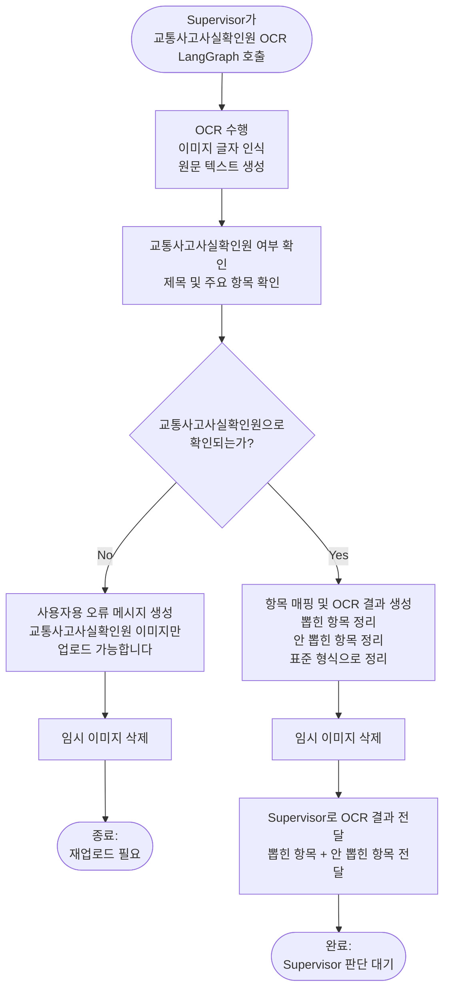

# 교통사고사실확인원 OCR LangGraph 계획 및 Output Schema 정의

## 1. 목적

교통사고사실확인원 OCR LangGraph는 경찰서에서 발급한 교통사고사실확인원 **1page 이미지**를 OCR 처리하고, 과실비율 분석 및 보고서 업데이트에 사용할 수 있도록 주요 사고 정보를 구조화하여 Supervisor에게 전달한다.

본 기능은 과실비율을 판단하는 Agent가 아니다.  
교통사고사실확인원 이미지를 읽고 필요한 항목을 추출한 뒤, 뽑힌 항목과 안 뽑힌 항목을 정리하여 Supervisor에게 전달하는 **OCR LangGraph**이다.

최종적으로 생성되는 Output Schema는 이후 **과실비율 분석 LangGraph 또는 과실비율 Agent가 공식 사고 기록으로 참고하는 입력 데이터**가 된다.

즉, 역할은 다음과 같이 구분한다.

| 구분 | 역할 |
|---|---|
| 교통사고사실확인원 OCR LangGraph | 문서 OCR, 문서 여부 확인, 주요 항목 추출, 누락 항목 정리 |
| Supervisor | OCR 결과를 보고 다음 노드 호출 여부 판단 |
| 과실비율 Agent / LangGraph | OCR로 추출된 공식 사고 기록과 사용자 진술, RAG 검색 결과를 함께 사용하여 과실비율 분석 |

---

## 2. 업로드 기준

MVP 단계에서는 사용자가 **교통사고사실확인원 1page 이미지만 업로드**하도록 안내한다.

2page 사고현장약도는 현재 단계에서 분석하지 않는다.  
약도는 도로 구조, 차량 진행 방향, 충돌 지점 등을 Vision 기반으로 해석해야 하므로, 추후 실제로 필요하다고 판단될 때 별도 Vision 분석 노드로 확장한다.

### 사용자 업로드 안내 문구

```text
경찰서에서 발급받은 교통사고사실확인원 첫 번째 페이지만 업로드해주세요.
두 번째 페이지의 사고현장약도는 현재 분석 대상이 아닙니다.
```

또는 짧게 표현하면 다음과 같다.

```text
교통사고사실확인원 1page 이미지를 업로드해주세요.
사고현장약도가 포함된 2page는 현재 단계에서 분석하지 않습니다.
```

### 지원 파일 형식과 입력 전달 방식

MVP에서는 테스트 폴더 `etl/fault_cases/src/OCR/raw/1page`에 있는 이미지처럼 `.jpg`, `.jpeg`, `.png`만 받는다.
API 입력 계약은 파일 경로가 아니라 `base64 + mime_type`으로 둔다.

| 확장자 | MIME 타입 | 처리 여부 |
|---|---|---:|
| `.jpg` | `image/jpeg` | 지원 |
| `.jpeg` | `image/jpeg` | 지원 |
| `.png` | `image/png` | 지원 |
| `.webp` | `image/webp` | MVP 제외 |
| `.pdf` | `application/pdf` | MVP 제외 |

base64를 사용하는 이유는 이미지 파일의 바이너리를 API 요청 본문에 안전하게 넣기 위해서다.
교통사고사실확인원은 개인정보가 포함될 수 있으므로, 외부 공개 URL을 만들어 모델에 전달하는 방식보다 base64 직접 전달이 더 적합하다.
또한 참고 구현인 `ai/agents/fine_notice_analysis/agent.py`도 이미지 입력을 base64 기반으로 처리하므로 기존 패턴을 가져오기 쉽다.

예상 입력 형태는 다음과 같다.

```text
data:image/png;base64,{base64_image}
data:image/jpeg;base64,{base64_image}
```

base64 외에도 base32, base58, base85 같은 인코딩은 있지만, 이미지 data URL과 Vision/OCR API 입력에서는 일반적으로 base64를 사용한다.
따라서 MVP에서는 다른 base 계열 인코딩을 고려하지 않는다.

예상 코드 흐름은 다음과 같다.

```python
from pathlib import Path
import base64

def encode_image_to_base64(path: str) -> tuple[str, str]:
    image_path = Path(path)
    suffix = image_path.suffix.lower()

    if suffix in [".jpg", ".jpeg"]:
        mime_type = "image/jpeg"
    elif suffix == ".png":
        mime_type = "image/png"
    else:
        raise ValueError(f"unsupported image type: {suffix}")

    encoded = base64.b64encode(image_path.read_bytes()).decode("utf-8")
    return encoded, mime_type
```

예상 결과는 다음과 같다.

```python
base64_image, mime_type = encode_image_to_base64("sample.png")

# mime_type == "image/png"
# base64_image == "iVBORw0KGgoAAAANSUhEUgAA..."
```

---

## 3. 처리 흐름

흐름도는 MVP 단계에서 단순하게 유지한다.  
세부 검증 기준, 2page deferred 처리, 개인정보 처리, failure_reason, quality 정보는 흐름도에 추가하지 않고 **스키마와 설명 문단에만 반영**한다.



### 실제 LangGraph 노드 구조

흐름도는 발표와 공유를 위해 단순하게 유지하지만, 실제 코드는 아래 두 노드로 나누는 것이 좋다.

```text
ocr_node
  - MIME 타입 확인
  - base64 디코딩 가능 여부 확인
  - GPT Vision/OCR 호출
  - JSON 파싱
  - 개인정보 1차 마스킹
  - 필드 정규화
  - success/partial/failed 1차 판정

document_verification_node
  - 제목/핵심 라벨/발급 문서 구조 점수 검증
  - 날짜, 숫자, 사고유형 enum 형식 검증
  - 최종 status 조정
  - Supervisor 전달 envelope 생성
```

라우팅은 아래처럼 둔다.

```text
ocr_node 결과가 failed이면 END
ocr_node 결과가 partial이어도 문서 검증이 가능하면 document_verification_node
ocr_node 결과가 success이면 document_verification_node
document_verification_node 이후 END
```

`partial`을 바로 종료하지 않는 이유는 이 문서에서 “교통사고사실확인원 여부 검증”이 중요하기 때문이다.
일부 필드가 누락되어도 제목, 사고 핵심 라벨, 경찰 발급 문서 구조가 확인되면 Supervisor가 추가 질문이나 재업로드 요청을 더 정확히 만들 수 있다.

---

## 4. 처리 흐름 설명

처리 흐름은 다음과 같이 단순하게 유지한다.

1. Supervisor가 교통사고사실확인원 OCR LangGraph를 호출한다.
2. OCR을 수행하여 이미지에서 원문 텍스트를 생성한다.
3. 제목과 주요 항목 라벨을 기준으로 교통사고사실확인원 여부를 확인한다.
4. 교통사고사실확인원이 아니면 사용자용 오류 메시지를 생성하고 재업로드가 필요하다는 결과를 반환한다.
5. 교통사고사실확인원으로 확인되면 주요 항목을 매핑하고 OCR 결과를 생성한다.
6. 뽑힌 항목과 안 뽑힌 항목을 표준 형식으로 정리한다.
7. 임시 이미지를 삭제한다.
8. Supervisor에게 OCR 결과를 전달한다.

---

## 5. 교통사고사실확인원 여부 확인 기준

교통사고사실확인원 여부는 단순히 문서 제목만으로 판단하지 않는다.  
OCR 결과에서 다음 세 가지 기준을 함께 확인하여 대상 문서 여부를 판단한다.

| 기준 | 확인 내용 | 판단 방식 |
|---|---|---|
| 1차 기준 | 제목 확인 | OCR 원문에 `교통사고사실확인원` 또는 유사 문구가 있는지 확인 |
| 2차 기준 | 사고 핵심 항목 라벨 확인 | `발생일시`, `발생장소`, `사고유형`, `사고원인`, `피해내용`, `사고내용` 중 일정 개수 이상 존재 |
| 3차 기준 | 경찰 발급 문서 구조 확인 | `교통사고 접수번호`, `발급번호`, `경찰서`, `용도`, `담당자`, `경찰서장` 등 발급 문서형 요소 확인 |

즉, 단순히 제목만 보는 것이 아니라 다음 3가지를 함께 확인한다.

```text
제목 + 사고 핵심 라벨 + 경찰 발급 문서 구조
```

### 5-1. 추천 판정 로직

이 판정 로직은 OCR을 한 번 더 수행하는 무거운 로직이 아니다.
GPT Vision/OCR 호출에서 이미 추출된 `document_name`, `detected_labels`, `issuer_labels`를 보고 가볍게 점수화하는 후처리 기준이다.
실제 구현은 `verification.py`의 작은 함수로 들어가면 충분하다.

```text
교통사고사실확인원 판정 기준

1. 제목 기준
- "교통사고사실확인원" 문구가 있으면 +1

2. 사고 항목 라벨 기준
- 발생일시
- 발생장소
- 사고유형
- 사고원인
- 피해내용
- 사고내용

위 6개 중 4개 이상 확인되면 +1

3. 발급 문서 구조 기준
- 교통사고 접수번호
- 발급번호
- 경찰서
- 용도
- 담당자
- 경찰서장

위 항목 중 2개 이상 확인되면 +1

총 3점 중 2점 이상이면 교통사고사실확인원으로 판단한다.
단, 제목이 없고 나머지 기준만 충족한 경우에는 문서가 잘렸거나 제목 인식이 실패했을 수 있으므로 바로 success로 보지 않는다.
이 경우에는 `partial`로 두고 Supervisor가 사용자에게 “교통사고사실확인원 1page가 맞는지” 확인하거나, 필요하면 재업로드를 요청하게 한다.
```

즉, 제목이 없다는 이유만으로 무조건 failed는 아니다.
다만 제목이 없으면 대상 문서 확신도가 낮아지므로 `success`보다 조심스럽게 처리한다는 의미다.

### 5-2. 제목만으로 판단하지 않는 이유

제목만 기준으로 하면 다음과 같은 이미지가 잘못 통과될 수 있다.

```text
교통사고사실확인원 발급 안내문
교통사고사실확인원 신청서
블로그 캡처
정부24 안내 화면
보험사 제출 안내문
```

이런 이미지에도 “교통사고사실확인원”이라는 단어가 포함될 수 있다.  
따라서 실제 확인원 1page에 포함되는 사고 항목 라벨과 경찰 발급 문서 구조를 함께 확인해야 한다.

진짜 교통사고사실확인원 1page라면 보통 아래 항목들이 함께 나타난다.

```text
발생일시
발생장소
사고유형
사고원인
피해내용
사고내용
용도
담당자
```

이 조합이 확인되면 단순 안내문이 아니라 실제 확인원일 가능성이 높다.

---

## 6. 1page / 2page 처리 기준

교통사고사실확인원은 1page 본문과 2page 사고현장약도로 구성될 수 있다.

MVP 단계에서는 1page를 OCR의 핵심 대상으로 본다.  
1page에서 사고일시, 사고장소, 사고유형, 사고원인, 피해내용, 사고내용 등 과실비율 분석에 필요한 공식 사고 기록을 추출한다.

2page 사고현장약도는 현재 단계에서 이미지 분석을 수행하지 않는다.  
약도는 도로 구조, 차량 진행 방향, 충돌 지점 등을 Vision 기반으로 해석해야 하므로, 추후 실제로 필요하다고 판단될 때 별도 Vision 분석 노드로 확장한다.

따라서 현재 스키마에는 2page를 분석하지 않았다는 상태만 남긴다.

```json
{
  "scene_diagram": {
    "page_2_exists": false,
    "analysis_status": "not_provided",
    "reason": "MVP 단계에서는 1page만 업로드 대상으로 설정",
    "raw_image_ref": null
  }
}
```

만약 사용자가 2page까지 함께 업로드한 경우에도 MVP 단계에서는 다음과 같이 기록만 한다.

```json
{
  "scene_diagram": {
    "page_2_exists": true,
    "analysis_status": "deferred",
    "reason": "MVP 단계에서는 사고현장약도 Vision 분석 제외",
    "raw_image_ref": null
  }
}
```

---

## 7. 반환 상태 기준

OCR LangGraph는 다음 세 가지 상태 중 하나로 결과를 반환한다.

| status | 의미 |
|---|---|
| success | 교통사고사실확인원으로 확인되었고 주요 항목이 정상 추출된 상태 |
| partial | 교통사고사실확인원으로 확인되었지만 일부 항목이 누락된 상태 |
| failed | 교통사고사실확인원으로 확인되지 않거나 OCR 처리가 불가능한 상태 |

실패 상태에서는 실패 원인을 구분하기 위해 `failure_reason`을 함께 반환한다.

구현 시 `success`, `partial`, `failed`와 `failure_reason` 문자열은 각 파일에 직접 반복해서 쓰지 않고
`constants.py`에서 공통 상수로 관리한다.
이렇게 하는 이유는 `agent.py`, `evaluator.py`, `verification.py`, `graph.py`에서 같은 상태값을 반복해서 사용할 때
`"sucess"`, `"faild"`, `"ocr_faild"` 같은 오타로 분기 로직이 깨지는 것을 막기 위해서다.

예상 상수 구조:

```python
STATUS_SUCCESS = "success"
STATUS_PARTIAL = "partial"
STATUS_FAILED = "failed"

FAILURE_REASON_UNSUPPORTED_FILE_TYPE = "unsupported_file_type"
FAILURE_REASON_INVALID_IMAGE_PAYLOAD = "invalid_image_payload"
FAILURE_REASON_NOT_TARGET_DOCUMENT = "not_target_document"
FAILURE_REASON_PAGE_1_NOT_FOUND = "page_1_not_found"
FAILURE_REASON_LOW_IMAGE_QUALITY = "low_image_quality"
FAILURE_REASON_OCR_FAILED = "ocr_failed"
FAILURE_REASON_PRIVACY_FILTER_FAILED = "privacy_filter_failed"
```

| failure_reason | 의미 |
|---|---|
| not_target_document | 교통사고사실확인원이 아닌 문서 |
| low_image_quality | 이미지 품질 문제로 OCR이 어려운 경우 |
| ocr_failed | OCR 처리 자체가 실패한 경우 |
| page_1_not_found | 교통사고사실확인원 1page를 확인하지 못한 경우 |
| unsupported_file_type | 지원하지 않는 파일 형식 |

에러 코드는 아래 의미로 통일한다.

| failure_reason | 발생 조건 | Supervisor 권장 처리 |
|---|---|---|
| `unsupported_file_type` | MIME 또는 확장자가 `image/jpeg`, `image/png`가 아님 | jpg/png 이미지 재업로드 요청 |
| `invalid_image_payload` | base64가 깨졌거나 이미지로 디코딩할 수 없음 | 이미지 재업로드 요청 |
| `not_target_document` | OCR 결과상 교통사고사실확인원으로 보기 어려움 | 교통사고사실확인원 1page 재업로드 요청 |
| `page_1_not_found` | 2page 약도 또는 다른 페이지로 보이고 1page 본문이 확인되지 않음 | 첫 번째 페이지 재업로드 요청 |
| `low_image_quality` | 문서가 맞아 보이나 핵심 영역이 흐림/잘림/가림 등으로 읽기 어려움 | 더 선명하게 다시 촬영해달라고 요청 |
| `ocr_failed` | 모델 호출 실패, 응답 파싱 실패, 예상 JSON 구조 불일치 | 재시도 또는 재업로드 요청 |
| `privacy_filter_failed` | 개인정보 제거/마스킹 후에도 민감정보가 결과에 남을 가능성이 있음 | 저장 보류, 사용자 재업로드 또는 관리자 확인 |

`failed`는 사용자가 잘못했다는 의미가 아니라, 현재 입력만으로 후속 과실비율 Agent가 신뢰할 수 있는 사고 기록을 만들 수 없다는 의미다.

상태 판정은 문서 여부와 필드 누락 정도를 함께 본다.
모든 필드를 동일하게 취급하면 접수번호 하나가 누락되어도 전체 실패가 되거나,
반대로 사고내용이 빠졌는데도 성공으로 처리되는 문제가 생긴다.
따라서 과실비율 Agent가 직접 쓰는 필드는 `critical`, 문서 식별이나 보조 설명에 가까운 필드는 `important`로 나눈다.

```python
CRITICAL_FIELDS = [
    "accident_datetime",
    "accident_location",
    "accident_type.value",
    "accident_description",
]

IMPORTANT_FIELDS = [
    "receipt_number",
    "issue_number",
    "police_station",
    "accident_cause",
    "damage.raw_text",
    "usage",
]
```

| 조건 | status | 이유 |
|---|---|---|
| 대상 문서가 아니거나 OCR 호출/파싱 실패 | failed | 후속 Agent가 신뢰할 수 있는 사고 기록이 없음 |
| 대상 문서이고 critical 필드가 모두 있음 | success | 과실비율 분석에 필요한 최소 사고 사실 확보 |
| 대상 문서이나 critical 또는 important 일부 누락 | partial | 추가 질문, 재업로드, 사용자 확인으로 보완 가능 |

`partial`은 실패가 아니다.
Supervisor가 부족한 항목을 사용자에게 확인하거나, 기존 대화 내용으로 보완할 수 있는 상태다.

---

## 8. OCR LangGraph Output Schema

```json
{
  "node_code": "traffic_accident_confirmation_ocr",
  "status": "success | partial | failed",
  "document_type": "traffic_accident_confirmation | unknown",
  "message": "OCR 처리 결과 요약 메시지",
  "failure_reason": null,

  "structured_result": {
    "document_check": {
      "is_target_document": true,
      "document_name": "교통사고사실확인원",
      "reason": "제목, 사고 핵심 라벨, 경찰 발급 문서 구조 기준 확인",
      "verification_score": 3,
      "verification_criteria": {
        "title_matched": true,
        "accident_labels_matched_count": 6,
        "issuer_structure_matched_count": 4
      }
    },

    "page_info": {
      "page_1_processed": true,
      "page_2_exists": false
    },

    "extracted_fields": {
      "receipt_number": null,
      "issue_number": null,
      "police_station": null,

      "accident_datetime": null,
      "accident_location": null,

      "accident_type": {
        "value": null,
        "raw_text": null
      },

      "accident_cause": null,

      "damage": {
        "raw_text": null,
        "death_count": null,
        "injury_count": null,
        "property_damage_amount": null
      },

      "accident_description": null,
      "usage": null
    },

    "scene_diagram": {
      "page_2_exists": false,
      "analysis_status": "not_provided | deferred",
      "reason": "MVP 단계에서는 사고현장약도 Vision 분석 제외",
      "raw_image_ref": null
    },

    "missing_fields": []
  },

  "quality": {
    "ocr_confidence": null,
    "image_quality": "readable | low | unreadable",
    "warnings": []
  },

  "privacy": {
    "masking_applied": true,
    "excluded_sensitive_fields": [
      "resident_registration_number",
      "driver_license_number"
    ],
    "masked_fields": [
      "name",
      "address",
      "phone_number",
      "vehicle_number",
      "owner_name"
    ]
  },

  "limitations": []
}
```

### OCR 결과 파일 저장 기준

OCR LangGraph의 1차 결과는 Supervisor에 envelope 형태로 반환한다.
동시에 추출 결과를 나중에 확인하거나 테스트 결과를 비교할 수 있도록 아래 경로에 JSON artifact로 저장한다.

```text
etl/fault_cases/artifacts/OCR_output/
```

저장 대상은 원본 이미지가 아니라 구조화된 OCR 결과다.
원본 이미지나 개인정보가 포함된 raw OCR text를 그대로 저장하면 개인정보 노출 위험이 커지므로 저장하지 않는다.

권장 파일명은 다음 형식으로 둔다.

```text
{yyyyMMdd_HHmmss_SSS}_{source_stem}_{status}_{short_id}.json
```

예시는 다음과 같다.

```text
20260708_153012_251_15-07-18-광주광역시_success_a1b2c3d4.json
20260708_153220_104_24-00-00-경기도부천시_partial_e5f6a7b8.json
20260708_153455_889_unknown_failed_c9d0e1f2.json
```

초 단위 timestamp만 쓰면 같은 초에 여러 이미지가 처리될 때 파일명이 충돌할 수 있다.
따라서 millisecond와 짧은 UUID를 붙여 덮어쓰기를 방지한다.

저장 JSON에는 아래 항목을 포함한다.

| 항목 | 저장 여부 | 이유 |
|---|---:|---|
| `node_code` | 저장 | 어떤 Agent 결과인지 식별 |
| `status` | 저장 | success/partial/failed 테스트 비교 |
| `document_type` | 저장 | 대상 문서 판정 결과 확인 |
| `structured_result` | 저장 | 실제 추출 필드 확인 |
| `missing_fields` | 저장 | partial 원인 확인 |
| `quality` | 저장 | 이미지 품질/경고 확인 |
| `privacy` | 저장 | 마스킹 적용 여부 확인 |
| `limitations` | 저장 | 후속 Agent 전달 제한사항 확인 |
| `document_image` | 저장하지 않음 | 원본 이미지 base64 저장 방지 |
| raw OCR text | 기본 저장하지 않음 | 개인정보 노출 방지 |

예상 저장 코드 흐름은 다음과 같다.

```python
from datetime import datetime
from pathlib import Path
import json
import uuid

OUTPUT_DIR = Path("etl/fault_cases/artifacts/OCR_output")

def save_ocr_output(result: dict, source_filename: str | None) -> str:
    OUTPUT_DIR.mkdir(parents=True, exist_ok=True)

    source_stem = Path(source_filename or "unknown").stem
    status = result.get("status", "unknown")
    timestamp = datetime.now().strftime("%Y%m%d_%H%M%S_%f")[:-3]
    short_id = uuid.uuid4().hex[:8]
    output_path = OUTPUT_DIR / f"{timestamp}_{source_stem}_{status}_{short_id}.json"

    safe_result = dict(result)
    safe_result.pop("document_image", None)

    output_path.write_text(
        json.dumps(safe_result, ensure_ascii=False, indent=2),
        encoding="utf-8",
    )
    return str(output_path)
```

예상 실행 결과는 다음과 같다.

```text
saved_output_path: etl/fault_cases/artifacts/OCR_output/20260708_153012_251_sample_success_a1b2c3d4.json
```

---

## 9. extracted_fields 설명

| 필드명 | 의미 |
|---|---|
| receipt_number | 교통사고 접수번호 |
| issue_number | 발급번호 |
| police_station | 담당 경찰서 |
| accident_datetime | 사고 발생 일시 |
| accident_location | 사고 발생 장소 |
| accident_type.value | 사고유형 정리값 |
| accident_type.raw_text | 사고유형 OCR 원문 |
| accident_cause | 사고원인 |
| damage.raw_text | 피해내용 OCR 원문 |
| damage.death_count | 사망자 수 |
| damage.injury_count | 부상자 수 |
| damage.property_damage_amount | 물적 피해 금액 |
| accident_description | 사고내용 |
| usage | 발급 용도 |

기존에 고려했던 `person_role`은 제외한다.  
최신 교통사고사실확인원 양식에서 가해자/피해자 구분은 항상 존재하는 필드가 아니므로, OCR 필수 추출 항목으로 두지 않는다.

---

## 10. 과실비율 Agent 사용 관점의 핵심 필드

OCR LangGraph의 Output은 이후 과실비율 Agent가 참고할 수 있는 공식 사고 기록이다.  
따라서 과실비율 Agent 입장에서 중요한 필드는 다음과 같이 나눌 수 있다.

### 10-1. 과실비율 분석에 직접 사용되는 필드

| 필드 | 사용 목적 |
|---|---|
| accident_datetime | 사고 시점 확인, 야간/주간 여부 등 추가 판단 가능 |
| accident_location | 도로 유형, 교차로, 고속도로, 주차장 등 사고 장소 판단의 단서 |
| accident_type.value | 차대차, 차량단독, 차대사람 등 기본 사고 유형 분류 |
| accident_cause | 경찰 기록상 사고원인 확인 |
| damage.raw_text | 인피/물피 등 피해 내용 확인 |
| accident_description | 과실비율 분석의 핵심 사고 설명 |
| scene_diagram.analysis_status | 약도 분석이 포함되었는지 여부 확인 |

### 10-2. 보고서 업데이트 또는 문서 식별에 사용되는 필드

| 필드 | 사용 목적 |
|---|---|
| receipt_number | 교통사고 접수번호 기록 |
| issue_number | 발급번호 기록 |
| police_station | 담당 경찰서 기록 |
| usage | 발급 용도 기록 |
| document_check | OCR 결과 신뢰 여부 확인 |
| quality | OCR 품질 및 경고 확인 |
| missing_fields | 사용자 추가 질문 생성에 활용 |

### 10-3. 과실비율 Agent가 직접 사용하지 않는 개인정보성 필드

| 항목 | 처리 |
|---|---|
| 성명 | 필요 시 마스킹 |
| 주민등록번호 | Supervisor 전달 결과에서 제외 |
| 주소 | 필요 시 마스킹 |
| 전화번호 | 필요 시 마스킹 |
| 운전면허번호 | Supervisor 전달 결과에서 제외 |
| 차량번호 | 필요 시 마스킹 |
| 소유자명 | 필요 시 마스킹 |

---

## 11. success 반환 예시

```json
{
  "node_code": "traffic_accident_confirmation_ocr",
  "status": "success",
  "document_type": "traffic_accident_confirmation",
  "message": "교통사고사실확인원 OCR 처리가 완료되었습니다.",
  "failure_reason": null,

  "structured_result": {
    "document_check": {
      "is_target_document": true,
      "document_name": "교통사고사실확인원",
      "reason": "제목, 사고 핵심 라벨, 경찰 발급 문서 구조 기준 확인",
      "verification_score": 3,
      "verification_criteria": {
        "title_matched": true,
        "accident_labels_matched_count": 6,
        "issuer_structure_matched_count": 4
      }
    },

    "page_info": {
      "page_1_processed": true,
      "page_2_exists": false
    },

    "extracted_fields": {
      "receipt_number": "2026-000000",
      "issue_number": "제2026-000000호",
      "police_station": "○○경찰서",

      "accident_datetime": "2026.06.25 14:30",
      "accident_location": "서울시 ○○구 ○○로",

      "accident_type": {
        "value": "차대차",
        "raw_text": "■ 차대차 □ 차량단독 □ 차대사람 □ 기타"
      },

      "accident_cause": "안전운전의무 위반",

      "damage": {
        "raw_text": "부상 1명, 물피 있음",
        "death_count": 0,
        "injury_count": 1,
        "property_damage_amount": null
      },

      "accident_description": "교차로에서 직진 차량과 좌회전 차량이 충돌한 사고",
      "usage": "보험회사 제출용"
    },

    "scene_diagram": {
      "page_2_exists": false,
      "analysis_status": "not_provided",
      "reason": "MVP 단계에서는 1page만 업로드 대상으로 설정",
      "raw_image_ref": null
    },

    "missing_fields": []
  },

  "quality": {
    "ocr_confidence": null,
    "image_quality": "readable",
    "warnings": []
  },

  "privacy": {
    "masking_applied": true,
    "excluded_sensitive_fields": [
      "resident_registration_number",
      "driver_license_number"
    ],
    "masked_fields": [
      "name",
      "address",
      "phone_number",
      "vehicle_number",
      "owner_name"
    ]
  },

  "limitations": [
    "2page 사고현장약도는 현재 단계에서 분석하지 않았습니다."
  ]
}
```

---

## 12. partial 반환 예시

```json
{
  "node_code": "traffic_accident_confirmation_ocr",
  "status": "partial",
  "document_type": "traffic_accident_confirmation",
  "message": "교통사고사실확인원으로 확인되었으나 일부 항목이 누락되었습니다.",
  "failure_reason": null,

  "structured_result": {
    "document_check": {
      "is_target_document": true,
      "document_name": "교통사고사실확인원",
      "reason": "제목과 주요 항목 라벨은 확인되었으나 일부 발급 문서 구조 항목이 부족합니다.",
      "verification_score": 2,
      "verification_criteria": {
        "title_matched": true,
        "accident_labels_matched_count": 4,
        "issuer_structure_matched_count": 1
      }
    },

    "page_info": {
      "page_1_processed": true,
      "page_2_exists": false
    },

    "extracted_fields": {
      "receipt_number": null,
      "issue_number": null,
      "police_station": "○○경찰서",

      "accident_datetime": "2026.06.25 14:30",
      "accident_location": "서울시 ○○구 ○○로",

      "accident_type": {
        "value": "차대차",
        "raw_text": "차대차"
      },

      "accident_cause": null,

      "damage": {
        "raw_text": "부상 1명, 물피 있음",
        "death_count": null,
        "injury_count": 1,
        "property_damage_amount": null
      },

      "accident_description": "교차로에서 직진 차량과 좌회전 차량이 충돌한 사고",
      "usage": null
    },

    "scene_diagram": {
      "page_2_exists": false,
      "analysis_status": "not_provided",
      "reason": "2page 사고현장약도 이미지가 업로드되지 않았습니다.",
      "raw_image_ref": null
    },

    "missing_fields": [
      "receipt_number",
      "issue_number",
      "accident_cause",
      "usage"
    ]
  },

  "quality": {
    "ocr_confidence": null,
    "image_quality": "readable",
    "warnings": [
      "일부 항목 라벨 또는 값이 흐리게 인식되었습니다."
    ]
  },

  "privacy": {
    "masking_applied": true,
    "excluded_sensitive_fields": [
      "resident_registration_number",
      "driver_license_number"
    ],
    "masked_fields": [
      "name",
      "address",
      "phone_number",
      "vehicle_number",
      "owner_name"
    ]
  },

  "limitations": [
    "접수번호, 발급번호, 사고원인, 용도는 OCR 결과에서 확인되지 않았습니다.",
    "2page 사고현장약도는 업로드되지 않았습니다."
  ]
}
```

---

## 13. failed 반환 예시

```json
{
  "node_code": "traffic_accident_confirmation_ocr",
  "status": "failed",
  "document_type": "unknown",
  "message": "교통사고사실확인원 이미지만 업로드 가능합니다.",
  "failure_reason": "not_target_document",

  "structured_result": {
    "document_check": {
      "is_target_document": false,
      "document_name": "unknown",
      "reason": "교통사고사실확인원 제목, 사고 핵심 라벨, 경찰 발급 문서 구조를 충분히 확인하지 못했습니다.",
      "verification_score": 0,
      "verification_criteria": {
        "title_matched": false,
        "accident_labels_matched_count": 0,
        "issuer_structure_matched_count": 0
      }
    },

    "page_info": {
      "page_1_processed": false,
      "page_2_exists": false
    },

    "extracted_fields": {
      "receipt_number": null,
      "issue_number": null,
      "police_station": null,

      "accident_datetime": null,
      "accident_location": null,

      "accident_type": {
        "value": null,
        "raw_text": null
      },

      "accident_cause": null,

      "damage": {
        "raw_text": null,
        "death_count": null,
        "injury_count": null,
        "property_damage_amount": null
      },

      "accident_description": null,
      "usage": null
    },

    "scene_diagram": {
      "page_2_exists": false,
      "analysis_status": "not_provided",
      "reason": null,
      "raw_image_ref": null
    },

    "missing_fields": [
      "traffic_accident_confirmation_document"
    ]
  },

  "quality": {
    "ocr_confidence": null,
    "image_quality": "unknown",
    "warnings": []
  },

  "privacy": {
    "masking_applied": false,
    "excluded_sensitive_fields": [],
    "masked_fields": []
  },

  "limitations": [
    "업로드된 이미지에서 교통사고사실확인원으로 확인 가능한 제목, 주요 항목 라벨, 발급 문서 구조를 찾지 못했습니다."
  ]
}
```

---

## 14. 개인정보 처리 기준

교통사고사실확인원에는 성명, 주민등록번호, 주소, 전화번호, 운전면허번호, 차량번호, 소유자명 등이 포함될 수 있다.

그러나 과실비율 분석에 직접 필요한 항목은 사고일시, 사고장소, 사고유형, 사고원인, 피해내용, 사고내용 중심이다.

따라서 개인정보 처리 원칙은 다음과 같다.

- 원본 이미지는 영구 저장하지 않는다.
- OCR 처리 후 임시 이미지는 삭제한다.
- 주민등록번호와 운전면허번호는 Supervisor 전달 결과에서 제외한다.
- 성명, 주소, 전화번호, 차량번호, 소유자명은 필요 시 마스킹한다.
- Supervisor에는 과실비율 분석에 필요한 사고 사실 정보 중심으로 전달한다.
- 개인정보가 포함된 raw OCR text 저장 여부는 별도 정책으로 제한한다.

개인정보 정책에서 가장 중요한 구분은 `사고 장소`와 `사람의 주소`가 다르다는 점이다.
사고 장소는 사고 정황과 도로 상황 판단에 필요하므로 추출해야 하지만,
거주지 주소나 차량 소유자 주소는 과실비율 판단에 직접 필요하지 않으므로 추출하지 않는다.

추출해야 하는 정보는 다음으로 제한한다.

| 필드 | 추출 여부 | 이유 |
|---|---:|---|
| 사고 일시 | 추출 | 사고 정황 판단의 핵심 |
| 사고 장소 | 추출 | 사고 지점/도로 상황 판단에 필요 |
| 사고 유형 | 추출 | 차대차, 차대사람, 단독사고 등 분류 필요 |
| 사고 원인 | 추출 | 신호위반, 안전거리, 진로변경 등 판단 근거 |
| 피해 내용 | 추출 | 인적/물적 피해 여부 확인 |
| 사고 개요 | 추출 | 과실 판단 Agent에 전달할 핵심 문장 |
| 접수번호/발급번호 | 선택 추출 | 문서 식별용 메타데이터 |
| 경찰서/발급기관 | 선택 추출 | 문서 신뢰도 확인용 메타데이터 |

추출하지 않거나 마스킹해야 하는 정보는 다음과 같다.

| 정보 | 기본 정책 | 이유 |
|---|---|---|
| 성명 | 제외 또는 마스킹 | 과실 판단에 직접 필요하지 않음 |
| 주민등록번호 | 제외 | 민감정보 |
| 운전면허번호 | 제외 | 민감정보 |
| 전화번호 | 제외 | 연락처 개인정보 |
| 거주지 주소 | 제외 | 사고 장소와 다름 |
| 소유자 주소 | 제외 | 과실 판단에 불필요 |
| 차량번호 | 기본 제외, 필요 시 마스킹 | 차량 식별정보 |
| 소유자명 | 제외 또는 마스킹 | 과실 판단에 불필요 |

프롬프트에는 다음 지침을 넣는다.

```text
주민등록번호, 운전면허번호, 성명, 전화번호, 거주지 주소, 소유자 주소, 차량번호, 소유자명은 추출하지 마세요.
사고 발생 장소는 추출하되, 사람의 주소나 연락처는 추출하지 마세요.
불필요한 개인정보가 보이면 값으로 저장하지 말고 null로 두세요.
```

코드 후처리에서도 `fine_notice_analysis/masking.py`처럼 정규식 기반 마스킹 함수를 두어,
모델이 실수로 개인정보를 반환하더라도 저장 전 한 번 더 제거한다.

예상 마스킹 예시는 다음과 같다.

```python
masked = mask_sensitive_text("홍길동 010-1234-5678 서울시 ... 12가3456")

# "홍*동 010-****-**** 서울시 ... **가****"
```

이미지 저장 정책은 다음과 같이 둔다.

- Agent 상태에는 `document_image = None`을 기본값으로 둔다.
- 원본 이미지는 영구 저장하지 않는다.
- 테스트용 raw 폴더의 원본은 입력 데이터로만 사용한다.
- 임시 파일을 만들었다면 처리 후 삭제한다.
- 전체 OCR 원문 로그는 기본 저장하지 않는다.
- 디버깅이 필요하면 마스킹된 로그만 남긴다.

---

## 15. Supervisor 전달 기준

OCR LangGraph는 결과를 직접 판단하거나 과실비율을 계산하지 않는다.

OCR LangGraph의 역할은 다음으로 제한한다.

- 교통사고사실확인원 이미지 OCR 수행
- 교통사고사실확인원 여부 확인
- 주요 항목 추출
- 뽑힌 항목과 안 뽑힌 항목 정리
- 개인정보 제외 또는 마스킹
- 2page 사고현장약도 분석 보류 상태 기록
- Supervisor가 사용할 수 있는 구조화 결과 반환

Supervisor는 OCR 결과를 기반으로 다음 단계를 결정한다.

- 기존 보고서 업데이트
- 추가 질문 생성
- 부족한 항목 사용자 확인
- 과실비율 분석 LangGraph 또는 관련 노드 호출
- 추후 필요 시 2page Vision 분석 노드 호출

---

## 16. 과실비율 Agent 전달 시 주의사항

OCR 결과는 과실비율 분석의 참고 자료이지, 그 자체로 과실비율을 확정하는 근거가 아니다.

과실비율 Agent는 다음 자료를 함께 사용해야 한다.

- OCR로 추출된 교통사고사실확인원 공식 사고 기록
- 사용자가 챗봇 대화에서 입력한 사고 경위
- 추가 질문으로 보완된 사고 정보
- RAG로 검색한 과실비율 기준, 판례, 분쟁심의 사례
- 필요 시 사고현장약도 Vision 분석 결과

따라서 OCR Output Schema는 과실비율 Agent가 사용할 수 있도록 구조화하되, 다음 제한사항을 함께 전달해야 한다.

- OCR 결과는 이미지 품질에 따라 누락 또는 오인식이 발생할 수 있다.
- 교통사고사실확인원 1page만으로 차량 진행 방향, 충돌 지점, 도로 구조를 모두 알 수 없다.
- 2page 사고현장약도는 MVP 단계에서 분석하지 않는다.
- 과실비율 최종 판단은 OCR 결과만으로 수행하지 않는다.
- OCR 결과와 사용자 진술이 충돌할 경우 Supervisor 또는 과실비율 Agent가 추가 확인 질문을 생성해야 한다.

---

## 17. 본 이슈 범위

본 이슈는 교통사고사실확인원 OCR LangGraph의 결과 스키마 정의와 기본 계획을 범위로 한다.

### 포함 범위

- 교통사고사실확인원 여부 확인
- OCR 결과 구조화
- 뽑힌 항목 / 안 뽑힌 항목 정리
- Supervisor 전달용 결과 스키마 정의
- 개인정보 처리 기준 정의
- 2page 사고현장약도 deferred 처리
- 과실비율 Agent가 사용할 수 있는 OCR Output 구조 정의

### 제외 범위

- 과실비율 판단
- 사고 경위 대화형 질문
- 1차 보고서 생성
- 보고서 업데이트 실제 수행
- 법률 판단 또는 소송 가능성 판단
- 2page 사고현장약도 Vision 분석
- 사고현장약도 기반 도로 구조, 차량 진행 방향, 충돌 지점 판단

---

## 18. 요약

교통사고사실확인원 OCR LangGraph는 과실비율 분석을 직접 수행하지 않는다.

이 LangGraph는 경찰서 발급 교통사고사실확인원 1page 이미지를 OCR 처리하고, 과실비율 분석과 보고서 업데이트에 필요한 공식 사고 기록을 구조화하여 Supervisor에게 전달하는 역할만 수행한다.

흐름도는 Supervisor 호출, OCR 수행, 교통사고사실확인원 여부 확인, 항목 매핑, 임시 이미지 삭제, Supervisor 결과 전달의 단순 흐름으로 유지한다.

교통사고사실확인원 여부는 단순히 제목만으로 판단하지 않고, `제목`, `사고 핵심 항목 라벨`, `경찰 발급 문서 구조`의 세 가지 기준을 함께 확인한다.

2page 사고현장약도는 MVP 단계에서 분석하지 않고, 존재 여부와 분석 보류 상태만 결과 스키마에 남긴다.

최종 Output Schema는 이후 과실비율 Agent가 공식 사고 기록으로 참고할 수 있도록 설계하되, OCR 결과만으로 과실비율을 확정하지 않도록 제한사항을 함께 전달한다.

---

## 19. 계획 검토 결과

현재 계획은 역할 분리, 1page 중심 MVP, 2page 사고현장약도 deferred 처리, 개인정보 마스킹 원칙이 잘 잡혀 있다.  
초기 검토에서 부족했던 항목은 아래 섹션에 반영했다.

### 19-1. 현재 계획에서 좋은 점

- OCR LangGraph가 과실비율 판단을 하지 않는다고 명확히 분리했다.
- 교통사고사실확인원 여부를 제목 하나로만 판단하지 않고, 제목 + 사고 핵심 라벨 + 경찰 발급 문서 구조를 함께 본다.
- 2page 사고현장약도는 MVP에서 분석하지 않고, 향후 Vision 노드로 분리한다.
- 개인정보를 Supervisor 전달 결과에서 제외하거나 마스킹한다는 원칙이 있다.
- 과실비율 Agent가 OCR 결과를 참고 자료로만 사용해야 한다는 제한사항이 명확하다.

### 19-2. 반영 완료된 체크포인트

| 항목 | 반영 위치 | 반영 내용 |
|---|---|---|
| 입력 계약 | `2. 업로드 기준`, `21-1. 입력 State` | `image/jpeg`, `image/png`, base64 + MIME 입력 계약 명시 |
| 상태값 기준 | `7. 반환 상태 기준`, `22. 상태 판정 기준 상세` | critical/important 필드와 success/partial/failed 기준 정의 |
| LangGraph 노드 구조 | `3. 처리 흐름`, `30-2. graph.py` | `ocr_node -> document_verification_node -> END` 구조 명시 |
| Supervisor envelope | `15. Supervisor 전달 기준`, `24. Supervisor 전달 Envelope 기준` | `agent_results[node_code]` 표준 envelope 정의 |
| OCR 프롬프트 | `23. OCR 프롬프트 기준`, `30-4. prompts.py` | JSON only, null 처리, 환각 방지, 개인정보 제외 규칙 명시 |
| 파일 정리 | `8. OCR 결과 파일 저장 기준`, `14. 개인정보 처리 기준` | output JSON 저장 위치, 원본/base64 미저장, raw text 미저장 기준 정의 |
| 테스트 기준 | `26. 테스트 계획 및 비용 관리` | 지정 JPG/PNG/잘린 JPG 샘플과 추출 결과 품질 테스트 정의 |
| RAG 입력 연결 | `25. 과실비율 Agent 연결용 최소 OCR Evidence` | 후속 과실비율 Agent에 넘길 최소 필드 정의 |

---

## 20. 권장 폴더 구조

참고 구현인 `ai/agents/fine_notice_analysis`는 OCR Agent를 `agent.py`, `graph.py`, `state.py`, `prompts.py`, `verification.py`, `masking.py`, `utils.py`, `evaluator.py`로 분리한다.  
교통사고사실확인원 OCR도 같은 패턴을 따르는 것이 좋다.

### 20-1. 현재 관련 폴더

```text
etl/fault_cases/src/OCR/
├─ traffic_accident_confirmation_ocr_langgraph_plan.md
└─ raw/
   └─ 1page/
      ├─ *.jpg
      └─ *.png

etl/fault_cases/artifacts/
└─ OCR_output/
   └─ *.json

etl/fault_cases/Fault_cases_MD/흐름도/
└─ 교통사고사실확인원이 OCR LangGraph 프로세스 흐름도.md

ai/agents/fine_notice_analysis/
├─ agent.py
├─ evaluator.py
├─ graph.py
├─ masking.py
├─ prompts.py
├─ state.py
├─ utils.py
└─ verification.py
```

### 20-2. 구현 시 권장 생성 위치

현재 단계에서는 PM 확인 전이므로 OCR 구현 코드는 `ai/agents`가 아니라 `etl/fault_cases/src/OCR` 아래에 둔다.
나중에 PM이 전체 Agent 구조를 확인한 뒤 필요하면 `ai/agents` 쪽으로 이동한다.
`ai/agents/fine_notice_analysis`는 코드 구조를 참고하는 위치이지, 이번 OCR 코드를 바로 생성할 위치가 아니다.
`etl/fault_cases/src/OCR/raw/1page`는 개발/테스트 샘플 이미지 보관 위치로 유지한다.
`etl/fault_cases/artifacts/OCR_output`은 OCR 추출 결과 JSON 저장 위치로 사용한다.

```text
etl/fault_cases/src/OCR/traffic_accident_confirmation_ocr/
├─ __init__.py
├─ agent.py          # 이미지 입력 검증, OCR/Vision 호출, 1차 필드 추출
├─ evaluator.py      # success/partial/failed 판정
├─ graph.py          # LangGraph 구성 및 fallback graph
├─ masking.py        # 개인정보 마스킹
├─ prompts.py        # OCR JSON 추출 프롬프트
├─ state.py          # State TypedDict와 Literal 상태 정의
├─ utils.py          # envelope, agent_results 업데이트
└─ verification.py   # 문서 여부/형식/정규화 검증

etl/fault_cases/src/OCR/raw/1page/
├─ 17-10-16-서울노원구.png
├─ 15-07-18-광주광역시.jpg
├─ ...
└─ 24-00-00-경기도부천시.jpg

etl/fault_cases/artifacts/OCR_output/
├─ 20260708_153012_251_17-10-16-서울노원구_success_a1b2c3d4.json
├─ 20260708_153220_104_15-07-18-광주광역시_partial_e5f6a7b8.json
└─ ...
```

### 20-3. OCR 구현 진행 순서

폴더 구조를 먼저 확인한 뒤에는 아래 순서로 진행하는 것이 좋다.  
이 순서는 `fine_notice_analysis`의 기존 구조를 참고하되, 교통사고사실확인원 OCR에 필요한 입력 계약과 Supervisor 전달 규격을 먼저 고정하는 흐름이다.

#### 전체 단계

| 단계 | 작업 | 이유 | 완료 기준 |
|---:|---|---|---|
| 1 | 입력 기준 확정 | jpg/png를 모두 받아야 하므로 파일 형식과 입력 형태를 먼저 고정해야 한다. | `image/jpeg`, `image/png` 지원, 입력은 base64 + mime_type |
| 2 | OCR 구현 폴더 생성 | PM 확인 전에는 구현 코드를 `src/OCR` 아래에 두고, 나중에 Agent 구조 확정 시 이동한다. | `etl/fault_cases/src/OCR/traffic_accident_confirmation_ocr/` 생성 |
| 3 | State 정의 | 노드들이 주고받을 key를 먼저 정해야 이후 코드가 흔들리지 않는다. | `state.py`에 입력/출력 State 정의 |
| 4 | Utils/envelope 및 output 저장 작성 | Supervisor가 받을 결과 형태와 JSON 저장 위치를 먼저 고정해야 후속 노드가 같은 규격으로 결과를 남긴다. | `make_envelope`, `update_agent_results`, `save_ocr_output` 작성 |
| 5 | OCR 프롬프트 작성 | 모델이 반환할 JSON 구조를 정해야 `agent.py`의 파싱/정규화 기준이 생긴다. | `prompts.py`에 JSON only 프롬프트 작성 |
| 6 | 마스킹 유틸 작성 | OCR 결과에 개인정보가 섞일 수 있으므로 초기에 방어선을 만든다. | `masking.py`에 주민번호/면허번호/차량번호 등 마스킹 |
| 7 | 필드 판정 로직 작성 | success/partial 기준이 있어야 OCR 결과를 안정적으로 분류할 수 있다. | `evaluator.py`에 critical/important 기준 작성 |
| 8 | OCR 노드 구현 | 실제 이미지 입력 검증, GPT Vision 호출, JSON 파싱, 필드 정규화를 담당한다. | `agent.py`의 `ocr_node` 구현 |
| 9 | 문서 검증 노드 구현 | OCR 결과가 진짜 교통사고사실확인원인지 최종 검증한다. | `verification.py`의 `document_verification_node` 구현 |
| 10 | Graph 연결 | 노드 실행 순서와 실패/성공 라우팅을 고정한다. | `graph.py`에서 `ocr_node -> document_verification_node -> END` 연결 |
| 11 | raw/1page 테스트 | 실제 jpg/png 샘플로 MVP 요구를 만족하는지 확인한다. | jpg 1개, png 1개에서 `success` 또는 `partial` 반환 |

#### 실제 파일 작성 추천 순서

실제 코드를 만들 때는 아래 순서가 가장 안전하다.

```text
1. state.py
2. utils.py
3. prompts.py
4. masking.py
5. evaluator.py
6. agent.py
7. verification.py
8. graph.py
9. raw/1page 테스트
```

이 순서를 권장하는 이유는 다음과 같다.

- `state.py`를 먼저 만들면 모든 노드가 같은 입력/출력 계약을 공유한다.
- `utils.py`를 먼저 만들면 실패/성공 결과가 항상 같은 envelope로 Supervisor에 들어간다.
- `prompts.py`를 먼저 만들면 `agent.py`에서 어떤 JSON을 파싱해야 하는지 명확해진다.
- `masking.py`를 초기에 만들면 OCR raw 응답과 필드 값에 개인정보가 섞이는 위험을 줄일 수 있다.
- `evaluator.py`를 먼저 만들면 OCR 결과를 어떤 기준으로 `success`와 `partial`로 나눌지 고정된다.
- `agent.py`는 위 계약들을 모두 사용하므로 중간 이후에 구현하는 것이 좋다.
- `verification.py`는 OCR 결과를 받은 뒤 문서 여부와 형식 오류를 검증하는 후처리이므로 `agent.py` 다음이 자연스럽다.
- `graph.py`는 마지막에 노드들을 연결하는 파일이므로 각 노드가 준비된 뒤 작성한다.

#### 단계별 예상 실행 결과

입력 파일이 jpg인 경우:

```text
input:
  document_mime_type: image/jpeg
  document_image: base64 string

expected:
  ocr_status: success 또는 partial
  document_type: traffic_accident_confirmation
  document_image: None
  agent_results.traffic_accident_confirmation_ocr 존재
```

입력 파일이 png인 경우:

```text
input:
  document_mime_type: image/png
  document_image: base64 string

expected:
  ocr_status: success 또는 partial
  document_type: traffic_accident_confirmation
  document_image: None
  agent_results.traffic_accident_confirmation_ocr 존재
```

지원하지 않는 파일 형식인 경우:

```text
input:
  document_mime_type: application/pdf 또는 image/webp

expected:
  ocr_status: failed
  failure_reason: unsupported_file_type
  next_actions: 교통사고사실확인원 1page jpg/png 재업로드 요청
```

base64가 깨진 경우:

```text
input:
  document_mime_type: image/png
  document_image: invalid base64 string

expected:
  ocr_status: failed
  failure_reason: invalid_image_payload 또는 ocr_failed
  document_image: None
```

---

## 21. 구현 기준 상세

### 21-1. 입력 State

jpg와 png를 모두 받아야 하므로 입력은 파일 경로보다 base64 + mime_type을 기본 계약으로 둔다.  
테스트에서는 `raw/1page`의 로컬 파일을 base64로 읽어 이 State에 넣는다.

```python
from typing import Optional
from typing_extensions import TypedDict, Literal

OCRStatus = Literal["success", "partial", "failed"]
DocumentType = Literal["traffic_accident_confirmation", "unknown"]


class TrafficAccidentConfirmationOCRState(TypedDict, total=False):
    # Supervisor 입력
    document_image: Optional[str]       # base64, 처리 후 None
    document_mime_type: Optional[str]   # image/jpeg | image/png
    source_filename: Optional[str]

    # OCR 노드 출력
    ocr_status: Optional[OCRStatus]
    document_type: Optional[DocumentType]
    ocr_error: Optional[str]
    failure_reason: Optional[str]
    raw_text_redacted: Optional[str]
    extracted_fields: dict
    document_check: dict
    page_info: dict
    scene_diagram: dict
    quality: dict
    privacy: dict
    missing_fields: list[str]
    limitations: list[str]

    # Supervisor 수신
    agent_results: dict
```

### 21-2. GPT Vision/OCR 모델 및 비용 관리 기준

지원 파일 형식과 base64 입력 방식은 `2. 업로드 기준`에 둔다.
LangGraph 노드 구조와 라우팅은 `3. 처리 흐름`에 둔다.
이 섹션에서는 구현 코드에서 직접 필요한 모델명 관리 방식을 정의한다.

여기서 `OCR 모델`은 별도의 전통 OCR 엔진을 뜻하는 것이 아니라, OpenAI API에서 이미지 입력을 받을 수 있는 GPT Vision 모델을 뜻한다.

과거에는 환경변수(`OCR_MODEL_NAME`)로 모델을 분리하려 했으나, 
테스트 환경(`eval/run_eval.py`)에서 5개 모델을 파라미터로 동적으로 번갈아 호출하기 위해,
**운영 파이프라인의 모델명은 `prompts.py`에 상수로 고정**하고 테스트 시에는 주입받는 형태로 구조를 변경하였다.

```python
# traffic_accident_confirmation_ocr/prompts.py
DEFAULT_OCR_MODEL = "gpt-5.4-mini"  # 운영 기본값
```

모델명 기본값은 프로젝트 정책(비용/성능 비교 결과)에 맞게 바꿀 수 있다.
중요한 것은 `OCR 모델`이 새 API Key를 의미하지 않는다는 점이다.
기존 OpenAI 키를 사용하되, 테스트 스크립트에서 주입된 모델이나 위 상수를 사용하는 것이다.

#### OCR 모델 후보 비교 및 선정 전략

모델 비교 및 선정은 `traffic_accident_confirmation_ocr_model_evaluation_plan_v2.md`의 계획과 `eval/run_eval.py` 테스트 스크립트를 통해 진행한다.
비용과 품질 트레이드오프를 확인하기 위해 다음 5개 후보 모델을 대상으로 테스트를 수행한다.

| 후보 모델 | 포지션 | 입력 비용(1M) | 출력 비용(1M) | 설명 |
|---|---|---:|---:|---|
| `gpt-4o-mini` | 최저비용 가성비 | $0.15 | $0.60 | 입출력이 가장 저렴함. 품질만 보장되면 1순위. |
| `gpt-5.4-nano` | 최신 초저비용 | $0.20 | $1.25 | 최신 계열 중 가장 저렴함. 작은 글자 인식률 확인 필요. |
| `gpt-5.4-mini` | 기본 후보 | $0.75 | $4.50 | 비용/성능 균형. MVP의 기본 기준점. |
| `gpt-4o` | 기존 Vision 기준선 | $2.50 | $10.00 | 기존 Vision 모델. 한글/레이아웃 안정성 비교군. |
| `gpt-5.4` | 품질 승격 후보 | $2.50 | $15.00 | 저가 모델이 실패할 경우 대안. |

테스트 모듈(`eval` 폴더)은 다음과 같이 분리되어 있다.
- `agent.py` 등 운영 코드를 오염시키지 않기 위해 테스트 로직과 집계 로직(Gate 판별, 점수 가중합)을 독립적으로 구성했다.
- 모델 실행 명령어: `python -m etl.fault_cases.src.OCR.eval.run_eval --model gpt-5.4-mini`

모델 선택 합격 기준(Gate)은 다음과 같다.

| 기준 | 통과 조건 |
|---|---|
| JSON 안정성 | 5장 모두 JSON 파싱 성공 |
| 환각 방지 | Critical 필드 내 이미지에 없는 내용 생성 0건 |
| 개인정보 누출 | 평가 샘플 내 주요 민감정보 노출 0건 |
| Critical 추출률 | 5장 평균 Critical 필드 추출률 80% 이상 |
| 문서 판별 | 5장 중 4장 이상 문서 정상 판별 |

최종 모델은 문서만 보고 확정하지 않고, 아래 3개 샘플의 실제 결과로 결정한다.

```text
17-10-16-서울노원구.png
24-00-00-경기도부천시.jpg
15-07-18-광주광역시.jpg
```

이 계획은 GPT Vision/OCR 모델을 호출하는 구조이므로 실제 API 호출마다 비용이 발생한다.
비용 관리를 위해 다음 기준을 둔다.

- `agent.py` (운영 파이프라인)에는 비용/토큰 측정 로직을 넣지 않는다. (단건 처리에 집중)
- 모델 간 비교 테스트는 독립된 `eval` 모듈을 사용해 진행한다.
- 5장의 대표 샘플 이미지를 통해 과금 부담 없이 여러 모델을 빠르게 검증한다.
- `eval` 결과(최종점수, 비용 환산 등)를 종합하여 `DEFAULT_OCR_MODEL`을 결정한다.

### 21-3. 구현 기준 연결 요약

`21`번 섹션은 코드 구현자가 바로 참고할 입력 State와 모델 호출 설정만 다룬다.
중복을 피하기 위해 세부 기준은 아래 섹션에서 관리한다.

| 주제 | 기준 위치 |
|---|---|
| 지원 파일 형식, base64 입력 방식 | `2. 업로드 기준` |
| OCR 수행 노드와 LangGraph 라우팅 | `3. 처리 흐름` |
| success/partial/failed 판정 | `7. 반환 상태 기준`, `22. 상태 판정 기준 상세` |
| 개인정보 최소 수집/마스킹 | `14. 개인정보 처리 기준`, `22-7. 개인정보 제외 기준` |
| Supervisor 전달 형식 | `15. Supervisor 전달 기준`, `24. Supervisor 전달 Envelope 기준` |
| 테스트 샘플/비용 관리 | `26. 테스트 계획 및 비용 관리` |

---

## 22. 상태 판정 기준 상세

### 22-1. 문서 판정 기준

`verification_score`는 기존 계획대로 0~3점을 사용한다.

| 기준 | 점수 | 조건 |
|---|---:|---|
| title_matched | 1 | `교통사고사실확인원` 또는 OCR 오인식 보정 후 유사 제목 확인 |
| accident_labels_matched | 1 | `발생일시`, `발생장소`, `사고유형`, `사고원인`, `피해내용`, `사고내용` 중 4개 이상 |
| issuer_structure_matched | 1 | `교통사고 접수번호`, `발급번호`, `경찰서`, `용도`, `담당자`, `경찰서장` 중 2개 이상 |

판정은 아래처럼 한다.

| 조건 | status | document_type | 설명 |
|---|---|---|---|
| score 3 | success 또는 partial | traffic_accident_confirmation | 대상 문서 확실 |
| score 2 + title_matched true | success 또는 partial | traffic_accident_confirmation | 대상 문서 가능성 높음 |
| score 2 + title_matched false | partial | traffic_accident_confirmation | 제목 누락/오인식 가능, 확인 필요 |
| score 0~1 | failed | unknown | 대상 문서로 보기 어려움 |

### 22-2. 필드 누락 기준

과실비율 Agent가 직접 쓰는 필드를 critical로 둔다.

```python
CRITICAL_FIELDS = [
    "accident_datetime",
    "accident_location",
    "accident_type.value",
    "accident_description",
]

IMPORTANT_FIELDS = [
    "receipt_number",
    "issue_number",
    "police_station",
    "accident_cause",
    "damage.raw_text",
    "usage",
]
```

상태 판정은 아래처럼 한다.

| 조건 | status |
|---|---|
| 대상 문서가 아니거나 OCR 호출/파싱 실패 | failed |
| 대상 문서이고 critical 필드가 모두 있음 | success |
| 대상 문서이나 critical 또는 important 필드 일부 누락 | partial |

`partial`은 실패가 아니다. Supervisor가 추가 질문을 만들거나 사용자에게 재업로드/확인을 요청할 수 있는 상태다.

### 22-3. 추출 기준

추출 기준은 “이미지에서 어떤 값을 어떤 형태로 뽑아야 하는가”를 정하는 기준이다.
이 기준이 명확해야 프롬프트, JSON schema, evaluator가 같은 필드명을 사용한다.

| 필드 | 필수도 | 추출 위치/단서 | 저장 형태 | 추출 규칙 | 추출 실패 시 |
|---|---|---|---|---|---|
| `document_name` | required | 문서 상단 제목 | string | `교통사고사실확인원` 또는 OCR 유사 문자열 | 제목이 없으면 `document_check.title_matched=false` |
| `receipt_number` | optional | 교통사고 접수번호 | string or null | 보이는 값만 저장, 임의 생성 금지 | `null`, important 누락 |
| `issue_number` | optional | 발급번호 | string or null | 보이는 값만 저장, 임의 생성 금지 | `null`, important 누락 |
| `police_station` | optional | 경찰서명/발급기관 | string or null | 경찰서명이 보이면 저장 | `null`, important 누락 |
| `accident_datetime` | critical | 발생일시/일시 | normalized string or null | 가능한 경우 `YYYY-MM-DD HH:mm` 형태로 정규화 | `null`, partial |
| `accident_location` | critical | 발생장소/장소 | string or null | 사고 발생 장소만 저장, 사람의 주소는 저장 금지 | `null`, partial |
| `accident_type.value` | critical | 사고유형 | enum or `unknown` | `차대차`, `차대사람`, `차량단독`, `기타`, `unknown` 중 하나 | `unknown` 또는 `null`, partial |
| `accident_type.raw_text` | recommended | 사고유형 OCR 원문 | string or null | 원문이 보이면 그대로 저장 | `null` |
| `accident_cause` | important | 사고원인 | string or null | 문서에 적힌 표현 중심으로 저장 | `null`, important 누락 |
| `damage.raw_text` | important | 피해내용 | string or null | 피해내용 원문을 요약하지 말고 보이는 범위에서 저장 | `null`, important 누락 |
| `damage.death_count` | optional | 피해내용 | int or null | 명확한 사망자 수만 숫자로 저장 | 불명확하면 `null` |
| `damage.injury_count` | optional | 피해내용 | int or null | 명확한 부상자 수만 숫자로 저장 | 불명확하면 `null` |
| `property_damage_amount` | optional | 피해내용 | int or null | 금액이 명확할 때만 숫자 저장 | 불명확하면 `null` |
| `accident_description` | critical | 사고내용/사고개요 | string or null | 문서의 사고내용을 기반으로 저장, 새 해석 추가 금지 | `null`, partial |
| `usage` | important | 용도 | string or null | 보이는 값만 저장 | `null`, important 누락 |

추출할 때의 기본 원칙은 다음과 같다.

- 보이는 값만 추출한다.
- 일부만 보이면 보이는 범위까지만 저장하고 `quality.warnings`에 불완전 인식 경고를 남긴다.
- 문서에 없는 값은 만들지 않고 `null`로 둔다.
- 사고 장소는 추출하지만, 사람의 주소/거주지/소유자 주소는 추출하지 않는다.
- `raw_text` 계열 필드는 개인정보 마스킹 후 저장한다.
- 최종 저장 JSON에는 원본 이미지 base64를 넣지 않는다.

### 22-4. 검증 기준

검증 기준은 “추출된 값이 후속 Agent가 믿고 사용할 수 있는 형태인가”를 확인하는 기준이다.
검증은 `verification.py`에서 수행하고, 오류는 즉시 하나만 반환하지 말고 `format_errors` 또는 `quality.warnings`에 모은다.

| 검증 항목 | success 기준 | partial 기준 | failed 기준 |
|---|---|---|---|
| 문서 유형 | verification_score 2점 이상, 대상 문서로 판단 가능 | 제목이 흐리지만 라벨/발급 구조가 충분함 | verification_score 0~1 |
| JSON 파싱 | JSON 파싱 성공 | 일부 필드 타입 보정 가능 | JSON 파싱 불가 |
| 날짜/시간 | 날짜 또는 일시 형태로 정규화 가능 | 날짜 일부만 확인 가능 | 전혀 확인 불가이며 critical 누락 |
| 사고 장소 | 사고 발생 위치로 보이는 문자열 존재 | 일부만 보임 | 값 없음 |
| 사고 유형 | 허용 enum으로 매핑 가능 | raw_text만 있고 enum 매핑 불명확 | 값 없음 |
| 사고내용 | 사고 흐름을 설명하는 문장 존재 | 일부만 추출됨 | 값 없음 |
| 피해내용 | 원문 또는 숫자 일부 확인 | 일부만 확인 | 값 없음이어도 단독 failed는 아님 |
| 개인정보 | 제외/마스킹 완료 | 마스킹 적용 후 저장 | 민감정보가 그대로 남으면 저장 실패 처리 |

검증 코드에서 사용할 수 있는 판단 예시는 다음과 같다.

```python
ACCIDENT_TYPE_VALUES = {
    "차대차",
    "차대사람",
    "차량단독",
    "기타",
    "unknown",
}

def is_valid_accident_type(value: str | None) -> bool:
    return value in ACCIDENT_TYPE_VALUES
```

검증 결과는 아래처럼 남긴다.

```json
{
  "format_errors": [
    "accident_datetime 형식 확인 필요",
    "accident_type.value가 허용 enum에 없음"
  ],
  "quality": {
    "warnings": [
      "사고내용 일부가 잘려 보입니다."
    ]
  }
}
```

### 22-5. 누락 기준

누락 기준은 “어떤 값이 없을 때 partial인지 failed인지”를 정하는 기준이다.
누락은 단순히 값이 `null`인지만 보지 않고, 문서 유형 판정과 critical 필드 누락 개수를 함께 본다.

| 상황 | 상태 | 처리 |
|---|---|---|
| 대상 문서가 아니고 필드도 대부분 없음 | failed | `failure_reason=not_target_document` |
| 대상 문서는 맞지만 critical 1개 이상 누락 | partial | `missing_fields`에 누락 필드 기록 |
| 대상 문서는 맞고 critical은 모두 있음 | success | important 누락은 `quality.warnings` 또는 `missing_fields`에만 기록 |
| critical 3개 이상 누락 | partial 또는 failed | 문서 판정 점수가 2점 이상이면 partial, 1점 이하이면 failed |
| 사고내용 영역이 잘렸거나 페이지가 잘못됨 | partial 또는 failed | 1page 확인 가능하면 partial, 1page 자체가 아니면 failed |
| 접수번호/발급번호만 누락 | success 또는 partial | 서비스 정책상 식별번호가 필요하면 partial, 과실 분석만이면 success 가능 |

`missing_fields`에는 저장 필드명을 그대로 넣는다.

```json
{
  "missing_fields": [
    "accident_description",
    "damage.raw_text",
    "issue_number"
  ]
}
```

누락 사유를 구분할 수 있으면 `quality.warnings`에 함께 남긴다.

```json
{
  "quality": {
    "warnings": [
      "사고내용 하단 영역이 이미지에서 잘려 누락 가능성이 있습니다."
    ]
  }
}
```

### 22-6. 환각 방지 기준

GPT Vision/OCR은 문서 맥락을 이해할 수 있지만, 값이 흐리거나 안 보일 때 그럴듯한 값을 만들어낼 위험이 있다.
따라서 환각 방지는 프롬프트와 후처리 검증에 모두 넣는다.

환각으로 판단하는 경우는 다음과 같다.

| 상황 | 판단 | 처리 |
|---|---|---|
| 문서에 없는 날짜/장소/사고내용을 생성 | 환각 | 해당 필드 `null`, `quality.warnings` 기록 |
| 흐린 숫자를 임의로 완성 | 환각 가능 | 원문이 불명확하면 `null` 또는 `raw_text`만 저장 |
| 사고유형을 문맥만 보고 단정 | 환각 가능 | raw_text가 없으면 `unknown` |
| 피해 금액/인원수를 추정 | 환각 | 숫자 필드는 `null` |
| 개인정보를 새로 만들어 채움 | 심각 오류 | 저장 전 제거, 필요 시 failed |
| 문서에 없는 법률 판단/과실 판단 추가 | 역할 초과 | 해당 내용 버림 |

프롬프트에는 아래 규칙을 반드시 넣는다.

```text
이미지에서 직접 확인되지 않는 값은 추측하지 말고 null로 반환하세요.
흐리거나 일부만 보이는 값은 완성하지 말고 보이는 범위만 raw_text에 넣으세요.
사고 원인이나 과실 판단을 새로 해석하지 마세요.
문서에 없는 날짜, 장소, 차량 진행 방향, 과실 비율을 생성하지 마세요.
```

후처리에서는 아래처럼 방어한다.

- 날짜가 현재 문서 맥락과 전혀 맞지 않거나 형식이 이상하면 `format_errors`에 넣는다.
- 숫자 필드는 숫자로 변환되지 않으면 `null`로 둔다.
- enum에 없는 사고유형은 `unknown`으로 낮춘다.
- 사고내용에 과실비율 판단 문구가 섞이면 제거한다.

### 22-7. 개인정보 제외 기준

개인정보 제외 기준은 `14. 개인정보 처리 기준`을 코드 수준에서 강제하기 위한 기준이다.
핵심은 “마스킹해서 저장”보다 “필요 없는 개인정보는 추출하지 않음”을 우선하는 것이다.

| 정보 | 추출 정책 | 저장 정책 | 예외 |
|---|---|---|---|
| 성명 | 추출하지 않음 | 저장하지 않음 또는 마스킹 | 테스트 디버깅에서도 기본 제외 |
| 주민등록번호 | 추출하지 않음 | 저장 금지 | 예외 없음 |
| 운전면허번호 | 추출하지 않음 | 저장 금지 | 예외 없음 |
| 전화번호 | 추출하지 않음 | 저장하지 않음 또는 마스킹 | 예외 없음 |
| 거주지 주소 | 추출하지 않음 | 저장 금지 | 사고 장소와 구분 필요 |
| 소유자 주소 | 추출하지 않음 | 저장 금지 | 예외 없음 |
| 차량번호 | 기본 추출하지 않음 | 필요 시 마스킹 저장 | 후속 요건 생기면 별도 검토 |
| 사고 장소 | 추출함 | 저장 | 과실 판단에 필요 |

저장 전 검사에서 아래 패턴이 남아 있으면 마스킹하거나 제거한다.

```text
주민등록번호: 000000-0000000
전화번호: 010-0000-0000
차량번호: 12가3456, 123가4567
운전면허번호: 00-00-000000-00
```

여기서 “패턴이 남아 있다”는 말은 개인정보 전용 필드를 만들었다는 뜻만이 아니다.
예를 들어 차량번호 필드를 따로 추출하지 않더라도, `accident_description`, `damage.raw_text`, `raw_text_redacted` 같은 자유 텍스트 안에 차량번호나 전화번호가 섞여 들어올 수 있다.
개인정보 저장 방지 테스트는 이런 자유 텍스트 내부까지 검사하기 위한 것이다.

예시는 다음과 같다.

```json
{
  "accident_description": "12가3456 차량이 교차로에서 충돌함"
}
```

이 경우 차량번호 전용 필드가 없어도 결과 JSON 안에 차량번호가 남아 있으므로 저장 전 마스킹해야 한다.

```json
{
  "accident_description": "**가**** 차량이 교차로에서 충돌함"
}
```

따라서 `masking.py` 후처리 모듈은 필수로 둔다.
이 모듈은 모델 프롬프트만 믿지 않고, 저장 직전 모든 문자열 필드를 순회하면서 개인정보 패턴을 제거하거나 마스킹한다.

호출 위치는 다음과 같다.

```text
GPT Vision/OCR 응답 수신
-> JSON 파싱
-> extracted_fields 생성
-> masking.py로 모든 문자열 필드 마스킹
-> evaluator.py로 success/partial/failed 판정
-> save_ocr_output으로 JSON 저장
-> Supervisor 전달
```

권장 함수는 다음처럼 둔다.

```python
def mask_sensitive_text(text: str) -> str:
    ...

def mask_sensitive_fields(value):
    ...
```

`mask_sensitive_fields`는 dict/list/string을 재귀적으로 순회해야 한다.
그래야 `accident_description`, `damage.raw_text`, `raw_text_redacted`, `limitations`, `message`처럼 어느 위치에 개인정보가 들어와도 저장 전에 막을 수 있다.

개인정보 제거가 실패한 경우에는 `success`로 저장하지 않는다.

| 상황 | 처리 |
|---|---|
| 민감정보가 raw_text_redacted에 남음 | 저장 전 재마스킹 |
| 주민등록번호/면허번호가 structured_result에 남음 | 해당 필드 제거 후 warning |
| 제거가 불가능하거나 위치가 불명확함 | `partial` 또는 `failed`, artifact 저장 보류 |

### 22-8. partial/failed 처리 기준

`partial`과 `failed`의 차이는 “후속 처리 가능성”이다.
일부 값이 비어 있어도 대상 문서가 맞고 핵심 사고 기록 일부가 있으면 `partial`로 보내야 한다.
반대로 대상 문서가 아니거나 결과를 신뢰할 수 없으면 `failed`로 종료한다.

| 상태 | 판단 기준 | Supervisor 동작 |
|---|---|---|
| success | 대상 문서 확인, critical 필드 모두 추출, 개인정보 제거 완료 | 과실비율 Agent 호출 가능 |
| partial | 대상 문서 가능성 높음, critical 일부 누락 또는 검증 경고 있음 | 추가 질문, 사용자 확인, 제한사항 포함 후 후속 처리 |
| failed | 대상 문서 아님, 파일 형식 오류, base64 오류, OCR/JSON 파싱 불가 | 재업로드 요청 |

구체적인 처리 예시는 다음과 같다.

| 케이스 | status | failure_reason | next_actions |
|---|---|---|---|
| JPG/PNG 정상, 핵심 필드 모두 추출 | success | null | `과실비율 분석 LangGraph 호출 가능` |
| 사고내용만 누락 | partial | null | `사고내용 사용자 확인` |
| 사고유형 raw_text는 있으나 enum 매핑 실패 | partial | null | `사고유형 사용자 확인` |
| 제목은 없지만 사고 라벨/발급 구조 충분 | partial | null | `문서 유형 사용자 확인 후 진행 가능` |
| 제목만 있고 사고 라벨 없음 | failed | `not_target_document` | `교통사고사실확인원 1page 재업로드 요청` |
| base64 디코딩 실패 | failed | `invalid_image_payload` | `이미지 재업로드 요청` |
| PDF/WebP 입력 | failed | `unsupported_file_type` | `jpg/png 재업로드 요청` |
| JSON 파싱 실패 | failed | `ocr_failed` | `다시 시도 또는 재업로드 요청` |
| 개인정보 제거 실패 | partial 또는 failed | `privacy_filter_failed` | `저장 보류 및 관리자 확인` |

### 22-9. 재업로드/추가질문 기준

재업로드와 추가질문은 같은 것이 아니다.
문서 이미지를 다시 받아야 하는 문제인지, 사용자가 텍스트로 보완할 수 있는 문제인지 구분해야 한다.

| 상황 | 사용자 액션 | 이유 |
|---|---|---|
| 파일 형식이 jpg/png가 아님 | 재업로드 | 시스템이 처리하지 않는 입력 |
| base64가 깨짐 | 재업로드 | 이미지 자체를 읽을 수 없음 |
| 대상 문서가 아님 | 재업로드 | 교통사고사실확인원 1page 필요 |
| 2page 약도만 업로드됨 | 재업로드 | MVP는 1page만 분석 |
| 사고내용 영역이 잘림 | 재업로드 우선 | 이미지에 필요한 영역이 없음 |
| 사고일시/장소가 흐려서 불명확 | 재업로드 또는 사용자 확인 | 이미지 문제면 재업로드, 일부 보이면 확인 질문 |
| 사고유형만 불명확 | 추가질문 | 사용자가 `차대차/차대사람/차량단독` 중 확인 가능 |
| 접수번호/발급번호 누락 | 추가질문 또는 무시 | 과실 분석 자체에는 필수 아님 |
| 피해내용 일부 누락 | 추가질문 | 인적/물적 피해 여부 확인 가능 |

사용자 메시지는 상태별로 구분한다.

```text
failed / unsupported_file_type:
jpg 또는 png 형식의 교통사고사실확인원 1page 이미지를 업로드해주세요.

failed / not_target_document:
업로드된 이미지에서 교통사고사실확인원 1page를 확인하지 못했습니다. 경찰서 발급 교통사고사실확인원 첫 번째 페이지를 다시 업로드해주세요.

partial / accident_description 누락:
사고내용이 명확히 인식되지 않았습니다. 문서의 사고내용을 확인하거나, 사고 경위를 간단히 입력해주세요.

partial / accident_type 불명확:
사고유형이 명확하지 않습니다. 차대차, 차대사람, 차량단독, 기타 중 어떤 유형인지 확인해주세요.
```

이 기준을 미리 두는 이유는 서비스 단계에서 어떤 이미지가 들어오더라도 무조건 성공으로 처리하지 않기 위해서다.
잘 뽑힌 결과는 바로 후속 Agent로 보내고, 부족한 결과는 `partial`로 보완하며, 신뢰할 수 없는 결과는 `failed`로 재업로드를 요청해야 한다.

---

## 23. OCR 프롬프트 기준

`prompts.py`에는 아래 규칙이 들어가야 한다.

```text
당신은 한국 교통사고사실확인원 OCR 전문가입니다.
이미지에서 교통사고사실확인원 1page의 필드를 추출하여 JSON만 반환하세요.
설명, Markdown, 코드블록 없이 순수 JSON만 반환하세요.

문서가 교통사고사실확인원으로 보이지 않으면:
- document_type: "unknown"
- is_target_document: false
- 추출 불가 필드는 null

추출 필드:
- document_name
- receipt_number
- issue_number
- police_station
- accident_datetime
- accident_location
- accident_type_raw
- accident_type_value
- accident_cause
- damage_raw_text
- death_count
- injury_count
- property_damage_amount
- accident_description
- usage
- detected_labels
- issuer_labels
- quality_warnings

규칙:
- 이미지에 없는 필드는 null
- 이미지에서 직접 확인되지 않는 값은 추측하지 않음
- 흐리거나 일부만 보이는 값은 임의로 완성하지 않음
- 불확실한 값은 null로 두고 quality_warnings에 이유를 기록
- 날짜/시간은 가능한 원문을 보존하되, 명확하면 YYYY-MM-DD HH:mm 형식으로 정규화
- 금액은 숫자만 추출하고 불명확하면 null
- 사망자/부상자 수는 숫자로 추출하고 불명확하면 null
- 주민등록번호, 운전면허번호는 반환하지 않음
- 성명, 주소, 전화번호, 차량번호, 소유자명은 반환하지 않거나 마스킹
- 사고현장약도 또는 2page 내용은 분석하지 않음
- 사고 장소는 추출하지만 사람의 주소나 소유자 주소는 추출하지 않음
- 사고 원인과 사고내용은 문서에 적힌 내용만 기반으로 추출
- 과실비율, 법적 책임, 차량 진행 방향은 새로 판단하지 않음
- 문서에 없는 보충 설명을 생성하지 않음
```

위 규칙을 강하게 두는 이유는 서비스에서 잘못된 OCR 결과가 후속 과실비율 Agent의 입력으로 들어가는 것을 막기 위해서다.
OCR Agent는 “그럴듯한 사고 설명”을 만드는 노드가 아니라, 이미지에서 확인 가능한 공식 사고 기록만 구조화하는 노드다.

---

## 24. Supervisor 전달 Envelope 기준

참고 구현과 맞추기 위해 최종 결과는 `agent_results["traffic_accident_confirmation_ocr"]`에 저장한다.

```json
{
  "node_name": "교통사고사실확인원 OCR 노드",
  "node_code": "traffic_accident_confirmation_ocr",
  "status": "success",
  "summary": "교통사고사실확인원 OCR 처리 완료",
  "structured_result": {},
  "evidence": [],
  "missing_fields": [],
  "next_actions": [
    "과실비율 분석 LangGraph 호출 가능"
  ],
  "limitations": [
    "OCR 결과는 이미지 품질에 따라 오인식될 수 있습니다.",
    "2page 사고현장약도는 MVP 단계에서 분석하지 않았습니다."
  ]
}
```

상태별 `next_actions`는 아래처럼 둔다.

| status | next_actions |
|---|---|
| success | `과실비율 분석 LangGraph 호출 가능` |
| partial | `누락 필드 사용자 확인`, `필요 시 이미지 재업로드 요청`, `과실비율 분석 시 제한사항 포함` |
| failed | `교통사고사실확인원 1page jpg/png 재업로드 요청` |

사용자에게 보여줄 최종 문구는 Supervisor 또는 상위 서비스 UX에서 다듬는다.
OCR Agent는 직접 사용자에게 말하지 않고, `message`, `missing_fields`, `failure_reason`, `next_actions`를 제공한다.
다만 구현 편의를 위해 기본 안내 문구 초안은 OCR 결과에 함께 넣을 수 있다.

---

## 25. 과실비율 Agent 연결용 최소 OCR Evidence

과실비율 Agent에는 전체 OCR 결과를 그대로 넘기기보다, 아래 최소 필드를 `ocr_evidence`로 평탄화해서 넘기는 것이 좋다.

```json
{
  "source_reference": "traffic_accident_confirmation_ocr",
  "document_type": "traffic_accident_confirmation",
  "status": "success",
  "accident_datetime": "2026-06-25 14:30",
  "accident_location": "서울시 ○○구 ○○로",
  "accident_type": "차대차",
  "accident_cause": "안전운전의무 위반",
  "damage_summary": "부상 1명, 물피 있음",
  "accident_description": "교차로에서 직진 차량과 좌회전 차량이 충돌한 사고",
  "missing_fields": [],
  "limitations": [
    "OCR 결과만으로 과실비율을 확정하지 않습니다.",
    "2page 사고현장약도는 분석되지 않았습니다."
  ]
}
```

이 구조는 `text_ml_case_search` 쪽에서 이미 언급되는 `ocr_evidence` 선택 입력과도 맞다.

---

## 26. 테스트 계획 및 비용 관리

테스트 샘플은 아래 폴더를 기준으로 한다.

```text
etl/fault_cases/src/OCR/raw/1page
```

현재 샘플에는 `.jpg`, `.png`가 모두 있으므로 두 형식이 모두 통과해야 한다.

우선 테스트 대상으로 사용할 파일은 아래 3개로 정한다.

| 파일 | 역할 | 기대 확인 |
|---|---|---|
| `17-10-16-서울노원구.png` | PNG 정상 샘플 | PNG 입력 처리, 문서 판정, critical 필드 추출 확인 |
| `24-00-00-경기도부천시.jpg` | JPG 정상 샘플 | JPG 입력 처리, 문서 판정, critical 필드 추출 확인 |
| `15-07-18-광주광역시.jpg` | 잘린 JPG 샘플 | 라벨/핵심 필드가 안 보일 때 `partial`과 `failed` 중 어디로 판정되는지 확인 |

`15-07-18-광주광역시.jpg`는 잘린 이미지이므로 반드시 `success`를 기대하지 않는다.
특히 이 샘플은 내용 일부가 보여도 필드 라벨이나 critical 필드가 안 보일 수 있다.
이 경우 대상 문서 여부를 판단할 라벨이 부족하면 `failed`, 대상 문서로는 보이지만 일부 critical 필드만 부족하면 `partial`이 된다.
즉, 이 샘플의 목적은 잘린 문서에서 OCR이 억지로 값을 만들지 않고, 읽히는 값만 추출한 뒤 안전하게 `partial` 또는 `failed`로 떨어지는지 확인하는 것이다.

GPT Vision/OCR 모델을 실제로 호출하는 테스트는 `eval` 모듈을 통해 일괄 수행한다.
`agent.py` 단독 테스트보다는 `run_eval.py`를 활용해 API 비용, 처리 시간, Critical 필드 추출률, 환각 등의 지표를 수집하고 비교한다.

명령어 예시:
```bash
python -m etl.fault_cases.src.OCR.eval.run_eval --model gpt-5.4-mini
python -m etl.fault_cases.src.OCR.eval.run_eval --report
```

테스트 환경에서는 실제 API를 호출하며, 환각과 개인정보 누출은 산출된 JSON 결과를 사람이 직접 열어서 검증 후 재집계(`--report`)한다.

### 26-1. 스모크 테스트

| 테스트 | 기대 결과 |
|---|---|
| png 샘플 1개 입력 | `status`가 `success` 또는 `partial`, `document_image`는 반환에서 제거 |
| jpg 샘플 1개 입력 | `status`가 `success` 또는 `partial`, `document_image`는 반환에서 제거 |
| 지원하지 않는 확장자 입력 | `failed`, `failure_reason=unsupported_file_type` |
| base64 깨진 입력 | `failed`, `failure_reason=ocr_failed` 또는 `invalid_image_payload` |
| 대상 문서가 아닌 이미지 | `failed`, `failure_reason=not_target_document` |

### 26-2. 필드 테스트

| 테스트 | 기대 결과 |
|---|---|
| 사고일시/장소/유형/내용 모두 추출 | `success` |
| 사고내용 또는 사고유형 누락 | `partial`, `missing_fields`에 누락 필드 포함 |
| 접수번호/발급번호만 누락 | `partial` 또는 `success with warnings` 중 하나로 정책 고정 필요 |
| 주민등록번호/운전면허번호 인식 | Supervisor 결과에 포함하지 않음 |
| 차량번호 인식 | 필요 시 마스킹 |

현재 계획에서는 상태값을 3개만 사용하므로, `success with warnings`는 별도 상태로 만들지 않고 `quality.warnings`에 넣는 것을 권장한다.

### 26-3. 추출 결과 품질 테스트

추출 결과 품질 테스트의 목적은 이미지 자체를 평가하는 것이 아니라, OCR 결과가 실제 문서 내용과 맞는지 확인하는 것이다.
이미지 해상도, 기울어짐, 흐림은 실패 원인 설명에는 사용할 수 있지만 품질 평가의 핵심 기준은 아니다.

| 평가 항목 | 확인 질문 | 통과 기준 | 실패 시 처리 |
|---|---|---|---|
| 필수 필드 추출 | 사고일시, 사고장소, 사고유형, 사고내용이 뽑혔는가 | critical 필드 모두 존재 | `partial`, missing_fields 기록 |
| 값 정확성 | 문서에 보이는 값과 OCR 값이 같은가 | 사람이 확인한 기준값과 의미상 일치 | prompt/검증 로직 수정 |
| 누락 방지 | 보이는 값인데 null로 빠지지 않았는가 | 보이는 critical 필드는 누락 없음 | `partial` 원인 기록 |
| 환각 방지 | 문서에 없는 값을 만들지 않았는가 | 없는 값은 null | 해당 필드 제거, warning |
| 개인정보 제외 | 이름/전화번호/주민번호/면허번호/주소가 저장되지 않았는가 | 민감정보 없음 또는 마스킹 | 저장 보류 또는 재마스킹 |
| JSON 안정성 | 응답이 파싱 가능한 JSON인가 | `json.loads` 성공 | `failed`, ocr_failed |
| 상태 판정 | success/partial/failed가 기준에 맞는가 | 22번 기준과 일치 | evaluator 수정 |

테스트할 때는 샘플마다 사람이 확인한 기대값을 작게라도 만들어두는 것이 좋다.
예를 들어 JPG 1장, PNG 1장에 대해 아래처럼 기준값을 둔다.

```json
{
  "source_filename": "sample.png",
  "expected": {
    "document_type": "traffic_accident_confirmation",
    "accident_datetime": "문서에 보이는 사고일시",
    "accident_location": "문서에 보이는 사고장소",
    "accident_type": "차대차",
    "accident_description_required": true
  }
}
```

실제 평가 결과는 `etl/fault_cases/artifacts/OCR_output`에 저장된 JSON을 기준으로 확인한다.
원본 이미지는 저장하지 않고, 저장된 구조화 결과만 비교한다.

---

## 27. 최종 판단

현재 MD는 기획 방향은 충분하지만, 구현 계획서로는 아래가 부족했다.

- jpg/png 입력 계약
- 실제 LangGraph 파일 구조
- 참고 구현과 같은 envelope 규격
- 필수/권장 필드 기반 status 판정
- OCR 프롬프트 규칙
- 테스트 기준
- 과실비율 Agent에 넘길 최소 `ocr_evidence` 형태

위 보완 내용을 반영하면, 이 MD는 단순 아이디어 문서가 아니라 실제 `traffic_accident_confirmation_ocr` Agent 구현 기준 문서로 사용할 수 있다.

---

## 28. 섹션별 결정 이유와 구현 근거

이 문서의 각 설계 결정은 단순 취향이 아니라, Supervisor와 후속 과실비율 Agent가 안정적으로 사용할 수 있는 입력을 만들기 위한 것이다.  
아래 표는 “왜 이렇게 정했는지”를 구현 관점에서 정리한 것이다.

| 섹션 | 결정 내용 | 이렇게 정한 이유 | 구현상 기대 효과 |
|---|---|---|---|
| 1. 목적 | OCR LangGraph는 과실비율 판단을 하지 않는다. | OCR 결과는 이미지 인식 결과라 오인식 가능성이 있고, 과실비율 판단은 RAG/사용자 진술/사고현장약도까지 함께 봐야 한다. | OCR 노드의 책임이 작아져 테스트와 유지보수가 쉬워진다. |
| 2. 업로드 기준 | MVP는 1page 이미지만 받는다. | 테스트 폴더가 `raw/1page` 중심이고, 2page 약도는 OCR보다 Vision 해석 문제에 가깝다. | 초기 구현 범위를 줄이고, 실제 사고 사실 필드 추출 성공률을 먼저 검증할 수 있다. |
| 3~4. 처리 흐름 | OCR -> 문서 여부 확인 -> 항목 매핑 -> Supervisor 전달로 단순화한다. | 흐름도가 복잡하면 어떤 노드에서 실패했는지 추적하기 어렵다. MVP에서는 핵심 성공/실패 경로가 명확해야 한다. | LangGraph 라우팅과 fallback graph 구현이 단순해진다. |
| 5. 문서 여부 확인 | 제목 + 사고 라벨 + 발급 구조를 함께 본다. | 안내문, 신청서, 블로그 캡처에도 `교통사고사실확인원` 문구가 있을 수 있다. | 대상 문서 오탐을 줄인다. |
| 6. 2page 처리 | 2page는 `deferred`로 기록만 한다. | 사고현장약도는 도로 구조, 방향, 충돌 지점 해석이 필요해서 OCR 필드 추출과 성격이 다르다. | 나중에 Vision 노드를 붙이더라도 현재 OCR 스키마를 깨지 않는다. |
| 7. 반환 상태 | `success`, `partial`, `failed` 3개로 둔다. | 상태가 너무 많으면 Supervisor 분기가 복잡해진다. `partial`과 `quality.warnings`로 대부분 표현 가능하다. | 후속 Agent가 단순한 상태값으로 라우팅할 수 있다. |
| 8~9. Output Schema | 원문 전체보다 구조화 필드를 중심으로 전달한다. | 개인정보가 포함된 raw text를 그대로 넘기면 보안 리스크가 커진다. 후속 Agent도 전체 원문보다 사고 필드가 필요하다. | 개인정보 노출을 줄이고 RAG 입력 생성이 쉬워진다. |
| 10. 과실비율 Agent 사용 필드 | 사고일시, 장소, 유형, 원인, 피해, 사고내용을 핵심으로 둔다. | 과실비율 검색과 쟁점 태깅에 직접 쓰이는 정보가 이 필드들이다. 접수번호/발급번호는 문서 식별용이지 사고 판단의 핵심은 아니다. | RAG 검색문 보강에 필요한 정보만 안정적으로 넘긴다. |
| 14. 개인정보 처리 | 주민등록번호/운전면허번호는 제외하고 차량번호 등은 마스킹한다. | 이 정보들은 과실비율 분석에 직접 필요하지 않고 민감도가 높다. | Supervisor와 로그에 민감정보가 남을 가능성을 낮춘다. |
| 20. 구현 위치 | 현재 구현은 `etl/fault_cases/src/OCR` 아래에 둔다. | PM 확인 전에는 Agent 공용 위치로 바로 올리지 않고, OCR 실험/구현 위치에서 먼저 검증하는 편이 안전하다. `fine_notice_analysis`는 구조 참고용으로만 사용한다. | 구현과 테스트를 OCR 폴더 안에서 먼저 안정화한 뒤, PM 확인 후 필요하면 Agent 위치로 이동할 수 있다. |
| 21. 입력 State | base64 + MIME 타입을 입력 계약으로 둔다. | 웹/챗봇 업로드에서는 파일 경로보다 base64 payload와 MIME이 안정적인 전달 단위다. | 로컬 파일, API 업로드, 테스트 입력을 같은 구조로 처리할 수 있다. |
| 22. 필드 판정 | critical/important 필드를 나눈다. | 모든 필드를 동일하게 보면 접수번호 하나 누락 때문에 전체 실패가 될 수 있다. 반대로 사고내용 누락은 후속 분석에 치명적이다. | 실패와 부분 성공을 더 현실적으로 나눌 수 있다. |
| 23. 프롬프트 | JSON only, 없는 값 null, 개인정보 제외를 강제한다. | LLM이 설명 문장이나 Markdown을 섞으면 JSON 파싱이 깨진다. | `json.loads` 기반 파싱과 오류 처리가 단순해진다. |
| 24. Envelope | `agent_results[node_code]`에 표준 envelope를 넣는다. | Supervisor가 여러 Agent 결과를 같은 방식으로 수집해야 한다. | fine_notice_analysis와 같은 연동 패턴을 유지한다. |
| 25. 최소 OCR Evidence | 후속 Agent에는 평탄화된 최소 필드만 넘긴다. | 깊은 nested schema 전체를 넘기면 후속 Agent가 필요 없는 정보까지 의존하게 된다. | 과실비율 Agent의 입력 계약이 단순해지고 변경에 강해진다. |
| 26. 테스트 | jpg/png 스모크 테스트를 우선한다. | 실제 테스트 폴더에 jpg와 png가 모두 있으므로, 이 둘을 못 받으면 MVP 요구를 만족하지 못한다. | 파일 형식 이슈를 초기에 잡을 수 있다. |

---

## 29. `fine_notice_analysis` 참고 코드 활용 기준

`ai/agents/fine_notice_analysis`는 교통사고사실확인원 OCR과 도메인은 다르지만, “이미지 기반 OCR Agent를 LangGraph로 만들고 Supervisor에 envelope를 전달한다”는 구조가 같다.  
따라서 아래 기준으로 재사용한다.

### 29-1. 그대로 가져가도 좋은 패턴

| 참고 파일 | 참고할 코드/구조 | 가져갈 이유 | 교통사고사실확인원 OCR 적용 방식 |
|---|---|---|---|
| `state.py` | `TypedDict`, `Literal` 기반 State 정의 | LangGraph의 입출력 key가 명확해지고, 노드 간 상태 전달이 안정적이다. | `FineNoticeState` 대신 `TrafficAccidentConfirmationOCRState`를 만든다. |
| `graph.py` | `StateGraph`, `_route_after_ocr`, fallback graph | `langgraph`가 없는 환경에서도 `.invoke()` 테스트가 가능하다. | `ocr_node -> document_verification_node -> END` 흐름으로 변형한다. |
| `agent.py` | MIME 확인, base64 디코딩, 이미지 block 생성, GPT 호출, JSON 파싱 | OCR 입력 처리의 핵심 공통 로직이다. | 변수명과 허용 MIME만 교통사고사실확인원에 맞게 바꾼다. |
| `utils.py` | `make_envelope`, `update_agent_results` | Supervisor가 Agent 결과를 일관된 형태로 받게 해준다. | `node_code`를 `traffic_accident_confirmation_ocr`로 바꾼다. |
| `evaluator.py` | critical/important 기반 상태 판정 | 필드 누락을 체계적으로 `success/partial`로 나눌 수 있다. | 사고 분석 필드 기준으로 `CRITICAL_FIELDS`, `IMPORTANT_FIELDS`를 다시 정의한다. |
| `verification.py` | 형식 오류를 모아 `format_errors`에 넣고 partial로 조정 | 검증 오류를 하나만 보고 멈추지 않고 모두 수집한다. | 문서 판정 점수, 날짜/숫자/사고유형 검증 오류를 모은다. |
| `masking.py` | regex 기반 개인정보 마스킹 | OCR raw 응답이나 필드 값에 섞인 개인정보를 코드 레벨에서 한 번 더 막는다. | 주민등록번호, 운전면허번호, 차량번호, 전화번호 패턴을 추가한다. |
| `prompts.py` | JSON만 반환하도록 하는 프롬프트 구조 | LLM 응답 파싱 안정성을 높인다. | 추출 필드를 교통사고사실확인원 필드로 교체한다. |

### 29-2. 그대로 가져가면 안 되는 부분

| 참고 파일 | 그대로 쓰면 안 되는 코드 | 이유 | 대체 구현 |
|---|---|---|---|
| `agent.py` | `_classify_fine_type` | 과태료/범칙금/벌금 분류는 고지서 전용 로직이다. | `_verify_traffic_accident_confirmation` 또는 `document_check` 점수 계산으로 대체한다. |
| `agent.py` | PDF 변환 로직 | 현재 요구는 jpg/png 테스트 파일이고 PDF는 MVP 범위가 아니다. | MVP에서는 제외하고, 추후 PDF 업로드 필요 시 별도 추가한다. |
| `state.py` | `fine_type`, `notice_stage`, `law_code`, `fine_amount` 등 | 과태료 고지서 필드라 교통사고사실확인원과 맞지 않는다. | `accident_datetime`, `accident_location`, `accident_type`, `accident_description` 등으로 교체한다. |
| `verification.py` | `VALID_COMBINATIONS` | 과태료/범칙금 단계 조합 검증이라 도메인이 다르다. | 제목/사고 라벨/발급 구조 점수 검증으로 바꾼다. |
| `prompts.py` | 고지 단계, 법조, 벌점, 납부기한 추출 규칙 | 교통사고사실확인원에는 필요 없는 필드다. | 교통사고 접수번호, 발생일시, 사고내용, 피해내용 추출 규칙으로 바꾼다. |

---

## 30. 파일별 구현 상세와 예상 결과

아래는 실제 구현 시 파일별로 어떤 코드를 만들고, 실행 결과가 어떻게 나와야 하는지 정리한 것이다.

### 30-1. `state.py`

역할은 LangGraph 전체에서 공유할 상태 계약을 정의하는 것이다.  
`fine_notice_analysis/state.py`처럼 `TypedDict`를 쓰는 이유는 각 노드가 어떤 key를 읽고 쓰는지 문서와 코드에서 동시에 드러나기 때문이다.

예상 코드 구조:

```python
OCRStatus = Literal["success", "partial", "failed"]
DocumentType = Literal["traffic_accident_confirmation", "unknown"]


class TrafficAccidentConfirmationOCRState(TypedDict, total=False):
    document_image: Optional[str]
    document_mime_type: Optional[str]
    source_filename: Optional[str]
    ocr_status: Optional[OCRStatus]
    document_type: Optional[DocumentType]
    failure_reason: Optional[str]
    extracted_fields: dict
    missing_fields: list[str]
    agent_results: dict
```

예상 실행 결과:

```python
state = {
    "document_image": "...base64...",
    "document_mime_type": "image/png",
}
result = graph.invoke(state)

assert result["document_image"] is None
assert result["ocr_status"] in {"success", "partial", "failed"}
```

### 30-2. `graph.py`

역할은 노드 연결과 라우팅이다.  
`fine_notice_analysis/graph.py`의 fallback graph는 가져가는 것이 좋다. 이유는 개발 환경에 `langgraph`가 설치되지 않아도 최소 `.invoke()` 테스트를 할 수 있기 때문이다.

권장 흐름:

```text
ocr_node
  failed -> END
  success/partial -> document_verification_node

document_verification_node
  -> END
```

예상 코드 구조:

```python
from .constants import STATUS_FAILED


def _route_after_ocr(state):
    if state.get("ocr_status") == STATUS_FAILED:
        return END
    return "document_verification_node"
```

구현 시 `failed` 문자열을 직접 쓰지 않고 `constants.py`의 `STATUS_FAILED`를 사용한다.
이유는 `agent.py`, `graph.py`, `verification.py`에서 같은 상태값을 반복해서 쓰기 때문에 오타로 라우팅이 깨지는 것을 막기 위해서다.

예상 실행 결과:

```json
{
  "ocr_status": "success",
  "agent_results": {
    "traffic_accident_confirmation_ocr": {
      "status": "success",
      "next_actions": ["과실비율 분석 LangGraph 호출 가능"]
    }
  }
}
```

### 30-3. `agent.py`

역할은 OCR/Vision 호출 전후의 실무 처리를 담당하는 것이다.  
`fine_notice_analysis/agent.py`에서 가장 참고할 부분은 아래다.

- `_ALLOWED_MIME_TYPES`
- base64 디코딩
- `_build_image_blocks`
- `_call_gpt`
- JSON 파싱 실패 처리
- 처리 후 `document_image`를 `None`으로 제거
- 실패 시 `make_envelope`로 즉시 반환

교통사고사실확인원 OCR에서는 MIME을 아래처럼 제한한다.

```python
ALLOWED_MIME_TYPES = {"image/jpeg", "image/png"}
```

그 이유는 현재 테스트 폴더에 `.jpg`, `.png`가 있고, 사용자가 둘 다 받아야 한다고 명시했기 때문이다. PDF나 webp까지 열면 테스트 범위가 넓어지고, 실패 원인도 늘어난다.

예상 실패 결과:

```json
{
  "ocr_status": "failed",
  "failure_reason": "unsupported_file_type",
  "document_image": null,
  "agent_results": {
    "traffic_accident_confirmation_ocr": {
      "status": "failed",
      "next_actions": ["교통사고사실확인원 1page jpg/png 재업로드 요청"]
    }
  }
}
```

구현 시 모델명은 테스트 관리를 위해 환경변수 대신 `prompts.py`에 상수로 정의된 `DEFAULT_OCR_MODEL`을 가져다 쓴다.
따라서 코드 수정 없이 테스트 환경(`eval`)에서 다른 모델을 주입해 검증할 수 있다.

예상 성공/부분성공 결과:

```json
{
  "ocr_status": "partial",
  "document_type": "traffic_accident_confirmation",
  "document_image": null,
  "extracted_fields": {
    "accident_datetime": "2026-06-25 14:30",
    "accident_location": "서울시 ○○구 ○○로",
    "accident_type": {
      "value": "차대차",
      "raw_text": "차대차"
    },
    "accident_description": null
  },
  "missing_fields": ["accident_description"]
}
```

### 30-4. `prompts.py`

역할은 OCR 모델이 반환해야 할 JSON 형태를 강제하는 것이다.  
`fine_notice_analysis/prompts.py`처럼 “JSON만 반환”을 강하게 써야 한다. 이유는 `agent.py`가 `json.loads`를 기본으로 파싱하기 때문이다.

프롬프트에 반드시 들어갈 근거:

- `null` 규칙이 없으면 모델이 추측값을 채울 수 있다.
- 개인정보 제외 규칙이 없으면 주민등록번호/차량번호 등이 그대로 반환될 수 있다.
- 2page 분석 제외 규칙이 없으면 모델이 약도나 도로 구조를 과도하게 해석할 수 있다.

예상 모델 반환:

```json
{
  "document_name": "교통사고사실확인원",
  "is_target_document": true,
  "receipt_number": "2026-000000",
  "accident_datetime": "2026-06-25 14:30",
  "accident_location": "서울시 ○○구 ○○로",
  "accident_type_raw": "차대차",
  "accident_type_value": "차대차",
  "accident_cause": "안전운전의무 위반",
  "damage_raw_text": "부상 1명, 물피 있음",
  "death_count": 0,
  "injury_count": 1,
  "property_damage_amount": null,
  "accident_description": "교차로에서 직진 차량과 좌회전 차량이 충돌한 사고",
  "usage": "보험회사 제출용",
  "detected_labels": ["발생일시", "발생장소", "사고유형", "사고내용"],
  "issuer_labels": ["교통사고 접수번호", "발급번호", "경찰서"],
  "quality_warnings": []
}
```

### 30-5. `evaluator.py`

역할은 추출 결과를 보고 `success/partial`을 판정하는 것이다.  
`fine_notice_analysis/evaluator.py`의 `CRITICAL_FIELDS`, `IMPORTANT_FIELDS`, `evaluate_ocr` 구조를 거의 그대로 가져가되 필드만 바꾼다.

권장 기준:

```python
CRITICAL_FIELDS = [
    "accident_datetime",
    "accident_location",
    "accident_type.value",
    "accident_description",
]

IMPORTANT_FIELDS = [
    "receipt_number",
    "issue_number",
    "police_station",
    "accident_cause",
    "damage.raw_text",
    "usage",
]
```

이렇게 나누는 이유:

- `accident_description`이 없으면 RAG 검색문과 사고 쟁점 태깅이 약해진다.
- `accident_location`이 없으면 교차로/도로/주차장 같은 맥락 판단이 어렵다.
- `receipt_number`, `issue_number`는 문서 식별에는 중요하지만 과실비율 분석 자체에는 직접 영향이 작다.

예상 실행 결과:

```python
fields = {
    "accident_datetime": "2026-06-25 14:30",
    "accident_location": "서울시 ○○구 ○○로",
    "accident_type": {"value": "차대차"},
    "accident_description": None,
}

result = evaluate_ocr_result(fields, {"is_target_document": True})

assert result["status"] == STATUS_PARTIAL
assert "accident_description" in result["missing_fields"]
```

구현 시 `success`, `partial`, `failed`는 문자열 직접 비교 대신 `constants.py`의 `STATUS_SUCCESS`, `STATUS_PARTIAL`, `STATUS_FAILED`를 사용한다.

### 30-6. `verification.py`

역할은 OCR 결과가 정말 교통사고사실확인원인지, 그리고 값 형식이 후속 Agent가 쓰기 좋은지 검증하는 것이다.  
`fine_notice_analysis/verification.py`처럼 모든 오류를 `format_errors`에 모으고, 오류가 있으면 `partial`로 낮추는 구조가 좋다.

검증 항목:

- `verification_score`가 2점 이상인지
- 제목 없이 라벨만 맞은 경우 `partial`로 낮출지
- `accident_type.value`가 허용 enum인지
- `death_count`, `injury_count`, `property_damage_amount`가 숫자 또는 null인지
- `accident_datetime`이 너무 이상한 문자열은 아닌지

MVP 구현에서는 먼저 문서 판정 기준을 코드화한다.
즉, 제목/사고 핵심 라벨/경찰 발급 문서 구조로 `verification_score`를 계산하고,
점수가 2점 미만이면 `not_target_document`, 제목이 없지만 라벨 기준을 충족하면 `partial`로 유지한다.
사고유형 enum, 날짜 형식 세부 검증은 mock 테스트 이후 실제 OCR 결과를 보고 강화한다.

권장 사고유형 enum:

```python
ACCIDENT_TYPE_VALUES = {
    "차대차",
    "차대사람",
    "차량단독",
    "기타",
    "unknown",
}
```

예상 실행 결과:

```json
{
  "ocr_status": "partial",
  "document_check": {
    "is_target_document": true,
    "verification_score": 2,
    "verification_criteria": {
      "title_matched": false,
      "accident_labels_matched_count": 5,
      "issuer_structure_matched_count": 2
    }
  },
  "limitations": [
    "문서 제목이 명확히 인식되지 않아 확인이 필요합니다."
  ]
}
```

### 30-7. `masking.py`

역할은 OCR raw 응답 또는 필드 값에 개인정보가 섞였을 때 마지막 방어선을 제공하는 것이다.  
`fine_notice_analysis/masking.py`는 차량번호와 주민등록번호 패턴 중심이라 참고하되, 교통사고사실확인원에서는 아래 패턴을 더 고려한다.

권장 마스킹 대상:

```text
주민등록번호: 000000-0000000
운전면허번호: 00-00-000000-00 또는 지역명 포함 면허번호
전화번호: 010-0000-0000
차량번호: 12가3456, 123가4567
성명: 모델 추출 필드에서 제외하는 것이 우선
주소: 전체 반환하지 않는 것이 우선
```

이렇게 하는 이유는 과실비율 Agent가 이름, 주민번호, 면허번호를 전혀 필요로 하지 않기 때문이다.  
필요 없는 개인정보는 마스킹보다 “추출하지 않음”이 더 안전하다.

예상 실행 결과:

```python
mask_personal_info("홍길동 900101-1234567 12가3456")
# "홍길동 ●●●●●●-●●●●●●● 12가●●●●"
```

### 30-8. `utils.py`

역할은 Supervisor에 전달할 표준 envelope를 만드는 것이다.  
`fine_notice_analysis/utils.py`의 `make_envelope`, `update_agent_results`는 거의 같은 구조로 가져가면 된다.

바꿀 부분:

```python
"node_name": "교통사고사실확인원 OCR 노드"
"node_code": "traffic_accident_confirmation_ocr"
results["traffic_accident_confirmation_ocr"] = envelope
```

예상 실행 결과:

```json
{
  "agent_results": {
    "traffic_accident_confirmation_ocr": {
      "node_name": "교통사고사실확인원 OCR 노드",
      "node_code": "traffic_accident_confirmation_ocr",
      "status": "success",
      "structured_result": {
        "extracted_fields": {
          "accident_type": {
            "value": "차대차"
          }
        }
      },
      "missing_fields": [],
      "next_actions": ["과실비율 분석 LangGraph 호출 가능"],
      "limitations": ["2page 사고현장약도는 MVP 단계에서 분석하지 않았습니다."]
    }
  }
}
```

---

## 31. 코드 재사용 우선순위

구현할 때는 아래 순서로 가져가는 것이 가장 안전하다.

| 우선순위 | 가져올 대상 | 이유 |
|---:|---|---|
| 1 | `utils.py` envelope 패턴 | Supervisor 연동 규격을 먼저 고정해야 후속 노드가 흔들리지 않는다. |
| 2 | `state.py` TypedDict 패턴 | State key를 먼저 고정해야 `agent.py`, `verification.py`, `graph.py`가 같은 계약을 공유한다. |
| 3 | `graph.py` fallback graph 패턴 | LangGraph 설치 여부와 상관없이 기본 invoke 테스트가 가능하다. |
| 4 | `agent.py` base64/MIME/JSON 파싱 패턴 | 이미지 OCR Agent의 실패 처리를 안정화한다. |
| 5 | `prompts.py` JSON only 프롬프트 패턴 | OCR 응답 파싱 실패를 줄인다. |
| 6 | `evaluator.py` critical/important 판정 패턴 | success/partial 기준을 코드로 고정한다. |
| 7 | `verification.py` format_errors 수집 패턴 | 검증 오류를 한 번에 Supervisor에 전달한다. |
| 8 | `masking.py` regex 마스킹 패턴 | 개인정보가 결과에 섞이는 것을 마지막으로 방어한다. |

반대로 가장 먼저 만들면 안 되는 것은 OCR 프롬프트만 단독으로 만드는 방식이다.  
프롬프트가 먼저 만들어져도 State, envelope, evaluator 기준이 없으면 모델 응답이 어디에 들어가야 하는지 불명확해지고, 나중에 필드명이 계속 바뀐다.

---

## 32. 최소 구현 완료 기준

이 OCR LangGraph의 MVP 구현은 아래 조건을 만족하면 완료로 본다.

1. `image/jpeg`, `image/png` 입력을 모두 받는다.
2. base64가 깨졌거나 MIME이 틀리면 `failed` envelope를 반환한다.
3. 정상 이미지 처리 후 `document_image`는 결과에서 `None`이 된다.
4. `agent_results["traffic_accident_confirmation_ocr"]`가 항상 생성된다.
5. 교통사고사실확인원 문서 점수 `verification_score`가 생성된다.
6. 사고 핵심 필드 누락 시 `partial`과 `missing_fields`가 생성된다.
7. 개인정보 필드는 반환하지 않거나 마스킹된다.
8. 2page 분석은 하지 않고 `scene_diagram.analysis_status`에 `not_provided` 또는 `deferred`만 기록된다.
9. `raw/1page`의 jpg 샘플 1개와 png 샘플 1개가 최소 스모크 테스트를 통과한다.
10. 문서에 없는 값은 생성하지 않고 `null`로 둔다.
11. 사람이 확인한 샘플 기준값과 critical 필드가 의미상 일치한다.
12. 사고유형은 허용 enum으로 정규화되며, 불명확하면 `unknown` 또는 `partial`로 처리한다.
13. 추출 결과 JSON이 `etl/fault_cases/artifacts/OCR_output`에 저장된다.
14. 원본 이미지/base64와 민감 raw OCR text는 output artifact에 저장되지 않는다.
15. `failed`와 `partial`에 대해 재업로드 또는 추가질문용 `next_actions`가 생성된다.
16. 환각 의심 값, 형식 오류, 누락 사유는 `quality.warnings` 또는 `format_errors`에 기록된다.

예상 최종 스모크 테스트 출력 예:

```text
case: 24-00-00-경기도부천시.jpg
mime: image/jpeg
status: success 또는 partial
document_type: traffic_accident_confirmation
missing_fields: [] 또는 일부 필드
document_image_removed: true
agent_result_exists: true

case: 17-10-16-서울노원구.png
mime: image/png
status: success 또는 partial
document_type: traffic_accident_confirmation
missing_fields: [] 또는 일부 필드
document_image_removed: true
agent_result_exists: true

case: 15-07-18-광주광역시.jpg
mime: image/jpeg
status: partial 또는 failed 예상
document_type: traffic_accident_confirmation 또는 unknown
missing_fields: 라벨/critical 필드가 안 보이면 다수 누락 가능
quality_warnings: 이미지 잘림, 라벨 미확인, 일부 영역 누락 경고
document_image_removed: true
agent_result_exists: true
```
