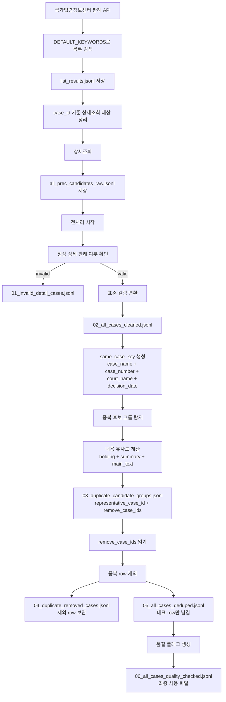

# 교통사고 판례 수집·전처리 계획서

## 1. 문서 목적

이 문서는 교통사고 판례 데이터 파이프라인을 만들 때 **왜 이런 구조로 설계했는지**, **어떤 문제를 막기 위한 것인지**, **각 단계에서 무엇을 기대했는지**, **근거는 무엇인지**를 정리한 계획 문서입니다.

단순히 코드가 무엇을 하는지 설명하는 문서가 아니라, 다음 질문에 답하는 것을 목표로 합니다.

```text
왜 수집 단계에서 traffic/skipped로 나누지 않았는가?
왜 all_prec_candidates_raw.jsonl 하나로 저장하는가?
왜 전처리에서 invalid를 분리하는가?
왜 판례정보일련번호만으로 중복 제거하지 않는가?
왜 사건명+사건번호+법원명+선고일자 기준을 추가했는가?
왜 내용 유사도 0.90 이상이면 중복으로 판단하는가?
왜 중복을 바로 삭제하지 않고 duplicate_candidate_groups.jsonl을 먼저 만드는가?
최종적으로 실제 사용할 파일은 무엇인가?
```

최종 결론부터 말하면, 이 파이프라인의 핵심 원칙은 다음입니다.

```text
수집 단계에서는 최대한 넓게 가져온다.
수집 단계에서는 판단하지 않는다.
판단은 전처리와 분류 단계에서 한다.
삭제는 원본에서 하지 않고, 최종 사용 파일에서만 제외한다.
중복 제거도 근거 파일을 먼저 만든 뒤 그 파일을 기준으로 적용한다.
```

---

## 2. 전체 파이프라인 개요

최종 파이프라인은 다음 구조를 목표로 합니다.

```text
국가법령정보센터 판례 API
↓
키워드 기반 넓은 후보 수집
↓
all_prec_candidates_raw.jsonl 저장
↓
정상 상세 판례 / invalid 분리
↓
표준 컬럼 변환
↓
중복 후보 탐지
↓
내용 유사도 기반 중복 제거
↓
품질 플래그 생성
↓
교통사고 관련성 재분류
↓
과실비율 후보 분류
↓
RAG chunk 생성
↓
embedding / vector DB 적재
```

현재 이 문서에서 다루는 범위는 다음입니다.

```text
수집 설계
+
전처리 설계
+
중복 제거 설계
+
최종 사용 파일 정의
```

아직 이 문서의 범위에 포함하지 않는 것은 다음입니다.

```text
교통사고 관련성 최종 분류 모델
과실비율 분류 모델
RAG chunk 설계
embedding 생성
vector DB 적재
답변 생성 Agent
```

---

# 3. 수집 단계 설계

## 3.1. 수집 단계의 목표

수집 단계의 목표는 **정답 데이터 생성**이 아닙니다.

수집 단계의 목표는 다음입니다.

```text
교통사고 및 과실비율과 관련될 가능성이 있는 판례 후보를 최대한 넓게 확보한다.
```

즉, 수집 단계에서는 다음을 하지 않습니다.

```text
진짜 교통사고 판례인지 확정하지 않음
진짜 과실비율 판례인지 확정하지 않음
traffic/skipped 파일로 나누지 않음
필터링으로 데이터를 강하게 버리지 않음
```

수집 단계에서 너무 강하게 필터링하면 다음 문제가 생깁니다.

```text
실제로 필요한 판례가 skipped로 빠질 수 있음
키워드가 부족하면 recall이 낮아짐
나중에 과실비율 분류나 RAG에서 필요한 판례를 복구하기 어려움
```

따라서 수집 단계의 기본 전략은 다음입니다.

```text
high recall 우선
low precision은 후처리에서 해결
```

쉽게 말하면:

```text
처음에는 넓게 가져오고,
나중에 정리하면서 걸러낸다.
```

---

## 3.2. 수집 입력: 검색 키워드

수집 코드는 `DEFAULT_KEYWORDS`를 사용해 국가법령정보센터 판례 목록 API를 검색합니다.

키워드는 크게 두 부류입니다.

### 3.2.1. 교통사고 전체 후보 수집용 키워드

예시는 다음과 같습니다.

```text
교통사고
자동차 사고
차량 사고
차량 충돌
자동차 충돌
추돌
후미추돌
접촉사고
교차로 사고
신호위반 사고
중앙선 침범
차로 변경 사고
진로 변경 사고
안전거리 미확보
횡단보도 사고
보행자 사고
자전거 사고
이륜차 사고
오토바이 사고
전동킥보드 사고
개인형 이동장치 사고
PM 사고
회전교차로 사고
유턴 사고
좌회전 사고
우회전 사고
주차장 사고
개문 사고
어린이보호구역 사고
스쿨존 사고
```

이 키워드들은 사고 유형을 넓게 잡기 위한 것입니다.

### 3.2.2. 과실비율 후보까지 넓게 잡기 위한 키워드

예시는 다음과 같습니다.

```text
손해배상(자)
손해배상 교통사고
구상금 교통사고
자동차보험 구상금
보험자대위 교통사고
과실상계 교통사고
과실비율 교통사고
자동차손해배상
교통사고처리특례법
도로교통법위반
```

이 키워드들은 교통사고라는 단어가 직접 들어가지 않아도, 자동차 손해배상이나 구상금, 과실상계 문맥에서 과실비율 판단이 나올 수 있기 때문에 포함했습니다.

---

## 3.3. 왜 검색 키워드를 넓게 잡았는가

교통사고 판례는 항상 사건명에 `교통사고`라고 직접 적혀 있지 않습니다.

예를 들어 사건명이 다음처럼 되어 있을 수 있습니다.

```text
손해배상(자)
구상금
보험금
자동차운전면허취소처분취소
교통사고처리특례법위반
도로교통법위반
특정범죄가중처벌등에관한법률위반(도주치상)
```

따라서 `교통사고`라는 단일 키워드만 쓰면 필요한 판례를 많이 놓칠 수 있습니다.

그래서 검색 키워드는 일부 노이즈가 생기더라도 넓게 잡는 것이 맞습니다.

기대 효과는 다음입니다.

```text
교통사고 직접 표현 판례 확보
손해배상(자) 기반 민사 판례 확보
구상금/보험자대위 판례 확보
형사 교통사고 판례 확보
도로교통법 관련 판례 확보
PM, 보행자, 회전교차로 등 세부 사고 유형 후보 확보
```

예상되는 부작용은 다음입니다.

```text
교통사고가 아닌 판례도 섞일 수 있음
도로교통법위반 키워드로 교통사고와 직접 관련 없는 행정/형사 판례도 들어올 수 있음
손해배상 키워드로 일반 손해배상 판례가 섞일 수 있음
```

이 부작용은 수집 단계에서 해결하지 않고, 전처리 이후 재분류 단계에서 해결합니다.

---

## 3.4. 왜 traffic/skipped로 나누지 않았는가

이전 구조에서는 상세 판례를 가져온 뒤, `TRAFFIC_TERMS` 같은 키워드가 본문에 있는지 보고 다음처럼 나눌 수 있었습니다.

```text
traffic_cases_raw.jsonl
skipped_non_traffic.jsonl
```

하지만 이 방식에는 문제가 있습니다.

### 문제 1. traffic_cases_raw가 진짜 교통사고 정답이 아님

본문에 교통 관련 단어가 있다고 해서 반드시 과실비율 판단에 쓸 수 있는 판례는 아닙니다.

예를 들어 다음 단어만 있어도 traffic으로 들어갈 수 있습니다.

```text
자동차
도로교통법
운전자
차량
```

하지만 실제로는 교통사고 과실비율과 직접 관련 없는 판례일 수 있습니다.

### 문제 2. skipped_non_traffic에도 필요한 판례가 들어갈 수 있음

반대로 판례 내용에 우리가 지정한 키워드가 부족하면 skipped로 빠질 수 있습니다.

하지만 사건 구조상 실제로는 교통사고나 자동차 손해배상과 관련 있을 수 있습니다.

### 문제 3. 수집 단계에서 잘못 나누면 나중에 복구가 어려움

수집 단계에서 파일을 나눠버리면, 이후 작업자가 `traffic_cases_raw`만 보고 작업할 가능성이 있습니다.

그러면 `skipped_non_traffic` 안에 숨어 있는 필요한 판례를 놓칠 수 있습니다.

### 결론

따라서 최종 수집 구조에서는 파일을 나누지 않습니다.

수집 코드의 핵심은 다음입니다.

```text
상세 조회된 모든 판례 후보를 all_prec_candidates_raw.jsonl 하나에 저장한다.
```

---

## 3.5. all_prec_candidates_raw.jsonl의 의미

현재 최종 수집 파일은 다음입니다.

```text
database/traffic_prec_api/all_prec_candidates_raw.jsonl
```

이 파일은 다음 의미를 가집니다.

```text
국가법령정보센터 API에서 상세 조회까지 완료된 전체 판례 후보 raw
```

중요한 점은 다음입니다.

```text
이 파일은 교통사고 확정 데이터가 아니다.
이 파일은 과실비율 확정 데이터도 아니다.
이 파일은 전처리와 재분류를 위한 전체 후보 원본이다.
```

이 파일에는 다음 필드가 포함될 수 있습니다.

```text
판례정보일련번호
사건명
사건번호
선고일자
법원명
판시사항
판결요지
참조조문
참조판례
판례내용
_case_id
_matched_keywords
_list_row
source_bucket
topic_labels
source_reference
```

여기서 `source_bucket`은 최종 수집 코드에서 다음처럼 들어갑니다.

```text
all_prec_candidates_raw
```

이전처럼 `traffic_cases_raw`, `skipped_non_traffic`로 나누지 않습니다.

---

## 3.6. 수집 단계 출력 파일

수집 단계 결과는 다음 폴더에 저장됩니다.

```text
database/traffic_prec_api/
  all_prec_candidates_raw.jsonl
  list_results.jsonl
  run_summary.json
  errors.jsonl
```

각 파일의 의미는 다음과 같습니다.

### all_prec_candidates_raw.jsonl

상세 조회까지 완료된 판례 후보 전체입니다.

전처리의 기본 입력 파일입니다.

### list_results.jsonl

목록 검색 API에서 나온 row를 저장한 파일입니다.

같은 판례가 여러 키워드에 잡히면 이 파일에는 중복이 있을 수 있습니다.

이 파일은 최종 사용 데이터가 아니라 수집 추적용입니다.

### run_summary.json

수집 실행 요약입니다.

예를 들어 다음 정보를 확인합니다.

```text
키워드 수
목록 검색 row 수
unique case_id 수
상세 조회 성공 수
저장된 raw 후보 수
에러 수
```

### errors.jsonl

목록 조회 또는 상세 조회 중 발생한 에러 로그입니다.

에러가 없으면 파일이 없거나 비어 있을 수 있습니다.

---

# 4. 전처리 단계 설계

## 4.1. 전처리 단계의 목표

전처리 단계의 목표는 다음입니다.

```text
raw 후보 데이터를 RAG/분류에 넣기 전 사용 가능한 구조로 정리한다.
```

구체적으로는 다음 작업을 합니다.

```text
invalid/detail not found 분리
표준 컬럼 변환
날짜 정규화
텍스트 정리
full_text 생성
중복 후보 탐지
중복 제거
품질 플래그 생성
```

전처리 단계에서도 아직 교통사고 관련성 최종 분류는 하지 않습니다.

즉, 전처리의 목적은 다음입니다.

```text
교통사고 판례 확정이 아니라,
분류 가능한 깨끗한 후보 데이터 생성
```

---

## 4.2. 전처리 입력 파일

최종 전처리 코드는 다음 파일을 기본 입력으로 사용합니다.

```text
database/traffic_prec_api/all_prec_candidates_raw.jsonl
```

전처리 코드는 다음입니다.

```text
preprocess_traffic_precedents_final_all_raw.py
```

실행 명령어는 다음입니다.

```bash
python preprocess_traffic_precedents_final_all_raw.py --fresh
```

기본 출력 폴더는 다음입니다.

```text
database/traffic_prec_work
```

---

## 4.3. 전처리 출력 파일

전처리 실행 후 생성되는 파일은 다음입니다.

```text
database/traffic_prec_work/
  00_preprocess_report.json
  01_invalid_detail_cases.jsonl
  02_all_cases_cleaned.jsonl
  03_duplicate_candidate_groups.jsonl
  04_duplicate_removed_cases.jsonl
  05_all_cases_deduped.jsonl
  06_all_cases_quality_checked.jsonl
```

최종적으로 실제 다음 단계에서 사용할 파일은 다음입니다.

```text
database/traffic_prec_work/06_all_cases_quality_checked.jsonl
```

---

# 5. invalid/detail not found 분리 계획

## 5.1. 왜 invalid를 분리하는가

목록 검색에서는 판례 후보가 잡혔지만, 상세 조회에서 정상 판례가 아닌 응답이 올 수 있습니다.

예를 들어 다음과 같은 응답입니다.

```text
일치하는 판례가 없습니다. 판례명을 확인하여 주십시오.
```

이런 row는 정상 판례가 아닙니다.

이런 데이터를 그대로 RAG나 분류에 넣으면 문제가 생깁니다.

```text
본문이 없는 데이터가 chunk로 만들어짐
case_id가 없는 데이터가 DB에 들어감
분류 모델이 의미 없는 Law 메시지를 학습함
검색 결과에 오류 메시지가 노출됨
```

따라서 가장 먼저 invalid를 분리합니다.

---

## 5.2. invalid 판단 기준

전처리에서 정상 상세 판례로 인정하려면 다음 조건을 만족해야 합니다.

```text
판례정보일련번호 또는 판례일련번호 있음
사건명 있음
판례내용 있음
Law 오류 메시지 없음
```

반대로 다음 중 하나라도 해당하면 invalid로 분리합니다.

```text
판례정보일련번호 없음
판례일련번호 없음
사건명 없음
판례내용 없음
Law 메시지 있음
JSON decode 오류
```

invalid row는 다음 파일에 저장됩니다.

```text
01_invalid_detail_cases.jsonl
```

이 파일은 다음 단계 입력으로 쓰지 않습니다.

---

## 5.3. 기대 효과

invalid 분리의 기대 효과는 다음입니다.

```text
최종 데이터에서 본문 없는 row 제거
case_id 없는 row 제거
RAG chunk 품질 확보
분류 대상 데이터 안정화
나중에 재수집 대상 확인 가능
```

---

# 6. 표준 컬럼 변환 계획

## 6.1. 왜 표준 컬럼으로 바꾸는가

국가법령정보센터 API의 원본 컬럼은 한글 중심입니다.

예를 들어 다음과 같습니다.

```text
판례정보일련번호
사건명
사건번호
선고일자
법원명
판시사항
판결요지
판례내용
참조조문
참조판례
```

이 상태 그대로 후속 코드를 작성하면 다음 문제가 생깁니다.

```text
코드마다 원본 컬럼명을 직접 알아야 함
영문 변수명과 한글 컬럼이 섞여 유지보수가 어려움
RAG/분류/DB 적재 단계에서 컬럼명이 흔들릴 수 있음
```

따라서 전처리 단계에서 표준 컬럼으로 바꿉니다.

---

## 6.2. 표준 컬럼 매핑

| 원본 컬럼 | 표준 컬럼 | 의미 |
|---|---|---|
| 판례정보일련번호 | case_id | 정상 판례의 공식 ID |
| 판례일련번호 | case_id 후보 | 판례정보일련번호가 없을 때 보조 ID |
| _case_id / _merge_case_id | raw_case_id | 수집 과정의 추적용 ID |
| 사건명 | case_name | 사건명 |
| 사건번호 | case_number | 사건번호 |
| 선고일자 | decision_date | YYYY-MM-DD 형식 날짜 |
| 선고일자 | decision_date_raw | 원본 날짜 |
| 선고 | decision_label | 선고 여부 텍스트 |
| 법원명 | court_name | 법원명 |
| 법원종류코드 | court_type_code | 법원 종류 코드 |
| 사건종류명 | case_category | 민사, 형사, 행정 등 |
| 사건종류코드 | case_category_code | 사건 종류 코드 |
| 판결유형 | judgment_type | 판결, 결정 등 |
| 판시사항 | holding | 판시사항 |
| 판결요지 | summary | 판결요지 |
| 판례내용 | main_text | 판례 본문 |
| 참조조문 | referenced_laws | 참조조문 |
| 참조판례 | referenced_cases | 참조판례 |
| _matched_keywords | matched_keywords | 수집 시 매칭된 검색어 |
| topic_labels | raw_topic_labels | 수집 단계 참고 라벨 |
| source_bucket | source_bucket | raw 출처 |
| source_reference | source_reference | 판례 추적 URL |
| 생성 | full_text | 분류/검색용 통합 텍스트 |
| 생성 | same_case_key | 중복 후보 묶음 키 |

---

## 6.3. full_text 생성 방식

분류와 검색에 사용할 `full_text`는 다음 필드로 만듭니다.

```text
case_name
+
holding
+
summary
+
main_text
+
referenced_laws
```

즉:

```text
사건명
+
판시사항
+
판결요지
+
판례내용
+
참조조문
```

`referenced_cases`는 full_text에 넣지 않습니다.

이유는 다음과 같습니다.

```text
참조판례는 다른 사건 정보가 섞일 수 있음
현재 판례 자체의 사실관계와 판단을 흐릴 수 있음
분류 단계에서 불필요한 외부 사건명이 섞일 수 있음
```

따라서 초기 full_text는 현재 판례 자체의 내용 중심으로 구성합니다.

---

# 7. 중복 제거 계획

## 7.1. 왜 중복 제거가 필요한가

수집 단계에서는 여러 검색어를 사용합니다.

예를 들어 같은 판례가 다음 검색어 여러 개에 잡힐 수 있습니다.

```text
교통사고
손해배상(자)
과실상계 교통사고
도로교통법위반
```

목록 검색 결과에서는 같은 판례가 여러 번 등장할 수 있습니다.

수집 코드에서는 `_case_id` 기준으로 한 번 유니크 처리합니다.

하지만 실제 데이터 확인 결과, `판례정보일련번호`가 서로 다른데 같은 사건처럼 보이는 row가 존재했습니다.

따라서 중복 제거는 단순히 `판례정보일련번호`만 볼 수 없습니다.

---

## 7.2. 확인된 중복 현상

정상 상세 판례 기준으로 확인한 결과는 다음과 같습니다.

```text
판례정보일련번호 기준 중복: 0개
사건명만 기준 중복: 많음
사건명 + 사건번호 + 법원명 + 선고일자 기준 중복 후보: 195그룹
중복 후보에 포함된 row 수: 391건
```

사건명만 기준으로 중복이 많은 것은 정상입니다.

예를 들어 다음 사건명은 여러 판례에서 반복될 수 있습니다.

```text
손해배상(자)
구상금
교통사고처리특례법위반
도로교통법위반
자동차운전면허취소처분취소
```

따라서 사건명만으로 중복 판단을 하면 안 됩니다.

중복 후보로 볼 수 있는 기준은 최소한 다음입니다.

```text
사건명 + 사건번호 + 법원명 + 선고일자
```

---

## 7.3. 왜 판례정보일련번호만으로 중복 제거하지 않는가

`판례정보일련번호`는 정상 판례의 공식 ID입니다.

따라서 같은 `판례정보일련번호`가 중복되면 명백한 중복입니다.

하지만 이번 데이터에서는 `판례정보일련번호` 기준 중복은 없었습니다.

그런데 다음처럼 같은 사건으로 보이는 row가 다른 `판례정보일련번호`로 존재했습니다.

```text
사건명: 특정범죄가중처벌등에관한법률위반
사건번호: 92도3126
법원명: 대법원
선고일자: 1993-02-23

판례정보일련번호:
604689
603235
189866
```

이 경우 `판례정보일련번호`만 보면 중복이 아니지만, 사건명/사건번호/법원명/선고일자가 같고 내용도 거의 같다면 실제로는 중복 저장 후보입니다.

따라서 최종 중복 제거 기준은 다음처럼 설계합니다.

```text
1차 기준:
사건명 + 사건번호 + 법원명 + 선고일자

2차 기준:
판시사항 + 판결요지 + 판례내용 유사도
```

---

## 7.4. 중복 후보 그룹 생성 방식

중복 후보는 다음 4개 필드를 기준으로 묶습니다.

```text
case_name
case_number
court_name
decision_date
```

코드에서는 이를 `same_case_key`라고 부릅니다.

```python
same_case_key = "|".join([case_name, case_number, court_name, decision_date])
```

같은 `same_case_key` 안에 row가 2개 이상 있으면 중복 후보 그룹입니다.

---

## 7.5. 내용 유사도 비교 대상

중복 후보 그룹 안에서 실제 내용이 같은지 확인하기 위해 다음 3개 필드를 합쳐 비교합니다.

```text
holding
summary
main_text
```

원본 기준으로는 다음입니다.

```text
판시사항
판결요지
판례내용
```

참조조문과 참조판례는 비교 대상에서 제외합니다.

이유는 다음과 같습니다.

```text
중복 여부는 현재 판례의 본문과 판단 내용을 중심으로 봐야 함
참조판례는 외부 판례 정보가 들어가므로 중복 판단에 방해될 수 있음
참조조문은 보조 정보라 본문 동일성보다 우선하지 않음
```

---

## 7.6. 유사도 계산 전 텍스트 정규화

원문 그대로 비교하면 다음 차이 때문에 다른 텍스트로 판단될 수 있습니다.

```text
줄바꿈 차이
띄어쓰기 차이
공백 차이
따옴표 모양 차이
콜론 모양 차이
```

따라서 비교 전에 정규화합니다.

정규화 내용은 다음입니다.

```text
HTML 정리
연속 공백 정리
따옴표 모양 통일
콜론 모양 통일
비교용 텍스트에서는 공백 제거
```

이 과정을 통해 다음처럼 사실상 같은 내용은 같은 것으로 비교됩니다.

```text
대구고등법원 1992. 11. 4. 선고
대구고등법원 1992.11.4. 선고
```

---

## 7.7. 유사도 계산 방식

유사도 계산은 AI 모델이 아니라 문자열 유사도입니다.

사용 방식은 다음입니다.

```python
difflib.SequenceMatcher
```

기본 흐름은 다음입니다.

```text
1. 판시사항+판결요지+판례내용을 합친다.
2. 비교용으로 정규화한다.
3. 정규화 후 완전히 같으면 유사도 1.0
4. 완전히 같지 않으면 SequenceMatcher로 ratio를 계산한다.
```

유사도 기준은 다음입니다.

```text
1.0
→ 완전 동일

0.995 이상
→ 거의 동일

0.98 이상
→ 매우 유사

0.90 이상
→ 같은 판례 중복으로 보고 제거 가능

0.90 미만
→ 제거하지 않음
```

현재 기준값은 다음입니다.

```python
DUPLICATE_SIMILARITY_THRESHOLD = 0.90
```

---

## 7.8. 그룹 내부 모든 쌍 비교

중복 후보 그룹에 row가 여러 개 있을 수 있습니다.

예를 들어 3개라면 다음을 모두 비교합니다.

```text
A-B
A-C
B-C
```

그리고 평균이 아니라 최소 유사도를 봅니다.

이유는 다음과 같습니다.

```text
그룹 안에서 하나라도 많이 다르면 무조건 제거하면 위험하기 때문
```

예를 들어 다음과 같다면:

```text
A-B: 0.999
A-C: 0.998
B-C: 0.912
```

최종 그룹 유사도는 다음입니다.

```text
0.912
```

현재 기준에서는 0.912도 0.90 이상이므로 중복으로 제거합니다.

---

## 7.9. 왜 03_duplicate_candidate_groups.jsonl을 먼저 만드는가

중복 후보를 찾았다고 해서 바로 삭제하면 위험합니다.

왜냐하면 나중에 다음 질문에 답하기 어렵기 때문입니다.

```text
어떤 그룹이 중복으로 판단되었는가?
어떤 case_id를 대표로 남겼는가?
어떤 case_id를 제거했는가?
유사도는 얼마였는가?
제거된 row 원문은 무엇인가?
```

따라서 중복 제거 전에 반드시 다음 파일을 먼저 만듭니다.

```text
03_duplicate_candidate_groups.jsonl
```

이 파일에는 각 중복 후보 그룹별로 다음 정보가 들어갑니다.

```text
group_no
action
same_case_key
duplicate_similarity_min
all_case_ids
representative_case_id
remove_case_ids
rows
```

실제 중복 제거는 이 파일의 `remove_case_ids`를 읽어서 적용합니다.

즉, 삭제 기준은 코드 내부의 몇 개 샘플이 아니라 다음입니다.

```text
03_duplicate_candidate_groups.jsonl 전체의 remove_case_ids
```

이 설계의 장점은 다음입니다.

```text
중복 제거 근거가 남음
나중에 검토 가능
제거된 row를 복구 가능
삭제 로직이 투명함
몇 개 그룹만 샘플로 보는 실수를 방지함
```

---

## 7.10. 대표 row 선택 기준

중복 그룹 안에서 대표 row를 하나 남깁니다.

대표 row는 정보량이 가장 많은 것을 우선합니다.

우선순위는 다음입니다.

```text
1. full_text 길이가 긴 row
2. main_text 길이가 긴 row
3. summary 길이가 긴 row
4. holding 길이가 긴 row
5. case_id 기준
```

이렇게 하는 이유는 다음입니다.

```text
같은 판례라면 내용이 더 풍부한 row를 남기는 것이 RAG와 분류에 유리함
요약이나 판시사항이 더 잘 들어 있는 row가 정보 손실이 적음
```

---

# 8. 품질 플래그 계획

## 8.1. 왜 품질 플래그를 붙이는가

전처리와 중복 제거가 끝났더라도, 모든 row가 동일한 품질을 가지는 것은 아닙니다.

예를 들어 다음 문제가 있을 수 있습니다.

```text
사건번호 없음
법원명 없음
사건종류명 없음
판결유형 없음
본문 길이가 너무 짧음
날짜 파싱 실패
```

이런 데이터는 무조건 삭제하기보다 플래그를 붙여 상태를 기록하는 것이 좋습니다.

---

## 8.2. 품질 플래그 종류

예시는 다음입니다.

```text
missing_case_id
missing_case_name
missing_case_number
missing_decision_date
missing_court_name
missing_case_category
missing_judgment_type
missing_main_text
missing_source_reference
invalid_decision_date
main_text_too_short
full_text_too_short
```

---

## 8.3. 사용 가능 여부

품질 플래그 중 일부는 심각한 플래그입니다.

예를 들면 다음입니다.

```text
missing_case_id
missing_case_name
missing_main_text
missing_source_reference
full_text_too_short
```

이런 플래그가 있으면 다음 값을 false로 둡니다.

```text
is_usable_for_reclassification = false
```

그 외의 플래그는 경고로 보고, 필요하면 후속 단계에서 사용할 수 있습니다.

예를 들어 `missing_case_number`는 아쉽지만, 본문이 충분하면 분류 자체는 가능할 수 있습니다.

---

## 8.4. 길이 기준

현재 길이 기준은 다음입니다.

```python
MAIN_TEXT_MIN_LENGTH = 300
FULL_TEXT_MIN_LENGTH = 500
```

의미는 다음입니다.

```text
main_text가 300자 미만이면 main_text_too_short
full_text가 500자 미만이면 full_text_too_short
```

이 기준은 너무 짧은 판례/오류성 데이터를 걸러내기 위한 품질 경고 기준입니다.

---

# 9. 최종 출력 파일 계획

전처리 결과는 다음 폴더에 저장됩니다.

```text
database/traffic_prec_work/
```

생성 파일은 다음입니다.

```text
00_preprocess_report.json
01_invalid_detail_cases.jsonl
02_all_cases_cleaned.jsonl
03_duplicate_candidate_groups.jsonl
04_duplicate_removed_cases.jsonl
05_all_cases_deduped.jsonl
06_all_cases_quality_checked.jsonl
```

---

## 9.1. 00_preprocess_report.json

전처리 실행 요약 파일입니다.

확인할 내용은 다음입니다.

```text
input_rows
valid_detail_rows
invalid_detail_rows
same_case_key_duplicate_groups
same_case_key_duplicate_rows
duplicate_candidate_groups_written
duplicate_removed_rows
deduped_rows
quality_checked_rows
usable_for_reclassification
unusable_for_reclassification
quality_flag_counts
missing_field_counts
```

이 파일은 사람이 전처리 결과를 확인하기 위한 리포트입니다.

다음 단계 입력으로 쓰지 않습니다.

---

## 9.2. 01_invalid_detail_cases.jsonl

정상 판례가 아닌 데이터입니다.

다음 단계 입력으로 쓰지 않습니다.

용도는 다음입니다.

```text
상세조회 실패 확인
재수집 필요 여부 판단
에러 데이터 보관
```

---

## 9.3. 02_all_cases_cleaned.jsonl

정상 판례를 표준 컬럼으로 변환한 파일입니다.

아직 중복 제거 전입니다.

중간 산출물로 보관합니다.

---

## 9.4. 03_duplicate_candidate_groups.jsonl

중복 후보 그룹 전체를 담은 파일입니다.

실제 중복 제거 기준 파일입니다.

핵심 필드는 다음입니다.

```text
representative_case_id
remove_case_ids
rows
duplicate_similarity_min
```

이 파일은 다음 질문에 답할 수 있어야 합니다.

```text
어떤 데이터가 중복 후보였는가?
왜 제거 대상으로 잡혔는가?
무엇을 대표 row로 남겼는가?
무엇을 제거했는가?
```

---

## 9.5. 04_duplicate_removed_cases.jsonl

중복으로 판단되어 최종본에서 제외된 row입니다.

삭제 로그이자 보관 파일입니다.

---

## 9.6. 05_all_cases_deduped.jsonl

중복 제거가 완료된 파일입니다.

하지만 아직 품질 플래그 적용 전입니다.

---

## 9.7. 06_all_cases_quality_checked.jsonl

최종 사용 파일입니다.

다음 단계는 이 파일을 입력으로 사용합니다.

```text
database/traffic_prec_work/06_all_cases_quality_checked.jsonl
```

---

# 10. 최종 사용 파일

실제로 후속 작업에서 사용할 파일은 하나입니다.

```text
database/traffic_prec_work/06_all_cases_quality_checked.jsonl
```

이 파일은 다음 조건을 만족합니다.

```text
정상 상세 판례만 포함
표준 컬럼 변환 완료
full_text 생성 완료
중복 제거 완료
품질 플래그 생성 완료
사용 가능 여부 표시 완료
```

다음 단계인 교통사고 관련성 재분류는 이 파일을 입력으로 사용합니다.

---

# 11. 다음 단계 계획

전처리 이후 다음 단계는 다음입니다.

```text
06_all_cases_quality_checked.jsonl
↓
교통사고 관련성 재분류
↓
confirmed_traffic
possible_traffic
non_traffic
```

그 다음 과실비율 후보를 분류합니다.

```text
confirmed_traffic
↓
fault_ratio_candidate
non_fault_ratio
```

그 이후 RAG용 chunk를 생성합니다.

```text
fault_ratio_candidate
↓
chunk 생성
↓
embedding
↓
vector DB
```

---

# 12. 설계 판단 요약

| 판단 | 이유 | 기대 효과 |
|---|---|---|
| 수집 단계에서 traffic/skipped로 나누지 않음 | 키워드 기반 임시 분류는 오류 가능성이 큼 | 필요한 판례 누락 방지 |
| all_prec_candidates_raw.jsonl 하나로 저장 | 전체 후보를 한 곳에 보존 | 후속 전처리/분류에서 재판단 가능 |
| invalid를 따로 분리 | 본문 없는 데이터가 RAG에 들어가는 것을 방지 | 데이터 품질 확보 |
| 표준 컬럼으로 변환 | 후속 코드에서 컬럼 일관성 필요 | 유지보수성 향상 |
| full_text 생성 | 분류/검색에 사용할 통합 텍스트 필요 | 재분류와 RAG 준비 |
| 판례정보일련번호만으로 중복 제거하지 않음 | 서로 다른 ID인데 같은 사건인 후보 존재 | 실제 중복 후보 탐지 가능 |
| 사건명+사건번호+법원명+선고일자 기준 사용 | 같은 사건 여부를 더 강하게 판단 | 제목만 같은 다른 사건 오판 방지 |
| 내용 유사도 0.90 기준 사용 | 195그룹 비교 결과 모두 0.90 이상으로 확인 | 중복 제거 가능 |
| 03_duplicate_candidate_groups.jsonl 먼저 생성 | 삭제 근거 보존 필요 | 검증/복구 가능 |
| remove_case_ids 기반 제거 | 전체 중복 후보 파일을 기준으로 적용 | 일부 그룹만 보는 실수 방지 |
| 04_duplicate_removed_cases.jsonl 보관 | 제거 row 추적 필요 | 감사 로그 확보 |
| 06_all_cases_quality_checked.jsonl 사용 | 중복 제거와 품질 점검 완료 | 다음 단계 입력 안정화 |

---

# 13. Mermaid 흐름도



---

# 14. 최종 결론

최종 설계는 다음과 같습니다.

```text
1. 수집 단계에서는 넓게 후보를 모은다.
2. 수집 단계에서는 traffic/skipped로 나누지 않는다.
3. 상세조회된 전체 후보를 all_prec_candidates_raw.jsonl에 저장한다.
4. 전처리 단계에서 정상 판례와 invalid를 분리한다.
5. 정상 판례는 표준 컬럼으로 변환한다.
6. full_text를 생성한다.
7. 판례정보일련번호 기준 중복만 보지 않는다.
8. 사건명+사건번호+법원명+선고일자 기준으로 중복 후보를 찾는다.
9. 판시사항+판결요지+판례내용 유사도를 계산한다.
10. 유사도 0.90 이상이면 같은 판례 중복으로 본다.
11. 중복 제거 전에 03_duplicate_candidate_groups.jsonl을 먼저 만든다.
12. 실제 제거는 03 파일의 remove_case_ids를 기준으로 한다.
13. 제거된 row는 04_duplicate_removed_cases.jsonl에 보관한다.
14. 대표 row만 남긴 파일은 05_all_cases_deduped.jsonl이다.
15. 품질 플래그까지 붙인 최종 사용 파일은 06_all_cases_quality_checked.jsonl이다.
```

따라서 후속 단계에서 사용할 파일은 다음입니다.

```text
database/traffic_prec_work/06_all_cases_quality_checked.jsonl
```
