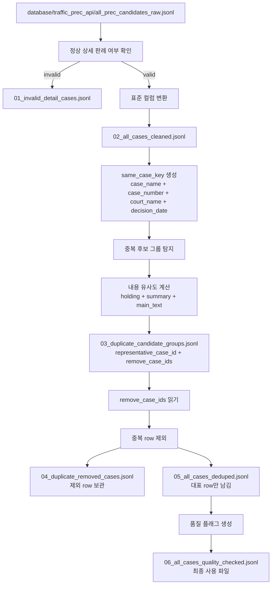

# 교통사고 판례 데이터 전처리 방법 정리

## 1. 이 문서의 목적

이 문서는 지금까지 정리한 **교통사고 판례 데이터 전처리 방식**을 한 번에 이해할 수 있도록 정리한 문서입니다.

현재 프로젝트의 목적은 국가법령정보센터 판례 API로 수집한 판례 후보 데이터를 바로 RAG나 과실비율 분류에 넣는 것이 아니라, 먼저 다음 작업을 수행하는 것입니다.

```text
원본 후보 데이터
→ 정상 판례와 실패 데이터 분리
→ 표준 컬럼으로 정리
→ 중복 후보 탐지
→ 내용 유사도 기반 중복 제거
→ 품질 플래그 생성
→ 다음 단계에서 사용할 최종 JSONL 생성
```

핵심은 다음과 같습니다.

```text
수집 파일은 정답 데이터가 아니다.
traffic_cases_raw와 skipped_non_traffic도 임시 분류 결과일 뿐이다.
그래서 둘을 합친 all_prec_candidates_raw.jsonl을 기준으로 다시 전처리해야 한다.
```

---

## 2. 현재 입력 파일 구조

현재 프로젝트 기준 원본 입력 파일은 다음 위치에 둡니다.

```text
database/
  traffic_prec_api/
    all_prec_candidates_raw.jsonl
    list_results.jsonl
    run_summary.json
```

최종 전처리 코드는 기본적으로 아래 파일을 읽습니다.

```text
database/traffic_prec_api/all_prec_candidates_raw.jsonl
```

`all_prec_candidates_raw.jsonl`은 수집 단계에서 교통사고/비교통을 임시로 나누지 않고, 상세조회된 판례 후보 전체를 한 파일에 저장한 것입니다.

이전에는 다음처럼 나누어 저장한 뒤 병합해서 `all_prec_candidates_raw.jsonl`을 만들었습니다.

```text
traffic_cases_raw.jsonl
+
skipped_non_traffic.jsonl
=
all_prec_candidates_raw.jsonl
```

하지만 최종 수집 코드에서는 이 split을 없앴습니다.

따라서 현재 기준에서는 `all_prec_candidates_raw.jsonl`이 아니라 아래 파일을 전처리 입력으로 쓰는 것이 맞습니다.

```text
all_prec_candidates_raw.jsonl
```

중요한 점은 다음과 같습니다.

```text
all_prec_candidates_raw.jsonl
→ 국가법령정보센터 API에서 상세조회된 판례 후보 전체

아직 교통사고 판례로 확정된 데이터가 아님
아직 과실비율 판례로 확정된 데이터도 아님
전처리 이후 교통사고 관련성 재분류가 필요함
```

---

## 3. 현재 데이터 개수

기존 수집 요약은 다음과 같습니다.

```json
{
  "keywords": 40,
  "list_rows_seen": 37500,
  "unique_case_ids": 17512,
  "details_fetched": 17512,
  "traffic_saved": 10324,
  "skipped_non_traffic": 7188,
  "errors": 0
}
```

즉, 목록 검색에서는 37,500건의 row가 보였지만, 수집 코드에서 `_case_id` 기준으로 유니크하게 상세조회한 결과는 17,512건입니다.

현재 `all_prec_candidates_raw.jsonl` 기준으로 확인한 결과는 다음과 같습니다.

```text
전체 row: 17,512건
정상 상세 판례: 15,716건
invalid/detail not found: 1,796건
판례정보일련번호 기준 중복: 0건
```

여기서 정상 상세 판례 기준은 다음과 같습니다.

```text
판례정보일련번호 있음
사건명 있음
판례내용 있음
Law 오류 메시지 없음
```

반대로 invalid는 다음과 같은 데이터입니다.

```text
판례정보일련번호 없음
사건명 없음
판례내용 없음
Law 메시지 있음
상세조회 실패 응답
```

예를 들어 이런 메시지가 있는 row는 정상 판례가 아닙니다.

```text
일치하는 판례가 없습니다. 판례명을 확인하여 주십시오.
```

---

## 4. 전처리 최종 코드

최종 전처리 코드는 다음 파일입니다.

```text
preprocess_traffic_precedents_final_all_raw.py
```

이 코드는 다음을 모두 포함합니다.

```text
기존 전처리
+
invalid 분리
+
표준 컬럼 변환
+
full_text 생성
+
중복 후보 그룹 생성
+
중복 후보 JSONL 기반 중복 제거
+
품질 플래그 생성
```

실행 명령어는 다음과 같습니다.

```bash
python preprocess_traffic_precedents_final_all_raw.py --fresh
```

기본 입력 경로와 출력 경로는 코드 안에 다음처럼 설정되어 있습니다.

```python
DEFAULT_INPUT_PATH = "database/traffic_prec_api/all_prec_candidates_raw.jsonl"
DEFAULT_OUTPUT_DIR = "database/traffic_prec_work"
```

따라서 위 명령어를 실행하면 자동으로 다음 폴더에 결과가 저장됩니다.

```text
database/traffic_prec_work/
```

다른 입력 파일이나 다른 출력 폴더를 쓰고 싶으면 실행 시 옵션으로 바꿀 수 있습니다.

```bash
python preprocess_traffic_precedents_final_all_raw.py \
  --input 다른파일.jsonl \
  --out-dir 다른저장폴더 \
  --fresh
```

---

## 5. 최종 출력 파일 구조

전처리 코드를 실행하면 다음 파일들이 생성됩니다.

```text
database/traffic_prec_work/
  00_preprocess_report.json
  01_invalid_detail_cases.jsonl
  02_all_cases_cleaned.jsonl
  03_duplicate_candidate_groups.jsonl
  04_duplicate_removed_cases.jsonl
  05_all_cases_deduped.jsonl
  06_all_cases_quality_checked.jsonl
```

각 파일의 의미는 아래에서 자세히 설명합니다.

---

# 6. 각 파일의 의미

## 6.1. 00_preprocess_report.json

이 파일은 **전처리 실행 결과 요약 보고서**입니다.

판례 본문 데이터가 아니라, 전처리가 제대로 수행되었는지 확인하기 위한 리포트입니다.

예를 들어 다음 정보가 들어갑니다.

```text
전체 row 수
정상 상세 판례 수
invalid row 수
중복 후보 그룹 수
중복 제거된 row 수
최종 deduped row 수
품질 플래그 통계
사용 가능한 row 수
사용 불가능한 row 수
```

또한 어떤 기준으로 중복 제거를 했는지도 기록됩니다.

예시 구조는 다음과 같습니다.

```json
{
  "input_file": "database/traffic_prec_api/all_prec_candidates_raw.jsonl",
  "output_dir": "database/traffic_prec_work",
  "thresholds": {
    "MAIN_TEXT_MIN_LENGTH": 300,
    "FULL_TEXT_MIN_LENGTH": 500,
    "DUPLICATE_SIMILARITY_THRESHOLD": 0.9
  },
  "dedupe_rule": {
    "same_case_key": "case_name + case_number + court_name + decision_date",
    "content_compare_fields": ["holding", "summary", "main_text"],
    "remove_if_min_pairwise_similarity_gte": 0.9,
    "representative_rule": "full_text 길이가 가장 긴 row 우선",
    "important": "중복 제거는 03_duplicate_candidate_groups.jsonl에 적힌 remove_case_ids를 읽어서 적용합니다."
  }
}
```

이 파일은 다음 단계 입력으로 쓰는 파일이 아닙니다.

용도는 다음과 같습니다.

```text
전처리 결과 확인
중복 제거 개수 확인
품질 플래그 통계 확인
나중에 실행 기록 추적
```

---

## 6.2. 01_invalid_detail_cases.jsonl

이 파일은 **정상 상세 판례가 아닌 데이터만 따로 모은 파일**입니다.

즉, 원본 `all_prec_candidates_raw.jsonl` 안에서 다음 조건에 걸린 row들이 들어갑니다.

```text
판례정보일련번호 없음
사건명 없음
판례내용 없음
Law 메시지 있음
JSON decode 오류
상세조회 실패 응답
```

예시 row는 다음과 같은 형태입니다.

```json
{
  "case_id": null,
  "raw_case_id": "418512",
  "is_valid_detail": false,
  "invalid_reasons": [
    "law_message_detail_not_found",
    "missing_precedent_id",
    "missing_case_name",
    "missing_main_text"
  ],
  "law_message": "일치하는 판례가 없습니다. 판례명을 확인하여 주십시오.",
  "matched_keywords": [],
  "source_bucket": "skipped_non_traffic"
}
```

이 파일은 RAG나 교통사고 재분류에 바로 쓰면 안 됩니다.

용도는 다음과 같습니다.

```text
상세조회 실패 데이터 확인
나중에 재수집할지 판단
왜 17,512건 중 일부가 빠졌는지 확인
```

---

## 6.3. 02_all_cases_cleaned.jsonl

이 파일은 **정상 상세 판례만 표준 컬럼으로 정리한 파일**입니다.

원본 API 컬럼은 한글 컬럼명 중심입니다.

예를 들면 다음과 같습니다.

```text
판례정보일련번호
사건명
사건번호
선고일자
법원명
법원종류코드
사건종류명
사건종류코드
판결유형
판시사항
판결요지
참조조문
참조판례
판례내용
```

전처리에서는 이를 아래와 같은 표준 컬럼으로 바꿉니다.

| 원본 컬럼 | 표준 컬럼 | 의미 |
|---|---|---|
| 판례정보일련번호 | case_id | 정상 판례의 공식 ID |
| _case_id 또는 _merge_case_id | raw_case_id | 수집 과정의 추적용 ID |
| 사건명 | case_name | 사건명 |
| 사건번호 | case_number | 사건번호 |
| 선고일자 | decision_date | YYYY-MM-DD로 정규화한 날짜 |
| 선고일자 | decision_date_raw | 원본 날짜 |
| 선고 | decision_label | 선고 여부 텍스트 |
| 법원명 | court_name | 법원명 |
| 법원종류코드 | court_type_code | 법원 종류 코드 |
| 사건종류명 | case_category | 민사, 형사, 행정 등 |
| 사건종류코드 | case_category_code | 사건 종류 코드 |
| 판결유형 | judgment_type | 판결, 결정 등 |
| 판시사항 | holding | 판시사항 |
| 판결요지 | summary | 판결요지 |
| 판례내용 | main_text | 판례 본문 |
| 참조조문 | referenced_laws | 참조조문 |
| 참조판례 | referenced_cases | 참조판례 |
| _matched_keywords | matched_keywords | 수집 시 매칭된 검색어 |
| topic_labels | raw_topic_labels | 수집 코드의 임시 라벨 |
| source_bucket | source_bucket | 원래 traffic 또는 skipped 출처 |
| source_reference | source_reference | 원문 참조 URL |
| 생성 | full_text | 분류와 검색에 쓸 통합 텍스트 |

`full_text`는 다음 필드를 합쳐 만듭니다.

```text
case_name
+
holding
+
summary
+
main_text
+
referenced_laws
```

여기서 `referenced_cases`는 full_text에 넣지 않습니다.

이유는 다음과 같습니다.

```text
참조판례는 다른 사건 정보가 섞일 수 있음
분류나 검색에서 현재 판례 자체의 내용이 흐려질 수 있음
따라서 초기에 full_text에는 넣지 않는 것이 안전함
```

`02_all_cases_cleaned.jsonl`은 정상 판례 정리가 끝난 파일이지만, 아직 최종 파일은 아닙니다.

이 단계에서는 아직 다음 작업이 끝나지 않았습니다.

```text
중복 제거 전
품질 플래그 최종 적용 전
```

---

## 6.4. 03_duplicate_candidate_groups.jsonl

이 파일은 **중복 후보 그룹만 따로 모아둔 파일**입니다.

중요한 점은, 중복 제거를 바로 수행하는 것이 아니라 먼저 이 파일을 만든다는 것입니다.

즉, 흐름은 다음과 같습니다.

```text
02_all_cases_cleaned.jsonl
↓
중복 후보 그룹 탐지
↓
03_duplicate_candidate_groups.jsonl 생성
↓
이 파일 안의 remove_case_ids를 읽어 실제 중복 제거
```

### 6.4.1. 중복 후보 그룹 기준

중복 후보는 다음 4개 값이 같은 경우입니다.

```text
사건명
사건번호
법원명
선고일자
```

코드에서는 이를 `same_case_key`라고 합니다.

```python
same_case_key = "|".join([case_name, case_number, court_name, decision_date])
```

예시는 다음과 같습니다.

```text
특정범죄가중처벌등에관한법률위반|92도3126|대법원|1993-02-23
```

### 6.4.2. 왜 판례정보일련번호만 보면 안 되는가

확인 결과, `판례정보일련번호` 기준 중복은 0개였습니다.

하지만 다음 기준으로 보면 중복 후보가 발견되었습니다.

```text
사건명 + 사건번호 + 법원명 + 선고일자
```

확인 결과는 다음과 같습니다.

```text
중복 후보 그룹: 195그룹
중복 후보에 포함된 row 수: 391건
```

즉, `판례정보일련번호`는 다르지만 같은 사건처럼 보이는 row가 존재합니다.

예를 들어 다음 사건이 있었습니다.

```text
사건명: 특정범죄가중처벌등에관한법률위반
사건번호: 92도3126
법원명: 대법원
선고일자: 1993-02-23
```

이 사건은 서로 다른 `판례정보일련번호`로 여러 번 존재했습니다.

```text
604689
603235
189866
```

하지만 판시사항, 판결요지, 판례내용을 보면 거의 같은 내용이었습니다.

따라서 최종 중복 제거 기준은 단순히 `판례정보일련번호`가 아니라 다음 구조로 가야 합니다.

```text
사건명 + 사건번호 + 법원명 + 선고일자
+
내용 유사도
```

### 6.4.3. 03 파일 안의 구조

`03_duplicate_candidate_groups.jsonl`에는 각 중복 후보 그룹이 한 줄씩 저장됩니다.

예시 구조는 다음과 같습니다.

```json
{
  "group_no": 1,
  "action": "remove_duplicates",
  "same_case_key": "특정범죄가중처벌등에관한법률위반|92도3126|대법원|1993-02-23",
  "case_name": "특정범죄가중처벌등에관한법률위반",
  "case_number": "92도3126",
  "court_name": "대법원",
  "decision_date": "1993-02-23",
  "duplicate_group_status": "very_similar_content",
  "duplicate_similarity_min": 0.998421,
  "threshold": 0.9,
  "row_count": 3,
  "all_case_ids": ["604689", "603235", "189866"],
  "representative_case_id": "604689",
  "remove_case_ids": ["603235", "189866"],
  "representative_rule": "full_text 길이가 가장 긴 row 우선",
  "rows": [
    {
      "case_id": "604689",
      "case_name": "특정범죄가중처벌등에관한법률위반",
      "main_text": "..."
    },
    {
      "case_id": "603235",
      "case_name": "특정범죄가중처벌등에관한법률위반",
      "main_text": "..."
    }
  ]
}
```

여기서 핵심은 다음 필드입니다.

```text
representative_case_id
→ 최종본에 남길 대표 case_id

remove_case_ids
→ 최종본에서 제외할 중복 case_id 목록

rows
→ 중복 후보 그룹 안의 원본 row 전체
```

따라서 이 파일은 단순 리포트가 아닙니다.

실제 중복 제거는 이 파일의 `remove_case_ids`를 읽어서 수행합니다.

---

## 6.5. 04_duplicate_removed_cases.jsonl

이 파일은 **중복으로 판단되어 최종본에서 제외된 row를 보관하는 파일**입니다.

중요한 점은 다음과 같습니다.

```text
중복 row를 완전히 삭제하지 않는다.
최종 사용 파일에서만 제외한다.
제외된 row는 04_duplicate_removed_cases.jsonl에 보관한다.
```

예시 구조는 다음과 같습니다.

```json
{
  "removed_case_id": "603235",
  "representative_case_id": "604689",
  "duplicate_group_no": 1,
  "same_case_key": "특정범죄가중처벌등에관한법률위반|92도3126|대법원|1993-02-23",
  "duplicate_group_status": "very_similar_content",
  "duplicate_similarity_min": 0.998421,
  "threshold": 0.9,
  "all_case_ids": ["604689", "603235", "189866"],
  "removed_row": {
    "case_id": "603235",
    "case_name": "특정범죄가중처벌등에관한법률위반",
    "main_text": "..."
  }
}
```

이 파일의 용도는 다음과 같습니다.

```text
어떤 case_id가 빠졌는지 확인
어떤 대표 case_id로 묶였는지 확인
유사도가 얼마였는지 확인
필요하면 나중에 복구
중복 제거 로직 검증
```

즉, 이 파일은 감사 로그이자 보관 파일입니다.

---

## 6.6. 05_all_cases_deduped.jsonl

이 파일은 **중복 제거가 끝난 판례 파일**입니다.

흐름은 다음과 같습니다.

```text
02_all_cases_cleaned.jsonl
+
03_duplicate_candidate_groups.jsonl의 remove_case_ids
↓
05_all_cases_deduped.jsonl
```

즉, `03_duplicate_candidate_groups.jsonl`에서 `remove_case_ids`로 지정된 row들은 빠지고, 각 중복 그룹의 대표 row만 남습니다.

예를 들어 다음 그룹이 있었다면:

```text
all_case_ids: ["604689", "603235", "189866"]
representative_case_id: "604689"
remove_case_ids: ["603235", "189866"]
```

`05_all_cases_deduped.jsonl`에는 다음만 남습니다.

```text
604689
```

그리고 다음은 `04_duplicate_removed_cases.jsonl`에 보관됩니다.

```text
603235
189866
```

`05_all_cases_deduped.jsonl`은 중복 제거가 끝났기 때문에 매우 중요한 파일입니다.

하지만 아직 최종 사용 파일은 아닙니다.

이유는 다음 단계에서 품질 플래그를 붙이기 때문입니다.

---

## 6.7. 06_all_cases_quality_checked.jsonl

이 파일이 **최종 사용 파일**입니다.

`05_all_cases_deduped.jsonl`에 품질 플래그를 붙인 파일입니다.

이 파일은 다음 상태를 모두 만족합니다.

```text
정상 상세 판례만 남김
표준 컬럼 변환 완료
날짜 정규화 완료
텍스트 정리 완료
full_text 생성 완료
중복 제거 완료
품질 플래그 생성 완료
사용 가능 여부 표시 완료
```

각 row에는 다음 필드가 추가됩니다.

```json
{
  "quality_flags": [],
  "missing_fields": [],
  "is_usable_for_reclassification": true
}
```

따라서 다음 단계에서 실제로 사용할 파일은 다음 하나입니다.

```text
database/traffic_prec_work/06_all_cases_quality_checked.jsonl
```

---

# 7. 내가 진짜로 사용할 파일

## 7.1. 다음 단계가 교통사고 관련성 재분류라면

사용할 파일은 다음입니다.

```text
database/traffic_prec_work/06_all_cases_quality_checked.jsonl
```

이 파일을 입력으로 사용해서 다음과 같이 다시 분류합니다.

```text
confirmed_traffic
possible_traffic
non_traffic
```

즉, 교통사고 관련성 재분류 코드는 `06_all_cases_quality_checked.jsonl`을 읽어야 합니다.

---

## 7.2. 파일별 사용 여부 정리

| 파일명 | 실제 다음 단계 입력 여부 | 용도 |
|---|---:|---|
| 00_preprocess_report.json | 아니오 | 전처리 결과 확인용 |
| 01_invalid_detail_cases.jsonl | 아니오 | 실패 데이터 보관용 |
| 02_all_cases_cleaned.jsonl | 아니오 | 표준화 완료, 중복 제거 전 |
| 03_duplicate_candidate_groups.jsonl | 아니오 | 중복 후보와 remove_case_ids 확인용 |
| 04_duplicate_removed_cases.jsonl | 아니오 | 중복 제거된 row 보관용 |
| 05_all_cases_deduped.jsonl | 보조적으로 가능 | 중복 제거 완료, 품질 플래그 전 |
| 06_all_cases_quality_checked.jsonl | 예 | 최종 사용 파일 |

결론은 다음과 같습니다.

```text
실제 사용할 JSONL = 06_all_cases_quality_checked.jsonl
```

---

# 8. 중복 제거 방식 상세

## 8.1. 절대 하면 안 되는 방식

중복 그룹 중 일부만 샘플로 보고 삭제하면 안 됩니다.

예를 들어 다음과 같은 방식은 안 됩니다.

```text
195그룹 중 몇 개만 열어보고 비슷하니까 삭제
상위 10개만 보고 삭제
눈에 보이는 예시 몇 개만 확인하고 삭제
```

이 방식은 데이터 누락이나 잘못된 삭제를 만들 수 있습니다.

---

## 8.2. 우리가 선택한 방식

우리가 선택한 방식은 다음입니다.

```text
1. 전체 정상 판례에서 중복 후보 그룹을 모두 찾는다.
2. 중복 후보 그룹 전체를 03_duplicate_candidate_groups.jsonl에 저장한다.
3. 이 파일 안에 representative_case_id와 remove_case_ids를 명시한다.
4. 실제 중복 제거는 03_duplicate_candidate_groups.jsonl의 remove_case_ids를 읽어서 적용한다.
5. 제거된 row는 04_duplicate_removed_cases.jsonl에 보관한다.
```

즉, 중복 제거 기준 파일은 다음입니다.

```text
03_duplicate_candidate_groups.jsonl
```

삭제 대상은 이 필드입니다.

```text
remove_case_ids
```

---

## 8.3. 중복 후보를 찾는 기준

중복 후보 그룹은 다음 값이 모두 같은 경우입니다.

```text
case_name
case_number
court_name
decision_date
```

즉, 원본 기준으로는 다음입니다.

```text
사건명
사건번호
법원명
선고일자
```

코드에서는 다음처럼 묶습니다.

```python
same_case_key = "|".join([case_name, case_number, court_name, decision_date])
```

---

## 8.4. 내용 유사도 비교 대상

내용 유사도는 다음 3개를 합쳐 비교합니다.

```text
holding
summary
main_text
```

원본 컬럼으로 말하면 다음입니다.

```text
판시사항
판결요지
판례내용
```

코드에서는 다음 함수가 사용됩니다.

```python
def content_for_duplicate_compare(row):
    return "\n".join([
        row.get("holding", ""),
        row.get("summary", ""),
        row.get("main_text", ""),
    ])
```

참조조문과 참조판례는 유사도 비교에서 제외합니다.

이유는 다음과 같습니다.

```text
참조조문과 참조판례는 보조 정보
현재 판례 본문 자체의 동일성을 판단하는 데는 판시사항, 판결요지, 판례내용이 더 중요
참조판례는 다른 사건 정보가 섞일 수 있음
```

---

## 8.5. 텍스트 정규화

유사도 비교 전에 텍스트를 정리합니다.

코드에서는 다음 함수가 사용됩니다.

```python
def normalize_for_similarity(text: str) -> str:
    text = clean_text(text)
    text = text.replace("“", '"').replace("”", '"')
    text = text.replace("‘", "'").replace("’", "'")
    text = text.replace("：", ":")
    text = re.sub(r"\s+", "", text)

    return text
```

이 함수는 다음 차이를 무시하기 위한 것입니다.

```text
줄바꿈 차이
띄어쓰기 차이
공백 차이
따옴표 모양 차이
콜론 모양 차이
```

예를 들어 다음 두 문장은 원문은 다르지만 비교용으로는 거의 같게 처리됩니다.

```text
대구고등법원 1992. 11. 4. 선고
대구고등법원 1992.11.4. 선고
```

---

## 8.6. 유사도 계산 방식

유사도 계산은 AI 임베딩이 아니라 파이썬 문자열 유사도입니다.

코드에서는 다음을 사용합니다.

```python
difflib.SequenceMatcher
```

실제 함수는 다음과 같습니다.

```python
def similarity(a: str, b: str) -> float:
    a = normalize_for_similarity(a)
    b = normalize_for_similarity(b)

    if a == b:
        return 1.0

    return difflib.SequenceMatcher(None, a[:80000], b[:80000], autojunk=False).ratio()
```

의미는 다음과 같습니다.

```text
1. 정규화 후 완전히 같으면 1.0
2. 완전히 같지 않으면 SequenceMatcher로 문자열 유사도 계산
3. 너무 긴 판례는 앞 80,000자를 기준으로 비교
```

유사도 값의 의미는 대략 다음과 같습니다.

```text
1.0
→ 완전 동일

0.995 이상
→ 거의 동일

0.98 이상
→ 매우 유사

0.90 이상
→ 같은 판례 중복으로 봐도 무방한 수준

0.90 미만
→ 삭제하지 않고 검토 필요
```

---

## 8.7. 그룹 안 모든 쌍 비교

중복 후보 그룹 안에 row가 2개만 있으면 1번 비교하면 됩니다.

```text
A-B
```

하지만 row가 3개 이상이면 모든 쌍을 비교합니다.

예를 들어 row가 3개면 다음처럼 비교합니다.

```text
A-B
A-C
B-C
```

코드는 다음과 같습니다.

```python
def min_pairwise_similarity(rows):
    sims = []

    for i in range(len(rows)):
        for j in range(i + 1, len(rows)):
            sims.append(similarity(
                content_for_duplicate_compare(rows[i]),
                content_for_duplicate_compare(rows[j]),
            ))

    return min(sims) if sims else 1.0
```

여기서 중요한 점은 평균이 아니라 **최소 유사도**를 본다는 것입니다.

예를 들어 다음과 같다면:

```text
A-B: 0.999
A-C: 0.998
B-C: 0.912
```

이 그룹의 최종 유사도는 다음입니다.

```text
0.912
```

그룹 안에 하나라도 많이 다르면 조심하기 위해 최소값을 보는 방식입니다.

---

## 8.8. 중복 판단 기준값

중복 판단 기준값은 다음입니다.

```python
DUPLICATE_SIMILARITY_THRESHOLD = 0.90
```

따라서 다음 조건이면 중복으로 봅니다.

```text
같은 사건명 + 사건번호 + 법원명 + 선고일자
+
판시사항 + 판결요지 + 판례내용 유사도 최소값 >= 0.90
```

즉:

```text
min_pairwise_similarity >= 0.90
→ 같은 판례 중복으로 판단
→ 대표 row 1개만 남김
→ 나머지는 remove_case_ids에 기록
```

---

## 8.9. 유사도 상태 라벨

코드에서는 유사도에 따라 상태를 붙입니다.

```python
def duplicate_status(rows, min_sim):
    hashes = {content_hash(row) for row in rows}

    if len(hashes) == 1:
        return "exact_same_content"

    if min_sim >= 0.995:
        return "near_same_content"

    if min_sim >= 0.98:
        return "very_similar_content"

    if min_sim >= DUPLICATE_SIMILARITY_THRESHOLD:
        return "similar_same_content"

    return "not_removed_similarity_below_threshold"
```

상태 의미는 다음과 같습니다.

| 상태 | 의미 | 제거 여부 |
|---|---|---|
| exact_same_content | 정규화 후 내용 완전 동일 | 제거 대상 |
| near_same_content | 유사도 0.995 이상 | 제거 대상 |
| very_similar_content | 유사도 0.98 이상 | 제거 대상 |
| similar_same_content | 유사도 0.90 이상 | 제거 대상 |
| not_removed_similarity_below_threshold | 유사도 0.90 미만 | 제거하지 않음 |

이번 데이터에서는 이전 비교 결과 다음이 확인되었습니다.

```text
exact_same_content: 84그룹
near_same_content: 46그룹
very_similar_content: 58그룹
similar_but_check 또는 similar_same_content: 7그룹
different_content_check_required: 0그룹
```

즉, 195그룹 모두 0.90 이상으로 확인되었습니다.

따라서 현재 기준으로는 195그룹 전부 중복 제거 대상이 됩니다.

예상 제거 row 수는 다음과 같습니다.

```text
중복 후보 포함 row 수: 391건
중복 후보 그룹 수: 195그룹
대표로 남길 row 수: 195건
제거될 row 수: 391 - 195 = 196건
```

실제 실행 결과는 `00_preprocess_report.json`에서 확인하면 됩니다.

---

## 8.10. 대표 row 선택 기준

중복 그룹에서 아무 row나 남기면 안 됩니다.

대표 row는 정보가 가장 많은 것을 남깁니다.

기준은 다음 함수입니다.

```python
def representative_score(row):
    return (
        row.get("text_length", 0),
        row.get("main_text_length", 0),
        row.get("summary_length", 0),
        row.get("holding_length", 0),
        str(row.get("case_id", "")),
    )
```

우선순위는 다음입니다.

```text
1. full_text 길이가 가장 긴 row
2. main_text 길이가 긴 row
3. summary 길이가 긴 row
4. holding 길이가 긴 row
5. case_id 기준
```

즉, 같은 판례가 여러 개 있으면 내용이 가장 풍부한 row를 대표로 남깁니다.

---

# 9. 품질 플래그 방식

`06_all_cases_quality_checked.jsonl`에는 품질 플래그가 붙습니다.

품질 플래그는 데이터를 바로 삭제하기 위한 것이 아니라, **나중에 분류나 RAG에 쓰기 전에 상태를 확인하기 위한 경고 태그**입니다.

예를 들어 다음 필드가 추가됩니다.

```json
{
  "quality_flags": [],
  "missing_fields": [],
  "is_usable_for_reclassification": true
}
```

---

## 9.1. 품질 플래그 예시

품질 플래그는 다음과 같은 것들이 있습니다.

```text
missing_case_id
missing_case_name
missing_case_number
missing_decision_date
missing_court_name
missing_case_category
missing_judgment_type
missing_main_text
missing_source_reference
invalid_decision_date
main_text_too_short
full_text_too_short
```

---

## 9.2. severe flag

일부 플래그는 심각한 플래그로 봅니다.

예를 들면 다음입니다.

```text
missing_case_id
missing_case_name
missing_main_text
missing_source_reference
full_text_too_short
```

이런 플래그가 있으면 다음 값이 `false`가 됩니다.

```text
is_usable_for_reclassification = false
```

즉, 다음 단계인 교통사고 재분류에 바로 쓰지 않는 것이 좋습니다.

---

## 9.3. 길이 기준

현재 코드의 길이 기준은 다음입니다.

```python
MAIN_TEXT_MIN_LENGTH = 300
FULL_TEXT_MIN_LENGTH = 500
```

의미는 다음과 같습니다.

```text
main_text가 300자 미만이면 main_text_too_short
full_text가 500자 미만이면 full_text_too_short
```

---

# 10. 하드코딩 여부

코드에는 하드코딩이 일부 있습니다.

하지만 전부 문제가 되는 하드코딩은 아닙니다.

---

## 10.1. 경로 기본값

다음 기본 경로가 코드에 들어 있습니다.

```python
DEFAULT_INPUT_PATH = "database/traffic_prec_api/all_prec_candidates_raw.jsonl"
DEFAULT_OUTPUT_DIR = "database/traffic_prec_work"
```

하지만 실행할 때 옵션으로 바꿀 수 있습니다.

```bash
python preprocess_traffic_precedents_final_all_raw.py \
  --input 다른파일.jsonl \
  --out-dir 다른폴더 \
  --fresh
```

따라서 완전 고정은 아닙니다.

---

## 10.2. 기준값

다음 기준값도 코드에 들어 있습니다.

```python
MAIN_TEXT_MIN_LENGTH = 300
FULL_TEXT_MIN_LENGTH = 500
DUPLICATE_SIMILARITY_THRESHOLD = 0.90
```

현재는 코드 수정으로 바꿔야 합니다.

나중에 더 재사용성을 높이려면 실행 옵션으로 뺄 수 있습니다.

예를 들면 이런 방식입니다.

```bash
python preprocess_traffic_precedents_final_all_raw.py \
  --fresh \
  --dup-threshold 0.90 \
  --main-min 300 \
  --full-min 500
```

현재 단계에서는 기준값이 자주 바뀌지 않기 때문에 코드 상단 상수로 두어도 큰 문제는 없습니다.

---

## 10.3. 원본 컬럼명

다음 원본 컬럼명은 코드에 들어갑니다.

```text
판례정보일련번호
사건명
사건번호
선고일자
법원명
판례내용
판시사항
판결요지
참조조문
참조판례
```

이건 필요한 하드코딩입니다.

국가법령정보센터 API 결과 컬럼명이 이렇게 오기 때문에, 이를 표준 컬럼으로 바꾸려면 코드가 해당 컬럼명을 알아야 합니다.

---

## 10.4. 중복 그룹 수는 하드코딩 아님

다음 숫자들은 코드에 박혀 있는 값이 아닙니다.

```text
195그룹
391건
84그룹
46그룹
58그룹
7그룹
```

이 값들은 실행 시 데이터에서 계산된 결과입니다.

즉, 코드가 다른 `all_prec_candidates_raw.jsonl`을 읽으면 결과는 달라질 수 있습니다.

---

# 11. 최종 전처리 흐름 요약

전체 흐름은 다음과 같습니다.

```text
database/traffic_prec_api/all_prec_candidates_raw.jsonl
↓
정상 상세 판례인지 확인
↓
invalid는 01_invalid_detail_cases.jsonl로 분리
↓
정상 판례는 표준 컬럼으로 정리
↓
02_all_cases_cleaned.jsonl 생성
↓
사건명+사건번호+법원명+선고일자 기준 중복 후보 탐지
↓
판시사항+판결요지+판례내용 유사도 계산
↓
03_duplicate_candidate_groups.jsonl 생성
↓
03 파일의 remove_case_ids를 읽어서 중복 제거 적용
↓
제거된 row는 04_duplicate_removed_cases.jsonl에 보관
↓
대표 row만 남긴 05_all_cases_deduped.jsonl 생성
↓
품질 플래그 추가
↓
06_all_cases_quality_checked.jsonl 생성
```

---

# 12. Mermaid 흐름도



---

# 13. 전처리 최종 산출물

이 전처리 단계의 최종 산출물은 이것입니다.

```text
database/traffic_prec_work/06_all_cases_quality_checked.jsonl
```

이 파일은 다음 처리가 끝난 판례 데이터입니다.

```text
invalid 판례 분리
필드 표준화
본문 텍스트 정리
중복 후보 탐지
중복 제거
품질 플래그 생성
```

즉, 이 문서의 범위는 **1차 교통사고 관련성 분류 전에 사용할 깨끗한 입력 파일을 만드는 것**까지입니다.

1차 분류, reclass 검증/정리, 과실비율 2차 분류, RAG chunk 생성, embedding, vector DB 적재는 이 전처리 이후의 별도 단계입니다.

---

# 14. 최종 결론

이번 전처리 방식의 최종 결론은 다음입니다.

```text
1. traffic_cases_raw와 skipped_non_traffic은 과거 임시 split 결과일 뿐 정답 라벨이 아니다.
2. 현재 최종 수집 구조에서는 split 없이 저장한 all_prec_candidates_raw.jsonl을 전처리 기준으로 삼는다.
3. 판례정보일련번호가 없거나 판례내용이 없으면 invalid로 분리한다.
4. 정상 판례는 표준 컬럼으로 바꾼다.
5. full_text는 case_name + holding + summary + main_text + referenced_laws로 만든다.
6. 판례정보일련번호 기준 중복은 없었다.
7. 하지만 사건명+사건번호+법원명+선고일자가 같은 중복 후보가 195그룹 있었다.
8. 이 195그룹은 내용 유사도까지 비교한다.
9. 유사도 비교 대상은 판시사항+판결요지+판례내용이다.
10. 유사도 0.90 이상이면 같은 판례 중복으로 본다.
11. 중복 제거는 바로 하지 않고 03_duplicate_candidate_groups.jsonl을 먼저 만든다.
12. 실제 제거는 03 파일의 remove_case_ids를 읽어서 수행한다.
13. 제거된 row는 04_duplicate_removed_cases.jsonl에 보관한다.
14. 대표 row만 남긴 파일은 05_all_cases_deduped.jsonl이다.
15. 품질 플래그까지 붙은 최종 사용 파일은 06_all_cases_quality_checked.jsonl이다.
```

따라서 1차 교통사고 관련성 분류에 넘길 전처리 완료 파일은 다음 하나입니다.

```text
database/traffic_prec_work/06_all_cases_quality_checked.jsonl
```
