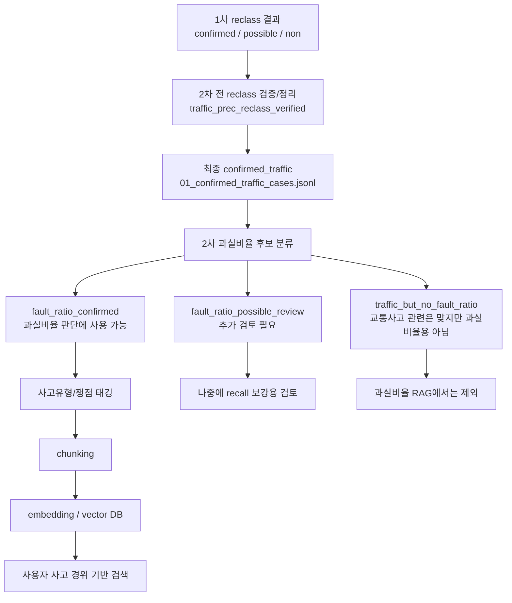

# 교통사고 판례 2차 분류 계획 및 코드 설명

## 1. 2차 분류의 목적

1차 분류에서는 전체 판례를 다음 3개로 나누었습니다.

```text
confirmed_traffic
possible_traffic_review
non_traffic
```

1차 분류의 목적은 **교통사고 관련 판례인지 아닌지**를 먼저 깨끗하게 나누는 것이었습니다.

2차 분류의 목적은 다릅니다.  
2차 분류는 `confirmed_traffic` 안에서 **과실비율 판단에 실제로 쓸 수 있는 판례인지**를 다시 나누는 단계입니다.

즉, 2차 분류는 다음 질문에 답하는 작업입니다.

```text
이 교통사고 판례가 과실비율/과실상계/책임비율 판단에 쓸 수 있는가?
```

---

## 1.5 2차 분류 전 reclass 검증/정리 단계

2차 과실비율 분류로 바로 넘어가기 전에 1차 reclass 결과를 한 번 더 검증하고 정리합니다.

이 단계의 목적은 2차 과실비율 분류기가 **교통사고 관련 판례만** 입력으로 받도록 만드는 것입니다.  
과실비율 2차 분류는 "교통사고 판례 중에서 과실비율 판단용인지"를 보는 단계이므로, 입력에 교통사고가 아닌 판례가 섞이면 뒤 단계의 precision이 떨어집니다.

검증 목적은 다음과 같습니다.

```text
1. confirmed_traffic 안에 진짜 교통사고 판례가 아닌 것이 섞였으면 non_traffic으로 내림
2. possible_traffic_review 안에 진짜 교통사고 판례가 있으면 confirmed_traffic으로 올림
3. possible_traffic_review 중 confirmed로 올릴 만큼 강하지 않은 것은 non_traffic으로 보냄
4. 기존 non_traffic은 최종 non_traffic에 그대로 유지
```

즉 이 단계가 끝나면 `possible_traffic_review`라는 중간 라벨은 더 이상 2차 분류 입력에 남기지 않습니다.  
최종적으로 다음 두 묶음만 남깁니다.

```text
confirmed_traffic
non_traffic
```

검증 코드는 다음 파일입니다.

```text
traffic_relevance_recheck.py
```

기본 실행:

```bash
python traffic_relevance_recheck.py --fresh
```

---

### 1.5.1 왜 이 검증이 필요한가

1차 reclass는 전체 판례 후보에서 교통사고 관련성을 먼저 넓게 분리하는 단계입니다.  
하지만 1차 결과에는 두 가지 문제가 남을 수 있습니다.

첫째, `confirmed_traffic` 안에도 일부 오탐이 섞일 수 있습니다.

예를 들면 다음과 같은 판례입니다.

```text
도로교통법위반이지만 실제 교통사고 발생이나 손해배상 문맥이 약한 판례
음주운전/무면허운전/면허취소처럼 행정처분 또는 형사처벌만 다루는 판례
교통상의 위험, 공동위험행위, 난폭운전만 있고 실제 사고 피해 판단은 없는 판례
일반 교통법규 해석 판례
```

이런 판례는 교통 관련 단어가 많아도, 과실비율 판단용 2차 분류의 입력으로는 노이즈가 됩니다.

둘째, `possible_traffic_review` 안에는 실제 교통사고 판례가 숨어 있을 수 있습니다.

예를 들면 다음과 같은 판례입니다.

```text
손해배상(자) 사건인데 본문 앞부분에 실제 사고 경위가 나오는 판례
구상금/보험금 사건인데 차량 충돌, 피해자 사망, 보험자 구상 문맥이 있는 판례
사건명은 일반적이지만 본문에 이 사건 사고, 피고 차량, 피해자, 충격, 부상 등이 명확한 판례
```

이런 판례를 `possible_traffic_review`에 계속 두면 recall이 떨어집니다.  
따라서 2차 분류 전에 possible 안의 강한 교통사고 판례를 confirmed로 올립니다.

---

### 1.5.2 검증에 사용하는 근거 필드

검증기는 1차 reclass가 각 row에 붙여 둔 근거 필드를 다시 사용합니다.

| 필드 | 의미 |
|---|---|
| `traffic_relevance_score` | 1차 교통사고 관련성 점수 |
| `traffic_signal_groups` | 어떤 종류의 교통사고 근거 묶음이 잡혔는지 |
| `traffic_signal_group_count` | 근거 묶음 개수 |
| `traffic_term_count` | 교통 관련 키워드 개수 |
| `traffic_reclass_reasons` | 1차 분류 이유 |
| `traffic_evidence_terms` | 실제 잡힌 근거 표현 |
| `has_core_accident_context` | 사고 핵심 문맥 여부 |
| `non_traffic_domain_terms` | 비교통 도메인 또는 노이즈 단어 |

검증 후에는 다음 필드를 추가합니다.

| 필드 | 의미 |
|---|---|
| `traffic_label_before_verification` | 검증 전 라벨 |
| `traffic_verification_source_label` | 어느 원본 파일에서 온 row인지 |
| `traffic_verification_final_label` | 검증 후 최종 라벨 |
| `traffic_verification_decision_reasons` | 최종 라벨로 보낸 이유 |

---

### 1.5.3 강한 교통사고 근거

다음 중 하나가 있으면 강한 사고 신호로 봅니다.

```text
direct_traffic_accident_terms
road_actor_and_accident_action_nearby
core_actor_and_strong_accident_action_nearby
direct_accident_expression
road_actor_action_nearby
core_actor_action_nearby
has_core_accident_context = true
```

의미는 다음과 같습니다.

```text
교통사고, 자동차 사고, 차량 충돌, 추돌사고 같은 직접 사고 표현
차량/도로/보행자/운전자 같은 주체와 충돌/상해/사망/충격 같은 행위가 가까이 나오는 문맥
본문에 실제 사고 발생, 피해자, 가해 차량, 손해 발생이 함께 나타나는 문맥
```

단순히 `도로`, `자동차`, `운전`, `교통` 같은 단어만 있는 것은 강한 사고 신호로 보지 않습니다.

---

### 1.5.4 보조 교통사고 문맥

강한 사고 신호만으로 바로 확정하지 않고, 다음 보조 문맥도 함께 봅니다.

```text
traffic_legal_or_insurance_context
fault_or_liability_context
traffic_situation_context
```

예시는 다음과 같습니다.

```text
손해배상
구상금
보험금
자동차손해배상
교통사고처리특례법
과실비율
과실상계
책임비율
주의의무
신호위반
전방주시의무
안전운전의무
```

이 보조 문맥은 "실제 교통사고가 법적 책임, 손해배상, 보험, 과실 판단과 연결되어 있는지"를 확인하기 위한 근거입니다.

---

### 1.5.5 confirmed_traffic 유지 기준

기존 `confirmed_traffic` row는 다음 조건을 만족하면 최종 confirmed로 유지합니다.

```text
1. traffic_relevance_score >= 8
2. traffic_signal_group_count >= 2
3. traffic_term_count >= 3
4. 강한 교통사고 근거가 있음
5. 강한 사고 근거 + 보조 문맥이 함께 있거나, 강한 사고 근거 묶음이 충분함
6. 법규-only 문맥이 아님
```

법규-only 문맥이란 다음처럼 교통사고 자체보다 법규 위반, 면허, 처벌만 중심인 경우입니다.

```text
도로교통법위반
음주운전
무면허운전
운전면허취소
운전면허정지
벌점
범칙금
과태료
```

이런 단어가 있어도 실제 사고, 손해배상, 보험, 피해자, 상해/사망 문맥이 함께 있으면 confirmed로 유지할 수 있습니다.  
하지만 법규 위반 문맥만 있고 사고 피해 문맥이 약하면 최종 `non_traffic`으로 내립니다.

---

### 1.5.6 possible_traffic_review 승격 기준

기존 `possible_traffic_review` row는 다음 조건을 모두 만족하면 최종 `confirmed_traffic`으로 승격합니다.

```text
1. 강한 교통사고 근거가 있음
2. 보조 교통사고 문맥이 있음
3. traffic_relevance_score >= 8
4. traffic_signal_group_count >= 2
5. traffic_term_count >= 3
6. 법규-only 문맥이 아님
7. confirmed를 막는 사건종류가 아님
```

승격되는 대표 유형은 다음과 같습니다.

```text
손해배상(자) 사건에서 차량이 보행자를 충격하고 피해자가 사망/상해를 입은 경우
구상금 사건에서 두 차량 운전자의 과실, 보험금 지급, 공동불법행위가 함께 나오는 경우
보험금/자동차손해배상 사건에서 실제 사고 경위와 손해 발생이 명확한 경우
```

반대로 위 조건을 만족하지 못하는 `possible_traffic_review`는 최종 `non_traffic`으로 보냅니다.  
이유는 2차 과실비율 분류의 입력을 깨끗하게 유지하기 위해서입니다.

---

### 1.5.7 non_traffic 유지 기준

기존 `non_traffic`은 이 단계에서 다시 confirmed로 끌어올리지 않습니다.  
최종 `non_traffic` 파일에 그대로 보관합니다.

이 단계의 목적은 다음 두 가지에 집중합니다.

```text
1. confirmed_traffic의 precision 보강
2. possible_traffic_review 안의 강한 교통사고 판례만 recall 보강
```

`non_traffic` 전체를 다시 탐색하는 작업은 별도 recall 보강 작업으로 분리하는 것이 안전합니다.

---

### 1.5.8 최종 라벨 이동 규칙

검증 후 라벨 이동은 다음과 같습니다.

| 원본 라벨 | 조건 | 최종 라벨 |
|---|---|---|
| `confirmed_traffic` | 유지 기준 충족 | `confirmed_traffic` |
| `confirmed_traffic` | 유지 기준 미충족 | `non_traffic` |
| `possible_traffic_review` | 승격 기준 충족 | `confirmed_traffic` |
| `possible_traffic_review` | 승격 기준 미충족 | `non_traffic` |
| `non_traffic` | 별도 재검토 없음 | `non_traffic` |

이렇게 정리하면 2차 과실비율 분류는 다음 파일만 입력으로 사용하면 됩니다.

```text
database/traffic_prec_reclass_verified/01_confirmed_traffic_cases.jsonl
```

`03_traffic_reclassified_verified_all.jsonl`은 2차 분류 입력이 아니라 전체 추적/감사용 파일입니다.

---

검증 결과는 새 폴더에 저장합니다.

```text
database/traffic_prec_reclass_verified/
```

출력 파일은 다음과 같습니다.

| 파일 | 의미 | 다음 처리 |
|---|---|---|
| `00_traffic_reclass_verification_report.json` | 검증/정리 결과 요약 | 통계 확인 |
| `01_confirmed_traffic_cases.jsonl` | 최종 confirmed_traffic | 2차 과실비율 분류 입력 |
| `02_non_traffic_cases.jsonl` | 최종 non_traffic | 2차 분류 제외 |
| `03_traffic_reclassified_verified_all.jsonl` | 전체 row에 최종 라벨을 붙인 추적 파일 | 검토/디버깅 |
| `04_demoted_from_confirmed_to_non_traffic.jsonl` | 기존 confirmed에서 non_traffic으로 내려간 row | 수동 확인 |
| `05_promoted_from_possible_to_confirmed.jsonl` | 기존 possible에서 confirmed로 올라간 row | 수동 확인 |
| `06_possible_to_non_traffic.jsonl` | 기존 possible에서 non_traffic으로 간 row | 별도 보관 |

현재 검증 결과는 다음과 같습니다.

```text
confirmed_traffic 입력: 3,207건
  - 최종 confirmed_traffic 유지: 3,197건
  - 최종 non_traffic으로 이동: 10건

possible_traffic_review 입력: 3,355건
  - 최종 confirmed_traffic으로 승격: 365건
  - 최종 non_traffic으로 이동: 2,990건

최종 confirmed_traffic: 3,562건
```

따라서 2차 과실비율 분류의 기본 입력은 원본 reclass의 `01_confirmed_traffic_cases.jsonl`이 아니라,
검증/정리 후 만들어진 다음 파일입니다.

```text
database/traffic_prec_reclass_verified/01_confirmed_traffic_cases.jsonl
```

---

## 2. 입력과 출력

### 2.1 입력 파일

2차 분류의 입력은 1차 reclass 결과를 검증/정리한 뒤 만들어진 최종 confirmed 파일입니다.

```text
database/traffic_prec_reclass_verified/01_confirmed_traffic_cases.jsonl
```

이 파일은 다음 두 묶음을 합친 것입니다.

```text
1. 기존 confirmed_traffic 중 교통사고 판례로 검증된 row
2. 기존 possible_traffic_review 중 confirmed 승격 후보 row
```

기존 `possible_traffic_review` 전체를 2차 분류에 넣지는 않습니다.  
다만 그 안에서 사고 신호와 손해배상/보험/책임 문맥이 강한 row만 confirmed_traffic으로 올립니다.

---

### 2.2 출력 폴더

2차 분류 결과는 새 폴더에 저장합니다.

```text
database/traffic_prec_fault_ratio/
```

---

### 2.3 출력 파일

```text
database/
  traffic_prec_fault_ratio/
    00_fault_ratio_classification_report.json
    01_fault_ratio_confirmed_cases.jsonl
    02_fault_ratio_possible_review.jsonl
    03_traffic_but_no_fault_ratio_cases.jsonl
    04_fault_ratio_classified_all.jsonl
```

| 파일 | 의미 | 다음 처리 |
|---|---|---|
| `00_fault_ratio_classification_report.json` | 2차 분류 결과 요약 | 통계 확인 |
| `01_fault_ratio_confirmed_cases.jsonl` | 과실비율 판단에 바로 쓸 수 있는 판례 | RAG 후보 |
| `02_fault_ratio_possible_review.jsonl` | 과실/책임 단서는 있으나 확정이 애매한 판례 | 추가 검토 |
| `03_traffic_but_no_fault_ratio_cases.jsonl` | 교통사고 관련은 맞지만 과실비율용은 아닌 판례 | 제외 또는 별도 보관 |
| `04_fault_ratio_classified_all.jsonl` | 전체 입력에 2차 라벨을 붙인 추적용 파일 | 검토/디버깅 |

---

## 3. 전체 흐름



---

## 4. 왜 2차 분류가 필요한가

`confirmed_traffic`은 교통사고 관련성 기준으로는 통과한 판례입니다.  
하지만 교통사고 관련 판례라고 해서 모두 과실비율 RAG에 적합한 것은 아닙니다.

예를 들어 다음 판례는 교통사고 관련은 맞지만, 과실비율 판단용으로는 부적합할 수 있습니다.

```text
교통사고처리특례법위반 형사사건
도주치상/도주차량 사건
운전면허취소 사건
산재/요양급여 사건에서 업무상 재해 여부만 판단한 사건
의료법/사기 사건에서 자동차보험진료수가만 쟁점인 사건
택시기사 해고 사건에서 사고 이력이 징계 사유로만 쓰인 사건
```

이런 판례는 교통사고와 관련은 있지만, 사용자가 묻는 과실비율 판단에는 직접 도움이 적을 수 있습니다.

따라서 2차 분류는 다음을 분리합니다.

```text
교통사고 관련 판례
↓
과실비율 판단용 판례 / 검토 필요 / 과실비율용 아님
```

---

## 5. 2차 분류 라벨 정의

### 5.1 fault_ratio_confirmed

`fault_ratio_confirmed`는 과실비율 판단에 바로 쓸 수 있는 판례입니다.

필요한 조건은 다음과 같습니다.

```text
1. 과실비율/과실상계/책임비율 관련 핵심 표현이 있음
2. 손해배상/보험/구상금/손해액 산정 문맥이 있음
3. 실제 당사자의 과실 또는 책임을 나누는 판단이 있음
```

대표 표현은 다음과 같습니다.

```text
과실비율
과실 비율
책임비율
책임 비율
과실상계
과실 상계
원고의 과실
피고의 과실
피해자의 과실
망인의 과실
운전자의 과실
손해배상책임
```

숫자 표현이 함께 나오면 더 강한 근거입니다.

```text
30%
70%
20:80
7:3
20 대 80
과실을 30%로 봄
과실비율은 70%
과실상계하여 손해액 산정
```

---

### 5.2 fault_ratio_possible_review

`fault_ratio_possible_review`는 과실비율과 관련 있을 가능성은 있지만 바로 확정하기 어려운 판례입니다.

예시는 다음과 같습니다.

```text
손해배상(자) 사건이지만 과실비율 표현이 약한 경우
구상금 사건이지만 실제 과실비율 판단이 본문에 명확하지 않은 경우
주의의무/전방주시의무 표현은 있으나 손해액 산정 문맥이 약한 경우
보험/책임 문맥은 있으나 비율 판단이 없는 경우
```

이 라벨은 버리는 것이 아니라 검토 큐입니다.

---

### 5.3 traffic_but_no_fault_ratio

`traffic_but_no_fault_ratio`는 교통사고 관련성은 있지만 과실비율 판단용으로 보기 어려운 판례입니다.

예시는 다음과 같습니다.

```text
교통사고처리특례법위반 형사사건
도주치상/도주차량 사건
운전면허취소 사건
업무상 재해 여부만 판단한 산재 사건
자동차보험진료수가 사기/의료법 사건
징계/해고 사건에서 교통사고가 배경으로만 등장한 사건
```

---

## 6. 2차 분류 기준

2차 분류는 단순 키워드 하나로 확정하지 않습니다.  
다음 근거 묶음을 조합해서 판단합니다.

| 근거 묶음 | 설명 | 예시 |
|---|---|---|
| `explicit_fault_ratio_expression` | 과실비율/책임비율/과실상계 직접 표현 | 과실비율, 책임비율, 과실상계 |
| `numerical_fault_apportionment` | 과실/책임 단어 주변에 숫자 비율이 있음 | 과실 30%, 70:30 |
| `party_fault_judgment` | 당사자별 과실 판단 | 원고의 과실, 피고의 과실, 피해자의 과실 |
| `damage_or_insurance_context` | 손해배상/보험/구상금/손해액 문맥 | 손해배상(자), 구상금, 자동차보험 |
| `traffic_duty_context` | 사고 책임 판단에 쓰이는 의무/위반 문맥 | 전방주시의무, 안전운전의무, 신호위반 |

---

## 7. confirmed 기준

`fault_ratio_confirmed`는 다음을 만족해야 합니다.

```text
1. 점수 기준 충족
2. 근거 묶음 2개 이상
3. 과실비율 핵심 문맥 존재
4. 손해배상/보험/손해액 문맥 존재
5. 과실비율용 제외 문맥이 강하지 않음
```

핵심 문맥은 다음 중 하나입니다.

```text
과실비율/과실상계/책임비율 직접 표현
또는
과실/책임 단어 주변의 숫자 비율 표현
또는
당사자별 과실 판단 + 손해배상 문맥
```

---

## 8. possible_review 기준

다음과 같은 경우는 `fault_ratio_possible_review`로 보냅니다.

```text
과실/책임 단어는 있으나 비율 판단이 약함
손해배상/보험 문맥은 있으나 과실비율 표현이 부족함
전방주시의무/주의의무 문맥은 있으나 과실상계 판단이 불명확함
교통사고 관련 형사사건이지만 민사 과실 판단으로 연결될 수 있는 단서가 있음
```

---

## 9. no_fault_ratio 기준

다음과 같은 경우는 `traffic_but_no_fault_ratio`로 보냅니다.

```text
교통사고 관련성은 있으나 과실비율 판단 문맥이 없음
형사처벌 여부만 판단함
운전면허/행정처분만 판단함
산재/요양급여에서 업무상 재해 여부만 판단함
의료법/사기에서 보험진료수가만 판단함
징계/해고에서 교통사고가 배경 사실로만 쓰임
```

---

## 10. 코드 실행

코드 파일:

```text
traffic_fault_ratio_stage2_classifier_commented.py
```

기본 실행:

```bash
python traffic_fault_ratio_stage2_classifier_commented.py --fresh
```

입력/출력을 직접 지정하려면 다음처럼 실행합니다.

```bash
python traffic_fault_ratio_stage2_classifier_commented.py \
  --input database/traffic_prec_reclass_verified/01_confirmed_traffic_cases.jsonl \
  --out-dir database/traffic_prec_fault_ratio \
  --fresh
```

---

## 11. 출력 row에 추가되는 필드

각 row에는 다음 필드가 추가됩니다.

```json
{
  "fault_ratio_label": "fault_ratio_confirmed",
  "fault_ratio_score": 14,
  "fault_ratio_reclass_reasons": [
    "explicit_fault_ratio_terms",
    "damage_or_insurance_context_terms"
  ],
  "fault_ratio_evidence_terms": [
    "과실상계",
    "손해배상(자)",
    "자동차보험"
  ],
  "fault_ratio_signal_groups": [
    "explicit_fault_ratio_expression",
    "damage_or_insurance_context"
  ],
  "fault_ratio_signal_group_count": 2,
  "has_core_fault_ratio_context": true,
  "has_damage_or_insurance_context": true
}
```

이 필드들은 나중에 왜 해당 판례가 과실비율 후보로 분류되었는지 검토하기 위해 남깁니다.

---

## 12. 하드코딩 여부

이 코드에는 특정 판례를 찍는 하드코딩을 넣지 않습니다.

없는 것:

```text
case_id가 몇 번이면 confirmed
특정 사건명은 무조건 제외
특정 줄 번호는 삭제
```

있는 것:

```text
과실비율 판단용 키워드 사전
손해배상/보험 문맥 키워드
제외 문맥 키워드
점수 기준
근접 문맥 기준
```

즉, 특정 데이터 row에 맞춘 하드코딩이 아니라 **규칙 기반 분류 기준**입니다.

---

## 13. 예상 결과

2차 분류를 적용하면 검증 후 통합 후보 3,562건은 다음처럼 나뉠 것으로 예상됩니다.

```text
fault_ratio_confirmed
→ 과실비율/과실상계 판단에 바로 쓸 수 있는 판례

fault_ratio_possible_review
→ 과실/책임 단서는 있으나 확정이 애매한 판례

traffic_but_no_fault_ratio
→ 교통사고 관련은 맞지만 과실비율 RAG에는 부적합한 판례
```

`fault_ratio_confirmed`는 검증 후 통합 후보보다 훨씬 적어질 가능성이 높습니다.  
이건 정상입니다.

2차 분류의 목적은 데이터를 많이 남기는 것이 아니라, 과실비율 판단에 쓸 수 있는 데이터를 깨끗하게 만드는 것입니다.

---

## 14. 다음 단계

2차 분류가 끝나면 다음 순서로 진행합니다.

```text
01_fault_ratio_confirmed_cases.jsonl
↓
사고유형/쟁점 태깅
↓
chunking
↓
embedding
↓
vector DB
↓
사용자 사고 경위 기반 RAG 검색
```

`02_fault_ratio_possible_review.jsonl`은 버리지 않고 보관합니다.  
추후 데이터가 부족하거나 특정 사고유형의 recall을 보강해야 할 때 다시 검토할 수 있습니다.
