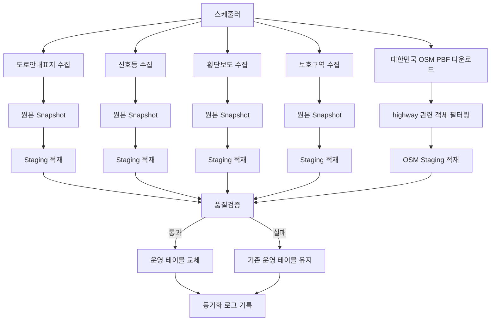
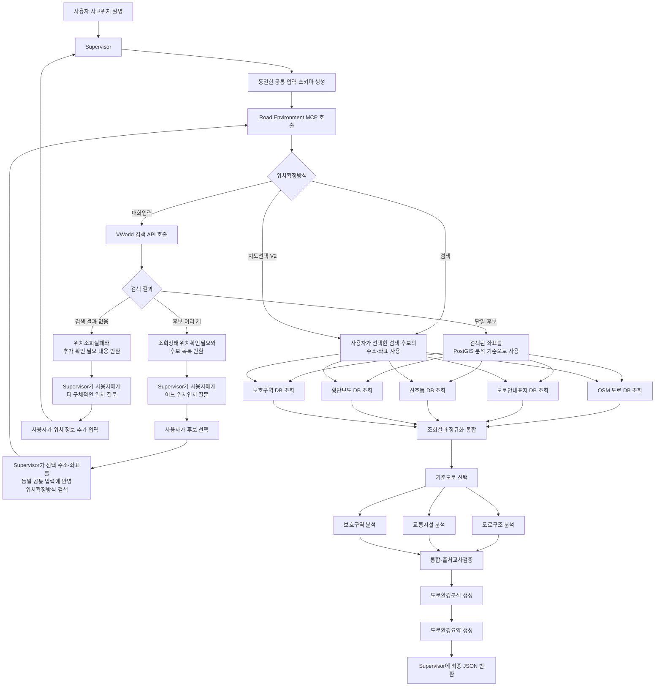

# 사고장소 도로환경 조회·분석 MCP 상세 구축 계획

> 문서 버전: 2.3 — VWorld 위치검색·Supervisor 재질문 흐름 확정본  
> 수정 기준일: 2026-07-13  
> 대상 흐름: Supervisor → Road Environment MCP → Supervisor → 과실비율 Agent  
> 핵심 방향: **전국 공간데이터 사전 적재 + 요청 시 내부 PostGIS 조회·분석**

---

# 1. 최종 결정

## 1.1 한 문장 결론

> **대한민국 OSM PBF에서 적재한 전국 도로 데이터가 Road Environment MCP의 핵심 운영데이터다. 공공데이터 4종은 신호등·횡단보도·도로안내표지·보호구역 정보를 보완한다. V1 최초 호출에서는 사고위치·주소·장소명을 VWorld 검색 API로 조회하고, 단일 위치가 확인되면 해당 검색 좌표를 기준으로 PostGIS를 조회한다. 후보가 여러 개면 MCP가 후보 목록을 Supervisor에 반환하고, 사용자 선택을 동일한 공통 입력 스키마에 반영하여 MCP를 다시 호출한다.**

사용자 상담 요청마다 공공데이터 API나 Overpass API를 연속 호출하지 않는다. 운영 분석은 대한민국 OSM PBF와 공공데이터 4종을 사전 적재한 내부 PostGIS를 기준으로 수행한다.

```text
사전 배치 파이프라인
대한민국 OSM PBF 전국 도로 데이터(주 데이터)
+ 공공데이터 4종(보완 데이터)
→ 전국 데이터 수집
→ 정규화·공간변환
→ PostGIS 적재

실시간 상담 파이프라인
사고위치·주소·장소명
→ VWorld 위치 검색
→ 단일 후보: 내부 PostGIS 조회
→ 다중 후보: Supervisor 재질문 후 MCP 재호출
→ 도로환경 분석
→ Supervisor 반환
```

## 1.2 V1 범위

V1은 다음 기능을 포함한다.

```text
1. VWorld 검색 API를 이용한 사고위치 검색 및 좌표 후보 확보
2. 전국 공공데이터 4종의 PostGIS 사전 적재
3. 대한민국 OSM 도로 데이터의 PostGIS 사전 적재
4. 사고좌표 주변 공간조회
5. 기준도로 선택
6. 교차로·분기·합류·진입·진출램프 분석
7. 신호등·횡단보도·보호구역 분석
8. 구조화된 도로환경분석과 요약 반환
```

V1에서 분석할 대상:

```text
기준도로
일반구간·교차로·분기·합류·램프
삼거리·사거리·회전교차로
직선·곡선
차로 수·일방통행 여부(원천 데이터가 있을 때)
차량신호등·횡단보도·보행자신호등·교통섬
어린이·노인·장애인 보호구역
```

## 1.3 V2 범위

V2는 V1의 분석기와 전국 DB를 그대로 사용하고, 사용자가 사고지점을 더 정확하게 지정하도록 입력 UX를 개선한다.

```text
V1 전체 기능
+
VWorld 2D 지도 API
+
VWorld Geocoder API
```

V2 흐름:

```text
사용자가 지도에서 사고지점 클릭
→ 위도·경도 확보
→ Geocoder로 주소 확인
→ Backend 상담 상태에 저장
→ Supervisor가 공통 입력 생성
→ Road Environment MCP가 동일한 전국 DB 조회
```

## 1.4 운영 데이터의 우선순위

Road Environment MCP의 데이터 역할은 다음 순서로 구분한다.

```text
1순위 핵심 운영데이터
대한민국 OSM PBF에서 적재한 전국 도로 데이터
→ 도로 geometry, node, way 연결관계, 도로종류, 일방통행,
   교차로, 회전교차로, 분기·합류, 진입·진출램프 분석

2순위 보완 운영데이터
공공데이터 4종
→ 도로안내표지, 차량신호등, 횡단보도,
   보호구역 확인

실시간 위치 검색·선택 데이터
VWorld 검색·2D 지도·Geocoder
→ 사고위치 후보 검색, 사용자 후보 선택, 지도 지점 선택 지원
```

즉, 도로환경 분석의 중심은 `대한민국 OSM PBF 적재본`이며, 공공데이터 4종은 OSM에 부족한 교통시설·규제 정보를 보완한다.

## 1.5 “모든 API 적재”의 정확한 의미

분석용 원천데이터는 전국 단위로 사전 적재한다.

```text
적재 대상
- 전국 도로안내표지
- 전국 신호등
- 전국 횡단보도
- 경찰청 전국 보호구역 현황
- 대한민국 OpenStreetMap 도로 데이터
```

다만 VWorld 검색·Geocoder는 사고위치 검색·선택을 위한 실시간 서비스이므로 전국 주소 DB를 만들기 위한 적재 대상으로 보지 않는다.

```text
실시간 사용
- VWorld 검색 API
- VWorld Geocoder API
- VWorld 2D 지도 API
```

---

# 2. 대한민국 OSM PBF와 Overpass API 역할 확정

## 2.1 대한민국 OSM PBF 적재본이 핵심 운영데이터다

Road Environment MCP가 실제로 도로구조를 분석할 때 중심이 되는 데이터는 다음과 같다.

```text
도로 선 geometry
도로를 구성하는 node
way 간 연결관계
highway 종류
oneway
lanes
junction
motorway_link·trunk_link
도로명·노선번호·목적지
bridge·tunnel·layer
통행제한 relation
```

이 정보는 대한민국 OSM PBF에서 도로 관련 객체를 추출하여 PostGIS에 적재한다.

```text
대한민국 최신 OSM PBF 자동 다운로드
→ highway 도로 way 추출
→ 도로 geometry에 필요한 node 보존
→ 도로 노선·통행제한 relation 보존
→ osm2pgsql Flex 변환
→ PostGIS 적재
```

따라서 운영 시 핵심 경로는 다음이다.

```text
대한민국 OSM PBF
→ 전국 도로 데이터 PostGIS 적재
→ Road Environment MCP 내부 조회
→ 기준도로·교차로·분기·합류·램프 분석
```

## 2.2 “대한민국 모든 도로”의 정확한 의미

PBF에는 대한민국 영역의 OpenStreetMap에 등록된 전국 도로 객체가 포함된다.

```text
맞는 표현
대한민국 OSM에 등록된 전국 도로 데이터를 적재한다.

과도한 표현
대한민국에 실제 존재하는 모든 도로 정보를 100% 완전하게 보장한다.
```

지역에 따라 `lanes`, `maxspeed`, `destination`, 세부 램프 태그 등이 누락될 수 있으므로, 누락 필드는 임의 생성하지 않고 `미확인`으로 처리한다.

## 2.3 DB에 적재할 도로 범위

PBF 전체를 그대로 애플리케이션 테이블에 넣지 않고, 도로환경 분석에 필요한 객체를 선별한다.

```text
highway=* 도로 way
도로 geometry를 구성하는 참조 node
도로 노선 relation
통행제한 relation
junction=roundabout
motorway_link·trunk_link·primary_link
bridge·tunnel·layer
name·ref·lanes·oneway·maxspeed
destination·destination:ref
```

핵심 테이블:

```text
osm_road_ways
osm_road_nodes
osm_road_relations
osm_turn_restrictions
```

## 2.4 공공데이터 4종의 역할

공공데이터 4종은 OSM의 대체재가 아니라 도로 주변의 교통시설·규제 정보를 보완한다.

```text
대한민국 OSM PBF 적재 데이터
→ 도로 자체의 구조와 연결관계 분석

공공데이터 4종
→ 도로안내표지·신호등·횡단보도·보호구역 보완
```

최종 도로환경은 두 데이터군을 결합해서 만든다.

```text
도로구조 분석
+
교통시설 분석
+
보호구역 분석
=
사고지점 통합 도로환경
```

## 2.5 Overpass API의 정확한 위치

Overpass API는 별도의 다른 도로정보 원천이 아니다. 대한민국 OSM PBF와 동일한 OpenStreetMap 데이터를 특정 위치·조건으로 조회하는 인터페이스다.

```text
대한민국 전체 OSM 데이터 확보
→ PBF 다운로드

특정 지점 OSM 원본 확인
→ Overpass API
```

전국 운영 DB의 주 적재원은 PBF이며, Overpass는 선택적 보조수단이다.

```text
선택적 사용
- 개발 초기 특정 지점 태그 확인
- PostGIS 적재 결과와 현재 OSM 비교
- 분석 오류가 의심되는 위치의 관리자 검증
- 테스트용 소규모 샘플 확보
```

운영 상담의 기본 분석은 Overpass 응답이 아니라 PostGIS에 적재된 대한민국 OSM PBF 데이터로 수행한다.

이 구분은 Overpass가 중요하지 않다는 뜻이 아니다. 도로구조의 핵심은 OSM 데이터이며, 전국 운영에서는 같은 OSM 데이터를 더 안정적으로 확보하기 위해 PBF 적재 경로를 선택한 것이다.

---
# 3. 데이터 원천과 처리 방식

| 구분 | 원천 | 운영 처리 방식 | 주요 역할 |
|---|---|---|---|
| 위치 검색 | VWorld 검색 API | V1 최초 호출 시 실시간 | 장소명·주소·도로명 → 위치·좌표 후보 |
| 도로안내 | 전국 도로안내표지 | 전국 사전 적재 | 기준도로·차로 수·방향·연결도로·목적지 |
| 차량신호 | 전국 신호등 | 전국 사전 적재 | 신호등 종류·도로명·제어방식·점멸운영 |
| 보행시설 | 전국 횡단보도 | 전국 사전 적재 | 횡단보도·보행자신호·교통섬·고원식 |
| 보호구역 | 경찰청 전국 보호구역 현황 | 전국 사전 적재 | 보호구역 geometry와 유형 |
| **도로구조·핵심 주 데이터** | **대한민국 OSM PBF** | **전국 도로 사전 적재** | **way·node·geometry·연결관계·교차로·분기·합류·램프 분석 기반** |
| 지도 선택 | VWorld 2D 지도 API | V2 프론트엔드 실시간 | 사고지점 클릭 |
| 좌표→주소 | VWorld Geocoder API | V2 실시간 | 선택좌표의 주소 확인 |
| 선택적 원본 확인 | Overpass API | 개발·관리자 검증 시 선택 사용 | 동일 OSM 데이터의 특정 지역 태그 확인 |

---

# 4. 시스템을 두 개의 파이프라인으로 분리

전국 적재 파이프라인과 사용자 요청 파이프라인은 서로 분리한다.

## 4.1 배치 적재 파이프라인



## 4.2 실시간 상담 파이프라인



### 흐름 해석

- V1 최초 호출은 일반적으로 `위치확정방식=대화입력`이며 VWorld 검색을 수행한다.
- 검색 결과가 한 건이면 같은 MCP 호출 안에서 PostGIS 조회와 분석까지 진행한다.
- 검색 결과가 여러 건이면 MCP가 임의로 선택하지 않고 `위치확인필요`와 후보 목록을 반환한다.
- Supervisor는 사용자에게 후보를 질문하고, 선택된 주소·좌표를 기존 공통 입력 스키마에 넣어 `위치확정방식=검색`으로 MCP를 다시 호출한다.
- 재호출에서는 이미 사용자가 선택한 검색 후보를 사용하므로 동일한 모호 검색을 반복하지 않는다.
- V2 지도에서 선택한 경우에는 `위치확정방식=지도선택`으로 동일 분석 경로에 진입한다.
- 별도의 외부 중간 위치 스키마는 만들지 않으며, 위치 처리 결과는 Road Environment MCP의 고정된 최종 출력 안에 기록한다.

---

# 5. 병렬·순차 처리 원칙

## 5.1 배치 적재

각 원천의 수집은 서로 독립적이므로 병렬 실행할 수 있다.

```text
병렬 수집 가능
- 도로안내표지
- 신호등
- 횡단보도
- 보호구역
- OSM PBF
```

다만 각 원천 안에서는 다음 순서가 필요하다.

```text
수집
→ 원본 저장
→ 정규화
→ Staging 적재
→ 품질검증
→ 운영 반영
```

한 원천의 적재가 실패해도 다른 운영 테이블까지 같이 지우지 않는다.

## 5.2 실시간 요청

```text
순차
공통 입력 검증
→ 위치확정방식 확인
→ 대화입력이면 VWorld 검색
→ 단일 후보면 분석 기준 좌표 결정
→ 다중 후보면 Supervisor에 위치확인필요 반환

재호출
사용자가 선택한 후보를 동일 공통 입력에 반영
→ 위치확정방식=검색으로 MCP 재호출
→ 선택된 주소·좌표 사용

병렬
OSM 도로·표지·신호등·횡단보도·보호구역 조회

순차
정규화 → 기준도로 선택

병렬
도로구조 분석·시설 분석·보호구역 분석

순차
통합 → 요약 → 반환
```

전국 데이터가 이미 적재되어 있으므로 상담 시 VWorld 위치 검색을 제외한 도로환경 원천은 내부 PostGIS에서 조회한다.

---

# 6. PostGIS 확정

## 6.1 PostgreSQL과의 관계

```text
PostgreSQL
= 일반 관계형 데이터베이스

PostGIS
= PostgreSQL에 공간정보 자료형과 공간연산을 추가하는 확장
```

완전히 다른 DB 제품이 아니라 PostgreSQL 안에서 활성화하는 확장이다.

```sql
CREATE EXTENSION IF NOT EXISTS postgis;
```

## 6.2 비용

```text
PostgreSQL 소프트웨어 사용료: 0원
PostGIS 소프트웨어 사용료: 0원
```

직접 Docker 또는 서버에 설치할 경우 별도의 라이선스 비용이 없다.

실제로 발생할 수 있는 비용은 다음 인프라 비용이다.

```text
서버 CPU·메모리
디스크·백업 저장소
클라우드 관리형 DB 이용료
네트워크 전송비
```

## 6.3 PostGIS가 필요한 이유

필수 공간연산:

```text
사고지점 반경 N미터의 도로·신호등·횡단보도 검색
사고좌표와 도로선의 최단거리 계산
사고좌표가 보호구역 Polygon 내부인지 판정
시설 geometry와 기준도로의 교차·근접 여부 확인
```

주요 함수:

```text
ST_DWithin
ST_Distance
ST_Contains
ST_Intersects
ST_ClosestPoint
ST_LineLocatePoint
```

공간 인덱스:

```sql
CREATE INDEX idx_osm_road_ways_geom
ON osm_road_ways
USING GIST (geom);
```

---

# 7. 전국 데이터 자동 적재 설계

## 7.1 공공데이터 4종

API가 페이지네이션을 제공하면 마지막 페이지까지 자동 수집한다.

```text
첫 페이지 호출
→ 전체 건수 확인
→ 페이지 반복
→ 모든 원본 응답 Snapshot 저장
→ 정규화
→ 좌표·geometry 변환
→ Staging 적재
→ 검증 후 운영 반영
```

권장 공통 저장 필드:

```text
source_id
source_name
road_name
road_address
parcel_address
latitude
longitude
geom
source_reference_date
collected_at
raw_json
```

`raw_json`을 남기는 이유:

```text
원본 필드 검증
API 필드 변경 대응
정규화 오류 추적
분쟁 시 근거 데이터 확인
```

## 7.2 대한민국 OSM 도로

### 최초 적재

```text
south-korea-latest.osm.pbf 자동 다운로드
→ highway 관련 way·node·route relation 필터링
→ osm2pgsql Flex 실행
→ 필요한 컬럼만 Staging에 적재
→ 품질검증
→ 운영 테이블 교체
```

PBF는 PDF가 아니다.

```text
PDF
= 문서 표현 형식으로 구조 추출이 어려울 수 있음

OSM PBF
= 구조화된 지도 바이너리 형식
= osmium·osm2pgsql 같은 전용도구가 직접 읽음
```

따라서 Python OCR이나 문서 파싱으로 처리하지 않는다.

### 적재할 주요 태그

```text
osm_way_id
name
ref
highway
lanes
oneway
junction
destination
destination:ref
maxspeed
bridge
tunnel
layer
geometry
```

### 적재하지 않을 기본 대상

```text
일반 건물
상점
공원
관광 POI
프로젝트 분석과 무관한 시설
```

단, 도로 geometry를 구성하는 참조 node는 함께 보존해야 한다.

## 7.3 갱신주기

V1 초기 권장안:

```text
공공데이터 4종: 원천 갱신주기에 맞춰 주간 또는 월간
OSM 도로: 주 1회 또는 월 1회 전체 교체
```

운영 고도화:

```text
최초 전체 OSM PBF 적재
→ 이후 OSM 변경분 replication 적용
```

V1에서는 복구가 단순한 전체 교체 방식으로 시작한다.

## 7.4 운영 테이블에 바로 쓰지 않는 이유

```text
원천 다운로드 중단
응답 필드 변경
좌표 누락
건수 급감
geometry 생성 실패
```

이런 문제가 발생했을 때 운영 데이터까지 손상되는 것을 방지해야 한다.

```text
원천 수집
→ staging 테이블
→ 검증
→ production 교체
```

검증 실패 시:

```text
새 데이터 반영 중단
기존 운영 테이블 유지
실패 원인과 건수 로그 저장
알림 발생
```

---

# 8. 권장 DB 구성

## 8.1 핵심 테이블

```text
road_guide_signs
traffic_signals
crosswalks
protection_zones

osm_road_ways
osm_road_nodes
osm_road_relations

source_sync_logs
source_raw_snapshots
```

## 8.2 `osm_road_ways`

```text
id
osm_way_id
road_name
road_ref
highway_type
lane_count
oneway
junction_type
destination
destination_ref
maxspeed
bridge
tunnel
layer
geom
osm_updated_at
loaded_at
```

## 8.3 `osm_road_nodes`

```text
osm_node_id
geom
connected_way_count
loaded_at
```

필요 시 운영 적재 후 전처리로 `connected_way_count`를 계산한다.

## 8.4 `traffic_signals`

```text
id
source_id
road_name
signal_type
control_type
flashing_operation
latitude
longitude
geom
source_reference_date
loaded_at
raw_json
```

## 8.5 `crosswalks`

```text
id
source_id
road_name
crosswalk_type
lane_count
pedestrian_signal
traffic_island
raised_crosswalk
geom
source_reference_date
loaded_at
raw_json
```

## 8.6 `protection_zones`

```text
id
source_id
zone_type
facility_name
geom
source_reference_date
loaded_at
raw_json
```

## 8.7 `source_sync_logs`

```text
sync_id
source_name
started_at
finished_at
status
received_count
staging_count
production_count
rejected_count
source_reference_date
error_message
pipeline_version
```

---

# 9. V1·V2 공통 입력 스키마

## 9.1 최종 입력

공통 입력 구조는 V1 최초 호출, 위치 후보 선택 후 재호출, V2 지도 선택에서 동일하게 유지한다.

```json
{
  "사고위치": "",
  "주소": null,
  "확정좌표": null,
  "위치확정방식": "대화입력"
}
```

## 9.2 필드 정의

| 필드 | 필수 | 자료형 | 설명 |
|---|---:|---|---|
| `사고위치` | 필수 | string | 사용자가 설명한 사고 장소 |
| `주소` | 선택 | string/null | VWorld 검색 후보 중 확인된 주소 또는 지도 선택 후 확인된 주소 |
| `확정좌표` | 선택 | object/null | 검색 후보 선택 또는 지도 선택으로 확보한 위도·경도 |
| `위치확정방식` | 필수 | enum | `대화입력`, `검색`, `지도선택` |

## 9.3 허용 상태

### 대화입력

V1 최초 호출의 기본 상태다.

```json
{
  "사고위치": "문암동사거리 진입 전 우측 진입로 부근",
  "주소": null,
  "확정좌표": null,
  "위치확정방식": "대화입력"
}
```

처리:

```text
Road Environment MCP
→ 사고위치·주소·장소명 정리
→ VWorld 검색 API 호출
→ 단일 후보면 같은 호출에서 분석 진행
→ 다중 후보면 위치확인필요 반환
```

### 검색

MCP가 반환한 여러 검색 후보 중 사용자가 하나를 선택한 후 재호출할 때 사용한다.

```json
{
  "사고위치": "중앙사거리",
  "주소": "광주광역시 동구 중앙로 일대",
  "확정좌표": {
    "위도": 35.146000,
    "경도": 126.922000
  },
  "위치확정방식": "검색"
}
```

이 상태는 사용자가 선택한 VWorld 검색 후보를 의미한다. 재호출에서는 동일한 모호 검색을 반복하지 않고 전달된 주소·좌표를 PostGIS 분석 기준으로 사용한다.

### 지도선택

V2에서 사용자가 2D 지도에서 사고지점을 직접 선택한 경우다.

```json
{
  "사고위치": "사용자가 지도에서 선택한 사고지점",
  "주소": "광주광역시 북구 북문대로 123",
  "확정좌표": {
    "위도": 35.180012,
    "경도": 126.884021
  },
  "위치확정방식": "지도선택"
}
```

## 9.4 검증 규칙

```text
사고위치
- 필수 문자열
- 공백 제외 1자 이상

주소
- 확인된 주소만 입력
- 확인되지 않았으면 null

확정좌표
- null 또는 위도·경도 모두 포함
- 위도 -90~90
- 경도 -180~180

위치확정방식
- 대화입력 / 검색 / 지도선택
```

조건:

```text
대화입력
→ 확정좌표 null 허용
→ VWorld 검색 수행

검색
→ 사용자가 선택한 검색 후보의 주소·좌표 필수
→ VWorld 모호 검색을 반복하지 않음

지도선택
→ 지도에서 선택한 좌표 필수
→ V2에서 사용
```

`확정좌표`가 없을 때는 객체 내부를 null로 만들지 않고 전체를 `null`로 둔다.

---

# 10. 출력 설계 원칙

출력을 다음 네 부분으로 구분한다.

```text
위치확인결과
= 어떤 위치와 좌표를 기준으로 분석했는지

조회결과
= 내부 DB에서 실제로 조회된 사실

도로환경분석
= 조회된 사실을 규칙으로 해석한 구조화 판정

도로환경요약
= 구조화 분석을 사람이 읽기 쉬운 문장으로 표현
```

`도로환경요약`이 분석을 대신하지 않는다.

```text
내부 DB 조회
→ 구조화된 분석
→ 요약 문장
```

과실비율 Agent는 `도로환경분석`을 우선 사용하고 `도로환경요약`은 설명용으로 사용한다.

## 10.1 위치 처리 결과는 최종 출력에 포함

VWorld 검색 결과를 별도의 외부 중간 JSON 계약으로 만들지 않는다.

```text
공통 입력
→ MCP 내부 VWorld 검색·후보 판정
→ 단일 후보면 DB 조회와 분석 계속
→ 다중 후보면 동일한 최종 출력 스키마로 위치확인필요 반환
```

성공과 위치확인필요 모두 `road_environment_output_v1` 구조를 사용하고, 값과 상태만 달라진다.

---

# 11. V1 최종 출력 스키마

```json
{
  "스키마버전": "road_environment_output_v1",
  "조회상태": "성공",

  "위치확인결과": {
    "상태": "분석가능",
    "입력위치": null,
    "확인주소": null,
    "분석기준좌표": {
      "위도": null,
      "경도": null
    },
    "확인방식": "VWorld검색",
    "사용자확정여부": false,
    "검색후보": [],
    "확인필요사유": []
  },

  "조회결과": {
    "도로안내": {
      "상태": "미확인",
      "관련표지수": 0,
      "기준도로": null,
      "도로종류": null,
      "도로노선번호": null,
      "도로노선방향": null,
      "차로수": null,
      "도로형태": null,
      "방향안내": []
    },

    "교통시설": {
      "차량신호등": {
        "상태": "미확인",
        "관련시설수": 0,
        "상세": []
      },
      "횡단보도": {
        "상태": "미확인",
        "관련시설수": 0,
        "상세": []
      }
    },

    "보호구역": {
      "해당여부": "미확인",
      "유형": []
    },

    "OSM도로데이터": {
      "상태": "미조회",
      "조회방식": "PostGIS",
      "데이터원천": "대한민국 OSM PBF 적재본(OpenStreetMap)",
      "조회반경_m": null,
      "기준도로후보": []
    }
  },

  "도로환경분석": {
    "분석상태": "미수행",
    "환경유형": [],

    "기준도로": {
      "도로명": null,
      "도로종류": null,
      "노선번호": null,
      "차로수": null,
      "일방통행": "미확인",
      "선정상태": "미확인",
      "선정근거": []
    },

    "도로구조": {
      "구간유형": "미확인",
      "도로선형": "미확인",
      "교차로": {
        "해당여부": "미확인",
        "유형": "미확인",
        "연결방향수": null,
        "판정상태": "미확인"
      },
      "분기합류": []
    },

    "시설환경": {
      "차량신호등인접": "미확인",
      "횡단보도인접": "미확인",
      "보행자신호등": "미확인",
      "교통섬": "미확인",
      "고원식횡단보도": "미확인"
    },

    "보호구역환경": {
      "해당여부": "미확인",
      "유형": []
    },

    "핵심판정": [],
    "판정근거": []
  },

  "도로환경요약": "",

  "확인정보": {
    "전체확인수준": "낮음",
    "미확인항목": [],
    "출처불일치": [],
    "제한사항": [],
    "사용출처": [],
    "데이터기준일자": [],
    "데이터적재시각": []
  }
}
```

---

# 12. 출력 상태값

## 12.1 조회상태

```text
성공
일부성공
위치확인필요
실패
```

| 상태 | 의미 |
|---|---|
| 성공 | 분석 기준 위치 확인과 필수 DB 조회·분석 완료 |
| 일부성공 | 일부 데이터 테이블 조회 또는 분석 실패 |
| 위치확인필요 | 위치 후보가 여러 개이거나 좌표를 신뢰할 수 없음 |
| 실패 | 위치 검색·선택 또는 핵심 DB 조회를 수행할 수 없음 |

## 12.2 시설 상태

```text
있음
없음
미확인
출처불일치
```

데이터가 검색되지 않았다고 바로 `없음`으로 단정하지 않는다.

```text
정상 적재·정상 조회이며 비존재를 신뢰할 수 있음
→ 없음

원천 누락·적재 지연·조회 실패 가능성 존재
→ 미확인
```

## 12.3 판정상태

```text
확정
추정
미확인
출처불일치
```

---

# 13. 도로환경분석 필드

## 13.1 환경유형

여러 유형이 동시에 적용될 수 있으므로 배열로 반환한다.

```text
일반도로구간
교차로접근부
교차로내부
T자형삼거리
Y자형삼거리
십자형사거리
다지교차로
회전교차로
도로분기부
도로합류부
고속도로진입램프
고속도로진출램프
차량신호등인접구간
횡단보도인접구간
보행자신호등설치구간
교통섬설치구간
고원식횡단보도구간
어린이보호구역
노인보호구역
장애인보호구역
미확인
```

## 13.2 기준도로

```json
{
  "도로명": "북문대로",
  "도로종류": "일반도로",
  "노선번호": null,
  "차로수": 4,
  "일방통행": "아님",
  "선정상태": "확정",
  "선정근거": [
    "사고좌표와 도로 geometry 거리 3.2m",
    "입력 주소의 도로명과 OSM 도로명 일치",
    "도로안내표지 기준도로와 일치"
  ]
}
```

## 13.3 도로구조

```json
{
  "구간유형": "분기부",
  "도로선형": "직선",
  "교차로": {
    "해당여부": "아님",
    "유형": null,
    "연결방향수": null,
    "판정상태": "확정"
  },
  "분기합류": [
    {
      "유형": "고속도로진입램프",
      "지도기준방향": "동쪽",
      "차량기준방향": "표지기준우측",
      "연결도로": "호남고속도로",
      "노선번호": "25",
      "목적지": ["서울", "순천"],
      "판정상태": "확정",
      "판정근거": [
        "motorway_link 태그",
        "일방통행 link가 일반도로에서 고속도로 본선으로 연결",
        "도로안내표지 연결도로명·노선번호와 일치"
      ]
    }
  ]
}
```

차량 진행방향 정보가 없으면 운전자 기준 좌·우를 임의로 생성하지 않는다.

---

# 14. 분석 알고리즘

## 14.1 위치 검색·선택 처리

### 최초 호출: `대화입력`

```text
1. 사고위치·주소·장소명에서 VWorld 검색어 구성
2. VWorld 검색 API 호출
3. 결과가 단일 후보이면 해당 검색 좌표를 분석 기준으로 사용
4. 결과가 여러 개이면 임의 선택하지 않고 위치확인필요와 후보 목록 반환
5. 결과가 없으면 위치조회실패와 추가 확인 필요 내용을 반환
```

### 후보 선택 후 재호출: `검색`

```text
1. Supervisor가 사용자가 선택한 후보의 주소·좌표를 공통 입력에 반영
2. 위치확정방식을 검색으로 설정
3. Road Environment MCP 재호출
4. 전달된 검색 후보 주소·좌표를 분석 기준으로 사용
5. 동일한 모호 검색을 다시 수행하지 않음
```

### V2 지도 선택: `지도선택`

```text
1. 사용자가 VWorld 2D 지도에서 사고지점 선택
2. 선택 좌표와 확인 주소를 공통 입력에 반영
3. 전달된 지도 좌표를 분석 기준으로 사용
```

별도의 위치 중간 스키마를 반환하지 않는다. 위치 처리 결과는 최종 출력의 `위치확인결과`에 기록한다.

## 14.2 내부 DB 병렬 조회

분석 기준 좌표가 결정된 후 다음을 병렬로 조회한다.

```text
OSM 도로
도로안내표지
신호등
횡단보도
보호구역
```


## 14.3 기준도로 선택

사용 요소:

```text
사고좌표와 도로 geometry 거리
주소 도로명과 OSM 도로명 일치
사고위치 자연어 단서
도로안내표지 기준도로 일치
도로 종류
램프·본선 여부
```

초기 점수 예시:

| 항목 | 최대점수 |
|---|---:|
| 사고좌표와 도로 거리 | 40 |
| 도로명 일치 | 25 |
| 사고위치 자연어 단서 | 15 |
| 도로안내표지 기준도로 일치 | 10 |
| 도로종류·램프 단서 | 10 |

```text
80점 이상 → 확정 후보
60~79점 → 추정
60점 미만 → 미확인 또는 위치 재확인
```

임계값은 테스트셋으로 조정한다.

## 14.4 도로 그래프 생성

```text
node → 그래프 정점
way의 연속 node → 그래프 간선
oneway → 간선 방향
highway·name·ref → 간선 속성
```

권장 라이브러리:

```text
Shapely
pyproj
NetworkX
```

## 14.5 교차로 분류

```text
연결방향 2개 → 일반구간 또는 곡선
연결방향 3개 → 삼거리·분기·합류 후보
연결방향 4개 → 사거리 후보
연결방향 5개 이상 → 다지교차로
junction=roundabout → 회전교차로
```

방위각 분석:

```text
반대방향 두 축 + 가지 한 개 → T자형 후보
세 방향이 Y 형태 → Y자형 후보
네 방향이 두 개의 반대축 → 십자형 후보
```

## 14.6 분기·합류

```text
기준도로의 진행 node에서 도로가 둘 이상으로 갈라짐
→ 분기 후보

서로 다른 진행 간선이 같은 도로로 합쳐짐
→ 합류 후보
```

`oneway`, 시작·끝 node, 본선·연결도로의 종류를 함께 사용한다.

## 14.7 진입·진출램프

```text
일반도로 → motorway_link → motorway 본선
→ 고속도로 진입램프 후보

motorway 본선 → motorway_link → 일반도로
→ 고속도로 진출램프 후보
```

```text
확정
- 방향 그래프·link 태그·본선 연결이 모두 일치

추정
- link 태그는 있으나 방향 또는 연결 일부 부족

미확인
- geometry 또는 태그 부족
```

## 14.8 시설 매칭

초기 후보 범위:

```text
신호등·횡단보도: 사고좌표 주변 약 50m
도로안내표지: 사고좌표 주변 약 300m
보호구역: Polygon 포함 여부
```

최종 관련성은 다음을 함께 본다.

```text
사고좌표와 거리
기준도로와 시설 geometry 거리
시설 도로명과 기준도로명 일치
교차로 중심과 거리
주소 행정구역 일치
```


## 14.9 출처 교차검증

예:

```text
도로안내표지: 우측 호남고속도로 25호선
OSM DB: motorway_link가 호남고속도로 본선으로 연결
→ 연결도로명·노선번호·구조 일치
```

불일치 예:

```json
{
  "항목": "차로수",
  "공공데이터값": 4,
  "OSM값": 6,
  "처리결과": "출처불일치로 표시하고 확정하지 않음"
}
```

## 14.10 도로환경요약

LLM의 자유 추론이 아니라 구조화 결과를 템플릿으로 문장화한다.

```text
기준도로
+ 도로구조
+ 교통시설
+ 보호구역
+ 미확인 한계
→ 1~3문장
```

표현 규칙:

```text
확정 → 확인된다 / 분석된다
추정 → 가능성이 있다 / 후보로 분석된다
미확인 → 확인되지 않았다
```

---

# 15. V1 예상 출력 예시

> 아래 값은 스키마 설명을 위한 가상 예시다.

```json
{
  "스키마버전": "road_environment_output_v1",
  "조회상태": "성공",

  "위치확인결과": {
    "상태": "분석가능",
    "입력위치": "문암동사거리 진입 전 우측 진입로 부근",
    "확인주소": "광주광역시 북구 북문대로 123",
    "분석기준좌표": {
      "위도": 35.180012,
      "경도": 126.884021
    },
    "확인방식": "VWorld검색",
    "사용자확정여부": false,
    "검색후보": [],
    "확인필요사유": []
  },

  "조회결과": {
    "OSM도로데이터": {
      "상태": "조회완료",
      "조회방식": "PostGIS",
      "데이터원천": "대한민국 OSM PBF 적재본(OpenStreetMap)",
      "조회반경_m": 100,
      "기준도로후보": [
        {
          "osm_way_id": 123456789,
          "도로명": "북문대로",
          "도로종류태그": "primary",
          "차로수": 4,
          "일방통행": "no",
          "사고지점거리_m": 3.2
        }
      ]
    },
    "교통시설": {
      "차량신호등": {
        "상태": "있음",
        "관련시설수": 2,
        "상세": []
      },
      "횡단보도": {
        "상태": "있음",
        "관련시설수": 1,
        "상세": []
      }
    },
    "보호구역": {
      "해당여부": "해당",
      "유형": ["어린이보호구역"]
    }
  },

  "도로환경분석": {
    "분석상태": "완료",
    "환경유형": [
      "고속도로진입램프",
      "도로분기부",
      "차량신호등인접구간",
      "횡단보도인접구간",
      "어린이보호구역"
    ],
    "기준도로": {
      "도로명": "북문대로",
      "도로종류": "일반도로",
      "노선번호": null,
      "차로수": 4,
      "일방통행": "아님",
      "선정상태": "확정",
      "선정근거": [
        "사고좌표와 도로 geometry 거리 3.2m",
        "주소 도로명과 OSM 도로명 일치"
      ]
    },
    "도로구조": {
      "구간유형": "분기부",
      "도로선형": "직선",
      "교차로": {
        "해당여부": "아님",
        "유형": null,
        "연결방향수": null,
        "판정상태": "확정"
      },
      "분기합류": [
        {
          "유형": "고속도로진입램프",
          "연결도로": "호남고속도로",
          "노선번호": "25",
          "판정상태": "확정",
          "판정근거": [
            "motorway_link",
            "방향 그래프에서 일반도로가 고속도로 본선으로 연결",
            "도로안내표지 연결정보와 일치"
          ]
        }
      ]
    },
    "시설환경": {
      "차량신호등인접": "해당",
      "횡단보도인접": "해당",
      "보행자신호등": "있음",
      "교통섬": "있음",
      "고원식횡단보도": "아님"
    },
    "보호구역환경": {
      "해당여부": "해당",
      "유형": ["어린이보호구역"]
    },
    "핵심판정": [
      "사고지점은 북문대로에서 호남고속도로 진입램프가 분기되는 구간으로 분석됨",
      "주변에 차량신호등과 횡단보도가 확인됨",
      "사고좌표는 어린이보호구역 내부에 포함됨"
    ],
    "판정근거": []
  },

  "도로환경요약": "사고지점은 북문대로에서 호남고속도로 25호선 진입램프가 분기되는 구간으로 분석된다. 주변에는 차량신호등과 보행자신호등이 설치된 횡단보도가 확인되며, 어린이보호구역 내부에 해당한다.",

  "확인정보": {
    "전체확인수준": "높음",
    "미확인항목": [],
    "출처불일치": [],
    "제한사항": [
      "사고 당시 실제 신호등 색상은 확인할 수 없음"
    ],
    "사용출처": [
      "VWorld 검색 API",
      "Road PostGIS - OpenStreetMap",
      "전국도로안내표지표준데이터",
      "전국신호등표준데이터",
      "전국횡단보도표준데이터",
      "경찰청 전국 보호구역 현황"
    ],
    "데이터기준일자": [],
    "데이터적재시각": []
  }
}
```

---

# 16. V2 출력 방향

V2는 V1 필드를 모두 유지하고 위치선택 검증정보만 추가한다.

```json
{
  "스키마버전": "road_environment_output_v2",
  "조회상태": "성공",
  "위치확인결과": {},
  "위치선택검증": {
    "지도선택여부": true,
    "사용자확정여부": true,
    "역지오코딩상태": "성공",
    "역지오코딩주소": "광주광역시 북구 북문대로 123"
  },
  "조회결과": {},
  "도로환경분석": {},
  "도로환경요약": "",
  "확인정보": {}
}
```

V2 출력이 크게 달라지지 않는 이유:

```text
도로환경 분석 원천은 동일한 전국 PostGIS
분석 알고리즘도 동일
지도·Geocoder는 입력 좌표의 정확도를 높이는 기능
```

---

# 17. 실패·부분성공 처리

## 17.1 위치 후보가 여러 개인 경우

Road Environment MCP가 후보를 임의로 선택하지 않는다. 고정된 최종 출력 스키마로 후보를 Supervisor에 반환한다.

```json
{
  "스키마버전": "road_environment_output_v1",
  "조회상태": "위치확인필요",
  "위치확인결과": {
    "상태": "확인필요",
    "입력위치": "중앙사거리",
    "확인주소": null,
    "분석기준좌표": null,
    "확인방식": "VWorld검색",
    "사용자확정여부": false,
    "검색후보": [
      {
        "후보ID": "candidate-1",
        "장소명": "중앙사거리",
        "주소": "광주광역시 동구 중앙로 일대",
        "좌표": {
          "위도": 35.146000,
          "경도": 126.922000
        }
      },
      {
        "후보ID": "candidate-2",
        "장소명": "중앙사거리",
        "주소": "전라남도 목포시 중앙로 일대",
        "좌표": {
          "위도": 34.790000,
          "경도": 126.385000
        }
      }
    ],
    "확인필요사유": [
      "동일하거나 유사한 위치가 여러 건 검색됨"
    ]
  },
  "조회결과": null,
  "도로환경분석": null,
  "도로환경요약": null,
  "확인정보": {
    "전체확인수준": "낮음",
    "미확인항목": ["사고위치"],
    "출처불일치": [],
    "제한사항": ["사용자 위치 선택 전에는 PostGIS 도로환경 조회를 수행하지 않음"],
    "사용출처": ["VWorld 검색 API"],
    "데이터기준일자": [],
    "데이터적재시각": []
  }
}
```

Supervisor 처리:

```text
후보 목록 수신
→ 사용자에게 어느 위치인지 질문
→ 사용자 후보 선택
→ 선택 후보의 주소·좌표를 동일 공통 입력에 반영
→ 위치확정방식=검색
→ Road Environment MCP 재호출
```

## 17.2 OSM 운영 DB 조회 실패

```text
공공데이터 시설 조회는 계속
도로구조는 미확인
조회상태는 일부성공
확인정보에 OSM DB 조회 실패 기록
```

## 17.3 공공데이터 일부 누락

```text
OSM 도로구조 분석은 완료
누락된 시설항목은 미확인
조회상태는 성공 또는 일부성공
원천 데이터기준일자와 적재상태 기록
```

## 17.4 배치 적재 실패

```text
Staging 검증 실패
→ 운영 테이블 교체 금지
→ 기존 정상 데이터 계속 사용
→ source_sync_logs에 실패 기록
```

이 구조를 통해 적재 파이프라인 장애가 즉시 상담 장애로 이어지지 않도록 한다.

---

# 18. MCP Tool 설계

## 18.1 Tool 이름

```text
inspect_road_environment
```

## 18.2 역할

```text
입력 검증
VWorld 위치 검색·후보 판정
선택된 위치의 분석 기준 좌표 결정
전국 Road PostGIS 조회
기준도로 선택
도로구조·시설·보호구역 분석
표준 출력 생성
```

## 18.3 호출 예시

```json
{
  "name": "inspect_road_environment",
  "arguments": {
    "사고위치": "문암동사거리 진입 전 우측 진입로 부근",
    "주소": null,
    "확정좌표": null,
    "위치확정방식": "대화입력"
  }
}
```

## 18.4 Supervisor 처리

```text
1. 사용자 대화에서 사고위치를 추출
2. 최초 공통 입력을 위치확정방식=대화입력으로 생성
3. Road Environment MCP 호출
4. 위치 후보가 한 건이면 MCP가 같은 호출에서 DB 조회·분석 진행
5. 위치확인필요이면 후보 목록을 사용자에게 질문
6. 사용자가 선택한 후보의 주소·좌표를 동일 공통 입력에 반영
7. 위치확정방식=검색으로 Road Environment MCP 재호출
8. 성공·일부성공이면 도로환경분석을 과실비율 Agent에 전달
```

과실비율 Agent에 우선 전달할 필드:

```text
도로환경분석.환경유형
도로환경분석.기준도로
도로환경분석.도로구조
도로환경분석.시설환경
도로환경분석.보호구역환경
도로환경분석.핵심판정
확인정보.전체확인수준
확인정보.미확인항목
```

---

# 19. 권장 코드 구조

```text
road_mcp/
├─ pyproject.toml
├─ .env
├─ src/
│  ├─ server.py
│  ├─ config.py
│  ├─ schemas/
│  │  ├─ input_schema.py
│  │  ├─ output_schema.py
│  │  └─ enums.py
│  ├─ clients/
│  │  ├─ vworld_search_client.py
│  │  └─ overpass_validation_client.py
│  ├─ repositories/
│  │  ├─ osm_road_repository.py
│  │  ├─ road_sign_repository.py
│  │  ├─ traffic_signal_repository.py
│  │  ├─ crosswalk_repository.py
│  │  └─ protection_zone_repository.py
│  ├─ analyzers/
│  │  ├─ location_resolver.py
│  │  ├─ road_matcher.py
│  │  ├─ topology_analyzer.py
│  │  ├─ intersection_classifier.py
│  │  ├─ ramp_classifier.py
│  │  ├─ road_curve_analyzer.py
│  │  ├─ facility_matcher.py
│  │  ├─ protection_zone_analyzer.py
│  │  ├─ evidence_resolver.py
│  │  └─ confidence_evaluator.py
│  └─ builders/
│     ├─ analysis_builder.py
│     ├─ summary_builder.py
│     └─ response_builder.py
├─ etl/
│  ├─ public_data/
│  │  ├─ sync_road_signs.py
│  │  ├─ sync_traffic_signals.py
│  │  ├─ sync_crosswalks.py
│  │  └─ sync_protection_zones.py
│  ├─ osm/
│  │  ├─ download_south_korea_pbf.sh
│  │  ├─ filter_roads.sh
│  │  ├─ osm2pgsql_flex.lua
│  │  ├─ load_osm_staging.sh
│  │  └─ validate_and_swap.py
│  └─ common/
│     ├─ quality_checks.py
│     ├─ snapshot_store.py
│     └─ sync_logger.py
└─ tests/
   ├─ test_input_schema.py
   ├─ test_location_resolver.py
   ├─ test_road_matcher.py
   ├─ test_intersection_classifier.py
   ├─ test_ramp_classifier.py
   ├─ test_etl_quality.py
   └─ test_output_schema.py
```

---

# 20. 구현 순서

## 1단계: PostGIS 환경 구성

```text
PostgreSQL + PostGIS Docker 구성
공간 확장 활성화
운영·Staging 스키마 생성
공간 인덱스 테스트
```

## 2단계: 공공데이터 4종 전국 ETL

```text
API 키·활용신청 확인
페이지네이션 수집기
원본 Snapshot
정규화
Staging 적재
품질검증
운영 반영
```

## 3단계: 대한민국 OSM 도로 전국 ETL

```text
PBF 자동 다운로드
highway 필터링
osm2pgsql Flex 컬럼 설계
Staging 적재
도로 건수·geometry 검증
운영 테이블 교체
```

## 4단계: 공간조회 Repository

```text
주변 OSM 도로 조회
주변 신호등·횡단보도 조회
도로안내표지 조회
보호구역 포함 판정
```

## 5단계: 도로구조 분석기

```text
기준도로 매칭
교차로 연결방향 분석
T·Y·십자형 분류
분기·합류 판정
진입·진출램프 판정
```

## 6단계: 통합 분석·출력

```text
시설 매칭
보호구역 분석
출처 교차검증
확인수준
출력 JSON Schema
도로환경요약
```

## 7단계: MCP·Supervisor 연동

```text
inspect_road_environment Tool
VWorld 단일·다중·미검색 결과 처리
위치확인필요 후보 반환
Supervisor 사용자 재질문
선택 후보를 동일 입력으로 재호출
과실비율 Agent 전달
```

## 8단계: V2 지도 선택

```text
VWorld 2D 지도
지도 클릭 좌표
Geocoder 주소 확인
상담 상태 저장
공통 입력 생성
```

---

# 21. 테스트 계획

## 21.1 적재 파이프라인 테스트

```text
원천별 전국 수집 완료 여부
페이지 누락 여부
중복률
좌표 누락률
geometry 유효성
건수 급감 여부
기준일자 역행 여부
Staging 실패 시 운영 유지 여부
```

## 21.2 도로환경 분석 테스트

최소 사례:

```text
일반 직선도로
곡선도로
십자형 사거리
T자형 삼거리
Y자형 삼거리
회전교차로
도로 분기
도로 합류
고속도로 진입램프
고속도로 진출램프
어린이보호구역
신호등·횡단보도 인접지점
동일 장소명이 여러 지역에 있는 사례
```

## 21.3 초기 품질 목표

```text
출력 JSON Schema 통과율: 100%
근거 없는 필드 생성: 0건
위치 모호 사례 임의 확정: 0건
판정근거 없는 확정 판정: 0건
배치 실패 시 기존 운영 테이블 보존: 100%
```

추가 측정 지표:

```text
기준도로 정확도
교차로 유형 정확도
분기·합류 정확도
램프 유형 정확도
시설 매칭 정밀도
보호구역 판정 정확도
```

---

# 22. 예상 결과와 한계

## 22.1 V1 예상 결과

```text
Supervisor가 자연어 사고위치를 전달
→ Road Environment MCP가 VWorld 위치 검색
→ 단일 후보면 전국 내부 DB에서 사고지점 주변 조회
→ 다중 후보면 Supervisor 재질문 후 선택 결과로 MCP 재호출
→ 실제 사고도로 후보 선택
→ 교차로·분기·합류·램프 분석
→ 신호등·횡단보도·보호구역 결합
→ 근거와 확인수준이 포함된 JSON 반환
```

운영 요청 시 대부분 내부 DB를 사용하므로 예상되는 장점:

```text
외부 API 장애 영향 감소
응답시간 안정화
동일 좌표에 대한 결과 일관성 향상
전국 데이터 기준일자 관리
재현 가능한 분석
공간 인덱스를 이용한 빠른 근접조회
```

## 22.2 V2 예상 결과

```text
사용자가 지도에서 정확한 사고지점 선택
→ 본선·램프·교차로 내부의 위치오차 감소
→ 기준도로 선택 정확도 향상
→ 위치확인 재질문 감소
→ V1과 동일한 분석 출력 반환
```

## 22.3 남는 한계

```text
OSM 태그가 지역별로 누락될 수 있음
공공데이터 기관별 기준일자가 다를 수 있음
차로 수·제한속도 태그가 없는 도로가 존재함
차로별 진행방향은 일반 OSM만으로 부족할 수 있음
사고 당시 공사·통제·임시시설은 반영되지 않을 수 있음
사고 당시 실제 신호 색상은 확인할 수 없음
차량 진행방향이 없으면 운전자 기준 좌·우 판정이 제한됨
```

---

# 23. 개발 체크리스트

## 조사·설계 완료

```md
- [x] MCP 기본 개념과 프로젝트 적용 방식 정리
- [x] 주소·장소명에서 위도·경도를 조회하는 방법 조사
- [x] 지도·공간정보·도로정보 원천 조사
- [x] 공공데이터 4종 선정
- [x] OSM 도로 geometry 필요성 확인
- [x] 대한민국 OSM PBF 적재본을 핵심 운영데이터로 확정
- [x] Overpass를 동일 OSM 데이터의 선택적 조회수단으로 구분
- [x] 전국 데이터 사전 적재 방향 확정
- [x] PostGIS 구조와 비용 확인
- [x] V1·V2 공통 입력 스키마 정의
- [x] V1 출력 스키마 정의
- [x] V2 확장 출력 방향 정의
- [x] 조회 불가·정보 부족 처리 정의
- [x] VWorld 다중 후보 시 Supervisor 재질문·MCP 재호출 흐름 정의
- [x] 별도 위치 중간 스키마 없이 고정 최종 출력 사용 확정
- [x] Supervisor·과실비율 Agent 연동 방식 정리
```

## 다음 구현

```md
- [ ] Road PostGIS Docker 환경 구성
- [ ] 공공데이터 4종 API 키·활용신청 확인
- [ ] 공공데이터 4종 전국 수집기 구현
- [ ] 공공데이터 Staging·검증·교체 구현
- [ ] 대한민국 OSM PBF 자동 다운로드 구현
- [ ] OSM 도로 필터·osm2pgsql Flex 구현
- [ ] OSM Staging·검증·교체 구현
- [ ] 공간조회 Repository 구현
- [ ] 기준도로 매칭 구현
- [ ] 교차로·분기·합류 분석 구현
- [ ] 진입·진출램프 분석 구현
- [ ] 시설·보호구역 분석 구현
- [ ] 출력 JSON Schema 검증
- [ ] inspect_road_environment MCP Tool 구현
- [ ] VWorld 단일·다중·검색결과 없음 분기 구현
- [ ] 선택 후보를 동일 공통 입력으로 재호출하는 Supervisor 흐름 구현
- [ ] Supervisor 연동 테스트
- [ ] V2 VWorld 2D 지도·Geocoder 구현
```

---

# 24. 공식 자료

## VWorld

- 검색 API 2.0  
  https://www.vworld.kr/dev/v4dv_search2_s001.do

- 2D 지도 API 2.0  
  https://www.vworld.kr/dev/v4dv_opn2dmap2guide_s001.do

- Geocoder API 2.0  
  https://www.vworld.kr/dev/v4dv_geocoderguide2_s002.do

## 공공데이터 4종

- 경찰청 전국 보호구역 현황  
  https://www.data.go.kr/data/15142010/openapi.do

- 전국 횡단보도 표준데이터  
  https://www.data.go.kr/data/15028201/standard.do

- 전국 신호등 표준데이터  
  https://www.data.go.kr/data/15028198/standard.do

- 전국 도로안내표지 표준데이터  
  https://www.data.go.kr/data/15028193/standard.do


## OpenStreetMap·PostGIS

- 대한민국 OSM Extract  
  https://download.geofabrik.de/asia/south-korea.html

- Overpass API  
  https://wiki.openstreetmap.org/wiki/Overpass_API

- osm2pgsql  
  https://osm2pgsql.org/

- PostGIS  
  https://postgis.net/

- OpenStreetMap 저작권·라이선스  
  https://www.openstreetmap.org/copyright

---

# 25. 최종 확정 문장

> **Road Environment MCP의 핵심 운영데이터는 대한민국 최신 OSM PBF에서 추출하여 PostGIS에 적재한 전국 도로 데이터다. 전국 도로안내표지·신호등·횡단보도·보호구역은 교통시설과 규제 환경을 보완한다. V1 최초 호출에서는 Supervisor가 전달한 자연어 사고위치·주소·장소명을 VWorld 검색 API로 조회한다. 단일 후보이면 해당 검색 좌표를 기준으로 내부 PostGIS를 조회하고, 후보가 여러 개이면 `위치확인필요`와 후보 목록을 Supervisor에 반환한다. Supervisor는 사용자 선택을 받아 같은 공통 입력 스키마에 선택 주소·좌표를 넣고 `위치확정방식=검색`으로 MCP를 다시 호출한다. 위치 처리용 별도 중간 스키마는 만들지 않고, 성공·다중 후보·실패 모두 고정된 최종 출력 스키마로 반환한다. Overpass API는 동일한 OSM 데이터를 특정 지점에서 확인할 때 선택적으로 사용하며, V2에서는 VWorld 2D 지도와 Geocoder를 추가하되 동일한 전국 DB와 분석 구조를 유지한다.**
