# fine_notice_analysis 재설계 v2 — OCR 전용 에이전트

| 항목 | 값 |
|------|-----|
| 작성일 | 2026-06-29 |
| 작성자 | workzion2 |
| 배경 | 감경 판단·이의신청서 생성은 Supervisor 또는 별도 Agent 책임 → 본 모듈을 OCR·분류 전용으로 단순화 |

---

## 1. 설계 변경 배경

### 기존 설계 (v1) 문제점

```
ocr_node
  → confidence_verification_node
    → violation_analysis_node
      → reduction_rule_node        ← 감경 계산 (불필요)
        → evidence_package_node    ← 필요 서류 패키징 (불필요)
          → objection_decision_node ← 이의 가능 여부 판단 (불필요)
```

- 감경률·이의 판단은 **Supervisor 또는 이의신청서 생성 Agent**가 할 일
- 이 에이전트가 알 필요 없는 정보를 과도하게 처리
- 단일 책임 원칙 위반

### 새 설계 (v2) 목표

> **이미지를 받아서 과태료/범칙금 고지서인지 판별하고, 맞으면 구조화 데이터를 반환한다.**  
> 아니면 돌려보낸다.

---

## 2. 상세 워크플로우

```mermaid
flowchart TD
    %% ── 입력 라우팅 ──────────────────────────────────────────────────────────
    START(["Supervisor 호출\nnotice_image (base64)"])
    START --> CHK_IMG{"notice_image\n있음?"}

    CHK_IMG -->|없음| NO_IMG["ocr_status = failed\n이미지 없음\nnext_actions: 고지서 이미지 재업로드 요청"]
    NO_IMG --> END_FAIL

    CHK_IMG -->|있음| MIME_CHK

    %% ── run_ocr: PDF vs 이미지 분기 ─────────────────────────────────────────
    MIME_CHK{"MIME 타입?"}

    MIME_CHK -->|"application/pdf"| PDF_CONV["pdf_to_images(pdf_bytes)\npdf2image 변환"]
    PDF_CONV -->|"ValueError\n페이지 수 > 10 ← R-08"| FAIL_OVER["ocr_status = failed\nocr_error: PDF 페이지 초과"]
    PDF_CONV -->|"pages = 0"| FAIL_EMPTY["ocr_status = failed\nocr_error: PDF 변환 결과 페이지 없음"]
    PDF_CONV -->|"1~10 페이지"| IMG_BLOCKS["_build_image_blocks(pages)\n전 페이지 image_url 블록 조립"]

    MIME_CHK -->|"image/jpeg · png · webp"| SINGLE_BLOCK["_build_image_blocks([(data, mime)])\n단일 이미지 블록"]

    IMG_BLOCKS --> GPT
    SINGLE_BLOCK --> GPT

    %% ── GPT 호출 및 마스킹 ───────────────────────────────────────────────────
    GPT["GPT-4o Vision 호출\nNOTICE_EXTRACTION_PROMPT\nmax_tokens = 1024"]
    GPT --> MASK_RAW["R-11: mask_personal_info(raw_text)\n주민번호·차량번호 마스킹\nJSON 파싱 전 raw 단계에서 즉시 처리"]
    MASK_RAW --> PARSE{"JSON 파싱\n성공?"}
    PARSE -->|실패| FAIL_PARSE["ocr_status = failed\nocr_error: GPT 응답 파싱 실패"]
    PARSE -->|성공| FT_CLASSIFY

    %% ── fine_type 분류 ──────────────────────────────────────────────────────
    FT_CLASSIFY["_classify_fine_type(title, authority, has_demerit)\n우선순위 7단계 키워드 매칭"]
    FT_CLASSIFY --> FT_RESULT{"fine_type?"}
    FT_RESULT -->|"범칙금"| FT_BJ["fine_type = 범칙금"]
    FT_RESULT -->|"과태료"| FT_KT["fine_type = 과태료"]
    FT_RESULT -->|"벌금 · None"| FT_REJ["ocr_status = rejected\n서비스 범위 외 / 인식 불가"]

    FT_BJ & FT_KT --> POST_FT
    FT_REJ --> END_REJ

    %% ── 후처리 ───────────────────────────────────────────────────────────────
    POST_FT["이중 마스킹: resident_number, vehicle_number\nevaluate_ocr(result, fine_type, notice_stage)\n※ ③-2·④ 구조적 부재 필드는 critical 제외 → degraded"]
    POST_FT --> EVAL{"ocr_status 판정\n(evaluator.py)"}
    EVAL -->|"critical + important 모두 있음"| ST_OK["ocr_status = success"]
    EVAL -->|"important 일부 누락"| ST_DEG["ocr_status = degraded\nmissing_fields 기록\nnext_actions: 이미지 재업로드 요청"]
    EVAL -->|"critical 일부 누락"| ST_PART["ocr_status = partial\nmissing_fields 기록\nnext_actions: 이미지 재업로드 요청"]

    %% ── ocr_node 반환 처리 ───────────────────────────────────────────────────
    FAIL_OVER & FAIL_EMPTY & FAIL_PARSE --> FAIL_ENV
    FAIL_ENV["envelope: failed\nnotice_image = None\nR-03: ocr_error 유지"]
    FAIL_ENV --> END_FAIL

    ST_OK & ST_DEG & ST_PART --> FLAT
    FLAT["_ALLOWED_FLAT_FIELDS 필터 → flat dict\nR-03: flat['ocr_error'] = result.get('ocr_error')\nnotice_image = None\n_update_agent_results() → agent_results 누적"]
    FLAT --> PART_CHK{"ocr_status\n= partial?"}
    PART_CHK -->|예| ENV_PART["FineNoticeEnvelope 조립\nstatus = partial\nmissing_fields 포함\nnext_actions: 이미지 재업로드 요청"]
    PART_CHK -->|아니오| VN
    ENV_PART --> END_PART

    %% ── confidence_verification_node ─────────────────────────────────────────
    subgraph VN ["confidence_verification_node"]
        direction TB
        VN1{"V-01\nnotice_stage\n유효 값?"} -->|"❌ errors++"| VN2{"V-02\nfine_type\n유효 값?"}
        VN1 -->|OK| VN2
        VN2 -->|"❌ errors++"| VN3{"V-03\nfine_amount\nnull→OK / 있음+0이하?"}
        VN2 -->|OK| VN3
        VN3 -->|"❌ errors++"| VN4{"V-04\nlaw_code\nnull→OK / 형식 불일치?"}
        VN3 -->|OK| VN4
        VN4 -->|"❌ errors++"| VN6{"V-05 R-01\nfine_type × notice_stage\nVALID_COMBINATIONS?"}
        VN4 -->|OK| VN6
        VN6 -->|"❌ errors++"| VCHECK{"format_errors\n있음?"}
        VN6 -->|OK| VCHECK
        VCHECK -->|있음| VFAIL["ocr_status = partial\nformat_errors 반영"]
        VCHECK -->|없음| VPASS["ocr_status 유지\n검증 통과"]
    end

    %% ── 문서 유형 분류 ───────────────────────────────────────────────────────
    VPASS & VFAIL --> DOC_ROUTE
    DOC_ROUTE{"fine_type?"}

    DOC_ROUTE -->|과태료| KT_ST{"notice_stage?"}
    KT_ST -->|사전통지| D1["① 과태료 사전통지서\n별지 154호 · 155호의2\n✅ prepayment_amount 이미지 추출값\n✅ charge_number\n✅ opinion_deadline = 의견제출기한\n❌ demerit_points"]
    KT_ST -->|"1차 고지서"| D2["② 과태료 고지서\n별지 151호 · 152호\n❌ prepayment_amount\n✅ charge_number\n✅ opinion_deadline = 납부기한\n⚠️ 이의신청 기한 = 수령일+60일 별도\n❌ demerit_points"]

    DOC_ROUTE -->|범칙금| BJ_ST{"notice_stage?"}
    BJ_ST -->|사전통지| CHK_VT{"violation_text\n추출됨?"}
    CHK_VT -->|있음| D3["③ 범칙금 통고서\n별지 159호의2\n✅ demerit_points_base · accumulated\n✅ opinion_deadline = 1차 납부기한\n✅ payment_deadline_2nd = 2차 납부기한\n✅ additional_amount = 가산금액\n✅ charge_number 통고서번호\n❌ prepayment_amount R-06"]
    CHK_VT -->|"없음 — 미납 독촉서"| D3B["③-2 범칙금 납부고지서\n별지 162호 · 163호\nocr_status = degraded\n❌ violation_text ❌ law_code\n❌ vehicle_number ❌ demerit_points\n✅ charge_number 통고서번호\n✅ opinion_deadline · fine_amount\n✅ payment_deadline_2nd = 2차 납부기한\n✅ additional_amount = 가산금액"]
    BJ_ST -->|즉결심판| D4["④ 즉결심판 출석통지서\n별지 168호\n✅ opinion_deadline = 출석 예정일시\n✅ court_venue = 출석 장소\n✅ violation_text · datetime · location\n❌ fine_amount 심판 전 미확정\n❌ law_code 구조적 부재 → evaluate_ocr에서 critical 제외\n❌ vehicle_number 구조적 부재 → evaluate_ocr에서 critical 제외"]

    %% ── 최종 출력 ────────────────────────────────────────────────────────────
    D1 & D2 & D3 & D4 --> ENV_OK["FineNoticeEnvelope 조립\nstatus / summary / structured_result\nmissing_fields / next_actions\nagent_results 누적"]
    D3B --> ENV_DEG["FineNoticeEnvelope 조립\nstatus = degraded\nmissing_fields: law_code, violation_text,\nviolation_datetime, violation_location, vehicle_number\nnext_actions: 원처분 통고서 추가 제출 요청"]
    ENV_OK --> END_OK
    ENV_DEG --> END_DEG

    END_OK(["END ✅ success / degraded / partial\nSupervisor → 이의신청서 Agent 판단"])
    END_DEG(["END ⚠️ degraded\n③-2: 위반 내역 없음 → 원처분 통고서 추가 제출 요청"])
    END_PART(["END ⚠️ partial\nSupervisor → 고지서 이미지 재업로드 요청"])
    END_FAIL(["END ❌ failed\nSupervisor → 고지서 이미지 재업로드 요청"])
    END_REJ(["END 🚫 rejected\nSupervisor → 서비스 범위 외 안내"])
```



---

## 3. 노드 요약

### ocr_node

| 단계 | 처리 내용 |
|------|----------|
| 입력 확인 | `notice_image` 없으면 즉시 `failed` — 이미지 해결은 Supervisor 책임 |
| PDF 변환 | `pdf_to_images()` — 빈 페이지·10페이지 초과 시 즉시 `failed` |
| GPT 호출 | `GPT-4o Vision` + `NOTICE_EXTRACTION_PROMPT` |
| 마스킹 R-11 | raw 응답 전체에 즉시 마스킹, 이후 JSON 파싱 |
| 분류 | `_classify_fine_type()` — title > authority > demerit 우선순위 |
| 평가 | `evaluate_ocr()` → `success` / `degraded` / `partial` |
| 반환 R-03 | `flat["ocr_error"] = result.get("ocr_error")` — 성공 시 None으로 초기화 |

### confidence_verification_node (validation_node)

| 검증 항목 | 규칙 |
|----------|------|
| `notice_stage` 유효 값 | `{"사전통지", "1차 고지서", "즉결심판"}` |
| `fine_type` 유효 값 | `{"과태료", "범칙금"}` — 벌금·None은 ocr_node에서 이미 rejected |
| `fine_amount` 형식 | 양의 정수 |
| `law_code` 형식 | `.+(법\|규칙\|령\|조례\|규정).+제\d+조` 정규식 |
| 법령 화이트리스트 | 이미지 전용 — 검증 불필요 (제거 대상) |
| 조합 검증 R-01 | `VALID_COMBINATIONS` 4가지만 허용 |

---

## 4. 출력 스키마 (Supervisor 수신)

### 처리 대상 문서 유형 (도로교통법 시행규칙 서식 기준)

| # | fine_type | notice_stage | 해당 서식 | 위반내용 |
|---|-----------|-------------|-----------|:--------:|
| ① | 과태료 | 사전통지 | 별지 154호, 155호의2 | ✅ |
| ② | 과태료 | 1차 고지서 | 별지 151호, 152호 | ✅ |
| ③ | 범칙금 | 사전통지 (통고서) | 별지 159호의2 | ✅ |
| ③-2 | 범칙금 | 사전통지 (납부고지서) | 별지 162호, 163호 | ❌ 없음 |
| ④ | 범칙금 | 즉결심판 | 별지 168호 출석통지서 | ✅ |

> ⚠️ **별지 162·163호 (범칙금 납부고지서)**: 위반내용·위반일시·차량번호가 서식에 없음.  
> 미납 독촉용 은행 고지서이며, 통고서번호로 원처분(별지 159호의2) 참조해야 함.  
> → `violation_text`, `law_code` 추출 불가 → `ocr_status=degraded` 로 처리, `missing_fields`에 기록

---

### ① 과태료 사전통지서 (별지 154호·155호의2)

```json
{
  "fine_type": "과태료",
  "notice_stage": "사전통지",
  "law_code": "도로교통법 제17조 제1항",
  "violation_text": "속도위반 20km 초과",
  "violation_datetime": "2026-05-01T14:30:00",
  "violation_location": "서울시 강남구 테헤란로",
  "fine_amount": 60000,
  "prepayment_amount": 48000,
  "charge_number": "20260001",
  "opinion_deadline": "2026-07-01",
  "issuing_authority": "강남경찰서",
  "vehicle_number": "12가●●●●",
  "demerit_points_base": null,
  "demerit_points_accumulated": null
}
```

**특징**: `prepayment_amount` 있음 (이미지에 인쇄된 사전납부금액), `opinion_deadline` = 의견제출기한

---

### ② 과태료 고지서 (별지 151호·152호)

```json
{
  "fine_type": "과태료",
  "notice_stage": "1차 고지서",
  "law_code": "도로교통법 제17조 제1항",
  "violation_text": "속도위반 20km 초과",
  "violation_datetime": "2026-05-01T14:30:00",
  "violation_location": "서울시 강남구 테헤란로",
  "fine_amount": 60000,
  "prepayment_amount": null,
  "charge_number": "20260001",
  "opinion_deadline": "2026-08-01",
  "issuing_authority": "강남경찰서",
  "vehicle_number": "12가●●●●",
  "demerit_points_base": null,
  "demerit_points_accumulated": null
}
```

**특징**: `prepayment_amount` 없음, `opinion_deadline` = 납부기한  
> ⚠️ 이의신청 가능 기한(질서위반행위규제법 제20조)은 **부과 통지 수령일 + 60일**로 납부기한과 다를 수 있음. Supervisor가 수령일 기준으로 별도 계산 필요.

---

### ③ 범칙금 통고서 (별지 159호의2)

```json
{
  "fine_type": "범칙금",
  "notice_stage": "사전통지",
  "law_code": "도로교통법 제17조 제1항",
  "violation_text": "속도위반 20km 초과",
  "violation_datetime": "2026-05-01T14:30:00",
  "violation_location": "서울시 강남구 테헤란로",
  "fine_amount": 40000,
  "prepayment_amount": null,
  "charge_number": "통고서번호",
  "opinion_deadline": "2026-07-01",
  "payment_deadline_2nd": "2026-07-21",
  "additional_amount": 48000,
  "issuing_authority": "강남경찰서",
  "vehicle_number": "12가●●●●",
  "demerit_points_base": 15,
  "demerit_points_accumulated": 20
}
```

**특징**: `demerit_points_*` 있음. 서식에 1차/2차 납부기한 모두 있음 → `opinion_deadline`은 **1차 납부기한** 사용

---

### ③-2 범칙금 납부고지서 (별지 162호·163호) — 위반내용 없음

```json
{
  "fine_type": "범칙금",
  "notice_stage": "사전통지",
  "law_code": null,
  "violation_text": null,
  "violation_datetime": null,
  "violation_location": null,
  "fine_amount": 40000,
  "prepayment_amount": null,
  "charge_number": "통고서번호",
  "opinion_deadline": "2026-07-01",
  "payment_deadline_2nd": "2026-07-21",
  "additional_amount": 48000,
  "issuing_authority": "강남경찰서",
  "vehicle_number": null,
  "demerit_points_base": null,
  "demerit_points_accumulated": null,
  "ocr_status": "degraded",
  "missing_fields": ["law_code", "violation_text", "violation_datetime", "violation_location", "vehicle_number"]
}
```

**특징**: 미납 독촉용 서식으로 위반 내역(위반내용·법조·차량번호 등)이 구조적으로 없어 이의신청 안내 불가. 이의신청 자체는 가능(범칙금 [1단계] 창 내)하나 구체적 안내를 위해 원처분 통고서(별지 159호의2) 추가 제출 요청 필요.

---

### ④ 즉결심판 출석통지서 (별지 168호)

```json
{
  "fine_type": "범칙금",
  "notice_stage": "즉결심판",
  "law_code": null,
  "violation_text": "속도위반 20km 초과",
  "violation_datetime": "2026-05-01T14:30:00",
  "violation_location": "서울시 강남구 테헤란로",
  "fine_amount": null,
  "prepayment_amount": null,
  "charge_number": null,
  "opinion_deadline": "2026-08-15",
  "court_venue": "서울중앙지방법원 301호 법정",
  "issuing_authority": "강남경찰서",
  "vehicle_number": null,
  "demerit_points_base": null,
  "demerit_points_accumulated": null
}
```

**특징**: `opinion_deadline` = **출석(예정)일시**, `fine_amount` 없음 (심판 전), `law_code`·`vehicle_number` 서식 구조상 없음 → critical miss가 아닌 **degraded** 처리 (③-2와 동일 예외 규칙)

> ⚠️ **별지 167호 (즉결심판청구서)**: 경찰 → 법원 내부 문서로 일반인 발부 대상 아님. 사용자가 가져올 경우 처리 가능하나 우선순위 낮음.

---

### 유형별 필드 비교표

| 필드 | ① 과태료 사전통지 | ② 과태료 고지서 | ③ 범칙금 통고서 | ③-2 범칙금 납부고지서 | ④ 즉결심판 |
|------|:-----------------:|:---------------:|:---------------:|:--------------------:|:----------:|
| `law_code` | ✅ | ✅ | ✅ | ❌ 구조적 부재 | ❌ 구조적 부재 |
| `violation_text` | ✅ | ✅ | ✅ | ❌ 없음 | ✅ |
| `violation_datetime` | ✅ | ✅ | ✅ | ❌ 없음 | ✅ |
| `vehicle_number` | ✅ | ✅ | ✅ | ❌ 구조적 부재 | ❌ 구조적 부재 |
| `fine_amount` | ✅ | ✅ | ✅ | ✅ | ❌ 미확정 |
| `opinion_deadline` | ✅ 의견제출기한 | ✅ 납부기한 ⚠️ | ✅ 1차 납부기한 | ✅ 납부기한 | ✅ 출석기일 |
| `payment_deadline_2nd` | ❌ | ❌ | ✅ 2차 납부기한 | ✅ 2차 납부기한 | ❌ |
| `additional_amount` | ❌ | ❌ | ✅ 가산금액 | ✅ 가산금액 | ❌ |
| `prepayment_amount` | ✅ | ❌ | ❌ | ❌ | ❌ |
| `charge_number` | ✅ | ✅ | ✅ 통고서번호 | ✅ 통고서번호 | ❌ |
| `court_venue` | ❌ | ❌ | ❌ | ❌ | ✅ 출석 장소 |
| `demerit_points_*` | ❌ | ❌ | ✅ | ❌ | ❌ |

### 서비스 범위 외 / 분류 불가

```json
{
  "ocr_status": "rejected",
  "rejection_reason": "벌금(형사처벌)은 서비스 범위 외입니다.",
  "fine_type": "벌금"
}
```

```json
{
  "ocr_status": "rejected",
  "rejection_reason": "고지서를 인식할 수 없습니다. 과태료 또는 범칙금 고지서 이미지를 다시 업로드해 주세요.",
  "fine_type": null
}
```

---

## 5. 제거되는 것

| 제거 항목 | 이유 |
|----------|------|
| `violation_analysis_node` | 위반 유형 정규화는 이의신청서 Agent 책임 |
| `reduction_rule_node` | 감경 계산은 Supervisor 또는 별도 Agent 책임 |
| `evidence_package_node` | 필요 서류 안내는 이의신청서 Agent 책임 |
| `objection_decision_node` | 이의 가능 여부 판단은 Supervisor 책임 |
| `FINE_RULES` dict | reduction_rule_node 제거에 따라 불필요 |
| `VIOLATION_DOCUMENTS` dict | evidence_package_node 제거에 따라 불필요 |
| `decision.py` | Supervisor 이관 |

---

## 6. 유지되는 것

| 유지 항목 | 이유 |
|----------|------|
| `ocr/agent.py` (GPT Vision 호출) | 핵심 기능 |
| `ocr/masking.py` | 개인정보 마스킹 필수 |
| `ocr/evaluator.py` | ocr_status 판정 로직 재사용 |
| R-03, R-08, R-11 | 이미지 처리 규칙 유지 |
| R-01, R-04 | validation_node에서 유지 |

---

## 7. Supervisor 책임으로 이관되는 것

- 이의 가능 여부 판단 (`opinion_deadline` vs `today`)
- 감경률 계산 및 사전납부금액 안내
- 필요 서류 체크리스트 제공
- 이의신청서 생성 Agent 호출

---

## 8. 미결 사항

| 항목 | 내용 |
|------|------|
| `ocr_status` Literal | `"rejected"` 코드 반영 필요 (설계 확정) |
| `prepayment_amount` | 이미지에 인쇄된 값만 추출 — 계산 없음 (확정) |
| `additional_amount` (가산금액) | ③·③-2 스키마 추가 확정 — 서식 인쇄값 그대로 추출 |
