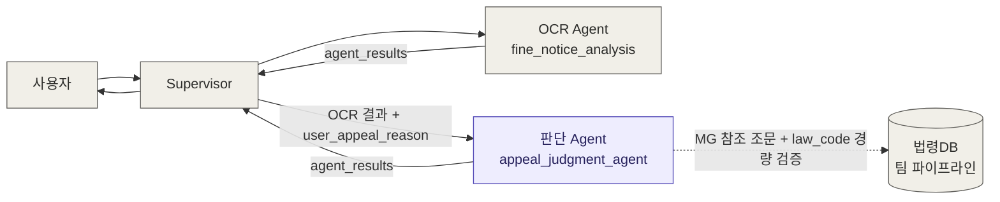
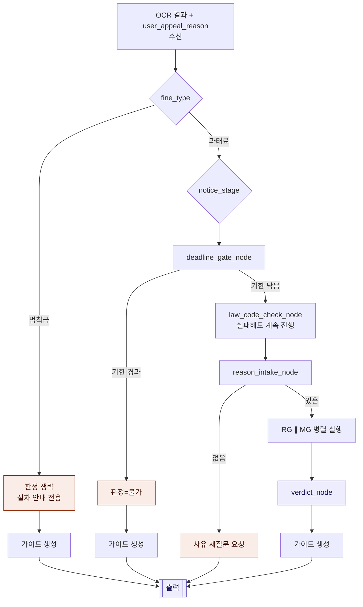

# 아키텍처 설계서
**과태료 이의가능성 판단 Agent** · Design Document 1/3

| 항목 | 값 |
|------|-----|
| 문서 번호 | ARCH-001 |
| 버전 | v3.0 |
| 작성일 | 2026-07-01 |
| 근거 문서 | DATA-002 (OCR Agent 데이터 모델 설계서 v3.0), 설계 정리 문서 v13 |
| 변경 요약 | v2.0 → v3.0: law_code 검증을 경량 버전(`LDB_CHECK`, 하드블록 없음)으로 부분 복원. v2.0에서 "유지관리 부담"으로 든 근거가 law_code에는 잘못 적용됐음을 재확인 — 데이터가 이미 자동화된 파이프라인이라 유지비용이 사실상 0. 벌점/채널 관련 항목은 "제거"에서 "대기 상태(재검토 보류)"로 재분류. |

---

## 1. 개요

본 Agent(이하 `appeal_judgment_agent`)는 OCR Agent(`fine_notice_analysis`)가 Supervisor를 통해
전달한 고지서 분석 결과를 입력으로 받아, **과태료 이의가능성을 판정**하고 **진행 시 유의사항을
안내**한다. 범칙금은 이의신청서 생성이 서비스 범위 밖(법원행정 영역)이므로 판정 없이 절차 안내
경로로만 처리한다.

핵심 설계 원칙은 세 가지다.

1. **판정(merit)과 리스크(risk)는 별도 축으로 유지한다.** 사유가 법적으로 인정될 만한지(merit)와,
   그 사유가 신원노출로 이어질 위험이 있는지(risk)는 독립적인 문제이며, 하나의 점수로 합치면 판단
   근거가 불투명해지고 법률자문처럼 보일 위험이 커진다.
2. **가이드(안내)는 판정과 분리된 공용 산출물이다.** fine_type·판정 성공 여부와 무관하게 항상 동일한
   6종 가이드 템플릿이 나가며, 판정 결과 필드만 조건부로 채워진다.
3. **본 서비스의 산출물은 "완성된 이의신청서(문서)"까지다.** 문서가 어느 채널(우편/방문/온라인)로
   제출되는지는 산출물의 형태를 바꾸지 않으므로, 판정에 기여하지 않는 부가 검증·데이터 유지관리
   기능은 스코프에서 제외한다 (v2.0에서 이 원칙에 따라 세 가지 기능을 제거했다 — §5-4 참고).

---

## 2. 시스템 컨텍스트

- 본 Agent는 OCR Agent와 **단일 책임 원칙**으로 분리된다 — OCR·문서 분류는 OCR Agent, 법적 판단·
  안내는 본 Agent가 전담한다.
- 본 Agent는 사용자와 직접 대화하지 않는다. 부족한 입력(사유 미입력)이 있으면 Supervisor에
  `status`와 `next_actions`로 요청을 되돌리고, Supervisor가 사용자에게 재질문한다.
- **법령DB 연동은 두 가지 역할을 한다 (v3.0).** ① `MG`가 사용하는 고정 참조 조문(시행규칙 제142조,
  질서위반행위규제법 제14조 등)의 최신성 유지, ② `LDB_CHECK`를 통한 개별 고지서 `law_code`의 경량
  존재 여부 조회 (판정을 막지 않는 단일 조회, 실패해도 파이프라인 진행). 벌점 기준표(별표28) 조회는
  아직 대기 상태 — 법령DB가 별표를 파싱 가능한 구조화 텍스트로 주는지 미확인.

---

## 3. LangGraph 노드 구성 (v3.0)

| 노드명 | 역할 | 입력 의존 | 출력 |
|--------|------|----------|------|
| `fine_type_router` | `fine_type` 분기 (과태료/범칙금). 조건부 엣지로 구현, 별도 노드 아님 | `fine_type` | 다음 노드 라우팅 |
| `deadline_gate_node` | `notice_stage`별 기한 계산 + 기한도과 하드게이트 | `notice_stage`, `opinion_deadline` | `computed_deadline`, `deadline_passed` |
| `law_code_check_node` (`LDB_CHECK`) | (v3.0 복원) 자동화 파이프라인으로 `law_code` 단일 조회. 실패해도 파이프라인을 막지 않음 | `law_code` | `law_code_verified` |
| `reason_intake_node` | `user_appeal_reason` 존재 확인 | `user_appeal_reason` | 존재 여부, 없으면 조기종료 |
| `risk_classification_node` (RG) | 1단계 키워드 + 2단계 LLM, 재현율 우선 | `user_appeal_reason` | `risk_flag` |
| `merit_classification_node` (MG) | 고정 참조 법조문을 컨텍스트로 LLM 단일 호출 | `user_appeal_reason`, `notice_stage`, LDB 참조 조문 | `merit` |
| `verdict_node` (E) | RG × MG 조합 매트릭스로 최종 판정 통합 | `risk_flag`, `merit` | `overall_possibility`, `risk_flag` |
| `guide_generation_node` (G) | 6종 가이드 공용 템플릿 생성 (`law_code_verified`에 따라 ⑥ disclaimer 문구 조건부 변경) | 위 전체 출력 | `guide` (①~⑥) |

### 노드 상태 변경 이력 (v1.0 → v3.0)

| 노드 | v1.0 | v2.0 | v3.0 | 비고 |
|---|---|---|---|---|
| `channel_lookup_node` (발부기관 판별) | 있음 | 제거 | 제거 유지 | 접수채널 안내가 단일 문구로 통합, 데이터가 지자체 수작업 리서치 대상이라 유지관리 부담 근거 유효 |
| `law_code_verification_node` (정규화→조회→하드블록) | 있음 | 제거 | **`law_code_check_node`로 경량 부활** | v2.0의 "유지관리 부담" 근거가 이 항목엔 잘못 적용됐음을 재확인 — 데이터가 자동화 파이프라인이라 비용이 사실상 0. 다만 하드블록(재확인 루프)은 되살리지 않음 |
| `zero_point_check_node` (`ZP`, 벌점 0점) | 없음 (v1.1에서 도입) | 제거 | **대기 상태 (미도입 유지)** | 법령DB API가 별표28을 파싱 가능한 구조화 텍스트로 주는지 미확인이라 재검토 보류 중. 유지관리 부담 문제가 아니라 기술적 미확인 사항 |

`law_code_verification_node`와 `zero_point_check_node`는 겉보기엔 같은 "v2.0에서 제거된 부가 기능"
처럼 보였지만, 재검토 결과 성격이 완전히 달랐다. 전자는 데이터 소스(법령DB, 자동화됨)가 명확해
경량 버전으로 즉시 복원 가능했고, 후자는 데이터 소스(법령DB의 별표 응답 형식)가 아직 불확실해
복원 여부를 판단할 수 없는 상태다. **"유지관리 부담"이라는 근거를 여러 기능에 뭉뚱그려 적용하면
안 되고, 항목마다 실제 데이터 소스를 확인해야 한다**는 게 이번 재검토의 교훈이다.

---

## 4. 그래프 흐름 (v3.0 기준, 설계 정리 문서 v13과 동일)

노드 수는 v1.0 대비 30개 안팎에서 v2.0에서 17개로 줄었고, v3.0에서 `law_code_check_node`가 경량
형태로 복원되며 18개가 됐다. 전체 상세 도식(엣지 라벨, 클래스 스타일 포함)은
설계 정리 문서의 "전체 흐름도 (v12)"를 정본으로 한다.

---

## 5. 설계 원칙 상세

### 5-1. 판정(E)과 가이드(G)의 분리

`E`(verdict_node)는 과태료에서만 실행되고, 범칙금·기한도과 경로는 `E`를 건너뛰고 각자의 고정
상태값으로 `G`(guide_generation_node)에 진입한다. 가이드 6종(①~⑥)은 **fine_type과 무관하게 항상
전체 출력**되는 공용 템플릿이며, 판정 필드(`overall_possibility`)만 조건부로 채워진다.

### 5-2. RG와 MG의 구조적 비대칭

| | RG (리스크 게이트) | MG (인정사유 분류) |
|---|---|---|
| 구조 | 1단계 키워드 매칭 → 2단계 LLM | 고정 참조 조문 컨텍스트 기반 LLM 단일 호출 |
| 놓쳤을 때 위험도 | 높음 (실제 불이익 발생 가능) | 낮음 (`merit=보류`로 안전하게 수렴) |
| 설계 우선순위 | 재현율 우선, 애매하면 `risk=true` | 정확성·최신성 우선, 애매하면 `merit=보류` |

두 노드가 다른 구조를 갖는 이유는 **놓쳤을 때의 결과가 다르기 때문**이며, 이는 의도된 비대칭이다.

### 5-3. notice_stage 포함 범위

서비스명은 "이의신청"이지만 `notice_stage=사전통지`(의견제출)도 판정 대상에 포함한다. 자진납부 20%
감경 기회가 살아있는 유일한 시점이며, RG의 근거 법조항도 의견제출·이의제기 두 단계를 함께 명시하고
있어 분리할 이유가 없다.

### 5-4. 스코프 축소 원칙 재검토 (v3.0) — 조건 2는 항목별로 실제 검증해야 한다

v2.0에서는 세 가지 부가 기능(law_code 검증, 벌점 화이트리스트, 발부기관 판별)이 아래 두 조건을 모두
만족한다고 보고 일괄 제거했다.

1. **판정 로직(`E`)의 입력으로 쓰이지 않는다** — merit·risk 어느 쪽도 이 데이터에 의존하지 않는다.
2. **지속적으로 변하는 외부 데이터를 우리가 유지관리해야 한다.**

**v3.0에서 재검토한 결과, law_code 검증은 조건 2를 만족하지 않는다는 게 드러났다.** law_code 데이터는
팀의 법령DB 파이프라인이 이미 자동으로 최신 상태를 유지해주므로, 추가 유지관리 비용이 사실상 0이다.
조건 1(판정에 안 쓰임)은 여전히 참이지만, **조건 1만으로는 완전 제거를 정당화할 수 없다** — 유지비용이
0에 가깝다면 판정에 안 쓰여도 문서 품질 목적으로 가볍게 검증할 가치가 있다. 그래서 v3.0에서는 하드
블록(재확인 루프) 없이 **경량 검증**으로 되살렸다.

발부기관 판별(지자체 시스템 확인은 수작업 리서치 필요)과 벌점 화이트리스트(법령DB 응답 형태 자체가
미확인)는 조건 2가 실제로 유효하거나 최소한 검증되지 않은 상태이므로, 제거·대기 상태를 유지한다.

**개정된 원칙**: "판정에 기여하는가"와 "유지관리 부담이 있는가"는 **별개로, 항목마다 각각 확인**해야
한다. 두 조건이 비슷해 보인다고 같은 결론으로 묶어서 적용하면 이번처럼 잘못된 제거가 나올 수 있다.

---

## 6. Supervisor 연동 계약

- **입력**: OCR Agent의 `agent_results["fine_notice_analysis"]["structured_result"]` 전체 +
  `user_appeal_reason`(Supervisor가 사용자에게 별도로 수집). v1.0에 있던
  `law_code_reverification_attempted` 플래그는 제거됨 (재확인 절차 자체가 없어짐).
- **출력**: `agent_results["appeal_judgment"]` 키로 동일한 envelope 포맷(`status`, `summary`,
  `structured_result`, `missing_fields`, `next_actions`)을 사용한다 — OCR Agent의 `make_envelope()`
  유틸을 그대로 재사용 가능.
- **재호출 조건**: `status`가 `input_required`일 때만 Supervisor가 사유를 채워 재호출한다 (v1.0에
  있던 `law_code_unverified` 재호출 경로는 제거됨). 상세 스키마는 03_API인터페이스_설계서 참고.
