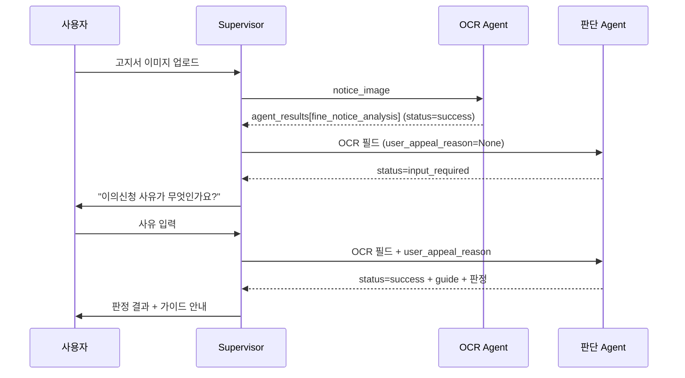

# API 인터페이스 설계서
**과태료 이의가능성 판단 Agent** · Design Document 3/3

| 항목 | 값 |
|------|-----|
| 문서 번호 | API-004 |
| 버전 | v3.0 |
| 작성일 | 2026-07-01 |
| 근거 문서 | ARCH-001 v3.0, DATA-003 v3.0, 설계 정리 문서 v13 |
| 변경 요약 | v2.0 → v3.0: 출력 페이로드에 `law_code_verified` 필드 복원 (경량 검증). 입력 페이로드·재호출 시나리오는 변경 없음 — `LDB_CHECK`는 Supervisor 왕복을 유발하지 않으므로 `law_code_reverification_attempted` 같은 재호출용 입력 필드는 되살아나지 않았다. |

---

## 1. 개요

본 문서는 Supervisor가 `appeal_judgment_agent`를 호출할 때의 입력 페이로드, Agent가 반환하는
`agent_results` 출력 페이로드, 그리고 부족한 정보로 인한 재호출 시나리오를 정의한다. OCR
Agent(`fine_notice_analysis`)의 envelope 포맷(`make_envelope()`)을 그대로 재사용한다.

---

## 2. graph.invoke() 입력 페이로드 (v2.0에서 단순화, v3.0도 동일)

### 2-1. 케이스 A — 최초 호출 (OCR 완료 직후)

```python
{
    # OCR Agent structured_result에서 그대로 전달
    "fine_type":             "과태료",
    "notice_stage":          "1차 고지서",
    "violation_text":         "...",
    "opinion_deadline":       "2026-07-20",   # 인쇄된 납부기한
    "payment_deadline_2nd":   None,
    "issuing_authority":      "○○구청",       # 가이드에 그대로 노출만, 판별하지 않음
    "law_code":                "도로교통법 제17조 제1항",  # disclaimer용으로만 참조

    # Supervisor가 별도로 수집해 함께 전달 (OCR 결과에 없는 값)
    "user_appeal_reason": None,   # 아직 안 물어봤으면 None
}
```

### 2-2. 케이스 B — `input_required` 이후 재호출 (사유 확보)

```python
{
    # 케이스 A와 동일한 OCR 필드 반복 전달 (State 비영속 가정)
    "fine_type": "과태료", "notice_stage": "1차 고지서", ...,

    "user_appeal_reason": "표지판이 나뭇가지에 가려져 안 보였습니다",
}
```

> **v1.0 대비 변경**: `law_code_reverification_attempted` 필드와 그에 따른 "케이스 C(법조항 재확인
> 재호출)"가 v2.0에서 전부 제거됐다. law_code 검증 자체를 하지 않으므로 재확인 요청 시나리오가
> 존재하지 않는다. 이제 재호출 케이스는 사유 확보(케이스 B) 하나뿐이다.

---

## 3. agent_results 출력 페이로드 스키마 (v3.0)

```python
# agent_results["appeal_judgment"] 구조
{
    "node_name":  "과태료 이의가능성 판단 노드",
    "node_code":  "appeal_judgment",
    "status":     str,     # JudgmentStatus: success | denied | input_required | not_applicable
    "summary":    str,     # 1줄 요약
    "structured_result": {
        "judgment_status":       str,
        "fine_type":             str,
        "notice_stage":          str,

        # judgment_status == "success"일 때만 존재
        "overall_possibility":   str | None,   # "의견_제출시_인정가능" | "이의제기_인용가능"
        "merit":                 str | None,   # "강함" | "보류" | "낮음"
        "risk_flag":             bool | None,
        "risk_confidence":       float | None,

        # 항상 포함
        "computed_deadline":     str | None,   # YYYY-MM-DD
        "deadline_passed":       bool | None,
        "law_code_verified":     bool | None,  # (v3.0 복원) LDB_CHECK 결과, 실패해도 판정은 진행됨

        "guide": {
            "timeline":      str,   # ①
            "expectation":   str,   # ② (범칙금 전환 이익·불이익 비교표 포함)
            "channel":       str,   # ③ — "서면 원칙 + 관할 기관 직접 확인" 단일 문구
            "withdrawal":    str,   # ④
            "penalty_myth":  str,   # ⑤
            "disclaimer":    str,   # ⑥ (residual_risk_notice 항상 + law_code_verified에 따라 조건부 재확인 권고)
        },
    },
    "evidence":        [],
    "missing_fields":  list[str],
    "next_actions":    list[str],
    "limitations":     [],
}
```

### 출력 필드 변경 이력

- **v2.0에서 제거**: `law_code_valid`, `law_code_fail_stage`, `online_channel`, `channel_verified` —
  검증·판별 로직 자체가 삭제되며 함께 제거됐다. `issuing_authority`는 OCR 원본 값을 가이드에 그대로
  노출하는 용도로만 남아있고, 별도 판별·검증은 하지 않는다.
- **v3.0에서 복원**: `law_code_verified` (bool) — `law_code_valid`/`law_code_fail_stage`처럼 세분화된
  필드가 아니라 **단순 참/거짓 하나**로만 복원했다. 실패 원인(정규화 실패 vs 조회 실패)을 구분하던
  v1.0의 세밀함은 되살리지 않았다 — 어차피 판정을 막지 않고 disclaimer 문구만 바꾸는 용도라, 원인
  구분까지는 필요 없다고 판단.

---

## 4. status × next_actions 매핑 (v2.0에서 2개 상태 제거, v3.0도 동일)

| `judgment_status` | 트리거 조건 | `next_actions` |
|---|---|---|
| `"success"` | 전체 파이프라인 정상 완료 | `["판정 결과 및 가이드 사용자 안내"]` |
| `"denied"` | `deadline_passed=true` | `["기한 경과 안내, 타임라인 정보만 제공"]` |
| `"input_required"` | `user_appeal_reason`이 None | `["Supervisor가 사용자에게 이의신청 사유 질문 후 재호출"]` |
| `"not_applicable"` | `fine_type="범칙금"` | `["OCR 결과 기반 절차 안내만 제공 — 이의신청서 생성 불가"]` |

> v1.0에 있던 `"law_code_unverified"`(재확인 1회 요청)와 `"unable_to_verify"`(재확인 실패, 판단
> 종료)는 law_code 하드블록 제거와 함께 삭제됐다.

---

## 5. Supervisor 연동 시나리오 (v2.0에서 단순화, v3.0도 동일)

### 5-1. 정상 흐름 (사유 재질문 1회 포함)



> **v1.0 대비 변경**: law_code 재확인 실패 시나리오(2차 호출 → `unable_to_verify` → 판단 종료)가
> v2.0에서 완전히 제거됐다. 이제 Agent 호출은 최대 2회(최초 + 사유 재질문)로 끝난다.

---

## 6. 에러/한계 처리 원칙 (v3.0)

- `overall_possibility`, `merit`, `risk_flag`는 법률자문이 아닌 참고용 판단이며, `guide.disclaimer`에
  이 사실과 관할 기관 확인 필요성을 항상 포함한다.
- **law_code는 `LDB_CHECK`로 경량 검증되지만, 실패해도 판정을 막지 않는다 (v3.0).**
  `law_code_verified=false`면 `guide.disclaimer`에 "이 조항이 확인되지 않았으니 고지서 원본과
  대조해 직접 확인하라"는 구체적 경고를, `true`면 가벼운 확인 문구를 포함한다. v9의 하드블록·
  재확인 루프는 되살리지 않았다 — Supervisor 왕복 없이 단일 조회 결과만 반영한다.
- **접수채널은 발부기관 구분 없이 단일 문구로 안내한다.** `guide.channel`은 항상 "서면(우편·방문)이
  원칙이며, 온라인 접수 가능 여부는 관할 기관에 직접 확인하라"는 내용을 포함하고, 특정 지자체를
  온라인 가능으로 단정하지 않는다.
- **벌점 관련 정확한 수치는 이파인 전환 미리보기로 위임한다.** `guide.expectation`(② 가이드)은 벌점
  유무에 따른 일반적 판단 기준(비교표)만 제공하고, 개별 위반 건의 정확한 벌점은 계산하지 않는다.
