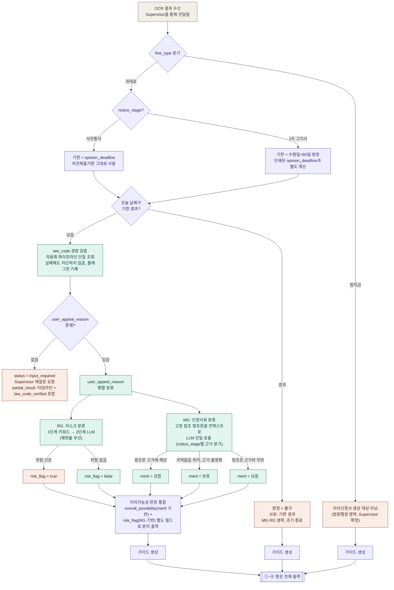

# 과태료·범칙금 이의가능성 판단 에이전트 — 설계 정리

## 배경

OCR 에이전트가 과태료·범칙금 고지서에서 표준 항목(위반일시/장소/법조항/금액/차량번호 등)을 추출한 뒤,
그 결과를 입력으로 받아 **이의신청 가능성을 판단**하고 **진행 시 유의사항을 안내**하는 에이전트를 설계한다.

핵심 요구사항은 단순 판단에 그치지 않고, 사용자가 **과태료 이의신청을 진행하다가 신원이 특정되어
범칙금(또는 형사절차)으로 전환되는 등 불필요한 불이익**을 겪지 않도록 가이드를 함께 제공하는 것이다.

### OCR 에이전트(fine_notice_analysis v2)와의 역할 분담

OCR 에이전트는 이의 가능 여부·감경 계산·이의신청서 생성 로직을 갖지 않고, **OCR·문서 분류 전용**으로
단순화되어 있다 (단일 책임 원칙). 이 판단 에이전트는 OCR 에이전트가 Supervisor를 통해 넘겨주는 결과를
입력으로 받는다. 입력은 `fine_type`(과태료/범칙금)뿐 아니라 `notice_stage`(사전통지/1차 고지서/즉결심판)
까지 함께 포함하며, 문서 유형에 따라 `opinion_deadline` 같은 필드의 의미가 달라진다 (예: 사전통지에서는
의견제출기한, 1차 고지서에서는 납부기한, 즉결심판에서는 출석기일).

**범칙금은 Supervisor 단계에서 서비스 스코프가 확정되어 있다**: 이의신청서 생성은 과태료 전용이며,
범칙금은 즉결심판(법원행정 영역)으로 이관되는 절차라 이의신청서를 생성하지 않는다. 다만 OCR 결과 자체는
Supervisor로 전달되므로, 이 판단 에이전트는 범칙금에 대해 **이의가능성 판정은 생략하되 절차 안내는
제공**하는 축소 경로를 따로 둔다 (자세한 내용은 아래 v13 도식 참고).

---

## 전체 흐름도 (v13 — law_code 경량 검증 부활, 벌점/채널 항목은 대기 상태 유지)

**설계 포인트 (v13 — law_code 경량 검증 부활)**

지난 라운드(v12)에서 law_code 검증을 "유지관리 부담" 논리로 제거했는데, 이 근거가 틀렸다는 지적을
받고 재검토했다.

- **폐기 사유를 다시 나눠봤다.** law_code 데이터는 팀의 법령DB 파이프라인이 이미 자동으로 최신
  상태를 유지해준다 — 지자체 접수채널 화이트리스트(수작업 리서치 필요)와는 데이터 성격 자체가
  다르다. "계속 낡는 데이터라 유지보수 부담"이라는 v12의 논리는 이 항목엔 적용되지 않았다.
- **다만 판정에 기여하지 않는다는 점은 여전히 사실이다.** `MG`는 개별 고지서의 `law_code`가 아니라
  고정 참조 조문만 쓴다. 그래서 v9의 하드블록(재확인 1회 요청 → 실패 시 판단 단계 전체 종료)까지
  되살릴 이유는 없다 — 판정에 안 쓰이는 값 때문에 Supervisor 왕복까지 만드는 건 과하다.
- **결론: 하드블록 대신 경량 검증으로 부활시킨다.** `LDB_CHECK`는 자동화된 파이프라인으로 단 한 번
  조회하고, 실패해도 파이프라인을 막지 않는다. 대신 `law_code_verified` 플래그를 기록해 ⑥번
  disclaimer 문구를 조건부로 바꾸는 데만 쓴다 (검증 실패 시 더 구체적인 재확인 경고).
- **`ZP`(벌점 0점)·별표28 매핑은 이번엔 되살리지 않고 대기 상태로 유지한다.** 이쪽은 데이터 자체가
  법령DB에서 파싱 가능한 형태로 오는지가 아직 미확인이라 (구조화 텍스트/뭉개진 텍스트/이미지 3단계
  중 어느 쪽인지) — 유지보수 부담 문제가 아니라 순수 기술적 미확인 사항이다. 확인 전까지는 미결
  사항으로 남긴다 (아래 B그룹 참고).
- **`LDB_CHECK`가 `CHK_REASON`보다 먼저 실행되므로, `law_code_verified`는 `input_required`로
  되돌아가는 시점에 이미 계산이 끝나 있다.** 이 값을 최종 성공 응답까지 묵혀두지 않고
  `input_required`의 `partial_result`에 함께 실어 보낸다 — 사용자가 이의신청 사유를 입력하는 동안
  법조항 확인이 필요하다는 사실도 동시에 알 수 있게 하기 위해서다. `user_appeal_reason` 미입력 시
  타임라인·접수채널 정보를 `partial_result`에 함께 담아 보내기로 한 것과 같은 원칙(계산이 끝난 정보는
  다음 왕복까지 나눠 보내지 않는다)이다.

**설계 포인트 (v12 — 대규모 스코프 축소)**

이번 라운드는 "우리 서비스가 이의신청서 *작성*까지가 산출물"이라는 스코프 원칙으로 기존 기능들을
재검토한 결과다. 세 가지를 제거했다.

1. **law_code 검증 하드블록 파이프라인 전체 제거** (`LDB_NORM`/`LDB_LOOKUP`/`LDB_VALID`/`LDB_RETRY`/
   `LDB_REQ`/`LDB_TERM`/`G4`). `MG`는 애초에 이 고지서 개별 `law_code`가 아니라 **고정된 참조
   조문**(시행규칙 제142조, 질서위반행위규제법 제14조)을 컨텍스트로 쓰기 때문에, "이 고지서에 적힌
   법조항이 실존하는지"를 정규화→조회→하드블록·재시도까지 검증할 필요가 판정 로직 관점에서 없었다.
   실제 필요성은 "이의신청서에 법조항을 정확히 인용해야 한다"는 문서 품질 문제뿐이며, 이건 ⑥번
   disclaimer의 가벼운 재확인 문구로 충분하다. `unable_to_verify`/`law_code_unverified` 상태와
   `law_code_reverification_attempted` 입력 플래그도 함께 제거된다.
2. **`ZP`(벌점 0점 화이트리스트) 노드 제거.** 지자체 접수채널 화이트리스트와 똑같은 "계속 바뀌는
   데이터를 우리가 유지관리해야 하는" 문제를 안고 있었다. 전용 노드·플래그(`fast_path_flag`) 없이,
   ②번 가이드의 일반 안내 문구("벌점 유무는 이파인에서 확인하라")로 대체한다.
3. **`C`/`C1`/`C2`(발부기관 유형 판별) 노드 제거.** 접수채널 화이트리스트를 폐기한 이전 라운드에서는
   "경찰=확정 안내, 지자체=확인 요망 안내"로 톤만 가르는 역할로 축소했었는데, 이번엔 그 구분 자체도
   없앤다. 경찰·지자체 구분 없이 **"서면(우편·방문)이 원칙이며, 온라인 여부는 관할 기관에 확인하라"**
   한 문장으로 통일한다. 경찰 건에 대한 "확정 안내"라는 약간의 정보 이득을 포기하는 대신, 발부기관
   자동분류 로직 자체가 필요 없어진다.

이 세 가지 제거로 그래프 노드 수가 30개 안팎에서 17개로 줄었다. `RG`·`MG`·`E`·타임라인 게이트(`ST`/
`DCHK`)로 구성된 판정 핵심 로직은 전혀 손대지 않았다 — 이번 라운드는 전부 **판정에 기여하지 않던
주변 기능**을 쳐낸 것이다.

### E 노드 출력 통합 — RG × MG 조합 매트릭스

`risk_flag`(RG)와 `merit`(MG)는 하나의 점수로 합치지 않는다. 두 축을 억지로 통합하면 "왜 이런
점수가 나왔는지" 설명이 불투명해지고 법률자문처럼 보일 위험이 커지기 때문에, 6칸 조합별로 권고 톤을
미리 정의한 매트릭스를 쓴다.

| | risk = false | risk = true |
|---|---|---|
| **merit = 강함** | 가능성 높음, 리스크 없음 → 안심하고 진행 | 사유 자체는 인정될 만하지만 표현 방식이 운전자를 특정하는 형태 → 문구를 다듬거나 신중히 진행하라는 구체적 권고 |
| **merit = 보류** | 판단 애매, 위험은 없음 → 증거 보강 권유 | 판단도 애매하고 위험도 있음 → 가장 신중한 톤, 필요시 전문가 상담 권유 |
| **merit = 낮음** | 인정 어려움, 위험은 없음 → 기대치 낮춰서 안내 | 승산도 낮고 위험까지 있음 → 진행 자체를 재고하라는 강한 톤 |

**우선순위 규칙**: 출력 시 `risk_flag` 정보를 항상 `merit`보다 먼저 노출한다. 신원노출 위험이 승소
가능성보다 사용자 안전에 더 직결되므로, "승산은 있는데 위험도 있다"는 정보가 뒤에 묻히면 안 된다.
merit 단계가 늘어나도(예: 4단계) 매트릭스에 행만 추가하면 되므로 확장성도 확보된다.

### 법령DB(LDB) 동기화 운영 정책 (v13 — law_code 경량 검증 복원)

v12에서 "MG가 쓰는 고정 참조 조문만 유지"로 축소했던 역할에, v13에서 **law_code 경량 검증**이
다시 추가된다. 두 역할 모두 같은 자동화 파이프라인을 재사용하므로 별도 인프라는 필요 없다.

- **동기화 범위**: 룰엔진·MG가 실제로 참조하는 조항 (질서위반행위규제법 제7·14·16·17·20조, 도로교통법
  제160·161·163조, 도로교통법 시행규칙 제142조) + **개별 고지서의 `law_code` 실존 여부 조회**
  (`LDB_CHECK`가 사용).
- **동기화 방식**: 법령이력조회 기능으로 시행일자·개정일자 변경 여부를 크론잡(주·월 단위)으로 가볍게
  확인하고, 바뀐 조항만 전문을 다시 가져온다. API 장애 시에는 마지막으로 성공한 캐시본으로 폴백하며,
  `LDB_CHECK`는 실패해도 파이프라인을 막지 않으므로 API 장애가 판정 전체를 멈추게 하지 않는다.
- **버전 추적**: 판정에 사용된 법조문 버전(시행일자)을 결과와 함께 기록해 감사 추적(audit trail)이
  가능하게 한다.
- **② 타임라인 기한 상수(60일 등)는 이 파이프라인과 별개**: 질서위반행위규제법 제20조의 "60일"처럼
  가이드 계산에 쓰는 하드코딩 상수는 법 개정 빈도가 낮으므로, 자동 동기화 대상에 넣지 않고 담당자가
  주기적으로 수동 검토하는 것으로 충분하다.
- **별표28(벌점 기준표)은 이 파이프라인의 동기화 대상이 아니다** — 조문 원문과 달리 별표는 API
  응답 형태(구조화 텍스트/이미지)가 미확인이라, 확인 전까지 대기 상태로 둔다 (미결 사항 참고).

### MG 설계 재검토 — 키워드 매칭 계층 제거, LLM 단일 호출로 단순화

처음에는 MG를 RG와 같은 "1단계 키워드 매칭 → 2단계 LLM" 2단 구조로 설계했는데, 이는 RG의 설계
패턴을 그대로 복사한 것이었고 재검토 결과 불필요한 복잡도로 판단해 제거한다.

- **RG와 MG는 놓쳤을 때의 위험도가 다르다.** RG는 리스크를 놓치면(false negative) 사용자가 실제
  불이익을 당하므로 재현율을 위한 1단계 키워드 필터가 안전장치로서 의미가 있다. 반면 MG는 분류가
  애매해도 `merit = 보류`로 떨어질 뿐 안전 문제가 아니므로, 속도·결정성을 위한 키워드 필터의 존재
  이유가 약하다.
- **시행규칙 제142조 목록 자체가 이미 공개되어 잘 알려진 정보라, 일반 LLM도 컨텍스트만 주어지면 정확히
  판단할 수 있다.** 별도 하드코딩 키워드셋을 유지·검수하는 운영 비용이 이 정확도 이득 대비 크다.
- **법 개정 최신성은 하드코딩 키워드셋이 아니라 LDB 동기화로 해결한다.** MG 호출 시 LDB에서 방금
  동기화한 최신 법조문 원문(시행규칙 제142조 등)을 LLM 컨텍스트로 그대로 주입하고, LLM이 한 번의
  호출로 판단한다. 법 개정이 있어도 다음 동기화 주기에 자동으로 반영되며, 별도 키워드셋 재검수
  프로세스가 필요 없다 (기존에 있던 "MG 키워드셋은 자동 재생성하지 않고 사람이 검수" 운영 부담이
  키워드셋 자체가 없어지면서 함께 사라진다).
- 1차 고지서 단계의 질서위반행위규제법 제14조 정황요소는 애초에 열거형이 아니라 LLM 판단이 필요했던
  부분이라, 이번 단순화로 사전통지·1차고지서 두 단계 모두 "LDB 원문을 컨텍스트로 준 LLM 단일 판단"
  구조로 일관되게 통일된다.

### MG의 notice_stage별 판단 기준 분기 — 의견제출도 판단 대상에 포함

서비스명은 "이의신청"이지만, `notice_stage = 사전통지`(의견제출)도 판단 대상에 포함한다. 자진납부 20%
감경 기회가 살아있는 유일한 시점이 사전통지 단계이고, RG의 근거 법조항도 "의견 제출 또는 이의제기의
결과 위반행위를 한 운전자가 밝혀진 경우"라고 두 단계를 함께 명시하고 있어 두 단계를 분리할 이유가
없다.

다만 두 단계가 참조하는 법적 기준 자체가 다르므로, MG가 LLM에 컨텍스트로 주입하는 법조문 세트를
`notice_stage`에 따라 다르게 구성한다.

| notice_stage | 판단 성격 | MG가 LLM에 주입하는 법조문 컨텍스트 |
|---|---|---|
| 사전통지 | 의견제출 (질서위반행위규제법 제16조) | 시행규칙 제142조 열거 목록 원문만 |
| 1차 고지서 | 정식 이의제기 (법원 비송사건절차) | 시행규칙 제142조 목록 + 질서위반행위규제법 제14조의 넓은 정황요소(동기·목적·방법·결과, 위반 후 태도와 정황, 연령·재산상태·환경) 원문 추가 |

1차 고지서 단계는 법원 재판으로 넘어가 재량 범위가 넓어지므로, 142조 목록에 없어도 제14조 정황요소에
해당하면 `merit = 보류`로 분류될 여지를 열어둔다. `E`의 출력 라벨도 단계에 따라 톤을 다르게
표현한다 — 사전통지에서는 "의견 제출 시 인정·감경 가능성", 1차 고지서에서는 "이의제기 인용 가능성"으로
구분해 사용자가 지금 자신이 어느 절차를 판단받는지 혼동하지 않게 한다.

---

## 왜 신원노출 리스크가 문제인가

- 과태료는 소유자 책임 원칙이 적용되어, 원칙적으로 실제 운전자가 누구인지 특정되지 않은 상태로 처리된다.
- 그런데 이의신청/의견제출 사유가 "제가 운전하지 않았습니다" 류이거나, 과태료를 범칙금으로 전환 신청하는
  경우, 절차를 밟는 과정에서 실제 운전자가 드러나면 사건이 범칙금(경우에 따라 형사절차)으로 전환될 수 있다.
- 반대로 "금액 산정 오류", "표지판 미설치" 같은 사유는 신원 노출과 무관하게 진행해도 안전하다.
- 즉, 리스크 게이트는 **"이의신청 사유가 신원(운전자 특정)과 관련이 있는가"** 한 가지 기준으로 판단한다.

### 필요성 재검토 결과 — 가정이 아니라 법에 명시된 정규 절차다

이 리스크 게이트가 과잉설계 아닌지 재검토했는데, 오히려 근거가 더 명확해졌다.

- 서울시 교통위반 단속조회 시스템 공식 안내: **"신청한 이의제기서는 관할 법원으로 통보되어...
  비송사건절차법에 따라 과태료 재판을 받으며, 재판 결과 범칙금 부과로 결정될 경우 관련 내용이 관할
  경찰서에 통보됩니다."** 즉 "범칙금 부과로 결정"이 과태료 재판의 공식 결론 중 하나로 존재하고,
  실제로 경찰서 통보까지 이어지는 정규 절차다.
- 도로교통법 시행령상 과태료 50% 감경 대상에서 **명시적으로 제외되는 사유**로 "의견 제출 또는
  이의제기의 결과 위반행위를 한 운전자가 밝혀진 경우"가 별도 조항으로 규정돼 있다. 법이 별도 조항을
  둘 정도면 실무에서 드물지 않게 발생한다는 신호로 볼 수 있다.

**결론**: 리스크 게이트는 유지하는 게 맞고, 오히려 근거가 처음 가정보다 탄탄하다.

### RG로 못 잡는 잔여 리스크 — disclaimer에 별도 명시 필요

다만 이번 재검토로 RG(사유 텍스트 분류)의 한계도 같이 드러났다. 리스크는 **사용자가 쓴 사유 텍스트에만
있는 게 아니라, 이의제기가 법원 심리로 넘어가는 과정 자체에서도 발생**할 수 있다. 사용자가 굳이 "다른
사람이 몰았다"고 쓰지 않아도, 법원이 사실관계를 조사하는 과정에서 실제 운전자가 밝혀질 수 있기
때문이다. 이건 RG가 사전에 텍스트만 보고 걸러낼 수 없는 영역이므로, ⑥번 disclaimer에 다음 내용을
일반 경고로 추가한다.

> 이의제기 자체가 법원의 사실관계 조사로 이어질 수 있으며, 그 과정에서 실제 운전자가 밝혀지면 사건이
> 범칙금으로 전환될 수 있습니다. 이는 RG가 사전에 판단할 수 없는 절차상 리스크이므로, 사유 내용과
> 무관하게 이의제기를 진행하는 모든 사용자에게 참고용으로 안내합니다.

### 정정 1: "온라인이면 안전하다"는 전제는 틀렸다

이전 설계에서는 "방문이 필요한 절차만 위험하고, 온라인 접수는 안전하다"고 가정했다. 그러나 확인해보니
**이파인(경찰청 교통민원24)에서는 무인단속 과태료를 범칙금으로 전환 신청하는 것 자체를 온라인으로 할 수
있다.** 즉 실제 운전자를 특정해서 범칙금으로 넘기는 위험한 선택이 방문 없이도 발생할 수 있다.

따라서 온라인/오프라인 구분은 **접수채널 안내용**으로만 남기고, 리스크 판단의 기준으로는 쓰지 않는다.
진짜 리스크 트리거는 채널이 아니라 **사유(운전자 특정·전환 수반 여부)** 그 자체다.

### 정정 2: 정식 이의제기 온라인 가능 여부는 "전국 공통 규칙"이 아니라 기관별로 다르다

처음에는 교통민원24(이파인)가 한때 과태료 이의신청 서비스를 온라인으로 제공했으나,
「인터넷 등 전자문서에 의한 이의제기는 질서위반행위규제법상 적법한 이의제기 방식에 포함되지 않는 것으로
보아야 한다」는 법무부 법령해석에 따라 **2021년 3월 5일부로 해당 서비스가 종료**되었다는 점에서
"정식 이의제기는 항상 서면·방문"이라고 일반화했다. 그러나 다시 확인한 결과 이 결론은 **경찰청(이파인)
발부 건에는 확정적으로 맞지만, 지자체 발부 건에는 일반화할 수 없다.**

- 경찰청 이파인: 정식 이의제기 온라인 서비스 종료 확인됨 → 서면·방문 원칙 (확정)
- 지자체: 기관마다 실제로 다름
  - 인천: 신청방법을 서면제출(방문·팩스·우편)로만 명시, 온라인 언급 없음
  - 대전(버스전용차로 위반): 자체 포털(교통위반 과태료 통합민원 홈페이지)로 의견진술 및 이의신청을
    온라인 접수 명시
  - 안산: 의견진술 단계는 위택스 온라인 접수를 명시하나, 정식 이의제기 단계에서는 위택스를 다시
    언급하지 않아 확인이 필요함

**당시 설계 원칙 (v6~v11, 현재는 v12로 대체됨)**: 발부기관이 경찰이면 정식 이의제기는 항상
"서면·방문 필요"로 확정 안내하고, 지자체면 화이트리스트로 검증된 예외(예: 대전)만 온라인 채널을
노출하는 방식이었다. **v12에서는 이 구분마저 통합해, 경찰/지자체 관계없이 "서면 원칙 + 관할 기관
직접 확인"이라는 단일 문구로 안내한다** (자세한 내용은 아래 "접수채널 안내" 절 참고). 이 섹션의
조사 결과(인천·대전·안산 사례)는 그 통합 결론에 이르게 된 근거로서 기록만 남긴다.

---

## 법령DB / 판례DB 활용

### 법령DB — 채택 (팀 파이프라인 재사용, v13 기준 역할 2가지)

법제처 국가법령정보 공동활용 API로 법률·시행령·시행규칙의 조문 원문과 개정 이력을 조회할 수 있으며,
**팀에서 이미 이 데이터 파이프라인을 구축해 두었으므로 그대로 재사용한다.** 판단 에이전트에서의 역할은
두 가지다.

1. **`MG`가 참조하는 고정 법조문의 최신성 유지**: 시행규칙 제142조, 질서위반행위규제법 제14조 등
   MG가 LLM 컨텍스트로 주입하는 조문이 개정되면 파이프라인을 통해 갱신 여부를 감지한다.
2. **(v13 복원) 개별 고지서의 `law_code` 경량 검증**: `LDB_CHECK`가 파이프라인을 통해 이 고지서에
   적힌 법조항이 실존하는지 단일 조회한다. v12에서는 "판정에 기여하지 않는다"는 이유로 전체
   검증(하드블록 포함)을 제거했으나, 이 파이프라인이 이미 자동으로 최신 상태를 유지하고 있어
   **추가 유지관리 비용이 사실상 0** 이라는 점을 재확인하고 부활시켰다. 다만 판정(`E`)을 막지는
   않는다 — 검증 실패는 ⑥번 disclaimer 문구를 조건부로 강화하는 데만 쓰인다 (하드블록·재확인
   루프는 되살리지 않음).

### 판례DB — v1 스코프에서 제외

법제처가 판례 목록·본문 조회 API도 함께 제공하지만, 다음 이유로 이번 판단 에이전트에는 포함하지
않는다.

- 과태료 재판은 비송사건절차법에 따른 결정 위주라, 일반 판례DB에 체계적으로 쌓여 있지 않은 경우가
  많아 검색 결과가 빈약할 가능성이 높다.
- 판례 원문은 저작권 제약으로 그대로 인용할 수 없어, 자체 요약 로직이 추가로 필요하다.
- 가장 중요한 이유: 판례를 근거로 "이렇게 하면 인용될 가능성이 높다"는 식의 판정을 내리면 disclaimer
  (⑥번 가이드)에서 못박은 "법률자문이 아니다"라는 선과 충돌한다.

**결론**: 판례DB는 v1에서 제외하고, 필요해지면 "판정 근거"가 아니라 **"참고용 유사 사례 링크"**
수준(확정적 추론 없이 출처만 제공)으로 v2 확장 항목으로 남겨둔다.

---

## 접수채널 안내 — 화이트리스트 폐기 + 발부기관 구분도 통합 (v12)

### 재검토: 접수채널 데이터를 우리가 유지관리할 필요가 있는가

본 서비스의 산출물은 **완성된 이의신청서(문서)** 다. 이 문서는 우편으로 보내든, 방문해서 제출하든,
온라인 포털에 업로드하든 동일한 파일이며, 접수채널이 무엇인지가 우리가 만드는 산출물의 형태를
바꾸지 않는다. 즉 지자체별 온라인 가능 여부를 우리가 정확히 알고 있어야 할 필연성이 없다.

사용자에게 실제로 필요한 정보는 세 가지뿐이다.

1. **어디로 보내야 하는가** → `issuing_authority`(관할 기관), OCR이 이미 추출
2. **언제까지 보내야 하는가** → 이미 계산해둔 기한 (① 타임라인)
3. **어떤 방식이 되는가** → 아래 원칙으로 대체

### 결론 (v12): 경찰/지자체 구분 없이 단일 문구로 통일

이전 라운드에서는 "경찰 발부 건은 서면·방문 확정 안내, 지자체 발부 건은 확인 요망 안내"로 발부기관
유형에 따라 톤을 갈랐다. 이번 재검토에서는 그 구분마저도 실질 서비스(이의신청서 작성)에 필수가
아니라고 보고 통합한다.

- **모든 과태료 건에 동일 문구를 사용한다**: **"제출 방법은 서면(우편·방문)이 원칙이며, 온라인 접수
  가능 여부는 관할 기관에 직접 확인하세요."** 경찰 발부 건은 사실 이 온라인 서비스가 확정적으로
  종료된 상태라 "확인할 필요조차 없다"는 정보를 줄 수 있었지만, 그 정보 이득보다 발부기관 자동분류
  로직(패턴 매칭)을 유지하는 비용이 더 크다고 판단해 통합했다.
- 정보의 최신성 책임은 관할 기관 자신의 공식 채널로 넘긴다. 관할 기관 홈페이지가 항상 우리가 들고
  있는 스냅샷보다 정확하다.
- 대전·서울시설공단·인천·부산처럼 이전에 조사한 사례는 화이트리스트나 판별 로직의 근거로 쓰지
  않고, 이 결론에 이르게 된 조사 과정의 참고 기록으로만 남긴다.
- `C`/`C1`/`C2`(발부기관 판별) 노드는 도식(v12)에서 완전히 제거됐다.

이 결론에 따라 미결 사항 B그룹의 화이트리스트·발부기관판별 관련 항목(3·4·5·6번)은 스코프 자체가
사라져 해소된다 (아래 미결 사항 참고).

---

## 대화에서 확정한 안내 가이드 6가지 카테고리

### ① 타임라인 안내 (다단계 기한)
과태료·범칙금 모두 기한이 하나가 아니라 여러 단계로 걸려 있고, `notice_stage`에 따라 계산 기준이
달라진다. 아래는 `notice_stage` → 남은 기간 계산 규칙이다.

| notice_stage | 절차 성격 | 기산일 | 기한 | 계산 방식 |
|---|---|---|---|---|
| 사전통지 | 의견제출 (이의신청 아님) | 사전통지서 수령일 | 10일 이상 (지자체별 15~20일도 있음) | `opinion_deadline` 필드(의견제출기한) 그대로 사용 |
| 1차 고지서 | 정식 이의제기 (진짜 이의신청) | **고지서 수령일** | **법정 60일 고정** (질서위반행위규제법 제20조) | ⚠️ `opinion_deadline` 필드는 고지서에 인쇄된 **납부기한**이라 60일과 다를 수 있음. 법정 이의제기 마감은 `opinion_deadline`을 쓰지 말고 **수령일(또는 고지서 발송일) + 60일을 별도 계산**해야 함 |
| 범칙금 사전통지(통고서) | 1차/2차 납부 | 통고서 수령일 | 1차 10일 → 미납 시 2차 20일(20% 가산) | `opinion_deadline`=1차 납부기한, `payment_deadline_2nd`=2차 납부기한 필드 그대로 사용 |
| 즉결심판 | 법원 출석 | 해당 없음 (출석 통지) | `opinion_deadline`=출석 예정일시 | 필드 그대로 사용, 선고 전까지 1.5배 납부 시 청구 취소 가능하다는 점도 함께 안내 |

**핵심 함정**: `notice_stage = "1차 고지서"`일 때 `opinion_deadline`(인쇄된 납부기한)을 그대로
"이의제기 마감"으로 안내하면 틀릴 수 있다. 반드시 수령일 기준 60일을 별도로 계산해서, 인쇄된
납부기한과 법정 이의제기 마감 **두 날짜를 모두** 사용자에게 보여줘야 한다 (둘 다 지나면 각각 다른
불이익이 발생하므로 — 납부기한을 넘기면 가산금, 이의제기 기한을 넘기면 불복 기회 상실).

### ② 기대치 조정 (유불리 경고) — 과태료 vs 범칙금 전환 이익·불이익

**공통 원칙**: 이의제기가 항상 유리한 선택은 아니라는 점을 명확히 전달해야 한다.
- 과태료 이의제기는 처분 효력을 상실시킬 뿐, 감액을 보장하지 않는다. 법원 재판으로 넘어가 결과가
  같거나 더 불리해질 수 있다.
- 이의제기를 선택하면 자진납부 20% 감경 기회는 사라진다.
- 범칙금 즉결심판에서 유죄 판결이 나오면 범칙금 외에 재판비용까지 부담할 수 있다.

**범칙금 전환의 이익·불이익 비교표**

조사 결과 "무조건 과태료가 유리하다"는 것도 사실이 아니었다. 벌점 유무에 따라 결론이 갈리므로,
아래 비교표를 그대로 사용자에게 보여주는 게 안전하다.

| 항목 | 과태료 유지 | 범칙금 전환 |
|---|---|---|
| 금액 | 통상 범칙금보다 다소 높음(사례상 1만원 내외 차이). 사전납부 20% 감경 적용 시 범칙금보다 저렴해지는 경우가 많음 | 통상 과태료보다 낮음. 단 대부분 벌점이 함께 부과됨 |
| 벌점 | 없음 | 있음 (위반 항목별 상이) |
| 보험료 | 영향 없음 | 위반 2~3회 5% 할증, 4회 이상 10% 할증 (보험개발원 통보) |
| 신원 | 특정되지 않음 (소유자에게만 부과) | 특정됨 (본인이 운전 사실을 인정하는 절차) |
| 이력 관리 | 남지 않음 | 운전경력증명서에 5년간 보존 |
| 미납 시 가산 구조 | 3% + 월 1.2% 중가산금 (최대 60개월) | 1.2배(20% 가산) → 즉결심판 회부 시 1.5배 |
| 재전환 가능 여부 | 범칙금으로 전환 가능 (사전통지·1차 부과 단계까지만) | 과태료로 재전환 불가 (비가역) |

**예외 — 범칙금이 실제로 더 유리한 경우**: 벌점이 없는 범칙금 항목(예: 제한속도 20km/h 이내 초과)은
금액도 더 싸고 벌점도 없어, 이 경우엔 범칙금 전환이 오히려 유리하다. 즉 **"벌점 부과 여부"가 첫 번째
판단 기준**이며, 무조건 한쪽이 유리하다고 안내하면 안 된다. (v11에서는 이 판단을 자동화하는 전용
`ZP` 노드와 소규모 화이트리스트를 두려 했으나, v12에서 유지관리 부담 대비 이득이 작다고 보고 제거했다
— 아래 일반 안내 문구로 대체한다.)

**판단 순서 제안**: (1) 고지서에 벌점이 부과되는 항목인지 확인 → 벌점이 없으면 두 금액을 비교해
저렴한 쪽 선택 → (2) 벌점이 있으면 과태료 사전납부(20% 감경) 금액과 범칙금 금액을 직접 비교 →
대부분 사전납부 과태료 쪽이 저렴하거나 비슷하면서 벌점·보험료 할증 리스크가 없어 유리하다.

**참고**: 착한운전마일리지(무사고·무위반 서약 후 벌점 감경에 사용 가능한 제도) 대상자는 벌점을 받아도
일부 상쇄할 수 있으니, 벌점이 있는 항목이라도 이 제도 가입 여부를 함께 확인하도록 안내한다.

**전환은 비가역이며 시점 제한이 있다는 점도 명시**: 과태료 → 범칙금 전환은 사전통지·1차 부과 단계
까지만 가능하고, 한번 범칙금으로 전환하면 다시 과태료로 되돌릴 수 없다.

**정확한 벌점 수치는 이파인 전환 미리보기로 위임한다(MVP 기본값)**: 과태료 문서에는 벌점 필드 자체가
없어(§"벌점 스키마 확인" 참고) 이 위반 건이 전환 시 정확히 몇 점인지 우리가 직접 계산해줄 수 없다.
이파인에서 "과태료 → 범칙금" 전환 버튼을 누르면 신청 전에 벌점·면허정지 관련 안내를 미리 보여주는
화면이 있으므로, 가이드는 "벌점 유무·정확한 점수는 이파인 전환 미리보기에서 확인하라"고 안내하는
선에서 마무리한다. 별표28(벌점 기준표)을 법령DB로 직접 매핑하는 방안은 실제 조회 가능 여부를
확인한 뒤 결정한다 (미결 사항 참고).

### 벌점 스키마 확인 — 과태료 문서에는 벌점 필드가 없다

OCR Agent 스키마(`state.py`)를 보면 `demerit_points_base`·`demerit_points_accumulated`는
**범칙금(③) 문서에만 존재**하고, 필드 매트릭스(DATA-002 §4-2)에서도 ①②(과태료) 열은 둘 다 ❌다.
과태료 자체엔 벌점 개념이 없으므로(소유자 책임이라 벌점을 매길 대상이 없음) 구조적으로 당연한
결과이지만, **"아직 과태료 상태인 고지서"에서 전환 시 벌점이 몇 점일지는 OCR 결과만으로 알 수
없다**는 뜻이다. 이는 위반유형(법조항/위반내용) → 벌점표 매핑이라는 별도 참조 데이터가 있어야
풀리는 문제이며, 아래 "정확한 벌점 수치는 이파인 전환 미리보기로 위임한다" 항목과 연결된다.

### ③ 절차 방식 안내 (대면 여부) — v12: 경찰/지자체 구분 없이 단일 문구
- **발부기관 구분 없이 "서면(우편·방문)이 원칙이며, 온라인 접수 가능 여부는 관할 기관에 직접
  확인하세요"로 통일 안내한다.** 경찰 발부 건은 온라인이 확정적으로 막혀있어 더 확신 있는 문구를
  줄 수도 있었지만, 그 구분을 유지하는 자동분류 로직 비용이 정보 이득보다 크다고 판단해 통합했다
  (자세한 배경은 "접수채널 안내 — 화이트리스트 폐기 + 발부기관 구분도 통합" 참고).
- 접수채널(온라인/방문)은 리스크 판단 기준이 아니다 — "정정 1"에서 확인했듯 온라인 접수에서도
  신원노출 리스크가 발생할 수 있으므로, 온라인 가능하다는 이유로 리스크 경고를 생략하면 안 된다.
  리스크 노출 여부는 오직 RG(사유 기반 리스크 게이트) 결과를 따른다.

### ④ 철회 가능 시점
- 과태료는 행정청이 법원에 통보하기 전까지 서면으로 이의제기를 철회할 수 있다.
- 범칙금 즉결심판 청구는 경찰서에 따라 취하 가능 여부가 다르며, 법원에 송부된 이후에는 취하가
  어렵다.
- "되돌릴 수 있는 마지막 시점"을 명확히 안내해야 한다.

### ⑤ 벌점·전과 오해 정정
- 범칙금은 무죄판결 시 벌점도 함께 취소된다.
- 통고처분·즉결심판 자체는 형사절차의 사전 단계 성격이라 통상 전과기록(범죄경력자료)에는 남지 않는다.
  ("이의신청하면 전과 남는다"는 흔한 오해를 미리 풀어줘야 한다.)
- 출석·납부기한 만료일로부터 60일이 지나도록 즉결심판을 받지 않으면 별도로 벌점 40점이 부과된다.

### ⑥ 법률자문 아님 disclaimer
- 본 판단은 법률자문이 아니며 참고용이라는 점을 명시한다.
- 절차의 세부 운영(특히 온라인 접수 가능 여부)은 지자체·관할 기관마다 다를 수 있어, 최종 확인은
  관할 기관에 하도록 안내한다.
- **이의제기 자체가 법원의 사실관계 조사로 이어질 수 있으며, 그 과정에서 실제 운전자가 밝혀지면
  사건이 범칙금으로 전환될 수 있다는 점을 사유 내용과 무관하게 항상 안내한다.** 이는 RG(리스크
  게이트)가 사유 텍스트만으로는 사전에 걸러낼 수 없는 절차상 잔여 리스크이므로, `risk_flag`가
  false인 경우에도 이 disclaimer 문구는 빠지지 않는다.
- **(v13) 이의신청서에 인용된 법조항(`law_code`)은 `LDB_CHECK`로 자동 검증되지만, 검증 실패 시에도
  판정은 그대로 진행된다.** `law_code_verified=true`면 가벼운 확인 문구만, `law_code_verified=false`면
  "이 조항이 확인되지 않았으니 고지서 원본과 대조해 직접 확인하라"는 더 구체적인 경고를 붙인다. 이건
  v9의 하드블록·재확인 루프를 대체하는 경량 버전이다 — 판정 로직이 개별 법조항 존재 여부에 의존하지
  않으므로 검증에 실패해도 판정 자체는 막히지 않지만, 문서 품질(정확한 인용)을 위해 검증 결과는
  투명하게 안내한다.

---

## 다음에 정할 것 (미결 사항) — 판정 핵심 로직 vs 가이드 보조 데이터

`E`(이의가능성 판정) 노드로 들어가는 입력인지, ③번 가이드(접수채널 안내)에만 쓰이는 입력인지로
그룹을 나눈다. 전자는 판정 정확도에 직결되므로 우선 검증 대상이고, 후자는 데이터가 부족해도 판정 로직
자체는 정상 동작하므로 후순위로 미뤄도 된다. (v12에서 ③번 가이드 관련 항목 대부분이 스코프 자체가
제거되며 해소됐다 — B그룹 참고.)

### A. 판정 핵심 로직 (E 노드 입력) — 전부 해소됨, 검증 대상

1. ~~리스크 게이트 판단 시 "이의신청 사유가 운전자 특정·전환을 수반하는지"를 어떻게 분류할지~~ →
   해소됨. 2단계 재현율 우선 설계: 1단계 고신뢰 키워드 매칭 → 2단계 LLM 분류(is_identity_related +
   confidence). `user_appeal_reason` 필드가 OCR 결과에 없으므로, 없으면 Supervisor에
   `status = input_required`로 요청을 되돌리는 흐름을 추가함.
2. ~~리스크가 감지되면 **차단**할지, **경고 후 사용자 선택**에 맡길지~~ → 해소됨. 이분법 대신 confidence
   구간별로 경고 강도를 조절하는 방식으로 통합 (1단계 확정 매칭=강한 경고, 2단계 confidence 애매=참고용
   약한 경고). 별도의 차단 로직은 두지 않음.
7. ~~`notice_stage`별로 `opinion_deadline` 필드의 의미를 판단 에이전트가 어떻게 해석·매핑할지~~ →
   해소됨. "① 타임라인 안내" 항목에 `notice_stage`별 계산 규칙 표로 명시함 (특히 1차 고지서 단계는
   `opinion_deadline`과 법정 60일 이의제기 마감을 분리 계산해야 함).
8. ~~범칙금 절차 안내 경로에서 실제로 어떤 문구를 내보낼지, 가이드 카테고리를 조건부 템플릿으로
   분리할지~~ → 해소됨. 가이드 ①~⑥은 fine_type과 무관하게 공용 템플릿으로 항상 전체 출력하고,
   "이의가능성 판정" 결과 필드만 과태료에서는 룰엔진 판정값을, 범칙금에서는 "이의신청서 생성 불가"
   고정 문구를 채우는 방식으로 단순화.
9. ~~이의신청 판단에 법령DB·판례DB를 활용할 필요가 있는지~~ → 해소됨. 법령DB는 팀이 이미 구축한
   파이프라인을 재사용해 룰엔진 최신화에 채택 (v12에서 `law_code` 개별 검증 역할은 제거되고 MG 참조
   조문 최신화 용도로만 축소됨 — 13번 참고). 판례DB는 검색 결과 빈약 가능성·저작권 제약·법률자문
   경계 문제로 v1 스코프에서 제외하고 v2 확장 항목으로 보류.
10. ~~실체적 판정(merit) 로직이 없던 구멍, notice_stage 분기 누락, 기한도과 게이트 누락, RISK와
    판정값 혼동 가능성~~ → 해소됨 (v7). `MG` 노드 신설, `ST`(notice_stage 분기)·`DCHK`(기한도과
    하드게이트) 추가, `E` 출력에서 `overall_possibility`(merit)와 `risk_flag`(RG)를 분리.
11. ~~`RG`와 `MG`가 상충하는 결과를 낼 때 최종 출력에서 두 플래그를 어떤 우선순위·조합으로 보여줄지~~ →
    해소됨. "E 노드 출력 통합 — RG × MG 조합 매트릭스" 섹션에 6칸 매트릭스와 우선순위 규칙(risk를
    merit보다 먼저 노출)으로 정리함.
12. ~~MG 1단계 키워드셋을 법령DB에서 얼마나 자주 동기화할지, 실패 시 폴백 정책~~ → 해소됨. 이후 MG
    자체가 키워드 매칭 계층을 없애고 "LDB 원문을 LLM 컨텍스트로 주입하는 단일 호출" 구조로 재설계되며
    (아래 "MG 설계 재검토" 참고) 이 항목은 자연히 해소됨. 법령DB 동기화 자체는 "법령DB(LDB) 동기화
    운영 정책" 섹션에 동기화 범위 축소·크론잡 방식·캐시 폴백·버전 추적 원칙으로 정리함.
13. ~~`LDB`에서 `law_code`가 무효/미확인으로 판정될 때의 분기가 도식에 없음~~ → v9에서 정규화→조회→
    판정 3단계 하드블록(재확인 1회 → 실패시 `unable_to_verify` 종료)으로 해소, v12에서 "판정에
    기여하지 않는다"는 이유로 전체 제거, **v13에서 경량 검증으로 부분 복원**. 하드블록·재확인 루프는
    되살리지 않되, 데이터가 이미 자동화된 파이프라인이라 유지관리 비용이 0에 가까우므로 `LDB_CHECK`
    단일 조회 + `law_code_verified` 플래그로 부활. 판정은 검증 결과와 무관하게 그대로 진행되고,
    ⑥번 disclaimer 문구만 조건부로 강화된다.
14. ~~`MG`가 `notice_stage`를 구분하지 않음~~ → 해소됨. 서비스명은 "이의신청"이지만 사전통지(의견제출)도
    판단 대상에 포함하기로 확정 — 자진납부 20% 감경 기회가 살아있는 유일한 시점이고, RG의 근거 법조항도
    두 단계를 함께 명시하고 있어 분리할 이유가 없다. 대신 "MG의 notice_stage별 판단 기준 분기" 섹션에
    사전통지=시행규칙 제142조만, 1차 고지서=142조+질서위반행위규제법 제14조 정황요소로 참고 기준을
    분기하고, `E` 출력 라벨도 단계별로 "의견 제출 시 인정·감경 가능성" vs "이의제기 인용 가능성"으로
    구분하도록 정리함.

### B. 가이드 보조 데이터 (③번 가이드 · 접수채널 안내 전용) — v12에서 전부 해소 (스코프 제거)

이 그룹은 원래 발부기관이 경찰인지 지자체인지, 지자체라면 어디인지에 따라 ③번 가이드의 **문구
구체성**을 좌우하는 항목들이었다. "접수채널 안내" 절과 이번 대규모 스코프 축소(v12)에서 결론냈듯,
본 서비스는 이의신청서 "작성"까지가 산출물이고 접수채널 검증·벌점 자동계산은 산출물 형태를 바꾸지
않으므로 관련 화이트리스트·판별 로직을 전부 운영하지 않기로 했다. 아래 전 항목이 스코프 제거로
해소된다.

3. ~~지자체별 온라인 접수 가능 여부를 어떻게 데이터로 관리할지~~ → 해소됨(스코프 제거). 화이트리스트
   방식을 폐기하고, 전부 "서면 원칙 + 관할 기관 직접 확인"으로 일괄 안내하기로 함.
4. ~~위택스 미참여 예외 지자체 목록을 어떻게 확보·검증할지~~ → 해소됨(스코프 제거). 이전에 조사한
   대전·서울시설공단·인천·부산 사례는 화이트리스트 데이터가 아니라 참고용 예시로만 남기고, 별도
   유지관리는 하지 않는다.
5. ~~발부기관 유형(경찰 vs 지자체) 판별을 OCR이 뽑아준 발부기관명에서 어떻게 자동 분류할지~~ →
   해소됨(스코프 제거, v12). 화이트리스트뿐 아니라 "경찰=확정 안내 vs 지자체=확인 요망 안내"로 톤을
   가르는 구분 자체도 제거하고 단일 문구로 통일했다 — `C`/`C1`/`C2` 노드 전체 삭제.
6. ~~지자체별 "정식 이의제기 온라인 가능 여부" 화이트리스트를 어떻게 검증·유지할지~~ → 해소됨(스코프
   제거). 3·4번과 동일한 이유로 화이트리스트 자체를 운영하지 않기로 함.
7. **(대기 상태, v13)** 벌점 기준표(도로교통법 시행규칙 별표28)를 법령DB로 직접 매핑할지(옵션 A),
   이파인 미리보기로 위임할지(옵션 B, 현재 기본값). v12에서 "지자체 화이트리스트와 같은 유지관리
   부담"을 이유로 스코프 제거했으나, **그 근거가 잘못됐음을 재확인했다** — 별표28도 법령DB 데이터라
   지자체 화이트리스트와 성격이 다르다. 진짜 걸림돌은 유지보수가 아니라 **법령DB API가 별표를
   파싱 가능한 구조화 텍스트로 주는지, 아니면 뭉개진 텍스트나 이미지로 주는지가 아직 미확인**이라는
   순수 기술적 문제다. 이 확인 전까지는 명시적으로 대기 상태로 두고, 옵션 B(이파인 위임)를 기본값
   으로 유지한다.
8. **(대기 상태, v13)** `ZP`(벌점 0점 위반 유형) 화이트리스트/빠른 경로 노드 부활 여부 — 7번과 같은
   이유로 대기. 별표28이 구조화 텍스트로 조회된다는 게 확인되면, `ZP`를 화이트리스트가 아니라
   법령DB 조회 기반으로 재설계할 여지가 있다.

**B그룹 중 접수채널·발부기관 관련 항목(3~6번)은 v12 스코프 축소로 계속 해소 상태다.** 7·8번(벌점
관련)만 대기 상태로 남아있으며, 이는 "불필요해서"가 아니라 "법령DB 응답 형태 확인 대기 중"이다.

### C. 기능 변경 이력 요약 (감사 추적용)

나중에 "왜 이 기능이 없지"라는 질문이 나올 때를 대비해, 한때 설계했다가 스코프에서 뺀 기능을
한곳에 모아둔다. 전부 "판정에는 기여하지 않으면서 유지관리 부담만 있는" 동일 패턴이었다.

| 기능 | 도입 버전 | 변경 버전 | 현재 상태 | 사유 | 대체/현재 수단 |
|---|---|---|---|---|---|
| law_code 검증 | v9 (하드블록) → v12 (전체 제거) → v13 | **부분 복원 (경량 검증)** | 데이터가 자동화 파이프라인이라 유지관리 비용 0에 가까움 확인 → 판정을 막지 않는 선에서 부활 | `LDB_CHECK` 단일 조회 + `law_code_verified` 플래그, ⑥ disclaimer 조건부 문구 |
| `ZP` 벌점 0점 화이트리스트 + 빠른 경로 | v11 도입 → v12 제거 | **대기 (재검토 보류)** | 원래 든 "유지관리 부담" 근거가 지자체 화이트리스트와의 잘못된 유비였음을 재확인. 실제 걸림돌은 별표28 파싱 가능 여부 미확인 | 별표28 응답 형태 확인 후 재결정, 그 전까진 이파인 미리보기 위임 |
| 발부기관(경찰/지자체) 자동 판별 + 채널 화이트리스트 | v6(접수채널 개념) 도입 → v12 제거 | **제거 유지** | 문서 산출물 형태를 바꾸지 않는 부가 정보였고, 데이터 자체가 지자체 수작업 리서치 대상이라 유지관리 부담 근거가 유효함 | ③ 가이드 단일 문구("서면 원칙 + 관할기관 확인") |
| 별표28(벌점 기준표) 전체 매핑(옵션 A) | 벌점 조사 시점 도입 → v12 제거 | **대기 (재검토 보류)** | `ZP`와 동일한 사유로 대기 — 법령DB API 응답이 파싱 가능한 구조화 텍스트인지 확인 필요 | 확인 전까지 이파인 전환 미리보기 전적 위임 |

이 표에서 이미 한 항목(law_code 검증)이 재검토 끝에 복원됐다는 사실 자체가 교훈이다 —
**"유지관리 부담"이라는 근거는 항목마다 실제로 검증해야지, 패턴이 비슷해 보인다고 뭉뚱그려
적용하면 안 된다.** 나머지 대기 상태 항목들도 근거(별표28 파싱 가능 여부)가 확인되는 대로
재검토한다.

